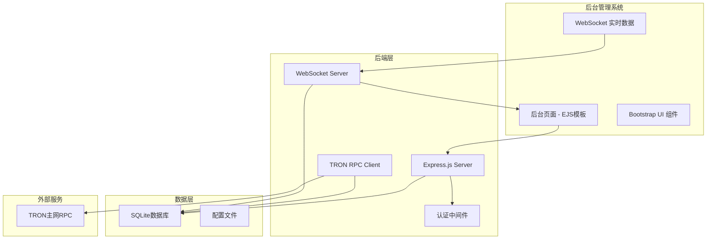
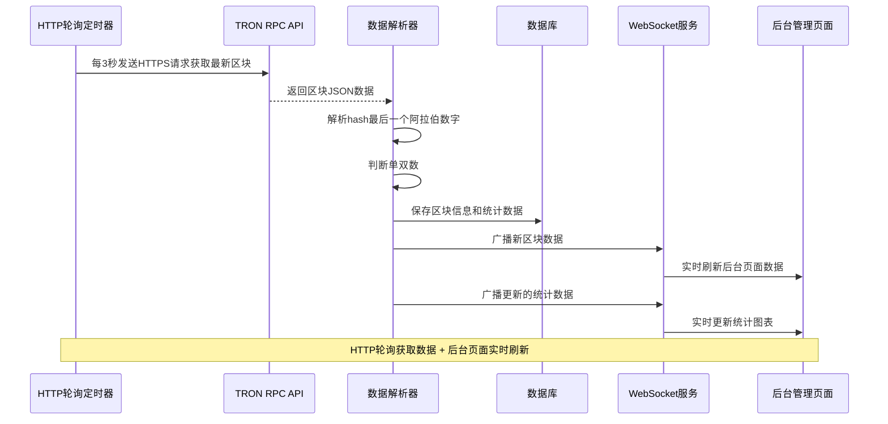
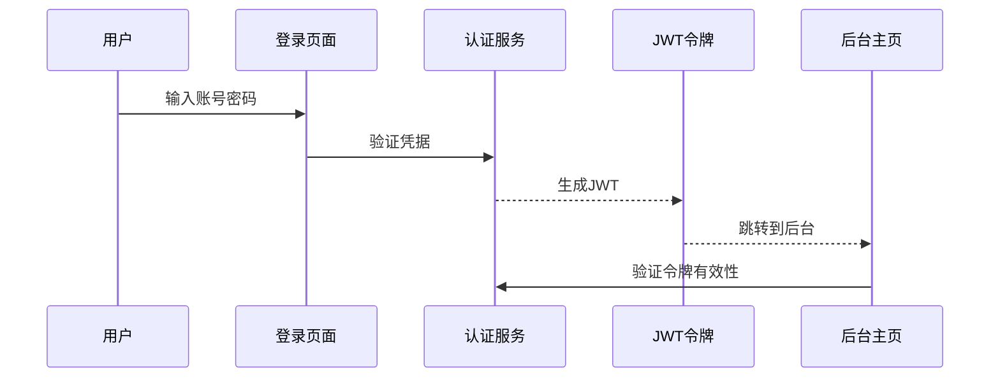

# 波场网络区块链后台管理系统设计

## 1. 项目概述

### 1.1 系统简介

Point-Tron 是一个基于 TypeScript 的波场网络区块链数据统计后台管理系统。该系统实时监控波场网络每 3 秒的出块情况，统计区块哈希最后一个阿拉伯数字的单双数规律，并提供可视化的数据分析界面。

### 1.2 核心功能

- 实时获取波场网络区块数据（每 3 秒）
- 区块哈希最后阿拉伯数字单双数统计分析
- 后台管理界面数据展示（图表、曲线图）
- 用户认证登录系统
- 实时数据刷新显示

### 1.3 技术栈

- **后端**: Node.js + TypeScript + Express.js
- **后台管理界面**: EJS 模板 + Bootstrap + JavaScript
- **数据库**: SQLite/PostgreSQL
- **区块链交互**: TRON RPC API
- **实时数据**: WebSocket(后台页面刷新)
- **图表库**: ECharts/Chart.js

## 2. 系统架构

### 2.1 整体架构图



### 2.2 核心模块设计

#### 2.2.1 区块数据采集模块



#### 2.2.2 用户认证流程



## 3. API 接口设计

### 3.1 认证相关接口

#### 登录接口

```
POST /api/auth/login
Content-Type: application/json

请求体:
{
  "username": "admin",
  "password": "password123"
}

响应:
{
  "success": true,
  "data": {
    "token": "eyJhbGciOiJIUzI1NiIsInR5cCI6IkpXVCJ9...",
    "user": {
      "id": 1,
      "username": "admin"
    }
  }
}
```

#### 验证令牌接口

```
POST /api/auth/verify
Authorization: Bearer {token}

响应:
{
  "success": true,
  "data": {
    "valid": true,
    "user": {
      "id": 1,
      "username": "admin"
    }
  }
}
```

### 3.2 区块数据接口

#### 获取实时区块统计

```
GET /api/blocks/stats
Authorization: Bearer {token}

响应:
{
  "success": true,
  "data": {
    "todayTotal": 28800,
    "todayOdd": 14420,
    "todayEven": 14380,
    "currentBlock": {
      "number": 65432109,
      "hash": "0x1a2b3c4d5e6f7890abcdef1234567890abcdef12",
      "timestamp": 1701234567,
      "lastDigit": 2,
      "isOdd": false
    }
  }
}
```

#### 获取历史统计数据

```
GET /api/blocks/history?date=2024-01-01
Authorization: Bearer {token}

响应:
{
  "success": true,
  "data": {
    "date": "2024-01-01",
    "totalBlocks": 28800,
    "oddCount": 14500,
    "evenCount": 14300,
    "hourlyStats": [
      {
        "hour": 0,
        "total": 1200,
        "odd": 610,
        "even": 590
      }
    ]
  }
}
```

### 3.3 配置管理接口

#### 获取 RPC 配置

```
GET /api/config/rpc
Authorization: Bearer {token}

响应:
{
  "success": true,
  "data": {
    "rpcUrl": "https://api.trongrid.io",
    "timeout": 5000,
    "retryTimes": 3,
    "pollingInterval": 3000,
    "isPollingActive": true
  }
}
```

#### 更新 RPC 配置

```
POST /api/config/rpc
Authorization: Bearer {token}
Content-Type: application/json

请求体:
{
  "rpcUrl": "https://api.trongrid.io",
  "timeout": 5000,
  "retryTimes": 3,
  "pollingInterval": 3000
}

响应:
{
  "success": true,
  "data": {
    "message": "RPC configuration updated successfully",
    "needRestart": true
  }
}
```

#### 控制 RPC 轮询

```
POST /api/config/rpc/polling
Authorization: Bearer {token}
Content-Type: application/json

请求体:
{
  "action": "start" // 或 "stop"
}

响应:
{
  "success": true,
  "data": {
    "status": "started", // 或 "stopped"
    "pollingInterval": 3000,
    "message": "RPC polling started successfully"
  }
}
```

#### 获取系统状态

````
GET /api/system/status
Authorization: Bearer {token}

响应:
{
  "success": true,
  "data": {
    "rpcPolling": {
      "isActive": true,
      "interval": 3000,
      "lastBlockTime": 1701234567,
      "consecutiveErrors": 0
    },
    "webSocket": {
      "isRunning": true,
      "connectedClients": 5,
      "messagesCount": 1024
    },
    "database": {
      "isConnected": true,
      "totalBlocks": 123456,
      "todayBlocks": 28800
    },
    "uptime": 86400,
    "lastUpdate": 1701234567
  }
}

## 4. 数据模型设计

### 4.1 数据库表结构

#### 用户表 (users)

| 字段       | 类型         | 描述     | 约束                        |
| ---------- | ------------ | -------- | --------------------------- |
| id         | INTEGER      | 主键     | PRIMARY KEY, AUTO_INCREMENT |
| username   | VARCHAR(50)  | 用户名   | UNIQUE, NOT NULL            |
| password   | VARCHAR(255) | 密码哈希 | NOT NULL                    |
| created_at | TIMESTAMP    | 创建时间 | DEFAULT CURRENT_TIMESTAMP   |
| updated_at | TIMESTAMP    | 更新时间 | DEFAULT CURRENT_TIMESTAMP   |

#### 区块数据表 (blocks)

| 字段         | 类型        | 描述                        | 约束                        |
| ------------ | ----------- | --------------------------- | --------------------------- |
| id           | INTEGER     | 主键                        | PRIMARY KEY, AUTO_INCREMENT |
| block_number | BIGINT      | 区块号                      | UNIQUE, NOT NULL            |
| block_hash   | VARCHAR(66) | 区块哈希                    | NOT NULL                    |
| timestamp    | BIGINT      | 时间戳                      | NOT NULL                    |
| last_digit   | INTEGER     | 哈希最后一个阿拉伯数字(0-9) | NOT NULL                    |
| is_odd       | BOOLEAN     | 是否为单数                  | NOT NULL                    |
| created_at   | TIMESTAMP   | 记录创建时间                | DEFAULT CURRENT_TIMESTAMP   |

#### 统计数据表 (daily_stats)

| 字段         | 类型      | 描述     | 约束                        |
| ------------ | --------- | -------- | --------------------------- |
| id           | INTEGER   | 主键     | PRIMARY KEY, AUTO_INCREMENT |
| date         | DATE      | 统计日期 | UNIQUE, NOT NULL            |
| total_blocks | INTEGER   | 总区块数 | DEFAULT 0                   |
| odd_count    | INTEGER   | 单数个数 | DEFAULT 0                   |
| even_count   | INTEGER   | 双数个数 | DEFAULT 0                   |
| updated_at   | TIMESTAMP | 更新时间 | DEFAULT CURRENT_TIMESTAMP   |

#### 系统配置表 (config)

| 字段        | 类型         | 描述     | 约束                        |
| ----------- | ------------ | -------- | --------------------------- |
| id          | INTEGER      | 主键     | PRIMARY KEY, AUTO_INCREMENT |
| key         | VARCHAR(100) | 配置键   | UNIQUE, NOT NULL            |
| value       | TEXT         | 配置值   | NOT NULL                    |
| description | VARCHAR(255) | 配置描述 | NULL                        |
| updated_at  | TIMESTAMP    | 更新时间 | DEFAULT CURRENT_TIMESTAMP   |

## 5. 后台管理界面设计

### 5.1 整体布局结构

```mermaid
graph LR
    subgraph "后台管理界面"
        A[侧边导航菜单]
        B[顶部操作栏]
        C[主内容区域]
        D[底部状态栏]
    end

    A --> A1[仪表盘]
    A --> A2[实时监控]
    A --> A3[历史统计]
    A --> A4[系统配置]
    A --> A5[用户管理]
````

### 5.2 色彩设计规范

#### 主题色彩配置

- **主色调**: 草深绿色 (#2F5233, #1B3A1F)
- **辅助色**: 优雅黑色 (#1C1C1C, #2A2A2A)
- **背景色**: 浅灰色 (#F5F5F5, #FAFAFA)
- **文本色**: 深灰色 (#262626, #595959)
- **边框色**: 浅灰色 (#D9D9D9, #F0F0F0)

#### Ant Design 主题定制 (适用于 EJS 模板中的组件样式)

```css
/* 后台管理系统主题样式 */
:root {
  --primary-color: #2f5233;
  --success-color: #2f5233;
  --info-color: #1890ff;
  --warning-color: #faad14;
  --error-color: #f5222d;
  --text-color: #1c1c1c;
  --bg-color: #ffffff;
  --container-bg: #fafafa;
}

.sidebar {
  background-color: #1c1c1c;
  color: #ffffff;
}

.header {
  background-color: #ffffff;
  border-bottom: 1px solid #f0f0f0;
}

.menu-item.active {
  background-color: #2f5233;
}
```

### 5.3 后台页面功能设计

**设计理念**: 后台管理系统不需要 WebSocket 实时推送，原因如下：

1. 管理员不需要时时刻刻监控数据，手动刷新或定时刷新即可
2. 减少系统复杂度，避免维护 WebSocket 连接
3. 后台页面通常不会长时间打开，按需查看即可
4. 数据查询方式更简单可靠，直接从数据库获取最新数据

#### 5.3.1 登录页面

- 居中布局的登录表单
- 用户名和密码输入框
- 草深绿色登录按钮
- 背景采用渐变色（优雅黑到深灰）

#### 5.3.2 仪表盘页面 (后台主页)

- 今日区块统计卡片
- 单双数比例饼图
- 实时区块流水信息
- 24 小时趋势曲线图
- **手动刷新或定时刷新页面**

#### 5.3.3 实时监控页面

- 实时区块信息表格
- 哈希最后一位数字分布图
- 单双数实时计数器
- **页面刷新按钮 + 数据更新时间显示**

#### 5.3.4 历史统计页面

- 日期选择器
- 历史数据表格
- 单双数趋势图表
- 数据导出功能

#### 5.3.5 系统配置页面

- TRON RPC 节点配置表单
- 数据采集间隔设置 (3 秒轮询)
- 数据库清理配置
- 系统状态监控

## 6. 核心业务逻辑

### 6.1 区块数据采集逻辑

#### 6.1.0 数据采集工作流程

**每 3 秒 HTTP 请求波场网络的完整流程：**

1. **发送 HTTP 请求**: 系统每 3 秒向 TRON 波场网络发送 HTTPS POST 请求

   - 请求 URL: `https://api.trongrid.io/wallet/getnowblock`
   - 请求方式: POST
   - 请求体: `{}`

2. **获取区块数据**: 从响应中获取最新区块信息

   - 区块号: `blockData.block_header.raw_data.number`
   - 区块哈希: `blockData.blockID`
   - 时间戳: `blockData.block_header.raw_data.timestamp`

3. **解析哈希数字**: 从区块哈希中提取最后一个阿拉伯数字

   - 例: `0xabcdef123456` → 最后一个数字是 `6`
   - 例: `0xabcdef12345a` → 最后一个数字是 `5`

4. **判断单双数**: 根据最后一个数字判断是单数还是双数

   - 单数: 1, 3, 5, 7, 9
   - 双数: 0, 2, 4, 6, 8

5. **写入数据库**: 将区块信息和单双数结果保存到 SQLite 数据库

   - 保存到 `blocks` 表
   - 更新 `daily_stats` 表的当日统计

6. **后台页面显示**: 管理员访问后台页面时，直接从数据库查询最新统计数据并显示

#### 6.1.1 TRON RPC 交互服务

```typescript
class TronRPCService {
  private rpcUrl: string;
  private timeout: number;
  private retryTimes: number;
  private pollingInterval: NodeJS.Timeout | null = null;
  private isPolling: boolean = false;

  constructor(config: { rpcUrl: string; timeout: number; retryTimes: number }) {
    this.rpcUrl = config.rpcUrl;
    this.timeout = config.timeout || 5000;
    this.retryTimes = config.retryTimes || 3;
  }

  // 启动3秒轮询
  startPolling(callback: (blockInfo: BlockInfo) => void): void {
    if (this.isPolling) {
      console.warn("Polling is already running");
      return;
    }

    this.isPolling = true;
    this.pollingInterval = setInterval(async () => {
      try {
        const latestBlock = await this.getLatestBlock();
        callback(latestBlock);
      } catch (error) {
        console.error("Polling error:", error);
        // 继续轮询，不中断
      }
    }, 3000); // 每3秒执行一次

    console.log("Started TRON RPC polling every 3 seconds");
  }

  // 停止轮询
  stopPolling(): void {
    if (this.pollingInterval) {
      clearInterval(this.pollingInterval);
      this.pollingInterval = null;
    }
    this.isPolling = false;
    console.log("Stopped TRON RPC polling");
  }

  // 获取最新区块信息
  async getLatestBlock(): Promise<BlockInfo> {
    // TRON波场网络获取最新区块的API
    const response = await fetch(`${this.rpcUrl}/wallet/getnowblock`, {
      method: "POST",
      headers: {
        "Content-Type": "application/json",
      },
      body: JSON.stringify({}),
    });

    if (!response.ok) {
      throw new Error(`HTTP ${response.status}: ${response.statusText}`);
    }

    const blockData = await response.json();
    return this.parseTronBlockResponse(blockData);
  }

  // 根据区块号获取区块信息
  async getBlockByNumber(blockNumber: number): Promise<BlockInfo> {
    const response = await fetch(`${this.rpcUrl}/wallet/getblockbynum`, {
      method: "POST",
      headers: {
        "Content-Type": "application/json",
      },
      body: JSON.stringify({
        num: blockNumber,
      }),
    });

    if (!response.ok) {
      throw new Error(`HTTP ${response.status}: ${response.statusText}`);
    }

    const blockData = await response.json();
    return this.parseTronBlockResponse(blockData);
  }

  // 执行HTTPS请求
  private async makeHttpRequest(requestData: any): Promise<BlockInfo> {
    let lastError: Error;

    for (let attempt = 1; attempt <= this.retryTimes; attempt++) {
      try {
        const response = await fetch(this.rpcUrl, {
          method: "POST",
          headers: {
            "Content-Type": "application/json",
            "User-Agent": "Point-Tron/1.0",
          },
          body: JSON.stringify(requestData),
          signal: AbortSignal.timeout(this.timeout),
        });

        if (!response.ok) {
          throw new Error(`HTTP ${response.status}: ${response.statusText}`);
        }

        const data = await response.json();

        if (data.error) {
          throw new Error(`RPC Error: ${data.error.message}`);
        }

        return this.parseBlockResponse(data.result);
      } catch (error) {
        lastError = error as Error;
        console.warn(`RPC request attempt ${attempt} failed:`, error.message);

        if (attempt < this.retryTimes) {
          // 等待一段时间后重试
          await new Promise((resolve) => setTimeout(resolve, 1000 * attempt));
        }
      }
    }

    throw new Error(
      `RPC request failed after ${this.retryTimes} attempts: ${lastError.message}`
    );
  }

  // 解析TRON波场区块响应数据
  private parseTronBlockResponse(blockData: any): BlockInfo {
    // TRON区块结构解析
    const blockHash = blockData.blockID; // TRON区块哈希
    const blockNumber = blockData.block_header.raw_data.number;
    const timestamp = blockData.block_header.raw_data.timestamp;

    // 从哈希中提取最后一个阿拉伯数字
    const lastDigit = this.parseBlockHash(blockHash);

    return {
      number: blockNumber,
      hash: blockHash,
      timestamp: timestamp,
      lastDigit: lastDigit,
      isOdd: lastDigit % 2 === 1,
    };
  }

  private parseBlockHash(hash: string): number {
    // 从哈希末尾开始查找最后一个阿拉伯数字(0-9)
    // 示例: "0x1a2b3c4d5e6f7890abcdef1234567890abcdef12" -> 最后一个数字是 "2"
    // 示例: "0x1a2b3c4d5e6f7890abcdef1234567890abcdefab" -> 最后一个数字是 "0" (在abcdefab之前，即双数)
    for (let i = hash.length - 1; i >= 0; i--) {
      const char = hash[i];
      if (/[0-9]/.test(char)) {
        return parseInt(char);
      }
    }
    // 如果没有找到数字，返回0作为默认值
    return 0;
  }

  // 获取连接状态
  getStatus(): { isPolling: boolean; rpcUrl: string } {
    return {
      isPolling: this.isPolling,
      rpcUrl: this.rpcUrl,
    };
  }
}
```

#### 6.1.2 数据统计逻辑

```typescript
class BlockStatService {
  private db: Database; // 数据库连接

  constructor(database: Database) {
    this.db = database;
  }

  // 记录区块信息到数据库
  async recordBlock(blockInfo: BlockInfo): Promise<void> {
    const transaction = this.db.transaction();

    try {
      // 1. 检查区块是否已存在
      const existingBlock = await this.db.query(
        "SELECT id FROM blocks WHERE block_number = ?",
        [blockInfo.number]
      );

      if (existingBlock.length > 0) {
        console.log(`Block ${blockInfo.number} already exists, skipping`);
        return;
      }

      // 2. 插入新区块记录
      await this.db.execute(
        `INSERT INTO blocks (
          block_number, 
          block_hash, 
          timestamp, 
          last_digit, 
          is_odd,
          created_at
        ) VALUES (?, ?, ?, ?, ?, ?)`,
        [
          blockInfo.number,
          blockInfo.hash,
          blockInfo.timestamp,
          blockInfo.lastDigit,
          blockInfo.isOdd,
          new Date().toISOString(),
        ]
      );

      // 3. 更新当日统计数据
      await this.updateDailyStats(blockInfo);

      await transaction.commit();

      console.log(
        `Block ${blockInfo.number} saved: hash=${blockInfo.hash}, lastDigit=${blockInfo.lastDigit}, isOdd=${blockInfo.isOdd}`
      );
    } catch (error) {
      await transaction.rollback();
      throw new Error(`Failed to record block: ${error.message}`);
    }
  }

  // 更新当日统计数据
  private async updateDailyStats(blockInfo: BlockInfo): Promise<void> {
    const today = new Date().toISOString().split("T")[0]; // YYYY-MM-DD

    // 获取或创建当日统计记录
    let dailyStat = await this.db.query(
      "SELECT * FROM daily_stats WHERE date = ?",
      [today]
    );

    if (dailyStat.length === 0) {
      // 创建新的当日统计
      await this.db.execute(
        `INSERT INTO daily_stats (date, total_blocks, odd_count, even_count, updated_at) 
         VALUES (?, 1, ?, ?, ?)`,
        [
          today,
          blockInfo.isOdd ? 1 : 0,
          blockInfo.isOdd ? 0 : 1,
          new Date().toISOString(),
        ]
      );
    } else {
      // 更新现有统计
      const updateSql = blockInfo.isOdd
        ? `UPDATE daily_stats SET 
           total_blocks = total_blocks + 1, 
           odd_count = odd_count + 1, 
           updated_at = ? 
           WHERE date = ?`
        : `UPDATE daily_stats SET 
           total_blocks = total_blocks + 1, 
           even_count = even_count + 1, 
           updated_at = ? 
           WHERE date = ?`;

      await this.db.execute(updateSql, [new Date().toISOString(), today]);
    }
  }

  // 获取当日统计数据
  async getTodayStats(): Promise<DailyStats> {
    const today = new Date().toISOString().split("T")[0];

    const result = await this.db.query(
      "SELECT * FROM daily_stats WHERE date = ?",
      [today]
    );

    if (result.length === 0) {
      return {
        date: today,
        totalBlocks: 0,
        oddCount: 0,
        evenCount: 0,
      };
    }

    const stat = result[0];
    return {
      date: stat.date,
      totalBlocks: stat.total_blocks,
      oddCount: stat.odd_count,
      evenCount: stat.even_count,
    };
  }

  // 获取历史统计数据
  async getHistoryStats(date: string): Promise<DailyStats> {
    const result = await this.db.query(
      "SELECT * FROM daily_stats WHERE date = ?",
      [date]
    );

    if (result.length === 0) {
      return {
        date: date,
        totalBlocks: 0,
        oddCount: 0,
        evenCount: 0,
      };
    }

    const stat = result[0];
    return {
      date: stat.date,
      totalBlocks: stat.total_blocks,
      oddCount: stat.odd_count,
      evenCount: stat.even_count,
    };
  }

  // 获取最近N个区块
  async getRecentBlocks(limit: number = 100): Promise<BlockInfo[]> {
    const result = await this.db.query(
      `SELECT * FROM blocks 
       ORDER BY block_number DESC 
       LIMIT ?`,
      [limit]
    );

    return result.map((row) => ({
      number: row.block_number,
      hash: row.block_hash,
      timestamp: row.timestamp,
      lastDigit: row.last_digit,
      isOdd: Boolean(row.is_odd),
    }));
  }

  // 判断是否为单数
  private isOddNumber(lastDigit: number): boolean {
    return lastDigit % 2 === 1;
  }
}
```

### 6.2 定时任务调度

#### 6.2.1 区块监控任务

```typescript
class BlockMonitorTask {
  private tronRPC: TronRPCService;
  private blockStatService: BlockStatService;
  private webSocketService: WebSocketService;
  private isRunning: boolean = false;

  constructor(
    tronRPC: TronRPCService,
    blockStatService: BlockStatService,
    webSocketService: WebSocketService
  ) {
    this.tronRPC = tronRPC;
    this.blockStatService = blockStatService;
    this.webSocketService = webSocketService;
  }

  // 启动监控任务
  start(): void {
    if (this.isRunning) {
      console.warn("Block monitor is already running");
      return;
    }

    this.isRunning = true;

    // 启动RPC轮询（每3秒一次）
    this.tronRPC.startPolling(async (blockData: BlockInfo) => {
      await this.handleNewBlock(blockData);
    });

    console.log("Block monitor started with 3-second HTTPS polling");
  }

  // 停止监控任务
  stop(): void {
    if (!this.isRunning) {
      return;
    }

    this.isRunning = false;
    this.tronRPC.stopPolling();
    console.log("Block monitor stopped");
  }

  // 处理新区块数据
  private async handleNewBlock(blockData: BlockInfo): Promise<void> {
    try {
      // 1. 保存到数据库
      await this.blockStatService.recordBlock(blockData);

      // 2. 获取更新后的统计数据
      const todayStats = await this.blockStatService.getTodayStats();

      // 3. 通过WebSocket实时推送新区块信息
      this.webSocketService.broadcastBlockUpdate({
        ...blockData,
        timestamp: Date.now(), // 添加实时时间戳
      });

      // 4. 通过WebSocket推送更新的统计数据
      this.webSocketService.broadcastStatsUpdate(todayStats);

      console.log(
        `New block processed: ${blockData.number}, last digit: ${blockData.lastDigit}, isOdd: ${blockData.isOdd}`
      );
    } catch (error) {
      console.error("Error handling new block:", error);

      // 发送错误信息到WebSocket客户端
      this.webSocketService.broadcast({
        type: "ERROR",
        data: {
          message: "Block processing error",
          blockNumber: blockData.number,
          error: error.message,
        },
      });
    }
  }

  // 获取监控状态
  getStatus(): {
    isRunning: boolean;
    rpcStatus: { isPolling: boolean; rpcUrl: string };
    wsConnections: number;
  } {
    return {
      isRunning: this.isRunning,
      rpcStatus: this.tronRPC.getStatus(),
      wsConnections: this.webSocketService.getConnectionCount(),
    };
  }
}
```

### 6.3 WebSocket 实时推送

#### 6.3.1 实时数据推送逻辑

```typescript
class WebSocketService {
  private wss: WebSocketServer;
  private clients: Set<WebSocket> = new Set();

  constructor(port: number) {
    this.wss = new WebSocketServer({ port });
    this.setupWebSocketServer();
  }

  private setupWebSocketServer(): void {
    this.wss.on("connection", (ws: WebSocket, request) => {
      console.log(
        "New WebSocket connection from:",
        request.socket.remoteAddress
      );

      // 添加客户端到集合
      this.clients.add(ws);

      // 发送欢迎消息
      ws.send(
        JSON.stringify({
          type: "CONNECTED",
          data: {
            message: "Connected to Point-Tron WebSocket",
            timestamp: Date.now(),
          },
        })
      );

      // 处理客户端消息
      ws.on("message", (message: string) => {
        try {
          const data = JSON.parse(message);
          this.handleClientMessage(ws, data);
        } catch (error) {
          console.error("Invalid WebSocket message:", error);
        }
      });

      // 处理连接关闭
      ws.on("close", () => {
        this.clients.delete(ws);
        console.log(
          "WebSocket connection closed. Active connections:",
          this.clients.size
        );
      });

      // 处理连接错误
      ws.on("error", (error) => {
        console.error("WebSocket error:", error);
        this.clients.delete(ws);
      });
    });

    console.log(`WebSocket server started on port ${this.wss.options.port}`);
  }

  private handleClientMessage(ws: WebSocket, data: any): void {
    switch (data.type) {
      case "PING":
        ws.send(
          JSON.stringify({
            type: "PONG",
            data: { timestamp: Date.now() },
          })
        );
        break;
      case "SUBSCRIBE":
        // 客户端订阅特定数据类型
        console.log("Client subscribed to:", data.data);
        break;
      default:
        console.log("Unknown message type:", data.type);
    }
  }

  // 广播消息给所有客户端
  broadcast(data: any): void {
    const message = JSON.stringify(data);
    let sentCount = 0;

    this.clients.forEach((client) => {
      if (client.readyState === WebSocket.OPEN) {
        try {
          client.send(message);
          sentCount++;
        } catch (error) {
          console.error("Error sending message to client:", error);
          this.clients.delete(client);
        }
      } else {
        // 清理已关闭的连接
        this.clients.delete(client);
      }
    });

    console.log(`Broadcasted message to ${sentCount} clients`);
  }

  // 广播区块更新
  broadcastBlockUpdate(blockData: BlockInfo): void {
    this.broadcast({
      type: "BLOCK_UPDATE",
      data: blockData,
      timestamp: Date.now(),
    });
  }

  // 广播统计数据更新
  broadcastStatsUpdate(stats: DailyStats): void {
    this.broadcast({
      type: "STATS_UPDATE",
      data: stats,
      timestamp: Date.now(),
    });
  }

  // 广播系统状态
  broadcastSystemStatus(status: any): void {
    this.broadcast({
      type: "SYSTEM_STATUS",
      data: status,
      timestamp: Date.now(),
    });
  }

  // 获取连接数
  getConnectionCount(): number {
    return this.clients.size;
  }

  // 关闭所有连接
  closeAllConnections(): void {
    this.clients.forEach((client) => {
      if (client.readyState === WebSocket.OPEN) {
        client.close();
      }
    });
    this.clients.clear();
  }

  // 关闭WebSocket服务器
  close(): void {
    this.closeAllConnections();
    this.wss.close();
    console.log("WebSocket server closed");
  }
}
```

## 7. 安全设计

### 7.1 认证授权机制

#### 7.1.1 JWT 令牌认证

- 使用 JWT 进行用户身份验证
- 令牌有效期设置为 24 小时
- 支持令牌刷新机制

#### 7.1.2 密码安全

- 使用 bcrypt 进行密码哈希
- 盐值长度至少 12 位
- 密码复杂度要求

### 7.2 API 安全防护

#### 7.2.1 请求限制

- 接口访问频率限制
- IP 白名单机制
- 请求大小限制

#### 7.2.2 数据验证

- 输入参数验证
- SQL 注入防护
- XSS 攻击防护

## 8. 性能优化

### 8.1 数据库优化

#### 8.1.1 索引设计

```sql
-- 区块表索引
CREATE INDEX idx_blocks_timestamp ON blocks(timestamp);
CREATE INDEX idx_blocks_date ON blocks(DATE(created_at));
CREATE UNIQUE INDEX idx_blocks_number ON blocks(block_number);

-- 统计表索引
CREATE UNIQUE INDEX idx_daily_stats_date ON daily_stats(date);
```

#### 8.1.2 数据清理策略

- 定期清理 30 天前的详细区块数据
- 保留每日统计数据用于历史分析
- 数据压缩和归档机制

### 8.2 缓存策略

#### 8.2.1 Redis 缓存

- 当日统计数据缓存（5 分钟过期）
- 最新区块信息缓存（10 秒过期）
- 配置信息缓存（1 小时过期）

### 8.3 前端优化

#### 8.3.1 组件懒加载

- 路由级别的代码分割
- 图表组件按需加载
- 图片资源懒加载

#### 8.3.2 数据优化

- 虚拟滚动处理大量数据
- 图表数据采样显示
- WebSocket 数据节流处理

## 9. 监控与日志

### 9.1 系统监控

#### 9.1.1 健康检查

```typescript
app.get("/health", (req, res) => {
  res.json({
    status: "healthy",
    timestamp: new Date().toISOString(),
    uptime: process.uptime(),
    database: "connected",
    rpc: "connected",
  });
});
```

#### 9.1.2 性能指标

- RPC 请求响应时间
- 数据库查询性能
- WebSocket 连接数
- 内存使用情况

### 9.2 日志管理

#### 9.2.1 日志分级

- ERROR: 系统错误和异常
- WARN: 警告信息和性能问题
- INFO: 重要业务事件
- DEBUG: 调试信息

#### 9.2.2 日志格式

```typescript
const logger = {
  error: (message: string, meta?: any) => {
    console.error(
      JSON.stringify({
        level: "ERROR",
        timestamp: new Date().toISOString(),
        message,
        meta,
      })
    );
  },
};
```

## 10. 部署配置

### 10.1 环境配置

#### 10.1.1 环境变量

```bash
# 服务配置
PORT=3000
NODE_ENV=production

# 数据库配置
DB_PATH=./data/blockchain.db

# JWT配置
JWT_SECRET=your-super-secret-key
JWT_EXPIRES_IN=24h

# TRON波场网络配置
TRON_RPC_URL=https://api.trongrid.io
TRON_RPC_TIMEOUT=5000
TRON_RPC_RETRY_TIMES=3
TRON_POLLING_INTERVAL=3000

# WebSocket配置
WS_PORT=3001
```

### 10.2 Docker 部署

#### 10.2.1 Dockerfile

```dockerfile
FROM node:18-alpine

WORKDIR /app

COPY package*.json ./
RUN npm ci --only=production

COPY dist ./dist
COPY public ./public

EXPOSE 3000 3001

CMD ["npm", "start"]
```

### 10.3 进程管理

#### 10.3.1 PM2 配置

```json
{
  "name": "point-tron",
  "script": "dist/index.js",
  "instances": 1,
  "env": {
    "NODE_ENV": "production",
    "PORT": 3000
  },
  "error_file": "./logs/err.log",
  "out_file": "./logs/out.log",
  "log_file": "./logs/combined.log"
}
```
