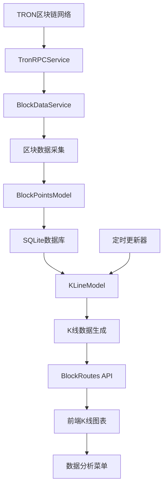
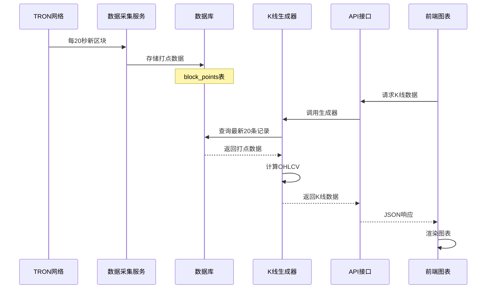
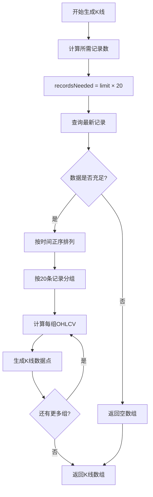
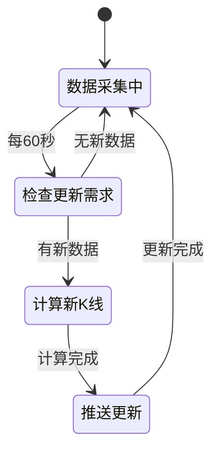
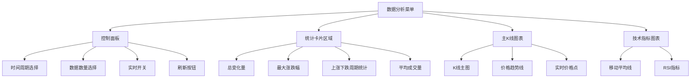
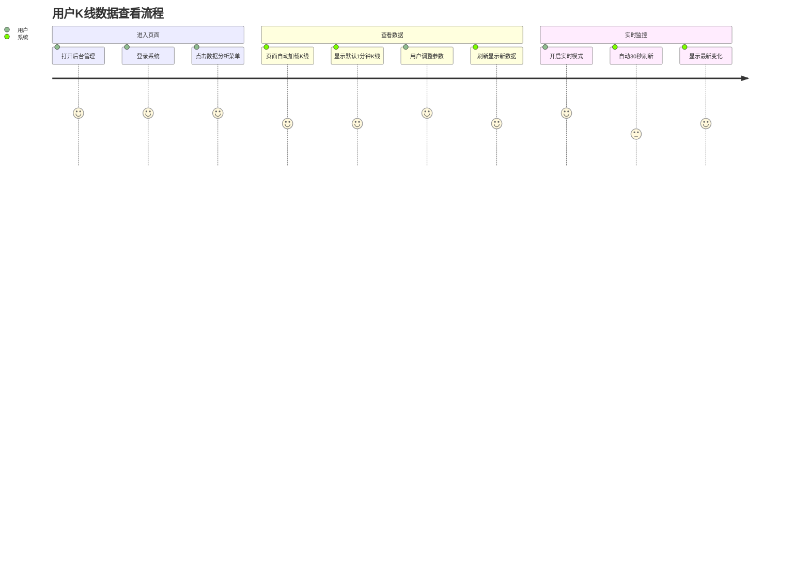
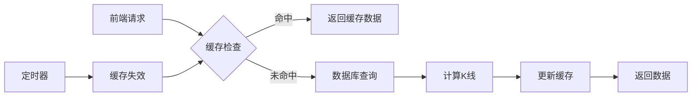
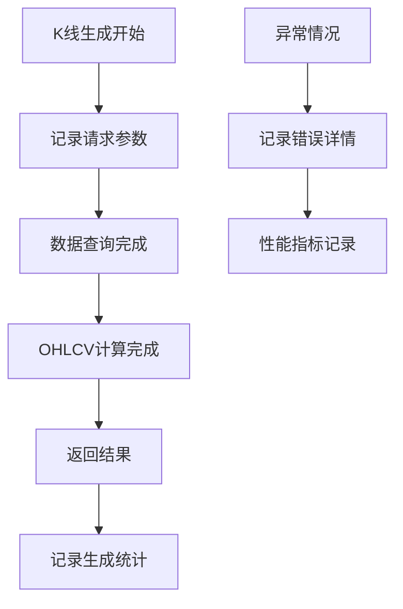

# 数据库 K 线数据生成设计文档

## 项目概述

Point-Tron 是基于 TRON 区块链的数据统计后台管理系统。本设计文档描述了如何将数据库中每 20 秒打点一次的区块数据转换为 1 分钟 K 线图，实现每分钟 20 条打点记录生成一个 1 分钟 K 线数据点，并在数据分析菜单中进行展示。

## 技术栈分析

系统采用以下技术栈：

- **后端框架**: Node.js + Express + TypeScript
- **数据库**: SQLite3
- **前端**: HTML + CSS + JavaScript + Chart.js
- **模板引擎**: EJS
- **定时任务**: node-cron
- **区块链接口**: TRON RPC API

## 系统架构

### 核心组件关系



### 数据流架构



## 数据模型设计

### 区块打点数据表结构

| 字段名           | 类型     | 描述             |
| ---------------- | -------- | ---------------- |
| id               | INTEGER  | 主键 ID          |
| block_number     | INTEGER  | 区块号           |
| block_hash       | TEXT     | 区块哈希         |
| timestamp        | INTEGER  | 时间戳(毫秒)     |
| last_digit       | INTEGER  | 区块哈希末位数字 |
| is_odd           | BOOLEAN  | 是否为奇数       |
| point_change     | INTEGER  | 分数变化(+1/-1)  |
| cumulative_score | INTEGER  | 累积分数         |
| created_at       | DATETIME | 创建时间         |

### K 线数据结构

| 字段名    | 类型   | 描述                   |
| --------- | ------ | ---------------------- |
| timestamp | number | K 线时间戳             |
| open      | number | 开盘价(周期开始分数)   |
| high      | number | 最高价(周期内最高分数) |
| low       | number | 最低价(周期内最低分数) |
| close     | number | 收盘价(周期结束分数)   |
| volume    | number | 成交量(记录数量)       |

## 核心业务逻辑设计

### 1 分钟 K 线生成算法

#### 数据获取策略



#### OHLCV 计算逻辑

**数据聚合规则：**

- **开盘价 (Open)**: 20 条记录中第 1 条的累积分数
- **收盘价 (Close)**: 20 条记录中第 20 条的累积分数
- **最高价 (High)**: 20 条记录中累积分数的最大值
- **最低价 (Low)**: 20 条记录中累积分数的最小值
- **成交量 (Volume)**: 固定为 20(记录数量)

#### 时间戳处理

K 线时间戳采用向下取整到分钟的策略：

```
minuteTimestamp = Math.floor(timestamp / 60000) × 60000
```

### 实时更新机制

#### 定时更新策略



#### 前端实时刷新

| 更新模式 | 刷新间隔 | 数据范围                   |
| -------- | -------- | -------------------------- |
| 实时模式 | 30 秒    | 当前未完成 K 线 + 历史数据 |
| 普通模式 | 手动刷新 | 完整历史 K 线数据          |

## API 接口设计

### 核心接口规范

#### 1. 1 分钟 K 线数据接口

**请求格式:**

```
GET /api/blocks/kline/1minute?limit=100
```

**参数说明:**
| 参数 | 类型 | 必需 | 默认值 | 描述 |
|------|------|------|--------|------|
| limit | number | 否 | 100 | 生成 K 线数量 |

**响应格式:**

```json
{
  "success": true,
  "data": {
    "klineData": [
      {
        "timestamp": 1703123400000,
        "open": 156,
        "high": 158,
        "low": 154,
        "close": 157,
        "volume": 20
      }
    ],
    "timeFrame": "1分钟",
    "candleCount": 100,
    "recordsPerCandle": 20,
    "description": "每个1分钟K线由20条3秒记录生成，共100个K线"
  }
}
```

#### 2. 实时 K 线数据接口

**请求格式:**

```
GET /api/blocks/kline?period=1m&limit=100&realtime=true
```

**响应包含:**

- 历史完整 K 线数据
- 当前正在形成的 K 线数据
- 实时状态标识

### 错误处理策略

| 错误类型 | HTTP 状态码 | 错误消息                     |
| -------- | ----------- | ---------------------------- |
| 数据不足 | 200         | 返回空数组，前端显示暂无数据 |
| 参数错误 | 400         | 参数验证失败信息             |
| 服务异常 | 500         | 服务器内部错误               |

## 前端展示设计

### 数据分析菜单集成

#### 页面布局结构



#### 图表配置参数

| 配置项   | 设置值      | 用途                 |
| -------- | ----------- | -------------------- |
| 默认周期 | 1 分钟      | 对应 20 条记录聚合   |
| 默认数量 | 100 条 K 线 | 平衡性能与数据完整性 |
| 实时刷新 | 30 秒       | 及时反映最新数据变化 |
| 图表类型 | 线图+区域图 | 清晰展示价格趋势     |

### 用户交互流程



## 性能优化策略

### 数据查询优化

#### 索引策略

- **主索引**: block_number (主键，自动索引)
- **时间索引**: timestamp (提升时间范围查询性能)
- **复合索引**: (timestamp, cumulative_score) (优化 K 线计算)

#### 查询限制

| 限制类型       | 限制值   | 原因             |
| -------------- | -------- | ---------------- |
| 最大查询记录数 | 10000 条 | 防止内存溢出     |
| 最大 K 线数量  | 500 个   | 前端渲染性能     |
| 实时更新间隔   | 30 秒    | 平衡实时性与性能 |

### 缓存机制设计



#### 缓存策略

- **缓存类型**: 内存缓存
- **缓存时间**: 1 分钟
- **缓存键**: period + limit + realtime 标识
- **失效机制**: 时间过期 + 新数据触发

## 监控与日志

### 关键指标监控

| 监控指标     | 阈值    | 告警条件      |
| ------------ | ------- | ------------- |
| K 线生成延迟 | < 100ms | 超过 500ms    |
| 数据完整性   | 100%    | 缺失记录 > 1% |
| API 响应时间 | < 200ms | 超过 1 秒     |
| 内存使用率   | < 80%   | 超过 90%      |

### 日志记录策略

#### 日志级别定义

- **INFO**: K 线生成成功，数据统计信息
- **WARN**: 数据不足，缓存未命中
- **ERROR**: 数据库连接失败，计算异常
- **DEBUG**: 详细的计算过程，性能数据

#### 关键日志事件



## 扩展性考虑

### 多时间周期支持

未来可扩展支持的时间周期：

- **3 分钟**: 60 条记录聚合
- **5 分钟**: 100 条记录聚合
- **15 分钟**: 300 条记录聚合
- **1 小时**: 1200 条记录聚合

### 技术指标扩展

可增加的技术分析指标：

- **MACD**: 指数平滑移动平均线
- **布林带**: 价格波动带
- **KDJ**: 随机指标
- **成交量指标**: 如 OBV 等

### 数据存储优化

长期优化方案：

- **数据分区**: 按月份分区存储
- **历史数据归档**: 压缩旧数据
- **读写分离**: 提升查询性能
- **数据预聚合**: 预计算常用周期 K 线
