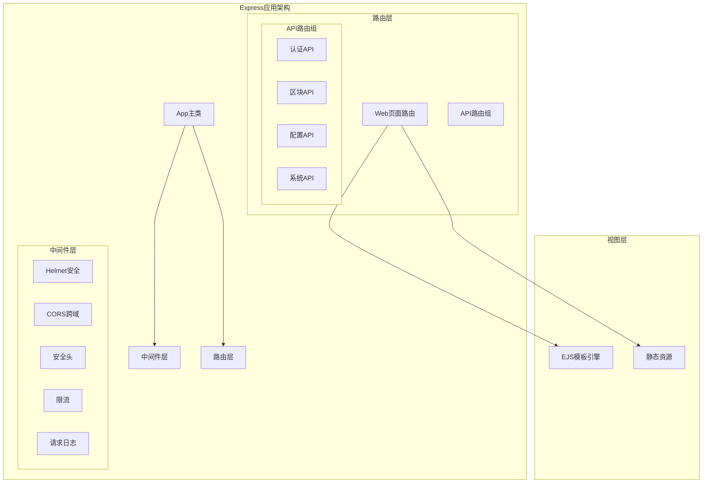
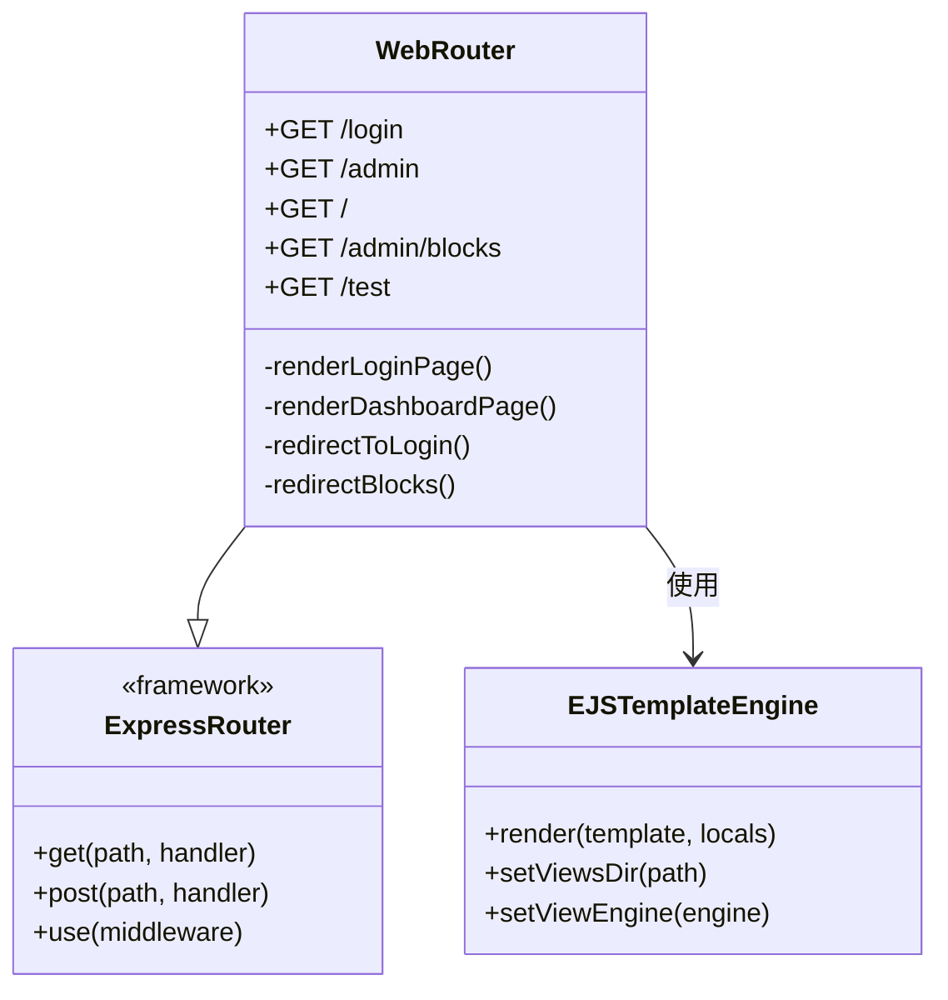
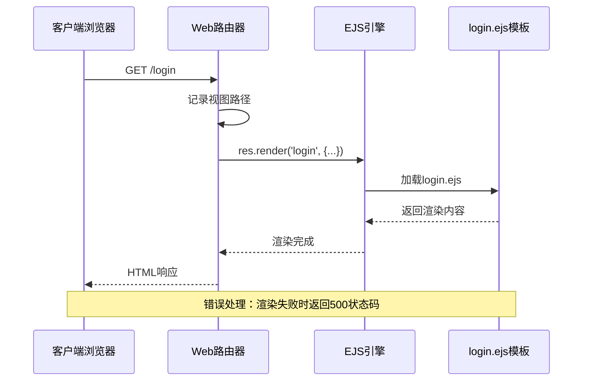
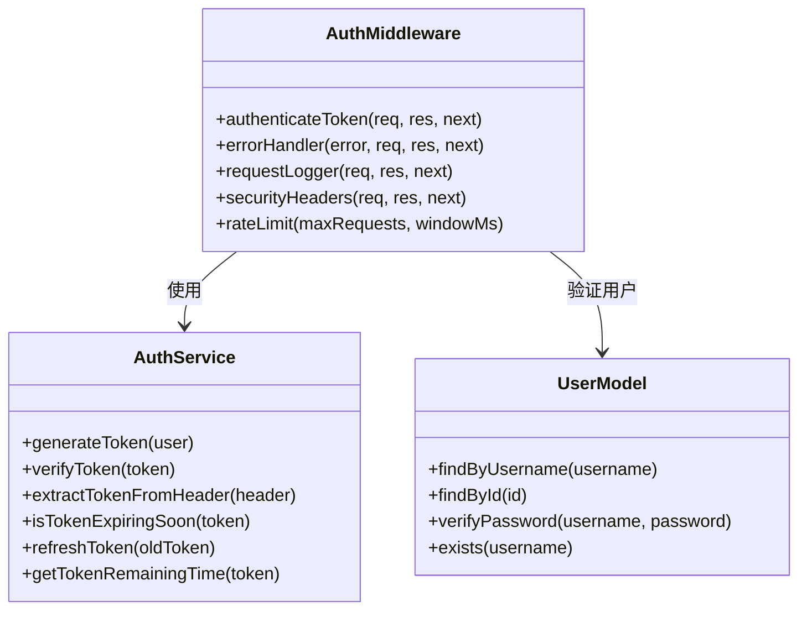
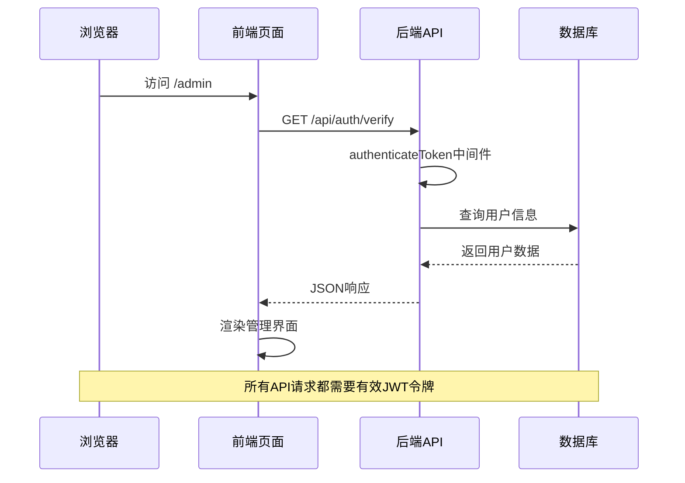
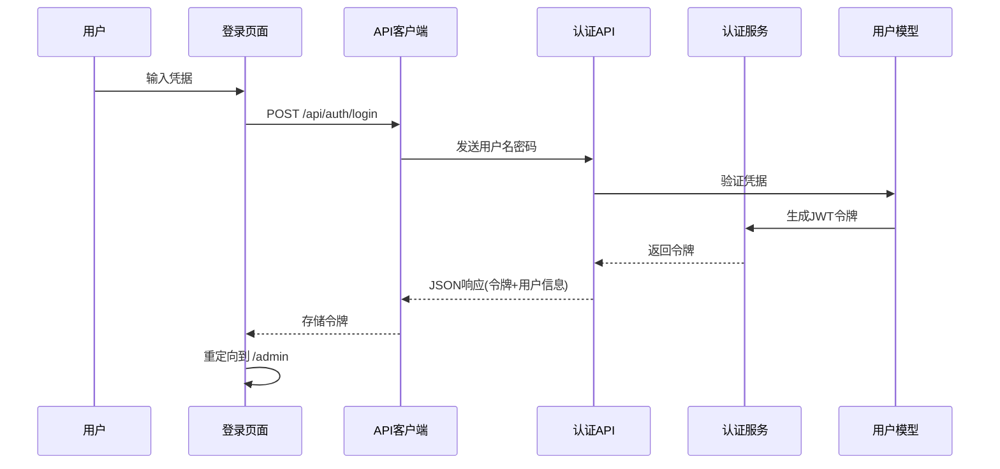
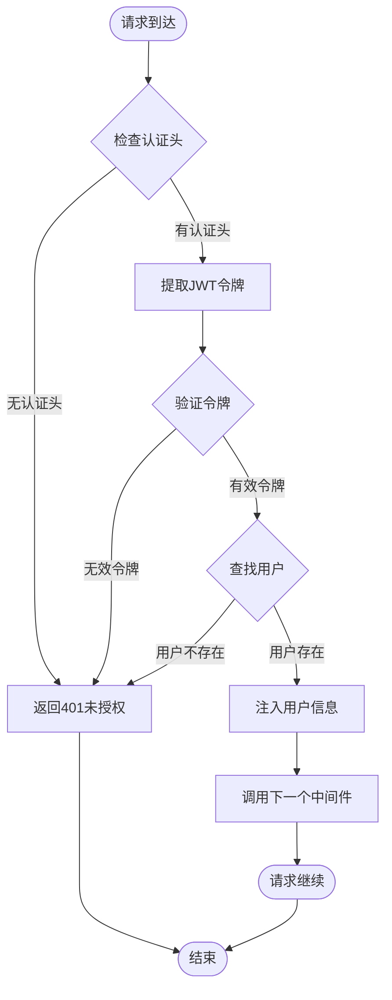

# Web页面路由文档

<cite>
**本文档引用的文件**
- [src/routes/web.ts](file://src/routes/web.ts)
- [src/middleware/auth.ts](file://src/middleware/auth.ts)
- [src/services/AuthService.ts](file://src/services/AuthService.ts)
- [src/index.ts](file://src/index.ts)
- [src/routes/auth.ts](file://src/routes/auth.ts)
- [src/models/UserModel.ts](file://src/models/UserModel.ts)
- [package.json](file://package.json)
</cite>

## 目录
1. [简介](#简介)
2. [项目架构概览](#项目架构概览)
3. [核心路由组件](#核心路由组件)
4. [页面渲染机制](#页面渲染机制)
5. [认证中间件详解](#认证中间件详解)
6. [前后端交互模式](#前后端交互模式)
7. [路由守卫实现](#路由守卫实现)
8. [页面结构与资源加载](#页面结构与资源加载)
9. [性能考虑](#性能考虑)
10. [故障排除指南](#故障排除指南)
11. [总结](#总结)

## 简介

本文档详细介绍了Point-Tron项目中的Web页面路由系统，重点阐述了`/login`和`/admin`等关键路由的页面跳转逻辑、渲染机制以及与API接口的前后端交互模式。该系统采用Express框架结合EJS模板引擎，实现了完整的用户认证和管理界面功能。

## 项目架构概览

Point-Tron项目采用模块化的Express架构，路由系统分为Web页面路由和API路由两大类：



**图表来源**
- [src/index.ts](file://src/index.ts#L25-L45)
- [src/routes/web.ts](file://src/routes/web.ts#L1-L10)

**章节来源**
- [src/index.ts](file://src/index.ts#L1-L163)
- [package.json](file://package.json#L1-L39)

## 核心路由组件

### Web页面路由模块

Web页面路由模块负责处理所有与用户界面相关的HTTP请求，主要包括以下三个核心路由：



**图表来源**
- [src/routes/web.ts](file://src/routes/web.ts#L1-L50)

### 路由功能详解

1. **根路径重定向** (`/`)
   - 自动重定向到`/login`页面
   - 提供统一的入口点

2. **登录页面路由** (`/login`)
   - 渲染EJS模板`login.ejs`
   - 设置页面标题为"Point-Tron 管理系统登录"
   - 提供错误信息传递机制

3. **管理后台路由** (`/admin`)
   - 渲染EJS模板`dashboard.ejs`
   - 设置页面标题为"Point-Tron 管理后台"
   - 作为认证用户的专属界面

4. **区块页面兼容路由** (`/admin/blocks`)
   - 重定向到`/admin#blocks`锚点
   - 保持向后兼容性

**章节来源**
- [src/routes/web.ts](file://src/routes/web.ts#L1-L50)

## 页面渲染机制

### EJS模板引擎配置

系统使用EJS作为模板引擎，配置在主应用类中：

```javascript
// 视图引擎设置
this.app.set('view engine', 'ejs');
this.app.set('views', path.join(__dirname, 'views'));
```

### 登录页面渲染流程



**图表来源**
- [src/routes/web.ts](file://src/routes/web.ts#L12-L25)

### 管理后台渲染机制

管理后台页面的渲染过程与登录页面类似，但使用不同的模板：

- **模板名称**: `dashboard.ejs`
- **页面标题**: "Point-Tron 管理后台"
- **认证要求**: 需要有效的JWT令牌

**章节来源**
- [src/routes/web.ts](file://src/routes/web.ts#L27-L40)

## 认证中间件详解

### JWT认证中间件架构



**图表来源**
- [src/middleware/auth.ts](file://src/middleware/auth.ts#L1-L50)
- [src/services/AuthService.ts](file://src/services/AuthService.ts#L1-L50)

### 认证流程详解

1. **令牌提取**
   ```javascript
   const authHeader = req.headers.authorization;
   const token = AuthService.extractTokenFromHeader(authHeader);
   ```

2. **令牌验证**
   ```javascript
   const decoded = AuthService.verifyToken(token);
   if (!decoded) {
     // 返回401未授权
   }
   ```

3. **用户存在性检查**
   ```javascript
   const user = await UserModel.findById(decoded.userId);
   if (!user) {
     // 返回401用户不存在
   }
   ```

4. **用户信息注入**
   ```javascript
   req.user = {
     id: user.id!,
     username: user.username
   };
   ```

**章节来源**
- [src/middleware/auth.ts](file://src/middleware/auth.ts#L20-L50)
- [src/services/AuthService.ts](file://src/services/AuthService.ts#L15-L40)

## 前后端交互模式

### API接口与页面的交互

系统采用前后端分离的API设计模式，页面通过JavaScript调用API获取动态数据：



**图表来源**
- [src/routes/auth.ts](file://src/routes/auth.ts#L35-L45)
- [src/middleware/auth.ts](file://src/middleware/auth.ts#L20-L50)

### 登录流程的前后端协作



**图表来源**
- [src/routes/auth.ts](file://src/routes/auth.ts#L10-L35)
- [src/services/AuthService.ts](file://src/services/AuthService.ts#L15-L25)

**章节来源**
- [src/routes/auth.ts](file://src/routes/auth.ts#L1-L62)
- [src/services/AuthService.ts](file://src/services/AuthService.ts#L1-L104)

## 路由守卫实现

### 认证中间件的路由守卫机制

路由守卫通过Express中间件实现，确保只有经过认证的用户才能访问受保护的路由：



**图表来源**
- [src/middleware/auth.ts](file://src/middleware/auth.ts#L20-L50)

### 中间件执行顺序

认证中间件按照以下顺序执行：

1. **CORS配置** - 处理跨域请求
2. **安全头设置** - 添加安全相关HTTP头
3. **限流控制** - 防止请求泛滥
4. **JSON解析** - 处理JSON请求体
5. **请求日志** - 记录请求信息
6. **认证检查** - 验证JWT令牌
7. **业务逻辑** - 执行路由处理器

**章节来源**
- [src/middleware/auth.ts](file://src/middleware/auth.ts#L1-L171)
- [src/index.ts](file://src/index.ts#L30-L45)

## 页面结构与资源加载

### 静态资源服务配置

系统配置了静态资源服务来提供CSS、JavaScript和其他静态文件：

```javascript
// 静态文件服务
this.app.use('/static', express.static(path.join(__dirname, '../public')));
```

### 构建过程中的资源处理

根据package.json中的构建脚本，系统会将EJS模板复制到构建目录：

```bash
"build": "tsc && mkdir -p dist/views && cp src/views/*.ejs dist/views/"
```

### 前端资源加载策略

虽然当前代码库中没有显示具体的前端资源结构，但从配置可以看出：

- **模板引擎**: EJS
- **静态资源路径**: `/static`
- **视图目录**: `src/views/`
- **构建输出**: `dist/views/`

**章节来源**
- [src/index.ts](file://src/index.ts#L40-L45)
- [package.json](file://package.json#L8-L12)

## 性能考虑

### 限流机制

系统实现了简单的基于内存的限流机制：

```javascript
const rateLimitMap = new Map<string, { count: number; resetTime: number }>();

export const rateLimit = (maxRequests: number = 100, windowMs: number = 60000) => {
  return (req: Request, res: Response, next: NextFunction): void => {
    // 实现限流逻辑
  };
};
```

### 安全配置

- **CORS配置**: 开发环境允许所有来源，生产环境应配置具体域名
- **安全头**: 设置了多种安全相关的HTTP头
- **请求日志**: 记录所有请求的详细信息
- **错误处理**: 统一的错误处理机制

### 性能优化建议

1. **缓存策略**: 可以为静态资源添加适当的缓存头
2. **压缩**: 启用Gzip压缩减少传输大小
3. **CDN集成**: 对静态资源使用CDN加速
4. **连接池**: 优化数据库连接池配置

## 故障排除指南

### 常见问题及解决方案

1. **登录页面无法渲染**
   - 检查EJS模板文件是否存在
   - 验证视图目录配置是否正确
   - 查看控制台错误日志

2. **认证失败**
   - 检查JWT令牌格式是否正确
   - 验证令牌是否过期
   - 确认用户是否存在且活跃

3. **静态资源加载失败**
   - 检查静态文件服务配置
   - 验证文件权限设置
   - 确认构建过程是否正确执行

4. **路由重定向问题**
   - 检查路由定义顺序
   - 验证重定向目标是否存在
   - 确认中间件执行顺序

**章节来源**
- [src/routes/web.ts](file://src/routes/web.ts#L12-L25)
- [src/middleware/auth.ts](file://src/middleware/auth.ts#L50-L80)

## 总结

Point-Tron项目的Web页面路由系统展现了现代Web应用的最佳实践：

1. **清晰的路由分离**: Web页面路由与API路由职责分明
2. **完善的认证机制**: 基于JWT的认证系统确保安全性
3. **优雅的错误处理**: 统一的错误处理和日志记录
4. **模块化设计**: 中间件和路由的模块化组织
5. **前后端协作**: API驱动的前后端分离架构

该系统为开发者提供了完整的用户认证和管理界面解决方案，同时保持了良好的可维护性和扩展性。通过合理的中间件配置和路由设计，系统能够有效处理各种请求场景，为用户提供安全可靠的管理体验。