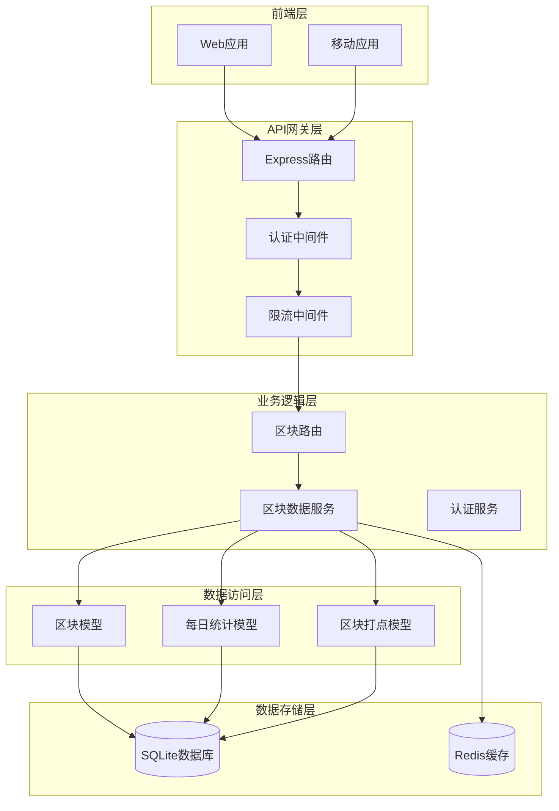
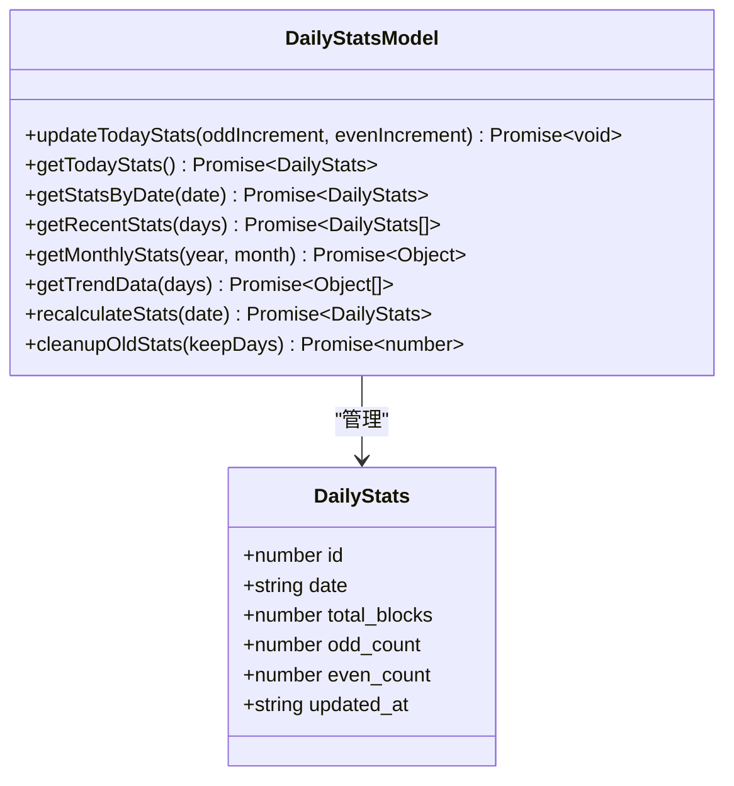
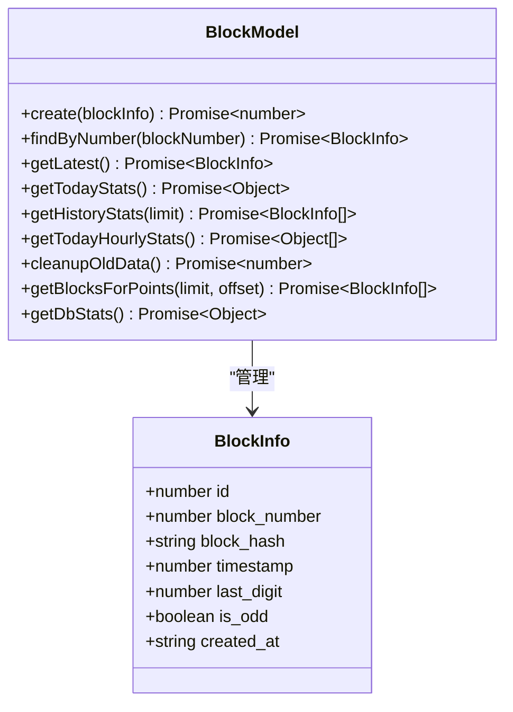
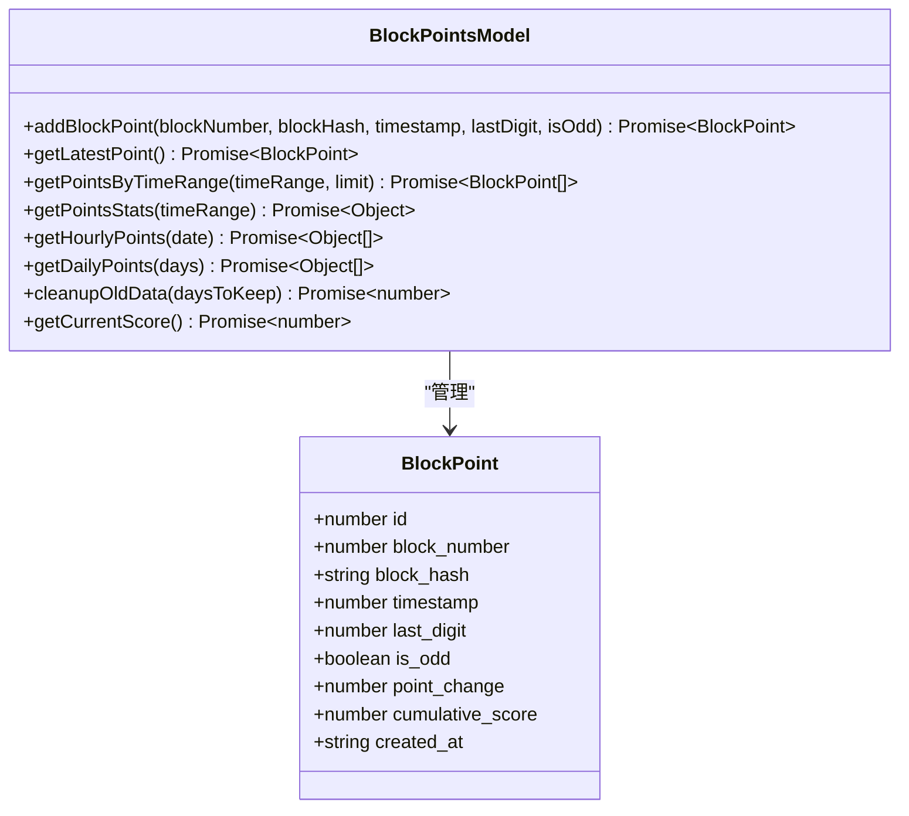
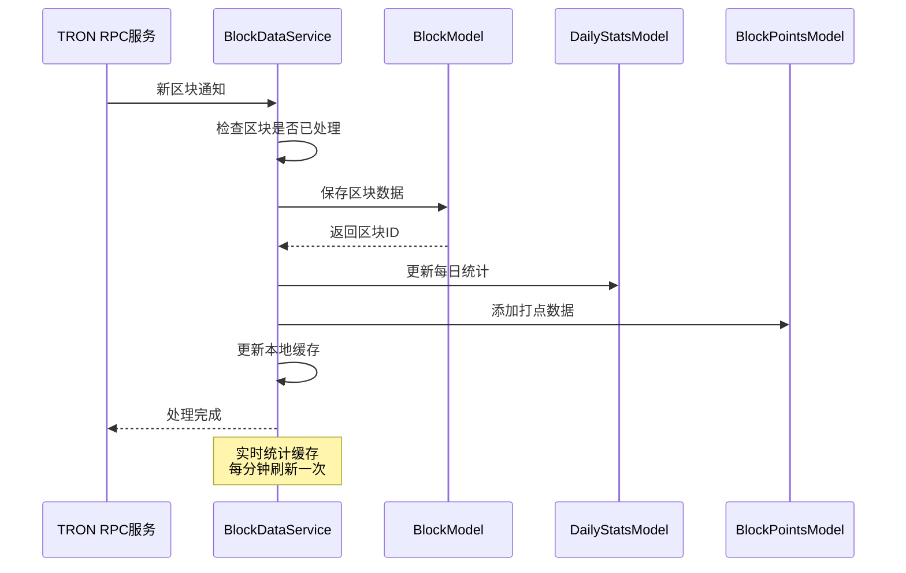
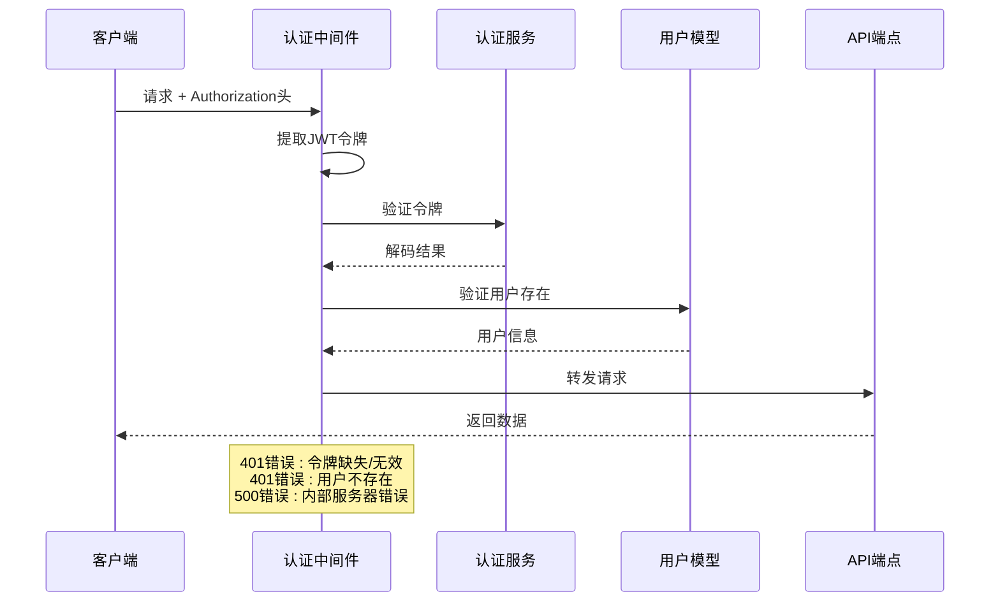

# 区块数据接口文档

<cite>
**本文档引用的文件**
- [blocks.ts](file://src/routes/blocks.ts)
- [DailyStatsModel.ts](file://src/models/DailyStatsModel.ts)
- [BlockDataService.ts](file://src/services/BlockDataService.ts)
- [BlockModel.ts](file://src/models/BlockModel.ts)
- [BlockPointsModel.ts](file://src/models/BlockPointsModel.ts)
- [types.ts](file://src/models/types.ts)
- [auth.ts](file://src/middleware/auth.ts)
</cite>

## 目录
1. [简介](#简介)
2. [项目架构概览](#项目架构概览)
3. [核心接口详解](#核心接口详解)
4. [数据模型分析](#数据模型分析)
5. [服务组件分析](#服务组件分析)
6. [认证机制](#认证机制)
7. [性能优化建议](#性能优化建议)
8. [前端集成指南](#前端集成指南)
9. [故障排除](#故障排除)
10. [总结](#总结)

## 简介

本文档详细介绍了 Point-Tron 项目中的区块数据接口系统，重点涵盖 `/api/blocks/stats` 和 `/api/blocks/history` 等核心端点。该系统提供了实时区块统计、历史数据分析、区块打点追踪等功能，为用户提供全面的区块链数据可视化能力。

系统采用 Express.js 构建 RESTful API，通过 JWT 进行身份验证，使用 SQLite 数据库存储区块数据，并实现了高效的数据聚合和缓存机制。

## 项目架构概览



**图表来源**
- [blocks.ts](file://src/routes/blocks.ts#L1-L141)
- [auth.ts](file://src/middleware/auth.ts#L1-L171)

## 核心接口详解

### 1. 实时区块统计接口 (/api/blocks/stats)

#### 接口描述
获取当前实时的区块统计信息，包括今日区块总数、单双数分布、每小时统计和最新区块信息。

#### 请求方法
```
GET /api/blocks/stats
```

#### 查询参数
无

#### 返回数据结构
```typescript
{
  success: boolean,
  data: {
    todayTotal: number,           // 今日总区块数
    todayOdd: number,             // 今日单数区块数
    todayEven: number,            // 今日双数区块数
    hourlyStats: Array<object>,   // 每小时统计数组
    currentBlock: {
      number: number,             // 区块高度
      hash: string,               // 区块哈希
      timestamp: number,          // 时间戳
      lastDigit: number,          // 哈希末位数字
      isOdd: boolean              // 是否为单数
    }
  }
}
```

#### 实际响应示例
```json
{
  "success": true,
  "data": {
    "todayTotal": 1258,
    "todayOdd": 632,
    "todayEven": 626,
    "hourlyStats": [
      {"hour": "00", "total": 45, "odd": 23, "even": 22},
      {"hour": "01", "total": 52, "odd": 26, "even": 26},
      {"hour": "02", "total": 48, "odd": 24, "even": 24}
    ],
    "currentBlock": {
      "number": 12345678,
      "hash": "0x1a2b3c4d...",
      "timestamp": 1640995200000,
      "lastDigit": 7,
      "isOdd": true
    }
  }
}
```

### 2. 历史数据接口 (/api/blocks/history)

#### 接口描述
获取历史区块统计数据，支持按日期查询或获取最近的区块记录。

#### 请求方法
```
GET /api/blocks/history
```

#### 查询参数
- `date` (可选): 指定日期格式 YYYY-MM-DD
- `limit` (可选): 返回记录数量，默认100

#### 返回数据结构
```typescript
{
  success: boolean,
  data: Array<{
    date: string,                // 日期
    total_blocks: number,        // 总区块数
    odd_count: number,           // 单数区块数
    even_count: number,          // 双数区块数
    odd_rate: number            // 单数占比百分比
  }>
}
```

#### 实际响应示例
```json
{
  "success": true,
  "data": [
    {
      "date": "2024-01-15",
      "total_blocks": 1258,
      "odd_count": 632,
      "even_count": 626,
      "odd_rate": 50.24
    },
    {
      "date": "2024-01-14",
      "total_blocks": 1320,
      "odd_count": 665,
      "even_count": 655,
      "odd_rate": 50.38
    }
  ]
}
```

### 3. 区块打点数据接口 (/api/blocks/points)

#### 接口描述
获取指定时间范围内的区块打点数据和统计信息。

#### 请求方法
```
GET /api/blocks/points
```

#### 查询参数
- `timeRange` (可选): 时间范围，可选值：'1day', '1week', '1month'，默认'1day'
- `limit` (可选): 返回记录数量，默认1000

#### 返回数据结构
```typescript
{
  success: boolean,
  data: {
    points: Array<{
      block_number: number,        // 区块高度
      block_hash: string,          // 区块哈希
      timestamp: number,           // 时间戳
      last_digit: number,          // 哈希末位数字
      is_odd: boolean,             // 是否为单数
      point_change: number,        // 分数变化 (+1/-1)
      cumulative_score: number     // 累积分数
    }>,
    stats: {
      totalBlocks: number,         // 总区块数
      oddBlocks: number,           // 单数区块数
      evenBlocks: number,          // 双数区块数
      totalPointChange: number,    // 总分数变化
      currentScore: number,        // 当前累积分数
      startScore: number,          // 起始累积分数
      maxScore: number,            // 最高累积分数
      minScore: number            // 最低累积分数
    },
    timeRange: string             // 实际使用的时间范围
  }
}
```

### 4. 打点趋势数据接口 (/api/blocks/points/trend)

#### 接口描述
获取打点趋势数据，用于绘制图表展示分数变化趋势。

#### 请求方法
```
GET /api/blocks/points/trend
```

#### 查询参数
- `timeRange` (可选): 时间范围，可选值：'1day', '1week', '1month'，默认'1day'

#### 返回数据结构
```typescript
{
  success: boolean,
  data: {
    trend: Array<{
      // 不同时间范围有不同的数据结构
      // 1day: 每小时数据
      hour: string,                // 小时 (00-23)
      hour_start_score: number,    // 小时开始分数
      hour_end_score: number,      // 小时结束分数
      block_count: number         // 区块数量
    }>,
    timeRange: string             // 实际使用的时间范围
  }
}
```

**章节来源**
- [blocks.ts](file://src/routes/blocks.ts#L10-L141)

## 数据模型分析

### DailyStatsModel - 每日统计模型



**图表来源**
- [DailyStatsModel.ts](file://src/models/DailyStatsModel.ts#L1-L165)

#### 核心功能特性

1. **实时统计更新**: 使用 UPSERT 语句确保统计数据的原子性更新
2. **多维度统计**: 支持按日期、月份、时间段进行统计分析
3. **趋势数据提取**: 提供图表友好的趋势数据格式
4. **数据修复功能**: 支持手动重新计算特定日期的统计数据
5. **自动清理**: 定期清理过期统计数据，保持数据库性能

### BlockModel - 区块基础模型



**图表来源**
- [BlockModel.ts](file://src/models/BlockModel.ts#L1-L170)

### BlockPointsModel - 区块打点模型



**图表来源**
- [BlockPointsModel.ts](file://src/models/BlockPointsModel.ts#L1-L219)

**章节来源**
- [DailyStatsModel.ts](file://src/models/DailyStatsModel.ts#L1-L165)
- [BlockModel.ts](file://src/models/BlockModel.ts#L1-L170)
- [BlockPointsModel.ts](file://src/models/BlockPointsModel.ts#L1-L219)

## 服务组件分析

### BlockDataService - 区块数据服务



**图表来源**
- [BlockDataService.ts](file://src/services/BlockDataService.ts#L50-L100)

#### 核心功能

1. **实时数据采集**: 通过 TRON RPC 服务持续监控新区块
2. **数据持久化**: 自动将区块信息保存到数据库
3. **统计计算**: 实时更新单双数统计和打点数据
4. **缓存管理**: 维护本地统计缓存，减少数据库查询压力
5. **服务监控**: 提供服务状态检查和健康监控

#### 关键算法

```typescript
// 分数计算规则
const pointChange = isOdd ? -1 : 1;  // 单数-1，双数+1
const newCumulativeScore = lastCumulativeScore + pointChange;
```

**章节来源**
- [BlockDataService.ts](file://src/services/BlockDataService.ts#L1-L273)

## 认证机制

### JWT 认证流程



**图表来源**
- [auth.ts](file://src/middleware/auth.ts#L15-L60)

### 认证中间件配置

1. **令牌提取**: 从 Authorization 头中提取 Bearer 令牌
2. **令牌验证**: 使用密钥验证 JWT 令牌的有效性
3. **用户验证**: 确保用户仍然存在于数据库中
4. **请求转发**: 将认证后的用户信息附加到请求对象

### 安全特性

- **CORS 配置**: 允许跨域请求，支持开发和生产环境
- **安全头设置**: 设置 X-Content-Type-Options、X-Frame-Options 等安全头
- **速率限制**: 防止 API 滥用，保护服务器资源
- **错误处理**: 统一的错误响应格式和日志记录

**章节来源**
- [auth.ts](file://src/middleware/auth.ts#L1-L171)

## 性能优化建议

### 1. 分页策略

```javascript
// 推荐的分页参数
const recommendedParams = {
  limit: 100,           // 每页100条记录
  page: 1,              // 第一页
  maxLimit: 1000        // 最大限制1000条
};

// 避免的大数据量请求
const avoidLargeRequests = {
  limit: 10000,         // 避免超过1000条
  timeRange: 'all'      // 避免获取全部历史数据
};
```

### 2. 缓存策略

- **统计缓存**: BlockDataService 维护1分钟内的统计缓存
- **数据库索引**: 在 `block_number`、`timestamp`、`date` 字段上建立索引
- **查询优化**: 使用 LIMIT 和 OFFSET 进行分页查询

### 3. 数据清理

```sql
-- 自动清理策略
DELETE FROM blocks WHERE timestamp < DATE('now', '-30 days');
DELETE FROM daily_stats WHERE date < DATE('now', '-90 days');
DELETE FROM block_points WHERE timestamp < DATE('now', '-90 days');
```

### 4. 并发处理

```typescript
// 使用 Promise.all 并发执行多个查询
const [todayStats, currentBlock, hourlyStats] = await Promise.all([
  BlockModel.getTodayStats(),
  BlockModel.getLatest(),
  BlockModel.getTodayHourlyStats()
]);
```

## 前端集成指南

### 1. 基本 API 调用

```javascript
// 使用 fetch 的基本调用
async function fetchBlockStats() {
  try {
    const response = await fetch('/api/blocks/stats', {
      headers: {
        'Authorization': `Bearer ${jwtToken}`,
        'Content-Type': 'application/json'
      }
    });
    
    const data = await response.json();
    if (data.success) {
      return data.data;
    }
  } catch (error) {
    console.error('获取区块统计失败:', error);
  }
}
```

### 2. 图表数据准备

```javascript
// 准备趋势图表数据
function prepareChartData(trendData, timeRange) {
  const chartData = {
    labels: [],
    datasets: [
      {
        label: '累积分数',
        data: [],
        borderColor: '#4f46e5',
        tension: 0.3
      }
    ]
  };
  
  if (timeRange === '1day') {
    chartData.labels = trendData.map(item => item.hour);
    chartData.datasets[0].data = trendData.map(item => item.hour_end_score);
  } else {
    chartData.labels = trendData.map(item => item.date);
    chartData.datasets[0].data = trendData.map(item => item.day_end_score);
  }
  
  return chartData;
}
```

### 3. 实时数据更新

```javascript
// 实时更新区块统计
let statsInterval;

function startStatsUpdates() {
  statsInterval = setInterval(async () => {
    try {
      const stats = await fetchBlockStats();
      updateUI(stats);
    } catch (error) {
      console.error('实时更新失败:', error);
    }
  }, 60000); // 每分钟更新一次
}

function stopStatsUpdates() {
  if (statsInterval) {
    clearInterval(statsInterval);
  }
}
```

### 4. 错误处理最佳实践

```javascript
// 统一的错误处理函数
async function handleApiCall(endpoint, params = {}) {
  try {
    const response = await fetch(`/api/blocks/${endpoint}`, {
      method: 'GET',
      headers: {
        'Authorization': `Bearer ${jwtToken}`,
        'Content-Type': 'application/json'
      },
      ...params
    });
    
    const data = await response.json();
    
    if (!data.success) {
      throw new Error(data.error || '未知错误');
    }
    
    return data.data;
    
  } catch (error) {
    handleError(error, endpoint);
    throw error;
  }
}

function handleError(error, endpoint) {
  console.error(`API调用失败 (${endpoint}):`, error);
  
  // 显示用户友好的错误消息
  showErrorMessage(`无法获取${endpoint}数据，请稍后重试`);
  
  // 发送错误报告（可选）
  sendErrorReport(error, endpoint);
}
```

## 故障排除

### 常见问题及解决方案

#### 1. 认证失败

**问题症状**: 收到 401 错误
```
{
  "success": false,
  "error": "访问令牌缺失"
}
```

**解决方案**:
- 检查 Authorization 头格式是否正确
- 确认 JWT 令牌未过期
- 验证用户账户是否存在

#### 2. 数据查询超时

**问题症状**: API 响应缓慢或超时
```
{
  "success": false,
  "error": "服务器内部错误"
}
```

**解决方案**:
- 减少查询的 limit 参数
- 使用更具体的时间范围
- 检查数据库连接状态

#### 3. 数据不一致

**问题症状**: 统计数据显示异常
- 单双数比例偏离正常范围
- 累积分数计算错误

**解决方案**:
```javascript
// 重新计算统计数据
async function recalculateStats(date) {
  try {
    const result = await fetch(`/api/admin/recalculate-stats?date=${date}`, {
      method: 'POST',
      headers: {
        'Authorization': `Bearer ${adminToken}`
      }
    });
    
    const data = await result.json();
    if (data.success) {
      console.log('统计数据已重新计算');
    }
  } catch (error) {
    console.error('重新计算统计数据失败:', error);
  }
}
```

#### 4. 性能问题

**问题症状**: API 响应时间过长

**诊断步骤**:
1. 检查数据库索引是否完整
2. 分析慢查询日志
3. 监控内存使用情况
4. 评估并发请求数量

**优化措施**:
```sql
-- 创建必要的索引
CREATE INDEX idx_blocks_timestamp ON blocks(timestamp);
CREATE INDEX idx_daily_stats_date ON daily_stats(date);
CREATE INDEX idx_block_points_timestamp ON block_points(timestamp);
```

**章节来源**
- [auth.ts](file://src/middleware/auth.ts#L15-L60)

## 总结

本文档详细介绍了 Point-Tron 项目的区块数据接口系统，涵盖了以下关键方面：

### 核心功能
- **实时统计**: 提供今日区块统计、单双数分布、每小时趋势等实时数据
- **历史分析**: 支持按日期查询历史统计数据和趋势分析
- **打点追踪**: 实现区块打点机制，支持分数计算和趋势分析
- **多维度查询**: 支持不同时间范围的数据查询和分析

### 技术特点
- **JWT认证**: 安全的用户身份验证机制
- **数据缓存**: 实现本地缓存提升查询性能
- **数据清理**: 自动清理过期数据保持系统性能
- **错误处理**: 完善的错误处理和日志记录

### 性能考虑
- **分页策略**: 合理使用分页避免大数据量请求
- **并发处理**: 使用 Promise.all 优化查询性能
- **缓存机制**: 维护统计缓存减少数据库压力
- **索引优化**: 在关键字段上建立索引提升查询效率

### 前端集成
- **API调用**: 提供清晰的 JavaScript 调用示例
- **错误处理**: 实现统一的错误处理机制
- **实时更新**: 支持实时数据更新和图表渲染
- **用户体验**: 提供用户友好的错误提示和加载状态

该接口系统设计合理，具有良好的扩展性和维护性，能够满足区块链数据分析的各种需求。通过合理的缓存策略和性能优化，系统能够在高并发场景下稳定运行。