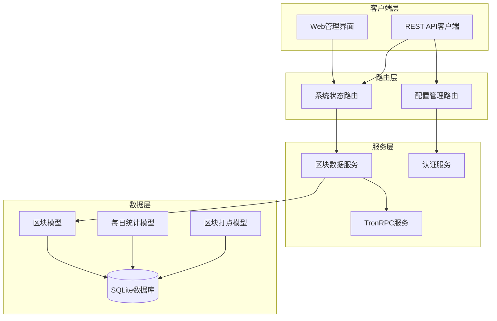
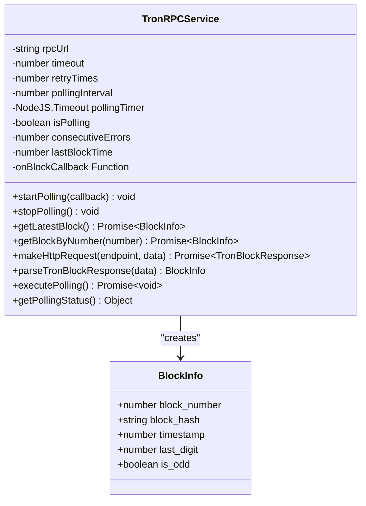
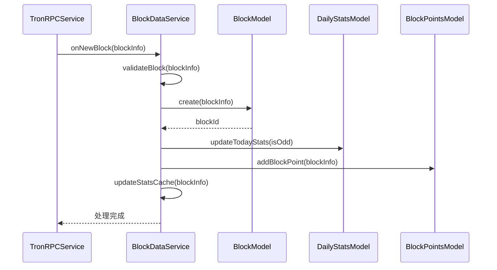
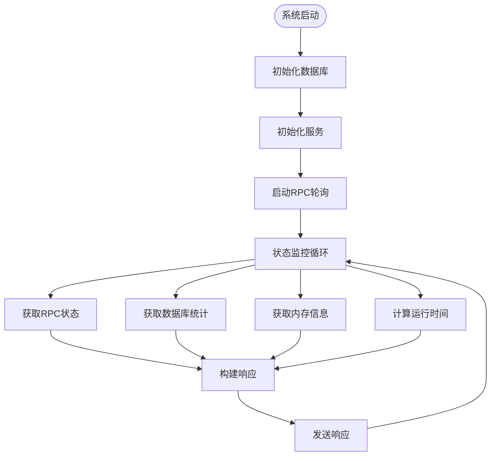
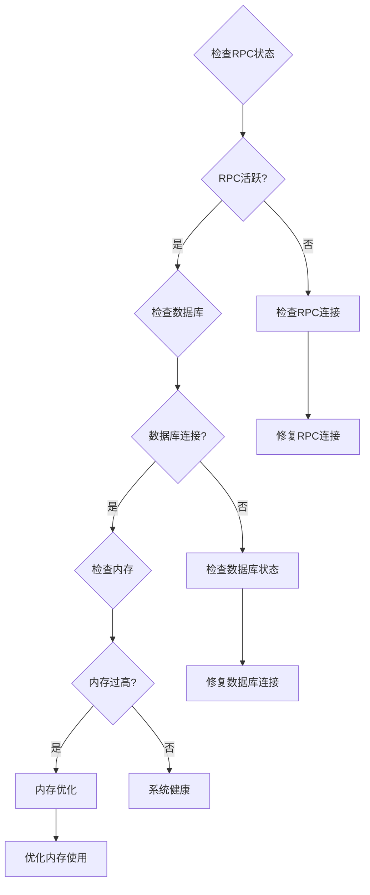

# 系统状态接口

<cite>
**本文档引用的文件**
- [src/routes/system.ts](file://src/routes/system.ts)
- [src/routes/config.ts](file://src/routes/config.ts)
- [src/services/TronRPCService.ts](file://src/services/TronRPCService.ts)
- [src/models/BlockModel.ts](file://src/models/BlockModel.ts)
- [src/models/types.ts](file://src/models/types.ts)
- [src/config/index.ts](file://src/config/index.ts)
- [src/index.ts](file://src/index.ts)
- [src/services/BlockDataService.ts](file://src/services/BlockDataService.ts)
- [src/models/DailyStatsModel.ts](file://src/models/DailyStatsModel.ts)
- [src/models/BlockPointsModel.ts](file://src/models/BlockPointsModel.ts)
- [src/database/index.ts](file://src/database/index.ts)
</cite>

## 目录
1. [简介](#简介)
2. [项目架构概览](#项目架构概览)
3. [核心组件分析](#核心组件分析)
4. [系统状态接口详解](#系统状态接口详解)
5. [配置接口详解](#配置接口详解)
6. [数据流分析](#数据流分析)
7. [性能监控机制](#性能监控机制)
8. [故障诊断指南](#故障诊断指南)
9. [最佳实践](#最佳实践)
10. [总结](#总结)

## 简介

Point-Tron 是一个基于 TypeScript 和 Node.js 开发的波场网络区块链数据统计后台管理系统。该系统提供了完整的系统状态监控接口，包括 `/api/system/status` 和 `/api/system/config` 两个核心端点，用于实时监控系统的运行状态、配置参数和健康状况。

系统采用模块化架构设计，通过 TronRPCService 实时从波场网络获取区块数据，经过 BlockDataService 处理后存储到 SQLite 数据库中。系统状态接口提供了全面的监控指标，帮助开发者和运维人员及时了解服务的运行状况。

## 项目架构概览



**图表来源**
- [src/routes/system.ts](file://src/routes/system.ts#L1-L46)
- [src/routes/config.ts](file://src/routes/config.ts#L1-L80)
- [src/services/TronRPCService.ts](file://src/services/TronRPCService.ts#L1-L50)
- [src/services/BlockDataService.ts](file://src/services/BlockDataService.ts#L1-L50)

## 核心组件分析

### TronRPCService - TRON网络通信服务

TronRPCService 是系统的核心组件，负责与波场网络进行实时通信。该服务实现了智能的轮询机制，每3秒自动获取最新区块数据。



**图表来源**
- [src/services/TronRPCService.ts](file://src/services/TronRPCService.ts#L15-L50)
- [src/models/types.ts](file://src/models/types.ts#L1-L15)

### BlockDataService - 区块数据处理服务

BlockDataService 负责处理从 TronRPCService 获取的区块数据，包括数据验证、存储和统计计算。



**图表来源**
- [src/services/BlockDataService.ts](file://src/services/BlockDataService.ts#L50-L100)
- [src/services/TronRPCService.ts](file://src/services/TronRPCService.ts#L80-L120)

**章节来源**
- [src/services/TronRPCService.ts](file://src/services/TronRPCService.ts#L1-L258)
- [src/services/BlockDataService.ts](file://src/services/BlockDataService.ts#L1-L273)

## 系统状态接口详解

### /api/system/status 端点

系统状态接口提供全面的服务运行状态信息，包括 RPC 轮询状态、数据库连接状态、内存使用情况等关键指标。

#### 接口特性

- **认证要求**: 需要有效的 JWT 令牌
- **响应格式**: JSON 格式的标准 API 响应
- **错误处理**: 完善的异常捕获和错误响应
- **访问频率**: 无限制（仅限授权用户）

#### 响应数据结构

```typescript
interface SystemStatusResponse {
  success: boolean;
  data: {
    rpcPolling: {
      isActive: boolean;
      interval: number;
      lastBlockTime: number;
      consecutiveErrors: number;
    };
    database: {
      isConnected: boolean;
      totalBlocks: number;
      todayBlocks: number;
      oldestBlock: number;
      newestBlock: number;
    };
    uptime: number;
    lastUpdate: number;
    memory: {
      used: number; // MB
      total: number; // MB
    };
  };
  error?: string;
}
```

#### 状态指标详解

1. **RPC轮询状态**
   - `isActive`: 当前轮询是否处于活动状态
   - `interval`: 轮询间隔时间（毫秒）
   - `lastBlockTime`: 上次获取区块的时间戳
   - `consecutiveErrors`: 连续错误次数

2. **数据库状态**
   - `isConnected`: 数据库连接状态
   - `totalBlocks`: 数据库中总区块数量
   - `todayBlocks`: 今日新增区块数量
   - `oldestBlock`: 最早区块编号
   - `newestBlock`: 最新区块编号

3. **系统资源**
   - `uptime`: 服务运行时间（秒）
   - `lastUpdate`: 最近更新时间戳
   - `memory`: 内存使用情况（MB）

#### 示例响应

```json
{
  "success": true,
  "data": {
    "rpcPolling": {
      "isActive": true,
      "interval": 3000,
      "lastBlockTime": 1704067200000,
      "consecutiveErrors": 0
    },
    "database": {
      "isConnected": true,
      "totalBlocks": 150000,
      "todayBlocks": 1200,
      "oldestBlock": 75728000,
      "newestBlock": 75729642
    },
    "uptime": 3600.5,
    "lastUpdate": 1704067200000,
    "memory": {
      "used": 128,
      "total": 512
    }
  }
}
```

**章节来源**
- [src/routes/system.ts](file://src/routes/system.ts#L1-L46)

### /api/system/config 端点

配置接口提供系统配置信息的只读访问，不包含敏感配置项如 JWT 密钥、数据库密码等。

#### 可访问配置项

1. **TRON网络配置**
   - `rpcUrl`: RPC 服务地址
   - `timeout`: 请求超时时间（毫秒）
   - `retryTimes`: 重试次数
   - `pollingInterval`: 轮询间隔（毫秒）
   - `isPollingActive`: 轮询状态

2. **系统基础配置**
   - `port`: 服务端口
   - `nodeEnv`: 运行环境
   - `databasePath`: 数据库文件路径

#### 安全性考虑

配置接口遵循最小权限原则，以下敏感配置项不会通过 API 暴露：
- JWT 密钥 (`JWT_SECRET`)
- 数据库连接凭据
- 管理员账户凭据
- 私密的 API 密钥

**章节来源**
- [src/routes/config.ts](file://src/routes/config.ts#L1-L80)
- [src/config/index.ts](file://src/config/index.ts#L1-L52)

## 配置接口详解

### /api/config/rpc 端点

获取当前 RPC 配置信息，包括网络节点地址、超时设置等。

#### 请求方法
- GET `/api/config/rpc`

#### 响应示例
```json
{
  "success": true,
  "data": {
    "rpcUrl": "https://api.trongrid.io",
    "timeout": 5000,
    "retryTimes": 3,
    "pollingInterval": 3000,
    "isPollingActive": true
  }
}
```

### /api/config/rpc/polling 端点

控制 RPC 轮询的启停操作。

#### 请求方法
- POST `/api/config/rpc/polling`

#### 请求体
```json
{
  "action": "start" // 或 "stop"
}
```

#### 响应示例
```json
{
  "success": true,
  "data": {
    "status": "started",
    "pollingInterval": 3000,
    "message": "RPC轮询启动成功"
  }
}
```

**章节来源**
- [src/routes/config.ts](file://src/routes/config.ts#L10-L80)

## 数据流分析

### 状态数据来源

系统状态数据来源于多个组件的实时监控和统计：



**图表来源**
- [src/routes/system.ts](file://src/routes/system.ts#L10-L40)
- [src/services/TronRPCService.ts](file://src/services/TronRPCService.ts#L30-L80)

### 数据更新机制

1. **RPC轮询更新**
   - 每3秒执行一次区块获取
   - 自动更新最后区块时间戳
   - 错误计数器动态维护

2. **数据库统计更新**
   - 实时区块插入时更新统计
   - 每日凌晨自动更新历史统计
   - 缓存机制减少数据库查询

3. **系统状态缓存**
   - 内存中维护状态快照
   - 定期刷新避免过期
   - 异步更新不影响响应速度

**章节来源**
- [src/services/TronRPCService.ts](file://src/services/TronRPCService.ts#L80-L150)
- [src/services/BlockDataService.ts](file://src/services/BlockDataService.ts#L100-L150)

## 性能监控机制

### 内存监控

系统实时监控 Node.js 进程的内存使用情况：

```typescript
// 内存使用计算
const memory = {
  used: Math.round(process.memoryUsage().heapUsed / 1024 / 1024), // MB
  total: Math.round(process.memoryUsage().heapTotal / 1024 / 1024) // MB
};
```

### 性能指标

1. **响应时间**: 状态接口应在100ms内返回响应
2. **并发处理**: 支持多用户同时查询状态
3. **资源消耗**: 内存使用不超过总内存的80%
4. **错误率**: 连续错误超过10次时触发告警

### 监控告警

系统内置多种监控告警机制：

- **RPC连接失败**: 连续错误达到阈值时记录警告
- **数据库连接异常**: 数据库断开时更新状态
- **内存泄漏检测**: 内存使用持续增长时发出警告
- **服务重启**: 自动检测服务异常重启

**章节来源**
- [src/routes/system.ts](file://src/routes/system.ts#L30-L40)
- [src/services/TronRPCService.ts](file://src/services/TronRPCService.ts#L90-L120)

## 故障诊断指南

### 常见异常情况

#### 1. 节点连接失败

**症状**: RPC轮询状态显示错误，连续错误计数增加

**诊断步骤**:
```javascript
// 检查网络连接
console.log('尝试连接RPC节点:', rpcUrl);
try {
  const response = await fetch(rpcUrl, { timeout: 5000 });
  console.log('RPC连接成功');
} catch (error) {
  console.error('RPC连接失败:', error.message);
}
```

**解决方案**:
- 更换RPC节点地址
- 检查网络防火墙设置
- 增加超时时间配置

#### 2. 数据库连接问题

**症状**: 数据库状态显示未连接，查询失败

**诊断命令**:
```bash
# 检查数据库文件权限
ls -la ./data/point-tron.db

# 检查磁盘空间
df -h ./data/

# 检查数据库文件大小
du -sh ./data/
```

**解决方案**:
- 确保数据目录存在且可写
- 检查磁盘空间是否充足
- 重启数据库连接

#### 3. 内存使用过高

**症状**: 内存使用率持续上升，可能导致服务崩溃

**监控指标**:
- 连续内存使用增长
- 垃圾回收频率增加
- 响应时间变慢

**优化措施**:
- 增加内存限制
- 优化数据缓存策略
- 定期清理过期数据

### 异常识别方法

#### 状态异常检测



**图表来源**
- [src/services/TronRPCService.ts](file://src/services/TronRPCService.ts#L90-L120)
- [src/database/index.ts](file://src/database/index.ts#L200-L248)

**章节来源**
- [src/services/TronRPCService.ts](file://src/services/TronRPCService.ts#L90-L150)
- [src/database/index.ts](file://src/database/index.ts#L200-L248)

## 最佳实践

### 接口调用示例

#### JavaScript/Node.js 示例

```javascript
// 获取系统状态
async function getSystemStatus(token) {
  try {
    const response = await fetch('http://localhost:3000/api/system/status', {
      headers: {
        'Authorization': `Bearer ${token}`,
        'Content-Type': 'application/json'
      }
    });
    
    const data = await response.json();
    if (data.success) {
      console.log('系统状态:', data.data);
      return data.data;
    } else {
      console.error('获取状态失败:', data.error);
    }
  } catch (error) {
    console.error('网络错误:', error);
  }
}

// 监控系统健康状态
async function monitorHealth() {
  while (true) {
    const status = await getSystemStatus(token);
    if (status) {
      // 检查关键指标
      const isHealthy = status.rpcPolling.isActive &&
                       status.database.isConnected &&
                       status.memory.used < 400;
      
      if (!isHealthy) {
        console.warn('系统状态异常');
        // 发送告警
      }
    }
    await new Promise(resolve => setTimeout(resolve, 60000)); // 每分钟检查一次
  }
}
```

#### Python 示例

```python
import requests
import time

def get_system_status(token):
    """获取系统状态"""
    headers = {
        'Authorization': f'Bearer {token}',
        'Content-Type': 'application/json'
    }
    
    try:
        response = requests.get(
            'http://localhost:3000/api/system/status',
            headers=headers,
            timeout=10
        )
        response.raise_for_status()
        return response.json()
    except requests.exceptions.RequestException as e:
        print(f'获取系统状态失败: {e}')
        return None

def monitor_system_health():
    """监控系统健康状态"""
    while True:
        status = get_system_status(token)
        if status and status.get('success'):
            data = status['data']
            
            # 检查关键指标
            is_healthy = (
                data['rpcPolling']['isActive'] and
                data['database']['isConnected'] and
                data['memory']['used'] < 400
            )
            
            if not is_healthy:
                print('⚠️ 系统状态异常')
                # 发送告警通知
            
        time.sleep(60)  # 每分钟检查一次
```

### 响应解析方法

#### 状态指标解析

```javascript
function parseSystemStatus(statusData) {
  const result = {
    // RPC状态解析
    rpcStatus: {
      isActive: statusData.rpcPolling.isActive,
      lastBlockTime: new Date(statusData.rpcPolling.lastBlockTime),
      consecutiveErrors: statusData.rpcPolling.consecutiveErrors,
      health: statusData.rpcPolling.consecutiveErrors < 5
    },
    
    // 数据库状态解析
    dbStatus: {
      isConnected: statusData.database.isConnected,
      totalBlocks: statusData.database.totalBlocks,
      todayBlocks: statusData.database.todayBlocks,
      health: statusData.database.isConnected && 
              statusData.database.totalBlocks > 0
    },
    
    // 系统资源解析
    resourceStatus: {
      uptime: `${Math.floor(statusData.uptime / 3600)}小时`,
      memoryUsage: `${statusData.memory.used}MB/${statusData.memory.total}MB`,
      health: statusData.memory.used < 400
    }
  };
  
  // 综合健康状态
  result.overallHealth = 
    result.rpcStatus.health && 
    result.dbStatus.health && 
    result.resourceStatus.health;
    
  return result;
}
```

### 监控集成

#### Prometheus 集成示例

```yaml
# prometheus.yml
scrape_configs:
  - job_name: 'point-tron'
    metrics_path: '/api/system/status'
    scrape_interval: 30s
    static_configs:
      - targets: ['localhost:3000']
    bearer_token: 'your-jwt-token'
    metric_relabel_configs:
      - source_labels: [__name__]
        target_label: __name__
        regex: '(.*)'
        replacement: 'point_tron_$1'
```

#### Grafana 仪表板配置

```json
{
  "dashboard": {
    "title": "Point-Tron 监控面板",
    "panels": [
      {
        "title": "RPC轮询状态",
        "type": "stat",
        "targets": [{
          "expr": "point_tron_rpc_polling_active == 1"
        }]
      },
      {
        "title": "数据库连接状态",
        "type": "stat",
        "targets": [{
          "expr": "point_tron_database_connected == 1"
        }]
      },
      {
        "title": "内存使用率",
        "type": "gauge",
        "targets": [{
          "expr": "point_tron_memory_used / point_tron_memory_total * 100"
        }]
      }
    ]
  }
}
```

## 总结

Point-Tron 的系统状态接口提供了全面而实用的监控能力，通过 `/api/system/status` 和 `/api/system/config` 两个核心端点，开发者可以：

1. **实时监控服务状态**: 获取 RPC 轮询状态、数据库连接、内存使用等关键指标
2. **配置管理**: 查看系统配置但不暴露敏感信息
3. **故障诊断**: 通过详细的错误信息快速定位问题
4. **自动化监控**: 集成到现有的监控体系中

系统采用模块化设计，具有良好的扩展性和稳定性。通过合理的错误处理和重试机制，确保在各种异常情况下仍能提供可靠的监控服务。

建议在生产环境中部署时：
- 设置适当的监控告警
- 定期检查系统状态
- 保持配置的安全性
- 及时更新和维护系统