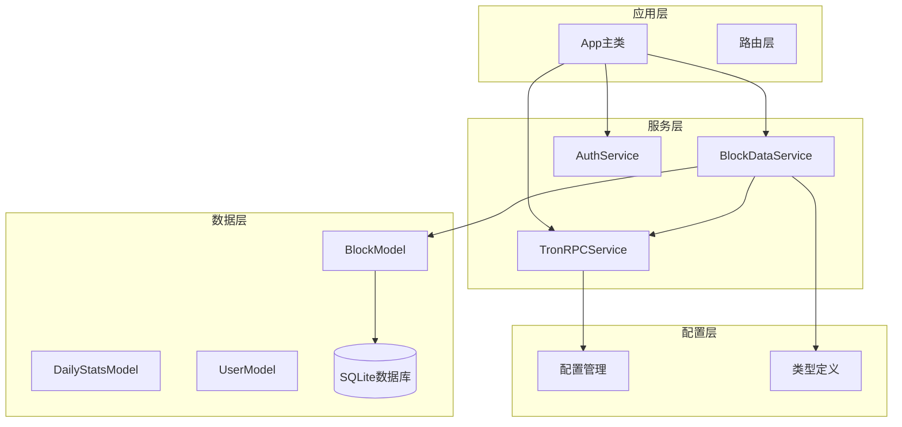
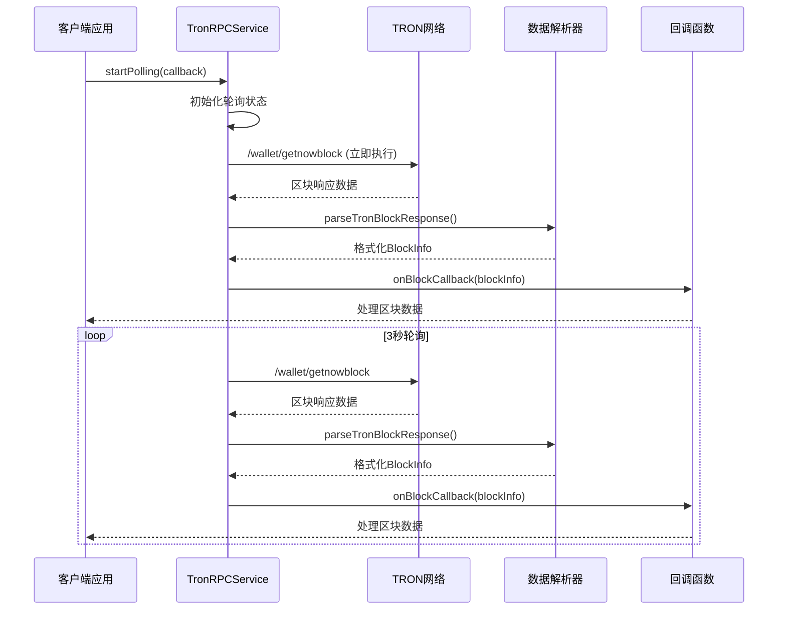
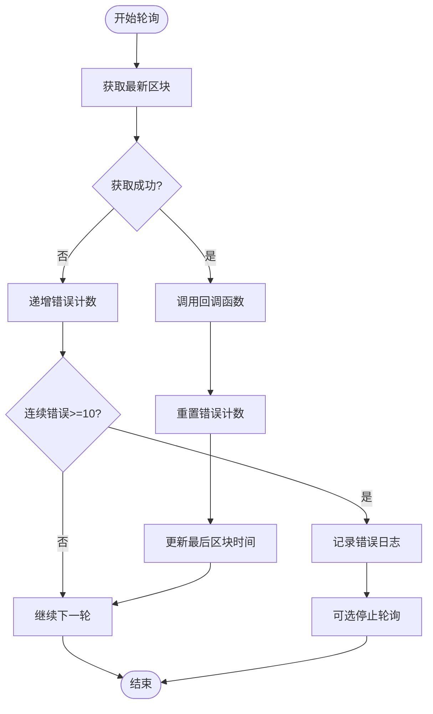
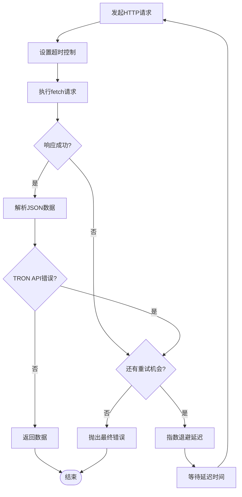
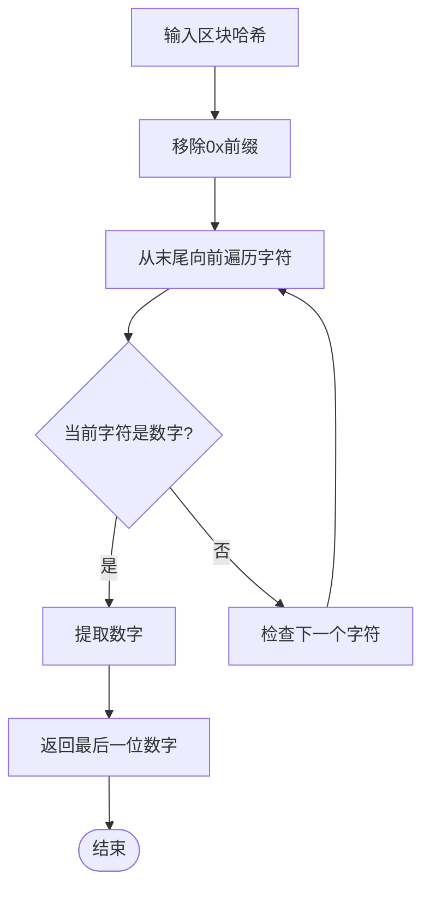
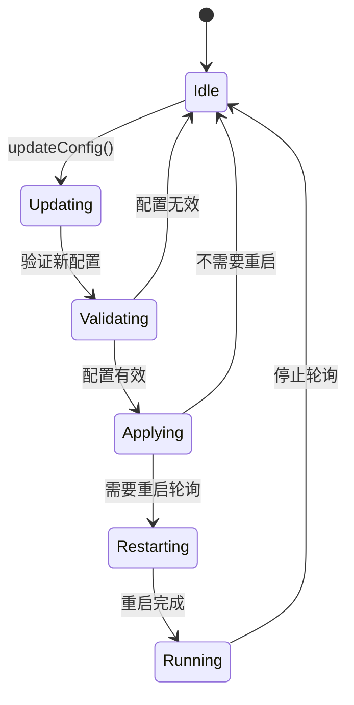
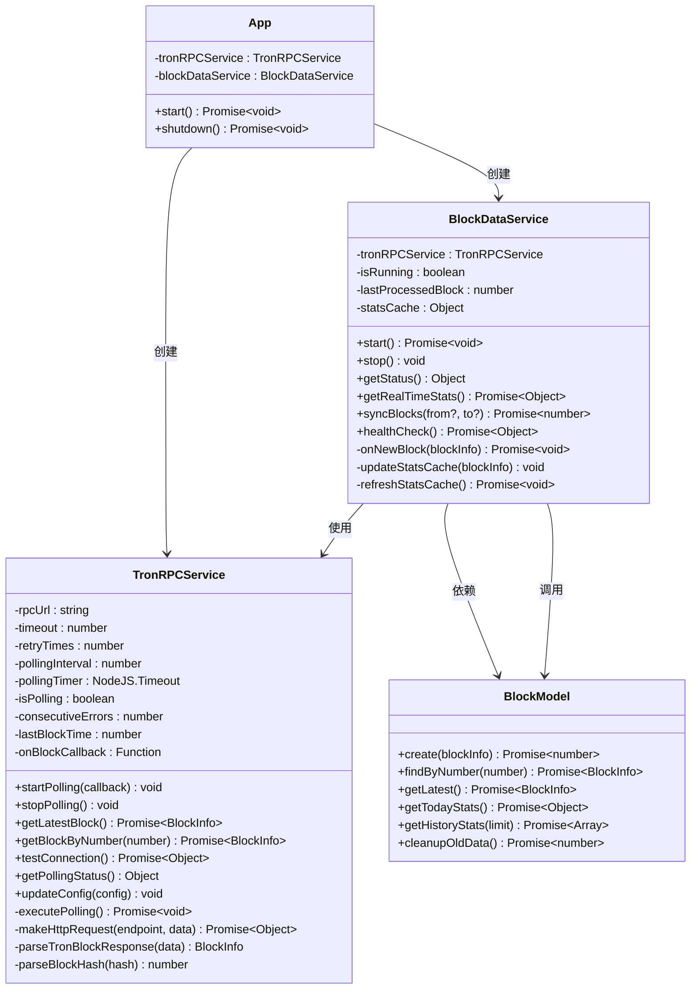
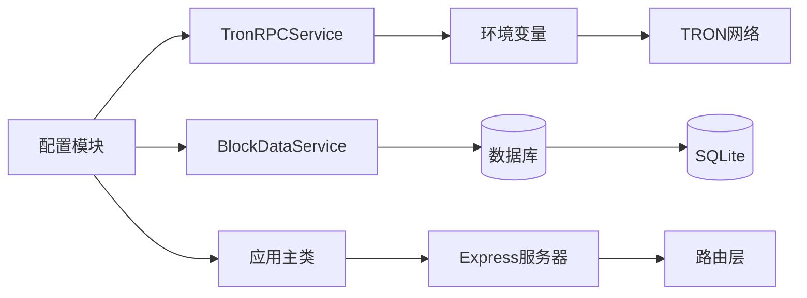

# TRON RPC服务技术文档

<cite>
**本文档引用的文件**
- [TronRPCService.ts](file://src/services/TronRPCService.ts)
- [index.ts](file://src/index.ts)
- [BlockDataService.ts](file://src/services/BlockDataService.ts)
- [config/index.ts](file://src/config/index.ts)
- [BlockModel.ts](file://src/models/BlockModel.ts)
- [types.ts](file://src/models/types.ts)
</cite>

## 目录
1. [简介](#简介)
2. [项目结构概览](#项目结构概览)
3. [核心组件分析](#核心组件分析)
4. [架构概览](#架构概览)
5. [详细组件分析](#详细组件分析)
6. [依赖关系分析](#依赖关系分析)
7. [性能考虑](#性能考虑)
8. [故障排除指南](#故障排除指南)
9. [结论](#结论)

## 简介

TronRPCService是Point-Tron项目的核心区块链数据采集组件，负责与TRON网络进行实时交互，通过HTTP POST请求与TRON网络的`/wallet/getnowblock`和`/wallet/getblockbynum`接口通信，实现高可用的数据获取功能。该服务采用3秒轮询机制，结合指数退避策略的重试机制和请求超时控制，确保在各种网络条件下都能稳定获取区块链数据。

## 项目结构概览



**图表来源**
- [index.ts](file://src/index.ts#L1-L50)
- [TronRPCService.ts](file://src/services/TronRPCService.ts#L1-L30)
- [BlockDataService.ts](file://src/services/BlockDataService.ts#L1-L20)

**章节来源**
- [index.ts](file://src/index.ts#L1-L163)
- [TronRPCService.ts](file://src/services/TronRPCService.ts#L1-L258)

## 核心组件分析

### TronRPCService类设计

TronRPCService是一个专门设计的区块链数据采集服务，具有以下核心特性：

- **配置驱动**：支持通过构造函数参数或全局配置进行灵活配置
- **高可用性**：内置指数退避重试机制和超时控制
- **状态管理**：完整的轮询状态跟踪和监控功能
- **数据解析**：智能的区块哈希解析和数据转换

### 主要接口定义

```typescript
interface TronRPCConfig {
  rpcUrl: string;
  timeout: number;
  retryTimes: number;
  pollingInterval: number;
}

interface TronBlockResponse {
  blockID: string;
  block_header: {
    raw_data: {
      number: number;
      timestamp: number;
    };
  };
}
```

**章节来源**
- [TronRPCService.ts](file://src/services/TronRPCService.ts#L1-L258)
- [config/index.ts](file://src/config/index.ts#L1-L52)

## 架构概览



**图表来源**
- [TronRPCService.ts](file://src/services/TronRPCService.ts#L35-L85)
- [BlockDataService.ts](file://src/services/BlockDataService.ts#L25-L50)

## 详细组件分析

### 3秒轮询机制实现

#### startPolling方法

```typescript
public startPolling(callback: (blockInfo: BlockInfo) => void): void {
  if (this.isPolling) {
    console.warn('RPC轮询已在运行中');
    return;
  }

  this.onBlockCallback = callback;
  this.isPolling = true;
  this.consecutiveErrors = 0;

  console.log(`开始TRON RPC轮询，间隔: ${this.pollingInterval}ms`);

  // 立即执行一次
  this.executePolling();

  // 设置定时器
  this.pollingTimer = setInterval(() => {
    this.executePolling();
  }, this.pollingInterval);
}
```

#### stopPolling方法

```typescript
public stopPolling(): void {
  if (this.pollingTimer) {
    clearInterval(this.pollingTimer);
    this.pollingTimer = null;
  }
  this.isPolling = false;
  this.onBlockCallback = null;
  console.log('TRON RPC轮询已停止');
}
```

#### executePolling错误处理逻辑



**图表来源**
- [TronRPCService.ts](file://src/services/TronRPCService.ts#L60-L85)

### 指数退避重试机制

#### 重试策略实现

```typescript
private async makeHttpRequest(endpoint: string, requestData: any): Promise<TronBlockResponse> {
  let lastError: Error = new Error('未知错误');
  const url = this.rpcUrl + endpoint;

  for (let attempt = 1; attempt <= this.retryTimes; attempt++) {
    try {
      console.log(`尝试第${attempt}次请求: ${url}`);

      const controller = new AbortController();
      const timeoutId = setTimeout(() => controller.abort(), this.timeout);

      const response = await fetch(url, {
        method: 'POST',
        headers: {
          'Content-Type': 'application/json',
          'User-Agent': 'Point-Tron/1.0'
        },
        body: JSON.stringify(requestData),
        signal: controller.signal
      });

      clearTimeout(timeoutId);

      if (!response.ok) {
        throw new Error(`HTTP ${response.status}: ${response.statusText}`);
      }

      const data = await response.json();

      // 检查TRON API错误
      if (data.Error) {
        throw new Error(`TRON API错误: ${data.Error}`);
      }

      return data;

    } catch (error: any) {
      lastError = error as Error;
      console.warn(`请求尝试${attempt}失败:`, error?.message);

      if (attempt < this.retryTimes) {
        // 指数退避重试策略
        const delay = Math.min(1000 * Math.pow(2, attempt - 1), 5000);
        console.log(`等待${delay}ms后重试...`);
        await new Promise(resolve => setTimeout(resolve, delay));
      }
    }
  }

  throw new Error(`RPC请求失败，已重试${this.retryTimes}次: ${lastError.message}`);
}
```

#### 重试机制流程图



**图表来源**
- [TronRPCService.ts](file://src/services/TronRPCService.ts#L90-L140)

### 区块哈希解析算法

#### parseBlockHash方法实现

```typescript
private parseBlockHash(hash: string): number {
  // TRON区块哈希格式类似: "0000000002fa5f7e8c23b73b234bd8e0d3d31a25de8e4ce2c9e50c175eb4c2b6"
  // 需要找到最后一个阿拉伯数字 (0-9)
  
  // 移除可能的 0x 前缀
  const cleanHash = hash.replace(/^0x/, '');
  
  // 从末尾开始查找最后一个数字
  for (let i = cleanHash.length - 1; i >= 0; i--) {
    const char = cleanHash[i];
    if (/[0-9]/.test(char)) {
      return parseInt(char, 10);
    }
  }
  
  // 如果没有找到数字，默认返回0
  console.warn(`区块哈希中未找到数字: ${hash}`);
  return 0;
}
```

#### 哈希解析流程



**图表来源**
- [TronRPCService.ts](file://src/services/TronRPCService.ts#L180-L210)

### 配置管理系统

#### updateConfig方法

```typescript
public updateConfig(newConfig: Partial<TronRPCConfig>): void {
  if (newConfig.rpcUrl) this.rpcUrl = newConfig.rpcUrl;
  if (newConfig.timeout) this.timeout = newConfig.timeout;
  if (newConfig.retryTimes) this.retryTimes = newConfig.retryTimes;
  if (newConfig.pollingInterval) {
    this.pollingInterval = newConfig.pollingInterval;
    
    // 如果正在轮询，重启以应用新间隔
    if (this.isPolling && this.onBlockCallback) {
      const callback = this.onBlockCallback;
      this.stopPolling();
      this.startPolling(callback);
    }
  }
}
```

#### 配置更新流程



**图表来源**
- [TronRPCService.ts](file://src/services/TronRPCService.ts#L240-L258)

**章节来源**
- [TronRPCService.ts](file://src/services/TronRPCService.ts#L35-L258)

## 依赖关系分析

### 服务间依赖关系



**图表来源**
- [TronRPCService.ts](file://src/services/TronRPCService.ts#L1-L30)
- [BlockDataService.ts](file://src/services/BlockDataService.ts#L1-L20)
- [index.ts](file://src/index.ts#L15-L25)

### 配置依赖关系



**图表来源**
- [config/index.ts](file://src/config/index.ts#L1-L52)
- [TronRPCService.ts](file://src/services/TronRPCService.ts#L20-L30)

**章节来源**
- [TronRPCService.ts](file://src/services/TronRPCService.ts#L1-L258)
- [BlockDataService.ts](file://src/services/BlockDataService.ts#L1-L273)
- [index.ts](file://src/index.ts#L1-L163)

## 性能考虑

### 轮询优化策略

1. **3秒间隔平衡**：3秒的轮询间隔在实时性和资源消耗之间取得平衡
2. **异步处理**：所有网络请求都是异步的，不会阻塞主线程
3. **超时控制**：每个请求都有明确的超时限制，防止长时间等待
4. **错误恢复**：连续错误达到一定阈值时会发出警告，避免无限重试

### 内存管理

- **定时器清理**：stopPolling方法确保及时清理定时器，防止内存泄漏
- **状态重置**：每次轮询结束后重置错误计数，避免状态累积
- **回调清理**：停止轮询时清理回调函数引用

### 网络优化

- **指数退避**：重试间隔采用指数增长策略，避免对网络造成过大压力
- **超时控制**：合理的超时设置防止请求挂起
- **连接复用**：使用AbortController实现请求取消，支持连接复用

## 故障排除指南

### 常见问题及解决方案

#### 连接问题

```typescript
// 测试连接
async function testConnection() {
  const tronRPC = new TronRPCService();
  const result = await tronRPC.testConnection();
  
  if (result.success) {
    console.log(`连接成功，延迟: ${result.latency}ms`);
  } else {
    console.error(`连接失败: ${result.error}`);
  }
}
```

#### 轮询状态监控

```typescript
// 获取轮询状态
const status = tronRPC.getPollingStatus();
console.log(`轮询状态: ${status.isActive}`);
console.log(`连续错误: ${status.consecutiveErrors}`);
console.log(`最后区块时间: ${new Date(status.lastBlockTime)}`);
```

#### 配置验证

```typescript
// 验证配置
const config = {
  rpcUrl: 'https://api.trongrid.io',
  timeout: 5000,
  retryTimes: 3,
  pollingInterval: 3000
};

const tronRPC = new TronRPCService(config);
```

**章节来源**
- [TronRPCService.ts](file://src/services/TronRPCService.ts#L215-L240)

## 结论

TronRPCService作为Point-Tron项目的核心组件，通过精心设计的架构实现了高可用的区块链数据采集功能。其主要优势包括：

1. **可靠性**：指数退避重试机制和超时控制确保在网络不稳定情况下的数据获取
2. **实时性**：3秒轮询机制保证了数据的及时性
3. **可维护性**：清晰的代码结构和完善的错误处理机制便于维护
4. **扩展性**：模块化设计支持功能扩展和配置调整

该服务为整个系统的数据采集层提供了坚实的基础，通过与BlockDataService的紧密配合，实现了完整的区块链数据处理流水线。其设计充分考虑了生产环境的稳定性要求，是构建可靠区块链应用的重要基础设施。