# 业务逻辑架构文档

<cite>
**本文档引用的文件**
- [TronRPCService.ts](file://src/services/TronRPCService.ts)
- [BlockDataService.ts](file://src/services/BlockDataService.ts)
- [AuthService.ts](file://src/services/AuthService.ts)
- [index.ts](file://src/index.ts)
- [types.ts](file://src/models/types.ts)
- [BlockModel.ts](file://src/models/BlockModel.ts)
- [DailyStatsModel.ts](file://src/models/DailyStatsModel.ts)
- [BlockPointsModel.ts](file://src/models/BlockPointsModel.ts)
- [database/index.ts](file://src/database/index.ts)
- [config/index.ts](file://src/config/index.ts)
- [middleware/auth.ts](file://src/middleware/auth.ts)
- [routes/blocks.ts](file://src/routes/blocks.ts)
</cite>

## 目录
1. [概述](#概述)
2. [系统架构概览](#系统架构概览)
3. [核心服务组件](#核心服务组件)
4. [数据流分析](#数据流分析)
5. [服务间依赖关系](#服务间依赖关系)
6. [时序图说明](#时序图说明)
7. [性能优化策略](#性能优化策略)
8. [故障处理机制](#故障处理机制)
9. [总结](#总结)

## 概述

本系统是一个基于TRON区块链的区块数据分析平台，主要功能包括：
- 实时监控TRON网络区块产生
- 自动采集、处理和存储区块数据
- 提供区块打点计分系统
- 实现完整的用户认证和授权机制
- 提供RESTful API接口和Web管理界面

系统采用模块化设计，通过依赖注入实现服务解耦，确保代码的可维护性和扩展性。

## 系统架构概览

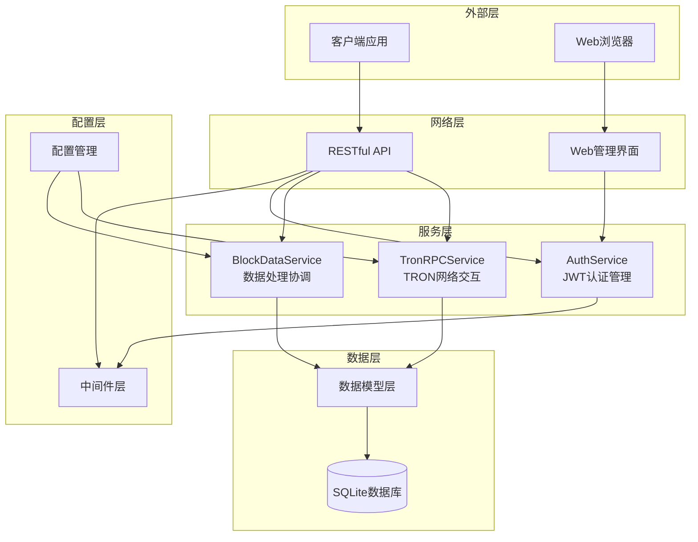

**图表来源**
- [index.ts](file://src/index.ts#L1-L163)
- [TronRPCService.ts](file://src/services/TronRPCService.ts#L1-L258)
- [BlockDataService.ts](file://src/services/BlockDataService.ts#L1-L273)

## 核心服务组件

### TronRPCService - TRON网络交互服务

TronRPCService是系统的核心网络通信组件，负责与TRON区块链网络进行交互。

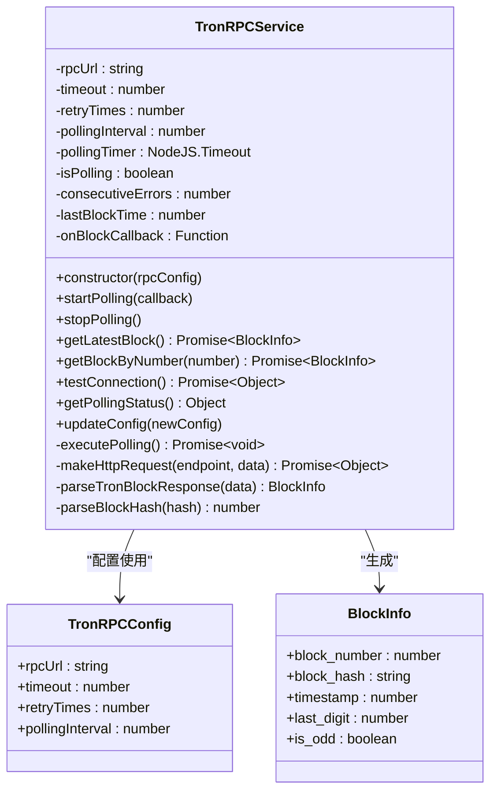

**图表来源**
- [TronRPCService.ts](file://src/services/TronRPCService.ts#L15-L258)
- [types.ts](file://src/models/types.ts#L1-L15)

#### 关键特性

1. **轮询机制**：每3秒自动轮询获取最新区块
2. **重试机制**：支持指数退避重试策略，最多重试3次
3. **超时控制**：支持自定义请求超时时间（默认5秒）
4. **错误处理**：连续错误超过10次会发出警告
5. **状态监控**：提供详细的轮询状态信息

#### HTTP请求处理流程

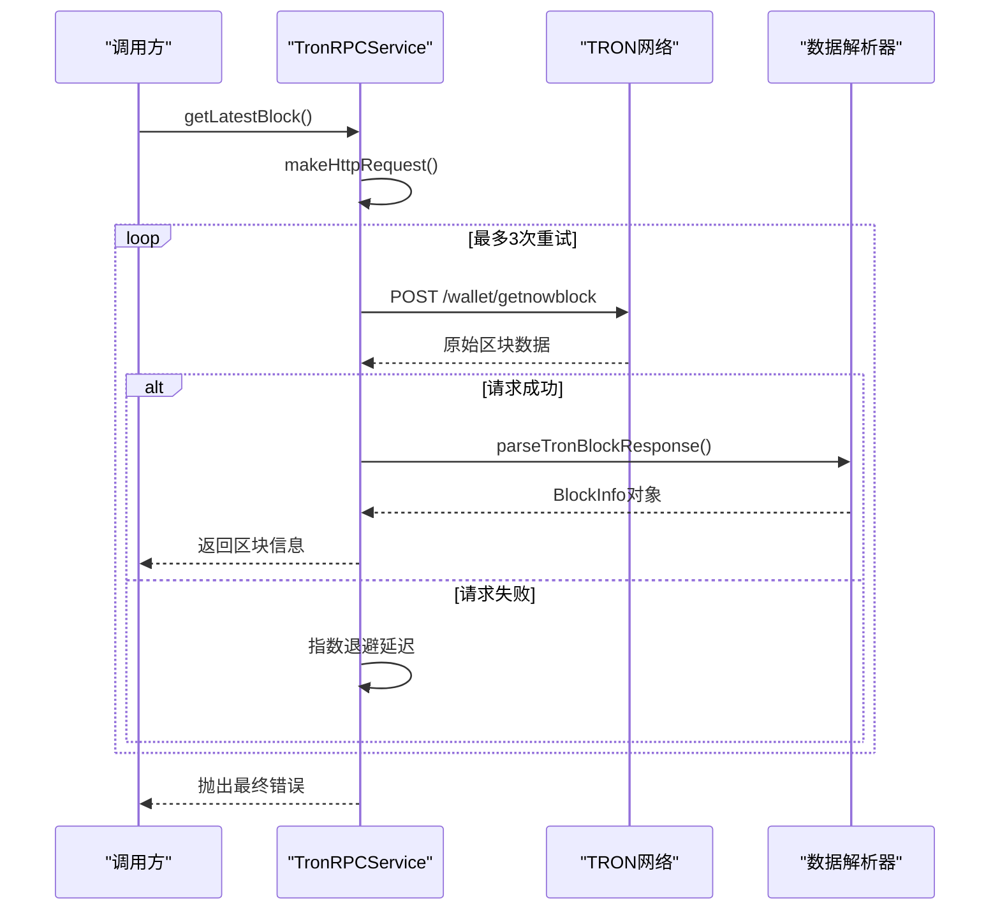

**图表来源**
- [TronRPCService.ts](file://src/services/TronRPCService.ts#L70-L120)

**章节来源**
- [TronRPCService.ts](file://src/services/TronRPCService.ts#L1-L258)

### BlockDataService - 数据处理协调服务

BlockDataService作为数据处理的核心协调器，负责协调各个数据处理环节。

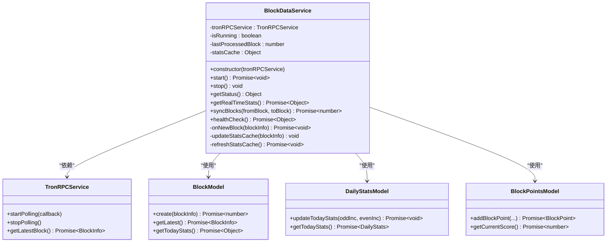

**图表来源**
- [BlockDataService.ts](file://src/services/BlockDataService.ts#L8-L273)
- [BlockModel.ts](file://src/models/BlockModel.ts#L1-L170)
- [DailyStatsModel.ts](file://src/models/DailyStatsModel.ts#L1-L165)
- [BlockPointsModel.ts](file://src/models/BlockPointsModel.ts#L1-L219)

#### 数据处理流程

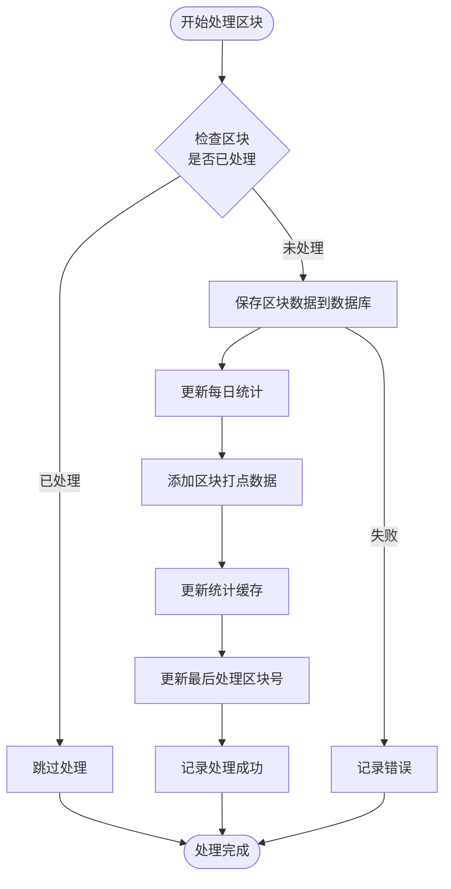

**图表来源**
- [BlockDataService.ts](file://src/services/BlockDataService.ts#L50-L85)

**章节来源**
- [BlockDataService.ts](file://src/services/BlockDataService.ts#L1-L273)

### AuthService - JWT认证服务

AuthService专门负责JWT令牌的生成、验证和刷新等认证相关功能。

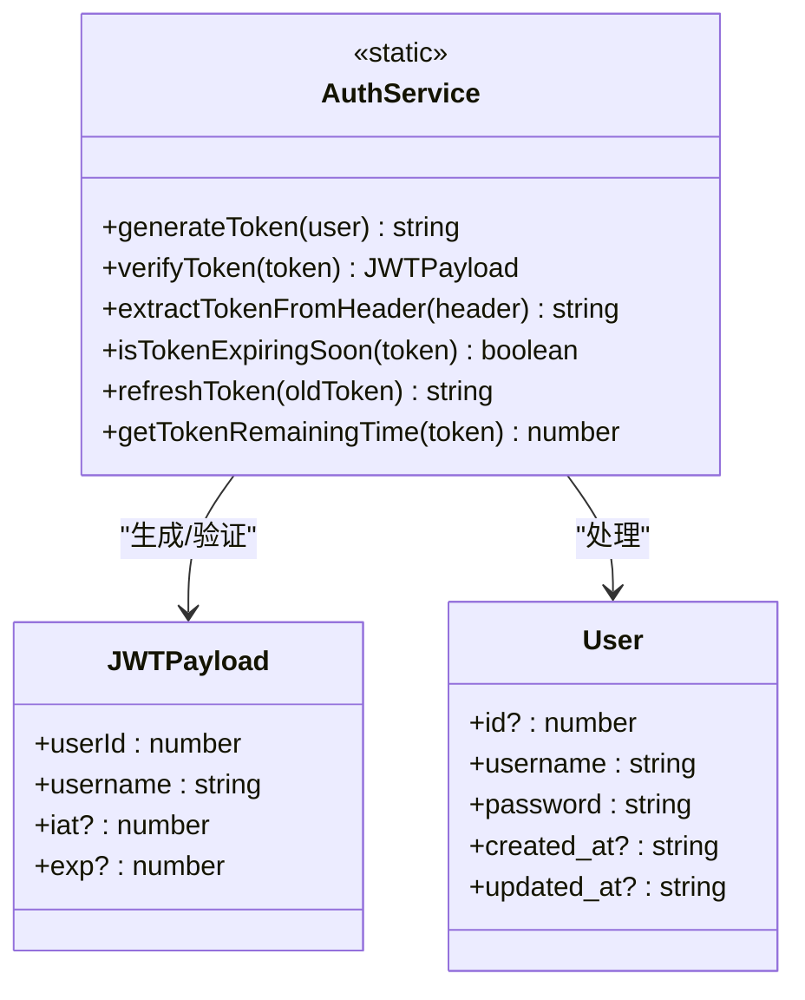

**图表来源**
- [AuthService.ts](file://src/services/AuthService.ts#L1-L104)
- [types.ts](file://src/models/types.ts#L10-L20)

#### JWT生命周期管理

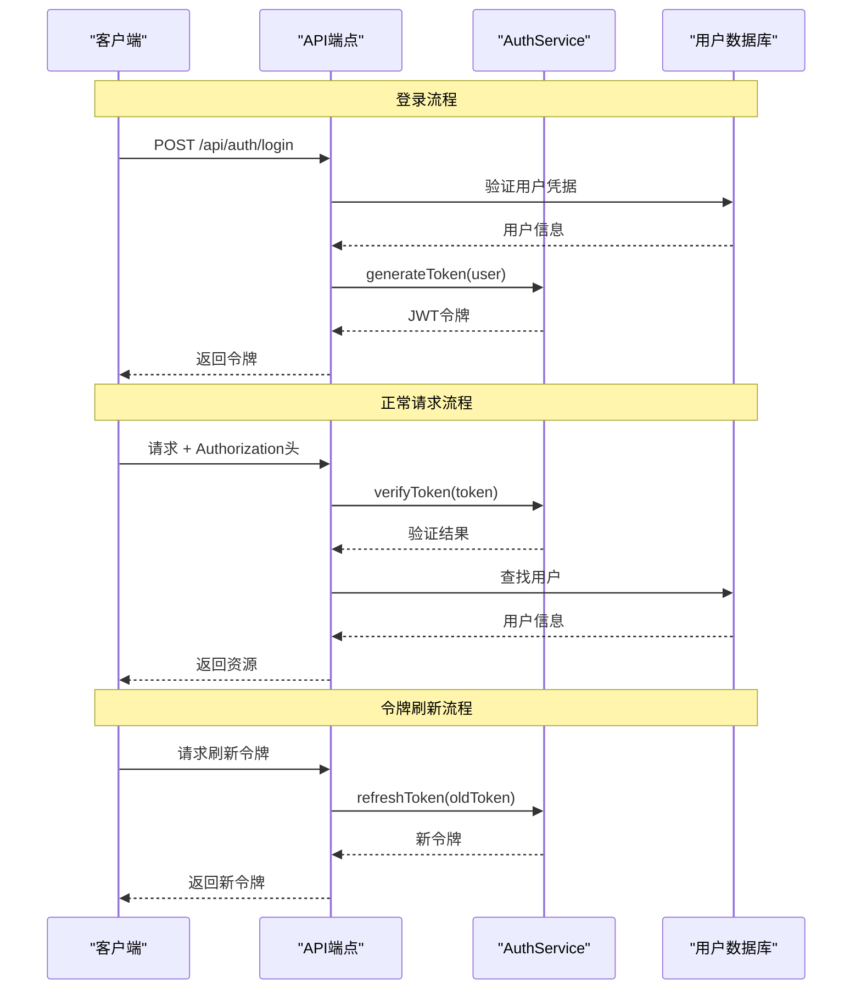

**图表来源**
- [AuthService.ts](file://src/services/AuthService.ts#L10-L104)
- [middleware/auth.ts](file://src/middleware/auth.ts#L15-L50)

**章节来源**
- [AuthService.ts](file://src/services/AuthService.ts#L1-L104)

## 数据流分析

### 区块数据采集流程

系统从TRON网络获取区块数据的完整流程如下：

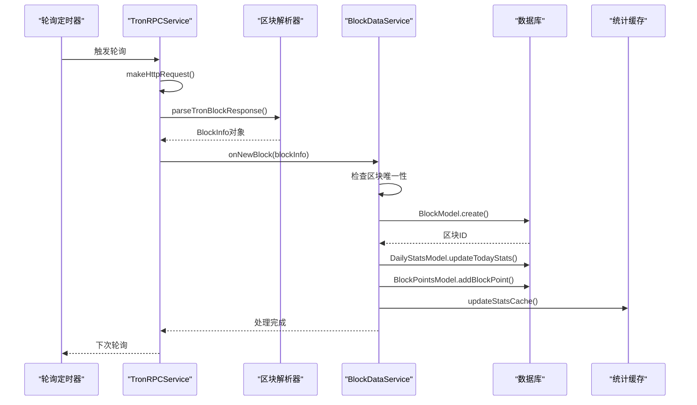

**图表来源**
- [TronRPCService.ts](file://src/services/TronRPCService.ts#L40-L70)
- [BlockDataService.ts](file://src/services/BlockDataService.ts#L50-L85)

### 数据存储架构

```mermaid
erDiagram
BLOCKS {
int id PK
bigint block_number UK
varchar block_hash
bigint timestamp
int last_digit
boolean is_odd
timestamp created_at
}
DAILY_STATS {
int id PK
date date UK
int total_blocks
int odd_count
int even_count
timestamp updated_at
}
BLOCK_POINTS {
int id PK
bigint block_number UK
varchar block_hash
bigint timestamp
int last_digit
boolean is_odd
int point_change
int cumulative_score
timestamp created_at
}
USERS {
int id PK
varchar username UK
varchar password
timestamp created_at
timestamp updated_at
}
CONFIG {
int id PK
varchar key UK
text value
varchar description
timestamp updated_at
}
BLOCKS ||--|| DAILY_STATS : "每日统计关联"
BLOCKS ||--|| BLOCK_POINTS : "打点数据关联"
USERS ||--{} CONFIG : "系统配置"
```

**图表来源**
- [BlockModel.ts](file://src/models/BlockModel.ts#L1-L50)
- [DailyStatsModel.ts](file://src/models/DailyStatsModel.ts#L1-L50)
- [BlockPointsModel.ts](file://src/models/BlockPointsModel.ts#L1-L50)

**章节来源**
- [BlockModel.ts](file://src/models/BlockModel.ts#L1-L170)
- [DailyStatsModel.ts](file://src/models/DailyStatsModel.ts#L1-L165)
- [BlockPointsModel.ts](file://src/models/BlockPointsModel.ts#L1-L219)

## 服务间依赖关系

### 依赖注入架构

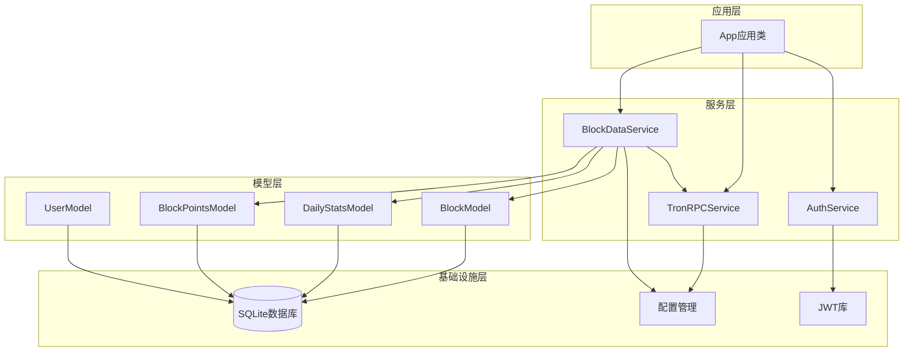

**图表来源**
- [index.ts](file://src/index.ts#L20-L30)
- [BlockDataService.ts](file://src/services/BlockDataService.ts#L15-L20)

### 服务启动顺序

系统启动时的服务初始化遵循严格的依赖顺序：

1. **数据库连接**：首先建立数据库连接
2. **默认管理员创建**：确保系统有初始管理员账户
3. **TRON RPC服务启动**：开始区块轮询
4. **区块数据服务启动**：协调数据处理流程
5. **Express服务器启动**：提供API和Web服务

**章节来源**
- [index.ts](file://src/index.ts#L80-L120)

## 时序图说明

### 完整的数据采集到入库流程

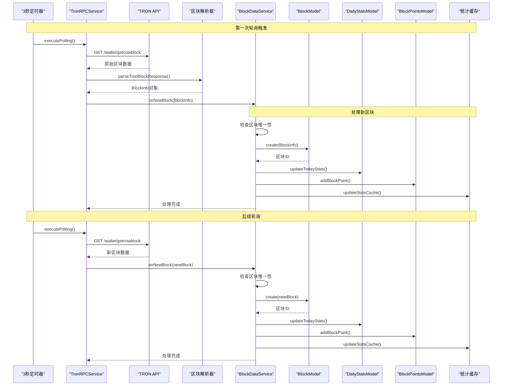

**图表来源**
- [TronRPCService.ts](file://src/services/TronRPCService.ts#L40-L70)
- [BlockDataService.ts](file://src/services/BlockDataService.ts#L50-L85)

## 性能优化策略

### 缓存机制

系统实现了多层次的缓存机制来提升性能：

1. **统计缓存**：在内存中缓存当日统计数据，减少数据库查询
2. **索引优化**：为关键查询字段创建数据库索引
3. **批量处理**：在数据同步时采用批量插入策略

### 数据清理策略

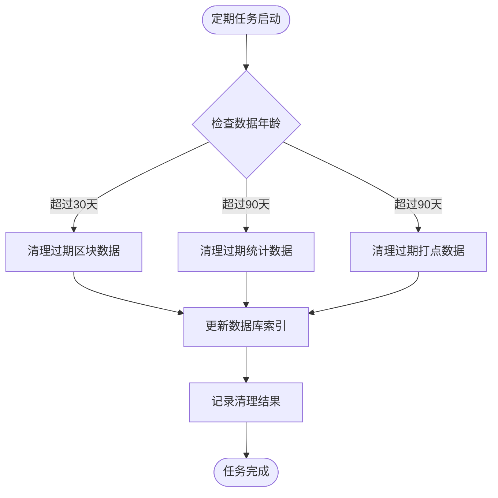

**图表来源**
- [BlockModel.ts](file://src/models/BlockModel.ts#L100-L120)
- [DailyStatsModel.ts](file://src/models/DailyStatsModel.ts#L140-L165)
- [BlockPointsModel.ts](file://src/models/BlockPointsModel.ts#L180-L200)

### 并发处理优化

系统采用异步并发处理来提高效率：

- **并行API调用**：在获取统计数据时并行执行多个查询
- **批量数据库操作**：在数据同步时采用事务批量插入
- **非阻塞I/O**：所有网络请求和数据库操作都采用异步模式

## 故障处理机制

### 错误恢复策略

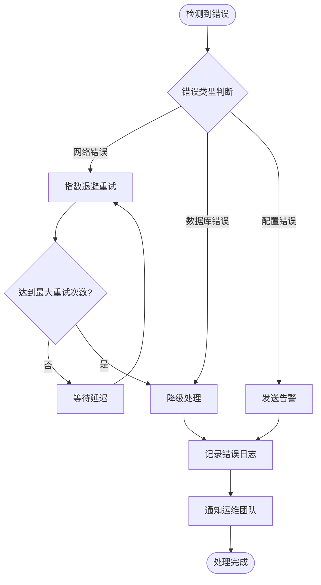

**图表来源**
- [TronRPCService.ts](file://src/services/TronRPCService.ts#L70-L120)

### 健康检查机制

系统提供了全面的健康检查功能：

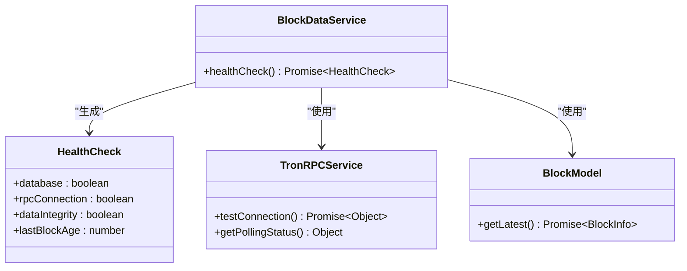

**图表来源**
- [BlockDataService.ts](file://src/services/BlockDataService.ts#L220-L273)

**章节来源**
- [BlockDataService.ts](file://src/services/BlockDataService.ts#L220-L273)

## 总结

本系统通过精心设计的业务逻辑架构，实现了高效、可靠的TRON区块链数据采集和处理系统。主要特点包括：

### 架构优势

1. **模块化设计**：各服务职责明确，便于维护和扩展
2. **依赖注入**：通过构造函数注入降低组件耦合度
3. **异步处理**：全面采用异步编程模式，提升系统吞吐量
4. **容错机制**：完善的错误处理和重试策略

### 核心功能

1. **实时区块监控**：3秒轮询机制确保数据及时性
2. **智能数据处理**：自动识别单双数并生成打点数据
3. **统计分析**：提供丰富的统计数据和趋势分析
4. **安全认证**：完整的JWT认证体系保障系统安全

### 扩展性考虑

系统设计充分考虑了未来的扩展需求：
- 支持多种时间范围的数据分析
- 可扩展的配置管理系统
- 灵活的插件化架构
- 完善的日志和监控体系

这种架构设计不仅满足了当前的功能需求，也为未来的功能扩展奠定了坚实的基础。