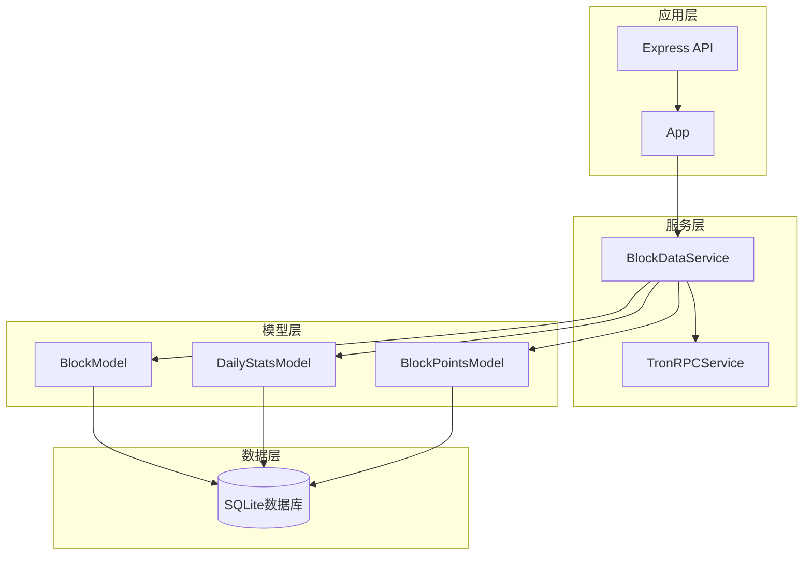
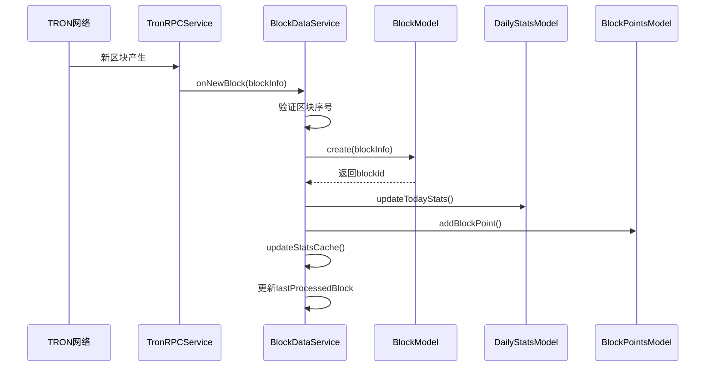
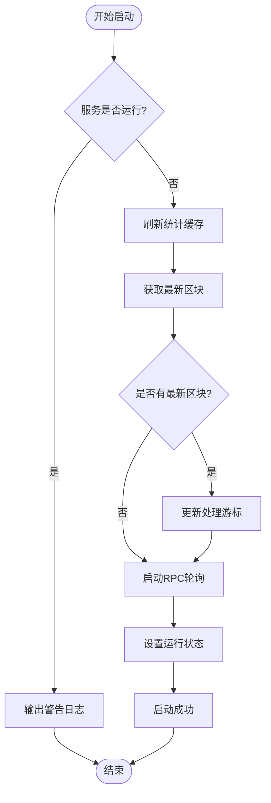
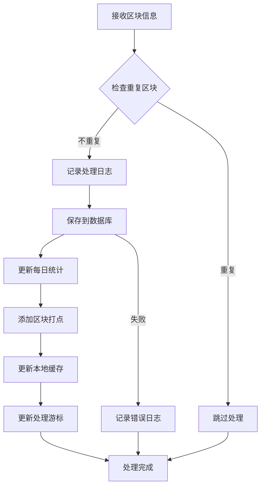
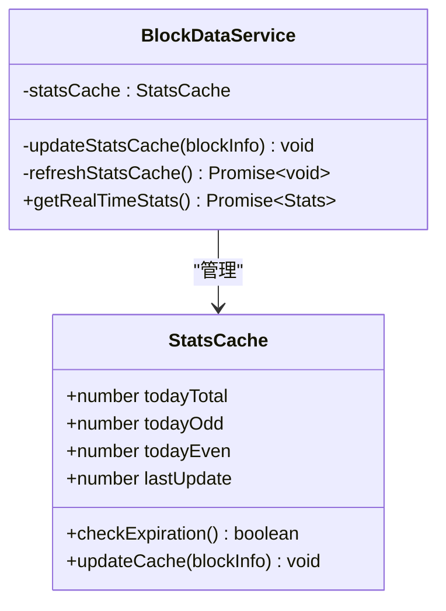
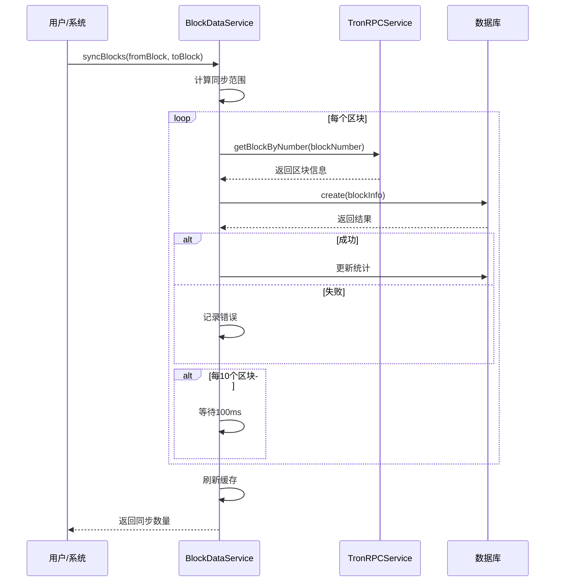
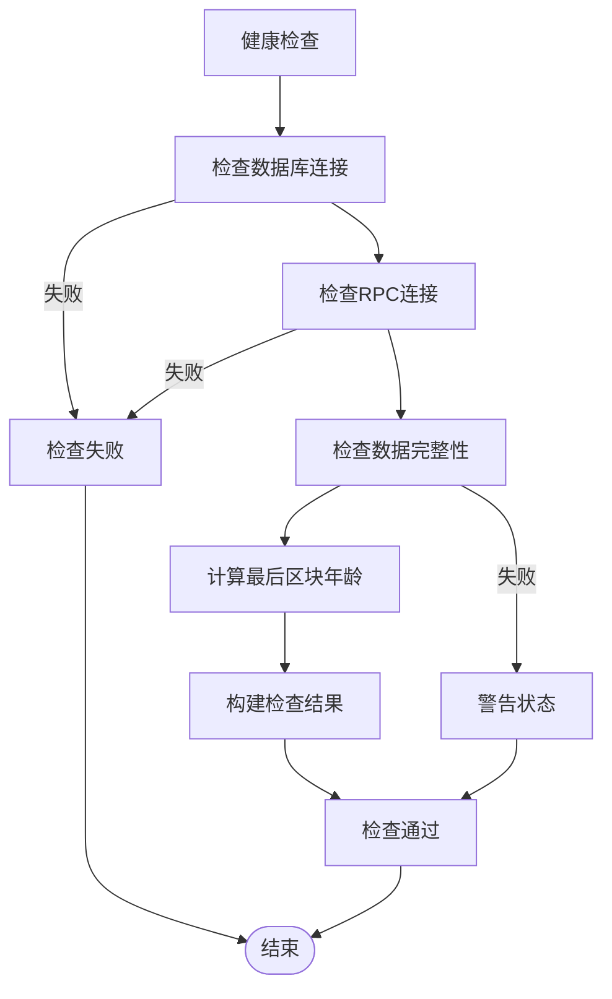
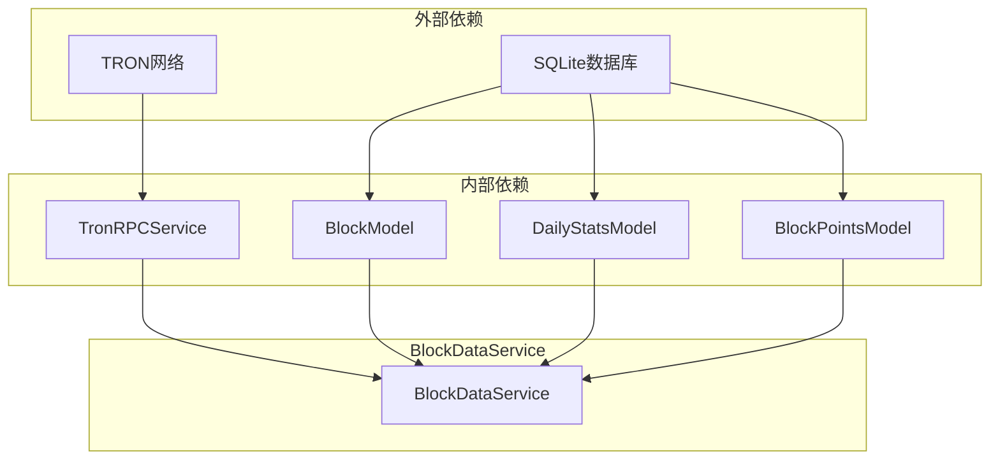

# 区块数据服务

<cite>
**本文档引用的文件**
- [BlockDataService.ts](file://src/services/BlockDataService.ts)
- [TronRPCService.ts](file://src/services/TronRPCService.ts)
- [BlockModel.ts](file://src/models/BlockModel.ts)
- [DailyStatsModel.ts](file://src/models/DailyStatsModel.ts)
- [BlockPointsModel.ts](file://src/models/BlockPointsModel.ts)
- [types.ts](file://src/models/types.ts)
- [index.ts](file://src/index.ts)
</cite>

## 目录
1. [简介](#简介)
2. [项目结构](#项目结构)
3. [核心组件](#核心组件)
4. [架构概览](#架构概览)
5. [详细组件分析](#详细组件分析)
6. [依赖关系分析](#依赖关系分析)
7. [性能考虑](#性能考虑)
8. [故障排除指南](#故障排除指南)
9. [结论](#结论)

## 简介

BlockDataService是Point-Tron系统的核心业务逻辑协调中心，负责从TRON区块链网络实时采集区块数据，进行数据处理、存储和统计分析。该服务通过与TronRPCService的紧密协作，实现了从区块获取到数据入库的完整自动化流程，为整个系统的数据驱动决策提供了坚实的基础。

该服务的主要职责包括：
- 实时监控TRON网络区块产生
- 自动化数据采集和处理
- 维护实时统计缓存
- 提供高效的数据查询接口
- 支持数据同步和补漏功能
- 确保系统健康状态监控

## 项目结构

BlockDataService位于`src/services`目录下，作为业务逻辑层的核心组件，与其他模块形成了清晰的分层架构：



**图表来源**
- [BlockDataService.ts](file://src/services/BlockDataService.ts#L1-L273)
- [TronRPCService.ts](file://src/services/TronRPCService.ts#L1-L258)

**章节来源**
- [BlockDataService.ts](file://src/services/BlockDataService.ts#L1-L273)
- [index.ts](file://src/index.ts#L1-L163)

## 核心组件

BlockDataService的核心组件包括以下几个关键部分：

### 1. 构造函数注入
服务通过构造函数接收TronRPCService实例，实现了依赖注入模式，确保了组件间的松耦合：

```typescript
constructor(tronRPCService: TronRPCService) {
  this.tronRPCService = tronRPCService;
}
```

### 2. 状态管理
服务维护了关键的状态变量：
- `isRunning`: 标识服务运行状态
- `lastProcessedBlock`: 记录最后处理的区块号
- `statsCache`: 实时统计缓存对象

### 3. 缓存机制
实现了高效的统计缓存系统，支持60秒的缓存过期策略，确保统计数据的实时性。

**章节来源**
- [BlockDataService.ts](file://src/services/BlockDataService.ts#L10-L30)

## 架构概览

BlockDataService采用事件驱动的架构模式，通过回调机制实现异步数据处理：



**图表来源**
- [BlockDataService.ts](file://src/services/BlockDataService.ts#L50-L85)
- [TronRPCService.ts](file://src/services/TronRPCService.ts#L40-L70)

## 详细组件分析

### 服务启动流程

BlockDataService的启动过程是一个精心设计的初始化序列：



**图表来源**
- [BlockDataService.ts](file://src/services/BlockDataService.ts#L32-L55)

#### 启动步骤详解

1. **状态检查**: 防止重复启动
2. **缓存初始化**: 调用`refreshStatsCache()`预加载今日统计数据
3. **游标恢复**: 从数据库获取最后处理的区块号
4. **轮询启动**: 通过TronRPCService启动3秒间隔的区块轮询
5. **状态标记**: 将`isRunning`设置为true

### onNewBlock事件处理器

这是BlockDataService最核心的功能模块，负责处理每个新接收到的区块：



**图表来源**
- [BlockDataService.ts](file://src/services/BlockDataService.ts#L57-L85)

#### 数据处理链路

1. **重复检测**: 通过比较`block_number`与`lastProcessedBlock`避免重复处理
2. **数据持久化**: 调用`BlockModel.create()`将区块信息写入数据库
3. **统计更新**: 调用`DailyStatsModel.updateTodayStats()`更新每日统计
4. **打点记录**: 调用`BlockPointsModel.addBlockPoint()`记录打点数据
5. **缓存更新**: 调用`updateStatsCache()`更新内存缓存
6. **游标维护**: 更新`lastProcessedBlock`游标值

### 统计缓存机制

BlockDataService实现了高效的本地缓存机制来提升查询性能：



**图表来源**
- [BlockDataService.ts](file://src/services/BlockDataService.ts#L15-L25)
- [BlockDataService.ts](file://src/services/BlockDataService.ts#L130-L150)

#### 缓存特性

- **时效性**: 60秒自动刷新策略
- **内存存储**: 高速访问性能
- **原子更新**: 确保数据一致性
- **条件更新**: 仅对当日区块有效

### 数据同步功能

`syncBlocks`方法提供了强大的数据同步能力，支持批量处理和错误恢复：



**图表来源**
- [BlockDataService.ts](file://src/services/BlockDataService.ts#L152-L190)

#### 同步特性

- **智能范围**: 自动计算缺失区块范围
- **批量处理**: 支持大规模数据同步
- **错误容忍**: 单个区块失败不影响整体进度
- **速率控制**: 每10个区块延时100ms防止请求过载

### 系统监控能力

BlockDataService提供了完整的系统健康检查功能：



**图表来源**
- [BlockDataService.ts](file://src/services/BlockDataService.ts#L200-L230)

**章节来源**
- [BlockDataService.ts](file://src/services/BlockDataService.ts#L32-L273)

## 依赖关系分析

BlockDataService的依赖关系体现了良好的软件架构原则：



**图表来源**
- [BlockDataService.ts](file://src/services/BlockDataService.ts#L1-L5)
- [index.ts](file://src/index.ts#L10-L15)

### 依赖注入优势

1. **松耦合**: 通过接口而非具体实现依赖
2. **可测试性**: 易于单元测试和模拟
3. **可扩展性**: 方便替换不同实现
4. **单一职责**: 每个组件专注特定功能

**章节来源**
- [BlockDataService.ts](file://src/services/BlockDataService.ts#L1-L273)
- [index.ts](file://src/index.ts#L10-L15)

## 性能考虑

### 缓存策略优化

BlockDataService采用了多层缓存策略来提升性能：

1. **内存缓存**: 本地统计缓存减少数据库查询
2. **60秒过期**: 平衡实时性和性能
3. **条件更新**: 仅对当日数据有效

### 数据库优化

1. **批量操作**: 合并多个数据库操作
2. **索引优化**: 在关键字段上建立索引
3. **事务管理**: 确保数据一致性

### 网络请求优化

1. **指数退避**: 重试策略避免网络拥塞
2. **超时控制**: 防止长时间等待
3. **并发限制**: 控制同时请求数量

## 故障排除指南

### 常见问题及解决方案

#### 1. 服务启动失败
**症状**: 启动时抛出异常
**原因**: 数据库连接失败或RPC服务不可达
**解决**: 检查数据库配置和TRON节点连接

#### 2. 数据同步中断
**症状**: 区块处理出现大量错误
**原因**: 网络不稳定或RPC节点故障
**解决**: 检查网络连接和RPC服务状态

#### 3. 缓存数据不一致
**症状**: 统计数据显示异常
**原因**: 缓存未及时刷新
**解决**: 手动调用`refreshStatsCache()`方法

**章节来源**
- [BlockDataService.ts](file://src/services/BlockDataService.ts#L200-L273)

## 结论

BlockDataService作为Point-Tron系统的核心组件，展现了优秀的软件架构设计。通过事件驱动的异步处理模式、高效的缓存机制和完善的错误处理策略，它成功地实现了从TRON网络区块数据采集到业务数据处理的完整自动化流程。

该服务的主要优势包括：

1. **高可靠性**: 完善的错误处理和重试机制
2. **高性能**: 多层缓存和批量处理优化
3. **可扩展性**: 模块化设计便于功能扩展
4. **易维护**: 清晰的代码结构和依赖关系

未来可以考虑的改进方向：
- 增强监控和告警功能
- 优化大数据量场景下的性能
- 增加更多的数据验证和清洗逻辑
- 支持多种数据库后端