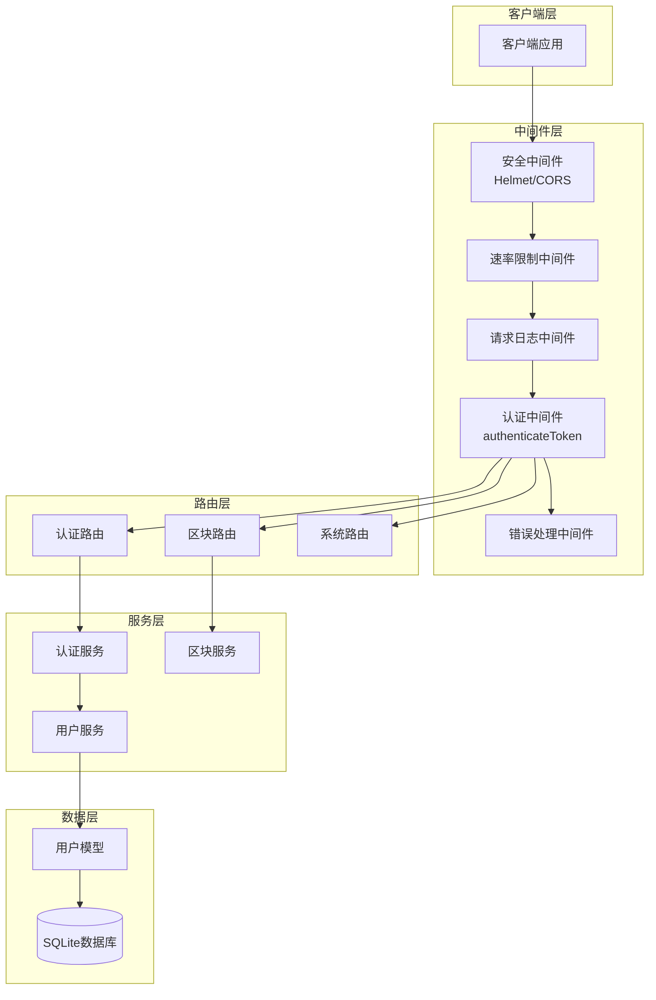
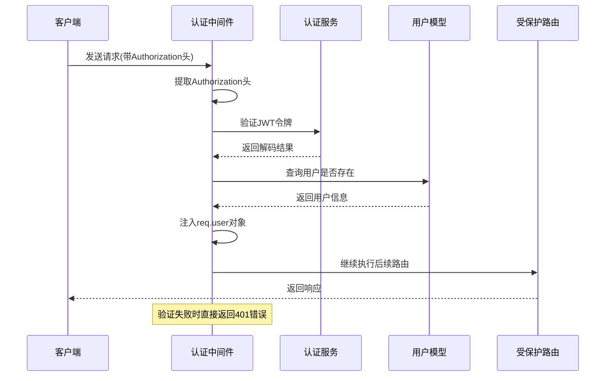
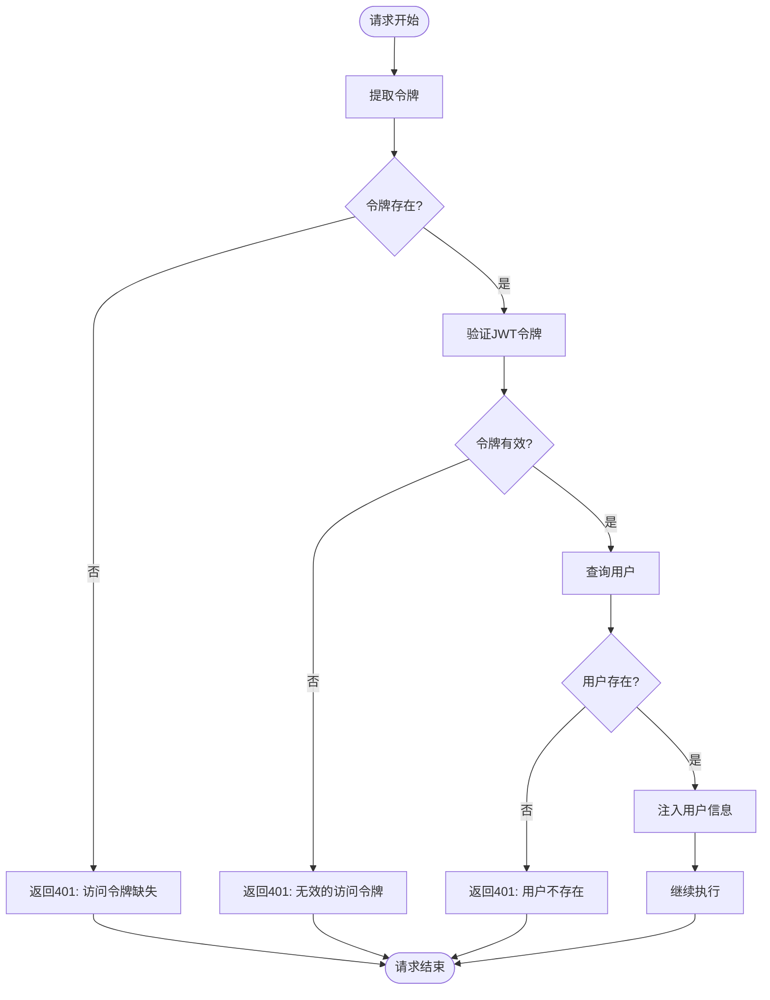
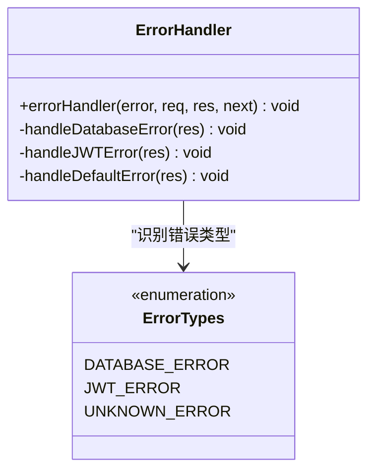
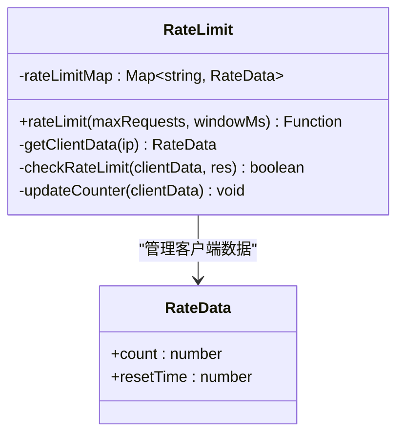
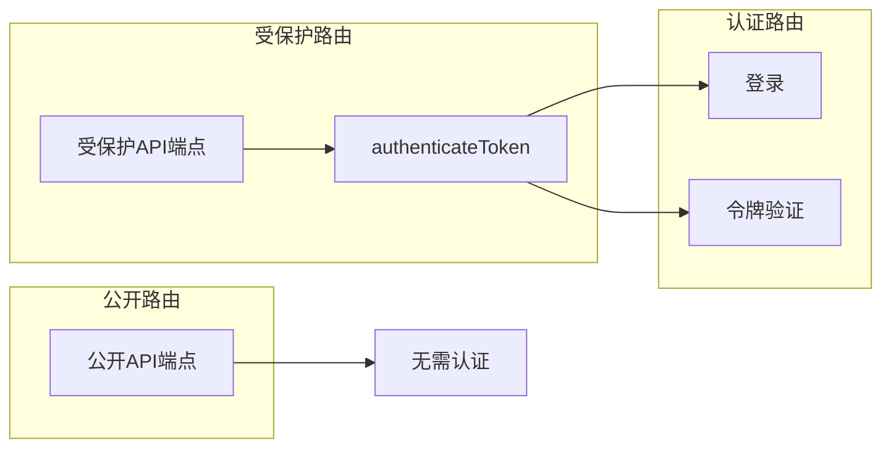
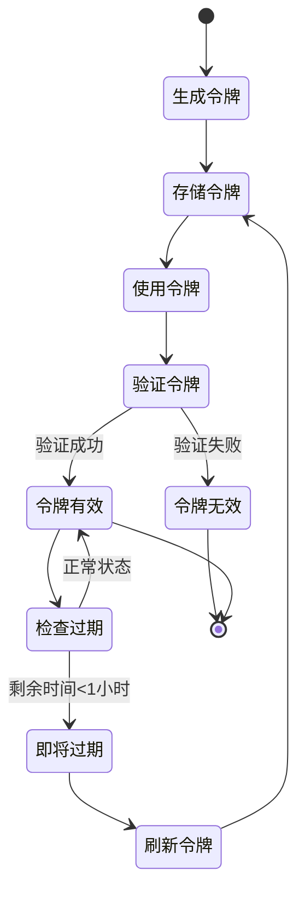
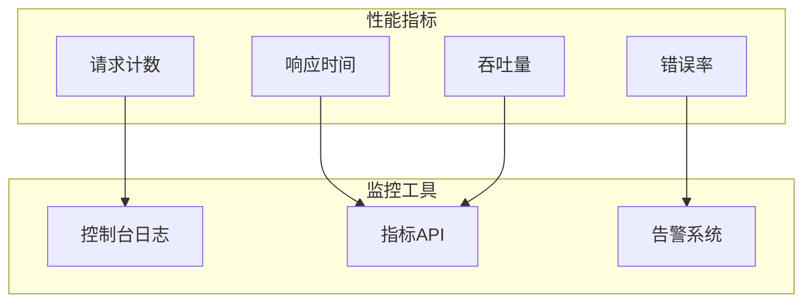

# 中间件与拦截器

<cite>
**本文档引用的文件**
- [src/middleware/auth.ts](file://src/middleware/auth.ts)
- [src/services/AuthService.ts](file://src/services/AuthService.ts)
- [src/models/UserModel.ts](file://src/models/UserModel.ts)
- [src/routes/auth.ts](file://src/routes/auth.ts)
- [src/routes/blocks.ts](file://src/routes/blocks.ts)
- [src/index.ts](file://src/index.ts)
- [src/config/index.ts](file://src/config/index.ts)
</cite>

## 目录
1. [简介](#简介)
2. [项目架构概览](#项目架构概览)
3. [认证中间件核心实现](#认证中间件核心实现)
4. [中间件组件详细分析](#中间件组件详细分析)
5. [中间件应用与集成](#中间件应用与集成)
6. [安全机制与防护](#安全机制与防护)
7. [性能优化考虑](#性能优化考虑)
8. [故障排除指南](#故障排除指南)
9. [总结](#总结)

## 简介

Point-Tron项目采用Express框架构建，实现了完整的中间件系统来保障API的安全性和可靠性。本文档重点分析authenticateToken认证中间件的实现机制，该中间件作为整个应用安全体系的核心组件，负责验证用户身份、保护API端点，并提供统一的错误处理机制。

中间件系统在整个应用中扮演着拦截器的角色，位于客户端请求和业务逻辑之间，确保只有经过验证的请求才能访问受保护的资源。通过精心设计的中间件链，应用能够实现多层次的安全防护、性能监控和错误处理。

## 项目架构概览



**图表来源**
- [src/index.ts](file://src/index.ts#L30-L50)
- [src/middleware/auth.ts](file://src/middleware/auth.ts#L1-L20)

**章节来源**
- [src/index.ts](file://src/index.ts#L1-L163)
- [src/middleware/auth.ts](file://src/middleware/auth.ts#L1-L171)

## 认证中间件核心实现

### authenticateToken中间件架构

authenticateToken中间件是整个认证系统的核心，它实现了完整的JWT令牌验证流程：



**图表来源**
- [src/middleware/auth.ts](file://src/middleware/auth.ts#L18-L70)
- [src/services/AuthService.ts](file://src/services/AuthService.ts#L15-L35)

### 令牌提取与验证流程

中间件首先从HTTP请求头中提取JWT令牌：

```typescript
// 从Authorization头提取令牌
const authHeader = req.headers.authorization;
const token = AuthService.extractTokenFromHeader(authHeader);
```

该方法支持两种格式：
1. **Bearer Token格式**：`Authorization: Bearer <token>`
2. **直接令牌格式**：`Authorization: <token>`

### 多层次验证机制



**图表来源**
- [src/middleware/auth.ts](file://src/middleware/auth.ts#L25-L65)

**章节来源**
- [src/middleware/auth.ts](file://src/middleware/auth.ts#L18-L70)
- [src/services/AuthService.ts](file://src/services/AuthService.ts#L25-L40)

## 中间件组件详细分析

### 类型扩展与接口定义

中间件系统通过TypeScript的类型扩展功能，为Express.Request接口添加了用户信息属性：

```typescript
declare global {
  namespace Express {
    interface Request {
      user?: {
        id: number;
        username: string;
      };
    }
  }
}
```

这种设计允许在后续的路由处理函数中安全地访问`req.user`属性，而无需额外的类型断言。

### 错误处理中间件



**图表来源**
- [src/middleware/auth.ts](file://src/middleware/auth.ts#L72-L100)

错误处理中间件提供了智能的错误分类和响应：

1. **数据库错误**：检测包含"SQLITE"关键字的错误消息
2. **JWT错误**：识别JsonWebTokenError异常
3. **默认错误**：处理未知类型的错误

### 安全头中间件

安全头中间件设置了多层安全防护：

```typescript
// 设置安全头
res.setHeader('X-Content-Type-Options', 'nosniff');
res.setHeader('X-Frame-Options', 'DENY');
res.setHeader('X-XSS-Protection', '1; mode=block');
res.setHeader('Strict-Transport-Security', 'max-age=31536000; includeSubDomains');
```

这些头部信息提供了：
- **X-Content-Type-Options**: 防止MIME类型嗅探攻击
- **X-Frame-Options**: 防止点击劫持攻击
- **X-XSS-Protection**: 启用浏览器XSS过滤器
- **Strict-Transport-Security**: 强制HTTPS通信

### 速率限制中间件



**图表来源**
- [src/middleware/auth.ts](file://src/middleware/auth.ts#L140-L171)

速率限制中间件使用内存中的Map结构跟踪每个客户端的请求频率：

- **窗口大小**：默认60秒
- **最大请求数**：默认100次
- **自动重置**：超过时间窗口后重置计数器

**章节来源**
- [src/middleware/auth.ts](file://src/middleware/auth.ts#L102-L171)

## 中间件应用与集成

### 中间件注册与初始化

在主应用类中，中间件按照特定顺序注册：

```typescript
private initializeMiddlewares(): void {
  // 安全中间件
  this.app.use(helmet({
    contentSecurityPolicy: false, // 为了支持EJS模板
  }));
  this.app.use(cors(corsOptions));
  this.app.use(securityHeaders);
  this.app.use(rateLimit(200, 60000)); // 每分钟最多200个请求

  // 基础中间件
  this.app.use(express.json({ limit: '10mb' }));
  this.app.use(express.urlencoded({ extended: true, limit: '10mb' }));
  this.app.use(requestLogger);
}
```

中间件执行顺序至关重要：
1. **安全中间件**：最先执行，提供基础防护
2. **CORS中间件**：处理跨域请求
3. **速率限制**：控制请求频率
4. **JSON解析**：处理请求体
5. **日志记录**：最后执行，记录完整请求

### 路由保护策略



**图表来源**
- [src/routes/auth.ts](file://src/routes/auth.ts#L45-L55)
- [src/routes/blocks.ts](file://src/routes/blocks.ts#L10-L120)

### 实际应用示例

在实际路由中，中间件的使用方式如下：

```typescript
// 认证路由 - 不需要认证
router.post('/login', async (req, res) => {
  // 登录逻辑
});

// 受保护路由 - 需要认证
router.get('/stats', authenticateToken, async (req, res) => {
  // 只有通过认证的用户才能访问
});
```

**章节来源**
- [src/index.ts](file://src/index.ts#L30-L50)
- [src/routes/auth.ts](file://src/routes/auth.ts#L45-L55)
- [src/routes/blocks.ts](file://src/routes/blocks.ts#L10-L120)

## 安全机制与防护

### JWT令牌生命周期管理



**图表来源**
- [src/services/AuthService.ts](file://src/services/AuthService.ts#L40-L80)

### 多层安全防护

1. **传输层安全**
   - HTTPS强制使用
   - 严格传输安全头设置
   - 内容安全策略配置

2. **应用层安全**
   - JWT令牌验证
   - 用户存在性检查
   - 速率限制防护

3. **数据层安全**
   - 数据库连接加密
   - SQL注入防护
   - 敏感数据脱敏

### 配置安全性

```typescript
// JWT配置
jwt: {
  secret: process.env.JWT_SECRET || 'your-super-secret-jwt-key-change-in-production',
  expiresIn: process.env.JWT_EXPIRES_IN || '7d',
}

// TRON网络配置
tron: {
  rpcUrl: process.env.TRON_RPC_URL || 'https://api.trongrid.io',
  timeout: parseInt(process.env.TRON_TIMEOUT || '5000', 10),
  retryTimes: parseInt(process.env.TRON_RETRY_TIMES || '3', 10),
  pollingInterval: parseInt(process.env.TRON_POLLING_INTERVAL || '3000', 10),
}
```

**章节来源**
- [src/config/index.ts](file://src/config/index.ts#L15-L45)
- [src/services/AuthService.ts](file://src/services/AuthService.ts#L15-L35)

## 性能优化考虑

### 中间件性能特征

1. **认证中间件性能**
   - 异步操作最小化
   - 数据库查询优化
   - 缓存友好的设计

2. **速率限制性能**
   - 内存存储减少延迟
   - 时间窗口算法高效
   - 自动清理机制

3. **日志记录性能**
   - 异步日志写入
   - 流式处理
   - 条件日志记录

### 监控与指标



**图表来源**
- [src/middleware/auth.ts](file://src/middleware/auth.ts#L102-L115)

## 故障排除指南

### 常见认证问题

1. **401 Unauthorized错误**
   ```bash
   # 检查请求头格式
   Authorization: Bearer <your-token-here>
   
   # 或者
   Authorization: <your-token-here>
   ```

2. **令牌过期问题**
   ```typescript
   // 检查令牌剩余时间
   const remainingTime = AuthService.getTokenRemainingTime(token);
   if (remainingTime < 3600) {
     // 令牌即将过期，建议刷新
   }
   ```

3. **用户不存在问题**
   ```typescript
   // 确认用户仍然存在于数据库中
   const user = await UserModel.findById(decoded.userId);
   if (!user) {
     // 用户已被删除或禁用
   }
   ```

### 调试技巧

1. **启用详细日志**
   ```typescript
   // 在开发环境中启用详细错误信息
   console.error('认证中间件错误:', error);
   ```

2. **检查环境变量**
   ```bash
   # 确认JWT密钥配置
   echo $JWT_SECRET
   
   # 确认数据库路径
   echo $DB_PATH
   ```

3. **测试中间件行为**
   ```javascript
   // 使用Postman或curl测试
   curl -H "Authorization: Bearer <token>" \
        -H "Content-Type: application/json" \
        http://localhost:3000/api/blocks/stats
   ```

**章节来源**
- [src/middleware/auth.ts](file://src/middleware/auth.ts#L72-L100)
- [src/services/AuthService.ts](file://src/services/AuthService.ts#L40-L80)

## 总结

Point-Tron项目的中间件系统展现了现代Web应用安全架构的最佳实践。authenticateToken认证中间件作为核心组件，不仅实现了完整的JWT令牌验证流程，还提供了多层次的安全防护和优雅的错误处理机制。

### 主要特性总结

1. **完整的认证流程**：从令牌提取到用户验证的全流程自动化
2. **灵活的错误处理**：针对不同错误类型的智能响应机制
3. **强大的安全防护**：多层安全头设置和速率限制
4. **高性能设计**：异步操作和缓存友好的架构
5. **易于维护**：模块化的中间件设计和清晰的职责分离

### 最佳实践建议

1. **定期更新JWT密钥**：避免使用默认密钥
2. **监控中间件性能**：关注认证延迟和错误率
3. **合理配置速率限制**：根据应用需求调整参数
4. **实施安全审计**：定期检查中间件配置和权限设置
5. **完善日志记录**：确保足够的审计追踪能力

通过这套完善的中间件系统，Point-Tron项目成功构建了一个安全、可靠、高性能的Web应用平台，为后续的功能扩展和维护奠定了坚实的基础。