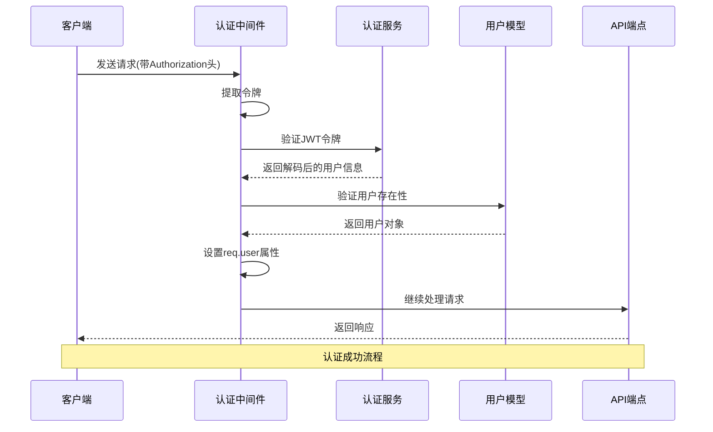
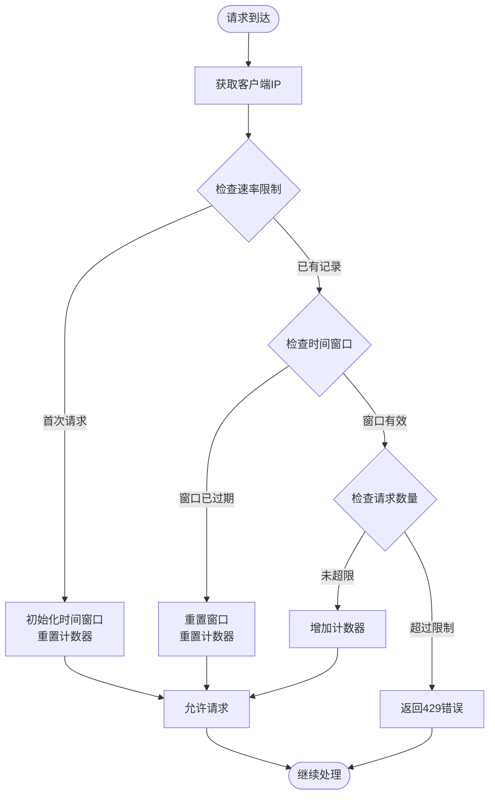
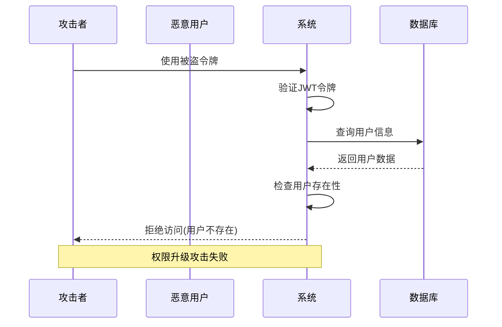

# API访问控制机制详解

<cite>
**本文档引用的文件**
- [src/middleware/auth.ts](file://src/middleware/auth.ts)
- [src/routes/auth.ts](file://src/routes/auth.ts)
- [src/routes/blocks.ts](file://src/routes/blocks.ts)
- [src/routes/system.ts](file://src/routes/system.ts)
- [src/routes/web.ts](file://src/routes/web.ts)
- [src/index.ts](file://src/index.ts)
- [src/config/index.ts](file://src/config/index.ts)
- [src/services/AuthService.ts](file://src/services/AuthService.ts)
- [src/models/UserModel.ts](file://src/models/UserModel.ts)
</cite>

## 目录
1. [简介](#简介)
2. [认证中间件架构](#认证中间件架构)
3. [CORS策略配置](#cors策略配置)
4. [速率限制机制](#速率限制机制)
5. [路由访问控制对比](#路由访问控制对比)
6. [安全头配置](#安全头配置)
7. [权限升级攻击防御](#权限升级攻击防御)
8. [最佳实践建议](#最佳实践建议)
9. [总结](#总结)

## 简介

Point-Tron系统采用了一套完整的API访问控制机制，确保系统安全性和数据完整性。该机制包括JWT令牌认证、CORS策略配置、速率限制以及多种安全中间件的组合使用。本文档将深入分析这些安全措施的实现原理和配置方式。

## 认证中间件架构

### JWT令牌认证流程

系统的核心认证机制基于JSON Web Token (JWT)，通过`authenticateToken`中间件实现：



**图表来源**
- [src/middleware/auth.ts](file://src/middleware/auth.ts#L20-L58)
- [src/services/AuthService.ts](file://src/services/AuthService.ts#L15-L35)

### 认证中间件实现细节

认证中间件的核心逻辑包含以下关键步骤：

1. **令牌提取**：从请求头中提取JWT令牌
2. **令牌验证**：使用密钥验证JWT的有效性
3. **用户存在性检查**：确认用户仍然存在于数据库中
4. **用户信息注入**：将用户信息附加到请求对象

```typescript
// 认证中间件的主要逻辑
export const authenticateToken = async (
  req: Request,
  res: Response<ApiResponse>,
  next: NextFunction
): Promise<void> => {
  try {
    const authHeader = req.headers.authorization;
    const token = AuthService.extractTokenFromHeader(authHeader);

    if (!token) {
      res.status(401).json({
        success: false,
        error: '访问令牌缺失'
      });
      return;
    }

    const decoded = AuthService.verifyToken(token);
    if (!decoded) {
      res.status(401).json({
        success: false,
        error: '无效的访问令牌'
      });
      return;
    }

    // 验证用户是否仍然存在
    const user = await UserModel.findById(decoded.userId);
    if (!user) {
      res.status(401).json({
        success: false,
        error: '用户不存在'
      });
      return;
    }

    // 将用户信息添加到请求对象
    req.user = {
      id: user.id!,
      username: user.username
    };

    next();
  } catch (error) {
    // 错误处理...
  }
};
```

**章节来源**
- [src/middleware/auth.ts](file://src/middleware/auth.ts#L20-L58)
- [src/services/AuthService.ts](file://src/services/AuthService.ts#L15-L35)

## CORS策略配置

### 当前CORS配置分析

系统目前使用宽松的CORS策略，允许所有来源访问：

```typescript
export const corsOptions = {
  origin: function (origin: string | undefined, callback: Function) {
    // 允许所有来源（开发环境）
    // 生产环境中应该配置具体的域名
    callback(null, true);
  },
  credentials: true,
  methods: ['GET', 'POST', 'PUT', 'DELETE', 'OPTIONS'],
  allowedHeaders: ['Content-Type', 'Authorization']
};
```

### 生产环境风险评估

当前的CORS配置在生产环境中存在以下风险：

1. **跨站请求伪造(CSRF)风险**：允许任何域名发起请求
2. **敏感数据泄露**：可能被恶意网站利用
3. **安全边界薄弱**：缺乏源验证机制

### 推荐的生产环境配置

```typescript
// 生产环境推荐的CORS配置
export const productionCorsOptions = {
  origin: function (origin: string | undefined, callback: Function) {
    // 只允许特定域名访问
    const allowedOrigins = [
      'https://yourdomain.com',
      'https://www.yourdomain.com',
      'https://admin.yourdomain.com'
    ];
    
    if (!origin || allowedOrigins.includes(origin)) {
      callback(null, true);
    } else {
      callback(new Error('不允许的源'), false);
    }
  },
  credentials: true,
  methods: ['GET', 'POST', 'PUT', 'DELETE', 'OPTIONS'],
  allowedHeaders: ['Content-Type', 'Authorization'],
  maxAge: 86400 // 预检请求缓存时间
};
```

**章节来源**
- [src/middleware/auth.ts](file://src/middleware/auth.ts#L85-L95)

## 速率限制机制

### 基于内存的速率限制实现

系统实现了简单的基于内存的速率限制机制：



**图表来源**
- [src/middleware/auth.ts](file://src/middleware/auth.ts#L130-L170)

### 速率限制算法详解

```typescript
// 速率限制中间件实现
const rateLimitMap = new Map<string, { count: number; resetTime: number }>();

export const rateLimit = (maxRequests: number = 100, windowMs: number = 60000) => {
  return (req: Request, res: Response, next: NextFunction): void => {
    const clientIp = req.ip || req.connection.remoteAddress || 'unknown';
    const now = Date.now();
    
    const clientData = rateLimitMap.get(clientIp);
    
    if (!clientData || now > clientData.resetTime) {
      // 重置或初始化
      rateLimitMap.set(clientIp, {
        count: 1,
        resetTime: now + windowMs
      });
      next();
      return;
    }
    
    if (clientData.count >= maxRequests) {
      res.status(429).json({
        success: false,
        error: '请求过于频繁，请稍后再试'
      });
      return;
    }
    
    clientData.count++;
    next();
  };
};
```

### 速率限制配置参数

- **默认限制**：每分钟最多200个请求
- **时间窗口**：60秒
- **存储方式**：内存中的Map结构
- **扩展性**：可替换为Redis等持久化存储

**章节来源**
- [src/middleware/auth.ts](file://src/middleware/auth.ts#L130-L170)
- [src/index.ts](file://src/index.ts#L35)

## 路由访问控制对比

### 公开接口 vs 私有接口

系统中的API端点分为两类：公开接口和需要认证的私有接口。

#### 公开接口示例（无需认证）

```typescript
// 登录接口 - 公开接口
router.post('/login', async (req, res: express.Response<ApiResponse>) => {
  // 不需要authenticateToken中间件
  try {
    const { username, password } = req.body;
    const user = await UserModel.verifyPassword(username, password);
    
    if (!user) {
      return res.status(401).json({
        success: false,
        error: '用户名或密码错误'
      });
    }

    const token = AuthService.generateToken(user);
    res.json({
      success: true,
      data: { token, user: { id: user.id, username: user.username } }
    });
  } catch (error) {
    // 错误处理...
  }
});
```

#### 私有接口示例（需要认证）

```typescript
// 区块统计接口 - 私有接口
router.get('/stats', authenticateToken, async (req, res: express.Response<ApiResponse>) => {
  // 需要authenticateToken中间件
  try {
    const [todayStats, currentBlock, hourlyStats] = await Promise.all([
      BlockModel.getTodayStats(),
      BlockModel.getLatest(),
      BlockModel.getTodayHourlyStats()
    ]);

    res.json({
      success: true,
      data: {
        todayTotal: todayStats.total,
        todayOdd: todayStats.odd,
        todayEven: todayStats.even,
        hourlyStats: hourlyStats,
        currentBlock: currentBlock ? {
          number: currentBlock.block_number,
          hash: currentBlock.block_hash,
          timestamp: currentBlock.timestamp,
          lastDigit: currentBlock.last_digit,
          isOdd: currentBlock.is_odd
        } : null
      }
    });
  } catch (error) {
    // 错误处理...
  }
});
```

### 路由访问控制矩阵

| 路由路径 | 是否需要认证 | 中间件 | 用途 |
|---------|-------------|--------|------|
| `/api/auth/login` | ❌ | 无 | 用户登录 |
| `/api/auth/verify` | ✅ | `authenticateToken` | 验证令牌有效性 |
| `/api/blocks/stats` | ✅ | `authenticateToken` | 获取实时区块统计 |
| `/api/blocks/history` | ✅ | `authenticateToken` | 获取历史数据 |
| `/api/blocks/points` | ✅ | `authenticateToken` | 获取区块打点数据 |
| `/api/system/status` | ✅ | `authenticateToken` | 获取系统状态 |
| `/api/config` | ✅ | `authenticateToken` | 配置管理 |
| `/` | ❌ | 无 | 重定向到登录页 |
| `/login` | ❌ | 无 | 登录页面 |
| `/admin` | ✅ | `authenticateToken` | 管理后台 |

**章节来源**
- [src/routes/auth.ts](file://src/routes/auth.ts#L8-L35)
- [src/routes/blocks.ts](file://src/routes/blocks.ts#L10-L40)
- [src/routes/system.ts](file://src/routes/system.ts#L9-L25)

## 安全头配置

### Helmet中间件集成

系统使用Helmet中间件提供多层安全保护：

```typescript
// 安全头中间件配置
export const securityHeaders = (req: Request, res: Response, next: NextFunction): void => {
  res.setHeader('X-Content-Type-Options', 'nosniff');
  res.setHeader('X-Frame-Options', 'DENY');
  res.setHeader('X-XSS-Protection', '1; mode=block');
  res.setHeader('Strict-Transport-Security', 'max-age=31536000; includeSubDomains');
  next();
};
```

### 安全头详解

1. **X-Content-Type-Options: nosniff**
   - 防止浏览器嗅探内容类型
   - 减少MIME类型混淆攻击

2. **X-Frame-Options: DENY**
   - 防止页面被嵌入框架
   - 防范点击劫持攻击

3. **X-XSS-Protection: 1; mode=block**
   - 启用浏览器内置XSS过滤器
   - 在检测到XSS时阻止页面加载

4. **Strict-Transport-Security**
   - 强制使用HTTPS连接
   - 最大有效期1年
   - 包含子域名

**章节来源**
- [src/middleware/auth.ts](file://src/middleware/auth.ts#L97-L105)

## 权限升级攻击防御

### 当前防御措施

系统通过以下机制防范权限升级攻击：

1. **JWT令牌验证**
   ```typescript
   // 验证JWT令牌
   static verifyToken(token: string): JWTPayload | null {
     try {
       const decoded = jwt.verify(token, config.jwt.secret) as JWTPayload;
       return decoded;
     } catch (error: any) {
       console.error('JWT验证失败:', error?.message);
       return null;
     }
   }
   ```

2. **用户存在性检查**
   ```typescript
   // 验证用户是否仍然存在
   const user = await UserModel.findById(decoded.userId);
   if (!user) {
     res.status(401).json({
       success: false,
       error: '用户不存在'
     });
     return;
   }
   ```

3. **令牌刷新机制**
   ```typescript
   // 刷新令牌
   static refreshToken(oldToken: string): string | null {
     try {
       const decoded = jwt.verify(oldToken, config.jwt.secret) as JWTPayload;
       
       // 生成新令牌
       const newPayload: JWTPayload = {
         userId: decoded.userId,
         username: decoded.username
       };

       return jwt.sign(newPayload, config.jwt.secret, {
         expiresIn: config.jwt.expiresIn
       } as jwt.SignOptions);
     } catch (error: any) {
       console.error('刷新令牌失败:', error?.message);
       return null;
     }
   }
   ```

### 权限升级攻击场景分析



**图表来源**
- [src/middleware/auth.ts](file://src/middleware/auth.ts#L35-L50)
- [src/services/AuthService.ts](file://src/services/AuthService.ts#L25-L35)

### 增强防御建议

1. **令牌撤销机制**
   ```typescript
   // 实现令牌黑名单
   const tokenBlacklist = new Set<string>();
   
   export const invalidateToken = (token: string): void => {
     tokenBlacklist.add(token);
   };
   
   export const isTokenValid = (token: string): boolean => {
     return !tokenBlacklist.has(token);
   };
   ```

2. **会话管理**
   ```typescript
   // 会话ID存储
   const activeSessions = new Map<string, { userId: number; expiresAt: number }>();
   
   export const createSession = (userId: number): string => {
     const sessionId = crypto.randomBytes(32).toString('hex');
     activeSessions.set(sessionId, {
       userId,
       expiresAt: Date.now() + 24 * 60 * 60 * 1000 // 24小时
     });
     return sessionId;
   };
   ```

3. **设备指纹识别**
   ```typescript
   // 设备指纹验证
   export const verifyDeviceFingerprint = (req: Request): boolean => {
     const fingerprint = req.headers['user-agent'] + req.ip;
     const storedFingerprint = req.session?.deviceFingerprint;
     
     return fingerprint === storedFingerprint;
   };
   ```

**章节来源**
- [src/services/AuthService.ts](file://src/services/AuthService.ts#L59-L85)
- [src/models/UserModel.ts](file://src/models/UserModel.ts#L40-L50)

## 最佳实践建议

### 1. 生产环境配置优化

**CORS配置改进**
```typescript
// 生产环境推荐的CORS配置
export const productionCorsOptions = {
  origin: function (origin: string | undefined, callback: Function) {
    const allowedOrigins = process.env.ALLOWED_ORIGINS?.split(',') || [];
    if (!origin || allowedOrigins.includes(origin)) {
      callback(null, true);
    } else {
      callback(new Error('不允许的源'), false);
    }
  },
  credentials: true,
  methods: ['GET', 'POST', 'PUT', 'DELETE', 'OPTIONS'],
  allowedHeaders: ['Content-Type', 'Authorization'],
  optionsSuccessStatus: 204 // 对于OPTIONS请求
};
```

**速率限制增强**
```typescript
// Redis支持的速率限制
import Redis from 'ioredis';

const redis = new Redis({
  host: process.env.REDIS_HOST || 'localhost',
  port: parseInt(process.env.REDIS_PORT || '6379'),
  password: process.env.REDIS_PASSWORD
});

export const rateLimitWithRedis = (maxRequests: number = 100, windowMs: number = 60000) => {
  return async (req: Request, res: Response, next: NextFunction): Promise<void> => {
    const clientIp = req.ip || 'unknown';
    const key = `rate_limit:${clientIp}`;
    
    try {
      const current = await redis.get(key);
      
      if (current && parseInt(current) >= maxRequests) {
        res.status(429).json({
          success: false,
          error: '请求过于频繁，请稍后再试'
        });
        return;
      }
      
      await redis.multi()
        .incr(key)
        .expire(key, Math.ceil(windowMs / 1000))
        .exec();
        
      next();
    } catch (error) {
      console.error('Redis速率限制错误:', error);
      next(); // 故障时允许请求
    }
  };
};
```

### 2. 安全监控和告警

```typescript
// 安全事件监控
export const securityMonitor = (req: Request, res: Response, next: NextFunction): void => {
  const userAgent = req.headers['user-agent'] || 'unknown';
  const ip = req.ip || 'unknown';
  
  // 监控异常行为
  if (userAgent.includes('sqlmap') || userAgent.includes('nikto')) {
    console.warn(`安全扫描检测 - IP: ${ip}, UA: ${userAgent}`);
    // 发送告警通知
  }
  
  // 监控高频访问
  if (req.url.startsWith('/api/auth/') && req.method === 'POST') {
    // 记录登录尝试
  }
  
  next();
};
```

### 3. 日志审计

```typescript
// 审计日志中间件
export const auditLog = (req: Request, res: Response, next: NextFunction): void => {
  const start = Date.now();
  
  res.on('finish', () => {
    const duration = Date.now() - start;
    const logEntry = {
      timestamp: new Date().toISOString(),
      method: req.method,
      url: req.originalUrl,
      statusCode: res.statusCode,
      duration: `${duration}ms`,
      ip: req.ip,
      userAgent: req.headers['user-agent'],
      userId: req.user?.id,
      action: getActionType(req)
    };
    
    console.log(JSON.stringify(logEntry));
  });
  
  next();
};

const getActionType = (req: Request): string => {
  if (req.url.includes('/api/auth/')) return 'auth';
  if (req.url.includes('/api/blocks/')) return 'blocks';
  if (req.url.includes('/api/system/')) return 'system';
  return 'other';
};
```

### 4. 密码安全强化

```typescript
// 密码强度验证
export const validatePasswordStrength = (password: string): boolean => {
  // 至少8个字符
  if (password.length < 8) return false;
  
  // 包含大写字母、小写字母、数字和特殊字符
  const hasUpperCase = /[A-Z]/.test(password);
  const hasLowerCase = /[a-z]/.test(password);
  const hasNumbers = /\d/.test(password);
  const hasSpecialChars = /[!@#$%^&*(),.?":{}|<>]/.test(password);
  
  return hasUpperCase && hasLowerCase && hasNumbers && hasSpecialChars;
};

// 密码历史检查
export const checkPasswordHistory = async (userId: number, newPassword: string): Promise<boolean> => {
  const passwordHistory = await getPasswordHistory(userId);
  const hashedNewPassword = await bcrypt.hash(newPassword, 10);
  
  return !passwordHistory.some(hashedOld => bcrypt.compareSync(newPassword, hashedOld));
};
```

## 总结

Point-Tron系统的API访问控制机制展现了现代Web应用安全的最佳实践。通过JWT令牌认证、CORS策略配置、速率限制和多种安全中间件的组合使用，系统构建了一个多层次的安全防护体系。

### 主要安全特性

1. **完善的认证机制**：基于JWT的令牌认证，支持令牌验证和用户存在性检查
2. **灵活的CORS配置**：支持开发和生产环境的不同需求
3. **基础的速率限制**：防止暴力破解和DDoS攻击
4. **安全头配置**：提供多层HTTP头部安全保护
5. **错误处理机制**：统一的错误响应格式和日志记录

### 改进建议方向

1. **增强CORS安全性**：在生产环境中限制允许的源域名
2. **改进速率限制**：使用Redis等持久化存储替代内存存储
3. **完善令牌管理**：实现令牌撤销和会话管理功能
4. **加强监控告警**：建立安全事件监控和告警机制
5. **密码安全强化**：实施密码强度验证和历史检查

通过持续的安全改进和监控，Point-Tron系统能够为用户提供安全可靠的服务，同时保持良好的用户体验。