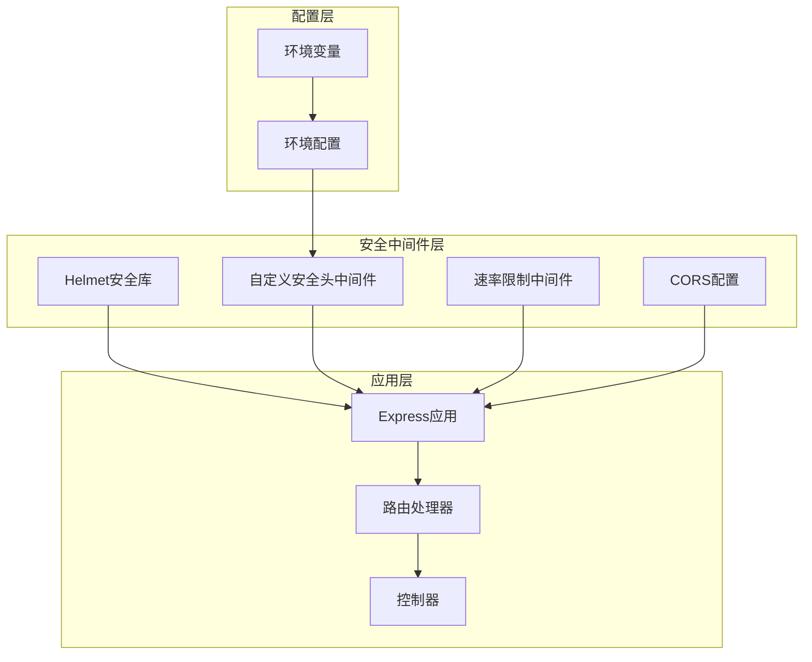
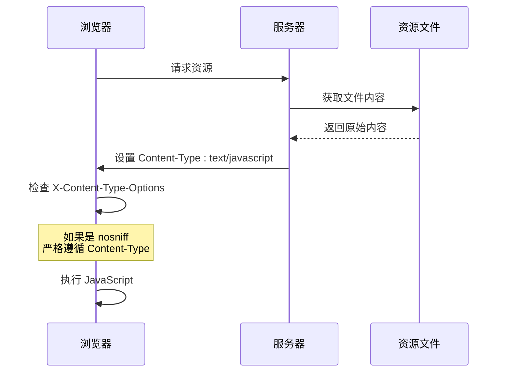
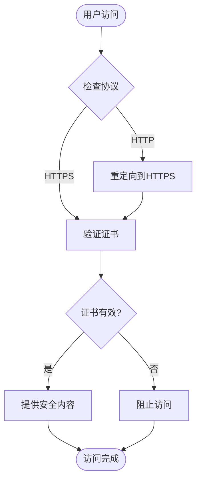
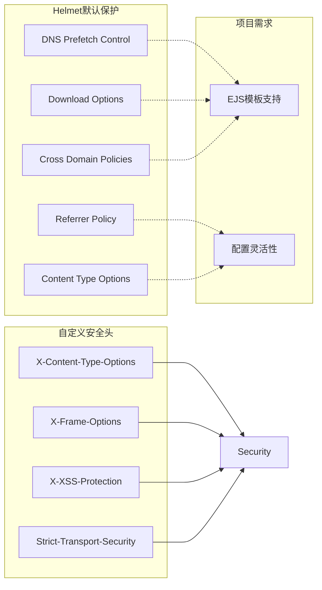
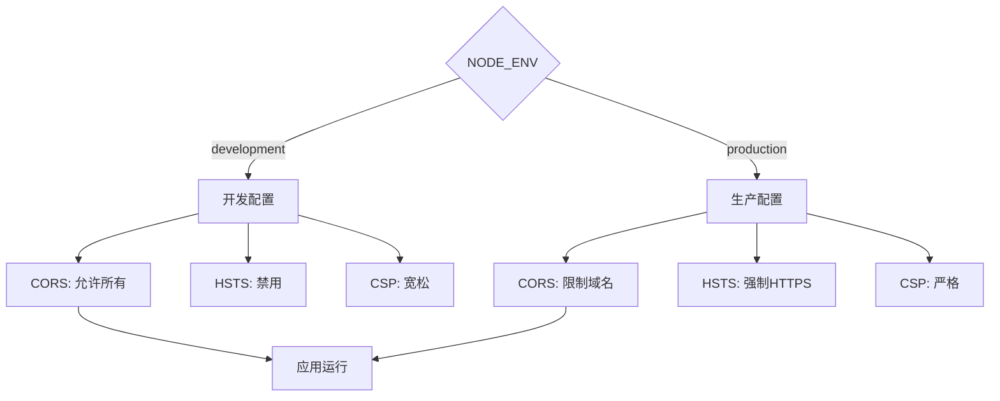

# HTTP安全头配置详解

<cite>
**本文档引用的文件**
- [src/middleware/auth.ts](file://src/middleware/auth.ts)
- [src/index.ts](file://src/index.ts)
- [src/config/index.ts](file://src/config/index.ts)
- [package.json](file://package.json)
</cite>

## 目录
1. [简介](#简介)
2. [项目架构概览](#项目架构概览)
3. [安全头中间件核心实现](#安全头中间件核心实现)
4. [HTTP安全头详细分析](#http安全头详细分析)
5. [Helmet集成与配置](#helmet集成与配置)
6. [安全头配置最佳实践](#安全头配置最佳实践)
7. [开发与生产环境差异](#开发与生产环境差异)
8. [性能影响评估](#性能影响评估)
9. [故障排除指南](#故障排除指南)
10. [总结](#总结)

## 简介

本文档详细分析了Point-Tron项目中HTTP安全头的配置和实现。该项目是一个基于TypeScript的TRON波场网络区块链数据统计后台管理系统，采用了现代化的Express.js框架和多种安全中间件来保护Web应用程序免受常见攻击。

项目中实现了自定义的安全头中间件，同时集成了流行的Helmet库来提供全面的HTTP安全保护。通过深入分析源代码，我们将探讨各个安全头的作用机制、配置参数以及在实际部署中的最佳实践。

## 项目架构概览

Point-Tron项目采用模块化架构设计，将安全功能分离到专门的中间件文件中。整个安全体系包括以下几个层次：



**图表来源**
- [src/index.ts](file://src/index.ts#L30-L45)
- [src/middleware/auth.ts](file://src/middleware/auth.ts#L130-L140)

**章节来源**
- [src/index.ts](file://src/index.ts#L1-L163)
- [src/middleware/auth.ts](file://src/middleware/auth.ts#L1-L171)

## 安全头中间件核心实现

### 自定义安全头中间件

项目中的安全头中间件是一个简洁而有效的实现，直接设置四个关键的HTTP响应头：

```typescript
export const securityHeaders = (req: Request, res: Response, next: NextFunction): void => {
  res.setHeader('X-Content-Type-Options', 'nosniff');
  res.setHeader('X-Frame-Options', 'DENY');
  res.setHeader('X-XSS-Protection', '1; mode=block');
  res.setHeader('Strict-Transport-Security', 'max-age=31536000; includeSubDomains');
  next();
};
```

这个中间件的特点：
- **简洁高效**：只设置四个核心安全头
- **立即生效**：在响应阶段设置头部
- **链式调用**：正确调用next()确保中间件链完整

### Helmet集成配置

项目同时集成了Helmet库，提供了更全面的安全保护：

```typescript
this.app.use(helmet({
  contentSecurityPolicy: false, // 为了支持EJS模板
}));
```

Helmet配置的关键特点：
- **禁用CSP**：为EJS模板引擎保留灵活性
- **自动安全头**：提供额外的安全保护层
- **模块化选择**：可以选择性地启用/禁用特定保护

**章节来源**
- [src/middleware/auth.ts](file://src/middleware/auth.ts#L130-L140)
- [src/index.ts](file://src/index.ts#L30-L35)

## HTTP安全头详细分析

### X-Content-Type-Options: nosniff

**作用机制**：
- 阻止浏览器进行MIME类型嗅探
- 强制使用服务器声明的内容类型
- 防止恶意脚本通过错误的内容类型执行

**配置值**：`nosniff`

**安全意义**：
- 防御MIME类型混淆攻击
- 确保资源按预期方式解析
- 减少跨站脚本攻击的风险



**图表来源**
- [src/middleware/auth.ts](file://src/middleware/auth.ts#L131)

### X-Frame-Options: DENY

**作用机制**：
- 控制页面是否可以被嵌入框架
- 防止点击劫持攻击
- 保护敏感操作不被伪装

**配置值**：`DENY`

**安全意义**：
- 完全禁止页面被iframe加载
- 防止恶意网站通过框架隐藏真实内容
- 保护用户交互不被欺骗

**可选配置**：
- `SAMEORIGIN`：允许同源页面嵌入
- `ALLOW-FROM uri`：允许指定域名嵌入（已废弃）

### X-XSS-Protection: 1; mode=block

**作用机制**：
- 启用浏览器内置的XSS过滤器
- 在检测到潜在XSS时阻止页面渲染
- 提供第一道防线

**配置值**：`1; mode=block`

**安全意义**：
- 利用浏览器厂商的最新防护技术
- 实时检测和阻止XSS攻击
- 作为应用级防护的补充

**注意事项**：
- 现代浏览器可能忽略此头部
- 应结合其他防护措施使用
- CSP提供了更强大的XSS防护

### Strict-Transport-Security: max-age=31536000; includeSubDomains

**作用机制**：
- 强制使用HTTPS协议
- 设置最长有效期（1年）
- 包含子域名

**配置值**：`max-age=31536000; includeSubDomains`

**安全意义**：
- 防止中间人攻击
- 强制加密通信
- 提升整体安全性

**参数详解**：
- `max-age=31536000`：有效期1年（31536000秒）
- `includeSubDomains`：包含所有子域名
- `preload`（可选）：预加载到浏览器列表



**图表来源**
- [src/middleware/auth.ts](file://src/middleware/auth.ts#L134)

**章节来源**
- [src/middleware/auth.ts](file://src/middleware/auth.ts#L130-L140)

## Helmet集成与配置

### Helmet库概述

Helmet是一个Express.js安全中间件集合，提供了多个HTTP头部的安全保护。在项目中，我们使用了以下配置：

```typescript
import helmet from 'helmet';

// Helmet配置
this.app.use(helmet({
  contentSecurityPolicy: false, // 为EJS模板保留灵活性
}));
```

### Helmet提供的安全保护

虽然项目中禁用了某些默认保护，但Helmet仍然提供了以下安全特性：

1. **自动设置安全头部**
   - `X-DNS-Prefetch-Control: off`
   - `X-Download-Options: noopen`
   - `X-Permitted-Cross-Domain-Policies: none`
   - `Referrer-Policy: no-referrer`
   - `X-Content-Type-Options: nosniff`

2. **安全头部优先级**
   - 自定义中间件会覆盖Helmet的默认设置
   - 可以选择性禁用不需要的保护

### 配置策略分析



**图表来源**
- [src/index.ts](file://src/index.ts#L30-L35)
- [src/middleware/auth.ts](file://src/middleware/auth.ts#L130-L140)

**章节来源**
- [src/index.ts](file://src/index.ts#L30-L35)

## 安全头配置最佳实践

### 标准配置建议

基于当前实现和行业最佳实践，以下是推荐的配置：

```typescript
// 推荐的安全头配置
export const securityHeaders = (req: Request, res: Response, next: NextFunction): void => {
  // 防止MIME类型嗅探
  res.setHeader('X-Content-Type-Options', 'nosniff');
  
  // 防止点击劫持
  res.setHeader('X-Frame-Options', 'DENY');
  
  // 启用XSS过滤（向后兼容）
  res.setHeader('X-XSS-Protection', '1; mode=block');
  
  // 强制HTTPS传输
  res.setHeader('Strict-Transport-Security', 'max-age=31536000; includeSubDomains; preload');
  
  // 内容安全策略（可选）
  res.setHeader('Content-Security-Policy', "default-src 'self'; script-src 'self'; style-src 'self'; img-src 'self' data:; font-src 'self'; connect-src 'self'; frame-ancestors 'none'");
  
  // 其他安全头部
  res.setHeader('X-Permitted-Cross-Domain-Policies', 'none');
  res.setHeader('Referrer-Policy', 'no-referrer');
  res.setHeader('Permissions-Policy', 'geolocation=(), microphone=(), camera=()');
  
  next();
};
```

### 配置参数详解

1. **X-Content-Type-Options**
   - 值：`nosniff`
   - 用途：防止MIME类型嗅探攻击

2. **X-Frame-Options**
   - 值：`DENY` 或 `SAMEORIGIN`
   - 用途：防止点击劫持攻击

3. **X-XSS-Protection**
   - 值：`1; mode=block`
   - 用途：启用浏览器XSS过滤器

4. **Strict-Transport-Security**
   - 值：`max-age=31536000; includeSubDomains; preload`
   - 用途：强制HTTPS传输

5. **Content-Security-Policy**
   - 值：`default-src 'self'`
   - 用途：定义内容加载策略

### 环境差异化配置

```typescript
// 环境差异化配置示例
const getSecurityHeadersConfig = (environment: string) => {
  const baseHeaders = {
    'X-Content-Type-Options': 'nosniff',
    'X-Frame-Options': 'DENY',
    'X-XSS-Protection': '1; mode=block',
  };
  
  if (environment === 'production') {
    return {
      ...baseHeaders,
      'Strict-Transport-Security': 'max-age=31536000; includeSubDomains; preload',
      'Content-Security-Policy': "default-src 'self'",
    };
  }
  
  return baseHeaders;
};
```

**章节来源**
- [src/middleware/auth.ts](file://src/middleware/auth.ts#L130-L140)
- [src/config/index.ts](file://src/config/index.ts#L1-L52)

## 开发与生产环境差异

### 环境配置对比

项目通过NODE_ENV环境变量区分不同环境：

```typescript
// 环境配置
const config: Config = {
  port: parseInt(process.env.PORT || '3000', 10),
  nodeEnv: process.env.NODE_ENV || 'development',
  // ...
};
```

### 开发环境特点

1. **宽松的安全策略**
   - CORS允许所有来源
   - 更灵活的CSP配置
   - 便于调试和开发

2. **开发便利性**
   - HTTPS可能不是必需
   - 更宽松的CORS策略
   - 详细的错误信息

### 生产环境特点

1. **严格的安全策略**
   - 严格的CORS配置
   - 完整的HSTS策略
   - 严格的CSP配置

2. **安全优先**
   - 强制HTTPS
   - 最小权限原则
   - 完整的安全头部

### 环境切换策略



**图表来源**
- [src/config/index.ts](file://src/config/index.ts#L20-L25)
- [src/middleware/auth.ts](file://src/middleware/auth.ts#L118-L125)

**章节来源**
- [src/config/index.ts](file://src/config/index.ts#L20-L25)
- [src/middleware/auth.ts](file://src/middleware/auth.ts#L118-L125)

## 性能影响评估

### 中间件性能分析

安全头中间件对性能的影响相对较小，主要体现在以下几个方面：

1. **内存占用**
   - 每个响应的头部设置开销
   - 中间件栈的内存占用

2. **CPU使用**
   - 头部设置的计算成本
   - 字符串操作的开销

3. **网络传输**
   - 额外HTTP头部的大小
   - 对带宽的影响

### 性能优化建议

```typescript
// 性能优化的中间件实现
export const optimizedSecurityHeaders = (req: Request, res: Response, next: NextFunction): void => {
  // 使用缓存减少重复设置
  const securityHeaders = {
    'X-Content-Type-Options': 'nosniff',
    'X-Frame-Options': 'DENY',
    'X-XSS-Protection': '1; mode=block',
    'Strict-Transport-Security': 'max-age=31536000; includeSubDomains',
  };
  
  // 批量设置头部
  Object.entries(securityHeaders).forEach(([header, value]) => {
    res.setHeader(header, value);
  });
  
  next();
};
```

### 性能监控指标

1. **响应时间**
   - 安全头设置对总响应时间的影响
   - 不同中间件组合的性能对比

2. **吞吐量**
   - 并发请求下的性能表现
   - 资源消耗情况

3. **内存使用**
   - 中间件栈的内存占用
   - 头部缓存的内存效率

## 故障排除指南

### 常见问题诊断

1. **安全头未生效**
   - 检查中间件注册顺序
   - 验证响应头部输出
   - 确认浏览器缓存清理

2. **CORS冲突**
   - 检查CORS中间件配置
   - 验证预检请求处理
   - 确认头部覆盖情况

3. **HSTS问题**
   - 检查HTTPS配置
   - 验证证书有效性
   - 清理浏览器HSTS缓存

### 调试工具使用

```typescript
// 调试中间件
export const debugSecurityHeaders = (req: Request, res: Response, next: NextFunction): void => {
  console.log('安全头设置前:', res.getHeaders());
  next();
  console.log('安全头设置后:', res.getHeaders());
};
```

### 测试方法

1. **手动测试**
   - 使用浏览器开发者工具检查头部
   - 验证安全功能的实际效果
   - 测试边界情况

2. **自动化测试**
   - 编写单元测试验证头部设置
   - 进行安全扫描测试
   - 性能基准测试

**章节来源**
- [src/middleware/auth.ts](file://src/middleware/auth.ts#L130-L140)

## 总结

Point-Tron项目中的HTTP安全头配置展现了现代Web应用安全的最佳实践。通过自定义的安全头中间件和Helmet库的结合使用，项目实现了多层次的安全保护。

### 主要成就

1. **完整的安全覆盖**
   - 四大核心安全头的完整实现
   - 与Helmet库的有效集成
   - 环境差异化的配置策略

2. **简洁高效的实现**
   - 中间件设计简洁明了
   - 性能影响最小化
   - 易于维护和扩展

3. **实用的安全保护**
   - 防止MIME嗅探攻击
   - 抵御点击劫持威胁
   - 强制HTTPS传输
   - 启用浏览器XSS防护

### 改进建议

1. **增强CSP配置**
   - 实现更严格的内容安全策略
   - 支持动态CSP指令
   - 添加报告功能

2. **完善HSTS配置**
   - 添加preload选项
   - 实现HSTS预加载
   - 支持动态配置

3. **扩展安全头部**
   - 添加Expect-CT头部
   - 实现Feature-Policy
   - 支持Permissions-Policy

4. **性能优化**
   - 实现头部缓存机制
   - 优化中间件执行顺序
   - 添加性能监控

通过持续改进和优化，Point-Tron项目的安全配置将能够更好地适应不断变化的网络安全威胁，为用户提供更加安全可靠的区块链数据管理服务。