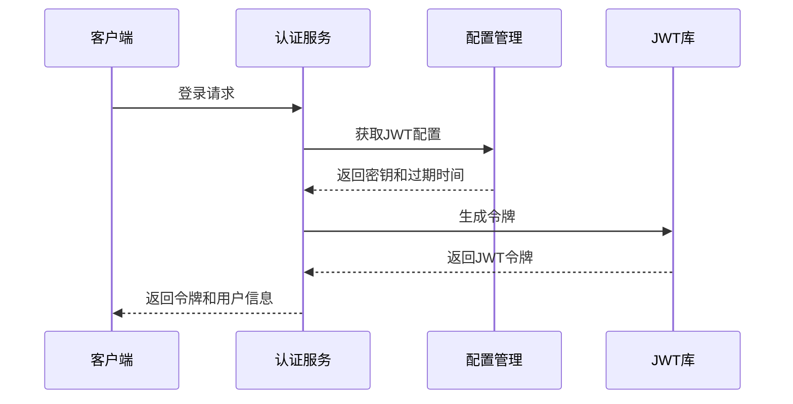
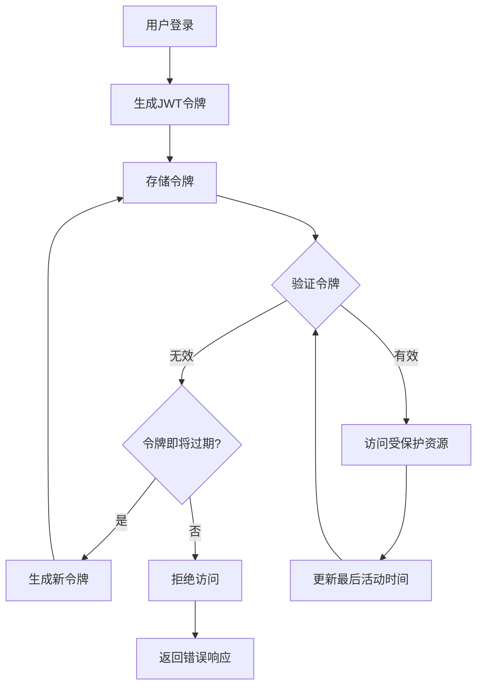
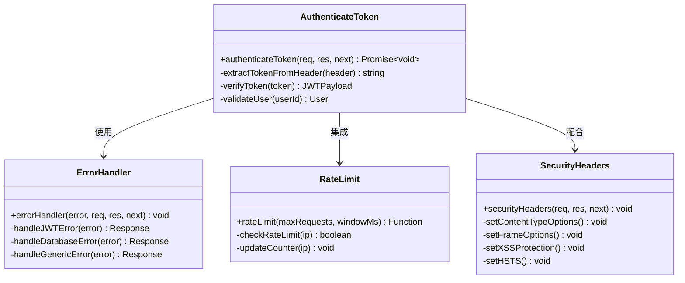
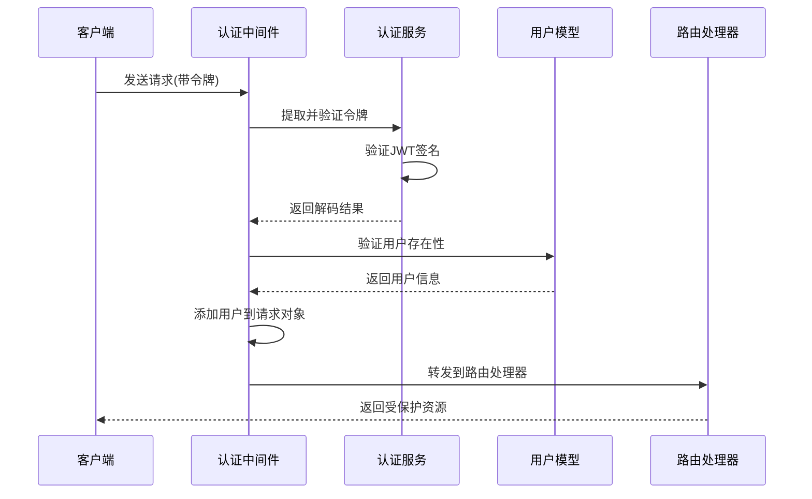
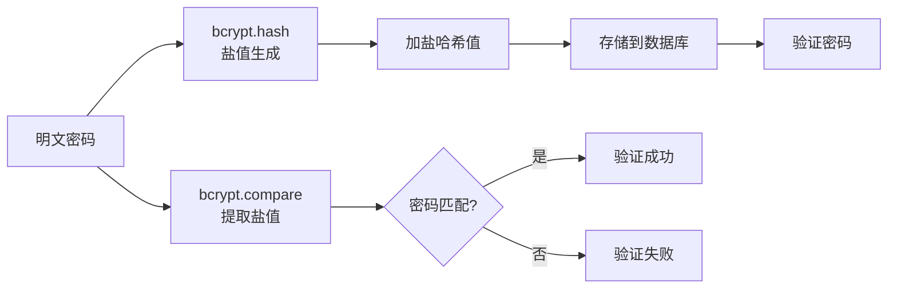
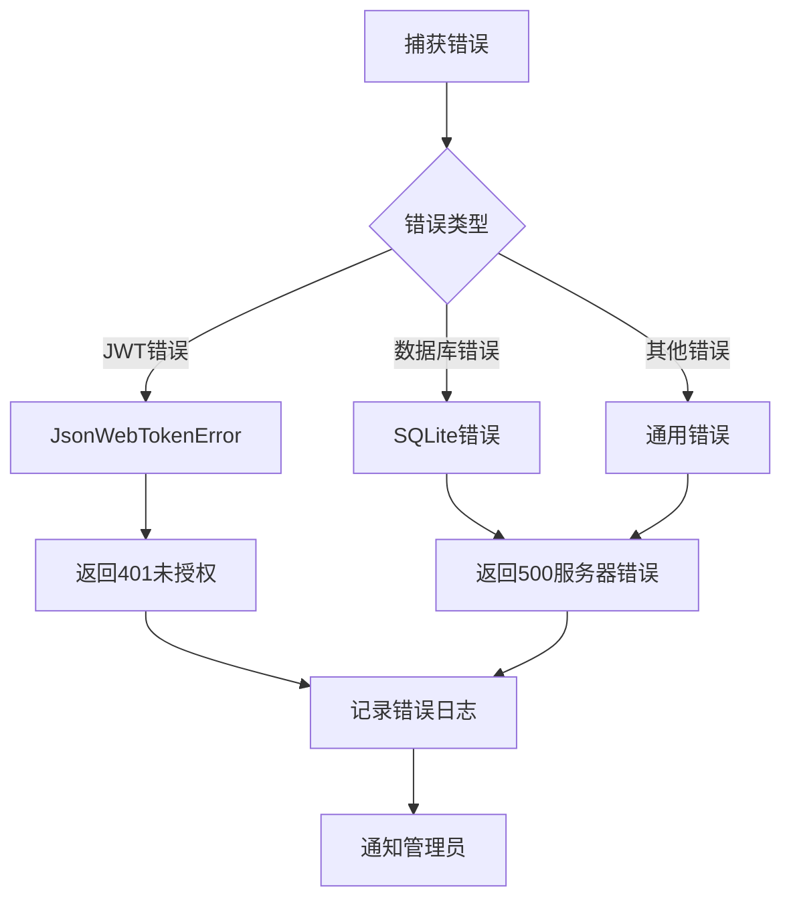
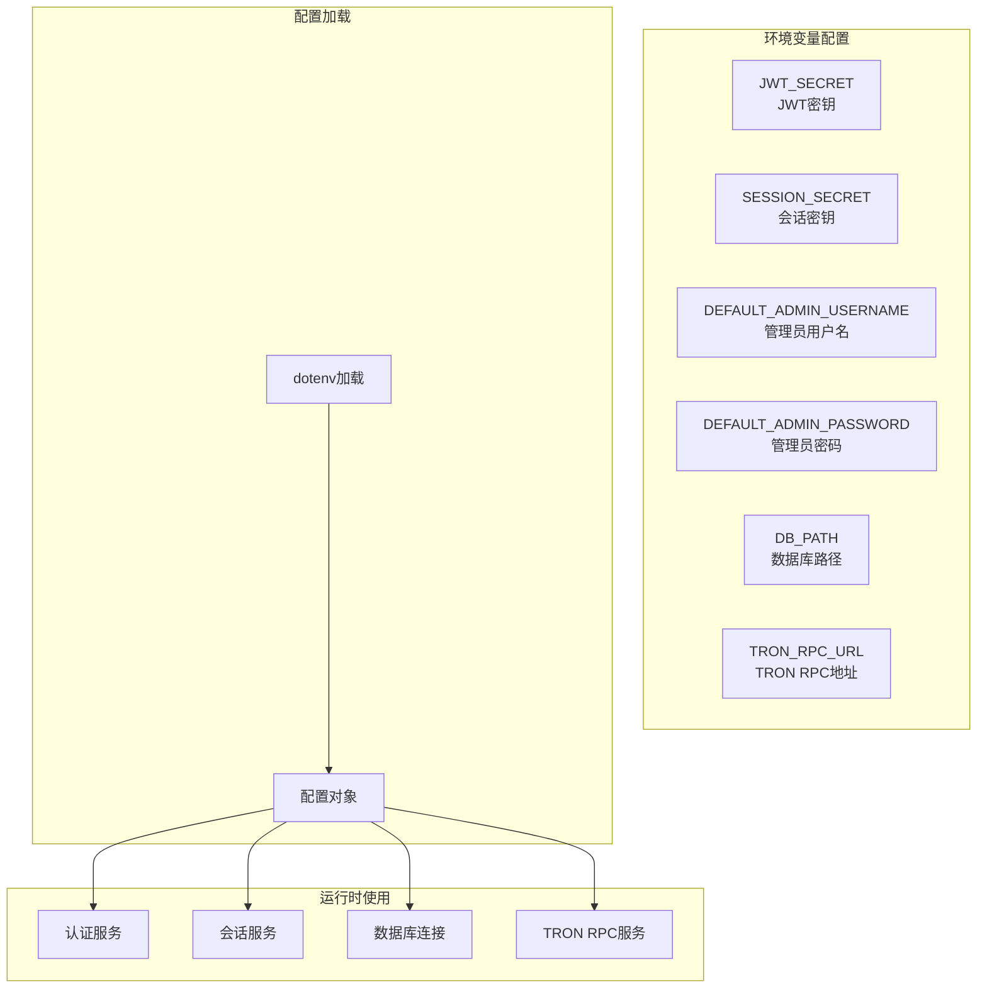
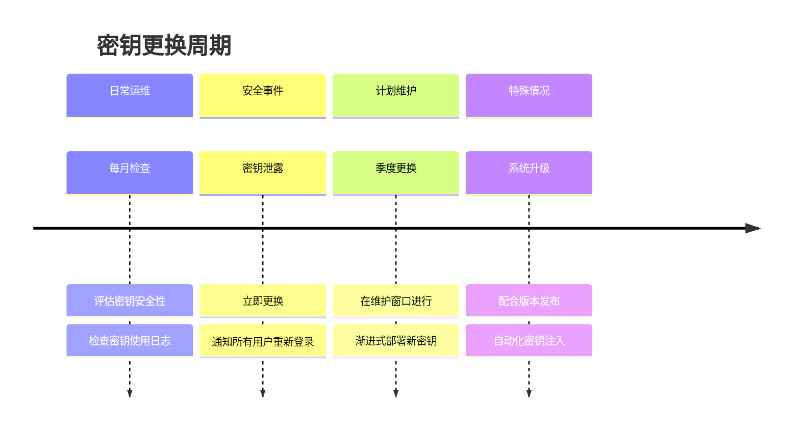
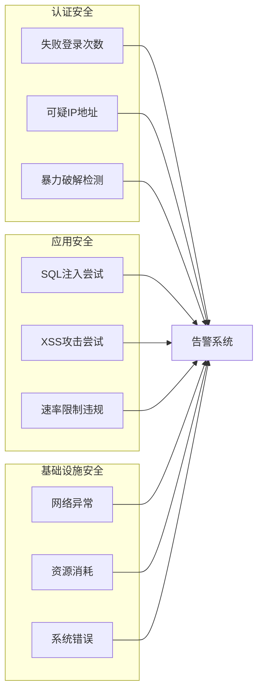

# 安全考虑

<cite>
**本文档引用的文件**
- [src/config/index.ts](file://src/config/index.ts)
- [src/services/AuthService.ts](file://src/services/AuthService.ts)
- [src/middleware/auth.ts](file://src/middleware/auth.ts)
- [src/models/UserModel.ts](file://src/models/UserModel.ts)
- [src/routes/auth.ts](file://src/routes/auth.ts)
- [src/models/types.ts](file://src/models/types.ts)
- [src/services/TronRPCService.ts](file://src/services/TronRPCService.ts)
- [README.md](file://README.md)
</cite>

## 目录
1. [概述](#概述)
2. [JWT令牌安全机制](#jwt令牌安全机制)
3. [用户认证与授权](#用户认证与授权)
4. [密码安全存储](#密码安全存储)
5. [中间件安全防护](#中间件安全防护)
6. [环境变量管理](#环境变量管理)
7. [安全最佳实践](#安全最佳实践)
8. [威胁分析与缓解](#威胁分析与缓解)
9. [监控与审计](#监控与审计)
10. [总结](#总结)

## 概述

Point-Tron是一个基于TypeScript和Node.js开发的波场网络区块链数据统计后台管理系统。系统采用JWT(JSON Web Token)进行身份认证，实现了完整的用户认证和授权机制，同时集成了多种安全防护措施来保护系统免受各种安全威胁。

该系统的核心安全特性包括：
- 基于JWT的无状态认证机制
- bcrypt密码哈希加密存储
- 多层认证中间件保护
- 环境变量敏感信息管理
- 速率限制和异常检测
- HTTPS安全传输

## JWT令牌安全机制

### 令牌生成与配置

系统使用jsonwebtoken库实现JWT令牌的生成和验证，配置了合理的过期时间和密钥管理策略。



**图表来源**
- [src/services/AuthService.ts](file://src/services/AuthService.ts#L10-L20)
- [src/config/index.ts](file://src/config/index.ts#L15-L16)

### 令牌生命周期管理

系统实现了完整的JWT令牌生命周期管理，包括生成、验证、刷新和过期处理：



**图表来源**
- [src/services/AuthService.ts](file://src/services/AuthService.ts#L10-L103)
- [src/middleware/auth.ts](file://src/middleware/auth.ts#L15-L58)

### 令牌刷新机制

系统提供了安全的令牌刷新机制，支持在令牌即将过期时自动续期：

```typescript
// 令牌刷新示例
static refreshToken(oldToken: string): string | null {
  try {
    const decoded = jwt.verify(oldToken, config.jwt.secret) as JWTPayload;
    
    // 生成新令牌
    const newPayload: JWTPayload = {
      userId: decoded.userId,
      username: decoded.username
    };

    return jwt.sign(newPayload, config.jwt.secret, {
      expiresIn: config.jwt.expiresIn
    } as jwt.SignOptions);
  } catch (error: any) {
    console.error('刷新令牌失败:', error?.message);
    return null;
  }
}
```

**节来源**
- [src/services/AuthService.ts](file://src/services/AuthService.ts#L75-L95)

## 用户认证与授权

### 认证中间件架构

系统实现了多层认证中间件，确保只有经过身份验证的用户才能访问受保护的API端点。



**图表来源**
- [src/middleware/auth.ts](file://src/middleware/auth.ts#L15-L116)

### 用户会话管理

系统通过扩展Express Request接口来管理用户会话信息：

```typescript
// 扩展Express Request接口
declare global {
  namespace Express {
    interface Request {
      user?: {
        id: number;
        username: string;
      };
    }
  }
}
```

这种设计确保了：
- 类型安全的用户信息访问
- 中间件间的数据传递
- 明确的用户身份标识

**节来源**
- [src/middleware/auth.ts](file://src/middleware/auth.ts#L5-L12)

### API端点保护

所有受保护的API端点都必须通过认证中间件验证：



**图表来源**
- [src/middleware/auth.ts](file://src/middleware/auth.ts#L15-L58)
- [src/routes/auth.ts](file://src/routes/auth.ts#L15-L35)

**节来源**
- [src/middleware/auth.ts](file://src/middleware/auth.ts#L15-L58)
- [src/routes/auth.ts](file://src/routes/auth.ts#L15-L35)

## 密码安全存储

### bcrypt哈希加密

系统使用bcryptjs库对用户密码进行安全哈希加密存储，确保即使数据库泄露，攻击者也无法直接获取明文密码。



**图表来源**
- [src/models/UserModel.ts](file://src/models/UserModel.ts#L8-L12)
- [src/models/UserModel.ts](file://src/models/UserModel.ts#L40-L48)

### 密码处理流程

系统在用户注册和登录过程中实现了完整的密码安全处理流程：

```typescript
// 用户创建时的密码处理
static async create(userData: Omit<User, 'id' | 'created_at' | 'updated_at'>): Promise<number> {
  // 加密密码
  const hashedPassword = await bcrypt.hash(userData.password, 10);
  
  const result = await database.run(
    'INSERT INTO users (username, password) VALUES (?, ?)',
    [userData.username, hashedPassword]
  );
  
  return result.lastID!;
}

// 密码验证
static async verifyPassword(username: string, password: string): Promise<User | null> {
  const user = await this.findByUsername(username);
  if (!user) {
    return null;
  }

  const isValidPassword = await bcrypt.compare(password, user.password);
  if (!isValidPassword) {
    return null;
  }

  return user;
}
```

**节来源**
- [src/models/UserModel.ts](file://src/models/UserModel.ts#L8-L12)
- [src/models/UserModel.ts](file://src/models/UserModel.ts#L40-L48)

### 密码强度建议

虽然当前实现使用默认的10轮哈希强度，但系统设计支持配置不同的哈希强度：

- **默认强度**: 10轮（平衡性能和安全性）
- **高安全性**: 12-14轮（适用于高安全要求场景）
- **性能优先**: 8-9轮（适用于高并发场景）

## 中间件安全防护

### 错误处理机制

系统实现了完善的错误处理机制，能够区分不同类型的错误并返回适当的响应：



**图表来源**
- [src/middleware/auth.ts](file://src/middleware/auth.ts#L60-L85)

### 速率限制防护

系统实现了简单的基于内存的速率限制机制，防止暴力破解和DDoS攻击：

```typescript
// 速率限制中间件
const rateLimitMap = new Map<string, { count: number; resetTime: number }>();

export const rateLimit = (maxRequests: number = 100, windowMs: number = 60000) => {
  return (req: Request, res: Response, next: NextFunction): void => {
    const clientIp = req.ip || req.connection.remoteAddress || 'unknown';
    const now = Date.now();
    
    const clientData = rateLimitMap.get(clientIp);
    
    if (!clientData || now > clientData.resetTime) {
      // 重置或初始化
      rateLimitMap.set(clientIp, {
        count: 1,
        resetTime: now + windowMs
      });
      next();
      return;
    }
    
    if (clientData.count >= maxRequests) {
      res.status(429).json({
        success: false,
        error: '请求过于频繁，请稍后再试'
      });
      return;
    }
    
    clientData.count++;
    next();
  };
};
```

**节来源**
- [src/middleware/auth.ts](file://src/middleware/auth.ts#L140-L170)

### 安全头设置

系统设置了必要的HTTP安全头，增强应用的安全性：

```typescript
// 安全头中间件
export const securityHeaders = (req: Request, res: Response, next: NextFunction): void => {
  res.setHeader('X-Content-Type-Options', 'nosniff');
  res.setHeader('X-Frame-Options', 'DENY');
  res.setHeader('X-XSS-Protection', '1; mode=block');
  res.setHeader('Strict-Transport-Security', 'max-age=31536000; includeSubDomains');
  next();
};
```

这些安全头的作用：
- **X-Content-Type-Options**: 防止MIME类型嗅探攻击
- **X-Frame-Options**: 防止点击劫持攻击
- **X-XSS-Protection**: 启用浏览器XSS过滤器
- **Strict-Transport-Security**: 强制HTTPS连接

**节来源**
- [src/middleware/auth.ts](file://src/middleware/auth.ts#L95-L105)

## 环境变量管理

### 敏感信息隔离

系统通过环境变量管理所有敏感配置信息，确保生产环境的安全性：



**图表来源**
- [src/config/index.ts](file://src/config/index.ts#L15-L28)

### 配置项详解

系统的主要配置项及其安全考虑：

```typescript
const config: Config = {
  jwt: {
    secret: process.env.JWT_SECRET || 'your-super-secret-jwt-key-change-in-production',
    expiresIn: process.env.JWT_EXPIRES_IN || '7d',
  },
  sessionSecret: process.env.SESSION_SECRET || 'your-session-secret-change-in-production',
  admin: {
    username: process.env.DEFAULT_ADMIN_USERNAME || 'admin',
    password: process.env.DEFAULT_ADMIN_PASSWORD || 'admin123',
  }
};
```

**关键安全配置**：
- **JWT_SECRET**: 必须足够复杂且保密，建议使用随机生成的字符串
- **SESSION_SECRET**: 用于会话cookie加密，同样需要保密
- **DEFAULT_ADMIN_PASSWORD**: 生产环境必须更改默认密码
- **JWT_EXPIRES_IN**: 合理设置令牌过期时间，建议不超过24小时

**节来源**
- [src/config/index.ts](file://src/config/index.ts#L15-L28)

## 安全最佳实践

### 密钥管理策略

#### 1. 定期更换密钥

建议实施以下密钥更换策略：



#### 2. 密钥存储安全

- 使用操作系统级别的密钥管理服务
- 实施最小权限原则
- 定期审计密钥访问日志

### 登录安全控制

#### 1. 登录尝试限制

```typescript
// 建议实现的登录尝试限制
class LoginAttemptTracker {
  private attempts = new Map<string, { count: number; lastAttempt: number }>();
  
  async checkLoginAttempt(username: string): Promise<boolean> {
    const now = Date.now();
    const userAttempts = this.attempts.get(username);
    
    if (userAttempts) {
      const timeSinceLast = now - userAttempts.lastAttempt;
      if (timeSinceLast < 300000) { // 5分钟内
        if (userAttempts.count >= 5) {
          return false; // 锁定账户
        }
      } else {
        // 超过5分钟重置计数
        this.attempts.delete(username);
      }
    }
    
    return true;
  }
}
```

#### 2. 异常登录检测

建议实现以下异常检测机制：
- IP地址变化检测
- 设备指纹识别
- 地理位置异常检测
- 时间段异常检测

### 网络安全加固

#### 1. HTTPS强制启用

```typescript
// HTTPS重定向中间件
export const enforceHTTPS = (req: Request, res: Response, next: NextFunction): void => {
  if (req.headers['x-forwarded-proto'] !== 'https' && process.env.NODE_ENV === 'production') {
    res.redirect(301, `https://${req.hostname}${req.originalUrl}`);
  } else {
    next();
  }
};
```

#### 2. CORS配置优化

```typescript
// 生产环境CORS配置
export const corsOptions = {
  origin: function (origin: string | undefined, callback: Function) {
    // 生产环境中应该配置具体的域名
    const allowedOrigins = [
      'https://yourdomain.com',
      'https://www.yourdomain.com'
    ];
    
    if (!origin || allowedOrigins.includes(origin)) {
      callback(null, true);
    } else {
      callback(new Error('CORS: 不允许的源'));
    }
  },
  credentials: true,
  methods: ['GET', 'POST', 'PUT', 'DELETE', 'OPTIONS'],
  allowedHeaders: ['Content-Type', 'Authorization']
};
```

## 威胁分析与缓解

### 主要安全威胁

#### 1. JWT令牌劫持

**威胁描述**: 攻击者通过窃取用户的JWT令牌获得未经授权的访问权限。

**缓解措施**:
- 实施短生命周期令牌（建议不超过24小时）
- 使用HTTPS传输令牌
- 实现令牌撤销机制
- 监控异常令牌使用模式

#### 2. 暴力破解攻击

**威胁描述**: 攻击者尝试通过大量猜测密码来获取用户账户访问权。

**缓解措施**:
- 实施登录尝试限制
- 启用CAPTCHA验证
- 实现账户锁定机制
- 监控异常登录活动

#### 3. SQL注入攻击

**威胁描述**: 攻击者通过恶意SQL语句操纵数据库查询。

**缓解措施**:
- 使用参数化查询
- 实施输入验证和清理
- 最小权限数据库访问
- 定期安全审计

#### 4. XSS跨站脚本攻击

**威胁描述**: 攻击者注入恶意脚本到网页中，窃取用户信息。

**缓解措施**:
- 实施内容安全策略(CSP)
- 对用户输入进行HTML转义
- 使用安全的模板引擎
- 定期安全测试

### 安全监控指标

建议监控以下关键安全指标：



## 监控与审计

### 日志记录策略

系统实现了详细的日志记录机制，包括：

#### 1. 认证日志

```typescript
// 认证相关日志
export const requestLogger = (req: Request, res: Response, next: NextFunction): void => {
  const start = Date.now();
  
  res.on('finish', () => {
    const duration = Date.now() - start;
    console.log(
      `${req.method} ${req.path} - ${res.statusCode} - ${duration}ms - ${req.ip}`
    );
  });
  
  next();
};
```

#### 2. 安全日志

```typescript
// 安全事件日志
class SecurityLogger {
  logFailedLogin(username: string, ip: string, userAgent: string): void {
    console.error(`[SECURITY] 失败登录尝试 - 用户名: ${username}, IP: ${ip}, UA: ${userAgent}`);
  }
  
  logSuspiciousActivity(activity: string, details: any): void {
    console.warn(`[SECURITY] 可疑活动 - ${activity}: ${JSON.stringify(details)}`);
  }
  
  logTokenRefresh(userId: number, oldToken: string, newToken: string): void {
    console.info(`[SECURITY] 令牌刷新 - 用户ID: ${userId}`);
  }
}
```

### 审计跟踪

建议实施以下审计跟踪功能：

#### 1. 用户活动审计

- 记录所有用户登录和登出事件
- 跟踪敏感操作（如密码修改、权限变更）
- 记录API调用和访问模式
- 保存系统配置变更记录

#### 2. 系统完整性审计

- 监控配置文件变更
- 检测异常进程行为
- 追踪数据库结构变更
- 记录备份和恢复操作

## 总结

Point-Tron系统实现了多层次的安全防护机制，涵盖了从用户认证到系统运维的各个方面。主要安全特性包括：

### 核心安全优势

1. **强密码保护**: 使用bcrypt进行密码哈希加密，确保密码存储安全
2. **JWT令牌安全**: 实现了完整的令牌生命周期管理，包括生成、验证、刷新和过期处理
3. **多层认证防护**: 通过认证中间件、错误处理和速率限制等多重防护机制
4. **环境变量隔离**: 敏感配置通过环境变量管理，避免硬编码风险
5. **安全头设置**: 实施必要的HTTP安全头，增强应用安全性

### 安全改进建议

为了进一步提升系统安全性，建议实施以下改进：

1. **实施令牌撤销机制**: 添加黑名单功能，支持主动撤销特定令牌
2. **增强登录安全**: 添加多因素认证(MFA)支持
3. **完善监控体系**: 实施更全面的安全监控和告警机制
4. **定期安全审计**: 建立定期的安全评估和漏洞扫描流程
5. **安全培训**: 为开发和运维团队提供持续的安全培训

### 最佳实践总结

- **密钥管理**: 定期更换密钥，使用安全的密钥存储方案
- **访问控制**: 实施最小权限原则，定期审查用户权限
- **监控审计**: 建立完善的日志记录和安全监控体系
- **应急响应**: 制定安全事件响应计划和恢复流程

通过持续的安全改进和最佳实践的应用，Point-Tron系统能够为用户提供安全可靠的服务，有效防范各种安全威胁。