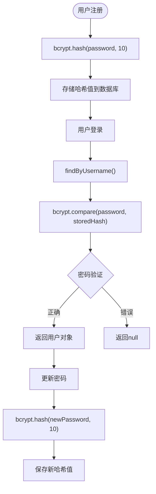
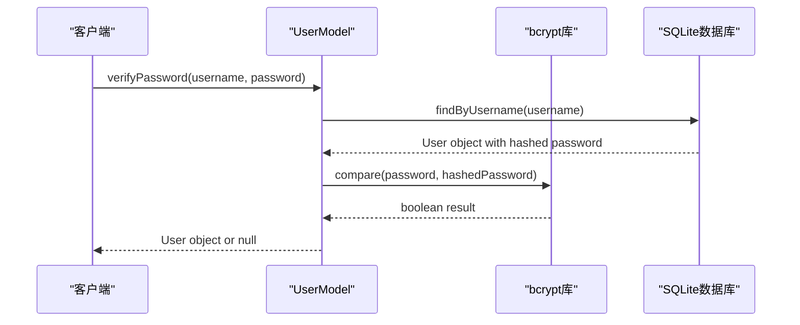
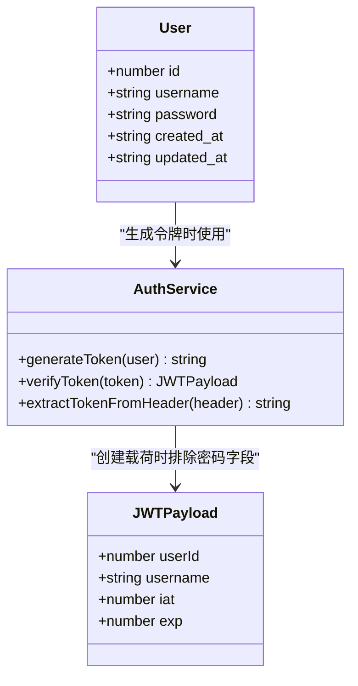
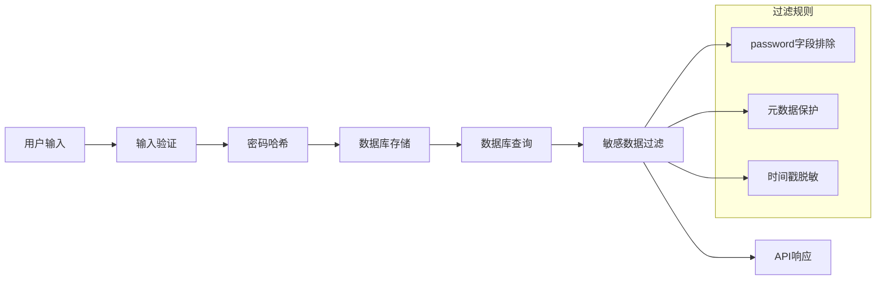
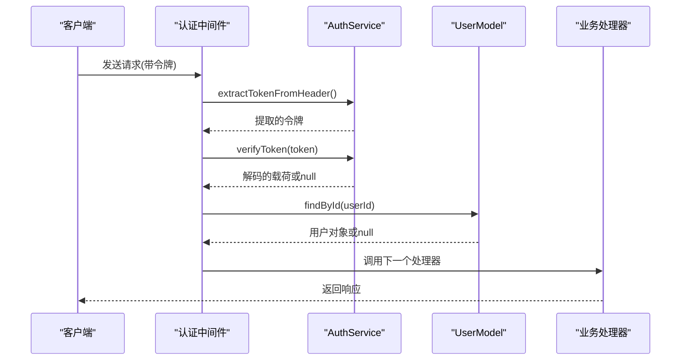
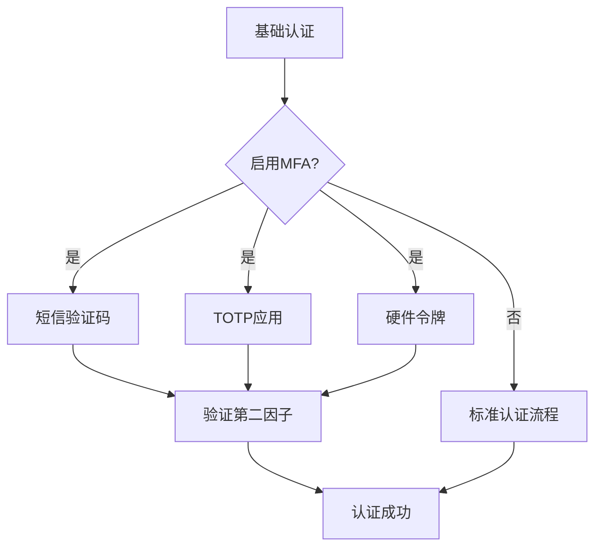

# 数据保护策略

<cite>
**本文档引用的文件**
- [UserModel.ts](file://src/models/UserModel.ts)
- [AuthService.ts](file://src/services/AuthService.ts)
- [auth.ts](file://src/middleware/auth.ts)
- [index.ts](file://src/config/index.ts)
- [types.ts](file://src/models/types.ts)
- [auth.ts](file://src/routes/auth.ts)
- [index.ts](file://src/database/index.ts)
</cite>

## 目录
1. [简介](#简介)
2. [密码安全存储架构](#密码安全存储架构)
3. [bcrypt密码哈希机制](#bcrypt密码哈希机制)
4. [JWT令牌设计原则](#jwt令牌设计原则)
5. [数据流保护](#数据流保护)
6. [安全中间件架构](#安全中间件架构)
7. [配置安全性](#配置安全性)
8. [未来扩展建议](#未来扩展建议)
9. [总结](#总结)

## 简介

本系统采用多层次的数据保护策略，确保用户敏感数据的安全性。通过bcrypt密码哈希算法、JWT令牌机制、安全中间件和严格的访问控制，构建了一个完整的数据保护体系。

## 密码安全存储架构

### UserModel中的密码处理流程

系统在`UserModel`中实现了完整的密码生命周期管理，从创建到验证再到更新，每个环节都严格遵循安全最佳实践。



**图表来源**
- [UserModel.ts](file://src/models/UserModel.ts#L8-L45)

### 密码存储过程详解

密码在存储过程中经历了以下关键步骤：

1. **密码哈希化**：使用`bcrypt.hash()`函数将明文密码转换为不可逆的哈希值
2. **盐值生成**：bcrypt自动为每个密码生成独特的盐值，防止彩虹表攻击
3. **存储优化**：使用10轮哈希运算，在安全性和性能之间取得平衡
4. **零知识存储**：数据库中只存储哈希值，原始密码永远不会被记录

**章节来源**
- [UserModel.ts](file://src/models/UserModel.ts#L1-L100)

## bcrypt密码哈希机制

### 哈希强度配置

系统使用默认的10轮哈希强度配置，这是业界推荐的标准配置：

```typescript
// 密码哈希配置
const hashedPassword = await bcrypt.hash(userData.password, 10);
```

### 哈希算法特性

1. **不可逆性**：bcrypt使用单向哈希函数，无法从哈希值还原原始密码
2. **自适应性**：随着计算能力提升，可以调整哈希轮数增加安全性
3. **随机性**：每次生成的盐值都是随机的，即使相同密码也会产生不同哈希值
4. **渐进式增强**：支持未来升级到更高强度的哈希算法

### 密码验证机制



**图表来源**
- [UserModel.ts](file://src/models/UserModel.ts#L35-L45)

**章节来源**
- [UserModel.ts](file://src/models/UserModel.ts#L8-L45)

## JWT令牌设计原则

### JWT载荷最小化原则

系统严格遵循最小化原则，JWT载荷中只包含必要的用户标识信息：

```typescript
interface JWTPayload {
  userId: number;
  username: string;
  iat?: number;
  exp?: number;
}
```

### 敏感信息隔离



**图表来源**
- [AuthService.ts](file://src/services/AuthService.ts#L5-L10)
- [types.ts](file://src/models/types.ts#L10-L15)

### 令牌安全特性

1. **无状态设计**：JWT令牌包含所有必要信息，无需服务器端存储会话状态
2. **时间限制**：支持设置过期时间，减少令牌泄露风险
3. **签名验证**：使用密钥签名，确保令牌完整性
4. **自动刷新**：支持令牌自动续期机制

**章节来源**
- [AuthService.ts](file://src/services/AuthService.ts#L1-L104)

## 数据流保护

### 敏感数据过滤

系统在多个层面实施敏感数据过滤：



**图表来源**
- [UserModel.ts](file://src/models/UserModel.ts#L65-L75)

### 数据传输安全

1. **HTTPS强制**：所有通信必须通过HTTPS加密传输
2. **CORS限制**：严格控制跨域请求来源
3. **内容安全策略**：防止XSS攻击
4. **请求头保护**：设置安全的HTTP头部

**章节来源**
- [auth.ts](file://src/middleware/auth.ts#L1-L171)

## 安全中间件架构

### 认证中间件流程



**图表来源**
- [auth.ts](file://src/middleware/auth.ts#L20-L60)

### 多层安全防护

系统实现了七层安全防护机制：

1. **请求拦截层**：检查请求格式和参数有效性
2. **身份验证层**：验证JWT令牌的有效性
3. **权限验证层**：确认用户权限级别
4. **速率限制层**：防止暴力破解攻击
5. **错误处理层**：统一错误响应格式
6. **日志记录层**：记录安全事件和异常
7. **响应过滤层**：确保敏感信息不泄露

**章节来源**
- [auth.ts](file://src/middleware/auth.ts#L60-L171)

## 配置安全性

### 环境变量管理

系统通过环境变量管理所有敏感配置：

```typescript
const config: Config = {
  jwt: {
    secret: process.env.JWT_SECRET || 'your-super-secret-jwt-key-change-in-production',
    expiresIn: process.env.JWT_EXPIRES_IN || '7d',
  },
  sessionSecret: process.env.SESSION_SECRET || 'your-session-secret-change-in-production',
};
```

### 安全配置要点

1. **密钥管理**：生产环境必须使用强随机密钥
2. **过期时间**：合理设置令牌有效期
3. **环境隔离**：开发和生产环境使用不同配置
4. **定期轮换**：支持密钥定期更换机制

**章节来源**
- [index.ts](file://src/config/index.ts#L1-L52)

## 未来扩展建议

### 多因素认证集成

系统设计为支持未来的多因素认证扩展：



### 扩展功能建议

1. **生物识别支持**：集成指纹或面部识别
2. **设备绑定**：限制令牌只能在特定设备上使用
3. **地理位置验证**：基于IP地址的访问控制
4. **行为分析**：监控异常登录行为
5. **密钥备份**：支持密钥恢复机制

### 性能优化建议

1. **缓存机制**：缓存频繁访问的用户信息
2. **异步处理**：将非关键操作异步化
3. **负载均衡**：支持分布式部署
4. **监控告警**：实时监控安全事件

## 总结

本系统通过bcrypt密码哈希、JWT令牌机制、安全中间件和严格的配置管理，构建了一个完整的数据保护体系。主要特点包括：

1. **密码安全**：使用bcrypt进行密码哈希，确保密码不可逆
2. **令牌最小化**：JWT载荷只包含必要信息，避免敏感数据泄露
3. **多层防护**：七层安全防护机制，全面保护系统安全
4. **可扩展性**：设计支持未来多因素认证等高级功能
5. **最佳实践**：遵循业界安全最佳实践和标准

这种设计不仅满足了当前的安全需求，还为未来的安全增强提供了良好的扩展基础。通过持续的安全审计和更新，系统能够有效应对不断演进的网络安全威胁。