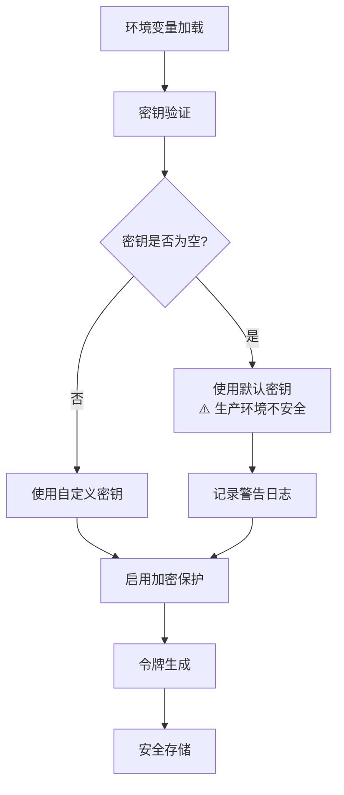
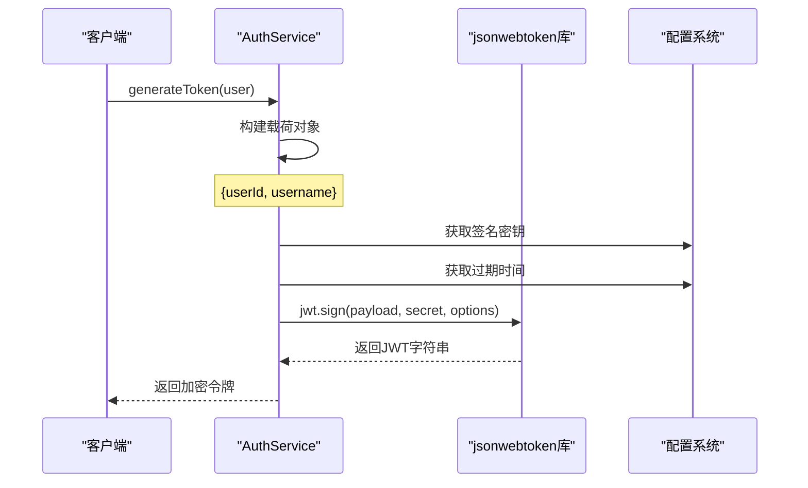
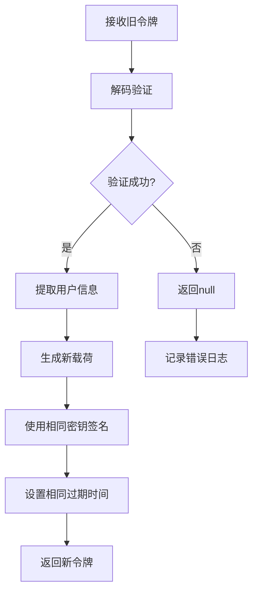
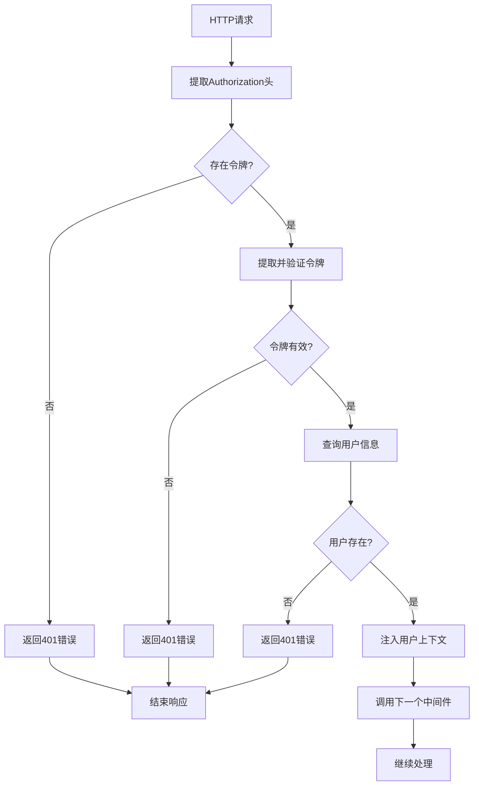
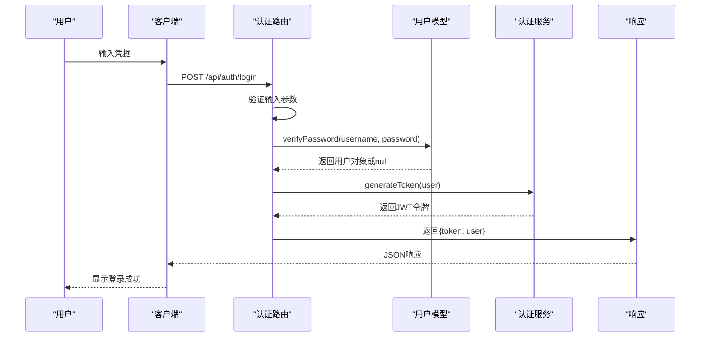
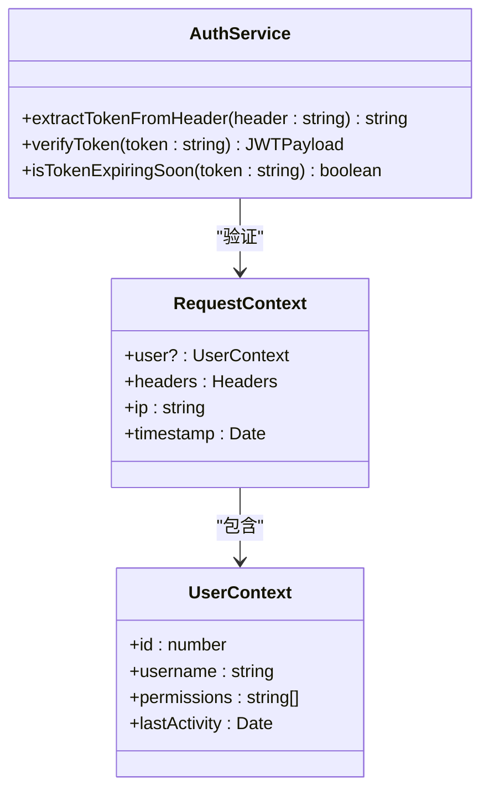
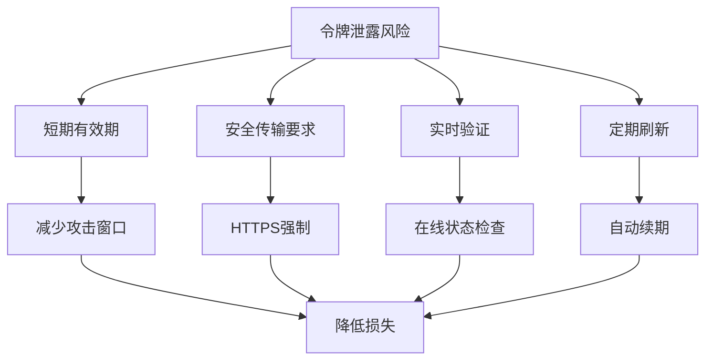
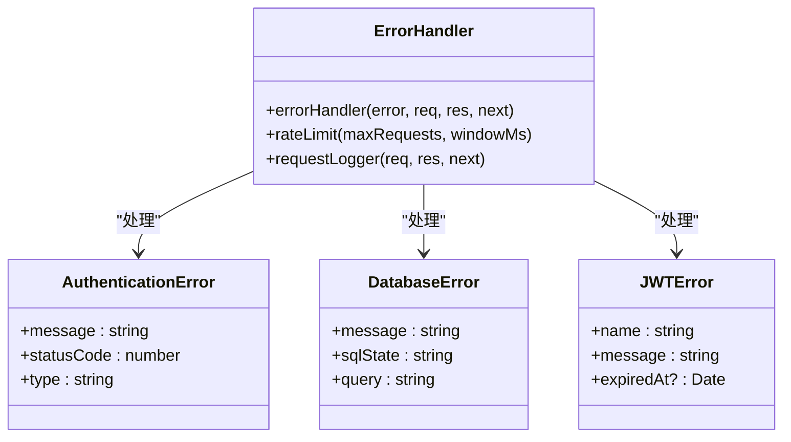
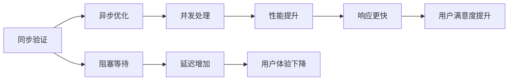

# 认证安全机制

<cite>
**本文档引用的文件**
- [src/services/AuthService.ts](file://src/services/AuthService.ts)
- [src/middleware/auth.ts](file://src/middleware/auth.ts)
- [src/config/index.ts](file://src/config/index.ts)
- [src/models/UserModel.ts](file://src/models/UserModel.ts)
- [src/routes/auth.ts](file://src/routes/auth.ts)
- [src/models/types.ts](file://src/models/types.ts)
- [src/index.ts](file://src/index.ts)
</cite>

## 目录
1. [简介](#简介)
2. [JWT配置与密钥管理](#jwt配置与密钥管理)
3. [AuthService核心功能](#authservice核心功能)
4. [认证中间件架构](#认证中间件架构)
5. [认证流程详解](#认证流程详解)
6. [安全机制与最佳实践](#安全机制与最佳实践)
7. [错误处理与监控](#错误处理与监控)
8. [性能优化建议](#性能优化建议)
9. [故障排除指南](#故障排除指南)
10. [总结](#总结)

## 简介

本系统采用基于JSON Web Token (JWT) 的认证机制，为Point-Tron平台提供安全可靠的用户身份验证和授权服务。该认证系统设计遵循现代安全标准，支持令牌生成、验证、刷新和过期管理，同时具备完善的错误处理和安全防护机制。

## JWT配置与密钥管理

### 密钥配置架构

系统使用集中式的JWT配置管理，通过环境变量确保密钥的安全性：

```typescript
// JWT配置结构
interface JWTConfig {
  secret: string;           // 签名密钥
  expiresIn: string;        // 令牌有效期
}
```

### 密钥安全性分析



**图表来源**
- [src/config/index.ts](file://src/config/index.ts#L20-L25)

### 过期时间管理

系统支持灵活的令牌过期时间配置：

- **默认值**: 7天 (`7d`)
- **可配置范围**: 从几分钟到几个月
- **动态计算**: 基于当前时间戳计算剩余有效期

**章节来源**
- [src/config/index.ts](file://src/config/index.ts#L20-L25)
- [src/services/AuthService.ts](file://src/services/AuthService.ts#L15-L20)

## AuthService核心功能

### 令牌生成机制

AuthService的`generateToken`方法负责创建JWT令牌，包含以下关键特性：

```typescript
// JWT载荷结构
interface JWTPayload {
  userId: number;     // 用户唯一标识
  username: string;   // 用户名
  iat?: number;       // 发布时间戳
  exp?: number;       // 过期时间戳
}
```



**图表来源**
- [src/services/AuthService.ts](file://src/services/AuthService.ts#L12-L20)

### 令牌验证机制

`verifyToken`方法实现了完整的令牌验证流程：

```typescript
// 验证过程分析
static verifyToken(token: string): JWTPayload | null {
  try {
    // 使用密钥验证签名
    const decoded = jwt.verify(token, config.jwt.secret) as JWTPayload;
    return decoded;
  } catch (error: any) {
    // 记录验证失败原因
    console.error('JWT验证失败:', error?.message);
    return null;
  }
}
```

### 令牌刷新机制

系统提供了安全的令牌刷新功能，避免频繁重新登录：



**图表来源**
- [src/services/AuthService.ts](file://src/services/AuthService.ts#L70-L85)

### 辅助功能模块

AuthService还提供了多个实用工具函数：

1. **令牌提取**: 支持多种格式的令牌提取
2. **过期检测**: 实时检测令牌即将过期状态
3. **剩余时间计算**: 提供精确的剩余有效期信息

**章节来源**
- [src/services/AuthService.ts](file://src/services/AuthService.ts#L1-L104)

## 认证中间件架构

### 中间件设计模式

认证中间件采用Express中间件的标准模式，确保与框架的无缝集成：

```typescript
// 中间件接口定义
export const authenticateToken = async (
  req: Request,
  res: Response<ApiResponse>,
  next: NextFunction
): Promise<void>
```

### 请求拦截流程



**图表来源**
- [src/middleware/auth.ts](file://src/middleware/auth.ts#L18-L60)

### 用户上下文注入

中间件成功验证后，会将用户信息注入到Express请求对象中：

```typescript
// 扩展的Request接口
declare global {
  namespace Express {
    interface Request {
      user?: {
        id: number;
        username: string;
      };
    }
  }
}
```

这种设计允许后续的路由处理器直接访问`req.user`属性，无需重复验证。

**章节来源**
- [src/middleware/auth.ts](file://src/middleware/auth.ts#L1-L60)

## 认证流程详解

### 登录流程

用户登录是整个认证系统的起点：



**图表来源**
- [src/routes/auth.ts](file://src/routes/auth.ts#L8-L40)

### 令牌验证流程

验证现有令牌的有效性：

```typescript
// 验证令牌的路由处理
router.post('/verify', authenticateToken, async (req, res) => {
  res.json({
    success: true,
    data: {
      valid: true,
      user: req.user
    }
  });
});
```

### 安全上下文传递



**图表来源**
- [src/middleware/auth.ts](file://src/middleware/auth.ts#L5-L15)
- [src/services/AuthService.ts](file://src/services/AuthService.ts#L6-L10)

**章节来源**
- [src/routes/auth.ts](file://src/routes/auth.ts#L42-L50)

## 安全机制与最佳实践

### 多层安全防护

系统实现了多层安全防护机制：

1. **传输层安全**: 强制HTTPS要求
2. **令牌格式验证**: 支持Bearer格式和直接令牌
3. **用户状态验证**: 确保用户账户仍然有效
4. **速率限制**: 防止暴力破解攻击

### 令牌泄露风险控制



### 安全头部配置

系统设置了严格的安全头部：

```typescript
// 安全头部配置
export const securityHeaders = (req: Request, res: Response, next: NextFunction): void => {
  res.setHeader('X-Content-Type-Options', 'nosniff');
  res.setHeader('X-Frame-Options', 'DENY');
  res.setHeader('X-XSS-Protection', '1; mode=block');
  res.setHeader('Strict-Transport-Security', 'max-age=31536000; includeSubDomains');
  next();
};
```

**章节来源**
- [src/middleware/auth.ts](file://src/middleware/auth.ts#L85-L95)

## 错误处理与监控

### 分层错误处理

系统实现了分层的错误处理机制：



**图表来源**
- [src/middleware/auth.ts](file://src/middleware/auth.ts#L62-L95)

### 错误分类与响应

系统对不同类型的错误进行分类处理：

1. **认证错误**: 401未授权
2. **数据库错误**: 500服务器错误
3. **JWT错误**: 特定的401响应
4. **速率限制**: 429请求过多

### 监控与日志

```typescript
// 请求日志中间件
export const requestLogger = (req: Request, res: Response, next: NextFunction): void => {
  const start = Date.now();
  
  res.on('finish', () => {
    const duration = Date.now() - start;
    console.log(
      `${req.method} ${req.path} - ${res.statusCode} - ${duration}ms - ${req.ip}`
    );
  });
  
  next();
};
```

**章节来源**
- [src/middleware/auth.ts](file://src/middleware/auth.ts#L62-L170)

## 性能优化建议

### 缓存策略

虽然当前实现没有显式的缓存，但可以考虑以下优化：

1. **用户信息缓存**: 减少数据库查询
2. **令牌验证结果缓存**: 避免重复验证
3. **密钥缓存**: 减少配置读取开销

### 异步处理



### 资源管理

系统在应用生命周期中正确管理资源：

```typescript
// 应用关闭处理
public async shutdown(): Promise<void> {
  console.log('正在关闭应用...');
  
  // 停止TRON数据采集
  this.blockDataService.stop();
  
  // 关闭数据库连接
  await database.close();
  
  console.log('应用已安全关闭');
  process.exit(0);
}
```

**章节来源**
- [src/index.ts](file://src/index.ts#L120-L135)

## 故障排除指南

### 常见问题诊断

1. **令牌验证失败**
   - 检查密钥配置
   - 验证令牌格式
   - 确认过期时间

2. **用户不存在错误**
   - 检查用户数据库状态
   - 验证用户ID一致性
   - 确认用户账户激活状态

3. **认证中间件异常**
   - 查看错误日志
   - 检查依赖服务状态
   - 验证配置文件完整性

### 调试工具

系统提供了丰富的调试信息：

```typescript
// 调试输出示例
console.error('JWT验证失败:', error?.message);
console.error('认证中间件错误:', error);
console.log(`${req.method} ${req.path} - ${res.statusCode} - ${duration}ms - ${req.ip}`);
```

### 监控指标

建议监控的关键指标：

- **认证成功率**: 成功认证与总请求数的比例
- **令牌过期率**: 即将过期令牌的数量
- **错误分布**: 不同错误类型的频率
- **响应时间**: 认证请求的平均响应时间

**章节来源**
- [src/services/AuthService.ts](file://src/services/AuthService.ts#L25-L30)
- [src/middleware/auth.ts](file://src/middleware/auth.ts#L50-L55)

## 总结

本认证安全机制通过以下特点确保系统的安全性：

### 核心优势

1. **标准化JWT实现**: 符合RFC 7519标准
2. **多层次安全防护**: 从传输到应用层的全方位保护
3. **灵活的配置管理**: 支持运行时调整安全参数
4. **完善的错误处理**: 清晰的错误分类和响应
5. **可观测性**: 详细的日志和监控支持

### 安全特性

- **强密钥管理**: 环境变量隔离敏感信息
- **智能令牌管理**: 自动过期和刷新机制
- **实时状态验证**: 确保用户账户有效性
- **速率限制**: 防止恶意攻击
- **安全头部**: 防止常见Web攻击

### 最佳实践

- **生产环境配置**: 使用强随机密钥和适当过期时间
- **HTTPS强制**: 确保传输层安全
- **定期审计**: 检查密钥和配置的有效性
- **监控告警**: 及时发现和响应安全事件

该认证系统为Point-Tron平台提供了坚实的安全基础，支持高并发访问的同时保持了良好的安全性和可维护性。通过持续的监控和优化，可以进一步提升系统的安全性和性能表现。