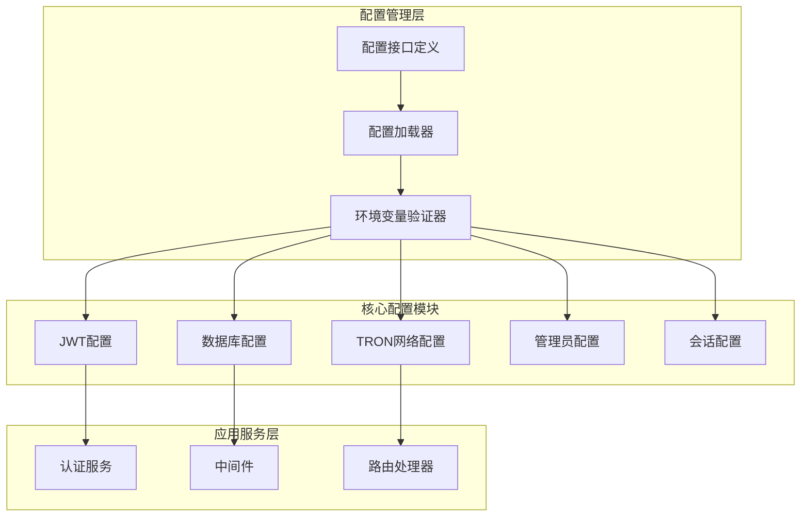
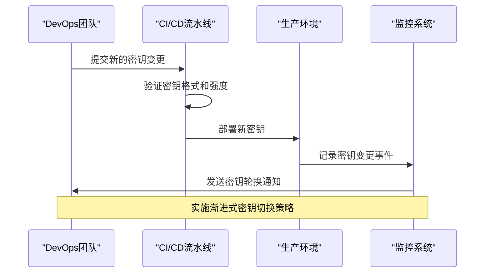
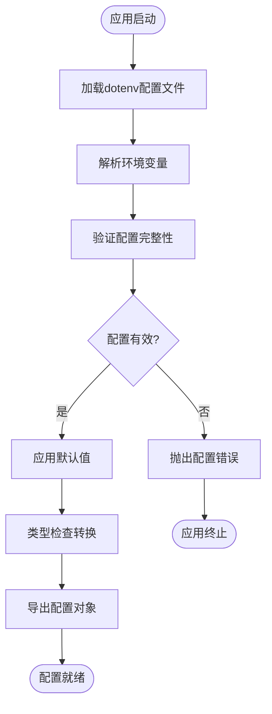
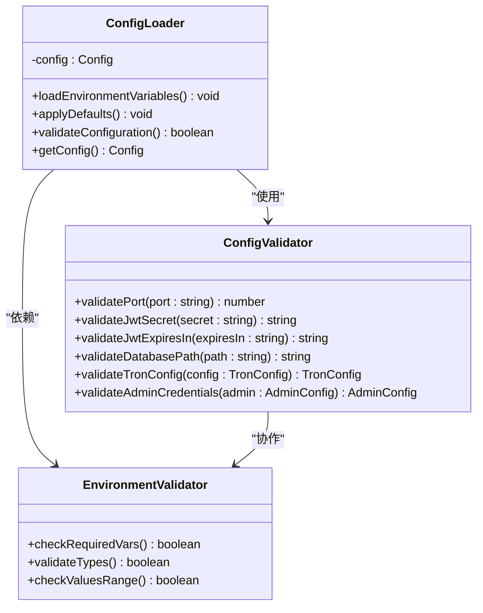
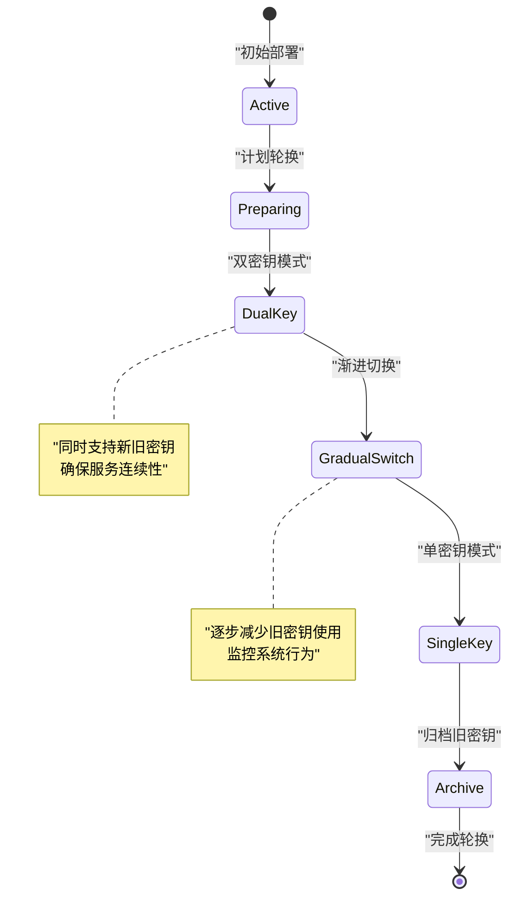
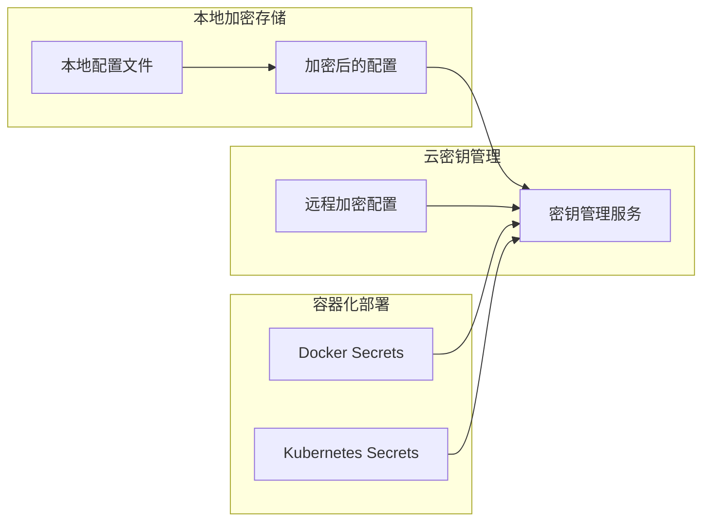
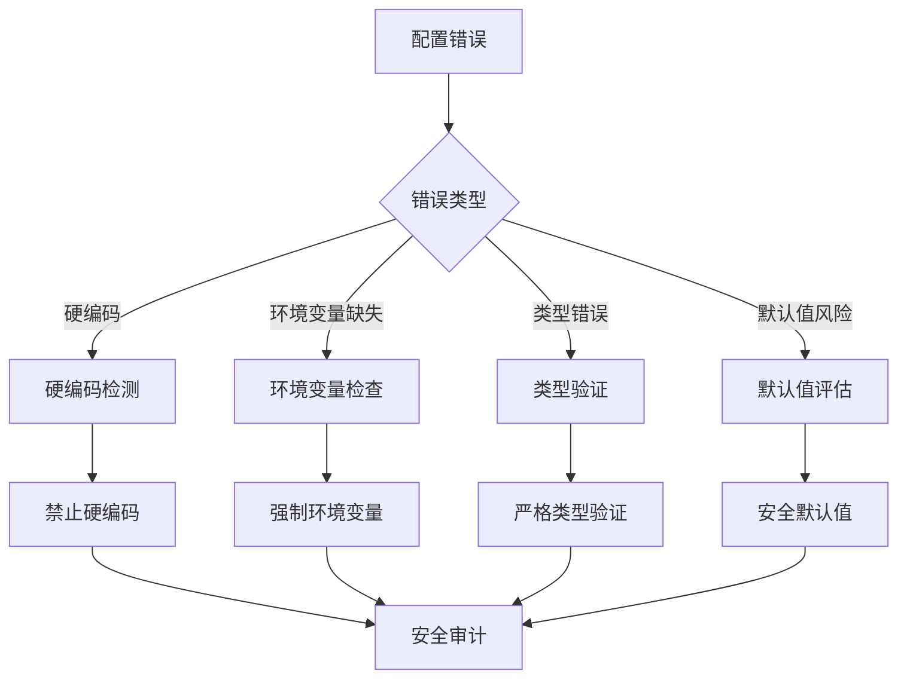

# 配置安全管理

<cite>
**本文档引用的文件**
- [src/config/index.ts](file://src/config/index.ts)
- [src/services/AuthService.ts](file://src/services/AuthService.ts)
- [src/middleware/auth.ts](file://src/middleware/auth.ts)
- [src/models/UserModel.ts](file://src/models/UserModel.ts)
- [src/routes/auth.ts](file://src/routes/auth.ts)
- [src/index.ts](file://src/index.ts)
- [package.json](file://package.json)
</cite>

## 目录
1. [简介](#简介)
2. [配置架构概览](#配置架构概览)
3. [JWT密钥安全管理](#jwt密钥安全管理)
4. [环境变量配置机制](#环境变量配置机制)
5. [配置加载与验证](#配置加载与验证)
6. [生产环境安全策略](#生产环境安全策略)
7. [配置错误案例与防范](#配置错误案例与防范)
8. [最佳实践建议](#最佳实践建议)
9. [总结](#总结)

## 简介

本系统采用基于环境变量的安全配置管理模式，确保敏感信息如JWT密钥、令牌有效期等关键配置项不会被硬编码在源代码中。通过统一的配置管理机制，实现了配置的集中化管理和动态加载，为系统的安全性和可维护性提供了坚实基础。

## 配置架构概览

系统配置采用分层设计模式，通过TypeScript接口定义配置结构，确保类型安全和配置完整性。



**图表来源**
- [src/config/index.ts](file://src/config/index.ts#L1-L52)
- [src/services/AuthService.ts](file://src/services/AuthService.ts#L1-L104)

**章节来源**
- [src/config/index.ts](file://src/config/index.ts#L1-L52)

## JWT密钥安全管理

### 密钥配置结构

系统通过配置文件定义JWT密钥和令牌有效期，采用环境变量优先的配置加载策略：

```typescript
interface Config {
  jwt: {
    secret: string;
    expiresIn: string;
  };
}
```

### 密钥生成与轮换策略



**图表来源**
- [src/config/index.ts](file://src/config/index.ts#L28-L31)
- [src/services/AuthService.ts](file://src/services/AuthService.ts#L13-L25)

### 密钥安全特性

1. **默认安全值**：配置文件提供默认的安全值，但强烈建议在生产环境中覆盖
2. **动态加载**：密钥通过环境变量动态加载，避免硬编码
3. **类型验证**：使用TypeScript确保配置类型的正确性
4. **错误处理**：完善的异常处理机制防止配置错误影响系统运行

**章节来源**
- [src/config/index.ts](file://src/config/index.ts#L28-L31)
- [src/services/AuthService.ts](file://src/services/AuthService.ts#L13-L25)

## 环境变量配置机制

### 配置加载流程



**图表来源**
- [src/config/index.ts](file://src/config/index.ts#L1-L52)

### 环境变量映射关系

系统支持以下关键环境变量配置：

| 环境变量名 | 配置路径 | 默认值 | 用途 |
|-----------|---------|--------|------|
| `JWT_SECRET` | `jwt.secret` | `your-super-secret-jwt-key-change-in-production` | JWT签名密钥 |
| `JWT_EXPIRES_IN` | `jwt.expiresIn` | `7d` | 令牌有效期 |
| `SESSION_SECRET` | `sessionSecret` | `your-session-secret-change-in-production` | 会话加密密钥 |
| `PORT` | `port` | `3000` | 服务端口 |
| `NODE_ENV` | `nodeEnv` | `development` | 运行环境 |

**章节来源**
- [src/config/index.ts](file://src/config/index.ts#L28-L45)

## 配置加载与验证

### 配置验证机制

系统实现了多层次的配置验证机制：



**图表来源**
- [src/config/index.ts](file://src/config/index.ts#L1-L52)

### 类型安全保证

通过TypeScript接口定义确保配置的类型安全：

```typescript
interface Config {
  port: number;
  nodeEnv: string;
  database: {
    path: string;
  };
  jwt: {
    secret: string;
    expiresIn: string;
  };
  tron: {
    rpcUrl: string;
    timeout: number;
    retryTimes: number;
    pollingInterval: number;
  };
  admin: {
    username: string;
    password: string;
  };
  sessionSecret: string;
}
```

**章节来源**
- [src/config/index.ts](file://src/config/index.ts#L6-L25)

## 生产环境安全策略

### 密钥轮换策略



### 访问控制要求

1. **最小权限原则**：每个组件只获取必要的配置权限
2. **配置隔离**：不同环境的配置严格分离
3. **审计跟踪**：记录所有配置变更操作
4. **紧急响应**：建立配置泄露应急响应机制

### 加密配置存储方案

推荐采用以下加密存储方案：



**章节来源**
- [src/config/index.ts](file://src/config/index.ts#L28-L45)

## 配置错误案例与防范

### 常见配置错误

1. **硬编码密钥**：直接在代码中写入敏感信息
2. **缺少环境变量**：未设置必需的环境变量
3. **类型转换错误**：字符串与数字类型的混淆
4. **默认值安全风险**：使用不安全的默认密钥

### 防范措施



### 错误处理机制

系统实现了完善的错误处理机制：

```typescript
// 配置加载错误示例
try {
  const config = loadConfig();
  validateConfig(config);
} catch (error) {
  logger.error('配置加载失败:', error);
  process.exit(1);
}
```

**章节来源**
- [src/config/index.ts](file://src/config/index.ts#L28-L45)

## 最佳实践建议

### 开发阶段配置管理

1. **使用`.env.example`文件**：提供完整的环境变量模板
2. **版本控制忽略**：将`.env`文件添加到`.gitignore`
3. **配置文档化**：详细记录每个配置项的用途和取值范围
4. **自动化测试**：包含配置验证的单元测试

### 生产环境配置安全

1. **密钥管理**：
   - 使用专门的密钥管理服务
   - 实施密钥轮换策略
   - 限制密钥访问权限

2. **配置验证**：
   - 启用配置完整性检查
   - 实施配置变更审批流程
   - 建立配置回滚机制

3. **监控告警**：
   - 监控配置变更活动
   - 设置配置异常告警
   - 定期进行安全审计

### 安全配置清单

- [ ] 已配置强密码的JWT密钥
- [ ] 已启用HTTPS传输加密
- [ ] 已实施CORS策略限制
- [ ] 已配置适当的HTTP安全头
- [ ] 已启用请求速率限制
- [ ] 已实施配置备份和恢复机制
- [ ] 已建立配置变更审计日志

## 总结

本系统通过精心设计的配置安全管理机制，实现了对敏感配置信息的有效保护。通过环境变量驱动的配置加载、严格的类型验证、完善的错误处理和安全的密钥管理，为系统的安全运行提供了可靠保障。

关键优势包括：

1. **安全性**：通过环境变量避免敏感信息泄露
2. **灵活性**：支持多环境配置管理
3. **可维护性**：清晰的配置结构便于维护
4. **可靠性**：完善的错误处理和验证机制

建议在实际部署中结合具体业务需求，进一步完善配置安全管理策略，确保系统在各种环境下的安全稳定运行。