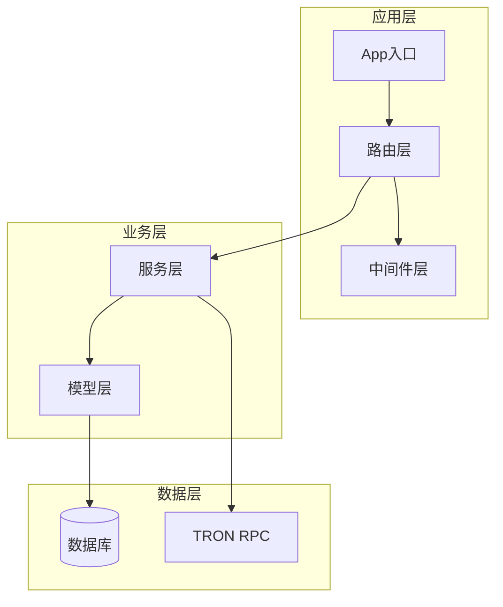
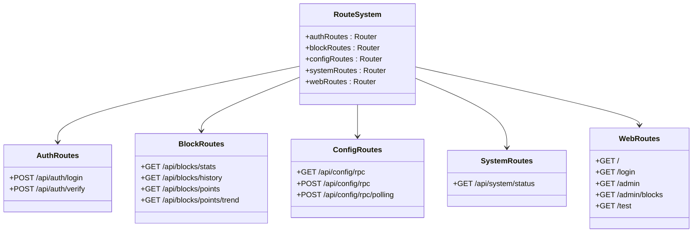
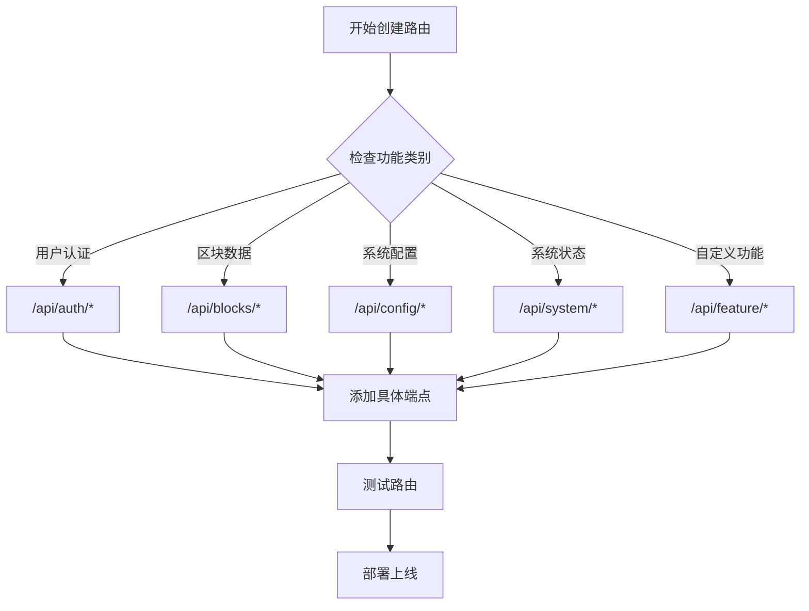
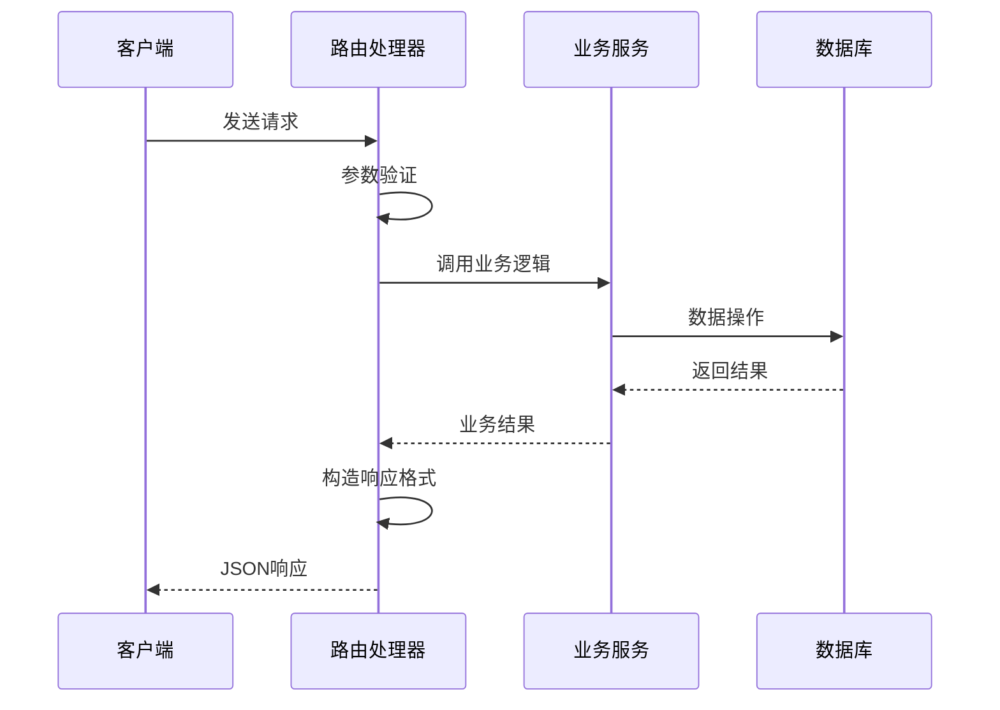
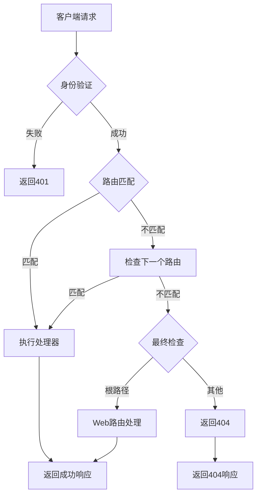

# API路由扩展指南

<cite>
**本文档引用的文件**
- [src/index.ts](file://src/index.ts)
- [src/routes/web.ts](file://src/routes/web.ts)
- [src/routes/auth.ts](file://src/routes/auth.ts)
- [src/routes/blocks.ts](file://src/routes/blocks.ts)
- [src/routes/config.ts](file://src/routes/config.ts)
- [src/routes/system.ts](file://src/routes/system.ts)
- [src/models/types.ts](file://src/models/types.ts)
- [src/middleware/auth.ts](file://src/middleware/auth.ts)
- [src/config/index.ts](file://src/config/index.ts)
</cite>

## 目录
1. [简介](#简介)
2. [项目架构概览](#项目架构概览)
3. [现有路由结构分析](#现有路由结构分析)
4. [创建新路由的标准流程](#创建新路由的标准流程)
5. [路由命名规范](#路由命名规范)
6. [HTTP方法选择指南](#http方法选择指南)
7. [请求参数校验](#请求参数校验)
8. [响应格式统一](#响应格式统一)
9. [实际代码示例](#实际代码示例)
10. [路由顺序和404处理](#路由顺序和404处理)
11. [最佳实践建议](#最佳实践建议)
12. [总结](#总结)

## 简介

本文档提供了在Point-Tron项目中扩展Web API路由的标准操作流程。通过分析现有的路由结构和实现模式，我们将详细介绍如何创建新的API路由、遵循命名规范、处理请求参数、统一响应格式等关键步骤。

Point-Tron是一个基于Express.js构建的区块链数据分析平台，采用模块化的路由设计，将不同功能的API分组管理。每个路由文件负责特定业务领域的API接口，通过统一的中间件栈提供安全、高效的API服务。

## 项目架构概览



**图表来源**
- [src/index.ts](file://src/index.ts#L1-L163)
- [src/routes/auth.ts](file://src/routes/auth.ts#L1-L62)
- [src/routes/blocks.ts](file://src/routes/blocks.ts#L1-L141)

**章节来源**
- [src/index.ts](file://src/index.ts#L1-L163)

## 现有路由结构分析

项目中的路由结构体现了清晰的模块化设计理念：

### 路由分类体系



**图表来源**
- [src/routes/auth.ts](file://src/routes/auth.ts#L1-L62)
- [src/routes/blocks.ts](file://src/routes/blocks.ts#L1-L141)
- [src/routes/config.ts](file://src/routes/config.ts#L1-L80)
- [src/routes/system.ts](file://src/routes/system.ts#L1-L47)
- [src/routes/web.ts](file://src/routes/web.ts#L1-L50)

### 中间件集成模式

所有API路由都集成了统一的安全中间件：

- **身份验证中间件**：`authenticateToken` - JWT令牌验证
- **速率限制**：防止API滥用
- **CORS配置**：跨域资源共享
- **安全头设置**：增强安全性
- **请求日志**：监控和调试

**章节来源**
- [src/routes/auth.ts](file://src/routes/auth.ts#L1-L62)
- [src/routes/blocks.ts](file://src/routes/blocks.ts#L1-L141)
- [src/routes/config.ts](file://src/routes/config.ts#L1-L80)
- [src/routes/system.ts](file://src/routes/system.ts#L1-L47)
- [src/middleware/auth.ts](file://src/middleware/auth.ts#L1-L171)

## 创建新路由的标准流程

### 步骤1：创建路由文件

在`src/routes/`目录下创建新的路由文件，例如`feature.ts`：

```typescript
import express from 'express';
import { ApiResponse } from '../models/types';
import { authenticateToken } from '../middleware/auth';

const router = express.Router();

// 路由定义区域
router.get('/endpoint', authenticateToken, async (req, res) => {
  // 实现逻辑
});

export default router;
```

### 步骤2：导入并挂载路由

在`src/index.ts`的`initializeRoutes`方法中添加路由挂载：

```typescript
// 导入新路由
import featureRoutes from './routes/feature';

private initializeRoutes(): void {
  // ...其他路由
  
  // 新增路由挂载
  this.app.use('/api/feature', featureRoutes);
  
  // ...其他路由
}
```

### 步骤3：实现API端点

根据业务需求实现具体的API端点，确保遵循项目的编码规范和错误处理模式。

**章节来源**
- [src/index.ts](file://src/index.ts#L15-L25)
- [src/routes/auth.ts](file://src/routes/auth.ts#L1-L62)

## 路由命名规范

### 命名原则

1. **使用小写字母**：保持一致性
2. **使用连字符分隔单词**：提高可读性
3. **避免使用特殊字符**：仅使用字母、数字和连字符
4. **语义明确**：路由名称应准确描述其功能

### 推荐命名模式



**图表来源**
- [src/routes/auth.ts](file://src/routes/auth.ts#L1-L62)
- [src/routes/blocks.ts](file://src/routes/blocks.ts#L1-L141)
- [src/routes/config.ts](file://src/routes/config.ts#L1-L80)
- [src/routes/system.ts](file://src/routes/system.ts#L1-L47)

## HTTP方法选择指南

### GET方法使用场景

- **查询数据**：获取列表、详情、统计信息
- **无副作用操作**：不会修改服务器状态的操作
- **幂等性**：多次调用效果相同

```typescript
// 示例：获取统计数据
router.get('/stats', authenticateToken, async (req, res) => {
  try {
    const stats = await SomeService.getStats();
    res.json({
      success: true,
      data: stats
    });
  } catch (error) {
    res.status(500).json({
      success: false,
      error: '获取数据失败'
    });
  }
});
```

### POST方法使用场景

- **创建资源**：新增记录、提交表单
- **触发操作**：执行特定业务逻辑
- **批量操作**：处理多个数据项

```typescript
// 示例：创建新记录
router.post('/create', authenticateToken, async (req, res) => {
  try {
    const { data } = req.body;
    const result = await SomeService.create(data);
    res.json({
      success: true,
      data: result
    });
  } catch (error) {
    res.status(500).json({
      success: false,
      error: '创建失败'
    });
  }
});
```

### PUT/PATCH方法使用场景

- **更新资源**：修改现有记录
- **部分更新**：仅更新指定字段

### DELETE方法使用场景

- **删除资源**：移除记录
- **清理操作**：清除缓存、临时数据

## 请求参数校验

### 查询参数处理

```typescript
// 示例：带查询参数的GET请求
router.get('/search', authenticateToken, async (req, res) => {
  try {
    const { page = 1, limit = 10, sort = 'desc' } = req.query;
    
    // 参数验证
    if (parseInt(page as string) <= 0) {
      return res.status(400).json({
        success: false,
        error: '页码必须大于0'
      });
    }
    
    const results = await SomeService.search({
      page: parseInt(page as string),
      limit: parseInt(limit as string),
      sort: sort as string
    });
    
    res.json({
      success: true,
      data: results
    });
  } catch (error) {
    res.status(500).json({
      success: false,
      error: '搜索失败'
    });
  }
});
```

### 请求体参数处理

```typescript
// 示例：POST请求体参数验证
router.post('/submit', authenticateToken, async (req, res) => {
  try {
    const { name, email, age } = req.body;
    
    // 必填字段验证
    if (!name || !email) {
      return res.status(400).json({
        success: false,
        error: '姓名和邮箱为必填项'
      });
    }
    
    // 数据类型验证
    if (age && typeof age !== 'number') {
      return res.status(400).json({
        success: false,
        error: '年龄必须是数字'
      });
    }
    
    const result = await SomeService.process({
      name,
      email,
      age: age || 0
    });
    
    res.json({
      success: true,
      data: result
    });
  } catch (error) {
    res.status(500).json({
      success: false,
      error: '提交失败'
    });
  }
});
```

## 响应格式统一

### 统一响应接口

项目使用统一的响应格式接口：

```typescript
interface ApiResponse<T = any> {
  success: boolean;
  data?: T;
  message?: string;
  error?: string;
}
```

### 标准响应模式



**图表来源**
- [src/models/types.ts](file://src/models/types.ts#L45-L59)
- [src/routes/auth.ts](file://src/routes/auth.ts#L15-L45)

### 错误处理模式

```typescript
// 统一错误处理示例
router.get('/data', authenticateToken, async (req, res) => {
  try {
    const data = await SomeService.getData();
    
    res.json({
      success: true,
      data: data
    });
    
  } catch (error) {
    console.error('API错误:', error);
    
    // 根据错误类型返回不同的状态码
    if (error instanceof ValidationError) {
      res.status(400).json({
        success: false,
        error: error.message
      });
    } else if (error instanceof NotFoundError) {
      res.status(404).json({
        success: false,
        error: '资源未找到'
      });
    } else {
      res.status(500).json({
        success: false,
        error: '服务器内部错误'
      });
    }
  }
});
```

**章节来源**
- [src/models/types.ts](file://src/models/types.ts#L45-L59)
- [src/routes/auth.ts](file://src/routes/auth.ts#L15-L62)
- [src/routes/blocks.ts](file://src/routes/blocks.ts#L15-L45)

## 实际代码示例

### 创建Feature路由示例

以下是一个完整的Feature路由实现示例：

```typescript
// src/routes/feature.ts
import express from 'express';
import { ApiResponse } from '../models/types';
import { authenticateToken } from '../middleware/auth';

const router = express.Router();

// 获取功能列表
router.get('/list', authenticateToken, async (req, res: express.Response<ApiResponse>) => {
  try {
    const { category, status } = req.query;
    
    const features = await FeatureService.getFeatures({
      category: category as string,
      status: status as string
    });
    
    res.json({
      success: true,
      data: features
    });
    
  } catch (error) {
    console.error('获取功能列表失败:', error);
    res.status(500).json({
      success: false,
      error: '获取功能列表失败'
    });
  }
});

// 创建新功能
router.post('/create', authenticateToken, async (req, res: express.Response<ApiResponse>) => {
  try {
    const { name, description, category } = req.body;
    
    // 参数验证
    if (!name || !category) {
      return res.status(400).json({
        success: false,
        error: '功能名称和类别为必填项'
      });
    }
    
    const newFeature = await FeatureService.createFeature({
      name,
      description: description || '',
      category,
      createdBy: req.user!.id
    });
    
    res.json({
      success: true,
      data: newFeature,
      message: '功能创建成功'
    });
    
  } catch (error) {
    console.error('创建功能失败:', error);
    res.status(500).json({
      success: false,
      error: '创建功能失败'
    });
  }
});

// 更新功能状态
router.put('/:id/status', authenticateToken, async (req, res: express.Response<ApiResponse>) => {
  try {
    const { id } = req.params;
    const { status } = req.body;
    
    if (!['active', 'inactive', 'deleted'].includes(status)) {
      return res.status(400).json({
        success: false,
        error: '无效的状态值'
      });
    }
    
    const updatedFeature = await FeatureService.updateStatus(
      parseInt(id),
      status
    );
    
    res.json({
      success: true,
      data: updatedFeature,
      message: '功能状态更新成功'
    });
    
  } catch (error) {
    console.error('更新功能状态失败:', error);
    res.status(500).json({
      success: false,
      error: '更新功能状态失败'
    });
  }
});

export default router;
```

### 在主应用中集成

```typescript
// src/index.ts
import featureRoutes from './routes/feature';

class App {
  // ...其他代码
  
  private initializeRoutes(): void {
    // API路由
    this.app.use('/api/auth', authRoutes);
    this.app.use('/api/blocks', blockRoutes);
    this.app.use('/api/config', configRoutes);
    this.app.use('/api/system', systemRoutes);
    this.app.use('/api/feature', featureRoutes); // 新增路由
    
    // Web页面路由
    this.app.use('/', webRoutes);
    
    // 健康检查端点
    this.app.get('/health', (req, res) => {
      res.json({
        success: true,
        data: {
          status: 'healthy',
          timestamp: new Date().toISOString()
        }
      });
    });
    
    // 404处理
    this.app.use('*', (req, res) => {
      res.status(404).json({
        success: false,
        error: '页面不存在'
      });
    });
  }
  
  // ...其他代码
}
```

**章节来源**
- [src/routes/feature.ts](file://src/routes/feature.ts#L1-L100)
- [src/index.ts](file://src/index.ts#L45-L65)

## 路由顺序和404处理

### 路由加载顺序的重要性

路由的加载顺序直接影响API的行为：



**图表来源**
- [src/index.ts](file://src/index.ts#L45-L75)

### 404处理机制

项目中实现了统一的404处理：

```typescript
// 404处理中间件
this.app.use('*', (req, res) => {
  res.status(404).json({
    success: false,
    error: '页面不存在'
  });
});
```

### 最佳实践建议

1. **按优先级排序**：将更具体的路由放在前面
2. **避免冲突**：确保路由路径不重复
3. **测试覆盖**：为每个路由编写单元测试
4. **文档同步**：及时更新API文档

**章节来源**
- [src/index.ts](file://src/index.ts#L70-L75)

## 最佳实践建议

### 代码组织原则

1. **单一职责**：每个路由文件专注于特定功能领域
2. **模块化设计**：将通用功能提取到独立模块
3. **错误隔离**：确保单个路由错误不影响其他路由
4. **性能优化**：合理使用异步操作和并发处理

### 安全考虑

1. **输入验证**：严格验证所有输入参数
2. **权限控制**：基于角色的访问控制
3. **速率限制**：防止API滥用
4. **日志记录**：记录重要操作和异常情况

### 可维护性

1. **代码注释**：为复杂逻辑添加详细注释
2. **类型安全**：充分利用TypeScript类型系统
3. **错误处理**：提供有意义的错误信息
4. **版本控制**：为API添加版本号支持

### 性能优化

1. **缓存策略**：对频繁访问的数据实施缓存
2. **数据库优化**：合理设计索引和查询
3. **并发控制**：避免资源竞争和死锁
4. **内存管理**：及时释放不需要的资源

## 总结

通过本文档的指导，开发者可以：

1. **掌握标准流程**：了解从创建路由文件到集成的完整过程
2. **遵循命名规范**：确保路由命名的一致性和可读性
3. **正确选择HTTP方法**：根据业务需求选择合适的HTTP动词
4. **实现参数校验**：确保请求数据的有效性和安全性
5. **统一响应格式**：提供一致的API响应体验
6. **理解路由顺序**：避免路由冲突和404问题
7. **应用最佳实践**：编写高质量、可维护的API代码

这些规范和实践不仅提高了代码质量，还增强了系统的稳定性和可扩展性。随着项目的发展，建议持续优化和完善路由设计，确保API能够满足不断变化的业务需求。