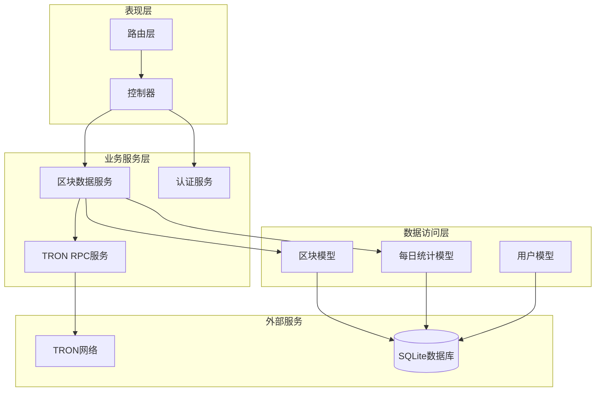
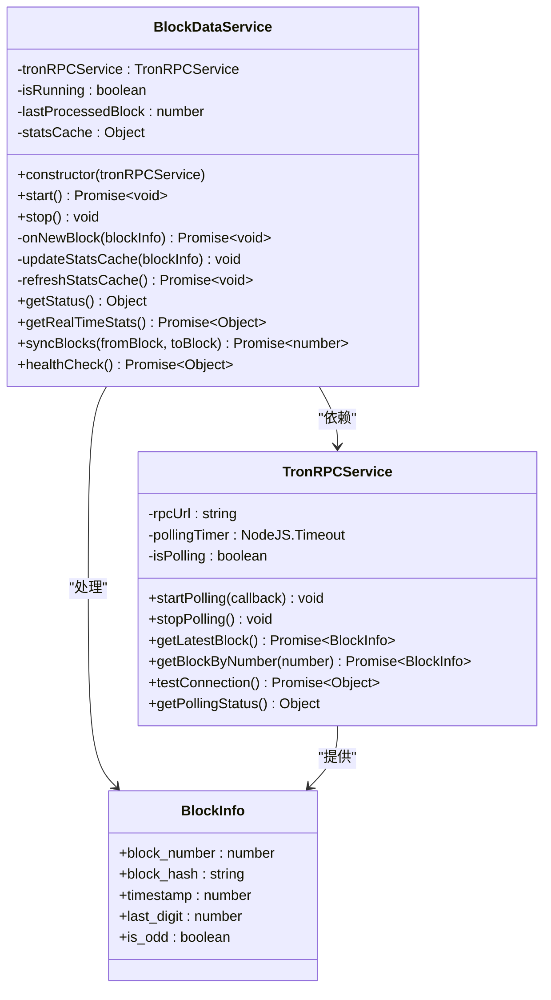
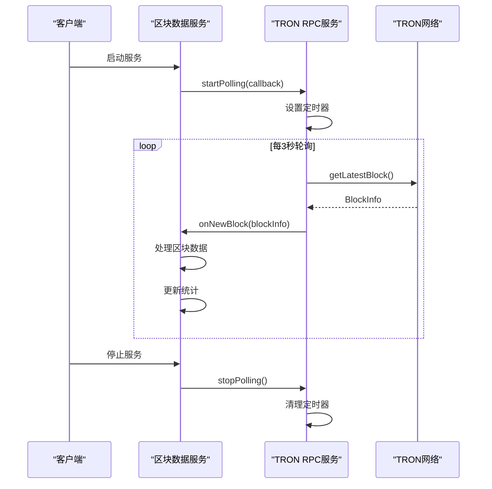
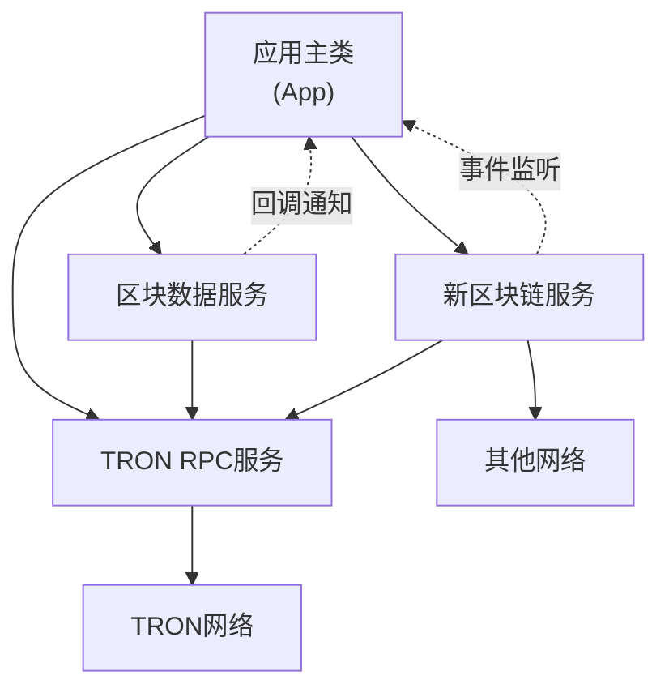
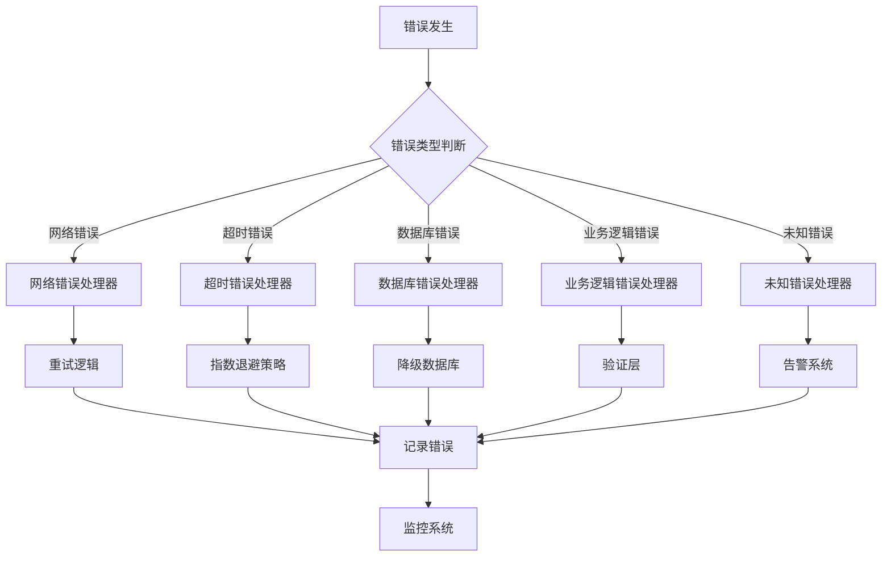

# 业务服务扩展指南

<cite>
**本文档引用的文件**
- [BlockDataService.ts](file://src/services/BlockDataService.ts)
- [TronRPCService.ts](file://src/services/TronRPCService.ts)
- [index.ts](file://src/index.ts)
- [types.ts](file://src/models/types.ts)
- [blocks.ts](file://src/routes/blocks.ts)
- [index.ts](file://src/config/index.ts)
</cite>

## 目录
1. [简介](#简介)
2. [服务架构概览](#服务架构概览)
3. [核心服务设计原则](#核心服务设计原则)
4. [现有服务分析](#现有服务分析)
5. [创建新服务类的完整指南](#创建新服务类的完整指南)
6. [服务间通信机制](#服务间通信机制)
7. [最佳实践模板](#最佳实践模板)
8. [错误处理与监控](#错误处理与监控)
9. [性能优化建议](#性能优化建议)
10. [故障排除指南](#故障排除指南)

## 简介

本文档为开发者提供了创建新的业务服务类的详细指南，重点介绍如何基于现有的BlockDataService和TronRPCService模式来扩展系统功能。通过深入分析现有服务的设计原理和实现细节，我们将展示如何构建可维护、可测试且高性能的业务服务。

## 服务架构概览

系统采用分层架构设计，业务服务位于核心层，负责协调数据访问层和外部服务。这种设计确保了代码的模块化和可扩展性。



**图表来源**
- [index.ts](file://src/index.ts#L1-L50)
- [BlockDataService.ts](file://src/services/BlockDataService.ts#L1-L30)
- [TronRPCService.ts](file://src/services/TronRPCService.ts#L1-L30)

## 核心服务设计原则

### 单一职责原则

每个业务服务都专注于特定的功能领域，避免功能混杂导致的复杂性。

### 可测试性设计

服务通过依赖注入的方式接收外部依赖，使得单元测试变得简单直接。

### 依赖注入模式

所有外部依赖都在构造函数中注入，而不是在服务内部创建实例。

### 异步生命周期管理

服务具有明确的启动(start)和停止(stop)生命周期方法，支持优雅的资源管理。

## 现有服务分析

### BlockDataService 分析

BlockDataService 是系统的核心业务服务，负责区块数据的采集、处理和存储。



**图表来源**
- [BlockDataService.ts](file://src/services/BlockDataService.ts#L8-L273)
- [TronRPCService.ts](file://src/services/TronRPCService.ts#L15-L258)
- [types.ts](file://src/models/types.ts#L1-L15)

### TronRPCService 分析

TronRPCService 提供与TRON区块链网络的交互能力，实现了轮询机制来持续监控新区块。



**图表来源**
- [BlockDataService.ts](file://src/services/BlockDataService.ts#L30-L50)
- [TronRPCService.ts](file://src/services/TronRPCService.ts#L30-L80)

**章节来源**
- [BlockDataService.ts](file://src/services/BlockDataService.ts#L1-L273)
- [TronRPCService.ts](file://src/services/TronRPCService.ts#L1-L258)

## 创建新服务类的完整指南

### 步骤1：定义服务接口

首先，为新服务定义清晰的接口契约：

```typescript
// 新服务接口示例
export interface NewBlockchainService {
  start(): Promise<void>;
  stop(): void;
  getLatestBlock(): Promise<BlockInfo>;
  getBlockByNumber(blockNumber: number): Promise<BlockInfo>;
  healthCheck(): Promise<boolean>;
}
```

### 步骤2：实现服务类

基于BlockDataService的模式实现新服务：

```typescript
export class NewBlockchainService implements NewBlockchainService {
  private blockchainRpcService: BlockchainRpcService;
  private isRunning: boolean = false;
  private lastProcessedBlock: number = 0;
  private pollingTimer: NodeJS.Timeout | null = null;

  constructor(blockchainRpcService: BlockchainRpcService) {
    this.blockchainRpcService = blockchainRpcService;
  }

  public async start(): Promise<void> {
    if (this.isRunning) {
      console.warn('服务已在运行中');
      return;
    }

    try {
      // 初始化逻辑
      await this.initializeService();
      
      // 启动轮询
      this.startPolling();
      
      this.isRunning = true;
      console.log('✅ 服务已启动');
      
    } catch (error) {
      console.error('启动服务失败:', error);
      throw error;
    }
  }

  public stop(): void {
    if (!this.isRunning) {
      return;
    }

    this.stopPolling();
    this.isRunning = false;
    console.log('🛑 服务已停止');
  }

  private startPolling(): void {
    // 实现轮询逻辑
  }

  private stopPolling(): void {
    // 清理轮询资源
  }

  private async initializeService(): Promise<void> {
    // 服务初始化逻辑
  }
}
```

### 步骤3：集成到主应用

在主应用中注册新服务：

```typescript
// 在App类中添加新服务
class App {
  private newBlockchainService: NewBlockchainService;

  constructor() {
    // ...
    this.newBlockchainService = new NewBlockchainService(this.blockchainRpcService);
  }

  public async start(): Promise<void> {
    // ...
    await this.newBlockchainService.start();
    // ...
  }

  public async shutdown(): Promise<void> {
    // ...
    this.newBlockchainService.stop();
    // ...
  }
}
```

**章节来源**
- [BlockDataService.ts](file://src/services/BlockDataService.ts#L8-L50)
- [index.ts](file://src/index.ts#L15-L35)

## 服务间通信机制

### 依赖注入通信

服务间通过依赖注入建立松耦合关系：



**图表来源**
- [index.ts](file://src/index.ts#L15-L35)
- [BlockDataService.ts](file://src/services/BlockDataService.ts#L15-L25)

### 回调机制

使用回调函数实现服务间的异步通信：

```typescript
// 在BlockDataService中使用回调
this.tronRPCService.startPolling(this.onNewBlock.bind(this));

// 回调函数实现
private async onNewBlock(blockInfo: BlockInfo): Promise<void> {
  // 处理新块逻辑
}
```

**章节来源**
- [BlockDataService.ts](file://src/services/BlockDataService.ts#L30-L50)
- [TronRPCService.ts](file://src/services/TronRPCService.ts#L30-L80)

## 最佳实践模板

### 完整的服务模板

以下是创建新业务服务的最佳实践模板：

```typescript
// 1. 定义服务接口
export interface IServiceTemplate {
  start(): Promise<void>;
  stop(): void;
  getStatus(): ServiceStatus;
  healthCheck(): Promise<ServiceHealth>;
}

// 2. 实现服务类
export class ServiceTemplate implements IServiceTemplate {
  private serviceDeps: ServiceDependencies;
  private isRunning: boolean = false;
  private logger: Logger;
  private config: ServiceConfig;

  constructor(deps: ServiceDependencies, config?: Partial<ServiceConfig>) {
    this.serviceDeps = deps;
    this.config = { ...defaultConfig, ...config };
    this.logger = new Logger('ServiceTemplate');
  }

  public async start(): Promise<void> {
    if (this.isRunning) {
      this.logger.warn('服务已在运行中');
      return;
    }

    try {
      await this.initializeResources();
      this.startMonitoring();
      this.isRunning = true;
      this.logger.info('服务启动成功');
      
    } catch (error) {
      this.logger.error('启动服务失败:', error);
      throw error;
    }
  }

  public stop(): void {
    if (!this.isRunning) return;

    this.stopMonitoring();
    this.cleanupResources();
    this.isRunning = false;
    this.logger.info('服务已停止');
  }

  private async initializeResources(): Promise<void> {
    // 初始化数据库连接、网络连接等资源
  }

  private startMonitoring(): void {
    // 启动监控循环
  }

  private stopMonitoring(): void {
    // 停止监控循环
  }

  private cleanupResources(): void {
    // 清理所有资源
  }

  public getStatus(): ServiceStatus {
    return {
      isRunning: this.isRunning,
      config: this.config,
      metrics: this.collectMetrics()
    };
  }

  public async healthCheck(): Promise<ServiceHealth> {
    const checks = await Promise.all([
      this.checkDatabaseConnection(),
      this.checkExternalService(),
      this.checkResourceUsage()
    ]);

    return {
      healthy: checks.every(check => check.healthy),
      checks: checks
    };
  }

  private collectMetrics(): ServiceMetrics {
    // 收集服务指标
    return {};
  }

  private async checkDatabaseConnection(): Promise<HealthCheck> {
    // 检查数据库连接
    return { healthy: true, message: '数据库连接正常' };
  }

  private async checkExternalService(): Promise<HealthCheck> {
    // 检查外部服务连接
    return { healthy: true, message: '外部服务连接正常' };
  }

  private async checkResourceUsage(): Promise<HealthCheck> {
    // 检查资源使用情况
    return { healthy: true, message: '资源使用正常' };
  }
}
```

### 异步初始化模式

```typescript
// 异步初始化示例
private async initializeAsync(): Promise<void> {
  try {
    // 并行初始化多个组件
    await Promise.all([
      this.initializeDatabase(),
      this.initializeCache(),
      this.initializeExternalServices()
    ]);
    
    // 设置定时任务
    this.setupPeriodicTasks();
    
  } catch (error) {
    this.logger.error('异步初始化失败:', error);
    throw error;
  }
}
```

### 错误处理模式

```typescript
// 统一错误处理示例
private async handleOperation<T>(
  operation: () => Promise<T>,
  context: string
): Promise<T | null> {
  try {
    return await operation();
  } catch (error) {
    this.logger.error(`${context}操作失败:`, error);
    
    // 根据错误类型采取不同措施
    if (error instanceof NetworkError) {
      await this.handleNetworkError(error);
    } else if (error instanceof TimeoutError) {
      await this.handleTimeoutError(error);
    }
    
    return null;
  }
}
```

## 错误处理与监控

### 错误分类处理

系统实现了多层次的错误处理机制：



### 日志记录最佳实践

```typescript
// 结构化日志记录
private logOperation(operation: string, data: any = {}): void {
  this.logger.info(operation, {
    timestamp: new Date().toISOString(),
    service: 'ServiceTemplate',
    operation: operation,
    ...data
  });
}

// 错误日志记录
private logError(operation: string, error: Error, data: any = {}): void {
  this.logger.error(`${operation}失败`, {
    timestamp: new Date().toISOString(),
    service: 'ServiceTemplate',
    operation: operation,
    error: error.message,
    stack: error.stack,
    ...data
  });
}
```

**章节来源**
- [BlockDataService.ts](file://src/services/BlockDataService.ts#L100-L150)
- [TronRPCService.ts](file://src/services/TronRPCService.ts#L100-L150)

## 性能优化建议

### 内存管理

1. **及时清理定时器和事件监听器**
2. **避免内存泄漏的闭包引用**
3. **合理使用对象池和缓存**

### 并发控制

```typescript
// 限流器实现
class RateLimiter {
  private requests: number = 0;
  private lastReset: number = Date.now();
  private maxRequests: number;
  private windowMs: number;

  constructor(maxRequests: number = 100, windowMs: number = 60000) {
    this.maxRequests = maxRequests;
    this.windowMs = windowMs;
  }

  public async wait(): Promise<void> {
    const now = Date.now();
    
    // 重置计数器
    if (now - this.lastReset > this.windowMs) {
      this.requests = 0;
      this.lastReset = now;
    }

    if (this.requests >= this.maxRequests) {
      const waitTime = this.windowMs - (now - this.lastReset);
      await new Promise(resolve => setTimeout(resolve, waitTime));
    }

    this.requests++;
  }
}
```

### 缓存策略

```typescript
// 智能缓存实现
class IntelligentCache<T> {
  private cache: Map<string, { value: T; expires: number }>;
  private ttl: number;

  constructor(ttl: number = 300000) { // 默认5分钟
    this.cache = new Map();
    this.ttl = ttl;
  }

  public set(key: string, value: T): void {
    const expires = Date.now() + this.ttl;
    this.cache.set(key, { value, expires });
  }

  public get(key: string): T | undefined {
    const item = this.cache.get(key);
    if (!item) return undefined;

    if (Date.now() > item.expires) {
      this.cache.delete(key);
      return undefined;
    }

    return item.value;
  }

  public invalidate(pattern: RegExp): void {
    for (const [key] of this.cache) {
      if (pattern.test(key)) {
        this.cache.delete(key);
      }
    }
  }
}
```

## 故障排除指南

### 常见问题诊断

1. **服务启动失败**
   - 检查依赖服务是否可用
   - 验证配置参数正确性
   - 查看日志中的错误堆栈

2. **内存泄漏**
   - 使用内存分析工具检测
   - 检查定时器和事件监听器是否正确清理
   - 监控长期运行的服务内存使用情况

3. **性能问题**
   - 分析CPU和内存使用率
   - 检查数据库查询效率
   - 优化网络请求频率

### 监控指标

```typescript
// 服务监控指标收集
interface ServiceMetrics {
  uptime: number;
  memoryUsage: number;
  cpuUsage: number;
  activeConnections: number;
  requestRate: number;
  errorRate: number;
  responseTimePercentiles: {
    p50: number;
    p95: number;
    p99: number;
  };
}

// 健康检查实现
interface HealthCheck {
  healthy: boolean;
  message: string;
  timestamp: number;
  details?: any;
}
```

### 调试工具

```typescript
// 调试辅助工具
class ServiceDebugger {
  public static async dumpServiceState(service: any): Promise<any> {
    const state = {
      isRunning: service.isRunning,
      config: service.config,
      metrics: service.getMetrics(),
      health: await service.healthCheck()
    };

    console.log('服务状态:', JSON.stringify(state, null, 2));
    return state;
  }

  public static async simulateError(service: any, errorType: string): Promise<void> {
    console.log(`模拟${errorType}错误`);
    // 实现错误模拟逻辑
  }
}
```

通过遵循这些最佳实践和模式，开发者可以创建出高质量、可维护的业务服务，支持系统的持续扩展和演进。新服务应该严格遵循单一职责原则，通过依赖注入实现松耦合，并提供完善的错误处理和监控机制。