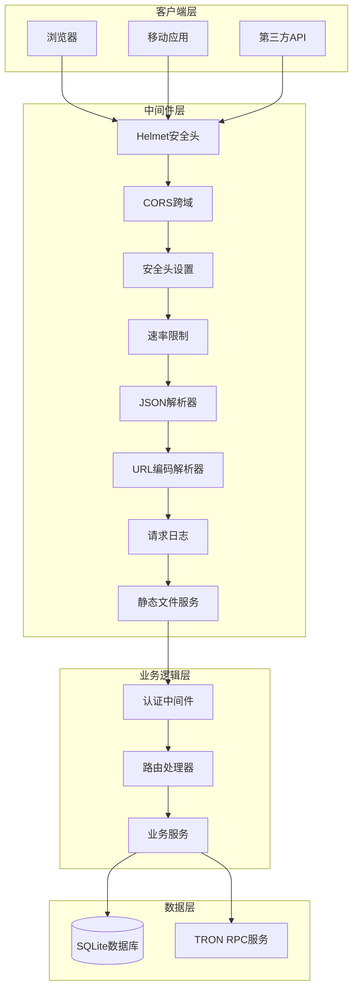
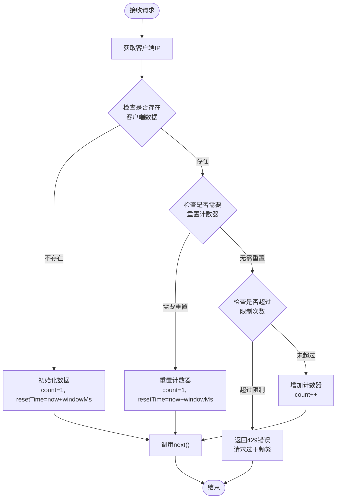
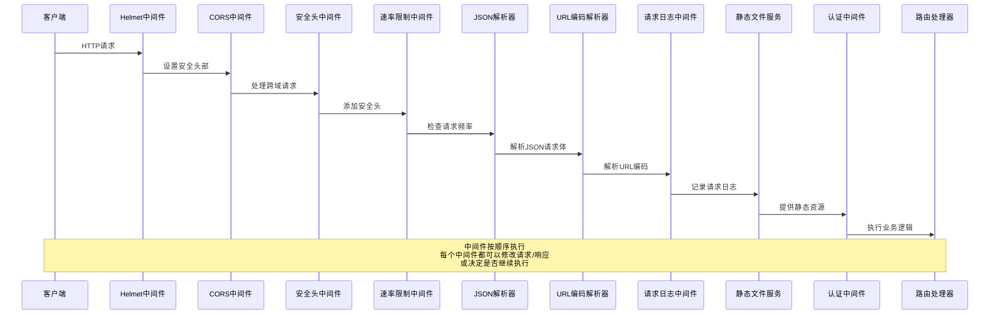

# 中间件配置与安全策略

<cite>
**本文档引用的文件**
- [src/index.ts](file://src/index.ts)
- [src/middleware/auth.ts](file://src/middleware/auth.ts)
- [src/routes/auth.ts](file://src/routes/auth.ts)
- [src/config/index.ts](file://src/config/index.ts)
- [package.json](file://package.json)
</cite>

## 目录
1. [简介](#简介)
2. [项目架构概览](#项目架构概览)
3. [核心中间件组件](#核心中间件组件)
4. [安全中间件详解](#安全中间件详解)
5. [CORS跨域配置](#cors跨域配置)
6. [速率限制机制](#速率限制机制)
7. [请求日志中间件](#请求日志中间件)
8. [中间件执行顺序](#中间件执行顺序)
9. [自定义中间件开发指南](#自定义中间件开发指南)
10. [常见问题与解决方案](#常见问题与解决方案)
11. [最佳实践建议](#最佳实践建议)

## 简介

本文档深入分析Point-Tron项目中的中间件配置与安全策略实现。该项目是一个基于Express.js构建的区块链数据管理系统，采用了多层次的安全中间件架构来保护API服务和Web应用的安全性。

项目的核心中间件包括：
- Helmet安全头中间件：提供全面的安全防护
- CORS跨域中间件：控制跨域访问策略
- 自定义安全头设置：增强HTTP响应安全性
- 速率限制中间件：防止API滥用
- 请求日志中间件：监控和调试请求流量
- JWT认证中间件：用户身份验证
- 错误处理中间件：统一错误处理

## 项目架构概览



**图表来源**
- [src/index.ts](file://src/index.ts#L25-L40)
- [src/middleware/auth.ts](file://src/middleware/auth.ts#L118-L170)

**章节来源**
- [src/index.ts](file://src/index.ts#L1-L163)

## 核心中间件组件

### 中间件初始化流程

在`App`类的构造函数中，中间件按照特定顺序进行初始化：

```typescript
private initializeMiddlewares(): void {
  // 安全中间件
  this.app.use(helmet({
    contentSecurityPolicy: false, // 为了支持EJS模板
  }));
  this.app.use(cors(corsOptions));
  this.app.use(securityHeaders);
  this.app.use(rateLimit(200, 60000)); // 每分钟最多200个请求

  // 基础中间件
  this.app.use(express.json({ limit: '10mb' }));
  this.app.use(express.urlencoded({ extended: true, limit: '10mb' }));
  this.app.use(requestLogger);

  // 静态文件服务
  this.app.use('/static', express.static(path.join(__dirname, '../public')));

  // 视图引擎设置
  this.app.set('view engine', 'ejs');
  this.app.set('views', path.join(__dirname, 'views'));
}
```

### 中间件执行顺序的重要性

中间件的执行顺序至关重要，因为每个中间件都有机会修改请求或响应对象，或者决定是否继续执行后续中间件：

1. **安全中间件**（Helmet、CORS、安全头）：最先执行，确保所有请求都经过基本安全检查
2. **解析中间件**（JSON、URL编码）：处理请求体解析
3. **日志中间件**：记录请求信息
4. **静态文件服务**：提供静态资源访问
5. **业务中间件**（认证、路由）：处理业务逻辑

**章节来源**
- [src/index.ts](file://src/index.ts#L25-L40)

## 安全中间件详解

### Helmet安全头配置

Helmet是Express.js生态系统中最受欢迎的安全中间件之一，它通过设置各种HTTP头部来增强应用的安全性。

```typescript
this.app.use(helmet({
  contentSecurityPolicy: false, // 为了支持EJS模板
}));
```

#### Helmet配置特点

**关键特性：**
- **contentSecurityPolicy: false**：禁用内容安全策略是为了支持EJS模板渲染
- **自动安全头部设置**：包括X-Content-Type-Options、X-Frame-Options等
- **默认安全配置**：提供业界最佳实践的安全头部

#### 内容安全策略禁用原因

在项目中禁用内容安全策略（CSP）的主要原因是支持EJS模板引擎的动态内容渲染。CSP会限制页面可以加载的资源类型，可能会影响模板中动态生成的内容。

**替代方案：**
- 如果需要启用CSP，可以配置适当的策略规则
- 使用nonce或哈希值来允许特定的内联脚本
- 考虑使用更宽松的CSP策略

### 自定义安全头设置

项目实现了自定义的安全头中间件，提供额外的安全保护：

```typescript
export const securityHeaders = (req: Request, res: Response, next: NextFunction): void => {
  res.setHeader('X-Content-Type-Options', 'nosniff');
  res.setHeader('X-Frame-Options', 'DENY');
  res.setHeader('X-XSS-Protection', '1; mode=block');
  res.setHeader('Strict-Transport-Security', 'max-age=31536000; includeSubDomains');
  next();
};
```

#### 安全头部详解

1. **X-Content-Type-Options: nosniff**
   - 防止浏览器嗅探响应的内容类型
   - 减少XSS攻击风险

2. **X-Frame-Options: DENY**
   - 防止页面被嵌套在iframe中
   - 防止点击劫持攻击

3. **X-XSS-Protection: 1; mode=block**
   - 启用浏览器的XSS过滤器
   - 在检测到XSS时阻止页面加载

4. **Strict-Transport-Security: max-age=31536000; includeSubDomains**
   - 强制使用HTTPS协议
   - 设置有效期为1年
   - 包含子域名

**章节来源**
- [src/index.ts](file://src/index.ts#L25-L35)
- [src/middleware/auth.ts](file://src/middleware/auth.ts#L118-L135)

## CORS跨域配置

### CORS中间件配置详解

```typescript
export const corsOptions = {
  origin: function (origin: string | undefined, callback: Function) {
    // 允许所有来源（开发环境）
    // 生产环境中应该配置具体的域名
    callback(null, true);
  },
  credentials: true,
  methods: ['GET', 'POST', 'PUT', 'DELETE', 'OPTIONS'],
  allowedHeaders: ['Content-Type', 'Authorization']
};
```

### CORS配置参数分析

#### origin字段
- **功能**：控制哪些源可以访问资源
- **当前配置**：开发环境允许所有来源，生产环境应限制为具体域名
- **安全考虑**：过度宽松的origin配置可能导致CSRF攻击

#### credentials字段
- **功能**：允许跨域请求携带凭据（cookies、HTTP认证）
- **安全性**：必须谨慎使用，避免泄露敏感信息

#### methods字段
- **支持的HTTP方法**：GET、POST、PUT、DELETE、OPTIONS
- **安全考虑**：只开放必要的HTTP方法

#### allowedHeaders字段
- **允许的请求头**：Content-Type、Authorization
- **安全考虑**：限制不必要的请求头暴露

### 生产环境CORS配置建议

```typescript
// 生产环境推荐配置
const productionCorsOptions = {
  origin: ['https://yourdomain.com', 'https://www.yourdomain.com'],
  credentials: true,
  methods: ['GET', 'POST', 'PUT', 'DELETE'],
  allowedHeaders: ['Content-Type', 'Authorization'],
  optionsSuccessStatus: 204
};
```

**章节来源**
- [src/middleware/auth.ts](file://src/middleware/auth.ts#L137-L148)

## 速率限制机制

### 速率限制中间件实现

项目实现了自定义的速率限制中间件，采用内存存储方式：

```typescript
const rateLimitMap = new Map<string, { count: number; resetTime: number }>();

export const rateLimit = (maxRequests: number = 100, windowMs: number = 60000) => {
  return (req: Request, res: Response, next: NextFunction): void => {
    const clientIp = req.ip || req.connection.remoteAddress || 'unknown';
    const now = Date.now();
    
    const clientData = rateLimitMap.get(clientIp);
    
    if (!clientData || now > clientData.resetTime) {
      // 重置或初始化
      rateLimitMap.set(clientIp, {
        count: 1,
        resetTime: now + windowMs
      });
      next();
      return;
    }
    
    if (clientData.count >= maxRequests) {
      res.status(429).json({
        success: false,
        error: '请求过于频繁，请稍后再试'
      });
      return;
    }
    
    clientData.count++;
    next();
  };
};
```

### 速率限制配置详解

#### 当前配置
- **最大请求数**：200次/分钟
- **时间窗口**：60秒
- **存储方式**：内存中的Map结构
- **IP识别**：优先使用`req.ip`，回退到远程地址

#### 实现原理



**图表来源**
- [src/middleware/auth.ts](file://src/middleware/auth.ts#L150-L170)

### 速率限制的优势

1. **防止API滥用**：限制恶意用户的请求频率
2. **保护系统资源**：避免过多并发请求导致系统过载
3. **公平使用原则**：确保所有用户都能公平使用API
4. **简单易用**：内存存储实现，性能开销小

### 可选改进方案

对于生产环境，建议使用更可靠的存储方案：

```typescript
// Redis存储版本
import redis from 'redis';

const redisClient = redis.createClient();

export const rateLimitRedis = (maxRequests: number = 200, windowMs: number = 60000) => {
  return async (req: Request, res: Response, next: NextFunction): Promise<void> => {
    const clientIp = req.ip || req.connection.remoteAddress || 'unknown';
    const key = `rate_limit:${clientIp}`;
    
    try {
      const current = await redisClient.incr(key);
      if (current === 1) {
        await redisClient.expire(key, Math.floor(windowMs / 1000));
      }
      
      if (current > maxRequests) {
        res.status(429).json({
          success: false,
          error: '请求过于频繁，请稍后再试'
        });
        return;
      }
      
      next();
    } catch (error) {
      console.error('速率限制Redis错误:', error);
      next();
    }
  };
};
```

**章节来源**
- [src/middleware/auth.ts](file://src/middleware/auth.ts#L150-L170)

## 请求日志中间件

### 日志中间件实现

```typescript
export const requestLogger = (req: Request, res: Response, next: NextFunction): void => {
  const start = Date.now();
  
  res.on('finish', () => {
    const duration = Date.now() - start;
    console.log(
      `${req.method} ${req.path} - ${res.statusCode} - ${duration}ms - ${req.ip}`
    );
  });
  
  next();
};
```

### 日志输出格式

日志中间件输出的标准格式包含以下信息：

```
[HTTP方法] [请求路径] - [状态码] - [响应时间ms] - [客户端IP]
```

示例输出：
```
GET /api/auth/login - 200 - 150ms - 127.0.0.1
POST /api/blocks/data - 401 - 80ms - 192.168.1.100
```

### 日志中间件的价值

#### 调试价值
1. **请求追踪**：记录所有请求的详细信息
2. **性能监控**：测量每个请求的响应时间
3. **异常检测**：快速定位4xx和5xx错误
4. **访问统计**：分析用户行为模式

#### 监控指标
- **请求频率**：统计特定时间段内的请求量
- **响应时间分布**：识别性能瓶颈
- **错误率**：监控系统的稳定性
- **用户行为**：分析热门API和访问模式

### 生产环境日志优化

```typescript
// 结构化日志版本
export const structuredRequestLogger = (req: Request, res: Response, next: NextFunction): void => {
  const start = Date.now();
  
  res.on('finish', () => {
    const duration = Date.now() - start;
    const logEntry = {
      timestamp: new Date().toISOString(),
      method: req.method,
      url: req.url,
      statusCode: res.statusCode,
      responseTime: duration,
      ip: req.ip,
      userAgent: req.get('User-Agent'),
      referer: req.get('Referer')
    };
    
    console.log(JSON.stringify(logEntry));
  });
  
  next();
};
```

**章节来源**
- [src/middleware/auth.ts](file://src/middleware/auth.ts#L100-L116)

## 中间件执行顺序

### 中间件执行流程图



**图表来源**
- [src/index.ts](file://src/index.ts#L25-L40)

### 中间件顺序最佳实践

#### 推荐的执行顺序

1. **安全中间件**（最高优先级）
   ```
   helmet() → cors() → securityHeaders()
   ```

2. **解析中间件**
   ```
   express.json() → express.urlencoded()
   ```

3. **功能中间件**
   ```
   rateLimit() → requestLogger()
   ```

4. **静态资源**
   ```
   express.static()
   ```

5. **业务中间件**
   ```
   authenticateToken() → route handlers
   ```

#### 顺序影响分析

**正确的顺序：**
- 安全中间件先于业务逻辑执行
- 静态文件服务在业务路由之前
- 错误处理中间件最后执行

**错误的顺序：**
- 业务逻辑先于安全检查
- 静态文件服务覆盖了业务路由
- 错误处理中间件提前执行

**章节来源**
- [src/index.ts](file://src/index.ts#L25-L40)

## 自定义中间件开发指南

### 开发自定义中间件的基本原则

#### 中间件函数签名

```typescript
export const customMiddleware = (
  req: Request,
  res: Response,
  next: NextFunction
): void => {
  // 1. 执行前置逻辑
  // 2. 调用next()继续执行
  // 3. 或者直接发送响应
  next();
};
```

#### 中间件开发步骤

1. **明确需求**：确定中间件要解决的具体问题
2. **设计接口**：定义中间件的配置参数
3. **实现逻辑**：编写核心业务逻辑
4. **错误处理**：确保异常情况下的正确处理
5. **测试验证**：编写单元测试和集成测试

### 添加自定义中间件的位置选择

#### 前置中间件（before）

适合在业务逻辑执行前运行的中间件：

```typescript
// 在认证中间件之前
this.app.use(customPreAuthMiddleware);

// 在路由处理之前
this.app.use(customPreRouteMiddleware);
```

#### 后置中间件（after）

适合在业务逻辑执行后运行的中间件：

```typescript
// 在路由处理之后
this.app.use(customPostRouteMiddleware);

// 在错误处理之前
this.app.use(customPostErrorMiddleware);
```

### 中间件执行顺序的影响

#### 影响因素

1. **请求处理流程**：中间件的执行顺序直接影响请求处理路径
2. **数据传递**：前面的中间件可以修改请求对象，影响后面的中间件
3. **性能影响**：某些中间件可能会影响整个请求链的性能
4. **错误传播**：错误处理中间件的位置决定了错误能否被捕获

#### 最佳实践

```typescript
// 推荐的中间件组织结构
class App {
  private initializeMiddlewares(): void {
    // 安全中间件（最高优先级）
    this.app.use(helmet());
    this.app.use(cors(corsOptions));
    this.app.use(securityHeaders);
    
    // 功能中间件
    this.app.use(rateLimit(200, 60000));
    this.app.use(express.json({ limit: '10mb' }));
    this.app.use(express.urlencoded({ extended: true, limit: '10mb' }));
    this.app.use(requestLogger);
    
    // 静态文件服务
    this.app.use('/static', express.static(path.join(__dirname, '../public')));
    
    // 业务中间件
    this.app.use(authenticateToken);
    
    // 路由处理
    this.app.use('/api', apiRoutes);
    this.app.use('/', webRoutes);
    
    // 错误处理（最后）
    this.app.use(errorHandler);
  }
}
```

### 示例：添加自定义缓存中间件

```typescript
// 简单的内存缓存中间件
const cacheMap = new Map<string, { data: any; expires: number }>();

export const cacheMiddleware = (ttl: number = 300000) => {
  return (req: Request, res: Response, next: NextFunction): void => {
    const key = `${req.method}:${req.originalUrl}`;
    
    const cached = cacheMap.get(key);
    if (cached && Date.now() < cached.expires) {
      res.send(cached.data);
      return;
    }
    
    // 替换res.send为缓存版本
    const originalSend = res.send.bind(res);
    res.send = (body: any): Response => {
      cacheMap.set(key, {
        data: body,
        expires: Date.now() + ttl
      });
      return originalSend(body);
    };
    
    next();
  };
};
```

**章节来源**
- [src/middleware/auth.ts](file://src/middleware/auth.ts#L1-L171)

## 常见问题与解决方案

### 中间件配置不当可能导致的问题

#### 1. 静态资源无法访问

**问题现象：**
- CSS、JS、图片等静态资源404错误
- 页面样式错乱或功能异常

**原因分析：**
- 静态文件服务中间件位置不正确
- 路径配置错误
- 权限问题

**解决方案：**
```typescript
// 正确的静态文件配置
// 确保在业务路由之前
this.app.use('/static', express.static(path.join(__dirname, '../public')));

// 或者使用绝对路径
this.app.use('/static', express.static(path.resolve('public')));
```

#### 2. 请求体解析失败

**问题现象：**
- POST请求body为空
- JSON解析错误
- 表单提交失败

**原因分析：**
- 解析中间件顺序错误
- 内容类型不匹配
- 请求体大小限制

**解决方案：**
```typescript
// 正确的解析中间件配置
this.app.use(express.json({ limit: '10mb' }));
this.app.use(express.urlencoded({ extended: true, limit: '10mb' }));

// 或针对特定路由
router.post('/upload', express.json({ limit: '50mb' }), uploadHandler);
```

#### 3. CORS跨域问题

**问题现象：**
- 浏览器报跨域错误
- AJAX请求失败
- 无法访问API

**原因分析：**
- CORS配置不正确
- 生产环境域名未添加
- 凭据设置问题

**解决方案：**
```typescript
// 开发环境配置
const devCorsOptions = {
  origin: '*',
  credentials: true,
  methods: ['GET', 'POST', 'PUT', 'DELETE'],
  allowedHeaders: ['Content-Type', 'Authorization']
};

// 生产环境配置
const prodCorsOptions = {
  origin: ['https://yourdomain.com', 'https://www.yourdomain.com'],
  credentials: true,
  methods: ['GET', 'POST'],
  allowedHeaders: ['Content-Type', 'Authorization']
};
```

#### 4. 速率限制误判

**问题现象：**
- 正常用户被限制
- API调用频繁失败
- 用户体验差

**原因分析：**
- IP识别不准确
- 时间窗口设置不合理
- 存储容量不足

**解决方案：**
```typescript
// 改进的速率限制配置
export const improvedRateLimit = (maxRequests: number = 200, windowMs: number = 60000) => {
  return (req: Request, res: Response, next: NextFunction): void => {
    // 使用代理IP识别
    const clientIp = req.headers['x-forwarded-for'] || 
                     req.headers['x-real-ip'] || 
                     req.ip || 
                     req.connection.remoteAddress || 
                     'unknown';
    
    // 实现更精确的IP识别
    const realIp = typeof clientIp === 'string' ? 
                   clientIp.split(',')[0].trim() : 
                   'unknown';
    
    // ... 其余逻辑保持不变
  };
};
```

#### 5. 安全头冲突

**问题现象：**
- 安全头设置不生效
- 浏览器警告
- 安全扫描失败

**原因分析：**
- 多个中间件设置相同头部
- Helmet配置与手动设置冲突
- 浏览器缓存问题

**解决方案：**
```typescript
// 统一的安全头管理
export const unifiedSecurityHeaders = (req: Request, res: Response, next: NextFunction): void => {
  // 清除之前的头部设置
  res.removeHeader('X-Powered-By');
  
  // 设置统一的安全头
  res.setHeader('X-Content-Type-Options', 'nosniff');
  res.setHeader('X-Frame-Options', 'DENY');
  res.setHeader('X-XSS-Protection', '1; mode=block');
  res.setHeader('Referrer-Policy', 'strict-origin-when-cross-origin');
  
  next();
};
```

### 调试中间件问题的方法

#### 1. 启用详细日志

```typescript
// 添加调试日志的中间件
export const debugMiddleware = (req: Request, res: Response, next: NextFunction): void => {
  console.log(`[${new Date().toISOString()}] ${req.method} ${req.path}`);
  console.log('Headers:', req.headers);
  console.log('Body:', req.body);
  console.log('Query:', req.query);
  console.log('Params:', req.params);
  next();
};
```

#### 2. 使用中间件检查器

```typescript
// 中间件执行顺序检查器
export const middlewareChecker = (req: Request, res: Response, next: NextFunction): void => {
  console.log(`中间件执行: ${req.method} ${req.path}`);
  console.log('当前中间件栈:', this.app._router.stack.map(layer => layer.name));
  next();
};
```

#### 3. 性能监控中间件

```typescript
export const performanceMonitor = (req: Request, res: Response, next: NextFunction): void => {
  const start = process.hrtime.bigint();
  
  res.on('finish', () => {
    const end = process.hrtime.bigint();
    const duration = Number(end - start) / 1000000; // 转换为毫秒
    
    if (duration > 1000) { // 记录超过1秒的慢请求
      console.warn(`慢请求警告: ${req.method} ${req.path} - ${duration.toFixed(2)}ms`);
    }
  });
  
  next();
};
```

**章节来源**
- [src/index.ts](file://src/index.ts#L25-L40)
- [src/middleware/auth.ts](file://src/middleware/auth.ts#L1-L171)

## 最佳实践建议

### 中间件设计原则

#### 1. 单一职责原则
每个中间件应该只负责一个特定的功能，避免功能耦合。

```typescript
// 好的做法：单一职责
export const validateApiKey = (req: Request, res: Response, next: NextFunction): void => {
  const apiKey = req.headers['x-api-key'];
  if (!apiKey || !isValidApiKey(apiKey)) {
    res.status(401).json({ error: 'Invalid API key' });
    return;
  }
  next();
};

export const logRequest = (req: Request, res: Response, next: NextFunction): void => {
  console.log(`${req.method} ${req.path}`);
  next();
};
```

#### 2. 错误处理原则
中间件应该妥善处理错误，避免让错误传播到全局错误处理器。

```typescript
export const robustMiddleware = (req: Request, res: Response, next: NextFunction): void => {
  try {
    // 中间件逻辑
    next();
  } catch (error) {
    console.error('中间件错误:', error);
    // 不要直接抛出错误，而是发送适当的响应
    res.status(500).json({ error: 'Internal server error' });
  }
};
```

#### 3. 性能优化原则
避免在中间件中执行耗时操作，使用异步处理或缓存机制。

```typescript
// 异步中间件示例
export const asyncMiddleware = async (req: Request, res: Response, next: NextFunction): Promise<void> => {
  try {
    // 异步操作
    const result = await expensiveOperation();
    req.asyncData = result;
    next();
  } catch (error) {
    next(error);
  }
};
```

### 安全配置建议

#### 1. 生产环境安全配置

```typescript
// 生产环境安全配置
const productionSecurityConfig = {
  helmet: {
    contentSecurityPolicy: true,
    hsts: {
      maxAge: 31536000,
      includeSubDomains: true,
      preload: true
    }
  },
  cors: {
    origin: process.env.ALLOWED_ORIGINS?.split(',') || [],
    credentials: true,
    methods: ['GET', 'POST', 'PUT', 'DELETE'],
    allowedHeaders: ['Content-Type', 'Authorization']
  }
};
```

#### 2. 敏感信息保护

```typescript
// 敏感信息过滤中间件
export const sensitiveInfoFilter = (req: Request, res: Response, next: NextFunction): void => {
  // 过滤敏感信息的日志输出
  const originalLog = console.log;
  console.log = (...args: any[]) => {
    const filteredArgs = args.map(arg => 
      typeof arg === 'string' ? 
      arg.replace(/(password|secret|token):[^,\s}]+/gi, '$1:***') : 
      arg
    );
    originalLog.apply(console, filteredArgs);
  };
  
  next();
};
```

### 监控和维护

#### 1. 中间件健康检查

```typescript
// 中间件健康检查端点
router.get('/health/middlewares', (req: Response, res: Response): void => {
  const healthStatus = {
    helmet: true,
    cors: true,
    rateLimit: true,
    securityHeaders: true,
    requestLogger: true
  };
  
  res.json({ status: 'ok', middlewares: healthStatus });
});
```

#### 2. 中间件性能监控

```typescript
// 中间件性能监控
export const middlewarePerformanceMonitor = (req: Request, res: Response, next: NextFunction): void => {
  const startTime = Date.now();
  
  res.on('finish', () => {
    const duration = Date.now() - startTime;
    if (duration > 100) { // 记录超过100ms的中间件
      console.warn(`中间件性能警告: ${req.path} took ${duration}ms`);
    }
  });
  
  next();
};
```

#### 3. 中间件更新策略

```typescript
// 中间件版本管理
const middlewareVersions = {
  helmet: '^7.1.0',
  cors: '^2.8.5',
  rateLimit: 'custom'
};

// 版本检查中间件
export const middlewareVersionCheck = (req: Request, res: Response, next: NextFunction): void => {
  const currentVersion = require('./package.json').dependencies;
  const outdated = Object.entries(middlewareVersions).filter(([name, version]) => {
    return currentVersion[name] !== version;
  });
  
  if (outdated.length > 0) {
    console.warn('发现过时的中间件:', outdated);
  }
  
  next();
};
```

### 部署注意事项

#### 1. 环境差异化配置

```typescript
// 环境差异化中间件配置
const getMiddlewareConfig = (): MiddlewareConfig => {
  switch (process.env.NODE_ENV) {
    case 'production':
      return {
        rateLimit: { maxRequests: 100, windowMs: 60000 },
        cors: { origin: process.env.ALLOWED_ORIGINS?.split(',') },
        helmet: { contentSecurityPolicy: true }
      };
    case 'staging':
      return {
        rateLimit: { maxRequests: 200, windowMs: 60000 },
        cors: { origin: '*' },
        helmet: { contentSecurityPolicy: false }
      };
    default:
      return {
        rateLimit: { maxRequests: 500, windowMs: 60000 },
        cors: { origin: '*' },
        helmet: { contentSecurityPolicy: false }
      };
  }
};
```

#### 2. 中间件故障转移

```typescript
// 中间件故障转移机制
export const resilientMiddleware = (middleware: Function) => {
  return (req: Request, res: Response, next: NextFunction): void => {
    const timeout = setTimeout(() => {
      console.error('中间件执行超时:', middleware.name);
      next(); // 超时后继续执行下一个中间件
    }, 5000);
    
    try {
      middleware(req, res, (err?: any) => {
        clearTimeout(timeout);
        if (err) {
          next(err);
        } else {
          next();
        }
      });
    } catch (error) {
      clearTimeout(timeout);
      next(error);
    }
  };
};
```

通过遵循这些最佳实践，可以确保中间件系统的稳定性、安全性和可维护性，为应用程序提供可靠的基础架构支持。