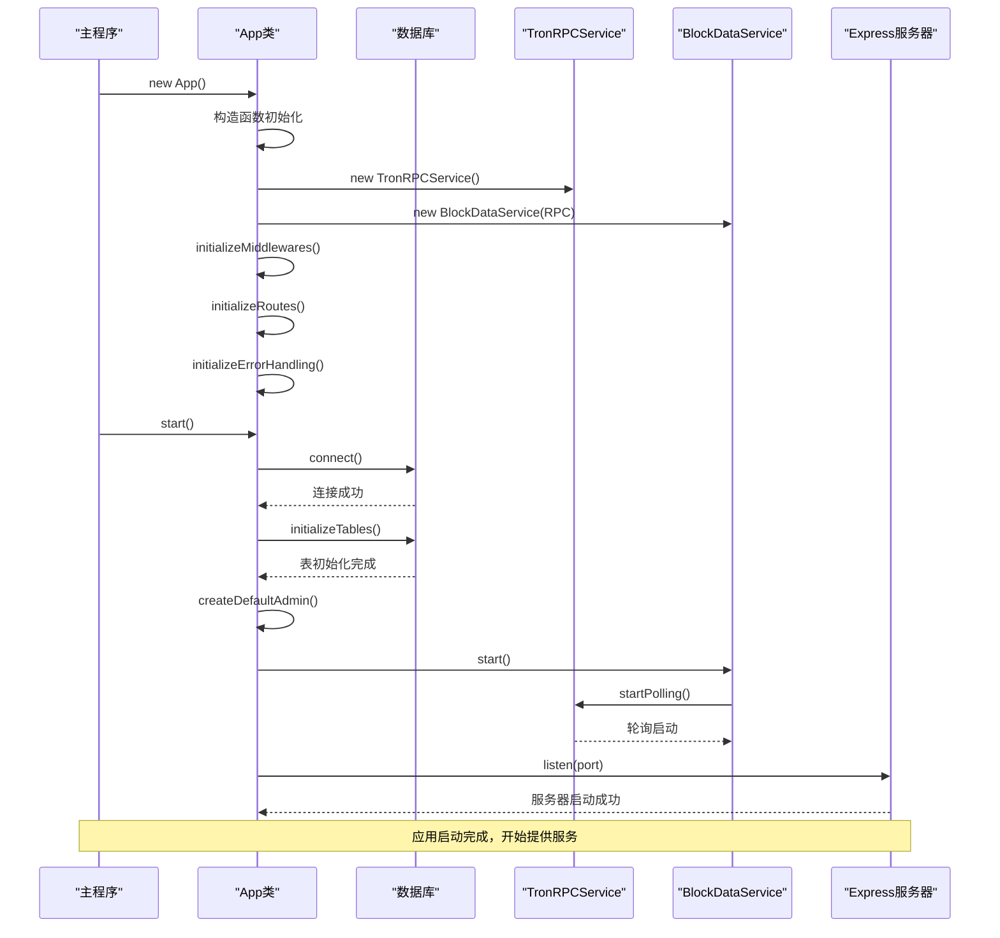
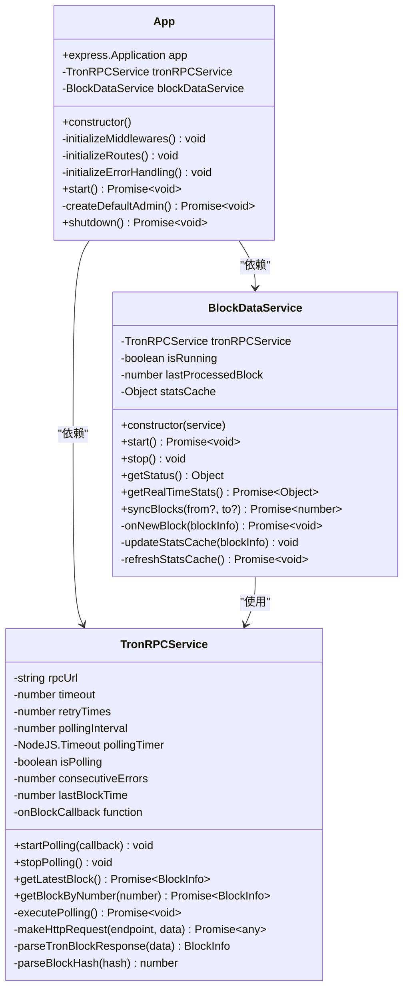
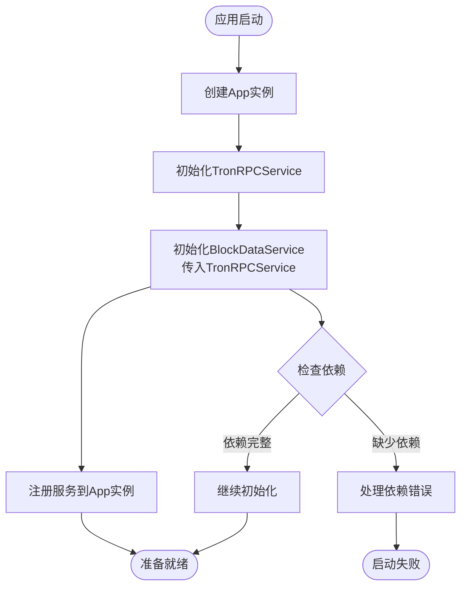
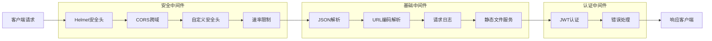
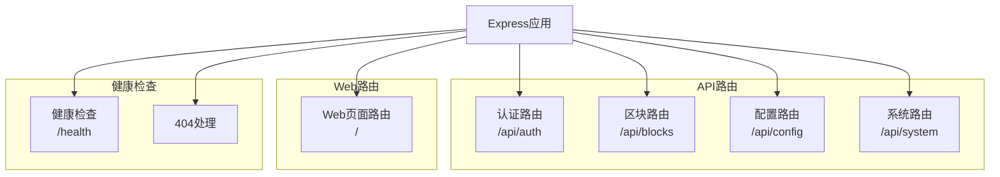
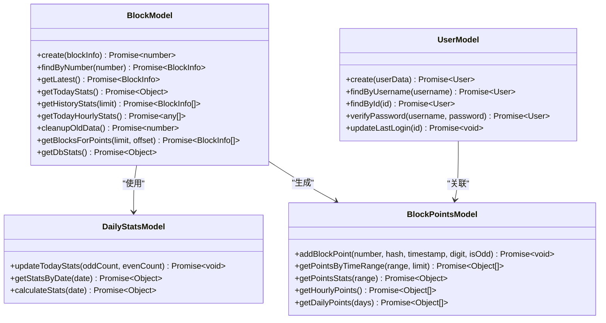
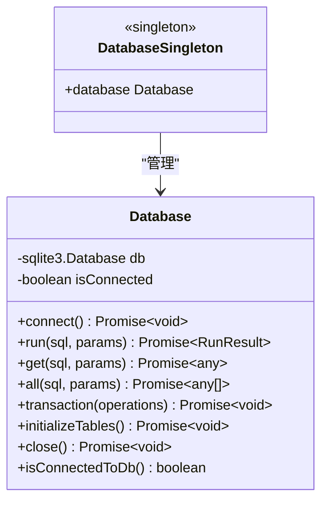
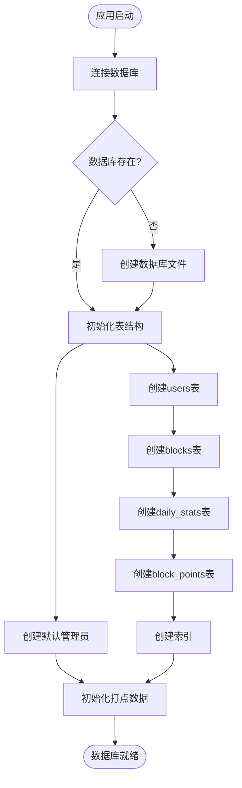

# Point-Tron 应用架构与扩展指南

<cite>
**本文档引用的文件**
- [src/index.ts](file://src/index.ts)
- [src/config/index.ts](file://src/config/index.ts)
- [src/services/TronRPCService.ts](file://src/services/TronRPCService.ts)
- [src/services/BlockDataService.ts](file://src/services/BlockDataService.ts)
- [src/middleware/auth.ts](file://src/middleware/auth.ts)
- [src/routes/auth.ts](file://src/routes/auth.ts)
- [src/routes/blocks.ts](file://src/routes/blocks.ts)
- [src/models/BlockModel.ts](file://src/models/BlockModel.ts)
- [src/database/index.ts](file://src/database/index.ts)
- [README.md](file://README.md)
</cite>

## 目录
1. [项目概述](#项目概述)
2. [应用启动流程](#应用启动流程)
3. [核心组件架构](#核心组件架构)
4. [依赖注入机制](#依赖注入机制)
5. [中间件系统](#中间件系统)
6. [路由系统](#路由系统)
7. [数据模型层](#数据模型层)
8. [数据库抽象层](#数据库抽象层)
9. [扩展开发指南](#扩展开发指南)
10. [最佳实践](#最佳实践)

## 项目概述

Point-Tron 是一个基于 TypeScript 和 Node.js 开发的波场网络区块链数据统计后台管理系统。该系统实时监控波场网络每 3 秒的出块情况，统计区块哈希最后一个阿拉伯数字的单双数规律，并提供可视化的数据分析界面。

### 核心特性

- **实时数据采集**：每 3 秒自动获取 TRON 网络最新区块数据
- **智能数据解析**：自动提取区块哈希最后数字并判断单双数
- **统计分析**：提供今日、历史数据统计和趋势分析
- **安全认证**：JWT 令牌认证和用户权限管理
- **错误处理**：完善的错误重试和异常处理机制

## 应用启动流程

### 启动序列图



**图表来源**
- [src/index.ts](file://src/index.ts#L1-L163)

### 启动阶段详解

应用启动分为以下几个关键阶段：

1. **实例化阶段**：创建 App 实例并初始化核心服务
2. **中间件配置阶段**：设置安全、认证和性能优化中间件
3. **路由注册阶段**：注册所有 API 和 Web 页面路由
4. **错误处理配置阶段**：设置全局错误处理机制
5. **服务启动阶段**：连接数据库、启动 RPC 轮询和启动 HTTP 服务器

**章节来源**
- [src/index.ts](file://src/index.ts#L1-L163)

## 核心组件架构

### 应用类结构



**图表来源**
- [src/index.ts](file://src/index.ts#L18-L25)
- [src/services/TronRPCService.ts](file://src/services/TronRPCService.ts#L15-L30)
- [src/services/BlockDataService.ts](file://src/services/BlockDataService.ts#L8-L20)

### 组件交互关系

应用采用依赖注入模式，通过构造函数传递依赖关系：

- **App 类**作为应用的主控制器，负责协调各个子系统的初始化
- **TronRPCService**负责与 TRON 网络的 RPC 通信，提供区块数据获取能力
- **BlockDataService**作为业务逻辑层，使用 TronRPCService 提供的数据进行处理和存储

**章节来源**
- [src/index.ts](file://src/index.ts#L18-L25)
- [src/services/TronRPCService.ts](file://src/services/TronRPCService.ts#L15-L30)
- [src/services/BlockDataService.ts](file://src/services/BlockDataService.ts#L8-L20)

## 依赖注入机制

### 构造函数注入

```typescript
constructor() {
  this.app = express();
  this.tronRPCService = new TronRPCService();
  this.blockDataService = new BlockDataService(this.tronRPCService);
}
```

### 注入流程图



**图表来源**
- [src/index.ts](file://src/index.ts#L22-L25)

### 依赖生命周期管理

- **TronRPCService**：在整个应用生命周期内保持活跃，持续监控 TRON 网络
- **BlockDataService**：依赖于 TronRPCService，负责数据处理和存储
- **数据库连接**：在应用启动时建立，在应用关闭时优雅断开

**章节来源**
- [src/index.ts](file://src/index.ts#L22-L25)

## 中间件系统

### 中间件架构



**图表来源**
- [src/index.ts](file://src/index.ts#L30-L45)
- [src/middleware/auth.ts](file://src/middleware/auth.ts#L1-L171)

### 安全中间件配置

#### Helmet 配置
```typescript
this.app.use(helmet({
  contentSecurityPolicy: false, // 为了支持EJS模板
}));
```

#### CORS 配置
```typescript
export const corsOptions = {
  origin: function (origin: string | undefined, callback: Function) {
    // 允许所有来源（开发环境）
    callback(null, true);
  },
  credentials: true,
  methods: ['GET', 'POST', 'PUT', 'DELETE', 'OPTIONS'],
  allowedHeaders: ['Content-Type', 'Authorization']
};
```

#### 速率限制配置
```typescript
this.app.use(rateLimit(200, 60000)); // 每分钟最多200个请求
```

### 中间件执行顺序

1. **安全中间件**：首先处理安全相关的头部设置和跨域配置
2. **基础中间件**：处理请求体解析和静态文件服务
3. **认证中间件**：验证用户身份和权限
4. **业务中间件**：处理具体的业务逻辑
5. **错误处理中间件**：捕获和处理所有未处理的异常

**章节来源**
- [src/index.ts](file://src/index.ts#L30-L45)
- [src/middleware/auth.ts](file://src/middleware/auth.ts#L80-L95)
- [src/middleware/auth.ts](file://src/middleware/auth.ts#L130-L171)

## 路由系统

### 路由架构



**图表来源**
- [src/index.ts](file://src/index.ts#L50-L65)

### 健康检查端点

```typescript
this.app.get('/health', (req, res) => {
  res.json({
    success: true,
    data: {
      status: 'healthy',
      timestamp: new Date().toISOString(),
      uptime: process.uptime(),
      database: database.isConnectedToDb(),
      rpcPolling: this.tronRPCService.getPollingStatus().isActive
    }
  });
});
```

### 健康检查返回字段说明

- **status**: 服务状态，固定为 'healthy'
- **timestamp**: 当前时间戳
- **uptime**: 应用运行时间（秒）
- **database**: 数据库连接状态
- **rpcPolling**: TRON RPC 轮询状态

**章节来源**
- [src/index.ts](file://src/index.ts#L60-L75)

## 数据模型层

### 数据模型架构



**图表来源**
- [src/models/BlockModel.ts](file://src/models/BlockModel.ts#L5-L170)

### 数据模型职责

- **BlockModel**: 负责区块数据的 CRUD 操作和统计查询
- **DailyStatsModel**: 负责每日统计数据的维护和查询
- **BlockPointsModel**: 负责区块打点计分系统的数据管理
- **UserModel**: 负责用户账户的管理

**章节来源**
- [src/models/BlockModel.ts](file://src/models/BlockModel.ts#L5-L170)

## 数据库抽象层

### 数据库连接架构



**图表来源**
- [src/database/index.ts](file://src/database/index.ts#L8-L249)

### 数据库初始化流程



**图表来源**
- [src/database/index.ts](file://src/database/index.ts#L100-L150)

**章节来源**
- [src/database/index.ts](file://src/database/index.ts#L8-L249)

## 扩展开发指南

### MVC 架构模式

#### 1. 控制器（路由层）

在 `src/routes/` 目录下添加新的路由文件：

```typescript
// src/routes/newFeature.ts
import express from 'express';
import { NewService } from '../services/NewService';
import { authenticateToken } from '../middleware/auth';

const router = express.Router();

router.get('/data', authenticateToken, async (req, res) => {
  try {
    const service = new NewService();
    const data = await service.getData();
    res.json({ success: true, data });
  } catch (error) {
    res.status(500).json({ success: false, error: '服务器错误' });
  }
});

export default router;
```

#### 2. 服务层

在 `src/services/` 目录下实现业务逻辑：

```typescript
// src/services/NewService.ts
import { SomeModel } from '../models/SomeModel';

export class NewService {
  async getData(): Promise<any> {
    // 实现业务逻辑
    return await SomeModel.getAll();
  }
}
```

#### 3. 模型层

在 `src/models/` 目录下定义数据访问方法：

```typescript
// src/models/SomeModel.ts
import { database } from '../database';

export class SomeModel {
  static async getAll(): Promise<any[]> {
    return await database.all('SELECT * FROM some_table');
  }
}
```

#### 4. 注册新路由

在 `src/index.ts` 中注册新路由：

```typescript
// 导入新路由
import newFeatureRoutes from './routes/newFeature';

// 在 initializeRoutes 方法中注册
private initializeRoutes(): void {
  // ...其他路由
  this.app.use('/api/new-feature', newFeatureRoutes);
}
```

### 扩展开发步骤

1. **需求分析**：明确功能需求和数据流
2. **路由设计**：设计 API 接口和路由路径
3. **服务实现**：实现业务逻辑和服务层
4. **模型定义**：定义数据访问方法和数据库操作
5. **中间件集成**：添加必要的认证和安全中间件
6. **错误处理**：实现完善的错误处理机制
7. **测试验证**：编写单元测试和集成测试

### 新功能开发示例

假设要添加用户积分系统：

1. **创建新模型**：
```typescript
// src/models/UserPointsModel.ts
export class UserPointsModel {
  static async getUserPoints(userId: number): Promise<number> {
    const result = await database.get(
      'SELECT points FROM user_points WHERE user_id = ?',
      [userId]
    );
    return result?.points || 0;
  }
}
```

2. **创建服务**：
```typescript
// src/services/UserPointsService.ts
export class UserPointsService {
  async updateUserPoints(userId: number, change: number): Promise<void> {
    await UserPointsModel.updatePoints(userId, change);
  }
}
```

3. **添加路由**：
```typescript
// src/routes/user.ts
router.get('/points/:userId', authenticateToken, async (req, res) => {
  const userId = parseInt(req.params.userId);
  const points = await UserPointsService.getUserPoints(userId);
  res.json({ success: true, data: { points } });
});
```

## 最佳实践

### 代码组织原则

1. **单一职责**：每个类和方法只负责一个功能
2. **依赖倒置**：高层模块不依赖低层模块，都依赖抽象
3. **开放封闭**：对扩展开放，对修改封闭
4. **里氏替换**：子类可以替换父类而不影响程序正确性

### 错误处理策略

```typescript
// 统一错误处理中间件
export const errorHandler = (
  error: Error,
  req: Request,
  res: Response<ApiResponse>,
  next: NextFunction
): void => {
  console.error('未处理的错误:', error);
  
  // 根据错误类型返回不同状态码
  if (error.message.includes('SQLITE')) {
    res.status(500).json({ success: false, error: '数据库操作失败' });
    return;
  }
  
  res.status(500).json({ success: false, error: '服务器内部错误' });
};
```

### 性能优化建议

1. **数据库索引**：为常用查询字段创建索引
2. **缓存策略**：对频繁访问的数据实施缓存
3. **异步处理**：使用异步操作避免阻塞主线程
4. **资源清理**：及时释放不再使用的资源

### 安全考虑

1. **输入验证**：对所有用户输入进行验证和过滤
2. **SQL注入防护**：使用参数化查询防止 SQL 注入
3. **XSS防护**：对输出内容进行适当的转义
4. **CSRF防护**：实施 CSRF 令牌验证
5. **CORS配置**：合理配置跨域资源共享策略

### 监控和日志

```typescript
// 请求日志中间件
export const requestLogger = (req: Request, res: Response, next: NextFunction): void => {
  const start = Date.now();
  
  res.on('finish', () => {
    const duration = Date.now() - start;
    console.log(`${req.method} ${req.path} - ${res.statusCode} - ${duration}ms - ${req.ip}`);
  });
  
  next();
};
```

**章节来源**
- [src/middleware/auth.ts](file://src/middleware/auth.ts#L85-L95)

## 结论

Point-Tron 项目展示了现代 Node.js 应用的最佳实践，包括：

- **清晰的架构分层**：MVC 模式和依赖注入的应用
- **完善的中间件系统**：安全、认证和性能优化
- **健壮的错误处理**：统一的错误处理机制
- **灵活的扩展性**：遵循 SOLID 原则的设计
- **全面的监控**：详细的日志记录和健康检查

开发者可以基于这个架构快速扩展新功能，同时保持代码的可维护性和可扩展性。通过遵循本文档提供的开发指南和最佳实践，可以确保新功能的质量和一致性。