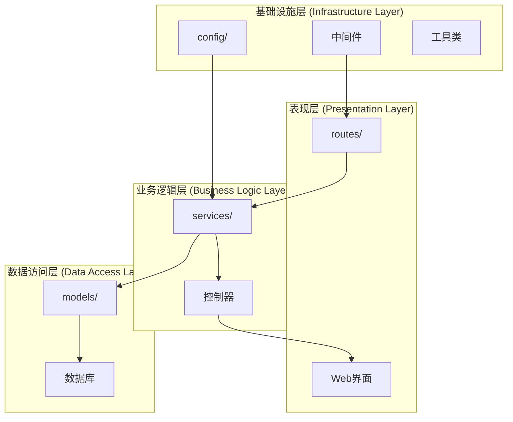

# 功能扩展开发模式

<cite>
**本文档引用的文件**
- [src/index.ts](file://src/index.ts)
- [src/services/TronRPCService.ts](file://src/services/TronRPCService.ts)
- [src/services/BlockDataService.ts](file://src/services/BlockDataService.ts)
- [src/services/AuthService.ts](file://src/services/AuthService.ts)
- [src/routes/blocks.ts](file://src/routes/blocks.ts)
- [src/routes/auth.ts](file://src/routes/auth.ts)
- [src/models/types.ts](file://src/models/types.ts)
- [src/models/BlockModel.ts](file://src/models/BlockModel.ts)
- [src/config/index.ts](file://src/config/index.ts)
- [src/database/index.ts](file://src/database/index.ts)
</cite>

## 目录
1. [简介](#简介)
2. [项目架构概览](#项目架构概览)
3. [MVC架构扩展原则](#mvc架构扩展原则)
4. [新增功能开发流程](#新增功能开发流程)
5. [交易分析功能示例](#交易分析功能示例)
6. [依赖注入与服务集成](#依赖注入与服务集成)
7. [最佳实践与注意事项](#最佳实践与注意事项)
8. [故障排除指南](#故障排除指南)
9. [总结](#总结)

## 简介

本文档详细介绍了如何在Point-Tron项目中遵循MVC架构模式扩展新功能的标准流程。该项目采用TypeScript构建，基于Express框架，实现了TRON区块链的区块数据分析和管理系统。通过遵循本文档提供的开发模式，开发者可以确保新功能与现有系统的无缝集成，并保持代码的一致性和可维护性。

## 项目架构概览

Point-Tron项目采用了清晰的分层架构设计，主要包含以下核心组件：



**图表来源**
- [src/index.ts](file://src/index.ts#L1-L163)
- [src/routes/blocks.ts](file://src/routes/blocks.ts#L1-L141)
- [src/services/BlockDataService.ts](file://src/services/BlockDataService.ts#L1-L273)

**章节来源**
- [src/index.ts](file://src/index.ts#L1-L163)
- [src/config/index.ts](file://src/config/index.ts#L1-L52)

## MVC架构扩展原则

### 1. 分层设计原则

Point-Tron严格遵循MVC（Model-View-Controller）架构模式，每一层都有明确的职责分工：

- **Model层**：负责数据结构定义和数据库操作
- **View层**：负责用户界面展示（本项目主要通过API提供数据）
- **Controller层**：负责业务逻辑处理和路由控制

### 2. 依赖注入原则

项目采用构造函数注入的方式管理服务依赖关系，确保松耦合的设计：

```typescript
// 应用类中的依赖注入示例
constructor() {
  this.app = express();
  this.tronRPCService = new TronRPCService();
  this.blockDataService = new BlockDataService(this.tronRPCService);
  
  this.initializeMiddlewares();
  this.initializeRoutes();
  this.initializeErrorHandling();
}
```

### 3. 异步初始化原则

所有服务都需要按照正确的顺序进行异步初始化，确保系统启动的稳定性：

```typescript
public async start(): Promise<void> {
  try {
    // 初始化数据库
    await database.connect();
    await database.initializeTables();
    
    // 创建默认管理员账户
    await this.createDefaultAdmin();
    
    // 启动TRON区块数据采集
    await this.blockDataService.start();
    
    // 启动Express服务器
    this.app.listen(config.port, () => {
      console.log(`🚀 Point-Tron服务器启动成功`);
    });
    
  } catch (error) {
    console.error('应用启动失败:', error);
    process.exit(1);
  }
}
```

**章节来源**
- [src/index.ts](file://src/index.ts#L20-L163)

## 新增功能开发流程

### 第一步：创建路由模块

在`src/routes/`目录下创建新的路由文件，例如`transactions.ts`：

```typescript
import express from 'express';
import { TransactionModel } from '../models/TransactionModel';
import { TransactionService } from '../services/TransactionService';
import { ApiResponse } from '../models/types';
import { authenticateToken } from '../middleware/auth';

const router = express.Router();

// 获取交易统计数据
router.get('/stats', authenticateToken, async (req, res: express.Response<ApiResponse>) => {
  try {
    const stats = await TransactionService.getStats();
    res.json({
      success: true,
      data: stats
    });
  } catch (error) {
    res.status(500).json({
      success: false,
      error: '服务器内部错误'
    });
  }
});

export default router;
```

### 第二步：实现业务服务类

在`src/services/`目录下创建业务服务类：

```typescript
import { TransactionModel } from '../models/TransactionModel';
import { TransactionStats } from '../models/types';

export class TransactionService {
  // 获取交易统计信息
  static async getStats(): Promise<TransactionStats> {
    try {
      const [dailyStats, monthlyStats, yearlyStats] = await Promise.all([
        TransactionModel.getDailyStats(),
        TransactionModel.getMonthlyStats(),
        TransactionModel.getYearlyStats()
      ]);

      return {
        daily: dailyStats,
        monthly: monthlyStats,
        yearly: yearlyStats
      };
    } catch (error) {
      console.error('获取交易统计失败:', error);
      throw error;
    }
  }

  // 分析交易模式
  static async analyzePatterns(): Promise<any> {
    // 实现交易模式分析逻辑
    return {};
  }
}
```

### 第三步：定义数据访问模型

在`src/models/`目录下创建数据访问模型：

```typescript
import { database } from '../database';
import { TransactionStats } from './types';

export class TransactionModel {
  // 获取日交易统计
  static async getDailyStats(): Promise<any> {
    const today = new Date().toISOString().split('T')[0];
    const result = await database.get(
      `SELECT 
        COUNT(*) as total,
        SUM(amount) as volume,
        AVG(amount) as average
       FROM transactions 
       WHERE date(created_at) = ?`,
      [today]
    );

    return result || {};
  }

  // 获取月交易统计
  static async getMonthlyStats(): Promise<any> {
    const month = new Date().toISOString().split('-')[0] + '-' + new Date().toISOString().split('-')[1];
    const result = await database.get(
      `SELECT 
        COUNT(*) as total,
        SUM(amount) as volume,
        AVG(amount) as average
       FROM transactions 
       WHERE strftime('%Y-%m', created_at) = ?`,
      [month]
    );

    return result || {};
  }

  // 获取年交易统计
  static async getYearlyStats(): Promise<any> {
    const year = new Date().getFullYear().toString();
    const result = await database.get(
      `SELECT 
        COUNT(*) as total,
        SUM(amount) as volume,
        AVG(amount) as average
       FROM transactions 
       WHERE strftime('%Y', created_at) = ?`,
      [year]
    );

    return result || {};
  }
}
```

### 第四步：更新类型定义

在`src/models/types.ts`中添加新的类型定义：

```typescript
// 交易统计接口
export interface TransactionStats {
  daily: {
    total: number;
    volume: number;
    average: number;
  };
  monthly: {
    total: number;
    volume: number;
    average: number;
  };
  yearly: {
    total: number;
    volume: number;
    average: number;
  };
}
```

**章节来源**
- [src/routes/blocks.ts](file://src/routes/blocks.ts#L1-L141)
- [src/services/BlockDataService.ts](file://src/services/BlockDataService.ts#L1-L273)
- [src/models/BlockModel.ts](file://src/models/BlockModel.ts#L1-L170)

## 交易分析功能示例

让我们以新增"交易分析"功能为例，演示从路由定义到服务注册的完整代码示例：

### 1. 路由定义 (src/routes/transactions.ts)

```typescript
import express from 'express';
import { TransactionModel } from '../models/TransactionModel';
import { TransactionService } from '../services/TransactionService';
import { ApiResponse } from '../models/types';
import { authenticateToken } from '../middleware/auth';

const router = express.Router();

// 获取交易统计数据
router.get('/stats', authenticateToken, async (req, res: express.Response<ApiResponse>) => {
  try {
    const stats = await TransactionService.getStats();
    res.json({
      success: true,
      data: stats
    });
  } catch (error) {
    res.status(500).json({
      success: false,
      error: '服务器内部错误'
    });
  }
});

// 获取交易模式分析
router.get('/patterns', authenticateToken, async (req, res: express.Response<ApiResponse>) => {
  try {
    const patterns = await TransactionService.analyzePatterns();
    res.json({
      success: true,
      data: patterns
    });
  } catch (error) {
    res.status(500).json({
      success: false,
      error: '服务器内部错误'
    });
  }
});

export default router;
```

### 2. 业务服务类 (src/services/TransactionService.ts)

```typescript
import { TransactionModel } from '../models/TransactionModel';
import { TransactionStats } from '../models/types';

export class TransactionService {
  // 获取交易统计信息
  static async getStats(): Promise<TransactionStats> {
    try {
      const [dailyStats, monthlyStats, yearlyStats] = await Promise.all([
        TransactionModel.getDailyStats(),
        TransactionModel.getMonthlyStats(),
        TransactionModel.getYearlyStats()
      ]);

      return {
        daily: dailyStats,
        monthly: monthlyStats,
        yearly: yearlyStats
      };
    } catch (error) {
      console.error('获取交易统计失败:', error);
      throw error;
    }
  }

  // 分析交易模式
  static async analyzePatterns(): Promise<any> {
    try {
      // 获取最近1000笔交易
      const recentTransactions = await TransactionModel.getRecentTransactions(1000);
      
      // 计算交易频率分布
      const frequencyDistribution = this.calculateFrequencyDistribution(recentTransactions);
      
      // 分析金额分布
      const amountDistribution = this.calculateAmountDistribution(recentTransactions);
      
      // 检测异常交易
      const anomalies = this.detectAnomalies(recentTransactions);
      
      return {
        frequencyDistribution,
        amountDistribution,
        anomalies,
        timestamp: Date.now()
      };
    } catch (error) {
      console.error('交易模式分析失败:', error);
      throw error;
    }
  }

  private static calculateFrequencyDistribution(transactions: any[]): any {
    // 实现频率分布计算逻辑
    return {};
  }

  private static calculateAmountDistribution(transactions: any[]): any {
    // 实现金额分布计算逻辑
    return {};
  }

  private static detectAnomalies(transactions: any[]): any[] {
    // 实现异常检测逻辑
    return [];
  }
}
```

### 3. 数据访问模型 (src/models/TransactionModel.ts)

```typescript
import { database } from '../database';
import { TransactionStats } from './types';

export class TransactionModel {
  // 获取日交易统计
  static async getDailyStats(): Promise<any> {
    const today = new Date().toISOString().split('T')[0];
    const result = await database.get(
      `SELECT 
        COUNT(*) as total,
        SUM(amount) as volume,
        AVG(amount) as average,
        MAX(amount) as max,
        MIN(amount) as min
       FROM transactions 
       WHERE date(created_at) = ?`,
      [today]
    );

    return result || {};
  }

  // 获取月交易统计
  static async getMonthlyStats(): Promise<any> {
    const month = new Date().toISOString().split('-')[0] + '-' + new Date().toISOString().split('-')[1];
    const result = await database.get(
      `SELECT 
        COUNT(*) as total,
        SUM(amount) as volume,
        AVG(amount) as average,
        MAX(amount) as max,
        MIN(amount) as min
       FROM transactions 
       WHERE strftime('%Y-%m', created_at) = ?`,
      [month]
    );

    return result || {};
  }

  // 获取年交易统计
  static async getYearlyStats(): Promise<any> {
    const year = new Date().getFullYear().toString();
    const result = await database.get(
      `SELECT 
        COUNT(*) as total,
        SUM(amount) as volume,
        AVG(amount) as average,
        MAX(amount) as max,
        MIN(amount) as min
       FROM transactions 
       WHERE strftime('%Y', created_at) = ?`,
      [year]
    );

    return result || {};
  }

  // 获取最近交易记录
  static async getRecentTransactions(limit: number = 100): Promise<any[]> {
    const results = await database.all(
      `SELECT * FROM transactions 
       ORDER BY created_at DESC 
       LIMIT ?`,
      [limit]
    );

    return results;
  }
}
```

### 4. 类型定义更新 (src/models/types.ts)

```typescript
// 交易统计接口
export interface TransactionStats {
  daily: {
    total: number;
    volume: number;
    average: number;
    max: number;
    min: number;
  };
  monthly: {
    total: number;
    volume: number;
    average: number;
    max: number;
    min: number;
  };
  yearly: {
    total: number;
    volume: number;
    average: number;
    max: number;
    min: number;
  };
}

// 交易接口
export interface Transaction {
  id?: number;
  tx_hash: string;
  from_address: string;
  to_address: string;
  amount: number;
  fee: number;
  timestamp: number;
  created_at?: string;
}
```

### 5. 数据库迁移脚本

```sql
-- 添加交易表
CREATE TABLE IF NOT EXISTS transactions (
  id INTEGER PRIMARY KEY AUTOINCREMENT,
  tx_hash VARCHAR(66) UNIQUE NOT NULL,
  from_address VARCHAR(64) NOT NULL,
  to_address VARCHAR(64) NOT NULL,
  amount DECIMAL(20, 8) NOT NULL,
  fee DECIMAL(20, 8) NOT NULL,
  timestamp BIGINT NOT NULL,
  created_at TIMESTAMP DEFAULT CURRENT_TIMESTAMP
);

-- 创建索引
CREATE INDEX IF NOT EXISTS idx_transactions_hash ON transactions(tx_hash);
CREATE INDEX IF NOT EXISTS idx_transactions_from ON transactions(from_address);
CREATE INDEX IF NOT EXISTS idx_transactions_to ON transactions(to_address);
CREATE INDEX IF NOT EXISTS idx_transactions_timestamp ON transactions(timestamp);
```

**章节来源**
- [src/routes/blocks.ts](file://src/routes/blocks.ts#L1-L141)
- [src/services/BlockDataService.ts](file://src/services/BlockDataService.ts#L1-L273)
- [src/models/BlockModel.ts](file://src/models/BlockModel.ts#L1-L170)

## 依赖注入与服务集成

### 在App类中集成新服务

在`src/index.ts`中，我们需要按照以下步骤集成新的交易分析服务：

#### 1. 导入新服务

```typescript
import { TransactionService } from './services/TransactionService';
```

#### 2. 声明私有属性

```typescript
class App {
  public app: express.Application;
  private tronRPCService: TronRPCService;
  private blockDataService: BlockDataService;
  private transactionService: TransactionService; // 新增服务属性
```

#### 3. 构造函数实例化

```typescript
constructor() {
  this.app = express();
  this.tronRPCService = new TronRPCService();
  this.blockDataService = new BlockDataService(this.tronRPCService);
  this.transactionService = new TransactionService(); // 实例化新服务
  
  this.initializeMiddlewares();
  this.initializeRoutes();
  this.initializeErrorHandling();
}
```

#### 4. 在start方法中启动服务

```typescript
public async start(): Promise<void> {
  try {
    // 初始化数据库
    await database.connect();
    await database.initializeTables();
    
    // 创建默认管理员账户
    await this.createDefaultAdmin();
    
    // 启动TRON区块数据采集
    await this.blockDataService.start();
    
    // 启动交易分析服务
    await this.transactionService.start(); // 如果需要异步初始化
    
    // 启动Express服务器
    this.app.listen(config.port, () => {
      console.log(`🚀 Point-Tron服务器启动成功`);
      console.log(`📡 服务地址: http://localhost:${config.port}`);
      console.log(`🔗 TRON网络: ${config.tron.rpcUrl}`);
      console.log(`⏰ 轮询间隔: ${config.tron.pollingInterval}ms`);
      console.log(`📊 后台管理: http://localhost:${config.port}/admin`);
    });
    
  } catch (error) {
    console.error('应用启动失败:', error);
    process.exit(1);
  }
}
```

### 服务启动模式

根据服务的不同特性，可以选择不同的启动模式：

#### 异步初始化服务

对于需要异步初始化的服务（如数据库连接、远程API调用等）：

```typescript
// 在服务类中添加start方法
export class TransactionService {
  private isRunning: boolean = false;
  
  public async start(): Promise<void> {
    if (this.isRunning) {
      console.warn('交易分析服务已在运行中');
      return;
    }
    
    try {
      // 执行异步初始化逻辑
      await this.initializeResources();
      
      this.isRunning = true;
      console.log('✅ 交易分析服务已启动');
    } catch (error) {
      console.error('启动交易分析服务失败:', error);
      throw error;
    }
  }
  
  private async initializeResources(): Promise<void> {
    // 实现资源初始化逻辑
  }
}
```

#### 后台任务服务

对于需要持续运行的后台任务服务：

```typescript
export class TransactionService {
  private pollingTimer: NodeJS.Timeout | null = null;
  
  public startPolling(): void {
    if (this.pollingTimer) {
      console.warn('交易分析轮询已在运行中');
      return;
    }
    
    console.log('开始交易分析轮询');
    
    // 立即执行一次
    this.executePolling();
    
    // 设置定时器
    this.pollingTimer = setInterval(() => {
      this.executePolling();
    }, config.transaction.pollingInterval);
  }
  
  private async executePolling(): Promise<void> {
    try {
      // 执行轮询逻辑
      await this.analyzeTransactions();
    } catch (error) {
      console.error('交易分析轮询错误:', error);
    }
  }
  
  public stopPolling(): void {
    if (this.pollingTimer) {
      clearInterval(this.pollingTimer);
      this.pollingTimer = null;
    }
    console.log('交易分析轮询已停止');
  }
}
```

**章节来源**
- [src/index.ts](file://src/index.ts#L20-L163)
- [src/services/TronRPCService.ts](file://src/services/TronRPCService.ts#L1-L258)

## 最佳实践与注意事项

### 1. 类型导入路径

确保使用正确的相对路径导入类型：

```typescript
// 正确的导入方式
import { Transaction } from '../models/types';
import { ApiResponse } from '../models/types';

// 错误的导入方式
import { Transaction } from '../../models/types'; // 不要使用过多的../
```

### 2. 异步初始化顺序

严格按照依赖关系进行异步初始化：

```typescript
// 正确的初始化顺序
public async start(): Promise<void> {
  try {
    // 1. 连接数据库
    await database.connect();
    
    // 2. 初始化数据库表
    await database.initializeTables();
    
    // 3. 创建默认管理员账户
    await this.createDefaultAdmin();
    
    // 4. 启动依赖的服务
    await this.blockDataService.start();
    
    // 5. 启动当前服务
    await this.transactionService.start();
    
    // 6. 启动主服务器
    this.app.listen(config.port, () => {
      console.log('服务器启动成功');
    });
    
  } catch (error) {
    console.error('启动失败:', error);
    process.exit(1);
  }
}
```

### 3. 错误边界处理

在每个层级都要实现适当的错误处理：

```typescript
// 路由层错误处理
router.get('/stats', authenticateToken, async (req, res: express.Response<ApiResponse>) => {
  try {
    const stats = await TransactionService.getStats();
    res.json({
      success: true,
      data: stats
    });
  } catch (error) {
    console.error('获取交易统计错误:', error);
    res.status(500).json({
      success: false,
      error: '服务器内部错误'
    });
  }
});

// 服务层错误处理
static async getStats(): Promise<TransactionStats> {
  try {
    const [dailyStats, monthlyStats, yearlyStats] = await Promise.all([
      TransactionModel.getDailyStats(),
      TransactionModel.getMonthlyStats(),
      TransactionModel.getYearlyStats()
    ]);

    return {
      daily: dailyStats,
      monthly: monthlyStats,
      yearly: yearlyStats
    };
  } catch (error) {
    console.error('获取交易统计失败:', error);
    throw new Error('无法获取交易统计信息');
  }
}
```

### 4. 资源清理

实现适当的资源清理机制：

```typescript
public async shutdown(): Promise<void> {
  console.log('正在关闭应用...');
  
  // 停止TRON数据采集
  this.blockDataService.stop();
  
  // 停止交易分析服务
  this.transactionService.stop();
  
  // 关闭数据库连接
  await database.close();
  
  console.log('应用已安全关闭');
  process.exit(0);
}
```

### 5. 日志记录

在关键操作点添加详细的日志记录：

```typescript
// 在服务启动时记录详细信息
console.log(`开始TRON RPC轮询，间隔: ${this.pollingInterval}ms`);

// 在关键业务操作时记录状态
console.log(`📦 处理新区块: ${blockInfo.block_number}, 哈希末位数字: ${blockInfo.last_digit} (${blockInfo.is_odd ? '单' : '双'}数)`);

// 在错误发生时记录详细信息
console.error(`处理区块 ${blockInfo.block_number} 失败:`, error);
```

### 6. 配置管理

使用统一的配置管理方式：

```typescript
// 在config/index.ts中添加新配置
interface Config {
  // ... 现有配置
  transaction: {
    pollingInterval: number;
    batchSize: number;
    maxRetries: number;
  };
}

const config: Config = {
  // ... 现有配置
  transaction: {
    pollingInterval: parseInt(process.env.TRANSACTION_POLLING_INTERVAL || '60000', 10),
    batchSize: parseInt(process.env.TRANSACTION_BATCH_SIZE || '100', 10),
    maxRetries: parseInt(process.env.TRANSACTION_MAX_RETRIES || '3', 10),
  },
};
```

**章节来源**
- [src/index.ts](file://src/index.ts#L120-L163)
- [src/config/index.ts](file://src/config/index.ts#L1-L52)

## 故障排除指南

### 常见问题及解决方案

#### 1. 服务启动失败

**问题描述**：新添加的服务无法正常启动

**排查步骤**：
1. 检查服务类的构造函数是否有参数依赖
2. 确认依赖的服务是否已经正确初始化
3. 查看服务的start()方法实现
4. 检查数据库连接状态

**解决方案**：
```typescript
// 确保在App类中正确初始化服务
constructor() {
  // ... 其他初始化
  
  // 确保依赖的服务已经初始化
  if (!this.blockDataService) {
    throw new Error('BlockDataService未初始化');
  }
  
  this.transactionService = new TransactionService(this.blockDataService);
}
```

#### 2. 路由无法访问

**问题描述**：新添加的路由无法被访问

**排查步骤**：
1. 检查路由文件是否正确导出default
2. 确认在index.ts中正确导入路由
3. 检查路由前缀是否正确
4. 确认中间件认证是否正常工作

**解决方案**：
```typescript
// 确保路由文件正确导出
export default router;

// 确保在index.ts中正确导入
import transactionRoutes from './routes/transactions';

// 确保在initializeRoutes中正确注册
this.app.use('/api/transactions', transactionRoutes);
```

#### 3. 数据库表不存在

**问题描述**：服务访问数据库时报错，提示表不存在

**排查步骤**：
1. 检查数据库初始化脚本
2. 确认表名拼写正确
3. 检查索引是否正确创建
4. 确认数据库连接状态

**解决方案**：
```typescript
// 在database/index.ts中添加表初始化
await this.run(`
  CREATE TABLE IF NOT EXISTS transactions (
    id INTEGER PRIMARY KEY AUTOINCREMENT,
    tx_hash VARCHAR(66) UNIQUE NOT NULL,
    from_address VARCHAR(64) NOT NULL,
    to_address VARCHAR(64) NOT NULL,
    amount DECIMAL(20, 8) NOT NULL,
    fee DECIMAL(20, 8) NOT NULL,
    timestamp BIGINT NOT NULL,
    created_at TIMESTAMP DEFAULT CURRENT_TIMESTAMP
  )
`);
```

#### 4. 内存泄漏

**问题描述**：长时间运行后内存占用持续增长

**排查步骤**：
1. 检查定时器是否正确清理
2. 确认事件监听器是否正确移除
3. 检查循环引用
4. 使用内存分析工具

**解决方案**：
```typescript
// 在服务类中添加清理方法
public stop(): void {
  if (this.pollingTimer) {
    clearInterval(this.pollingTimer);
    this.pollingTimer = null;
  }
  
  // 清理其他资源
  this.clearEventListeners();
  this.releaseMemory();
}
```

### 调试技巧

#### 1. 启用详细日志

```typescript
// 在开发环境中启用详细日志
if (process.env.NODE_ENV === 'development') {
  console.log('详细调试信息:', {
    serviceStatus: this.getStatus(),
    memoryUsage: process.memoryUsage(),
    uptime: process.uptime()
  });
}
```

#### 2. 使用断点调试

```typescript
// 在关键位置添加断点
public async start(): Promise<void> {
  debugger; // 添加断点
  try {
    // ... 业务逻辑
  } catch (error) {
    debugger; // 添加错误断点
    throw error;
  }
}
```

#### 3. 性能监控

```typescript
// 添加性能监控
const startTime = Date.now();
try {
  const result = await this.performOperation();
  const endTime = Date.now();
  console.log(`操作耗时: ${endTime - startTime}ms`);
  return result;
} catch (error) {
  console.error(`操作失败，耗时: ${Date.now() - startTime}ms`);
  throw error;
}
```

**章节来源**
- [src/index.ts](file://src/index.ts#L120-L163)
- [src/database/index.ts](file://src/database/index.ts#L1-L249)

## 总结

通过本文档介绍的功能扩展开发模式，开发者可以：

1. **遵循MVC架构**：严格按照Model-View-Controller分层设计原则
2. **实现依赖注入**：通过构造函数注入管理服务依赖关系
3. **保证异步初始化顺序**：按照正确的依赖关系进行异步初始化
4. **实现错误边界处理**：在每个层级都实现适当的错误处理机制
5. **确保资源清理**：实现适当的资源清理和优雅关闭机制

通过遵循这些最佳实践，新功能能够与Point-Tron的核心系统无缝集成，保持代码的一致性和可维护性。同时，完善的错误处理和日志记录机制确保了系统的稳定性和可调试性。

在实际开发过程中，建议开发者始终参考项目现有的代码风格和架构模式，确保新功能与现有系统的兼容性。定期进行代码审查和性能测试，及时发现和解决潜在的问题。