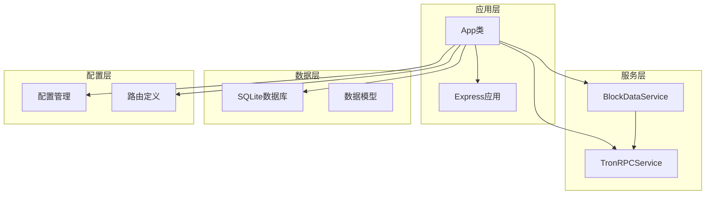
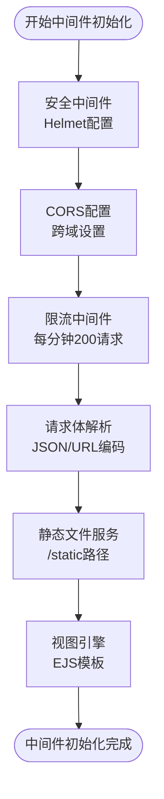
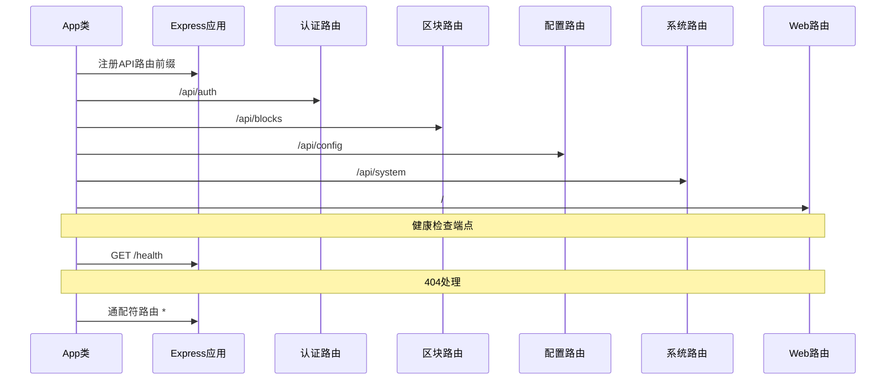
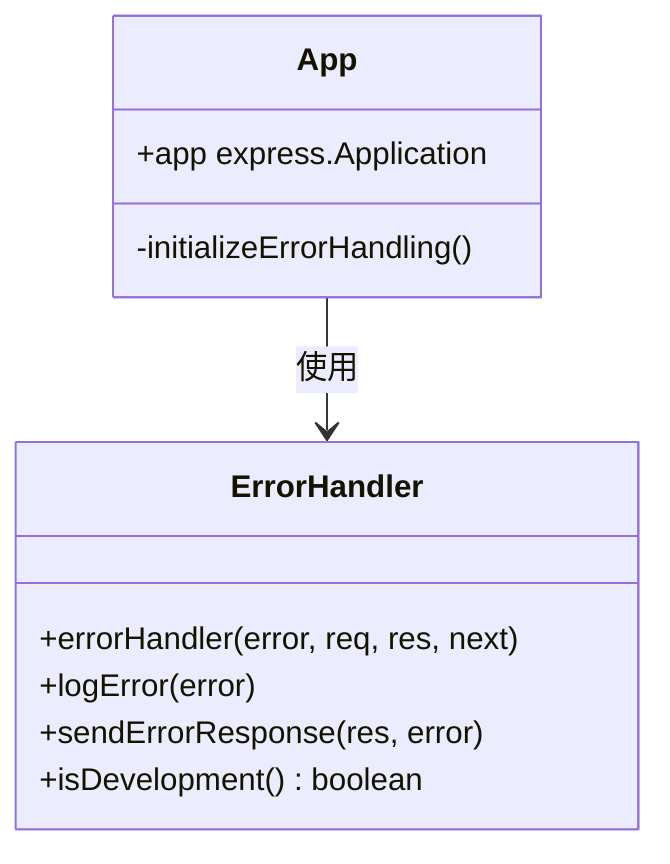
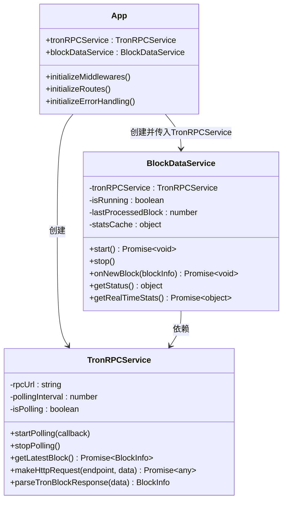
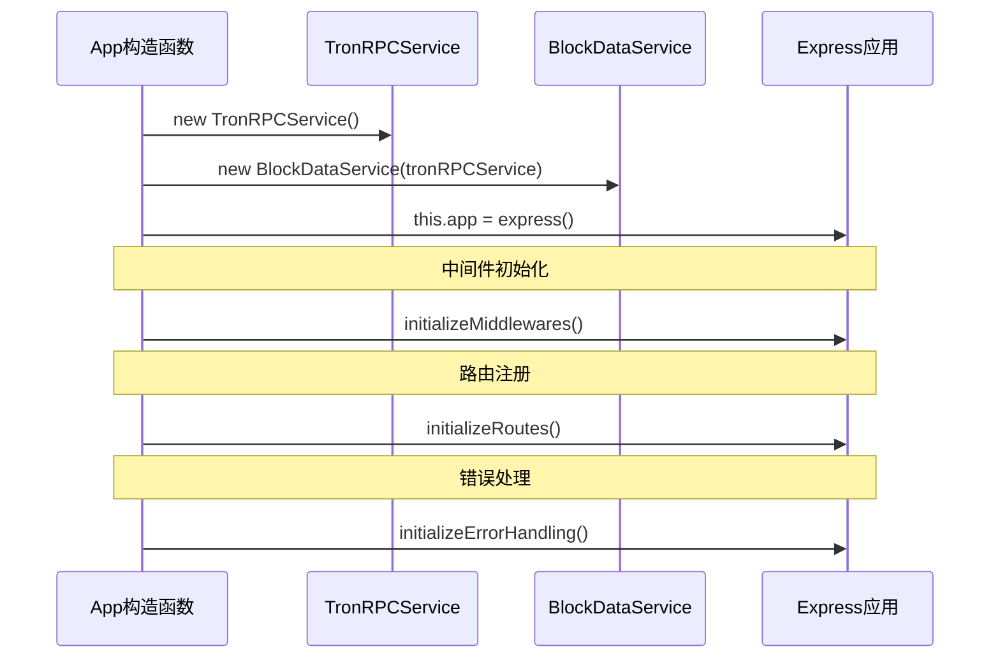
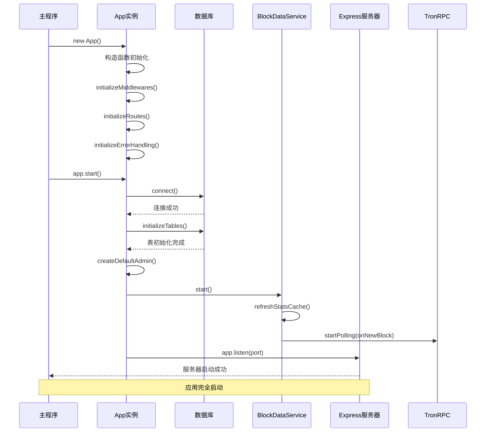
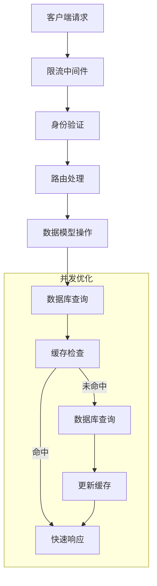

# 应用初始化流程

<cite>
**本文档引用的文件**
- [src/index.ts](file://src/index.ts)
- [src/services/TronRPCService.ts](file://src/services/TronRPCService.ts)
- [src/services/BlockDataService.ts](file://src/services/BlockDataService.ts)
- [src/config/index.ts](file://src/config/index.ts)
- [src/database/index.ts](file://src/database/index.ts)
- [src/models/types.ts](file://src/models/types.ts)
</cite>

## 目录
1. [简介](#简介)
2. [项目结构概览](#项目结构概览)
3. [App类构造函数分析](#app类构造函数分析)
4. [组件初始化阶段](#组件初始化阶段)
5. [服务依赖关系](#服务依赖关系)
6. [启动时序图](#启动时序图)
7. [初始化故障排除](#初始化故障排除)
8. [性能考虑](#性能考虑)
9. [总结](#总结)

## 简介

本文档详细分析了Point-Tron应用的初始化流程，重点关注App类构造函数的执行过程、Express应用实例化、TronRPCService与BlockDataService服务注入的顺序与依赖关系。通过深入理解应用启动的三个核心阶段：中间件初始化、路由注册和错误处理机制的建立，帮助开发者更好地掌握应用架构和调试技巧。

## 项目结构概览

Point-Tron是一个基于TypeScript的TRON区块链数据采集和管理系统，采用模块化架构设计：



**图表来源**
- [src/index.ts](file://src/index.ts#L1-L163)
- [src/services/TronRPCService.ts](file://src/services/TronRPCService.ts#L1-L258)
- [src/services/BlockDataService.ts](file://src/services/BlockDataService.ts#L1-L273)

## App类构造函数分析

App类是整个应用的核心控制器，其构造函数负责初始化所有必要的组件和服务：

```typescript
class App {
  public app: express.Application;
  private tronRPCService: TronRPCService;
  private blockDataService: BlockDataService;

  constructor() {
    this.app = express();
    this.tronRPCService = new TronRPCService();
    this.blockDataService = new BlockDataService(this.tronRPCService);
    
    this.initializeMiddlewares();
    this.initializeRoutes();
    this.initializeErrorHandling();
  }
}
```

### 构造函数执行流程

1. **Express应用实例化**：创建基础的Express应用实例
2. **TronRPCService实例化**：创建TRON RPC服务实例，负责与TRON网络通信
3. **BlockDataService实例化**：创建区块数据服务实例，传入TronRPCService作为依赖
4. **中间件初始化**：设置安全、CORS、限流等中间件
5. **路由注册**：注册所有API和Web路由
6. **错误处理机制**：配置全局错误处理器

**章节来源**
- [src/index.ts](file://src/index.ts#L20-L35)

## 组件初始化阶段

### 第一阶段：中间件初始化

中间件初始化是应用启动的第一步，负责设置各种安全和功能中间件：



**图表来源**
- [src/index.ts](file://src/index.ts#L36-L50)

### 第二阶段：路由注册

路由注册阶段将所有API端点和Web页面路由添加到Express应用中：



**图表来源**
- [src/index.ts](file://src/index.ts#L52-L70)

### 第三阶段：错误处理机制

错误处理机制确保应用能够优雅地处理各种异常情况：



**图表来源**
- [src/index.ts](file://src/index.ts#L72-L74)

**章节来源**
- [src/index.ts](file://src/index.ts#L36-L74)

## 服务依赖关系

### TronRPCService与BlockDataService的关系

这两个服务之间存在明确的依赖关系，形成了完整的数据采集链路：



**图表来源**
- [src/services/TronRPCService.ts](file://src/services/TronRPCService.ts#L15-L258)
- [src/services/BlockDataService.ts](file://src/services/BlockDataService.ts#L7-L273)
- [src/index.ts](file://src/index.ts#L20-L35)

### 服务初始化时序



**图表来源**
- [src/index.ts](file://src/index.ts#L20-L35)

**章节来源**
- [src/services/TronRPCService.ts](file://src/services/TronRPCService.ts#L15-L50)
- [src/services/BlockDataService.ts](file://src/services/BlockDataService.ts#L7-L30)

## 启动时序图

应用启动过程遵循严格的时序，确保所有组件按正确顺序初始化：



**图表来源**
- [src/index.ts](file://src/index.ts#L76-L105)

### 启动过程详解

1. **应用实例创建**：通过`new App()`触发构造函数
2. **组件初始化**：按顺序初始化中间件、路由和错误处理
3. **数据库连接**：建立SQLite数据库连接并初始化表结构
4. **管理员账户创建**：检查并创建默认管理员账户
5. **数据采集启动**：启动BlockDataService进行TRON区块数据采集
6. **服务器监听**：启动Express服务器监听指定端口

**章节来源**
- [src/index.ts](file://src/index.ts#L76-L105)

## 初始化故障排除

### 常见初始化失败原因

#### 1. 端口占用问题

**症状**：应用启动时出现端口被占用错误
```
Error: listen EADDRINUSE: address already in use :::3000
```

**排查方法**：
```bash
# Linux/MacOS
lsof -i :3000
# Windows
netstat -ano | findstr :3000

# 修改端口配置
echo "PORT=3001" >> .env
```

#### 2. 数据库连接异常

**症状**：数据库连接失败或权限不足
```
Error: SQLITE_CANTOPEN: unable to open database file
```

**排查方法**：
- 检查数据库文件路径权限
- 确认磁盘空间充足
- 验证数据库文件完整性

#### 3. TRON RPC连接失败

**症状**：无法连接到TRON网络节点
```
Error: RPC请求失败，已重试3次
```

**排查方法**：
```bash
# 测试RPC连接
curl -X POST https://api.trongrid.io/wallet/getnowblock \
  -H "Content-Type: application/json" \
  -d "{}"

# 检查网络连通性
ping api.trongrid.io
```

#### 4. 配置文件缺失

**症状**：环境变量未正确加载
```
TypeError: Cannot read property 'port' of undefined
```

**解决方案**：
- 创建`.env`文件
- 配置必要环境变量
- 验证配置文件语法

### 调试技巧

1. **启用详细日志**：
```typescript
// 在config中设置NODE_ENV=development
process.env.NODE_ENV = 'development';
```

2. **检查依赖版本**：
```bash
npm ls express sqlite3
```

3. **内存使用监控**：
```javascript
// 在App类中添加内存监控
setInterval(() => {
  const memUsage = process.memoryUsage();
  console.log('Memory usage:', memUsage);
}, 30000);
```

**章节来源**
- [src/index.ts](file://src/index.ts#L76-L105)
- [src/config/index.ts](file://src/config/index.ts#L1-L52)
- [src/database/index.ts](file://src/database/index.ts#L25-L50)

## 性能考虑

### 内存管理

应用在启动过程中需要合理管理内存使用：

1. **数据库连接池**：SQLite默认使用连接池，但要注意并发查询
2. **缓存策略**：BlockDataService维护统计缓存，避免频繁数据库查询
3. **事件监听器**：及时清理不再使用的事件监听器

### 并发处理



### 启动优化

1. **异步初始化**：使用async/await确保组件按顺序初始化
2. **资源预加载**：提前加载常用模块和配置
3. **错误恢复**：实现优雅的错误处理和恢复机制

## 总结

Point-Tron应用的初始化流程体现了良好的软件工程实践：

1. **清晰的职责分离**：App类负责协调，各服务负责具体功能
2. **依赖注入模式**：通过构造函数传递依赖，提高可测试性
3. **模块化设计**：每个组件都有明确的边界和职责
4. **错误处理机制**：完善的错误捕获和恢复策略
5. **配置驱动**：通过配置文件管理应用行为

通过深入理解这些初始化机制，开发者可以更好地：
- 调试应用启动问题
- 优化应用性能
- 扩展新功能
- 维护现有代码

应用的启动时序保证了所有组件按正确顺序初始化，为后续的数据采集和Web服务提供了稳定的基础架构。