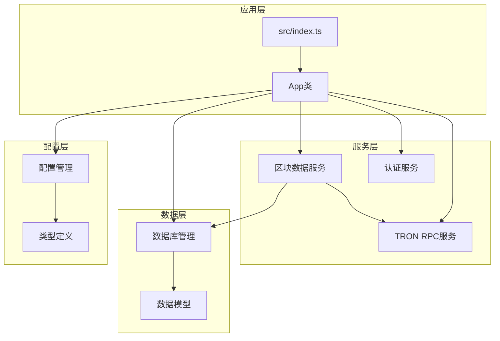
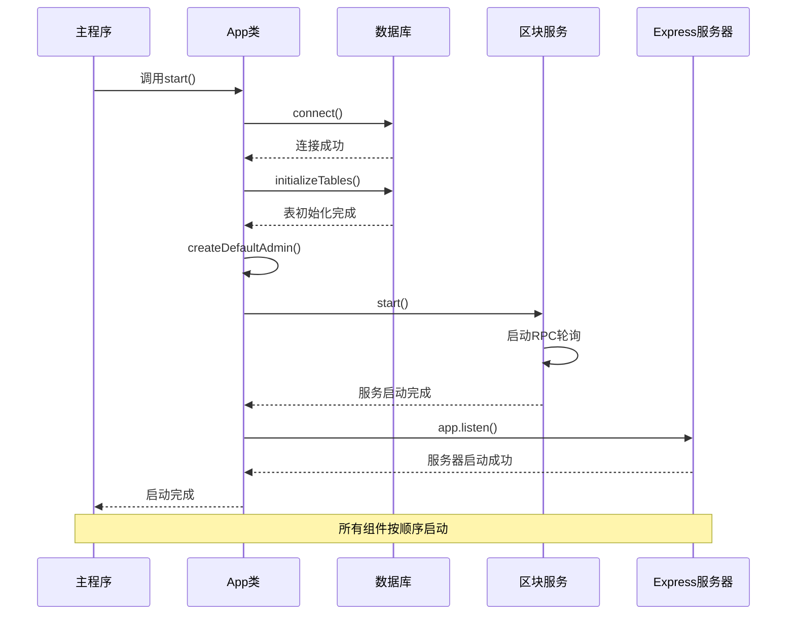
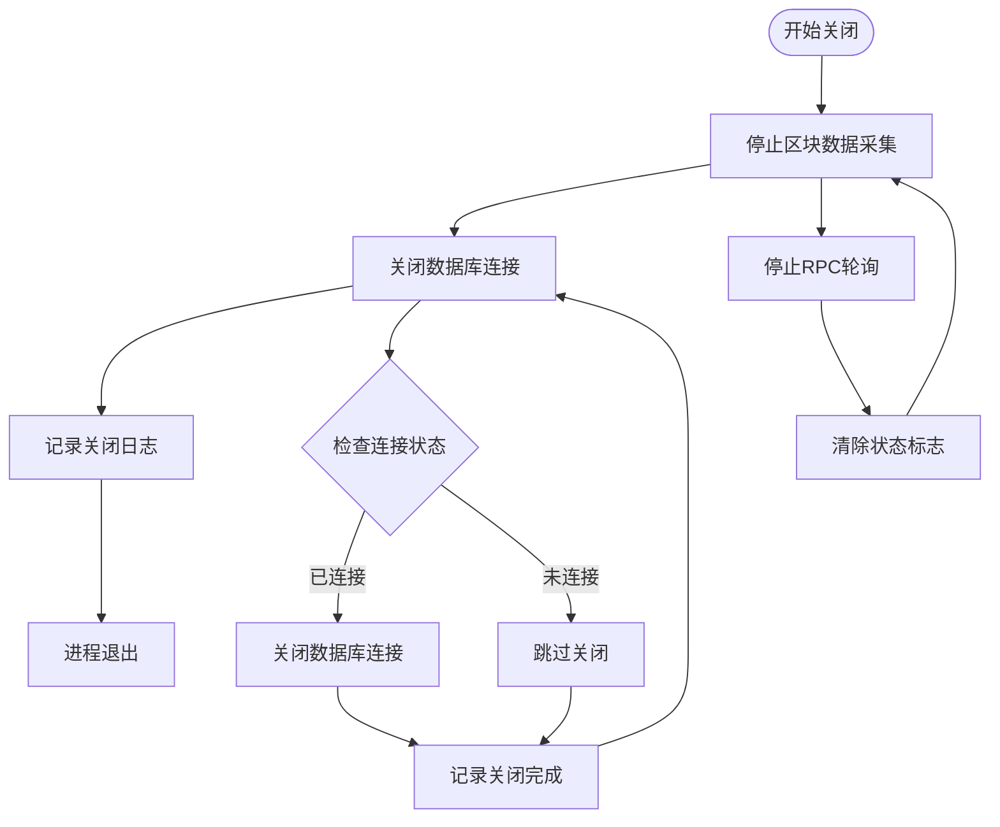
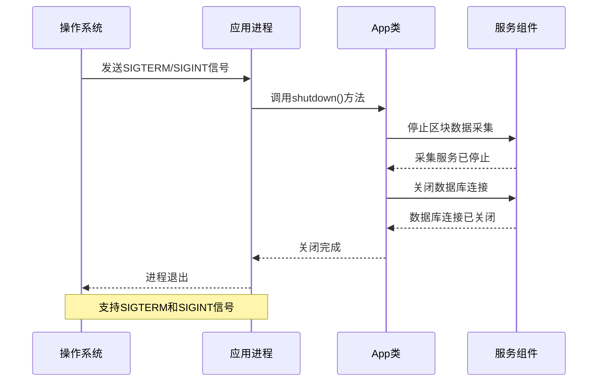

# 应用生命周期管理

<cite>
**本文档引用的文件**
- [src/index.ts](file://src/index.ts)
- [src/database/index.ts](file://src/database/index.ts)
- [src/services/BlockDataService.ts](file://src/services/BlockDataService.ts)
- [src/services/TronRPCService.ts](file://src/services/TronRPCService.ts)
- [src/config/index.ts](file://src/config/index.ts)
- [src/models/types.ts](file://src/models/types.ts)
</cite>

## 目录
1. [简介](#简介)
2. [项目架构概览](#项目架构概览)
3. [核心生命周期组件](#核心生命周期组件)
4. [start()方法详细分析](#start方法详细分析)
5. [shutdown()方法详细分析](#shutdown方法详细分析)
6. [信号处理机制](#信号处理机制)
7. [异常处理策略](#异常处理策略)
8. [性能考虑](#性能考虑)
9. [测试指南](#测试指南)
10. [故障排除](#故障排除)
11. [总结](#总结)

## 简介

本文档深入分析Point-Tron应用的生命周期管理机制，重点关注`start()`和`shutdown()`方法在应用启动和关闭过程中的关键作用。该应用是一个基于Node.js的TRON区块链数据分析平台，需要精确控制资源的初始化和释放，以确保数据完整性和系统稳定性。

应用生命周期管理涉及多个关键组件的协调工作，包括数据库连接管理、表结构初始化、默认管理员账户创建、区块数据采集服务启动以及HTTP服务器监听等核心功能。通过优雅的关闭流程，应用能够安全地停止所有后台服务，正确关闭数据库连接，并确保进程的平滑退出。

## 项目架构概览

Point-Tron采用模块化架构设计，将应用生命周期管理封装在App类中，实现了清晰的关注点分离：



**图表来源**
- [src/index.ts](file://src/index.ts#L1-L163)
- [src/database/index.ts](file://src/database/index.ts#L1-L249)

**章节来源**
- [src/index.ts](file://src/index.ts#L1-L163)
- [src/config/index.ts](file://src/config/index.ts#L1-L52)

## 核心生命周期组件

### App类设计

App类是整个应用生命周期的核心控制器，负责协调各个子系统的启动和关闭：

```typescript
class App {
  public app: express.Application;
  private tronRPCService: TronRPCService;
  private blockDataService: BlockDataService;

  constructor() {
    this.app = express();
    this.tronRPCService = new TronRPCService();
    this.blockDataService = new BlockDataService(this.tronRPCService);
    // 初始化中间件和路由
  }
}
```

### 生命周期状态管理

应用维护以下关键状态：

- **数据库连接状态**: 通过`isConnected`标志跟踪数据库连接状态
- **区块采集状态**: 通过`isRunning`标志跟踪区块数据采集服务状态  
- **RPC轮询状态**: 通过`isPolling`标志跟踪TRON RPC轮询状态
- **服务注册状态**: 通过各种标志跟踪不同服务的启动状态

**章节来源**
- [src/index.ts](file://src/index.ts#L18-L35)
- [src/database/index.ts](file://src/database/index.ts#L8-L10)

## start()方法详细分析

`start()`方法是应用启动的核心入口点，按照严格的顺序执行关键初始化步骤：



**图表来源**
- [src/index.ts](file://src/index.ts#L89-L115)
- [src/database/index.ts](file://src/database/index.ts#L25-L35)
- [src/services/BlockDataService.ts](file://src/services/BlockDataService.ts#L30-L55)

### 执行顺序详解

#### 1. 数据库连接阶段

```typescript
await database.connect();
```

数据库连接采用异步模式，确保连接成功后才继续后续操作：

- **连接参数配置**: 使用配置文件中的数据库路径
- **错误处理**: 连接失败时抛出异常并终止启动过程
- **连接状态跟踪**: 通过`isConnected`标志维护连接状态

#### 2. 表结构初始化阶段

```typescript
await database.initializeTables();
```

表结构初始化包含多个关键表的创建：

- **用户表**: 存储管理员账户信息
- **区块表**: 存储TRON区块数据
- **每日统计表**: 存储每日区块统计信息
- **配置表**: 存储系统配置信息
- **打点计分表**: 存储区块打点计分数据

每个表都包含适当的索引以优化查询性能。

#### 3. 默认管理员创建阶段

```typescript
await this.createDefaultAdmin();
```

管理员账户创建遵循幂等性原则：

- **重复检查**: 检查管理员账户是否已存在
- **条件创建**: 仅在不存在时创建默认账户
- **配置管理**: 使用配置文件中的用户名和密码

#### 4. 区块数据采集启动阶段

```typescript
await this.blockDataService.start();
```

区块数据采集服务启动包含以下步骤：

- **统计缓存初始化**: 刷新今日统计数据缓存
- **最后处理区块检查**: 获取最后处理的区块号
- **RPC轮询启动**: 启动TRON RPC轮询服务
- **状态标志设置**: 将`isRunning`设置为true

#### 5. HTTP服务器启动阶段

```typescript
this.app.listen(config.port, () => {
  console.log(`🚀 Point-Tron服务器启动成功`);
});
```

HTTP服务器启动提供以下功能：

- **端口绑定**: 绑定配置的端口号
- **健康检查端点**: 提供`/health`端点监控服务状态
- **静态文件服务**: 提供前端静态资源服务
- **视图引擎配置**: 支持EJS模板渲染

**章节来源**
- [src/index.ts](file://src/index.ts#L89-L115)
- [src/database/index.ts](file://src/database/index.ts#L70-L130)
- [src/services/BlockDataService.ts](file://src/services/BlockDataService.ts#L30-L55)

## shutdown()方法详细分析

`shutdown()`方法负责优雅地关闭应用，确保所有资源得到正确清理：



**图表来源**
- [src/index.ts](file://src/index.ts#L120-L135)
- [src/services/BlockDataService.ts](file://src/services/BlockDataService.ts#L57-L65)
- [src/database/index.ts](file://src/database/index.ts#L215-L230)

### 关闭流程详解

#### 1. 区块数据采集停止

```typescript
this.blockDataService.stop();
```

区块数据采集服务的停止操作：

- **RPC轮询停止**: 调用`tronRPCService.stopPolling()`停止TRON RPC轮询
- **状态标志更新**: 将`isRunning`设置为false
- **资源清理**: 清理所有与区块采集相关的资源

#### 2. 数据库连接关闭

```typescript
await database.close();
```

数据库连接关闭采用异步模式：

- **连接状态检查**: 仅在连接存在时执行关闭操作
- **连接池清理**: 正确关闭SQLite连接池
- **错误处理**: 捕获并处理关闭过程中的异常

#### 3. 进程退出

```typescript
process.exit(0);
```

进程退出遵循最佳实践：

- **退出码**: 使用0表示正常退出
- **资源清理**: 确保所有异步操作已完成
- **信号处理**: 与操作系统信号处理机制集成

**章节来源**
- [src/index.ts](file://src/index.ts#L120-L135)
- [src/services/BlockDataService.ts](file://src/services/BlockDataService.ts#L57-L65)
- [src/database/index.ts](file://src/database/index.ts#L215-L230)

## 信号处理机制

应用通过Node.js的进程信号处理机制实现优雅关闭：



**图表来源**
- [src/index.ts](file://src/index.ts#L137-L140)

### 信号处理实现

```typescript
// 处理进程信号
process.on('SIGTERM', () => app.shutdown());
process.on('SIGINT', () => app.shutdown());
```

信号处理机制的特点：

- **双重保护**: 同时支持SIGTERM和SIGINT信号
- **立即响应**: 接收到信号时立即调用shutdown方法
- **优雅关闭**: 不中断正在进行的操作，等待完成后再退出
- **资源清理**: 确保所有资源得到正确清理

### Docker/Kubernetes集成

在容器化环境中，信号处理尤为重要：

- **Docker**: 使用`docker stop`发送SIGTERM信号
- **Kubernetes**: Pod终止时发送SIGTERM信号
- **优雅终止**: Kubernetes会等待应用优雅关闭后才强制终止

**章节来源**
- [src/index.ts](file://src/index.ts#L137-L140)

## 异常处理策略

应用采用多层次的异常处理策略确保启动和关闭过程的可靠性：

### 启动异常处理

```typescript
try {
  // 启动序列...
} catch (error) {
  console.error('应用启动失败:', error);
  process.exit(1);
}
```

启动异常处理特点：

- **全局捕获**: 捕获启动过程中的任何异常
- **错误日志**: 记录详细的错误信息
- **强制退出**: 使用非零退出码指示启动失败
- **资源清理**: 在退出前确保已启动的资源得到清理

### 运行时异常处理

```typescript
private async onNewBlock(blockInfo: BlockInfo): Promise<void> {
  try {
    // 处理区块逻辑...
  } catch (error) {
    console.error(`处理区块 ${blockInfo.block_number} 失败:`, error);
  }
}
```

运行时异常处理特点：

- **局部捕获**: 在具体业务逻辑中捕获异常
- **不影响整体**: 单个区块处理失败不影响整体服务
- **错误隔离**: 确保异常不会传播到其他组件
- **日志记录**: 记录详细的错误信息用于调试

### 关闭异常处理

```typescript
public async shutdown(): Promise<void> {
  console.log('正在关闭应用...');
  
  try {
    // 关闭逻辑...
  } catch (error) {
    console.error('关闭过程中发生错误:', error);
  }
  
  console.log('应用已安全关闭');
  process.exit(0);
}
```

关闭异常处理特点：

- **优雅降级**: 即使出现错误也尝试完成关闭流程
- **状态恢复**: 确保即使关闭失败也能恢复到可接受状态
- **用户通知**: 通过日志向用户传达关闭状态

**章节来源**
- [src/index.ts](file://src/index.ts#L89-L115)
- [src/services/BlockDataService.ts](file://src/services/BlockDataService.ts#L67-L85)
- [src/index.ts](file://src/index.ts#L120-L135)

## 性能考虑

### 启动性能优化

应用启动过程经过精心设计以最小化启动时间：

- **并行初始化**: 数据库连接和表初始化可以并行进行
- **延迟加载**: 非关键组件采用延迟加载策略
- **缓存预热**: 统计缓存在启动时预热
- **索引优化**: 数据库索引在表创建时同步完成

### 关闭性能优化

关闭过程注重快速响应和资源回收：

- **异步关闭**: 使用异步操作避免阻塞进程退出
- **超时控制**: 设置合理的关闭超时时间
- **资源优先级**: 按重要性顺序关闭资源
- **并发清理**: 并发清理独立的资源

### 内存管理

应用采用多种策略确保内存使用效率：

- **事件监听器清理**: 关闭时移除所有事件监听器
- **定时器清理**: 停止所有定时器和轮询
- **连接池管理**: 正确关闭数据库连接池
- **缓存清理**: 清理不必要的缓存数据

## 测试指南

### 启动测试

验证应用启动流程的正确性：

```bash
# 启动应用
npm start

# 验证数据库连接
curl http://localhost:3000/health | jq '.data.database'

# 验证区块采集服务
curl http://localhost:3000/health | jq '.data.rpcPolling.isActive'

# 验证管理员账户
curl -X POST http://localhost:3000/api/auth/login \
  -H "Content-Type: application/json" \
  -d '{"username":"admin","password":"admin123"}'
```

### 关闭测试

验证应用关闭流程的正确性：

```bash
# 启动应用并获取PID
npm start &
APP_PID=$!

# 发送SIGTERM信号
kill $APP_PID

# 或者使用SIGINT
kill -INT $APP_PID

# 验证进程退出
ps aux | grep point-tron
```

### 自动化测试

编写自动化测试脚本验证生命周期：

```javascript
// test-lifecycle.js
const { exec } = require('child_process');
const assert = require('assert');

describe('应用生命周期测试', () => {
  let appProcess;
  
  beforeEach(() => {
    appProcess = exec('npm start');
  });
  
  afterEach(() => {
    if (appProcess) {
      appProcess.kill('SIGTERM');
    }
  });
  
  it('应该能够正常启动和关闭', async () => {
    // 等待应用启动
    await new Promise(resolve => setTimeout(resolve, 5000));
    
    // 验证健康检查端点
    const health = await fetchHealthCheck();
    assert.strictEqual(health.data.status, 'healthy');
    
    // 发送关闭信号
    appProcess.kill('SIGTERM');
    
    // 验证进程退出
    await waitForProcessExit(appProcess.pid);
  });
});
```

**章节来源**
- [src/index.ts](file://src/index.ts#L65-L75)

## 故障排除

### 常见启动问题

#### 数据库连接失败

**症状**: 应用启动时显示"数据库连接失败"错误

**解决方案**:
1. 检查数据库文件路径权限
2. 验证磁盘空间是否充足
3. 确认SQLite版本兼容性
4. 查看详细错误日志

#### 端口占用问题

**症状**: 应用无法绑定到指定端口

**解决方案**:
1. 检查端口是否被其他进程占用
2. 修改配置文件中的端口号
3. 使用`netstat`或`lsof`工具排查

#### RPC连接问题

**症状**: 区块数据采集服务无法连接到TRON网络

**解决方案**:
1. 检查TRON RPC URL配置
2. 验证网络连接性
3. 增加超时时间和重试次数
4. 使用备用RPC节点

### 常见关闭问题

#### 进程无法正常退出

**症状**: 应用接收到关闭信号但进程仍然运行

**解决方案**:
1. 检查是否有未完成的异步操作
2. 确认事件监听器是否正确移除
3. 验证定时器是否正确清理
4. 使用`process.exitCode`设置退出码

#### 数据库连接未正确关闭

**症状**: 应用关闭时数据库连接仍然保持

**解决方案**:
1. 确保`database.close()`被正确调用
2. 检查异步操作是否完成
3. 验证连接池是否正确清理
4. 使用超时机制防止无限等待

### 调试技巧

#### 启用详细日志

```typescript
// 在开发环境中启用详细日志
if (process.env.NODE_ENV === 'development') {
  console.log('详细启动日志:', {
    database: database.isConnectedToDb(),
    rpcPolling: this.tronRPCService.getPollingStatus().isActive,
    blockService: this.blockDataService.getStatus()
  });
}
```

#### 监控资源使用

```bash
# 监控内存使用
node --inspect src/index.ts

# 监控CPU使用
top -p $(pgrep -f point-tron)

# 监控网络连接
netstat -tulpn | grep point-tron
```

**章节来源**
- [src/database/index.ts](file://src/database/index.ts#L215-L230)
- [src/services/TronRPCService.ts](file://src/services/TronRPCService.ts#L100-L120)

## 总结

Point-Tron的应用生命周期管理展现了现代Node.js应用的最佳实践。通过精心设计的`start()`和`shutdown()`方法，应用实现了以下关键特性：

### 核心优势

1. **有序启动**: 按照严格的依赖顺序启动各个组件，确保系统稳定性
2. **优雅关闭**: 通过信号处理机制实现平滑的资源清理和进程退出
3. **异常处理**: 多层次的异常处理策略确保系统的健壮性
4. **资源管理**: 有效的内存管理和资源清理避免泄漏和数据丢失

### 设计亮点

- **模块化架构**: 清晰的职责分离使得生命周期管理更加可控
- **状态跟踪**: 维护准确的状态信息便于监控和调试
- **幂等性**: 支持重复启动而不产生副作用
- **可测试性**: 清晰的接口设计便于编写自动化测试

### 生产环境建议

1. **容器化部署**: 在Docker和Kubernetes环境中充分利用信号处理机制
2. **健康检查**: 实现完善的健康检查端点监控应用状态
3. **日志管理**: 配置适当的日志级别和轮转策略
4. **监控告警**: 集成监控系统及时发现和处理异常情况

通过本文档的详细分析，开发者可以深入理解Point-Tron应用生命周期管理的设计原理和实现细节，为构建可靠的Node.js应用提供宝贵的参考。