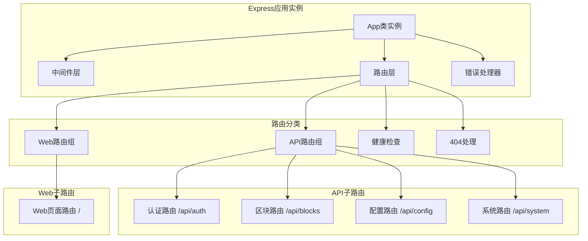
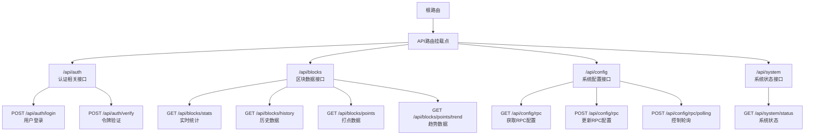
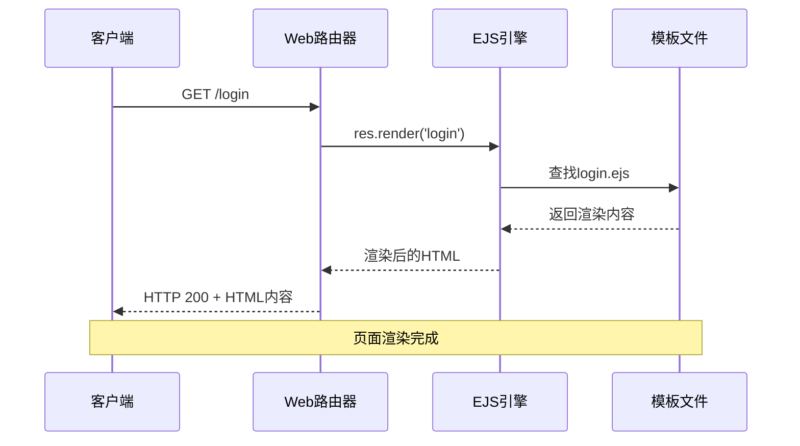
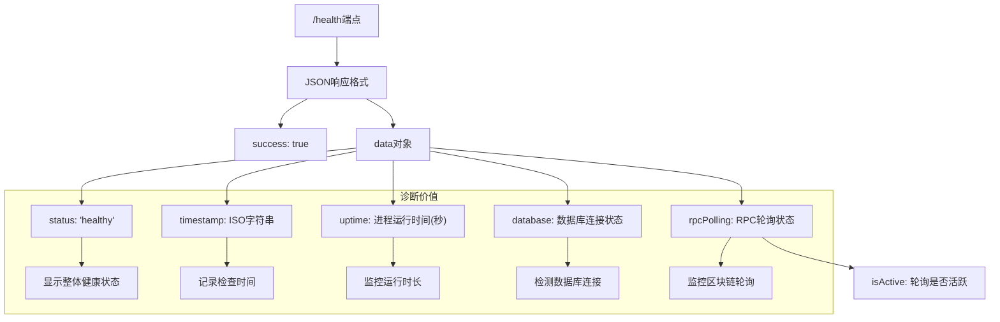
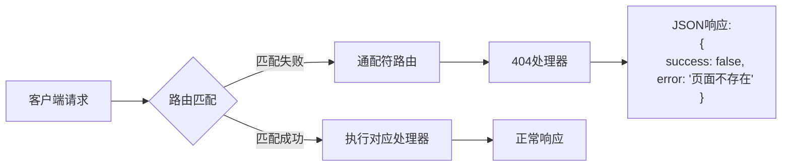
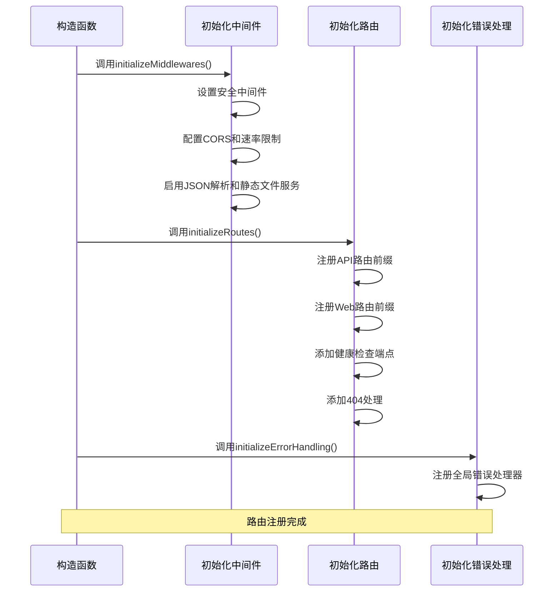
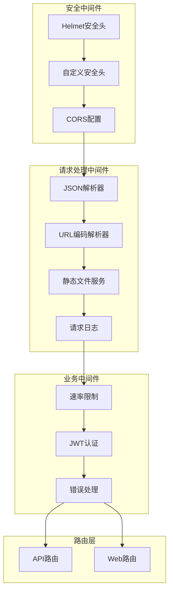

# 路由注册与请求分发机制

<cite>
**本文档引用的文件**
- [src/index.ts](file://src/index.ts)
- [src/routes/auth.ts](file://src/routes/auth.ts)
- [src/routes/blocks.ts](file://src/routes/blocks.ts)
- [src/routes/web.ts](file://src/routes/web.ts)
- [src/routes/config.ts](file://src/routes/config.ts)
- [src/routes/system.ts](file://src/routes/system.ts)
- [src/middleware/auth.ts](file://src/middleware/auth.ts)
- [src/models/types.ts](file://src/models/types.ts)
- [src/services/AuthService.ts](file://src/services/AuthService.ts)
- [src/database/index.ts](file://src/database/index.ts)
- [src/config/index.ts](file://src/config/index.ts)
</cite>

## 目录
1. [概述](#概述)
2. [路由架构设计](#路由架构设计)
3. [API路由系统](#api路由系统)
4. [Web页面路由系统](#web页面路由系统)
5. [健康检查端点](#健康检查端点)
6. [404全局捕获路由](#404全局捕获路由)
7. [路由注册流程](#路由注册流程)
8. [中间件集成](#中间件集成)
9. [扩展指南](#扩展指南)
10. [故障排除](#故障排除)

## 概述

Point-Tron系统采用Express框架构建了一个完整的路由注册与请求分发机制，该机制巧妙地结合了RESTful API接口和传统的Web页面路由，形成了一个功能完整的前后端分离架构。系统通过模块化的路由设计，实现了清晰的职责分离和高效的请求处理流程。

## 路由架构设计

### 整体架构概览



**图表来源**
- [src/index.ts](file://src/index.ts#L35-L55)

### 路由层次结构

系统采用了三层路由架构：

1. **应用级路由**：在`App`类的`initializeRoutes()`方法中统一注册
2. **模块级路由**：每个业务模块独立定义路由
3. **HTTP方法路由**：每个路由下包含多个HTTP方法处理函数

**章节来源**
- [src/index.ts](file://src/index.ts#L35-L55)

## API路由系统

### API路由前缀映射

系统将不同功能的API路由按照业务领域进行分组，通过不同的URL前缀进行区分：



**图表来源**
- [src/index.ts](file://src/index.ts#L40-L44)
- [src/routes/auth.ts](file://src/routes/auth.ts#L8-L25)
- [src/routes/blocks.ts](file://src/routes/blocks.ts#L8-L140)
- [src/routes/config.ts](file://src/routes/config.ts#L8-L79)
- [src/routes/system.ts](file://src/routes/system.ts#L8-L46)

### 认证中间件集成

所有API路由都集成了JWT认证中间件，确保只有经过身份验证的请求才能访问：

```typescript
// 认证中间件示例
router.post('/login', async (req, res: express.Response<ApiResponse>) => {
  // 登录逻辑
});

router.post('/verify', authenticateToken, async (req, res: express.Response<ApiResponse>) => {
  // 令牌验证逻辑，需要认证中间件保护
});
```

**章节来源**
- [src/routes/auth.ts](file://src/routes/auth.ts#L8-L25)
- [src/middleware/auth.ts](file://src/middleware/auth.ts#L15-L60)

### RESTful接口设计原则

API路由遵循RESTful设计原则：

1. **资源导向**：每个路由代表一个业务资源
2. **状态码规范**：使用标准HTTP状态码
3. **JSON响应格式**：统一的响应结构
4. **幂等性**：GET请求无副作用，POST/PUT/DELETE有明确作用

## Web页面路由系统

### EJS模板引擎集成

系统同时支持API接口和Web页面访问，通过EJS模板引擎提供动态页面渲染：



**图表来源**
- [src/routes/web.ts](file://src/routes/web.ts#L15-L25)

### Web路由功能

Web路由主要负责：

1. **页面渲染**：使用EJS模板引擎渲染管理界面
2. **重定向处理**：处理URL重定向逻辑
3. **静态资源服务**：通过Express静态文件中间件提供CSS/JS文件
4. **用户体验优化**：提供友好的Web界面

**章节来源**
- [src/routes/web.ts](file://src/routes/web.ts#L1-L50)

## 健康检查端点

### 健康检查实现

系统提供了专门的健康检查端点`/health`，用于监控应用运行状态：



**图表来源**
- [src/index.ts](file://src/index.ts#L50-L60)

### 健康检查字段详解

1. **status字段**：始终为"healthy"，表示应用正常运行
2. **timestamp字段**：ISO格式的时间戳，记录检查时刻
3. **uptime字段**：进程运行时间（秒），反映应用持续运行时长
4. **database字段**：布尔值，指示数据库连接状态
5. **rpcPolling字段**：包含RPC轮询的详细状态信息

**章节来源**
- [src/index.ts](file://src/index.ts#L50-L60)

## 404全局捕获路由

### 全局错误处理机制

系统通过Express的通配符路由实现404错误处理：



**图表来源**
- [src/index.ts](file://src/index.ts#L62-L66)

### 设计意图与响应格式

404路由的设计体现了以下考虑：

1. **一致性**：与其他API接口保持相同的JSON响应格式
2. **友好性**：提供清晰的错误信息，避免技术性的404页面
3. **可扩展性**：可以轻松扩展为更复杂的错误处理逻辑
4. **安全性**：不暴露内部路由结构信息

**章节来源**
- [src/index.ts](file://src/index.ts#L62-L66)

## 路由注册流程

### 初始化过程

路由注册遵循严格的顺序和依赖关系：



**图表来源**
- [src/index.ts](file://src/index.ts#L25-L35)

### 路由优先级规则

1. **顺序执行**：路由按注册顺序依次匹配
2. **前缀优先**：API路由前缀优先于根路由
3. **精确匹配**：具体路径优先于通配符路径
4. **中间件链**：每个路由都会执行相应的中间件栈

**章节来源**
- [src/index.ts](file://src/index.ts#L35-L66)

## 中间件集成

### 中间件生态系统

系统集成了多种中间件来增强路由功能：



**图表来源**
- [src/index.ts](file://src/index.ts#L35-L40)
- [src/middleware/auth.ts](file://src/middleware/auth.ts#L15-L170)

### 中间件执行顺序

中间件按照以下顺序执行：

1. **安全中间件**：设置安全头和CORS策略
2. **基础中间件**：启用JSON解析和静态文件服务
3. **业务中间件**：执行认证和速率限制
4. **路由处理**：执行具体的路由逻辑
5. **错误处理**：捕获并处理异常

**章节来源**
- [src/index.ts](file://src/index.ts#L35-L40)
- [src/middleware/auth.ts](file://src/middleware/auth.ts#L15-L170)

## 扩展指南

### 新增自定义路由步骤

开发者可以通过以下步骤新增自定义路由：

#### 步骤1：创建路由文件

```typescript
// src/routes/newFeature.ts
import express from 'express';
import { ApiResponse } from '../models/types';
import { authenticateToken } from '../middleware/auth';

const router = express.Router();

// 示例：获取新功能数据
router.get('/data', authenticateToken, async (req, res: express.Response<ApiResponse>) => {
  try {
    // 实现业务逻辑
    res.json({
      success: true,
      data: {
        message: '新功能数据'
      }
    });
  } catch (error) {
    res.status(500).json({
      success: false,
      error: '服务器内部错误'
    });
  }
});

export default router;
```

#### 步骤2：导入并注册路由

```typescript
// 在src/index.ts中修改
import newFeatureRoutes from './routes/newFeature';

class App {
  private initializeRoutes(): void {
    // ... 现有路由
    
    // 注册新路由
    this.app.use('/api/new-feature', newFeatureRoutes);
  }
}
```

#### 步骤3：添加类型定义（可选）

```typescript
// 在src/models/types.ts中添加
export interface NewFeatureData {
  id: number;
  name: string;
  value: string;
}
```

### 最佳实践建议

1. **命名规范**：使用描述性的路由名称和文件名
2. **错误处理**：确保每个路由都有适当的错误处理
3. **认证要求**：根据业务需求决定是否需要认证中间件
4. **响应格式**：保持一致的API响应格式
5. **文档注释**：为每个路由添加清晰的文档注释

**章节来源**
- [src/routes/auth.ts](file://src/routes/auth.ts#L1-L62)
- [src/routes/blocks.ts](file://src/routes/blocks.ts#L1-L141)

## 故障排除

### 常见问题与解决方案

#### 1. 路由无法访问

**症状**：客户端无法访问特定路由
**可能原因**：
- 路由注册顺序问题
- 中间件阻断请求
- 路由前缀拼写错误

**解决方案**：
```typescript
// 检查路由注册顺序
this.app.use('/api/new-feature', newFeatureRoutes); // 确保前缀正确
```

#### 2. 认证失败

**症状**：API调用返回401错误
**可能原因**：
- JWT令牌无效或过期
- 认证中间件配置错误
- 用户不存在

**解决方案**：
```typescript
// 检查认证中间件
authenticateToken(req, res, next);
```

#### 3. 健康检查异常

**症状**：/health端点返回非200状态码
**可能原因**：
- 数据库连接中断
- RPC轮询服务异常
- 应用程序内存泄漏

**解决方案**：
```typescript
// 检查数据库连接
console.log('数据库连接状态:', database.isConnectedToDb());

// 检查RPC轮询状态
console.log('RPC轮询状态:', this.tronRPCService.getPollingStatus());
```

### 调试技巧

1. **启用详细日志**：在开发环境中启用详细的请求日志
2. **使用调试工具**：利用浏览器开发者工具检查网络请求
3. **单元测试**：为每个路由编写单元测试
4. **性能监控**：监控路由响应时间和错误率

**章节来源**
- [src/index.ts](file://src/index.ts#L50-L60)
- [src/middleware/auth.ts](file://src/middleware/auth.ts#L15-L60)

## 总结

Point-Tron系统的路由注册与请求分发机制展现了现代Web应用的最佳实践。通过模块化的路由设计、完善的中间件集成和清晰的错误处理，系统实现了高可用性和可维护性。开发者可以基于现有的架构模式快速扩展新的功能，同时保持系统的稳定性和安全性。

该路由机制的核心优势包括：

1. **清晰的职责分离**：API路由和Web路由各司其职
2. **统一的错误处理**：404和错误响应的一致性
3. **灵活的扩展性**：易于添加新的路由和功能
4. **完善的监控**：健康检查端点提供实时状态监控
5. **安全的认证**：JWT认证确保API访问安全

通过遵循本文档提供的指导原则和最佳实践，开发者可以有效地扩展和维护这个强大的路由系统。