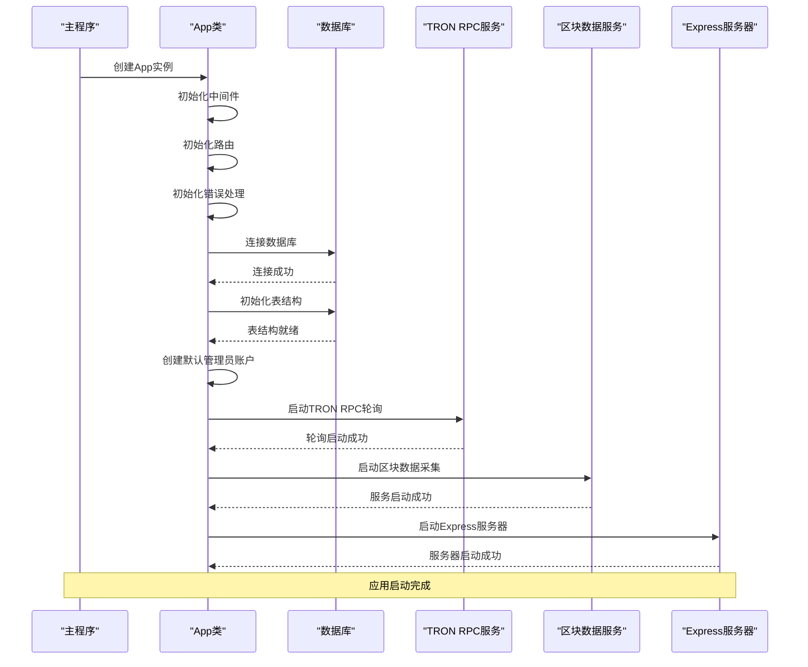
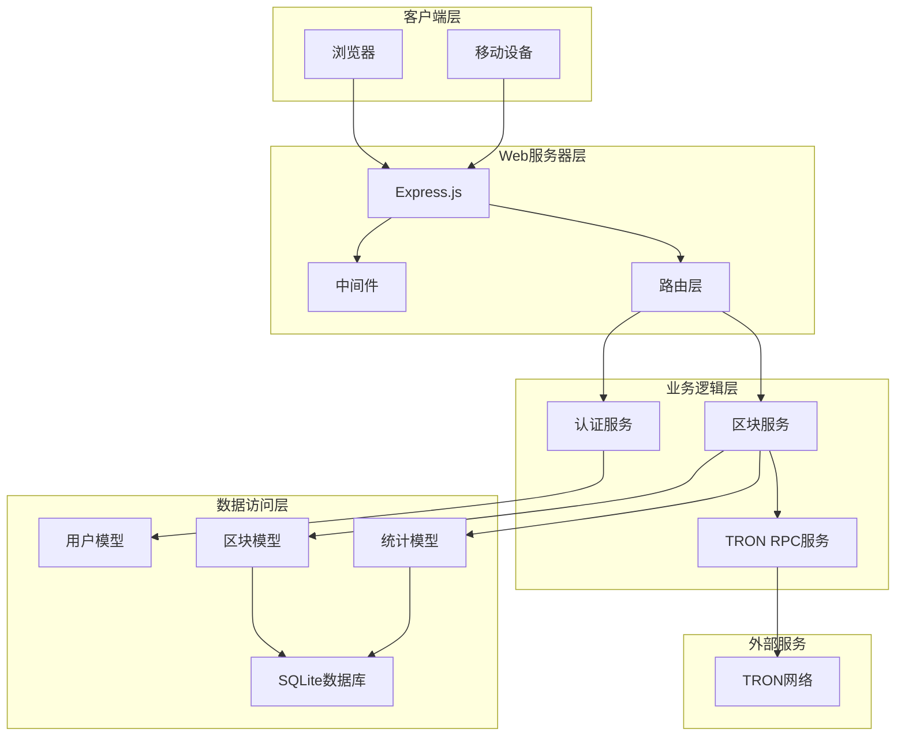
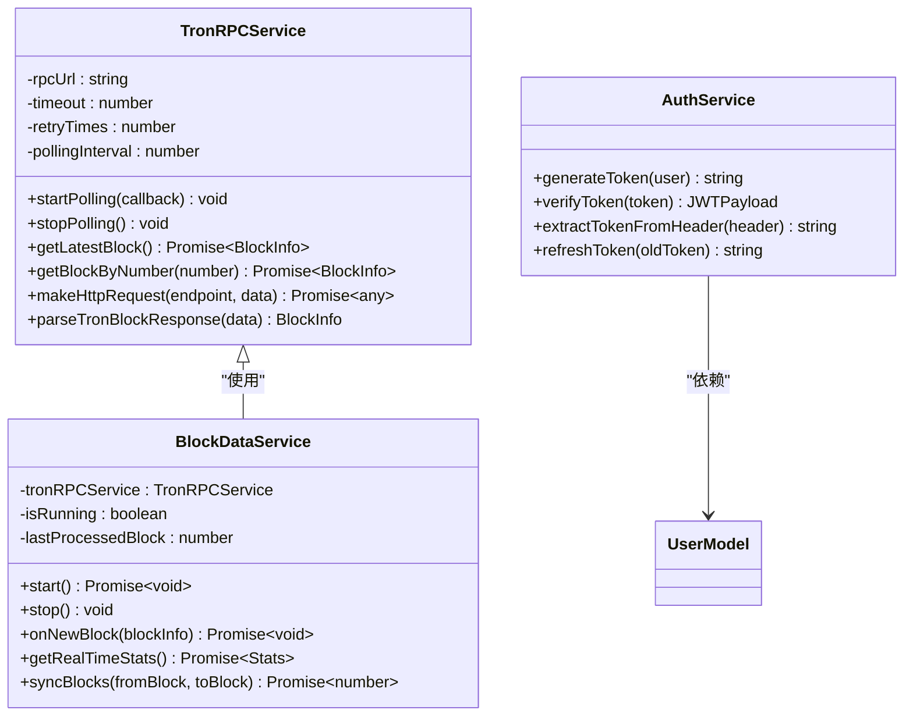
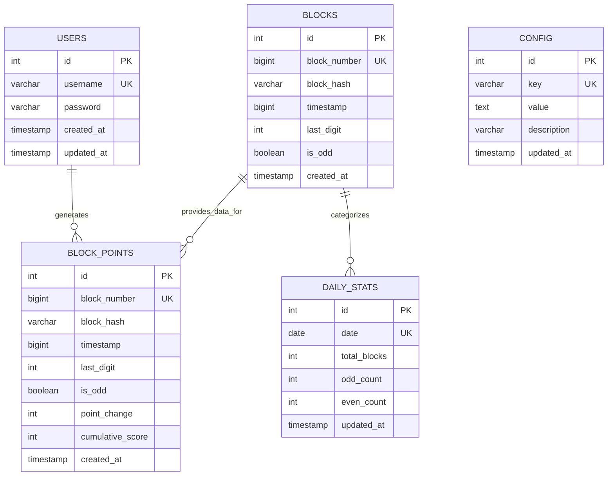
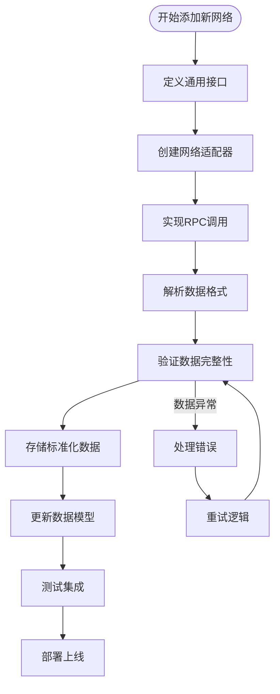

# Point-Tron 开发者指南

<cite>
**本文档引用的文件**
- [src/index.ts](file://src/index.ts)
- [src/config/index.ts](file://src/config/index.ts)
- [src/database/index.ts](file://src/database/index.ts)
- [src/routes/auth.ts](file://src/routes/auth.ts)
- [src/services/AuthService.ts](file://src/services/AuthService.ts)
- [src/models/UserModel.ts](file://src/models/UserModel.ts)
- [src/services/TronRPCService.ts](file://src/services/TronRPCService.ts)
- [src/services/BlockDataService.ts](file://src/services/BlockDataService.ts)
- [src/models/types.ts](file://src/models/types.ts)
- [src/routes/blocks.ts](file://src/routes/blocks.ts)
- [README.md](file://README.md)
</cite>

## 目录
1. [项目概述](#项目概述)
2. [应用启动流程](#应用启动流程)
3. [核心架构设计](#核心架构设计)
4. [新增API路由指南](#新增api路由指南)
5. [业务逻辑扩展](#业务逻辑扩展)
6. [数据模型设计](#数据模型设计)
7. [区块链网络扩展](#区块链网络扩展)
8. [代码规范与最佳实践](#代码规范与最佳实践)
9. [调试与测试](#调试与测试)
10. [故障排除指南](#故障排除指南)

## 项目概述

Point-Tron 是一个基于 TypeScript 和 Node.js 开发的波场网络区块链数据统计后台管理系统。该系统实时监控波场网络每 3 秒的出块情况，统计区块哈希最后一个阿拉伯数字的单双数规律，并提供可视化的数据分析界面。

### 核心特性

- **实时数据采集**：每 3 秒自动获取 TRON 网络最新区块数据
- **智能数据解析**：自动提取区块哈希最后数字并判断单双数
- **统计分析**：提供今日、历史数据统计和趋势分析
- **安全认证**：JWT 令牌认证和用户权限管理
- **错误处理**：完善的错误重试和异常处理机制

**章节来源**
- [README.md](file://README.md#L1-L50)

## 应用启动流程

### 启动序列图



**图表来源**
- [src/index.ts](file://src/index.ts#L120-L163)

### 组件初始化顺序

应用启动遵循严格的初始化顺序，确保各组件按依赖关系正确加载：

1. **中间件初始化**：安全、CORS、速率限制等中间件
2. **数据库连接**：建立SQLite数据库连接
3. **表结构初始化**：创建必要的数据库表
4. **默认用户创建**：初始化管理员账户
5. **TRON RPC服务启动**：开始区块数据轮询
6. **区块数据服务启动**：处理区块数据采集
7. **Express服务器启动**：监听HTTP请求

**章节来源**
- [src/index.ts](file://src/index.ts#L25-L120)

## 核心架构设计

### 系统架构图



**图表来源**
- [src/index.ts](file://src/index.ts#L1-L25)
- [src/services/TronRPCService.ts](file://src/services/TronRPCService.ts#L1-L50)

### 设计模式应用

系统采用了多种设计模式来提高代码的可维护性和扩展性：

1. **单例模式**：数据库连接采用单例模式
2. **工厂模式**：服务类负责创建和管理子组件
3. **观察者模式**：TRON RPC轮询使用回调函数通知数据变化
4. **策略模式**：不同区块链网络可以采用不同的数据处理策略

**章节来源**
- [src/database/index.ts](file://src/database/index.ts#L240-L249)
- [src/services/TronRPCService.ts](file://src/services/TronRPCService.ts#L30-L80)

## 新增API路由指南

### 标准开发流程

新增API路由需要遵循以下标准步骤：

#### 1. 创建路由文件

在 `src/routes/` 目录下创建新的路由文件，例如 `custom.ts`：

```typescript
import express from 'express';
import { ApiResponse } from '../models/types';
import { authenticateToken } from '../middleware/auth';

const router = express.Router();

// 示例：获取自定义数据
router.get('/custom-data', authenticateToken, async (req, res) => {
  try {
    // 实现业务逻辑
    const data = await someService.getData();
    
    res.json({
      success: true,
      data: data
    });
    
  } catch (error) {
    res.status(500).json({
      success: false,
      error: '服务器内部错误'
    });
  }
});

export default router;
```

#### 2. 注册路由到主应用

在 `src/index.ts` 中导入并注册新的路由：

```typescript
// 导入新路由
import customRoutes from './routes/custom';

// 在initializeRoutes方法中注册
private initializeRoutes(): void {
  // ... 其他路由
  
  // 新增自定义路由
  this.app.use('/api/custom', customRoutes);
}
```

#### 3. 实现业务逻辑

在 `src/services/` 目录下创建对应的服务类：

```typescript
export class CustomService {
  // 实现业务逻辑方法
  static async getData(): Promise<any> {
    // 业务逻辑实现
  }
  
  // 其他方法...
}
```

#### 4. 定义数据模型

在 `src/models/` 目录下创建数据模型：

```typescript
export interface CustomData {
  id?: number;
  name: string;
  value: number;
  timestamp: Date;
}
```

#### 5. 更新类型定义

在 `src/models/types.ts` 中添加新的接口定义：

```typescript
// 新增自定义数据接口
export interface CustomData {
  id?: number;
  name: string;
  value: number;
  timestamp: Date;
}
```

### API设计最佳实践

1. **统一响应格式**：使用 `ApiResponse` 接口确保一致的响应格式
2. **错误处理**：实现完整的错误处理机制
3. **身份验证**：对敏感接口实施JWT认证
4. **参数验证**：使用中间件验证请求参数
5. **速率限制**：防止API滥用

**章节来源**
- [src/routes/auth.ts](file://src/routes/auth.ts#L1-L62)
- [src/models/types.ts](file://src/models/types.ts#L45-L60)

## 业务逻辑扩展

### 服务层设计原则

业务逻辑应该集中在服务层，保持控制器的简洁性：



**图表来源**
- [src/services/TronRPCService.ts](file://src/services/TronRPCService.ts#L15-L50)
- [src/services/BlockDataService.ts](file://src/services/BlockDataService.ts#L10-L30)
- [src/services/AuthService.ts](file://src/services/AuthService.ts#L10-L30)

### 扩展业务逻辑示例

假设需要添加一个新的统计功能，可以按照以下步骤进行：

1. **创建服务类**：

```typescript
export class StatisticsService {
  // 获取自定义统计
  static async getCustomStatistics(): Promise<CustomStats> {
    // 实现统计逻辑
  }
  
  // 生成报告
  static async generateReport(type: ReportType): Promise<ReportData> {
    // 实现报告生成功能
  }
}
```

2. **添加数据模型**：

```typescript
export interface CustomStats {
  totalRecords: number;
  averageValue: number;
  maxRecord: number;
  minRecord: number;
  breakdown: Record<string, number>;
}
```

3. **创建路由**：

```typescript
router.get('/statistics', authenticateToken, async (req, res) => {
  try {
    const stats = await StatisticsService.getCustomStatistics();
    res.json({ success: true, data: stats });
  } catch (error) {
    res.status(500).json({ success: false, error: error.message });
  }
});
```

**章节来源**
- [src/services/TronRPCService.ts](file://src/services/TronRPCService.ts#L80-L150)
- [src/services/BlockDataService.ts](file://src/services/BlockDataService.ts#L40-L100)

## 数据模型设计

### 数据模型层次结构



**图表来源**
- [src/database/index.ts](file://src/database/index.ts#L60-L120)
- [src/models/types.ts](file://src/models/types.ts#L1-L30)

### 数据模型扩展指南

当需要添加新的数据实体时，应遵循以下步骤：

1. **定义接口**：在 `src/models/types.ts` 中定义新的接口
2. **创建模型类**：在 `src/models/` 目录下创建对应的模型类
3. **更新数据库初始化**：在 `src/database/index.ts` 中添加表创建语句
4. **添加索引**：为常用查询字段添加索引
5. **实现CRUD操作**：提供完整的数据操作方法

### 数据验证和转换

```typescript
// 数据验证示例
export class DataValidator {
  static validateBlockInfo(blockInfo: Partial<BlockInfo>): BlockInfo {
    if (!blockInfo.block_number) {
      throw new Error('区块号不能为空');
    }
    
    if (!blockInfo.block_hash) {
      throw new Error('区块哈希不能为空');
    }
    
    return {
      block_number: blockInfo.block_number,
      block_hash: blockInfo.block_hash,
      timestamp: blockInfo.timestamp || Date.now(),
      last_digit: blockInfo.last_digit || 0,
      is_odd: blockInfo.is_odd || false
    } as BlockInfo;
  }
}
```

**章节来源**
- [src/models/types.ts](file://src/models/types.ts#L1-L60)
- [src/models/UserModel.ts](file://src/models/UserModel.ts#L1-L50)

## 区块链网络扩展

### 支持多区块链网络架构



**图表来源**
- [src/services/TronRPCService.ts](file://src/services/TronRPCService.ts#L150-L200)

### 新区块链网络集成步骤

1. **创建网络适配器**：

```typescript
export interface BlockchainNetwork {
  getLatestBlock(): Promise<BlockInfo>;
  getBlockByNumber(number: number): Promise<BlockInfo>;
  testConnection(): Promise<boolean>;
  parseBlockData(rawData: any): BlockInfo;
}

export class EthereumNetworkAdapter implements BlockchainNetwork {
  async getLatestBlock(): Promise<BlockInfo> {
    // 实现以太坊网络的RPC调用
  }
  
  async getBlockByNumber(number: number): Promise<BlockInfo> {
    // 实现以太坊网络的区块查询
  }
  
  // 其他方法实现...
}
```

2. **更新服务层**：

```typescript
export class MultiChainService {
  private networks: Map<string, BlockchainNetwork> = new Map();
  
  registerNetwork(name: string, network: BlockchainNetwork): void {
    this.networks.set(name, network);
  }
  
  async getBlockFromAnyNetwork(networkName: string, blockNumber: number): Promise<BlockInfo> {
    const network = this.networks.get(networkName);
    if (!network) {
      throw new Error(`网络 ${networkName} 未注册`);
    }
    
    return await network.getBlockByNumber(blockNumber);
  }
}
```

3. **配置管理**：

```typescript
interface NetworkConfig {
  name: string;
  rpcUrl: string;
  chainId: number;
  pollingInterval: number;
  retryTimes: number;
}

const networkConfigs: NetworkConfig[] = [
  {
    name: 'tron',
    rpcUrl: process.env.TRON_RPC_URL || 'https://api.trongrid.io',
    chainId: 195,
    pollingInterval: 3000,
    retryTimes: 3
  },
  {
    name: 'ethereum',
    rpcUrl: process.env.ETH_RPC_URL || 'https://mainnet.infura.io/v3/YOUR_PROJECT_ID',
    chainId: 1,
    pollingInterval: 15000,
    retryTimes: 5
  }
];
```

**章节来源**
- [src/services/TronRPCService.ts](file://src/services/TronRPCService.ts#L200-L258)

## 代码规范与最佳实践

### TypeScript类型定义规范

1. **接口命名**：使用PascalCase，如 `BlockInfo`, `User`
2. **属性命名**：使用camelCase，如 `blockNumber`, `userName`
3. **枚举类型**：使用PascalCase，如 `TimeRange`, `ReportType`
4. **泛型约束**：使用有意义的类型参数名称

```typescript
// 正确的类型定义示例
export interface ApiResponse<T = any> {
  success: boolean;
  data?: T;
  message?: string;
  error?: string;
}

export type TimeRange = '1day' | '1week' | '1month';
```

### 错误处理最佳实践

```typescript
// 统一错误处理装饰器
export function handleErrors(target: any, propertyKey: string, descriptor: PropertyDescriptor) {
  const originalMethod = descriptor.value;
  
  descriptor.value = async function (...args: any[]) {
    try {
      return await originalMethod.apply(this, args);
    } catch (error) {
      console.error(`方法 ${propertyKey} 执行失败:`, error);
      
      if (error instanceof ValidationError) {
        throw new ApiError(400, '参数验证失败', error.message);
      }
      
      if (error instanceof DatabaseError) {
        throw new ApiError(500, '数据库操作失败', error.message);
      }
      
      throw new ApiError(500, '服务器内部错误', error.message);
    }
  };
}
```

### 代码组织原则

1. **单一职责**：每个文件只负责一个特定的功能
2. **依赖注入**：使用构造函数注入依赖，便于测试
3. **异步优先**：优先使用async/await语法
4. **错误传播**：适当的错误传播和处理

```typescript
// 依赖注入示例
export class UserService {
  private userRepository: UserRepository;
  
  constructor(userRepository: UserRepository) {
    this.userRepository = userRepository;
  }
  
  async createUser(userData: CreateUserDTO): Promise<User> {
    // 实现用户创建逻辑
  }
}
```

**章节来源**
- [src/models/types.ts](file://src/models/types.ts#L45-L60)
- [src/services/AuthService.ts](file://src/services/AuthService.ts#L1-L50)

## 调试与测试

### 调试工具和技巧

系统提供了多个调试脚本来帮助开发者：

1. **API调试**：`debug-api.js` 提供API端点测试
2. **数据库调试**：`debug-db.js` 用于数据库操作测试
3. **时间调试**：`debug-time.js` 用于时间相关功能测试
4. **模拟调试**：`debug-api-simulate.js` 模拟API响应

### 测试框架集成

```typescript
// 测试示例
describe('BlockDataService', () => {
  let service: BlockDataService;
  let mockRPC: MockTronRPCService;
  
  beforeEach(async () => {
    mockRPC = new MockTronRPCService();
    service = new BlockDataService(mockRPC);
    await service.start();
  });
  
  afterEach(async () => {
    await service.stop();
  });
  
  it('should process new blocks correctly', async () => {
    const mockBlock = {
      block_number: 1000,
      block_hash: '0x1234567890abcdef',
      timestamp: Date.now(),
      last_digit: 5,
      is_odd: true
    };
    
    // 模拟新块事件
    await service['onNewBlock'](mockBlock);
    
    // 验证数据被正确处理
    const latestBlock = await BlockModel.getLatest();
    expect(latestBlock).toBeDefined();
    expect(latestBlock!.block_number).toBe(1000);
  });
});
```

### 性能监控

```typescript
// 性能监控装饰器
export function monitorPerformance(target: any, propertyKey: string, descriptor: PropertyDescriptor) {
  const originalMethod = descriptor.value;
  
  descriptor.value = function (...args: any[]) {
    const start = Date.now();
    const result = originalMethod.apply(this, args);
    const duration = Date.now() - start;
    
    console.log(`${propertyKey} 执行耗时: ${duration}ms`);
    
    return result;
  };
}
```

**章节来源**
- [README.md](file://README.md#L200-L250)

## 故障排除指南

### 常见问题及解决方案

#### 1. 数据库连接问题

**症状**：应用启动时出现数据库连接错误

**解决方案**：
```bash
# 检查数据目录权限
ls -la data/

# 确保数据目录存在
mkdir -p data/

# 检查磁盘空间
df -h
```

#### 2. TRON网络连接问题

**症状**：区块数据无法获取，RPC调用超时

**解决方案**：
```bash
# 测试网络连接
curl -X POST https://api.trongrid.io/wallet/getnowblock \
  -H "Content-Type: application/json" \
  -d "{}"

# 更换RPC节点
# 修改 .env 文件中的 TRON_RPC_URL
```

#### 3. 端口占用问题

**症状**：应用无法启动，提示端口已被占用

**解决方案**：
```bash
# 查找占用端口的进程
lsof -ti:3000

# 杀死占用进程
kill -9 $(lsof -ti:3000)

# 或修改端口配置
echo "PORT=3001" >> .env
```

### 日志分析

系统运行时会输出详细的日志信息，关键日志包括：

```typescript
// 关键日志示例
console.log(`📦 处理新区块: ${blockInfo.block_number}, 哈希末位数字: ${blockInfo.last_digit} (${blockInfo.is_odd ? '单' : '双'}数)`);
console.log(`✅ 区块 ${blockInfo.block_number} 处理完成`);
console.log(`📈 今日统计缓存已更新: 总计${todayStats.total}, 单数${todayStats.odd}, 双数${todayStats.even}`);
```

### 健康检查

系统提供健康检查端点 `/health`，可以监控应用状态：

```json
{
  "success": true,
  "data": {
    "status": "healthy",
    "timestamp": "2024-01-01T12:00:00.000Z",
    "uptime": 3600.5,
    "database": true,
    "rpcPolling": true
  }
}
```

**章节来源**
- [src/index.ts](file://src/index.ts#L70-L85)
- [README.md](file://README.md#L250-L290)

## 结论

本开发者指南详细介绍了 Point-Tron 项目的架构设计、开发流程和最佳实践。通过遵循这些指导原则，开发者可以：

1. **快速上手**：理解项目结构和启动流程
2. **规范开发**：遵循TypeScript类型定义和代码规范
3. **扩展功能**：按照标准流程添加新功能模块
4. **维护质量**：保持代码质量和系统稳定性

项目采用模块化设计，支持轻松扩展新的区块链网络和功能模块。建议开发者在贡献代码前仔细阅读相关章节，并参考现有代码实现。