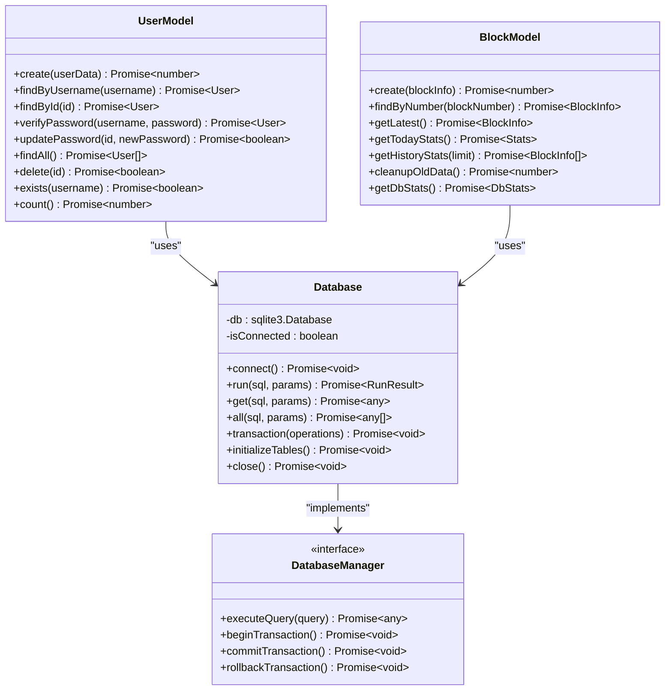

# 数据模型扩展指南

<cite>
**本文档引用的文件**
- [UserModel.ts](file://src/models/UserModel.ts)
- [BlockModel.ts](file://src/models/BlockModel.ts)
- [types.ts](file://src/models/types.ts)
- [index.ts](file://src/database/index.ts)
- [config/index.ts](file://src/config/index.ts)
- [blocks.ts](file://src/routes/blocks.ts)
</cite>

## 目录
1. [简介](#简介)
2. [现有模型架构分析](#现有模型架构分析)
3. [创建新的数据模型](#创建新的数据模型)
4. [数据库表设计最佳实践](#数据库表设计最佳实践)
5. [迁移脚本编写指南](#迁移脚本编写指南)
6. [数据验证与安全](#数据验证与安全)
7. [性能优化策略](#性能优化策略)
8. [实际应用示例](#实际应用示例)
9. [故障排除指南](#故障排除指南)
10. [总结](#总结)

## 简介

在Point-Tron项目中，数据模型扩展是一个关键的开发任务，它涉及到创建新的TypeScript类来封装数据库操作，实现数据持久化需求。本指南基于现有的UserModel和BlockModel，展示了如何创建新的数据模型类，解释模型类与SQLite数据库的映射关系，并提供完整的开发流程。

## 现有模型架构分析

### 核心设计模式

项目采用了经典的Model-View-Controller (MVC) 架构模式，其中Model层负责数据访问和业务逻辑封装：



**图表来源**
- [UserModel.ts](file://src/models/UserModel.ts#L1-L100)
- [BlockModel.ts](file://src/models/BlockModel.ts#L1-L170)
- [index.ts](file://src/database/index.ts#L1-L249)

### 数据库连接管理

数据库连接通过单例模式管理，确保整个应用程序只有一个数据库实例：

```typescript
// 单例模式导出数据库实例
export const database = new Database();
```

**章节来源**
- [index.ts](file://src/database/index.ts#L247-L249)

## 创建新的数据模型

### 步骤1：定义数据接口

首先需要在`types.ts`中定义新的数据接口：

```typescript
// 新的实体接口示例
export interface Transaction {
  id?: number;
  user_id: number;
  amount: number;
  currency: string;
  transaction_hash: string;
  status: 'pending' | 'completed' | 'failed';
  created_at?: string;
  updated_at?: string;
}
```

### 步骤2：创建模型类

基于现有模型的设计模式，创建新的数据模型类：

```typescript
import { database } from '../database';
import { Transaction } from './types';

export class TransactionModel {
  // 创建交易记录
  static async create(transactionData: Omit<Transaction, 'id' | 'created_at' | 'updated_at'>): Promise<number> {
    const result = await database.run(
      'INSERT INTO transactions (user_id, amount, currency, transaction_hash, status) VALUES (?, ?, ?, ?, ?)',
      [
        transactionData.user_id,
        transactionData.amount,
        transactionData.currency,
        transactionData.transaction_hash,
        transactionData.status
      ]
    );
    
    return result.lastID!;
  }

  // 根据用户ID获取交易记录
  static async findByUserId(userId: number, limit: number = 50): Promise<Transaction[]> {
    const results = await database.all(
      'SELECT * FROM transactions WHERE user_id = ? ORDER BY created_at DESC LIMIT ?',
      [userId, limit]
    );
    
    return results;
  }

  // 更新交易状态
  static async updateStatus(id: number, status: Transaction['status']): Promise<boolean> {
    const result = await database.run(
      'UPDATE transactions SET status = ?, updated_at = CURRENT_TIMESTAMP WHERE id = ?',
      [status, id]
    );
    
    return (result.changes || 0) > 0;
  }

  // 获取用户总交易金额
  static async getTotalAmount(userId: number): Promise<number> {
    const result = await database.get(
      'SELECT SUM(amount) as total FROM transactions WHERE user_id = ? AND status = ?',
      [userId, 'completed']
    );
    
    return result?.total || 0;
  }

  // 批量更新多个交易状态
  static async batchUpdateStatus(ids: number[], status: Transaction['status']): Promise<boolean> {
    const sql = 'UPDATE transactions SET status = ?, updated_at = CURRENT_TIMESTAMP WHERE id IN (' + 
                ids.map(() => '?').join(',') + ')';
    
    const result = await database.run(sql, [...ids, status]);
    
    return (result.changes || 0) > 0;
  }
}
```

### 步骤3：集成到路由层

将新的模型类集成到路由层：

```typescript
import express from 'express';
import { TransactionModel } from '../models/TransactionModel';
import { ApiResponse } from '../models/types';

const router = express.Router();

// 获取用户交易记录
router.get('/transactions/:userId', async (req, res: express.Response<ApiResponse>) => {
  try {
    const userId = parseInt(req.params.userId);
    const limit = parseInt(req.query.limit as string) || 50;
    
    const transactions = await TransactionModel.findByUserId(userId, limit);
    
    res.json({
      success: true,
      data: transactions
    });
  } catch (error) {
    res.status(500).json({
      success: false,
      error: '获取交易记录失败'
    });
  }
});

export default router;
```

**章节来源**
- [UserModel.ts](file://src/models/UserModel.ts#L1-L100)
- [BlockModel.ts](file://src/models/BlockModel.ts#L1-L170)
- [types.ts](file://src/models/types.ts#L1-L60)

## 数据库表设计最佳实践

### 字段定义规范

基于现有表结构，新表应该遵循以下字段定义规范：

```sql
-- 推荐的新表结构
CREATE TABLE IF NOT EXISTS transactions (
  id INTEGER PRIMARY KEY AUTOINCREMENT,
  user_id INTEGER NOT NULL,
  amount DECIMAL(10, 2) NOT NULL,
  currency VARCHAR(10) NOT NULL,
  transaction_hash VARCHAR(66) NOT NULL,
  status VARCHAR(20) NOT NULL,
  created_at TIMESTAMP DEFAULT CURRENT_TIMESTAMP,
  updated_at TIMESTAMP DEFAULT CURRENT_TIMESTAMP,
  FOREIGN KEY (user_id) REFERENCES users(id) ON DELETE CASCADE
);
```

### 数据类型映射

| TypeScript 类型 | SQLite 类型 | 描述 |
|------------------|-------------|------|
| `number` | `INTEGER` | 整数类型，用于ID和计数器 |
| `string` | `VARCHAR(n)` 或 `TEXT` | 文本类型，长度限制可选 |
| `boolean` | `BOOLEAN` 或 `INTEGER` | 布尔值，通常存储为1或0 |
| `Date` | `TIMESTAMP` | 时间戳格式 |
| `decimal` | `DECIMAL(p,s)` | 精确数值类型 |

### 主键和外键约束

```sql
-- 主键约束
PRIMARY KEY AUTOINCREMENT

-- 外键约束
FOREIGN KEY (user_id) REFERENCES users(id) ON DELETE CASCADE
```

**章节来源**
- [index.ts](file://src/database/index.ts#L105-L141)

## 迁移脚本编写指南

### 创建迁移文件

创建专门的迁移文件来管理数据库结构变更：

```typescript
// migrations/001-create-transactions-table.ts
import { database } from '../database';

export async function up() {
  await database.run(`
    CREATE TABLE IF NOT EXISTS transactions (
      id INTEGER PRIMARY KEY AUTOINCREMENT,
      user_id INTEGER NOT NULL,
      amount DECIMAL(10, 2) NOT NULL,
      currency VARCHAR(10) NOT NULL,
      transaction_hash VARCHAR(66) NOT NULL,
      status VARCHAR(20) NOT NULL,
      created_at TIMESTAMP DEFAULT CURRENT_TIMESTAMP,
      updated_at TIMESTAMP DEFAULT CURRENT_TIMESTAMP,
      FOREIGN KEY (user_id) REFERENCES users(id) ON DELETE CASCADE
    )
  `);
  
  // 创建索引
  await database.run('CREATE INDEX IF NOT EXISTS idx_transactions_user ON transactions(user_id)');
  await database.run('CREATE INDEX IF NOT EXISTS idx_transactions_hash ON transactions(transaction_hash)');
  
  console.log('✅ 交易表创建成功');
}

export async function down() {
  await database.run('DROP TABLE IF EXISTS transactions');
  console.log('❌ 交易表回滚成功');
}
```

### 迁移版本控制

```typescript
// migrations/index.ts
import { database } from '../database';

interface Migration {
  id: string;
  name: string;
  executedAt: Date;
}

export class MigrationManager {
  private migrationsTable = 'migrations';
  
  async initialize() {
    await database.run(`
      CREATE TABLE IF NOT EXISTS ${this.migrationsTable} (
        id VARCHAR(255) PRIMARY KEY,
        name VARCHAR(255) NOT NULL,
        executed_at TIMESTAMP DEFAULT CURRENT_TIMESTAMP
      )
    `);
  }
  
  async runMigration(migrationId: string, migrationName: string, up: () => Promise<void>, down: () => Promise<void>) {
    const existing = await database.get(
      `SELECT * FROM ${this.migrationsTable} WHERE id = ?`,
      [migrationId]
    );
    
    if (!existing) {
      try {
        await up();
        await database.run(
          `INSERT INTO ${this.migrationsTable} (id, name) VALUES (?, ?)`,
          [migrationId, migrationName]
        );
        console.log(`✅ 迁移 ${migrationName} 执行成功`);
      } catch (error) {
        console.error(`❌ 迁移 ${migrationName} 执行失败:`, error);
        throw error;
      }
    } else {
      console.log(`⏭️ 迁移 ${migrationName} 已经执行过`);
    }
  }
  
  async rollbackMigration(migrationId: string, down: () => Promise<void>) {
    const existing = await database.get(
      `SELECT * FROM ${this.migrationsTable} WHERE id = ?`,
      [migrationId]
    );
    
    if (existing) {
      try {
        await down();
        await database.run(
          `DELETE FROM ${this.migrationsTable} WHERE id = ?`,
          [migrationId]
        );
        console.log(`✅ 迁移回滚成功`);
      } catch (error) {
        console.error(`❌ 迁移回滚失败:`, error);
        throw error;
      }
    }
  }
}
```

**章节来源**
- [index.ts](file://src/database/index.ts#L143-L174)

## 数据验证与安全

### 输入验证

在模型类中实现输入验证：

```typescript
static async create(transactionData: Partial<Transaction>): Promise<number | null> {
  // 验证必需字段
  if (!transactionData.user_id || !transactionData.amount || !transactionData.currency) {
    throw new Error('缺少必要参数');
  }
  
  // 验证金额格式
  if (typeof transactionData.amount !== 'number' || transactionData.amount <= 0) {
    throw new Error('金额必须是正数');
  }
  
  // 验证货币格式
  if (!/^[A-Z]{3}$/.test(transactionData.currency.toUpperCase())) {
    throw new Error('货币代码格式错误');
  }
  
  // 验证交易哈希格式
  if (transactionData.transaction_hash && 
      !/^0x[a-fA-F0-9]{64}$/.test(transactionData.transaction_hash)) {
    throw new Error('交易哈希格式错误');
  }
  
  // 验证状态值
  const validStatuses = ['pending', 'completed', 'failed'];
  if (transactionData.status && !validStatuses.includes(transactionData.status)) {
    throw new Error(`无效的状态值，必须是: ${validStatuses.join(', ')}`);
  }
  
  try {
    const result = await database.run(
      'INSERT INTO transactions (user_id, amount, currency, transaction_hash, status) VALUES (?, ?, ?, ?, ?)',
      [
        transactionData.user_id,
        transactionData.amount,
        transactionData.currency,
        transactionData.transaction_hash,
        transactionData.status || 'pending'
      ]
    );
    
    return result.lastID!;
  } catch (error) {
    console.error('创建交易记录失败:', error);
    throw error;
  }
}
```

### SQL注入防护

使用参数化查询防止SQL注入：

```typescript
// 安全的查询方式
static async findByUserId(userId: number): Promise<Transaction[]> {
  const results = await database.all(
    'SELECT * FROM transactions WHERE user_id = ?',  // 使用占位符
    [userId]  // 参数数组
  );
  return results;
}

// 错误的查询方式（不要使用）
// const unsafeQuery = `SELECT * FROM transactions WHERE user_id = ${userId}`;
```

### 事务处理

对于涉及多个操作的复杂业务逻辑，使用事务确保数据一致性：

```typescript
static async transferFunds(fromUserId: number, toUserId: number, amount: number): Promise<boolean> {
  return database.transaction([
    async () => {
      // 减少转出用户的余额
      await database.run(
        'UPDATE accounts SET balance = balance - ? WHERE user_id = ?',
        [amount, fromUserId]
      );
    },
    async () => {
      // 增加转入用户的余额
      await database.run(
        'UPDATE accounts SET balance = balance + ? WHERE user_id = ?',
        [amount, toUserId]
      );
    },
    async () => {
      // 记录转账交易
      await database.run(
        'INSERT INTO transactions (from_user_id, to_user_id, amount, type) VALUES (?, ?, ?, ?)',
        [fromUserId, toUserId, amount, 'transfer']
      );
    }
  ]);
}
```

**章节来源**
- [UserModel.ts](file://src/models/UserModel.ts#L15-L25)
- [BlockModel.ts](file://src/models/BlockModel.ts#L15-L35)

## 性能优化策略

### 索引优化

基于查询模式创建合适的索引：

```sql
-- 为频繁查询的字段创建索引
CREATE INDEX IF NOT EXISTS idx_transactions_user_status ON transactions(user_id, status);
CREATE INDEX IF NOT EXISTS idx_transactions_created ON transactions(created_at);
CREATE INDEX IF NOT EXISTS idx_transactions_currency ON transactions(currency);
```

### 查询优化示例

```typescript
// 优化的批量查询
static async getUserTransactionsBatch(userIds: number[], limit: number = 100): Promise<Transaction[]> {
  if (userIds.length === 0) return [];
  
  const placeholders = userIds.map(() => '?').join(',');
  const sql = `
    SELECT t.*
    FROM transactions t
    WHERE t.user_id IN (${placeholders})
    ORDER BY t.created_at DESC
    LIMIT ?
  `;
  
  const results = await database.all(sql, [...userIds, limit]);
  return results;
}

// 分页查询优化
static async getPagedTransactions(page: number = 1, pageSize: number = 50): Promise<{
  transactions: Transaction[];
  total: number;
  page: number;
  totalPages: number;
}> {
  const offset = (page - 1) * pageSize;
  
  const [totalResult, transactions] = await Promise.all([
    database.get('SELECT COUNT(*) as total FROM transactions'),
    database.all(
      'SELECT * FROM transactions ORDER BY created_at DESC LIMIT ? OFFSET ?',
      [pageSize, offset]
    )
  ]);
  
  return {
    transactions,
    total: totalResult?.total || 0,
    page,
    totalPages: Math.ceil((totalResult?.total || 0) / pageSize)
  };
}
```

### 缓存策略

```typescript
import NodeCache from 'node-cache';

class CachedTransactionModel {
  private cache = new NodeCache({ stdTTL: 300 }); // 5分钟缓存
  
  async getByUserIdWithCache(userId: number): Promise<Transaction[]> {
    const cacheKey = `transactions_${userId}`;
    let transactions = this.cache.get<Transaction[]>(cacheKey);
    
    if (!transactions) {
      transactions = await TransactionModel.findByUserId(userId);
      this.cache.set(cacheKey, transactions);
    }
    
    return transactions;
  }
  
  invalidateCache(userId: number): void {
    const cacheKey = `transactions_${userId}`;
    this.cache.del(cacheKey);
  }
}
```

**章节来源**
- [index.ts](file://src/database/index.ts#L143-L153)
- [BlockModel.ts](file://src/models/BlockModel.ts#L15-L35)

## 实际应用示例

### 完整的用户交易模型

结合前面的知识，创建一个完整的用户交易模型：

```typescript
// src/models/TransactionModel.ts
import { database } from '../database';
import { Transaction } from './types';

export class TransactionModel {
  // 创建交易记录
  static async create(transactionData: Omit<Transaction, 'id' | 'created_at' | 'updated_at'>): Promise<number> {
    // 输入验证
    if (!transactionData.user_id || !transactionData.amount || !transactionData.currency) {
      throw new Error('缺少必要参数');
    }
    
    if (typeof transactionData.amount !== 'number' || transactionData.amount <= 0) {
      throw new Error('金额必须是正数');
    }
    
    if (!/^[A-Z]{3}$/.test(transactionData.currency.toUpperCase())) {
      throw new Error('货币代码格式错误');
    }
    
    try {
      const result = await database.run(
        'INSERT INTO transactions (user_id, amount, currency, transaction_hash, status) VALUES (?, ?, ?, ?, ?)',
        [
          transactionData.user_id,
          transactionData.amount,
          transactionData.currency,
          transactionData.transaction_hash || '',
          transactionData.status || 'pending'
        ]
      );
      
      return result.lastID!;
    } catch (error) {
      console.error('创建交易记录失败:', error);
      throw error;
    }
  }

  // 根据用户ID获取交易记录
  static async findByUserId(userId: number, limit: number = 50): Promise<Transaction[]> {
    const results = await database.all(
      'SELECT * FROM transactions WHERE user_id = ? ORDER BY created_at DESC LIMIT ?',
      [userId, limit]
    );
    
    return results;
  }

  // 更新交易状态
  static async updateStatus(id: number, status: Transaction['status']): Promise<boolean> {
    const validStatuses = ['pending', 'completed', 'failed'];
    if (!validStatuses.includes(status)) {
      throw new Error(`无效的状态值，必须是: ${validStatuses.join(', ')}`);
    }
    
    const result = await database.run(
      'UPDATE transactions SET status = ?, updated_at = CURRENT_TIMESTAMP WHERE id = ?',
      [status, id]
    );
    
    return (result.changes || 0) > 0;
  }

  // 获取用户总交易金额
  static async getTotalAmount(userId: number): Promise<number> {
    const result = await database.get(
      'SELECT SUM(amount) as total FROM transactions WHERE user_id = ? AND status = ?',
      [userId, 'completed']
    );
    
    return result?.total || 0;
  }

  // 批量更新多个交易状态
  static async batchUpdateStatus(ids: number[], status: Transaction['status']): Promise<boolean> {
    if (ids.length === 0) return false;
    
    const validStatuses = ['pending', 'completed', 'failed'];
    if (!validStatuses.includes(status)) {
      throw new Error(`无效的状态值，必须是: ${validStatuses.join(', ')}`);
    }
    
    const placeholders = ids.map(() => '?').join(',');
    const sql = `UPDATE transactions SET status = ?, updated_at = CURRENT_TIMESTAMP WHERE id IN (${placeholders})`;
    
    const result = await database.run(sql, [...ids, status]);
    
    return (result.changes || 0) > 0;
  }

  // 分页查询
  static async getPagedTransactions(page: number = 1, pageSize: number = 50): Promise<{
    transactions: Transaction[];
    total: number;
    page: number;
    totalPages: number;
  }> {
    const offset = (page - 1) * pageSize;
    
    const [totalResult, transactions] = await Promise.all([
      database.get('SELECT COUNT(*) as total FROM transactions'),
      database.all(
        'SELECT * FROM transactions ORDER BY created_at DESC LIMIT ? OFFSET ?',
        [pageSize, offset]
      )
    ]);
    
    return {
      transactions,
      total: totalResult?.total || 0,
      page,
      totalPages: Math.ceil((totalResult?.total || 0) / pageSize)
    };
  }
}
```

### 路由集成

```typescript
// src/routes/transactions.ts
import express from 'express';
import { TransactionModel } from '../models/TransactionModel';
import { ApiResponse } from '../models/types';
import { authenticateToken } from '../middleware/auth';

const router = express.Router();

// 获取用户交易记录
router.get('/:userId', authenticateToken, async (req, res: express.Response<ApiResponse>) => {
  try {
    const userId = parseInt(req.params.userId);
    const limit = parseInt(req.query.limit as string) || 50;
    
    const transactions = await TransactionModel.findByUserId(userId, limit);
    
    res.json({
      success: true,
      data: transactions
    });
  } catch (error) {
    res.status(500).json({
      success: false,
      error: '获取交易记录失败'
    });
  }
});

// 创建新交易
router.post('/', authenticateToken, async (req, res: express.Response<ApiResponse>) => {
  try {
    const { user_id, amount, currency, transaction_hash, status } = req.body;
    
    const transactionId = await TransactionModel.create({
      user_id,
      amount,
      currency,
      transaction_hash,
      status
    });
    
    res.json({
      success: true,
      data: { transactionId }
    });
  } catch (error) {
    res.status(500).json({
      success: false,
      error: '创建交易记录失败'
    });
  }
});

// 更新交易状态
router.put('/:id/status', authenticateToken, async (req, res: express.Response<ApiResponse>) => {
  try {
    const { id } = req.params;
    const { status } = req.body;
    
    const success = await TransactionModel.updateStatus(parseInt(id), status);
    
    if (success) {
      res.json({
        success: true,
        message: '交易状态更新成功'
      });
    } else {
      res.status(404).json({
        success: false,
        error: '未找到对应的交易记录'
      });
    }
  } catch (error) {
    res.status(500).json({
      success: false,
      error: '更新交易状态失败'
    });
  }
});

export default router;
```

**章节来源**
- [blocks.ts](file://src/routes/blocks.ts#L1-L141)

## 故障排除指南

### 常见问题及解决方案

#### 1. 数据库连接问题

```typescript
// 错误处理示例
static async create(transactionData: Transaction): Promise<number | null> {
  try {
    const result = await database.run(
      'INSERT INTO transactions (user_id, amount, currency, transaction_hash, status) VALUES (?, ?, ?, ?, ?)',
      [
        transactionData.user_id,
        transactionData.amount,
        transactionData.currency,
        transactionData.transaction_hash,
        transactionData.status
      ]
    );
    
    return result.lastID!;
  } catch (error) {
    if (error.code === 'SQLITE_BUSY') {
      console.error('数据库忙，请稍后重试');
      throw new Error('数据库操作超时，请稍后重试');
    } else if (error.code === 'SQLITE_CONSTRAINT') {
      console.error('违反数据库约束:', error.message);
      throw new Error('数据验证失败，请检查输入');
    } else {
      console.error('数据库操作失败:', error);
      throw error;
    }
  }
}
```

#### 2. 索引性能问题

```typescript
// 查询性能监控
static async findRecentTransactions(days: number = 7): Promise<Transaction[]> {
  const startDate = new Date(Date.now() - days * 24 * 60 * 60 * 1000).toISOString();
  
  // 使用EXPLAIN QUERY PLAN检查查询计划
  const explainResult = await database.get(
    `EXPLAIN QUERY PLAN 
     SELECT * FROM transactions 
     WHERE created_at >= ? 
     ORDER BY created_at DESC`,
    [startDate]
  );
  
  console.log('查询计划:', explainResult);
  
  const results = await database.all(
    'SELECT * FROM transactions WHERE created_at >= ? ORDER BY created_at DESC',
    [startDate]
  );
  
  return results;
}
```

#### 3. 内存泄漏预防

```typescript
// 资源清理
class TransactionModel {
  private static connectionPool: Database[] = [];
  
  static async getConnection(): Promise<Database> {
    if (this.connectionPool.length > 0) {
      return this.connectionPool.pop()!;
    }
    return database;
  }
  
  static async releaseConnection(conn: Database): Promise<void> {
    if (this.connectionPool.length < 10) {
      this.connectionPool.push(conn);
    }
  }
  
  static async createWithPool(transactionData: Transaction): Promise<number> {
    const conn = await this.getConnection();
    try {
      const result = await conn.run(
        'INSERT INTO transactions (user_id, amount, currency, transaction_hash, status) VALUES (?, ?, ?, ?, ?)',
        [
          transactionData.user_id,
          transactionData.amount,
          transactionData.currency,
          transactionData.transaction_hash,
          transactionData.status
        ]
      );
      return result.lastID!;
    } finally {
      await this.releaseConnection(conn);
    }
  }
}
```

### 调试工具

```typescript
// 调试辅助函数
class DebugUtils {
  static async logDatabaseSchema(): Promise<void> {
    const tables = await database.all("SELECT name FROM sqlite_master WHERE type='table'");
    
    for (const table of tables) {
      console.log(`\n=== 表: ${table.name} ===`);
      const columns = await database.all(`PRAGMA table_info(${table.name})`);
      columns.forEach(col => {
        console.log(`- ${col.name}: ${col.type} ${col.notnull ? 'NOT NULL' : ''}`);
      });
    }
  }
  
  static async logQueryPerformance(sql: string, params: any[] = []): Promise<any[]> {
    const startTime = Date.now();
    const results = await database.all(sql, params);
    const endTime = Date.now();
    
    console.log(`查询耗时: ${endTime - startTime}ms`);
    console.log(`返回结果数: ${results.length}`);
    
    return results;
  }
}
```

**章节来源**
- [UserModel.ts](file://src/models/UserModel.ts#L15-L25)
- [BlockModel.ts](file://src/models/BlockModel.ts#L15-L35)

## 总结

本指南详细介绍了如何在Point-Tron项目中扩展数据模型，涵盖了从基础的模型类创建到高级的性能优化策略。通过遵循这些最佳实践，开发者可以：

1. **建立一致的模型架构**：基于现有的UserModel和BlockModel模式，确保新模型的一致性和可维护性
2. **实现安全的数据访问**：通过参数化查询和输入验证防止SQL注入和其他安全漏洞
3. **优化数据库性能**：合理使用索引和查询优化技术提升应用性能
4. **管理数据库变更**：通过迁移脚本确保数据库结构变更的可追溯性和安全性
5. **处理复杂业务逻辑**：使用事务和错误处理机制保证数据一致性

这些实践不仅适用于当前的项目需求，也为未来的功能扩展奠定了坚实的基础。随着应用的发展，持续关注性能监控和安全更新将是保持系统健康运行的关键。