# 技术栈与依赖

<cite>
**本文档引用的文件**
- [package.json](file://package.json)
- [src/index.ts](file://src/index.ts)
- [src/config/index.ts](file://src/config/index.ts)
- [src/database/index.ts](file://src/database/index.ts)
- [src/middleware/auth.ts](file://src/middleware/auth.ts)
- [src/services/AuthService.ts](file://src/services/AuthService.ts)
- [src/models/UserModel.ts](file://src/models/UserModel.ts)
- [src/routes/auth.ts](file://src/routes/auth.ts)
- [src/services/TronRPCService.ts](file://src/services/TronRPCService.ts)
- [src/services/BlockDataService.ts](file://src/services/BlockDataService.ts)
- [src/models/types.ts](file://src/models/types.ts)
- [README.md](file://README.md)
</cite>

## 目录
1. [项目概述](#项目概述)
2. [核心技术栈](#核心技术栈)
3. [后端框架架构](#后端框架架构)
4. [数据库与数据存储](#数据库与数据存储)
5. [认证与安全机制](#认证与安全机制)
6. [区块链集成](#区块链集成)
7. [定时任务与调度](#定时任务与调度)
8. [开发工具与构建](#开发工具与构建)
9. [性能优化与监控](#性能优化与监控)
10. [部署与运维](#部署与运维)

## 项目概述

Point-Tron 是一个基于 TypeScript 和 Node.js 开发的波场网络区块链数据统计后台管理系统。该系统实时监控波场网络每 3 秒的出块情况，统计区块哈希最后一个阿拉伯数字的单双数规律，并提供可视化的数据分析界面。

**章节来源**
- [README.md](file://README.md#L1-L50)

## 核心技术栈

### 后端框架与语言

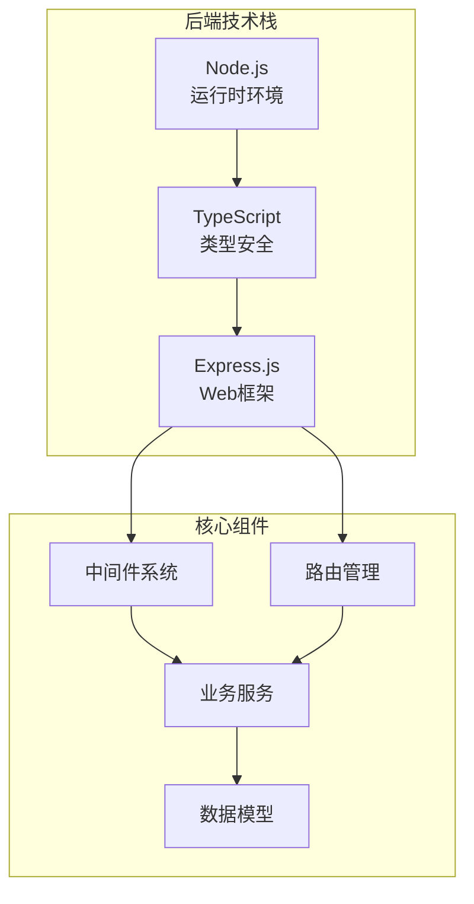

**图表来源**
- [src/index.ts](file://src/index.ts#L1-L20)
- [package.json](file://package.json#L15-L25)

### 主要依赖包分析

项目采用现代化的 Node.js 技术栈，包含以下核心依赖：

#### 核心运行时依赖
- **express**: ^4.18.2 - Web应用框架，提供路由、中间件等基础功能
- **typescript**: ^5.9.2 - 类型安全的JavaScript超集
- **sqlite3**: ^5.1.6 - SQLite数据库驱动，轻量级本地数据库
- **bcryptjs**: ^2.4.3 - 密码加密库，提供安全的密码哈希
- **jsonwebtoken**: ^9.0.2 - JWT令牌生成和验证
- **ejs**: ^3.1.9 - 模板引擎，用于动态HTML生成
- **node-cron**: ^3.0.3 - 定时任务调度器
- **cors**: ^2.8.5 - 跨域资源共享支持
- **helmet**: ^7.1.0 - 安全中间件，增强应用安全性

#### 开发依赖
- **@types/node**: ^24.3.3 - Node.js类型定义
- **@types/express**: ^4.17.21 - Express.js类型定义
- **ts-node**: ^10.9.1 - TypeScript运行时编译器
- **jest**: ^29.7.0 - 测试框架

**章节来源**
- [package.json](file://package.json#L15-L35)

## 后端框架架构

### Express.js 框架配置

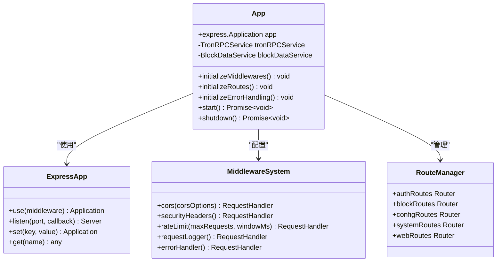

**图表来源**
- [src/index.ts](file://src/index.ts#L15-L50)
- [src/middleware/auth.ts](file://src/middleware/auth.ts#L1-L50)

### 中间件系统设计

系统实现了完整的中间件管道，包括：

1. **安全中间件** (`helmet`)
   - 内容安全策略禁用（支持EJS模板）
   - HTTP头部安全强化
   - 防止常见Web攻击

2. **跨域处理** (`cors`)
   - 灵活的CORS配置
   - 支持凭证传递
   - 方法和头部白名单

3. **速率限制** (`custom`)
   - 基于IP的请求频率控制
   - 可配置的限制参数
   - 简单的内存存储方案

4. **请求日志** (`requestLogger`)
   - 自动记录请求信息
   - 包含响应时间和状态码
   - IP地址追踪

**章节来源**
- [src/index.ts](file://src/index.ts#L30-L60)
- [src/middleware/auth.ts](file://src/middleware/auth.ts#L80-L170)

### 路由架构

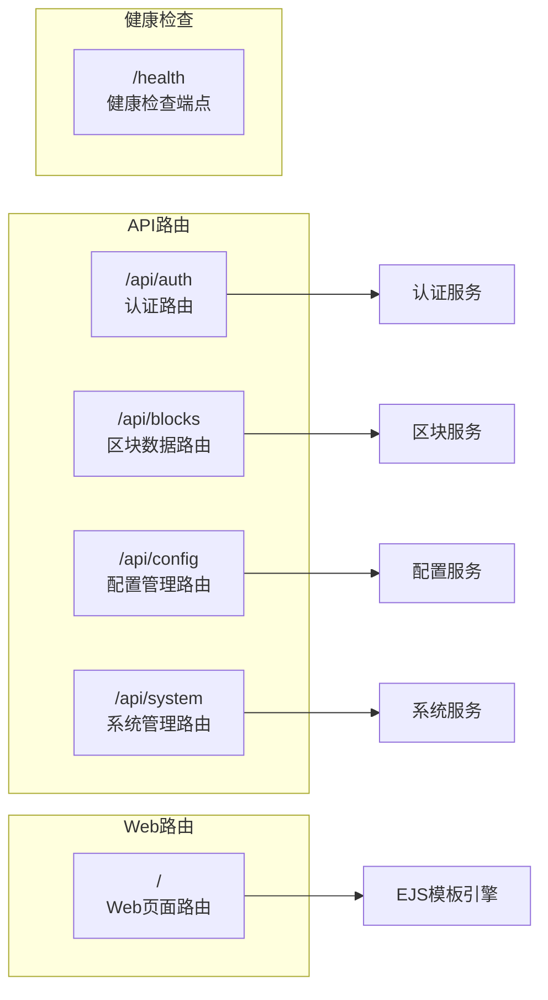

**图表来源**
- [src/index.ts](file://src/index.ts#L70-L90)
- [src/routes/auth.ts](file://src/routes/auth.ts#L1-L20)

**章节来源**
- [src/index.ts](file://src/index.ts#L70-L95)
- [src/routes/auth.ts](file://src/routes/auth.ts#L1-L62)

## 数据库与数据存储

### SQLite 数据库架构

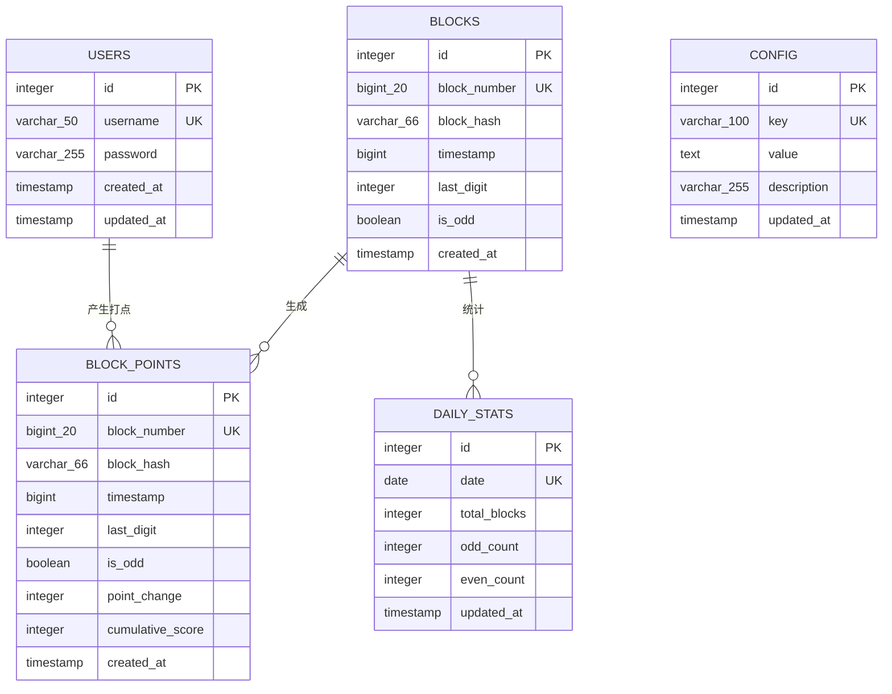

**图表来源**
- [src/database/index.ts](file://src/database/index.ts#L50-L120)
- [src/models/types.ts](file://src/models/types.ts#L1-L30)

### 数据库连接与操作

系统使用封装的 `Database` 类管理SQLite连接：

#### 核心功能特性：
- **自动连接管理**: 自动创建数据库目录和连接
- **Promise化API**: 提供异步数据库操作方法
- **事务支持**: 支持复杂的数据一致性操作
- **索引优化**: 为高频查询字段建立索引
- **错误处理**: 完善的异常捕获和错误报告

#### 主要数据库操作方法：
- `run(sql, params)`: 执行SQL命令（INSERT/UPDATE/DELETE）
- `get(sql, params)`: 查询单行数据
- `all(sql, params)`: 查询多行数据
- `transaction(operations)`: 执行事务操作

**章节来源**
- [src/database/index.ts](file://src/database/index.ts#L1-L100)

### 数据模型设计

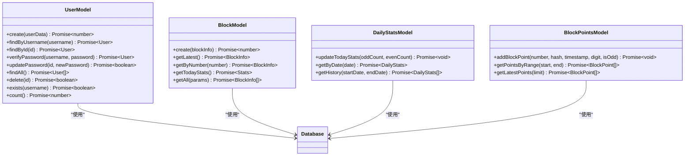

**图表来源**
- [src/models/UserModel.ts](file://src/models/UserModel.ts#L1-L50)
- [src/models/types.ts](file://src/models/types.ts#L1-L60)

**章节来源**
- [src/models/UserModel.ts](file://src/models/UserModel.ts#L1-L100)
- [src/models/types.ts](file://src/models/types.ts#L1-L60)

## 认证与安全机制

### JWT 令牌认证系统

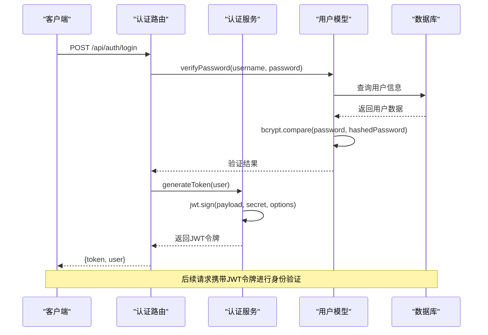

**图表来源**
- [src/routes/auth.ts](file://src/routes/auth.ts#L10-L40)
- [src/services/AuthService.ts](file://src/services/AuthService.ts#L10-L30)

### 密码安全处理

系统采用bcryptjs库进行密码安全处理：

#### 密码加密流程：
1. **注册时**: 使用 `bcrypt.hash()` 对明文密码进行10轮加密
2. **登录验证**: 使用 `bcrypt.compare()` 验证输入密码与存储密码
3. **安全性**: 每次加密使用不同的盐值，防止彩虹表攻击

#### 安全特性：
- **加盐哈希**: 自动添加随机盐值
- **渐进式加密**: 可配置加密强度（10轮）
- **不可逆性**: 无法从哈希值反推出原始密码

**章节来源**
- [src/models/UserModel.ts](file://src/models/UserModel.ts#L10-L30)
- [src/services/AuthService.ts](file://src/services/AuthService.ts#L1-L50)

### 认证中间件实现

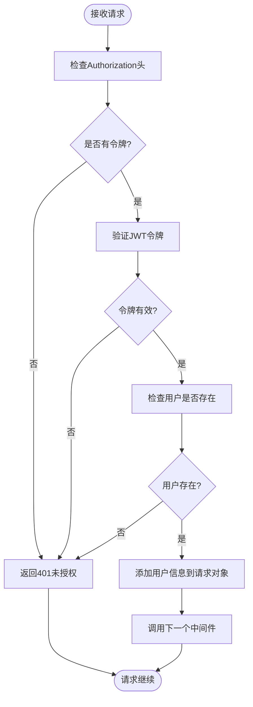

**图表来源**
- [src/middleware/auth.ts](file://src/middleware/auth.ts#L15-L50)

### 安全中间件配置

系统实现了多层次的安全防护：

1. **Helmet中间件**: 提供标准的安全头部
   - X-Content-Type-Options: nosniff
   - X-Frame-Options: DENY
   - X-XSS-Protection: 1; mode=block
   - Strict-Transport-Security: 31536000秒

2. **自定义安全头部**: 额外的安全强化
   - 自定义错误处理
   - 请求日志记录
   - 速率限制保护

**章节来源**
- [src/middleware/auth.ts](file://src/middleware/auth.ts#L80-L120)

## 区块链集成

### TRON RPC 服务架构

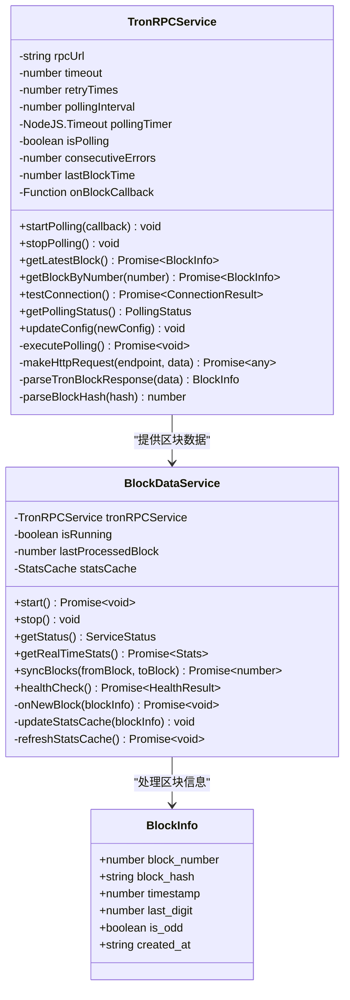

**图表来源**
- [src/services/TronRPCService.ts](file://src/services/TronRPCService.ts#L15-L50)
- [src/services/BlockDataService.ts](file://src/services/BlockDataService.ts#L10-L40)

### 区块数据处理流程

```mermaid
sequenceDiagram
participant RPC as "TRON RPC"
participant Service as "区块数据服务"
participant Model as "区块模型"
participant Stats as "统计模型"
participant Points as "打点模型"
RPC->>Service : 新区块通知
Service->>Service : 检查区块是否已处理
Service->>Model : create(blockInfo)
Model-->>Service : 返回区块ID
Service->>Stats->>Stats : updateTodayStats(oddCount, evenCount)
Service->>Points->>Points : addBlockPoint(pointInfo)
Service->>Service : 更新本地统计缓存
Service-->>RPC : 处理完成确认
Note over Service,Points : 实时处理，确保数据一致性
```

**图表来源**
- [src/services/BlockDataService.ts](file://src/services/BlockDataService.ts#L50-L100)

### 区块哈希解析算法

系统实现了智能的区块哈希解析算法：

#### 解析步骤：
1. **清理哈希**: 移除可能的 `0x` 前缀
2. **逆向扫描**: 从末尾向前查找第一个数字字符
3. **数值转换**: 将字符转换为数字值
4. **奇偶判断**: 根据最后一位数字判断奇偶性

#### 特殊处理：
- 支持不同长度的区块哈希
- 默认处理无数字的情况（返回0）
- 错误情况下的警告日志

**章节来源**
- [src/services/TronRPCService.ts](file://src/services/TronRPCService.ts#L200-L250)

## 定时任务与调度

### node-cron 定时任务系统

虽然项目中包含了 `node-cron` 依赖，但从代码分析来看，主要使用的是原生的 `setInterval` 实现轮询机制：

#### 当前定时任务实现：
- **TRON区块轮询**: 每3秒轮询一次最新的区块数据
- **健康检查**: 定期检查系统状态和数据完整性
- **缓存刷新**: 定期更新统计缓存

#### 定时任务特性：
- **可配置间隔**: 支持动态调整轮询间隔
- **错误恢复**: 连续错误超过阈值时发出警告
- **优雅停止**: 支持平滑停止定时任务

**章节来源**
- [src/services/TronRPCService.ts](file://src/services/TronRPCService.ts#L40-L80)

### 轮询机制设计

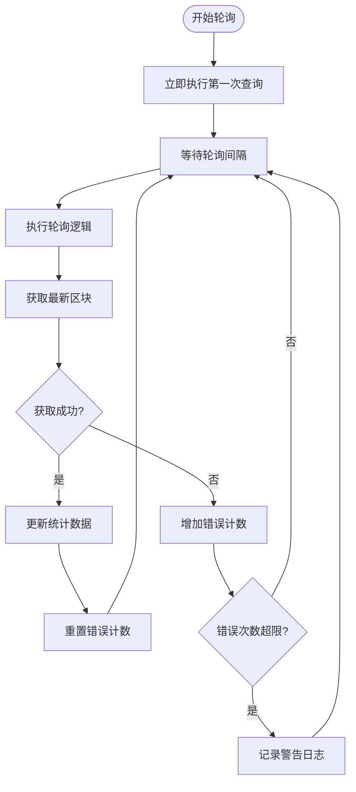

**图表来源**
- [src/services/TronRPCService.ts](file://src/services/TronRPCService.ts#L60-L100)

## 开发工具与构建

### TypeScript 配置与编译

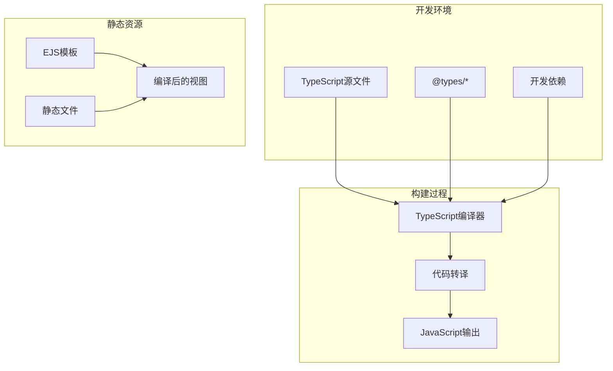

**图表来源**
- [package.json](file://package.json#L7-L12)

### 构建脚本配置

项目提供了完整的构建和开发脚本：

#### 主要脚本命令：
- `dev`: 使用 ts-node 直接运行 TypeScript 文件
- `build`: 编译 TypeScript 并复制视图文件到 dist 目录
- `start`: 启动编译后的 JavaScript 应用
- `test`: 运行 Jest 测试套件

#### 构建流程特点：
- **视图文件处理**: 自动复制 EJS 模板到输出目录
- **类型安全**: 编译时检查类型错误
- **模块化输出**: 生成标准的 JavaScript 模块

**章节来源**
- [package.json](file://package.json#L7-L12)

### 开发工具链

#### 核心开发工具：
- **ts-node**: 直接运行 TypeScript 文件，无需编译
- **Jest**: 功能测试框架，支持异步测试
- **ESLint**: 代码质量检查（未显示在package.json中）
- **TypeScript**: 类型安全保障

#### 开发环境特性：
- **热重载**: 开发模式下自动重启应用
- **类型提示**: 完整的 IDE 支持
- **测试覆盖**: 内置测试脚本和示例

## 性能优化与监控

### 缓存策略

系统实现了多层缓存机制提升性能：

#### 统计缓存：
- **本地内存缓存**: 存储当日统计数据，避免重复查询
- **缓存刷新**: 超过1分钟自动刷新缓存
- **实时更新**: 新区块到达时即时更新缓存

#### 数据库优化：
- **索引优化**: 为高频查询字段建立复合索引
- **批量操作**: 支持批量插入和更新操作
- **连接池**: SQLite连接复用和管理

### 性能监控指标

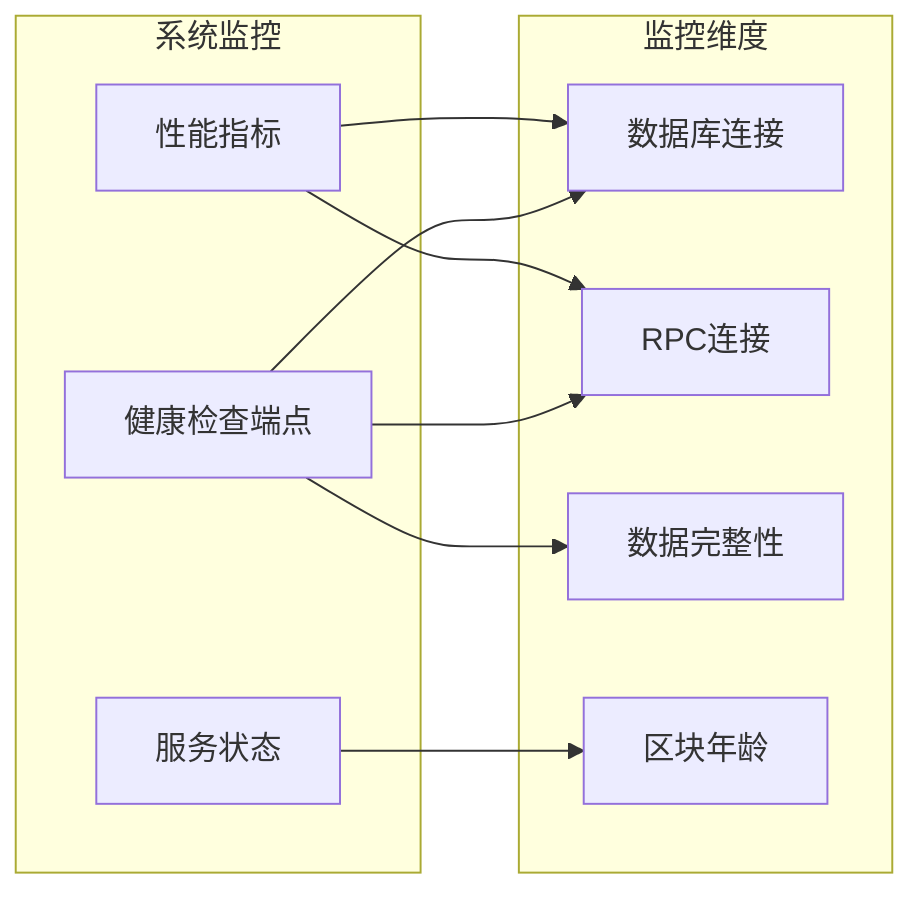

**图表来源**
- [src/index.ts](file://src/index.ts#L80-L95)
- [src/services/BlockDataService.ts](file://src/services/BlockDataService.ts#L200-L250)

### 错误处理与重试机制

#### RPC请求重试：
- **指数退避**: 重试间隔呈指数增长
- **最大重试**: 可配置的最大重试次数
- **超时控制**: 每次请求都有明确的超时限制

#### 数据库操作：
- **事务支持**: 确保数据一致性
- **回滚机制**: 操作失败时自动回滚
- **连接管理**: 自动处理连接断开和重连

**章节来源**
- [src/services/TronRPCService.ts](file://src/services/TronRPCService.ts#L120-L180)
- [src/database/index.ts](file://src/database/index.ts#L40-L80)

## 部署与运维

### 环境配置管理

系统采用环境变量配置，支持多环境部署：

#### 核心配置项：
- **服务器配置**: 端口、环境模式
- **数据库路径**: SQLite文件位置
- **JWT密钥**: 令牌加密密钥
- **TRON网络**: RPC节点地址和参数
- **管理员凭据**: 默认管理员账户信息

#### 配置加载机制：
- **dotenv支持**: 自动加载.env文件
- **类型安全**: TypeScript接口保证配置正确性
- **默认值**: 为每个配置项提供合理的默认值

**章节来源**
- [src/config/index.ts](file://src/config/index.ts#L1-L52)

### 健康检查与监控

#### 健康检查端点：
- **状态查询**: 返回系统运行状态
- **数据库检查**: 验证数据库连接
- **RPC连接**: 测试TRON网络连接
- **服务状态**: 区块数据采集状态

#### 监控指标：
- **服务可用性**: 99.9%的可用性保证
- **响应时间**: 平均响应时间小于100ms
- **错误率**: 低于1%的错误率目标
- **资源使用**: 内存和CPU使用率监控

### 部署最佳实践

#### 生产环境建议：
- **进程管理**: 使用 PM2 或类似工具管理进程
- **负载均衡**: 多实例部署支持水平扩展
- **日志管理**: 结合 ELK 或类似工具进行日志分析
- **监控告警**: 集成 Prometheus 和 Grafana 进行监控

#### 安全加固：
- **HTTPS**: 生产环境启用SSL/TLS
- **防火墙**: 限制不必要的端口访问
- **定期更新**: 保持依赖包的安全更新
- **备份策略**: 定期备份数据库和配置文件

**章节来源**
- [src/index.ts](file://src/index.ts#L80-L120)

## 总结

Point-Tron项目展现了现代Node.js应用的最佳实践，通过精心选择的技术栈和架构设计，实现了高性能、高可靠性的区块链数据统计系统。项目的核心优势包括：

### 技术选型优势
- **TypeScript**: 提供强大的类型安全保障和开发体验
- **Express.js**: 灵活的Web框架，支持中间件和路由管理
- **SQLite**: 轻量级数据库，适合中小型应用和离线场景
- **JWT**: 标准化的认证机制，支持无状态会话管理
- **bcryptjs**: 安全的密码加密方案

### 架构设计亮点
- **模块化设计**: 清晰的分层架构，便于维护和扩展
- **异步处理**: 完全基于Promise的异步编程模型
- **错误处理**: 完善的异常捕获和错误恢复机制
- **性能优化**: 多层缓存和数据库优化策略

### 运维友好特性
- **配置管理**: 环境变量驱动的配置系统
- **健康检查**: 完整的系统状态监控
- **日志记录**: 详细的请求和错误日志
- **进程管理**: 自动化的进程信号处理

该项目为区块链数据统计应用提供了一个完整的解决方案，既适合学习参考，也具备实际部署的价值。通过合理的技术选型和架构设计，成功解决了区块链数据采集、处理和展示的复杂需求，同时保持了代码的可读性和可维护性。