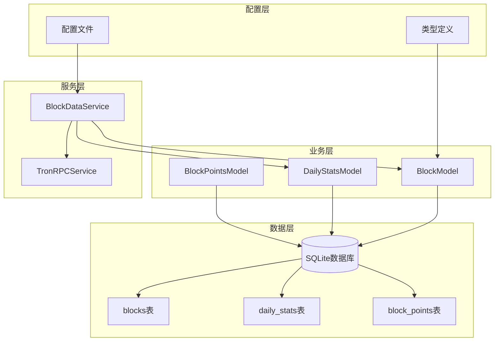
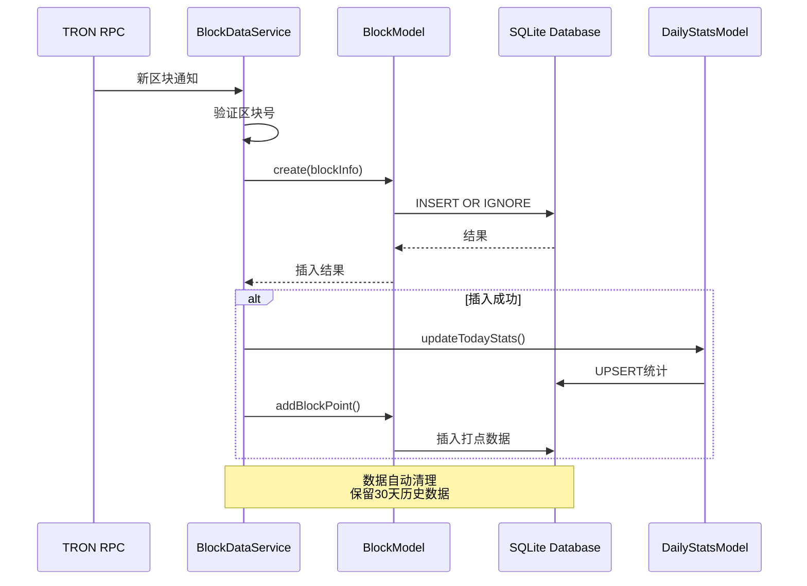
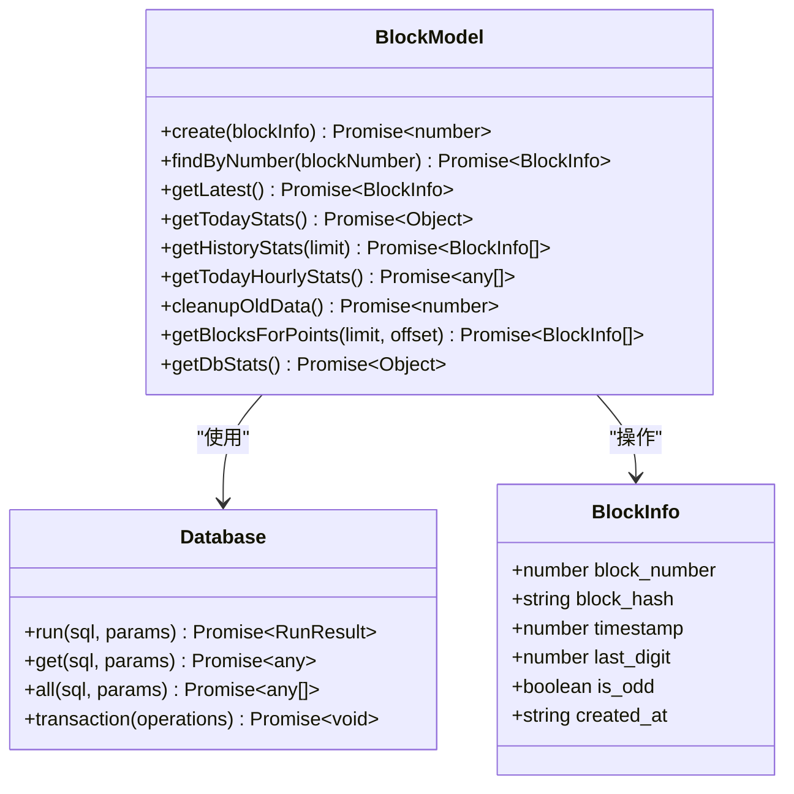
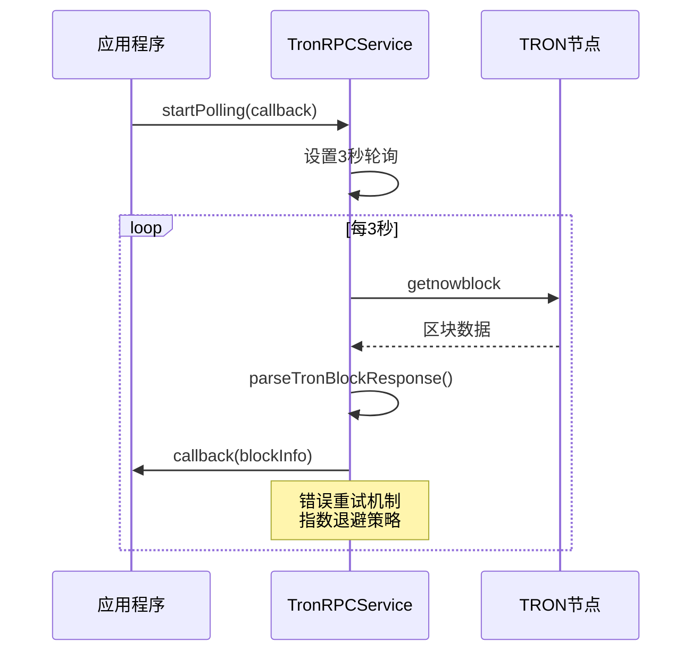
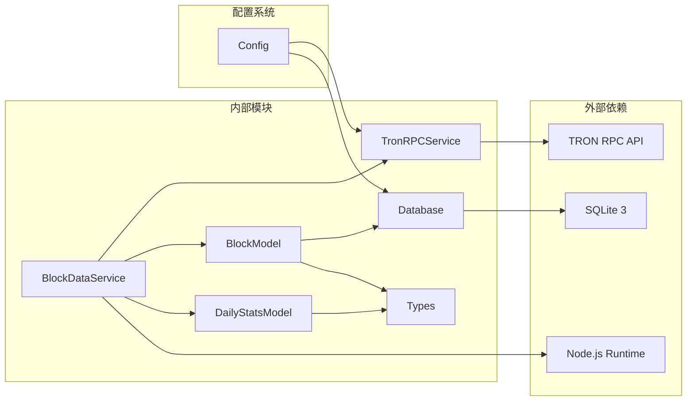

# 区块数据模型

<cite>
**本文档引用的文件**
- [BlockModel.ts](file://src/models/BlockModel.ts)
- [types.ts](file://src/models/types.ts)
- [database/index.ts](file://src/database/index.ts)
- [BlockDataService.ts](file://src/services/BlockDataService.ts)
- [TronRPCService.ts](file://src/services/TronRPCService.ts)
- [DailyStatsModel.ts](file://src/models/DailyStatsModel.ts)
</cite>

## 目录
1. [简介](#简介)
2. [项目结构概览](#项目结构概览)
3. [核心数据模型](#核心数据模型)
4. [架构概览](#架构概览)
5. [详细组件分析](#详细组件分析)
6. [依赖关系分析](#依赖关系分析)
7. [性能考虑](#性能考虑)
8. [故障排除指南](#故障排除指南)
9. [结论](#结论)

## 简介

区块数据模型是Point-Tron项目的核心组件，负责管理TRON区块链上的区块数据存储、检索和分析。该模型通过BlockModel类提供了完整的CRUD操作，支持高效的区块数据处理和统计分析功能。系统采用SQLite数据库作为持久化层，结合TRON RPC服务实现实时区块数据采集。

## 项目结构概览



**图表来源**
- [BlockModel.ts](file://src/models/BlockModel.ts#L1-L170)
- [database/index.ts](file://src/database/index.ts#L1-L249)

**章节来源**
- [BlockModel.ts](file://src/models/BlockModel.ts#L1-L170)
- [types.ts](file://src/models/types.ts#L1-L60)

## 核心数据模型

### BlockInfo接口定义

BlockInfo接口定义了区块数据的标准结构：

```typescript
export interface BlockInfo {
  id?: number;
  block_number: number;
  block_hash: string;
  timestamp: number;
  last_digit: number;
  is_odd: boolean;
  created_at?: string;
}
```

### blocks表字段详解

blocks表是系统的核心事实表，包含以下关键字段：

| 字段名 | 类型 | 约束 | 描述 |
|--------|------|------|------|
| id | INTEGER | PRIMARY KEY AUTOINCREMENT | 自增主键 |
| block_number | BIGINT | UNIQUE NOT NULL | 区块高度，唯一标识符 |
| block_hash | VARCHAR(66) | NOT NULL | 区块哈希值 |
| timestamp | BIGINT | NOT NULL | 毫秒级时间戳 |
| last_digit | INTEGER | NOT NULL | 哈希末位数字 |
| is_odd | BOOLEAN | NOT NULL | 单双数标志位 |
| created_at | TIMESTAMP | DEFAULT CURRENT_TIMESTAMP | 记录创建时间 |

### 设计理念

**block_number的唯一性约束**：确保每个区块只被记录一次，防止数据重复。当检测到UNIQUE约束冲突时，系统会静默忽略重复数据，避免影响整体流程。

**时间戳处理机制**：TRON网络返回的毫秒级时间戳需要转换为SQLite兼容格式。系统使用`datetime(timestamp/1000, 'unixepoch')`函数进行转换，支持精确的时间范围查询。

**is_odd字段设计**：该布尔字段存储为INTEGER类型（0或1），用于快速统计单双数分布。这种设计既节省存储空间，又便于SQL查询优化。

**章节来源**
- [BlockModel.ts](file://src/models/BlockModel.ts#L1-L170)
- [types.ts](file://src/models/types.ts#L1-L10)

## 架构概览



**图表来源**
- [BlockDataService.ts](file://src/services/BlockDataService.ts#L40-L80)
- [BlockModel.ts](file://src/models/BlockModel.ts#L5-L25)

## 详细组件分析

### BlockModel类分析

BlockModel类是区块数据操作的核心类，提供了完整的数据访问模式。



**图表来源**
- [BlockModel.ts](file://src/models/BlockModel.ts#L5-L170)
- [database/index.ts](file://src/database/index.ts#L10-L50)

#### 核心方法详解

**create()方法 - 安全插入机制**

```typescript
static async create(blockInfo: Omit<BlockInfo, 'id' | 'created_at'>): Promise<number>
```

该方法实现了智能的数据插入逻辑：
- 使用`INSERT OR IGNORE`语句避免重复插入
- 捕获UNIQUE约束异常并静默处理
- 返回-1表示重复数据，其他值表示新插入记录的ID

**getLatest()方法 - 实时数据获取**

```typescript
static async getLatest(): Promise<BlockInfo | null>
```

获取最新的区块信息，按block_number降序排列，确保始终返回当前最高区块。

**getTodayStats()方法 - 今日统计分析**

```typescript
static async getTodayStats(): Promise<{ total: number; odd: number; even: number }>
```

基于SQLite的CASE WHEN表达式实现高效统计：
- `SUM(CASE WHEN is_odd = 1 THEN 1 ELSE 0 END)`统计单数区块
- `SUM(CASE WHEN is_odd = 0 THEN 1 ELSE 0 END)`统计双数区块
- 支持毫秒级时间戳的日期转换

**getTodayHourlyStats()方法 - 时间粒度分析**

```typescript
static async getTodayHourlyStats(): Promise<any[]>
```

提供每小时的区块统计分布，使用`strftime('%H', ...)`提取小时部分，支持精细化的时间分析。

**cleanupOldData()方法 - 数据生命周期管理**

```typescript
static async cleanupOldData(): Promise<number>
```

实现30天数据保留策略：
- 计算30天前的时间戳阈值
- 批量删除过期记录
- 返回删除的记录数量

**章节来源**
- [BlockModel.ts](file://src/models/BlockModel.ts#L5-L170)

### TronRPCService集成



**图表来源**
- [TronRPCService.ts](file://src/services/TronRPCService.ts#L30-L80)
- [BlockDataService.ts](file://src/services/BlockDataService.ts#L40-L60)

#### 关键特性

**轮询机制**：每3秒轮询一次TRON节点，确保及时获取新区块。

**错误处理**：连续10次错误后发出警告，防止系统崩溃。

**数据解析**：从TRON区块响应中提取必要信息，包括区块号、哈希和时间戳。

**章节来源**
- [TronRPCService.ts](file://src/services/TronRPCService.ts#L1-L258)

### 数据库索引优化

系统在关键字段上建立了复合索引：

```sql
CREATE INDEX IF NOT EXISTS idx_blocks_number ON blocks(block_number);
CREATE INDEX IF NOT EXISTS idx_blocks_timestamp ON blocks(timestamp);
CREATE INDEX IF NOT EXISTS idx_daily_stats_date ON daily_stats(date);
CREATE INDEX IF NOT EXISTS idx_block_points_number ON block_points(block_number);
CREATE INDEX IF NOT EXISTS idx_block_points_timestamp ON block_points(timestamp);
```

这些索引显著提升了以下查询性能：
- 按区块号查询（`findByNumber`）
- 按时间范围查询（`getTodayStats`）
- 排序和分页操作（`getHistoryStats`）

**章节来源**
- [database/index.ts](file://src/database/index.ts#L80-L90)

## 依赖关系分析



**图表来源**
- [BlockModel.ts](file://src/models/BlockModel.ts#L1-L5)
- [database/index.ts](file://src/database/index.ts#L1-L10)

### 核心依赖关系

**BlockModel依赖**：
- `database`：SQLite数据库连接实例
- `BlockInfo`：数据接口定义
- `DailyStats`：统计接口

**BlockDataService依赖**：
- `TronRPCService`：TRON网络通信
- `BlockModel`：区块数据操作
- `DailyStatsModel`：统计数据管理

**章节来源**
- [BlockModel.ts](file://src/models/BlockModel.ts#L1-L5)
- [BlockDataService.ts](file://src/services/BlockDataService.ts#L1-L10)

## 性能考虑

### 查询性能优化建议

1. **时间范围查询优化**：
   ```sql
   -- 使用索引加速
   SELECT * FROM blocks 
   WHERE timestamp BETWEEN ? AND ?
   ORDER BY timestamp DESC
   ```

2. **批量插入事务控制**：
   ```typescript
   await database.transaction([
     () => database.run(sql1, params1),
     () => database.run(sql2, params2),
     () => database.run(sql3, params3)
   ]);
   ```

3. **统计查询优化**：
   - 使用`EXPLAIN QUERY PLAN`分析执行计划
   - 考虑为高频查询创建覆盖索引
   - 实现查询结果缓存机制

### 存储优化策略

1. **数据压缩**：定期归档历史数据
2. **索引维护**：定期重建碎片索引
3. **分区策略**：按时间维度分区存储

## 故障排除指南

### 常见问题及解决方案

**时间戳转换错误**
- **症状**：日期统计显示异常
- **原因**：毫秒级时间戳与SQLite函数不匹配
- **解决方案**：确保使用`timestamp/1000`进行转换

**重复数据插入**
- **症状**：UNIQUE约束冲突错误
- **原因**：并发处理导致重复插入
- **解决方案**：系统已内置IGNORE机制，无需额外处理

**TRON RPC连接超时**
- **症状**：轮询失败，连续错误
- **原因**：网络不稳定或节点不可达
- **解决方案**：检查网络连接，调整超时参数

**数据库锁定**
- **症状**：查询超时或死锁
- **原因**：长时间事务或并发写入
- **解决方案**：使用事务控制，避免长事务

**章节来源**
- [TronRPCService.ts](file://src/services/TronRPCService.ts#L120-L150)
- [BlockModel.ts](file://src/models/BlockModel.ts#L15-L25)

## 结论

区块数据模型通过精心设计的架构和优化策略，为TRON区块链数据分析提供了可靠的基础。其核心特性包括：

1. **数据完整性保障**：通过UNIQUE约束和错误处理确保数据质量
2. **高性能查询**：合理索引设计支持复杂统计分析
3. **可扩展性**：模块化设计便于功能扩展
4. **容错能力**：完善的错误处理和重试机制

该模型不仅满足了当前的功能需求，还为未来的扩展和优化奠定了坚实基础。通过持续的监控和调优，系统能够稳定地处理大规模的区块链数据处理任务。