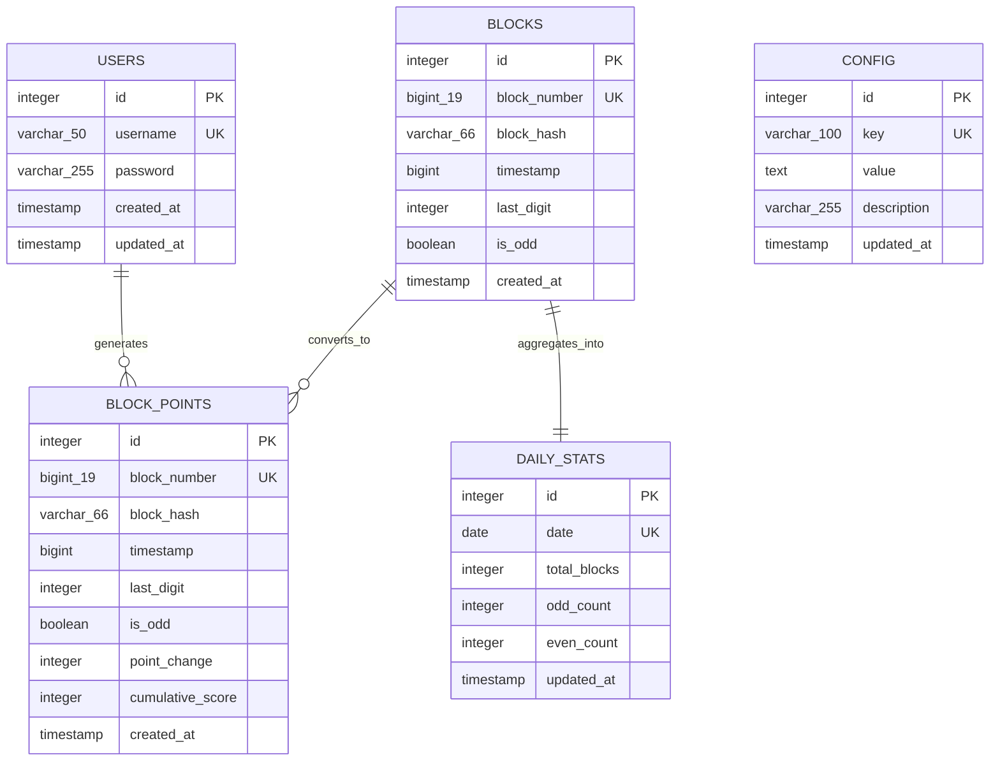
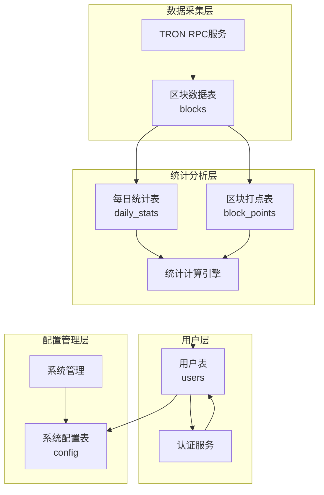
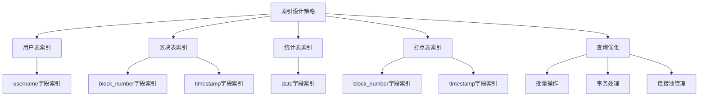
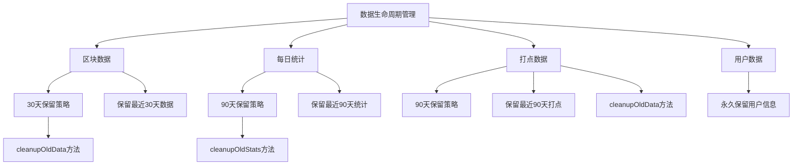

# 数据模型与数据库设计

<cite>
**本文档引用的文件**
- [UserModel.ts](file://src/models/UserModel.ts)
- [BlockModel.ts](file://src/models/BlockModel.ts)
- [DailyStatsModel.ts](file://src/models/DailyStatsModel.ts)
- [BlockPointsModel.ts](file://src/models/BlockPointsModel.ts)
- [types.ts](file://src/models/types.ts)
- [index.ts](file://src/database/index.ts)
- [index.ts](file://src/config/index.ts)
</cite>

## 目录
1. [简介](#简介)
2. [数据库架构概览](#数据库架构概览)
3. [核心数据模型](#核心数据模型)
4. [实体关系图](#实体关系图)
5. [索引设计与性能优化](#索引设计与性能优化)
6. [数据生命周期管理](#数据生命周期管理)
7. [事务处理与并发控制](#事务处理与并发控制)
8. [查询优化建议](#查询优化建议)
9. [故障排除指南](#故障排除指南)
10. [总结](#总结)

## 简介

本系统采用SQLite作为主数据库，设计了一套完整的数据模型来支持区块链区块监控、用户管理和积分统计功能。数据库设计遵循以下原则：
- **数据完整性**：通过唯一约束和外键关系确保数据一致性
- **性能优化**：合理设计索引和查询策略
- **可扩展性**：支持未来功能扩展和数据增长
- **数据安全**：实现密码加密和访问控制

## 数据库架构概览

系统使用SQLite数据库，主要包含以下核心表结构：



**图表来源**
- [index.ts](file://src/database/index.ts#L50-L150)
- [types.ts](file://src/models/types.ts#L1-L59)

## 核心数据模型

### 用户表（users）

用户表负责存储系统用户信息，采用bcrypt进行密码加密。

#### 字段定义

| 字段名 | 类型 | 约束 | 说明 |
|--------|------|------|------|
| id | INTEGER | PRIMARY KEY AUTOINCREMENT | 自增主键 |
| username | VARCHAR(50) | UNIQUE NOT NULL | 用户名，唯一约束 |
| password | VARCHAR(255) | NOT NULL | 加密后的密码 |
| created_at | TIMESTAMP | DEFAULT CURRENT_TIMESTAMP | 创建时间 |
| updated_at | TIMESTAMP | DEFAULT CURRENT_TIMESTAMP | 更新时间 |

#### 密码加密策略

系统使用bcrypt.js库实现密码加密，盐值成本为10。密码加密过程在用户注册时自动执行：

```typescript
// 密码加密示例
const hashedPassword = await bcrypt.hash(userData.password, 10);
```

#### 唯一约束

- `username`字段具有唯一约束，防止重复用户名
- `id`字段为主键，确保每条记录的唯一性

**章节来源**
- [UserModel.ts](file://src/models/UserModel.ts#L1-L100)
- [index.ts](file://src/database/index.ts#L50-L60)

### 区块数据表（blocks）

区块数据表存储从区块链网络获取的区块信息，包含区块号、哈希值、时间戳等关键数据。

#### 字段定义

| 字段名 | 类型 | 约束 | 说明 |
|--------|------|------|------|
| id | INTEGER | PRIMARY KEY AUTOINCREMENT | 自增主键 |
| block_number | BIGINT | UNIQUE NOT NULL | 区块高度，唯一约束 |
| block_hash | VARCHAR(66) | NOT NULL | 区块哈希值 |
| timestamp | BIGINT | NOT NULL | 区块时间戳（毫秒） |
| last_digit | INTEGER | NOT NULL | 区块号最后一位数字 |
| is_odd | BOOLEAN | NOT NULL | 是否为奇数区块 |
| created_at | TIMESTAMP | DEFAULT CURRENT_TIMESTAMP | 创建时间 |

#### 设计特点

1. **区块号唯一性**：`block_number`字段设置为唯一约束，确保每个区块只被记录一次
2. **时间戳处理**：使用BIGINT存储Unix时间戳，精确到毫秒级别
3. **单双数标志**：`is_odd`字段通过布尔值标记区块号的奇偶性
4. **最后一位数字**：`last_digit`字段提取区块号的最后一位，用于统计分析

#### 数据验证机制

系统实现了智能的数据验证机制，在插入新数据时会检查唯一性约束：

```typescript
// 重复检测逻辑
if (error?.message?.includes('UNIQUE constraint failed')) {
  console.log(`区块 ${blockInfo.block_number} 已存在，跳过插入`);
  return -1;
}
```

**章节来源**
- [BlockModel.ts](file://src/models/BlockModel.ts#L1-L170)
- [index.ts](file://src/database/index.ts#L61-L71)

### 每日统计表（daily_stats）

每日统计表采用UPSERT机制实现高效的数据更新和聚合。

#### 字段定义

| 字段名 | 类型 | 默认值 | 说明 |
|--------|------|--------|------|
| id | INTEGER | PRIMARY KEY AUTOINCREMENT | 自增主键 |
| date | DATE | UNIQUE NOT NULL | 统计日期，格式YYYY-MM-DD |
| total_blocks | INTEGER | 0 | 当日总区块数 |
| odd_count | INTEGER | 0 | 当日奇数区块数 |
| even_count | INTEGER | 0 | 当日偶数区块数 |
| updated_at | TIMESTAMP | CURRENT_TIMESTAMP | 更新时间 |

#### UPSERT机制

系统使用SQLite的UPSERT语法实现高效的统计更新：

```sql
INSERT INTO daily_stats (date, total_blocks, odd_count, even_count, updated_at) 
VALUES (?, 1, ?, ?, CURRENT_TIMESTAMP)
ON CONFLICT(date) DO UPDATE SET
  total_blocks = total_blocks + 1,
  odd_count = odd_count + ?,
  even_count = even_count + ?,
  updated_at = CURRENT_TIMESTAMP
```

#### 数据聚合逻辑

每日统计表通过以下方式实现数据聚合：
1. **增量更新**：每次新增区块时，使用UPSERT语句进行增量更新
2. **条件聚合**：使用CASE WHEN语句进行条件计数
3. **时间范围查询**：支持按日期范围查询历史统计数据

**章节来源**
- [DailyStatsModel.ts](file://src/models/DailyStatsModel.ts#L1-L165)
- [index.ts](file://src/database/index.ts#L72-L82)

### 区块打点计分表（block_points）

区块打点计分表专门用于记录区块的积分变化和累积分数。

#### 字段定义

| 字段名 | 类型 | 约束 | 说明 |
|--------|------|------|------|
| id | INTEGER | PRIMARY KEY AUTOINCREMENT | 自增主键 |
| block_number | BIGINT | UNIQUE NOT NULL | 区块高度，唯一约束 |
| block_hash | VARCHAR(66) | NOT NULL | 区块哈希值 |
| timestamp | BIGINT | NOT NULL | 区块时间戳 |
| last_digit | INTEGER | NOT NULL | 区块号最后一位数字 |
| is_odd | BOOLEAN | NOT NULL | 是否为奇数区块 |
| point_change | INTEGER | NOT NULL | 积分变化量（+1或-1） |
| cumulative_score | INTEGER | NOT NULL | 累积分数 |
| created_at | TIMESTAMP | DEFAULT CURRENT_TIMESTAMP | 创建时间 |

#### 积分规则

系统采用简单的积分规则：
- **双数区块**：+1分（point_change = 1）
- **单数区块**：-1分（point_change = -1）

#### 累积分数计算

累积分数通过以下算法计算：
```typescript
const pointChange = isOdd ? -1 : 1;
const newCumulativeScore = lastCumulativeScore + pointChange;
```

**章节来源**
- [BlockPointsModel.ts](file://src/models/BlockPointsModel.ts#L1-L218)
- [index.ts](file://src/database/index.ts#L83-L93)

## 实体关系图



**图表来源**
- [UserModel.ts](file://src/models/UserModel.ts#L1-L100)
- [BlockModel.ts](file://src/models/BlockModel.ts#L1-L170)
- [DailyStatsModel.ts](file://src/models/DailyStatsModel.ts#L1-L165)
- [BlockPointsModel.ts](file://src/models/BlockPointsModel.ts#L1-L218)

## 索引设计与性能优化

### 索引策略

系统为每个表的关键查询字段建立了适当的索引：



**图表来源**
- [index.ts](file://src/database/index.ts#L143-L148)

### 性能优化建议

1. **批量插入优化**
   - 使用事务包装多个插入操作
   - 控制批量大小避免内存溢出

2. **查询优化**
   - 利用索引加速查询
   - 避免SELECT *查询
   - 使用LIMIT限制结果集大小

3. **缓存策略**
   - 缓存频繁查询的结果
   - 实现查询结果缓存机制

**章节来源**
- [index.ts](file://src/database/index.ts#L143-L148)

## 数据生命周期管理

### 数据保留策略

系统实现了多层次的数据清理策略：



**图表来源**
- [BlockModel.ts](file://src/models/BlockModel.ts#L125-L135)
- [DailyStatsModel.ts](file://src/models/DailyStatsModel.ts#L150-L160)
- [BlockPointsModel.ts](file://src/models/BlockPointsModel.ts#L200-L210)

### 清理策略详情

1. **区块数据清理**
   ```typescript
   static async cleanupOldData(): Promise<number> {
     const thirtyDaysAgo = Date.now() - (30 * 24 * 60 * 60 * 1000);
     const result = await database.run(
       'DELETE FROM blocks WHERE timestamp < ?',
       [thirtyDaysAgo]
     );
     return result.changes || 0;
   }
   ```

2. **每日统计清理**
   ```typescript
   static async cleanupOldStats(keepDays: number = 90): Promise<number> {
     const cutoffDate = new Date();
     cutoffDate.setDate(cutoffDate.getDate() - keepDays);
     const cutoffDateStr = cutoffDate.toISOString().split('T')[0];
     
     const result = await database.run(
       'DELETE FROM daily_stats WHERE date < ?',
       [cutoffDateStr]
     );
     return result.changes || 0;
   }
   ```

**章节来源**
- [BlockModel.ts](file://src/models/BlockModel.ts#L125-L135)
- [DailyStatsModel.ts](file://src/models/DailyStatsModel.ts#L150-L160)
- [BlockPointsModel.ts](file://src/models/BlockPointsModel.ts#L200-L210)

## 事务处理与并发控制

### 事务管理

系统提供了完整的事务管理功能：

```typescript
public async transaction(operations: (() => Promise<any>)[]): Promise<void> {
  await this.run('BEGIN TRANSACTION');
  try {
    for (const operation of operations) {
      await operation();
    }
    await this.run('COMMIT');
  } catch (error) {
    await this.run('ROLLBACK');
    throw error;
  }
}
```

### 并发控制策略

1. **数据库锁机制**
   - SQLite默认使用行级锁
   - 事务期间自动锁定相关行

2. **乐观锁**
   - 使用版本号控制并发更新
   - 实现冲突检测和解决

3. **重试机制**
   - 对于死锁情况实现自动重试
   - 设置合理的重试次数和间隔

**章节来源**
- [index.ts](file://src/database/index.ts#L65-L80)

## 查询优化建议

### 高效查询模式

1. **分页查询**
   ```sql
   SELECT * FROM blocks 
   ORDER BY block_number DESC 
   LIMIT ? OFFSET ?
   ```

2. **时间范围查询**
   ```sql
   SELECT * FROM blocks 
   WHERE timestamp >= ? AND timestamp <= ?
   ORDER BY timestamp ASC
   ```

3. **聚合查询**
   ```sql
   SELECT 
     date(datetime(timestamp/1000, 'unixepoch')) as date,
     COUNT(*) as block_count,
     SUM(CASE WHEN is_odd = 1 THEN 1 ELSE 0 END) as odd_count
   FROM blocks 
   WHERE timestamp >= ? AND timestamp <= ?
   GROUP BY date
   ORDER BY date
   ```

### 查询性能优化

1. **索引使用**
   - 确保查询条件中的字段有适当索引
   - 避免全表扫描

2. **查询计划分析**
   - 使用EXPLAIN QUERY PLAN分析查询性能
   - 优化慢查询语句

3. **连接池配置**
   - 合理配置最大连接数
   - 实现连接复用机制

## 故障排除指南

### 常见问题及解决方案

1. **数据库连接问题**
   ```typescript
   // 检查数据库连接状态
   public isConnectedToDb(): boolean {
     return this.isConnected;
   }
   ```

2. **数据重复插入**
   ```typescript
   // 处理唯一约束冲突
   if (error?.message?.includes('UNIQUE constraint failed')) {
     console.log(`区块 ${blockInfo.block_number} 已存在，跳过插入`);
     return -1;
   }
   ```

3. **索引失效**
   - 检查索引是否正确创建
   - 重建损坏的索引

4. **性能问题**
   - 分析慢查询日志
   - 优化查询语句和索引

**章节来源**
- [index.ts](file://src/database/index.ts#L230-L240)
- [BlockModel.ts](file://src/models/BlockModel.ts#L15-L25)

## 总结

本数据模型设计充分考虑了区块链应用的特点和需求，通过合理的表结构设计、索引优化和数据生命周期管理，实现了高性能、高可靠性的数据存储方案。

### 主要优势

1. **数据完整性**：通过唯一约束和验证机制确保数据质量
2. **查询效率**：合理索引设计支持快速查询
3. **数据安全**：密码加密和访问控制保护敏感信息
4. **可维护性**：清晰的表结构和完善的清理策略
5. **扩展性**：模块化设计支持功能扩展

### 未来改进方向

1. **分区表**：对于大规模数据，可以考虑使用SQLite的分区表功能
2. **备份策略**：实现定期自动备份机制
3. **监控告警**：建立数据库性能监控和告警系统
4. **读写分离**：对于高并发场景，可以考虑读写分离架构

通过持续的优化和改进，该数据模型能够很好地支撑系统的长期稳定运行。