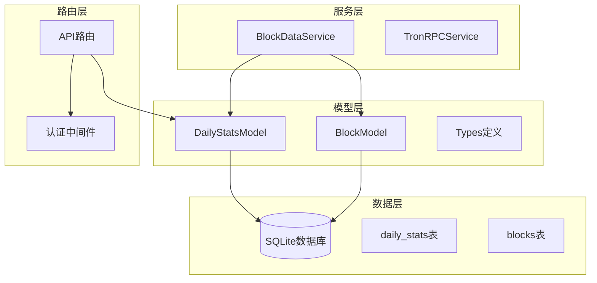
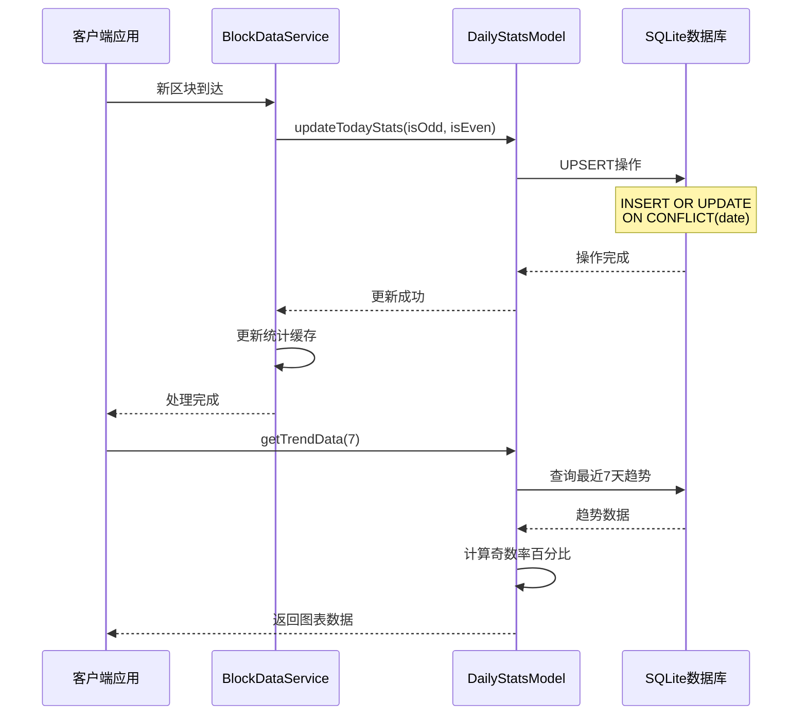
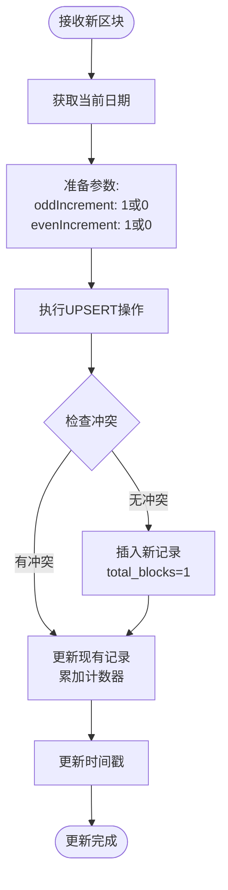
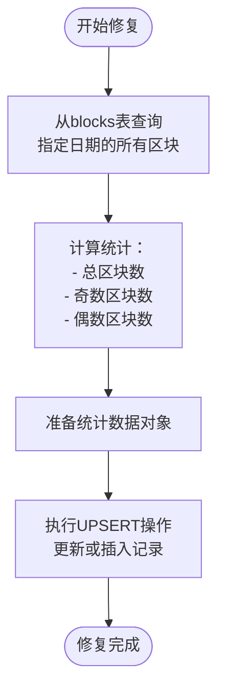
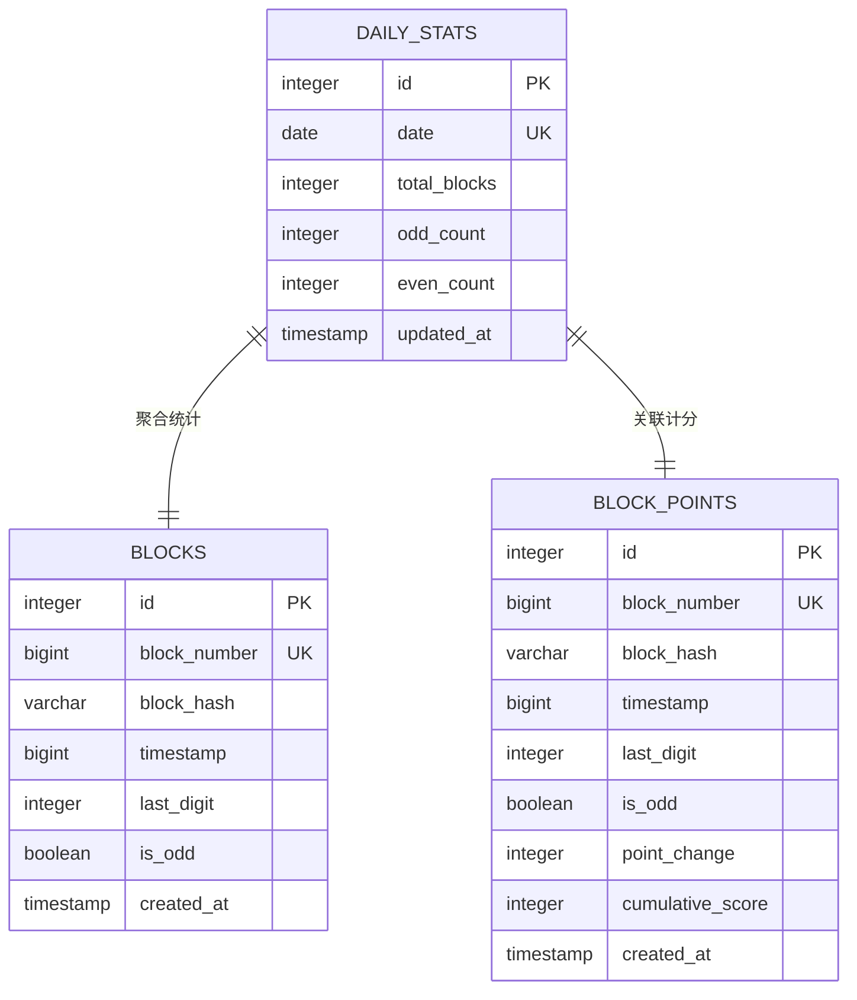
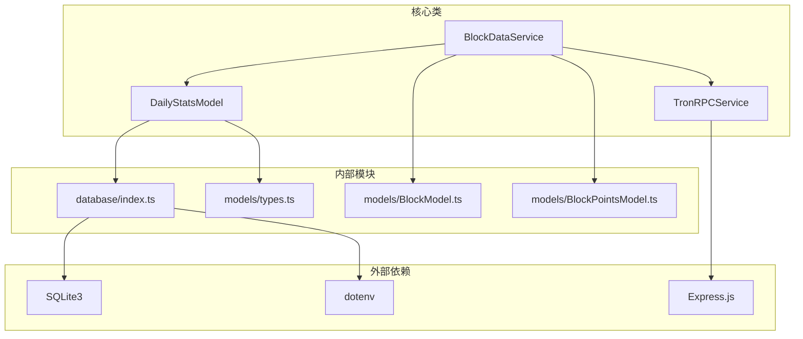
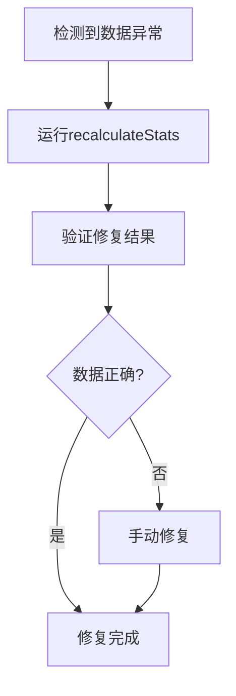

# 每日统计模型

<cite>
**本文档引用的文件**
- [DailyStatsModel.ts](file://src/models/DailyStatsModel.ts)
- [types.ts](file://src/models/types.ts)
- [index.ts](file://src/database/index.ts)
- [BlockDataService.ts](file://src/services/BlockDataService.ts)
- [blocks.ts](file://src/routes/blocks.ts)
- [index.ts](file://src/config/index.ts)
</cite>

## 目录
1. [简介](#简介)
2. [项目结构](#项目结构)
3. [核心组件](#核心组件)
4. [架构概览](#架构概览)
5. [详细组件分析](#详细组件分析)
6. [依赖关系分析](#依赖关系分析)
7. [性能考虑](#性能考虑)
8. [故障排除指南](#故障排除指南)
9. [结论](#结论)

## 简介

每日统计模型（DailyStatsModel）是Point-Tron项目中的核心数据聚合组件，负责维护区块链区块的每日统计信息。该模型通过SQLite数据库的UPSER机制实现高效的数据更新，并提供了完整的统计数据分析功能，支持实时监控、历史趋势分析和数据修复等关键业务需求。

## 项目结构



**图表来源**
- [DailyStatsModel.ts](file://src/models/DailyStatsModel.ts#L1-L165)
- [BlockDataService.ts](file://src/services/BlockDataService.ts#L1-L273)
- [index.ts](file://src/database/index.ts#L1-L249)

## 核心组件

### 表结构设计

daily_stats表采用简洁而高效的结构设计：

```sql
CREATE TABLE IF NOT EXISTS daily_stats (
  id INTEGER PRIMARY KEY AUTOINCREMENT,
  date DATE UNIQUE NOT NULL,
  total_blocks INTEGER DEFAULT 0,
  odd_count INTEGER DEFAULT 0,
  even_count INTEGER DEFAULT 0,
  updated_at TIMESTAMP DEFAULT CURRENT_TIMESTAMP
)
```

**字段定义：**
- `date`：主键，YYYY-MM-DD格式，唯一标识每一天
- `total_blocks`：当日总区块数，初始值为0
- `odd_count`：当日奇数区块数，初始值为0
- `even_count`：当日偶数区块数，初始值为0
- `updated_at`：最后更新时间戳

**章节来源**
- [index.ts](file://src/database/index.ts#L67-L75)

### 数据类型定义

```typescript
export interface DailyStats {
  id?: number;
  date: string;
  total_blocks: number;
  odd_count: number;
  even_count: number;
  updated_at?: string;
}
```

**章节来源**
- [types.ts](file://src/models/types.ts#L20-L25)

## 架构概览



**图表来源**
- [BlockDataService.ts](file://src/services/BlockDataService.ts#L60-L95)
- [DailyStatsModel.ts](file://src/models/DailyStatsModel.ts#L6-L25)

## 详细组件分析

### UPSE机制实现

DailyStatsModel的核心特性是使用SQLite的ON CONFLICT DO UPDATE语法实现UPSERT操作：

```typescript
static async updateTodayStats(oddIncrement: number = 0, evenIncrement: number = 0): Promise<void> {
  const today = new Date().toISOString().split('T')[0];
  
  await database.run(
    `INSERT INTO daily_stats (date, total_blocks, odd_count, even_count, updated_at) 
     VALUES (?, 1, ?, ?, CURRENT_TIMESTAMP)
     ON CONFLICT(date) DO UPDATE SET
       total_blocks = total_blocks + 1,
       odd_count = odd_count + ?,
       even_count = even_count + ?,
       updated_at = CURRENT_TIMESTAMP`,
    [today, oddIncrement, evenIncrement, oddIncrement, evenIncrement]
  );
}
```

**实现原理：**
1. **首次插入**：当某天第一次有区块时，插入新记录，total_blocks初始为1
2. **后续更新**：当某天已有记录时，执行UPDATE操作，累加计数器
3. **原子性保证**：SQLite的ON CONFLICT语法确保操作的原子性

**章节来源**
- [DailyStatsModel.ts](file://src/models/DailyStatsModel.ts#L6-L25)

### 动态统计更新机制

updateTodayStats()方法根据新增区块动态调整奇偶计数：



**图表来源**
- [DailyStatsModel.ts](file://src/models/DailyStatsModel.ts#L6-L25)

### 趋势数据生成

getTrendData()方法生成图表所需的趋势数据，包含奇数率计算：

```typescript
static async getTrendData(days: number = 7): Promise<Array<{
  date: string;
  total: number;
  odd: number;
  even: number;
  oddRate: number;
}>> {
  const results = await database.all(
    `SELECT 
      date,
      total_blocks as total,
      odd_count as odd,
      even_count as even,
      CASE 
        WHEN total_blocks > 0 THEN ROUND((odd_count * 100.0 / total_blocks), 2)
        ELSE 0 
      END as oddRate
     FROM daily_stats 
     ORDER BY date DESC 
     LIMIT ?`,
    [days]
  );
  
  return results.reverse(); // 按日期正序返回
}
```

**奇数率计算公式：**
```
oddRate = ROUND((odd_count * 100.0 / total_blocks), 2)
```

**章节来源**
- [DailyStatsModel.ts](file://src/models/DailyStatsModel.ts#L81-L102)

### 数据修复功能

recalculateStats()方法提供手动重新计算统计数据的功能：



**图表来源**
- [DailyStatsModel.ts](file://src/models/DailyStatsModel.ts#L104-L142)

### 数据生命周期管理

cleanupOldStats()方法实现数据清理策略，默认保留90天历史统计：

```typescript
static async cleanupOldStats(keepDays: number = 90): Promise<number> {
  const cutoffDate = new Date();
  cutoffDate.setDate(cutoffDate.getDate() - keepDays);
  const cutoffDateStr = cutoffDate.toISOString().split('T')[0];
  
  const result = await database.run(
    'DELETE FROM daily_stats WHERE date < ?',
    [cutoffDateStr]
  );
  
  return result.changes || 0;
}
```

**章节来源**
- [DailyStatsModel.ts](file://src/models/DailyStatsModel.ts#L144-L164)

### 实体关系图



**图表来源**
- [index.ts](file://src/database/index.ts#L67-L75)
- [index.ts](file://src/database/index.ts#L47-L55)
- [index.ts](file://src/database/index.ts#L85-L95)

## 依赖关系分析



**图表来源**
- [DailyStatsModel.ts](file://src/models/DailyStatsModel.ts#L1-L3)
- [BlockDataService.ts](file://src/services/BlockDataService.ts#L1-L5)

**章节来源**
- [DailyStatsModel.ts](file://src/models/DailyStatsModel.ts#L1-L165)
- [BlockDataService.ts](file://src/services/BlockDataService.ts#L1-L273)

## 性能考虑

### 索引建议

1. **主键索引**：date字段作为主键已自动创建索引
2. **复合索引建议**：
   ```sql
   CREATE INDEX idx_daily_stats_date_total ON daily_stats(date, total_blocks);
   ```

3. **查询优化**：
   - 对于月度汇总查询，建议添加复合索引
   - 考虑为高频查询字段创建索引

### 性能优化建议

1. **批量更新**：对于大量数据更新，考虑批量操作
2. **缓存策略**：实现统计结果缓存减少数据库查询
3. **异步处理**：统计更新可以异步化处理
4. **分区表**：对于长期存储，考虑按年份分区

### 数据库配置优化

```typescript
// 推荐的SQLite配置
{
  journal_mode: 'WAL',
  synchronous: 'NORMAL',
  cache_size: 10000,
  temp_store: 'MEMORY'
}
```

## 故障排除指南

### 常见问题及解决方案

#### 1. UPSERT失败排查

**症状**：updateTodayStats()方法抛出异常
**排查步骤**：
1. 检查数据库连接状态
2. 验证date字段格式是否正确
3. 确认数据库权限设置
4. 查看SQLite版本是否支持ON CONFLICT语法

**解决方案**：
```typescript
try {
  await DailyStatsModel.updateTodayStats(1, 0);
} catch (error) {
  console.error('统计更新失败:', error.message);
  // 尝试回退到手动删除再插入
  await database.run('DELETE FROM daily_stats WHERE date = ?', [today]);
  await DailyStatsModel.updateTodayStats(1, 0);
}
```

#### 2. 数据不一致问题

**症状**：getTrendData()返回的奇数率异常
**排查方法**：
1. 检查recalculateStats()方法执行情况
2. 验证blocks表数据完整性
3. 确认is_odd字段计算准确性

**修复流程**：


#### 3. 性能问题诊断

**症状**：getTrendData()查询缓慢
**诊断步骤**：
1. 使用EXPLAIN QUERY PLAN分析查询计划
2. 检查索引使用情况
3. 分析数据量增长趋势

**优化措施**：
```sql
-- 分析查询性能
EXPLAIN QUERY PLAN SELECT * FROM daily_stats ORDER BY date DESC LIMIT 7;

-- 创建优化索引
CREATE INDEX idx_daily_stats_date_desc ON daily_stats(date DESC);
```

**章节来源**
- [DailyStatsModel.ts](file://src/models/DailyStatsModel.ts#L104-L142)

## 结论

DailyStatsModel作为Point-Tron项目的核心数据聚合组件，通过精心设计的UPSER机制实现了高效的统计更新，同时提供了完整的数据分析功能。其简洁的表结构、灵活的查询接口和可靠的数据修复功能，为整个系统的数据驱动决策提供了坚实的基础。

**关键优势：**
1. **高效更新**：SQLite的ON CONFLICT语法确保原子性更新
2. **完整功能**：涵盖实时统计、历史趋势、数据修复等全场景需求
3. **易于维护**：清晰的代码结构和完善的错误处理
4. **可扩展性**：良好的设计模式支持未来功能扩展

**改进建议：**
1. 实现更细粒度的缓存策略
2. 添加更多统计指标和分析维度
3. 优化大数据量下的查询性能
4. 增强数据验证和完整性检查