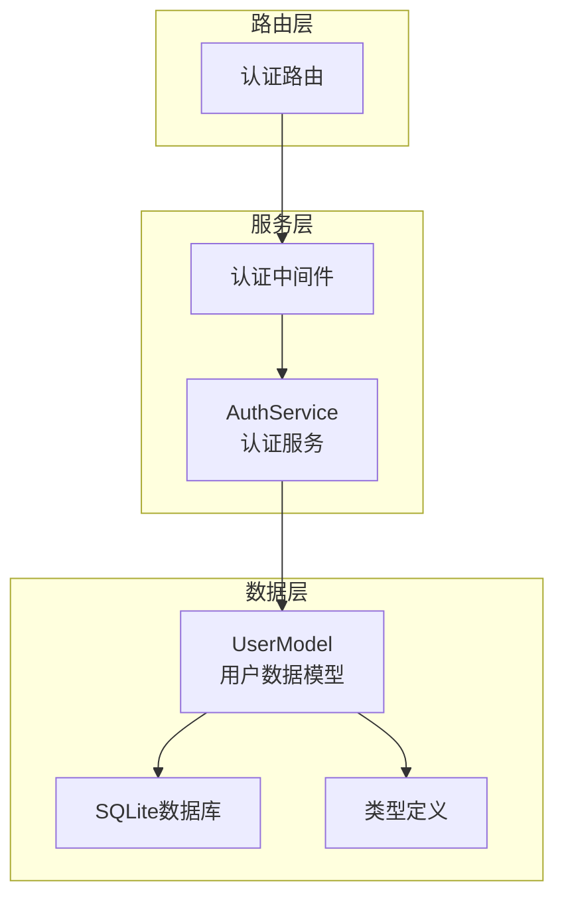
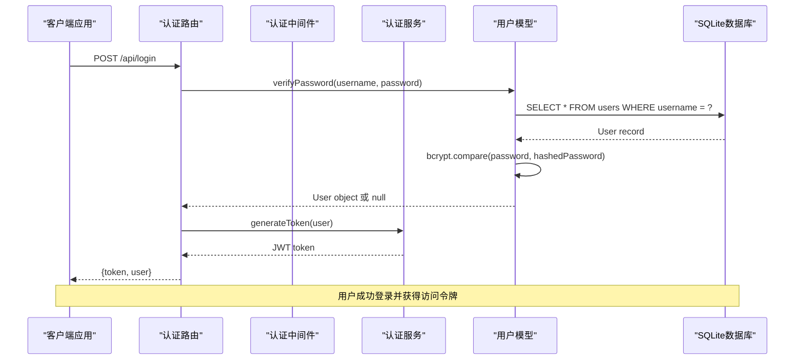
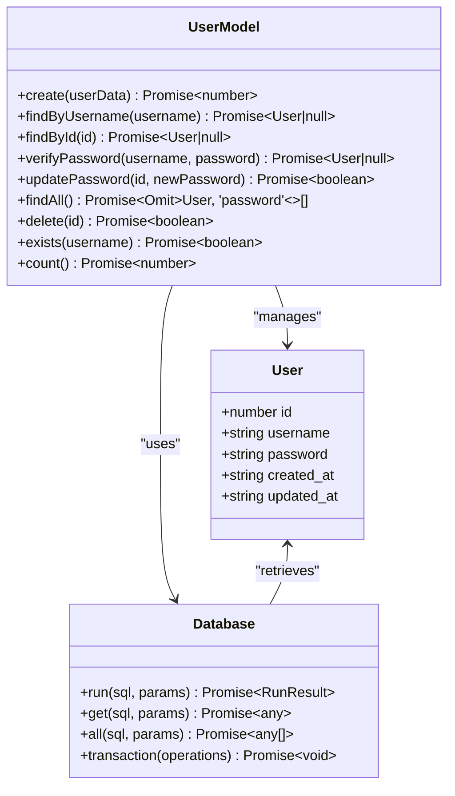
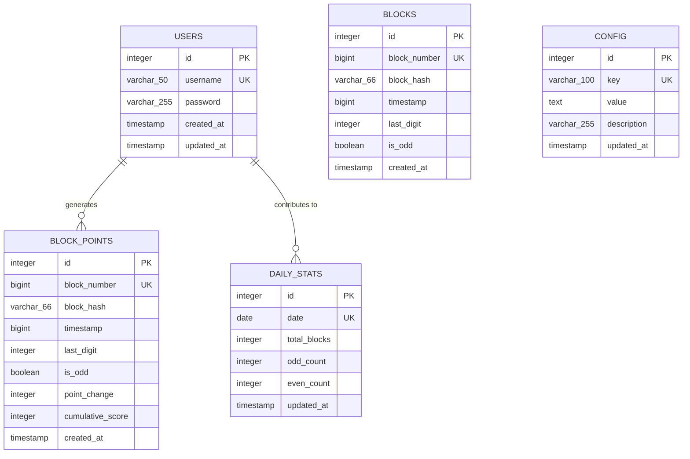
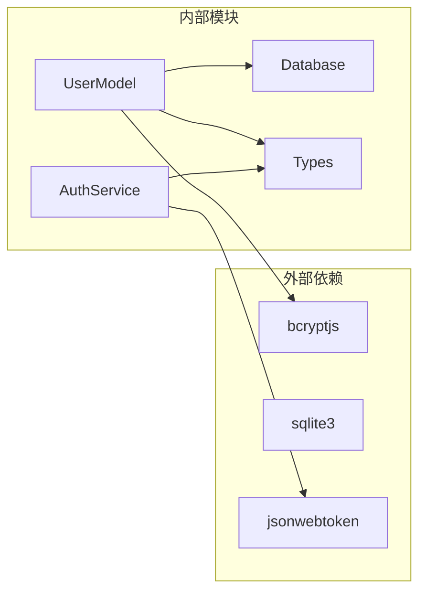

# 用户数据模型

<cite>
**本文档引用的文件**
- [UserModel.ts](file://src/models/UserModel.ts)
- [types.ts](file://src/models/types.ts)
- [database/index.ts](file://src/database/index.ts)
- [AuthService.ts](file://src/services/AuthService.ts)
- [auth.ts](file://src/middleware/auth.ts)
- [auth.ts](file://src/routes/auth.ts)
</cite>

## 目录
1. [简介](#简介)
2. [项目结构](#项目结构)
3. [核心组件](#核心组件)
4. [架构概览](#架构概览)
5. [详细组件分析](#详细组件分析)
6. [依赖关系分析](#依赖关系分析)
7. [性能考虑](#性能考虑)
8. [故障排除指南](#故障排除指南)
9. [结论](#结论)

## 简介

用户数据模型是Point-Tron系统的核心组件之一，负责管理用户账户的完整生命周期。该模型采用现代TypeScript设计模式，提供了安全、高效的用户数据访问和管理功能。通过SQLite数据库存储用户信息，实现了完整的身份验证和授权机制。

## 项目结构

用户数据模型位于`src/models/UserModel.ts`文件中，作为系统数据层的重要组成部分。该文件包含了用户相关的所有数据库操作逻辑，包括用户创建、查询、密码验证和管理等功能。



**图表来源**
- [UserModel.ts](file://src/models/UserModel.ts#L1-L100)
- [database/index.ts](file://src/database/index.ts#L1-L50)

**章节来源**
- [UserModel.ts](file://src/models/UserModel.ts#L1-L100)
- [types.ts](file://src/models/types.ts#L1-L60)

## 核心组件

### 用户模型类 (UserModel)

UserModel类是整个用户数据模型的核心，提供了完整的CRUD操作和身份验证功能：

- **静态方法设计**：所有方法均为静态，便于直接调用而无需实例化
- **异步操作**：所有数据库操作均采用Promise模式，支持现代JavaScript异步编程
- **参数验证**：内置输入验证机制，确保数据完整性
- **错误处理**：完善的错误处理和异常捕获机制

### 数据库表结构

用户表(users)采用以下字段设计：

```sql
CREATE TABLE users (
  id INTEGER PRIMARY KEY AUTOINCREMENT,
  username VARCHAR(50) UNIQUE NOT NULL,
  password VARCHAR(255) NOT NULL,
  created_at TIMESTAMP DEFAULT CURRENT_TIMESTAMP,
  updated_at TIMESTAMP DEFAULT CURRENT_TIMESTAMP
)
```

**章节来源**
- [UserModel.ts](file://src/models/UserModel.ts#L1-L100)
- [database/index.ts](file://src/database/index.ts#L60-L70)

## 架构概览

用户数据模型采用分层架构设计，清晰分离关注点：



**图表来源**
- [auth.ts](file://src/routes/auth.ts#L10-L40)
- [auth.ts](file://src/middleware/auth.ts#L15-L50)
- [UserModel.ts](file://src/models/UserModel.ts#L35-L45)

## 详细组件分析

### 密码加密策略

系统采用bcrypt哈希算法保护用户密码，具有以下特点：

```typescript
// 密码加密实现
const hashedPassword = await bcrypt.hash(userData.password, 10);
```

- **哈希强度**：使用10轮加密（cost factor = 10），平衡安全性和性能
- **盐值生成**：bcrypt自动处理盐值生成，确保相同密码产生不同哈希值
- **不可逆性**：密码经过单向哈希处理，无法还原原始密码
- **安全性**：抵御彩虹表攻击和暴力破解

### 核心方法详解

#### 1. 用户创建方法 (create)

```typescript
static async create(userData: Omit<User, 'id' | 'created_at' | 'updated_at'>): Promise<number>
```

- **参数处理**：移除id、created_at、updated_at字段，确保数据一致性
- **密码加密**：自动对明文密码进行bcrypt哈希处理
- **返回值**：返回新创建用户的ID值
- **异常处理**：捕获数据库约束冲突等异常情况

#### 2. 用户查询方法

##### findByUsername方法
```typescript
static async findByUsername(username: string): Promise<User | null>
```

- **查询优化**：使用唯一索引加速用户名查询
- **结果处理**：返回null而非抛出异常，便于业务逻辑处理
- **数据完整性**：返回完整的用户记录包含密码字段

##### findById方法
```typescript
static async findById(id: number): Promise<User | null>
```

- **主键查询**：利用SQLite的主键索引实现快速查询
- **性能优化**：相比模糊查询，主键查询具有O(log n)的时间复杂度
- **数据验证**：确保用户ID的有效性

#### 3. 密码验证方法 (verifyPassword)

```typescript
static async verifyPassword(username: string, password: string): Promise<User | null>
```

- **两阶段验证**：
  1. 首先通过用户名查找用户
  2. 使用bcrypt.compare验证密码
- **安全设计**：即使用户名不存在，也返回null，避免信息泄露
- **性能考虑**：bcrypt.compare具有恒定时间复杂度，防止时序攻击

#### 4. 数据访问模式

系统采用安全的数据访问模式：

```typescript
// 获取所有用户（不包括密码）
static async findAll(): Promise<Omit<User, 'password'>[]>
```

- **隐私保护**：在返回用户列表时移除password字段
- **性能优化**：只查询必要的字段，减少网络传输和内存占用
- **类型安全**：使用TypeScript的Omit类型确保编译时检查



**图表来源**
- [UserModel.ts](file://src/models/UserModel.ts#L5-L100)
- [types.ts](file://src/models/types.ts#L8-L15)

**章节来源**
- [UserModel.ts](file://src/models/UserModel.ts#L5-L100)
- [types.ts](file://src/models/types.ts#L1-L60)

### 实体关系图

用户表在系统中保持相对独立的设计：



**图表来源**
- [database/index.ts](file://src/database/index.ts#L60-L120)

**章节来源**
- [database/index.ts](file://src/database/index.ts#L60-L120)

## 依赖关系分析

用户数据模型的依赖关系清晰明确：



**图表来源**
- [UserModel.ts](file://src/models/UserModel.ts#L1-L3)
- [AuthService.ts](file://src/services/AuthService.ts#L1-L3)

**章节来源**
- [UserModel.ts](file://src/models/UserModel.ts#L1-L100)
- [AuthService.ts](file://src/services/AuthService.ts#L1-L104)

## 性能考虑

### 索引优化建议

1. **用户名唯一索引**：确保username字段具有UNIQUE约束
2. **时间戳索引**：为created_at和updated_at字段创建索引
3. **复合索引**：考虑为常用查询组合创建复合索引

### 缓存策略

在高并发场景下，建议实施以下缓存策略：

```typescript
// 示例：用户名查询缓存
const cache = new Map<string, User | null>();
const cachedFindByUsername = async (username: string): Promise<User | null> => {
  if (cache.has(username)) {
    return cache.get(username)!;
  }
  
  const user = await UserModel.findByUsername(username);
  cache.set(username, user);
  
  // 设置缓存过期时间（例如5分钟）
  setTimeout(() => cache.delete(username), 300000);
  
  return user;
};
```

### 事务处理注意事项

- **原子性**：涉及多个表的操作应使用事务保证一致性
- **隔离级别**：根据业务需求选择合适的隔离级别
- **死锁预防**：按固定顺序访问表，避免循环等待

## 故障排除指南

### 常见问题及解决方案

#### 1. 密码验证失败

**症状**：用户登录时提示"用户名或密码错误"

**排查步骤**：
1. 检查用户名是否存在：`await UserModel.exists(username)`
2. 验证密码哈希格式：确保密码字段长度符合bcrypt要求
3. 测试密码比较：`await bcrypt.compare(password, storedHash)`
4. 检查数据库连接状态

#### 2. 数据库约束冲突

**症状**：插入用户时出现"UNIQUE constraint failed"错误

**解决方案**：
```typescript
try {
  const userId = await UserModel.create(userData);
  return userId;
} catch (error) {
  if (error.code === 'SQLITE_CONSTRAINT') {
    throw new Error('用户名已存在');
  }
  throw error;
}
```

#### 3. 性能问题

**症状**：用户查询响应缓慢

**优化措施**：
- 添加适当的数据库索引
- 使用预编译语句
- 实施查询结果缓存
- 优化数据库连接池配置

**章节来源**
- [UserModel.ts](file://src/models/UserModel.ts#L35-L45)
- [database/index.ts](file://src/database/index.ts#L1-L50)

## 结论

用户数据模型是Point-Tron系统安全性和可靠性的基石。通过采用现代TypeScript设计模式、bcrypt密码加密、SQLite数据库和JWT认证机制，该模型提供了：

- **安全性**：强密码加密和安全的身份验证流程
- **可维护性**：清晰的代码结构和完善的错误处理
- **性能**：优化的数据库查询和合理的缓存策略
- **扩展性**：模块化的架构设计便于功能扩展

该模型为系统提供了坚实的用户管理基础，支持未来的功能扩展和性能优化需求。开发者在使用过程中应遵循最佳实践，注意安全配置和性能监控，确保系统的长期稳定运行。