# Point-Tron项目测试扩展方案

<cite>
**本文档引用的文件**
- [test-fixed-query.js](file://test-fixed-query.js)
- [src/services/TronRPCService.ts](file://src/services/TronRPCService.ts)
- [src/services/BlockDataService.ts](file://src/services/BlockDataService.ts)
- [src/models/BlockPointsModel.ts](file://src/models/BlockPointsModel.ts)
- [src/routes/blocks.ts](file://src/routes/blocks.ts)
- [package.json](file://package.json)
</cite>

## 目录
1. [引言](#引言)
2. [现有测试分析](#现有测试分析)
3. [测试框架推荐](#测试框架推荐)
4. [单元测试策略](#单元测试策略)
5. [集成测试策略](#集成测试策略)
6. [测试基础设施](#测试基础设施)
7. [CI/CD集成](#cicd集成)
8. [性能测试](#性能测试)
9. [测试最佳实践](#测试最佳实践)
10. [总结](#总结)

## 引言

Point-Tron项目是一个基于TypeScript的TRON波场网络区块链数据统计后台管理系统。该项目具有复杂的业务逻辑，包括区块数据采集、分数计算、数据库操作和API服务等多个层面。为了确保系统的稳定性和可靠性，需要建立全面的测试体系。

现有的`test-fixed-query.js`脚本展示了项目在数据库查询逻辑验证方面的初步尝试，特别是对`block_points`表按时间范围和区块高度排序的复合查询逻辑的测试方法。这个脚本为我们提供了宝贵的参考，表明项目已经意识到测试的重要性，但目前的测试覆盖范围有限，缺乏系统性的测试框架。

## 现有测试分析

### test-fixed-query.js的价值评估

`test-fixed-query.js`脚本体现了以下重要价值：

1. **数据库查询验证**: 该脚本专门验证了修复后的复杂查询逻辑，确保按时间范围和区块高度排序的正确性
2. **数据完整性检查**: 通过统计分析验证查询结果的完整性和一致性
3. **边界条件测试**: 模拟1天时间范围的数据查询，测试边界条件下的表现
4. **性能监控**: 提供查询性能指标和统计信息

### 现有测试的局限性

1. **手动执行**: 需要手动运行，无法自动化
2. **孤立测试**: 缺乏与其他组件的集成测试
3. **无断言**: 没有明确的断言机制
4. **无覆盖率**: 无法跟踪测试覆盖率
5. **无持续集成**: 无法与CI/CD流水线集成

**章节来源**
- [test-fixed-query.js](file://test-fixed-query.js#L1-L87)

## 测试框架推荐

### Jest vs Mocha对比

基于项目的TypeScript环境和需求，推荐使用Jest作为主要测试框架：

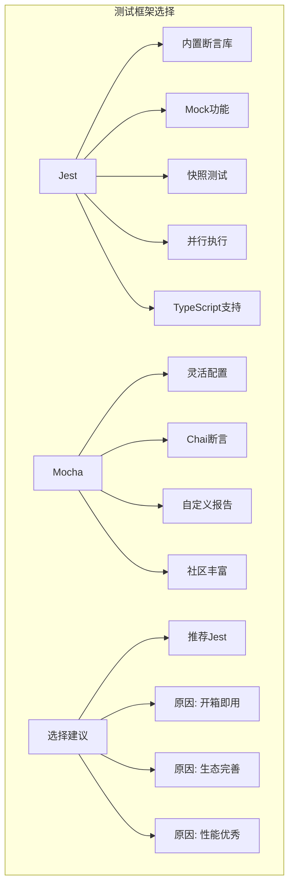

### 推荐的测试工具栈

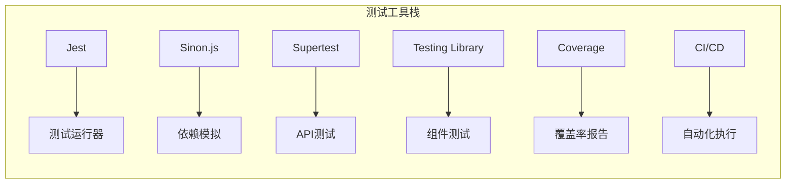

## 单元测试策略

### TronRPCService单元测试

基于`TronRPCService.ts`的分析，需要为以下关键方法编写单元测试：

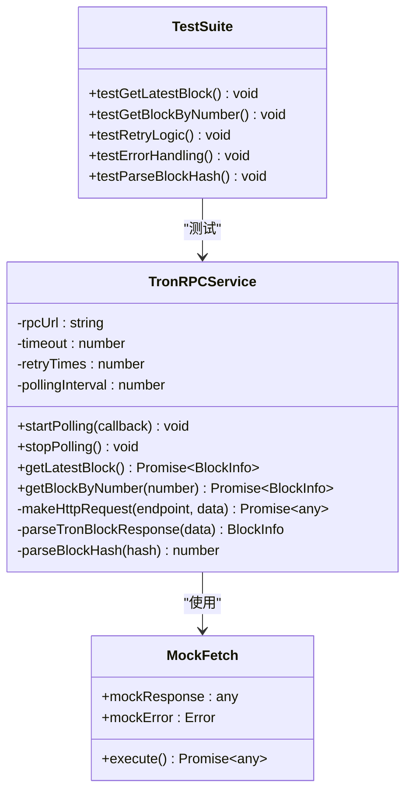

**图表来源**
- [src/services/TronRPCService.ts](file://src/services/TronRPCService.ts#L1-L258)

#### 关键测试场景

1. **RPC请求测试**
   - 成功获取最新区块
   - 根据区块号获取区块信息
   - 超时处理和重试机制
   - 错误处理和异常情况

2. **数据解析测试**
   - 区块哈希解析
   - 数据格式验证
   - 边界条件处理

3. **轮询机制测试**
   - 轮询启动和停止
   - 回调函数执行
   - 错误计数管理

### BlockDataService单元测试

基于`BlockDataService.ts`的分析，需要测试以下核心功能：

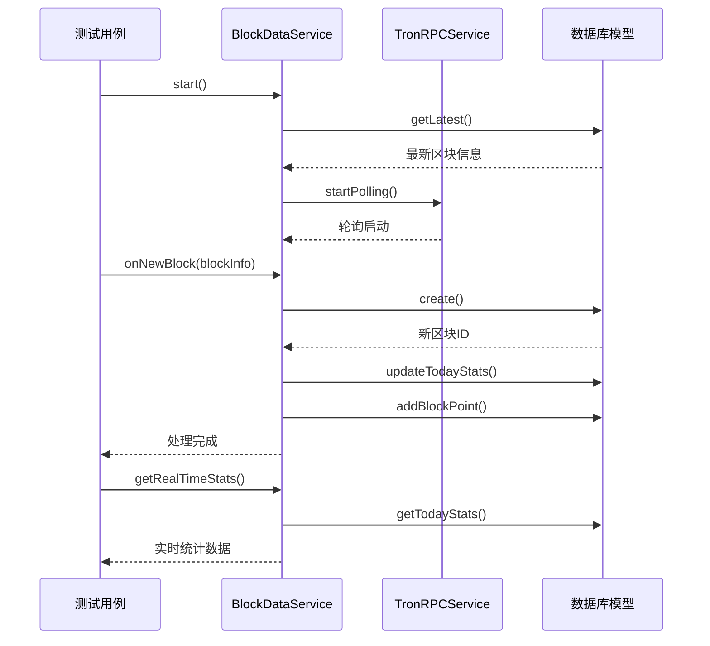

**图表来源**
- [src/services/BlockDataService.ts](file://src/services/BlockDataService.ts#L1-L273)

#### 测试重点

1. **区块处理流程**
   - 新区块检测和处理
   - 数据库写入操作
   - 统计更新机制

2. **缓存管理**
   - 缓存刷新逻辑
   - 缓存失效策略
   - 性能优化测试

3. **服务状态管理**
   - 启动和停止流程
   - 状态查询接口
   - 异常恢复机制

### BlockPointsModel单元测试

基于`BlockPointsModel.ts`的分析，需要重点测试以下功能：

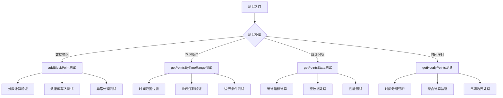

**图表来源**
- [src/models/BlockPointsModel.ts](file://src/models/BlockPointsModel.ts#L1-L219)

**章节来源**
- [src/services/TronRPCService.ts](file://src/services/TronRPCService.ts#L1-L258)
- [src/services/BlockDataService.ts](file://src/services/BlockDataService.ts#L1-L273)
- [src/models/BlockPointsModel.ts](file://src/models/BlockPointsModel.ts#L1-L219)

## 集成测试策略

### API层集成测试

基于`blocks.ts`路由模块，需要建立完整的API集成测试：

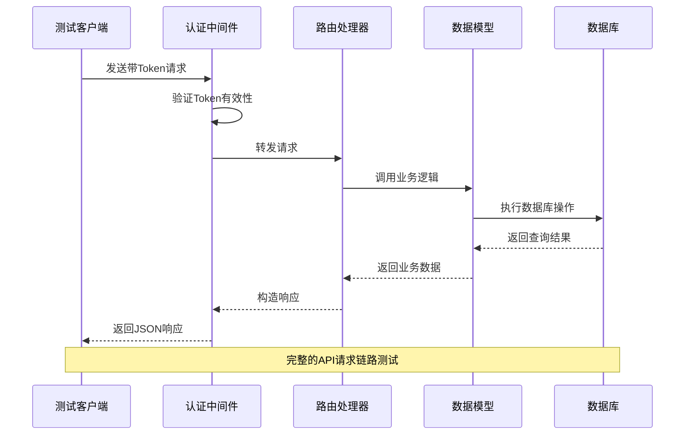

**图表来源**
- [src/routes/blocks.ts](file://src/routes/blocks.ts#L1-L141)

#### API测试覆盖范围

1. **认证和授权**
   - Token验证流程
   - 权限控制测试
   - 未授权访问处理

2. **数据获取接口**
   - 实时统计接口
   - 历史数据查询
   - 区块打点数据
   - 趋势数据分析

3. **错误处理**
   - 参数验证错误
   - 数据库连接错误
   - 业务逻辑异常

### 端到端测试

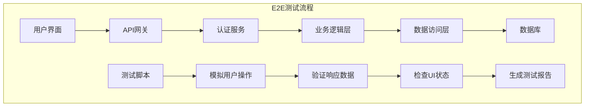

## 测试基础设施

### 测试数据库策略

#### 测试数据库实例配置

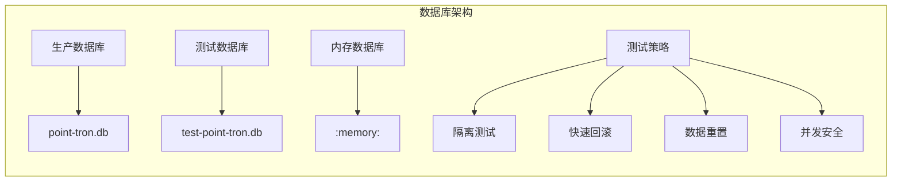

#### 数据库测试配置

1. **SQLite内存数据库**: 用于快速单元测试
2. **独立测试数据库**: 用于集成测试
3. **数据迁移测试**: 确保schema变更兼容性

### 依赖模拟策略

基于`Sinon.js`的依赖模拟：

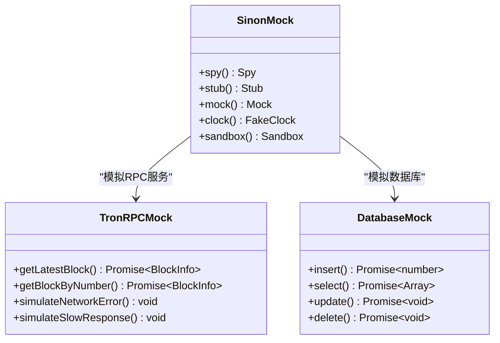

#### 模拟策略应用

1. **外部服务模拟**
   - TRON RPC API调用
   - 数据库操作
   - 文件系统操作

2. **时间相关模拟**
   - 系统时间控制
   - 轮询间隔模拟
   - 缓存过期测试

3. **随机性控制**
   - 随机数生成
   - 哈希计算模拟
   - 并发操作测试

## CI/CD集成

### 自动化测试流水线

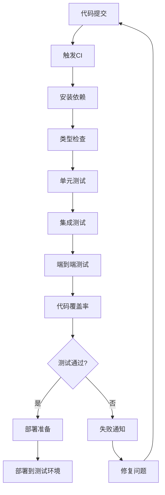

### 测试环境配置

#### Docker容器化测试

```yaml
# docker-compose.test.yml
version: '3.8'
services:
  test-db:
    image: sqlite:latest
    volumes:
      - ./test-data:/data
    command: sqlite3 /data/test.db
  
  test-app:
    build:
      context: .
      dockerfile: Dockerfile.test
    depends_on:
      - test-db
    environment:
      - NODE_ENV=test
      - DATABASE_URL=/data/test.db
```

#### GitHub Actions配置

```yaml
# .github/workflows/test.yml
name: 测试套件
on: [push, pull_request]

jobs:
  test:
    runs-on: ubuntu-latest
    steps:
      - uses: actions/checkout@v3
      - name: 设置Node.js
        uses: actions/setup-node@v3
        with:
          node-version: '18'
      - run: npm ci
      - run: npm run test:coverage
      - name: 上传覆盖率报告
        uses: codecov/codecov-action@v3
```

## 性能测试

### 压力测试策略

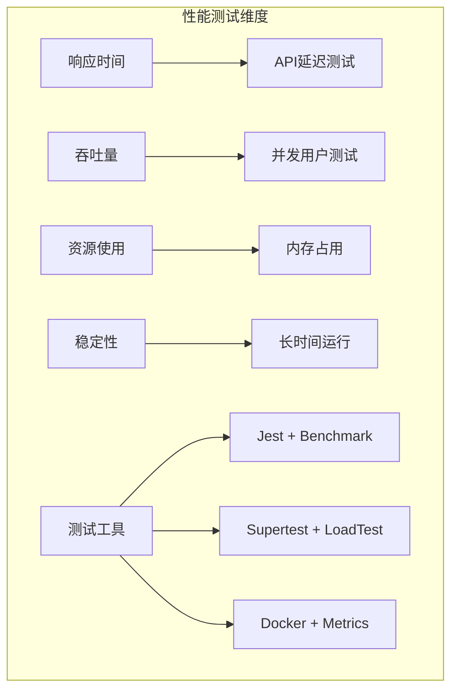

### 性能基准测试

1. **API响应时间测试**
   - 平均响应时间
   - P95/P99百分位数
   - 内存使用峰值

2. **数据库性能测试**
   - 查询执行时间
   - 连接池利用率
   - 索引使用效率

3. **系统资源监控**
   - CPU使用率
   - 内存泄漏检测
   - 磁盘I/O性能

## 测试最佳实践

### 测试命名规范

```typescript
// 测试文件命名
TronRPCService.test.ts
BlockDataService.test.ts
BlockPointsModel.test.ts

// 测试函数命名
describe('TronRPCService', () => {
  describe('getLatestBlock', () => {
    test('should return valid block info', async () => {
      // 测试实现
    });
    
    test('should handle network errors', async () => {
      // 测试实现
    });
  });
});
```

### 测试数据管理

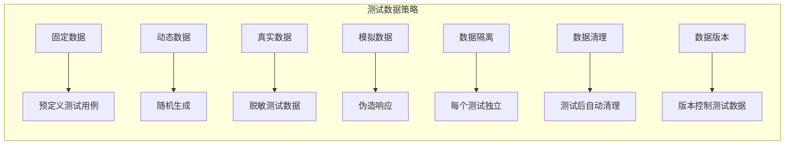

### 测试维护策略

1. **测试重构**
   - 保持测试代码整洁
   - 避免重复测试逻辑
   - 使用测试工厂模式

2. **测试文档**
   - 测试用例说明
   - 测试环境配置
   - 故障排除指南

3. **测试监控**
   - 测试失败率监控
   - 测试执行时间跟踪
   - 覆盖率趋势分析

## 总结

基于对Point-Tron项目的深入分析，建议实施以下测试扩展方案：

### 1. 短期目标（1-2个月）

- **建立基础测试框架**: 配置Jest和相关工具
- **核心服务测试**: 为TronRPCService和BlockDataService编写单元测试
- **API集成测试**: 建立基本的路由测试套件
- **测试数据库**: 配置独立的测试数据库实例

### 2. 中期目标（3-4个月）

- **完整测试覆盖**: 实现关键业务逻辑的100%测试覆盖
- **性能测试**: 建立压力测试和性能基准
- **CI/CD集成**: 完善自动化测试流水线
- **测试工具链**: 配置覆盖率报告和监控

### 3. 长期目标（6个月以上）

- **高级测试技术**: 引入模糊测试和混沌工程
- **测试驱动开发**: 推广TDD开发模式
- **测试运维**: 建立测试环境管理和监控
- **测试文化**: 培养团队测试意识和最佳实践

通过实施这套全面的测试扩展方案，Point-Tron项目将建立起完善的质量保证体系，确保系统的稳定性、可靠性和可维护性，为项目的长期发展奠定坚实基础。