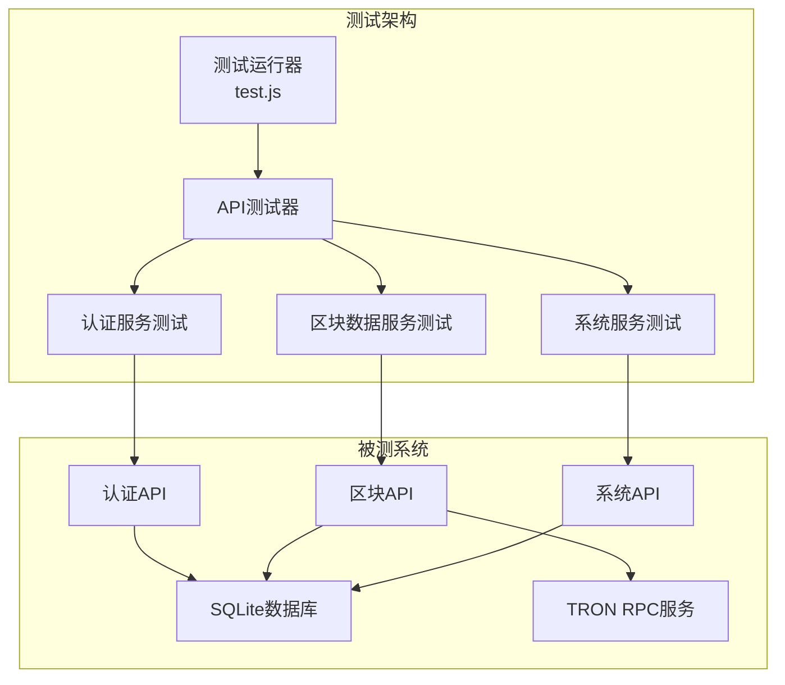
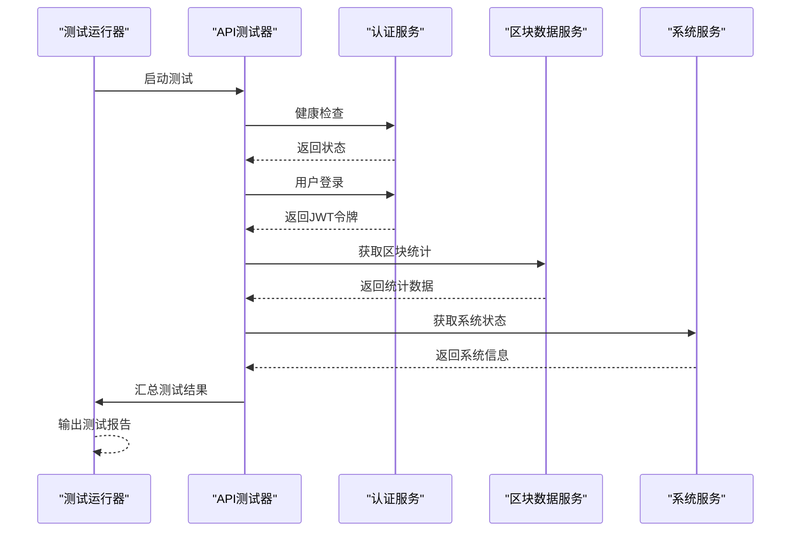
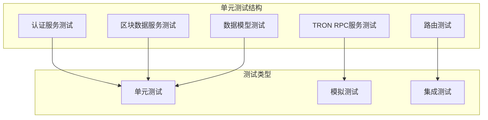
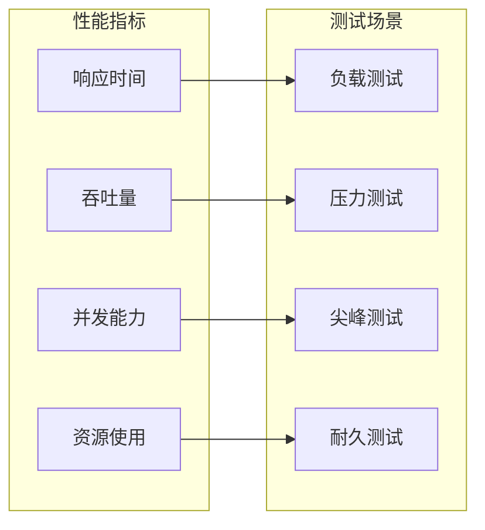

# 测试策略文档

<cite>
**本文档引用的文件**
- [test.js](file://test.js)
- [package.json](file://package.json)
- [src/services/AuthService.ts](file://src/services/AuthService.ts)
- [src/services/BlockDataService.ts](file://src/services/BlockDataService.ts)
- [src/services/TronRPCService.ts](file://src/services/TronRPCService.ts)
- [src/routes/auth.ts](file://src/routes/auth.ts)
- [src/routes/blocks.ts](file://src/routes/blocks.ts)
- [src/routes/system.ts](file://src/routes/system.ts)
- [src/models/types.ts](file://src/models/types.ts)
- [README.md](file://README.md)
</cite>

## 目录
1. [项目概述](#项目概述)
2. [测试架构分析](#测试架构分析)
3. [现有测试框架](#现有测试框架)
4. [测试用例设计](#测试用例设计)
5. [测试执行流程](#测试执行流程)
6. [测试覆盖率分析](#测试覆盖率分析)
7. [扩展测试框架建议](#扩展测试框架建议)
8. [模拟测试方案](#模拟测试方案)
9. [性能测试策略](#性能测试策略)
10. [故障排除指南](#故障排除指南)

## 项目概述

Point-Tron是一个基于TypeScript和Node.js开发的波场网络区块链数据统计后台管理系统。该项目实现了完整的端到端测试框架，验证系统的核心功能包括健康检查、用户认证、区块数据获取和系统状态查询等关键模块。

系统采用模块化架构设计，包含以下核心组件：
- **认证服务**：JWT令牌管理和用户验证
- **区块数据服务**：TRON RPC数据采集和处理
- **数据模型**：SQLite数据库交互
- **Web API**：RESTful接口和中间件
- **前端界面**：EJS模板渲染

## 测试架构分析



**图表来源**
- [test.js](file://test.js#L1-L137)
- [src/services/AuthService.ts](file://src/services/AuthService.ts#L1-L104)
- [src/services/BlockDataService.ts](file://src/services/BlockDataService.ts#L1-L273)

## 现有测试框架

### 内置测试脚本分析

项目包含一个独立的测试脚本`test.js`，它提供了完整的端到端测试功能：

```javascript
// 测试配置
const BASE_URL = 'http://localhost:3000';
let authToken = '';

// 测试用例数组
const tests = [
  {
    name: '健康检查',
    method: 'GET',
    path: '/health',
    expectedStatus: 200
  },
  {
    name: '登录测试',
    method: 'POST',
    path: '/api/auth/login',
    data: { username: 'admin', password: 'admin123' },
    expectedStatus: 200,
    saveToken: true
  }
];
```

### 测试工具链

根据`package.json`配置，项目支持多种测试工具：

```json
{
  "scripts": {
    "test": "jest"
  },
  "devDependencies": {
    "jest": "^29.7.0",
    "@types/jest": "^29.5.8"
  }
}
```

**章节来源**
- [test.js](file://test.js#L1-L137)
- [package.json](file://package.json#L1-L39)

## 测试用例设计

### 核心测试场景

#### 1. 系统健康检查测试
```javascript
{
  name: '健康检查',
  method: 'GET',
  path: '/health',
  expectedStatus: 200
}
```
验证系统基本可用性，确保服务器正常运行。

#### 2. 用户认证测试
```javascript
{
  name: '登录测试',
  method: 'POST',
  path: '/api/auth/login',
  data: { username: 'admin', password: 'admin123' },
  expectedStatus: 200,
  saveToken: true
}
```
测试用户登录功能，验证JWT令牌生成和认证机制。

#### 3. 区块数据获取测试
```javascript
{
  name: '获取区块统计',
  method: 'GET',
  path: '/api/blocks/stats',
  expectedStatus: 200,
  requireAuth: true
}
```
验证实时区块统计数据的获取功能。

#### 4. 系统状态查询测试
```javascript
{
  name: '获取系统状态',
  method: 'GET',
  path: '/api/system/status',
  expectedStatus: 200,
  requireAuth: true
}
```
测试系统状态信息的查询功能。

### 测试用例设计原则

1. **独立性**：每个测试用例相互独立，不依赖其他测试的结果
2. **可重复性**：测试可以在任何环境中重复执行
3. **自动化**：无需人工干预即可完成测试执行
4. **全面性**：覆盖核心业务功能的关键路径

**章节来源**
- [test.js](file://test.js#L12-L35)

## 测试执行流程

### 测试执行序列



**图表来源**
- [test.js](file://test.js#L50-L137)
- [src/services/AuthService.ts](file://src/services/AuthService.ts#L10-L25)

### 测试执行步骤

1. **环境准备**：启动Point-Tron服务器
2. **基础测试**：执行健康检查验证系统可用性
3. **认证测试**：验证用户登录和JWT令牌功能
4. **功能测试**：测试核心业务功能
5. **结果汇总**：统计测试通过率和失败原因

### HTTP请求封装

```javascript
function makeRequest(options, data = null) {
  return new Promise((resolve, reject) => {
    const req = http.request(options, (res) => {
      let body = '';
      res.on('data', chunk => body += chunk);
      res.on('end', () => {
        try {
          const jsonBody = body ? JSON.parse(body) : null;
          resolve({ status: res.statusCode, body: jsonBody, headers: res.headers });
        } catch (e) {
          resolve({ status: res.statusCode, body: body, headers: res.headers });
        }
      });
    });
    
    req.on('error', reject);
    if (data) req.write(JSON.stringify(data));
    req.end();
  });
}
```

**章节来源**
- [test.js](file://test.js#L37-L55)

## 测试覆盖率分析

### 当前测试覆盖范围

基于现有的测试脚本分析，当前测试覆盖以下功能模块：

#### 1. 基础功能测试
- ✅ 系统健康检查 (/health)
- ✅ 用户认证 (/api/auth/login)
- ✅ 数据获取 (/api/blocks/stats)
- ✅ 系统状态查询 (/api/system/status)

#### 2. 功能特性测试
- ✅ JWT令牌生成和验证
- ✅ 请求认证中间件
- ✅ API响应格式验证
- ✅ 错误处理机制

#### 3. 数据流测试
- ✅ 区块数据采集流程
- ✅ 数据库交互验证
- ✅ 实时统计更新

### 缺失的测试覆盖

目前的测试框架存在以下不足：

1. **单元测试缺失**：缺少对各个服务类的单元测试
2. **边界条件测试**：未测试异常情况和边界值
3. **并发测试**：未验证多用户并发访问
4. **性能测试**：缺乏性能基准测试
5. **集成测试**：缺少完整的端到端集成测试

**章节来源**
- [test.js](file://test.js#L12-L35)

## 扩展测试框架建议

### Jest测试框架集成

建议引入Jest作为主要的测试框架，提供更全面的测试能力：

```javascript
// jest.config.js 示例配置
module.exports = {
  testEnvironment: 'node',
  roots: ['<rootDir>/src'],
  testMatch: ['**/__tests__/**/*.ts', '**/?(*.)+(spec|test).ts'],
  transform: {
    '^.+\\.tsx?$': 'ts-jest'
  },
  coverageDirectory: 'coverage',
  collectCoverageFrom: [
    'src/**/*.{ts,tsx}',
    '!src/**/*.d.ts'
  ]
};
```

### 单元测试结构



**图表来源**
- [src/services/AuthService.ts](file://src/services/AuthService.ts#L1-L104)
- [src/services/BlockDataService.ts](file://src/services/BlockDataService.ts#L1-L273)
- [src/services/TronRPCService.ts](file://src/services/TronRPCService.ts#L1-L258)

### 测试用例模板

```typescript
describe('AuthService', () => {
  describe('generateToken', () => {
    it('should generate valid JWT token', () => {
      const user = { id: 1, username: 'test' };
      const token = AuthService.generateToken(user);
      expect(token).toBeDefined();
      expect(typeof token).toBe('string');
    });
  });

  describe('verifyToken', () => {
    it('should verify valid token', () => {
      const user = { id: 1, username: 'test' };
      const token = AuthService.generateToken(user);
      const payload = AuthService.verifyToken(token);
      expect(payload).toBeDefined();
      expect(payload?.userId).toBe(1);
    });
  });
});
```

**章节来源**
- [package.json](file://package.json#L10-L11)
- [src/services/AuthService.ts](file://src/services/AuthService.ts#L10-L25)

## 模拟测试方案

### 关键服务的模拟测试

#### 1. TronRPCService模拟测试

```typescript
// TronRPCService模拟测试示例
describe('TronRPCService', () => {
  let tronRPCService: TronRPCService;
  let mockFetch: jest.Mock;

  beforeEach(() => {
    global.fetch = mockFetch = jest.fn();
    tronRPCService = new TronRPCService({
      rpcUrl: 'https://mock-rpc-url',
      timeout: 5000,
      retryTimes: 3,
      pollingInterval: 3000
    });
  });

  it('should handle successful RPC response', async () => {
    mockFetch.mockResolvedValueOnce({
      ok: true,
      json: async () => ({
        blockID: 'mock-block-id',
        block_header: {
          raw_data: {
            number: 12345,
            timestamp: Date.now()
          }
        }
      })
    });

    const result = await tronRPCService.getLatestBlock();
    expect(result).toBeDefined();
    expect(result.block_number).toBe(12345);
  });

  it('should handle RPC errors with retries', async () => {
    mockFetch.mockRejectedValueOnce(new Error('Network error'));
    mockFetch.mockResolvedValueOnce({
      ok: true,
      json: async () => ({})
    });

    await expect(tronRPCService.getLatestBlock()).resolves.toBeDefined();
  });
});
```

#### 2. 数据库服务模拟测试

```typescript
// 数据库服务模拟测试
describe('BlockModel', () => {
  let mockDatabase: jest.Mocked<any>;

  beforeEach(() => {
    mockDatabase = {
      get: jest.fn(),
      run: jest.fn(),
      all: jest.fn()
    };
  });

  it('should create block record', async () => {
    mockDatabase.run.mockResolvedValue({ lastID: 1 });
    
    const result = await BlockModel.create(mockBlockData);
    expect(result).toBe(1);
    expect(mockDatabase.run).toHaveBeenCalled();
  });

  it('should handle database errors', async () => {
    mockDatabase.run.mockRejectedValue(new Error('Database error'));
    
    await expect(BlockModel.create(mockBlockData)).rejects.toThrow();
  });
});
```

### 测试工具和库推荐

1. **Jest**：主要测试框架
2. **Supertest**：HTTP API测试
3. **MockDate**：日期时间模拟
4. **nock**：HTTP请求拦截和模拟
5. **Testing Library**：React组件测试（如果未来扩展前端）

**章节来源**
- [src/services/TronRPCService.ts](file://src/services/TronRPCService.ts#L100-L150)
- [src/models/types.ts](file://src/models/types.ts#L1-L60)

## 性能测试策略

### 性能测试指标



### 性能测试实施

#### 1. 基准测试设置

```javascript
// 性能测试示例
describe('Performance Tests', () => {
  it('should handle concurrent requests efficiently', async () => {
    const startTime = Date.now();
    const promises = Array.from({ length: 100 }, (_, i) => 
      makeRequest({
        hostname: 'localhost',
        port: 3000,
        path: '/api/blocks/stats',
        method: 'GET',
        headers: {
          'Authorization': `Bearer ${authToken}`
        }
      })
    );
    
    const results = await Promise.all(promises);
    const endTime = Date.now();
    
    const avgResponseTime = (endTime - startTime) / 100;
    expect(avgResponseTime).toBeLessThan(1000); // 平均响应时间小于1秒
  });
});
```

#### 2. 资源监控

```javascript
// 资源使用监控
describe('Resource Monitoring', () => {
  it('should maintain reasonable memory usage', async () => {
    const initialMemory = process.memoryUsage().heapUsed;
    
    // 执行大量请求
    for (let i = 0; i < 1000; i++) {
      await makeRequest({
        hostname: 'localhost',
        port: 3000,
        path: '/api/blocks/stats',
        method: 'GET',
        headers: {
          'Authorization': `Bearer ${authToken}`
        }
      });
    }
    
    const finalMemory = process.memoryUsage().heapUsed;
    const memoryIncrease = finalMemory - initialMemory;
    
    expect(memoryIncrease).toBeLessThan(100 * 1024 * 1024); // 增加不超过100MB
  });
});
```

## 故障排除指南

### 常见测试问题及解决方案

#### 1. 测试服务器启动失败

**问题症状**：
```
Error: connect ECONNREFUSED 127.0.0.1:3000
```

**解决方案**：
```bash
# 检查服务器是否启动
lsof -i :3000

# 启动开发服务器
npm run dev

# 或者启动编译后的版本
npm start
```

#### 2. 认证令牌失效

**问题症状**：
```
401 Unauthorized: Invalid token
```

**解决方案**：
```javascript
// 重新获取认证令牌
async function refreshAuthToken() {
  const response = await makeRequest({
    hostname: 'localhost',
    port: 3000,
    path: '/api/auth/login',
    method: 'POST',
    headers: {
      'Content-Type': 'application/json'
    }
  }, { username: 'admin', password: 'admin123' });
  
  return response.body.data.token;
}
```

#### 3. 数据库连接问题

**问题症状**：
```
Error: SQLITE_CANTOPEN: unable to open database file
```

**解决方案**：
```bash
# 检查数据库目录权限
ls -la data/

# 创建必要的目录
mkdir -p data/

# 检查文件权限
chmod 755 data/
chmod 644 data/*.db
```

### 测试调试技巧

#### 1. 启用详细日志

```javascript
// 在测试脚本中启用详细日志
console.log('Debug Info:', {
  authToken: authToken ? '***' : 'not set',
  serverStatus: 'running',
  responseHeaders: response.headers,
  responseBody: response.body
});
```

#### 2. 环境变量配置

```bash
# 设置调试环境变量
export NODE_ENV=test
export DEBUG_API=true
export LOG_LEVEL=debug

# 运行测试
npm test
```

**章节来源**
- [test.js](file://test.js#L70-L100)
- [README.md](file://README.md#L200-L250)

## 结论与建议

### 当前测试框架评估

Point-Tron项目已经建立了一个基础但有效的端到端测试框架，能够验证系统的核心功能。然而，为了提高测试质量和可靠性，建议采取以下改进措施：

1. **引入专业测试框架**：使用Jest替代现有的简单测试脚本
2. **完善单元测试**：为各个服务类编写全面的单元测试
3. **增强模拟测试**：对依赖外部服务的组件进行充分的模拟测试
4. **扩展性能测试**：建立性能基准和监控机制
5. **持续集成支持**：将测试集成到CI/CD流水线中

### 未来发展方向

随着项目规模的增长，建议逐步完善测试体系：

- **测试自动化**：实现完全自动化的测试执行和报告
- **测试覆盖率**：达到80%以上的代码覆盖率目标
- **测试维护**：定期审查和更新测试用例
- **测试文档**：建立完善的测试文档和最佳实践

通过实施这些改进措施，Point-Tron项目将建立起更加健壮和可持续的测试体系，为项目的长期发展提供坚实的质量保障。