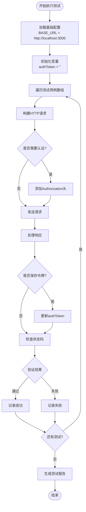
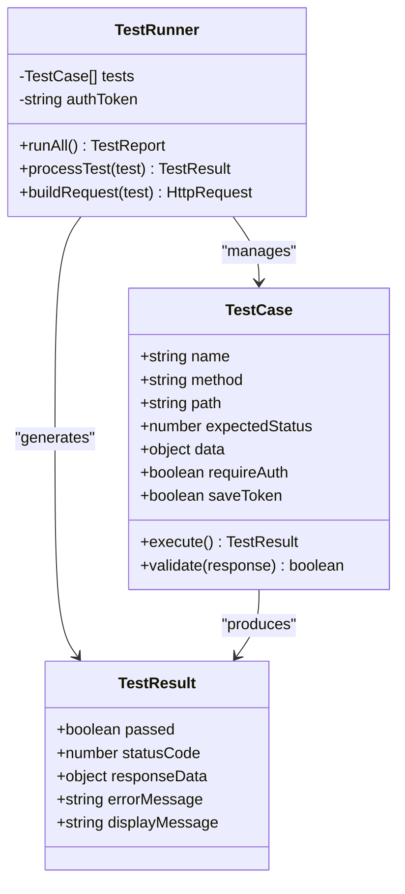
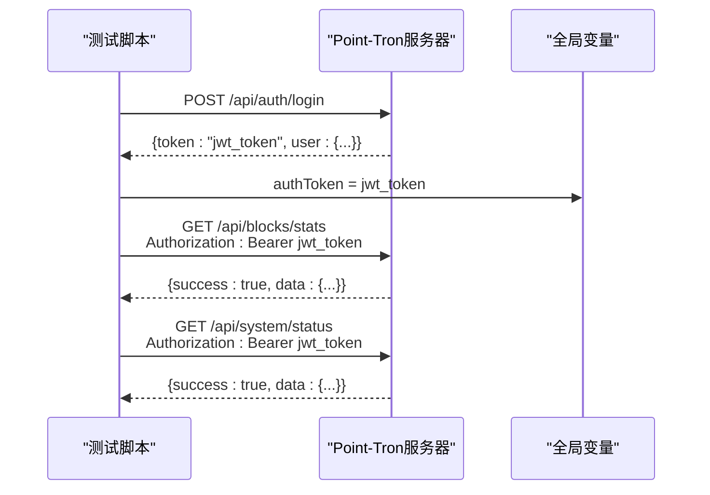
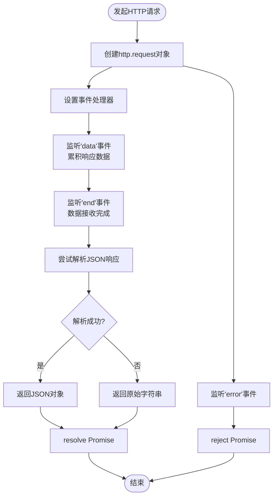

# 现有测试脚本使用指南

<cite>
**本文档中引用的文件**
- [test.js](file://test.js)
- [debug-api.js](file://debug-api.js)
- [src/routes/auth.ts](file://src/routes/auth.ts)
- [src/routes/blocks.ts](file://src/routes/blocks.ts)
- [src/routes/system.ts](file://src/routes/system.ts)
- [src/config/index.ts](file://src/config/index.ts)
- [README.md](file://README.md)
</cite>

## 目录
1. [简介](#简介)
2. [测试脚本概述](#测试脚本概述)
3. [核心功能测试](#核心功能测试)
4. [测试用例结构详解](#测试用例结构详解)
5. [认证机制实现](#认证机制实现)
6. [HTTP请求封装](#http请求封装)
7. [执行流程分析](#执行流程分析)
8. [输出结果解读](#输出结果解读)
9. [故障排除指南](#故障排除指南)
10. [最佳实践建议](#最佳实践建议)

## 简介

Point-Tron 系统提供了一个专门的测试脚本 `test.js`，用于对整个系统的端到端功能进行自动化测试。该脚本通过 HTTP 客户端模拟真实用户操作，验证系统的核心功能模块，包括健康检查、用户认证、数据统计、系统状态等关键特性。

测试脚本采用简洁的设计理念，通过预定义的测试用例数组来组织测试逻辑，支持认证令牌的自动管理和跨请求传递，提供了直观的测试结果反馈机制。

## 测试脚本概述

### 脚本架构



**图表来源**
- [test.js](file://test.js#L1-L137)

### 主要特性

1. **自动化测试执行**：无需人工干预，自动执行所有预定义测试用例
2. **认证令牌管理**：自动处理登录获取令牌并在后续请求中传递
3. **状态码验证**：精确验证每个接口的预期 HTTP 状态码
4. **响应数据解析**：自动解析 JSON 响应并显示关键数据
5. **错误处理机制**：完善的异常捕获和错误报告
6. **可视化结果**：使用符号表情提供直观的测试结果展示

**章节来源**
- [test.js](file://test.js#L1-L137)

## 核心功能测试

### 健康检查测试

健康检查是系统可用性的基本验证，确保服务器能够正常响应。

```javascript
{
  name: '健康检查',
  method: 'GET',
  path: '/health',
  expectedStatus: 200
}
```

**测试目的**：验证系统基础服务是否正常运行
**预期结果**：HTTP 200 状态码表示系统健康
**实际应用**：作为其他测试的前提条件，确保系统可访问

### 用户认证测试

用户登录功能验证系统认证机制的有效性。

```javascript
{
  name: '登录测试',
  method: 'POST',
  path: '/api/auth/login',
  data: { username: 'admin', password: 'admin123' },
  expectedStatus: 200,
  saveToken: true
}
```

**测试特点**：
- 使用默认管理员凭据进行登录
- 自动保存返回的 JWT 令牌
- 为后续认证相关测试准备凭证

### 区块统计获取测试

验证实时区块数据统计功能的准确性。

```javascript
{
  name: '获取区块统计',
  method: 'GET',
  path: '/api/blocks/stats',
  expectedStatus: 200,
  requireAuth: true
}
```

**数据展示**：系统会显示今日统计详情
- 总区块数量
- 单数区块数量
- 双数区块数量
- 小时级统计数据

### 系统状态查询测试

获取系统整体运行状态信息。

```javascript
{
  name: '获取系统状态',
  method: 'GET',
  path: '/api/system/status',
  expectedStatus: 200,
  requireAuth: true
}
```

**状态信息**：
- RPC 轮询状态
- 数据库连接状态
- 内存使用情况
- 系统运行时间

**章节来源**
- [test.js](file://test.js#L11-L43)

## 测试用例结构详解

### 字段说明

测试用例数组中的每个对象都包含以下关键字段：

#### 基础字段

1. **name** (`string`)：测试用例的描述性名称
   - 示例：`'健康检查'`, `'登录测试'`, `'获取区块统计'`

2. **method** (`string`)：HTTP 请求方法
   - 支持：`'GET'`, `'POST'`, `'PUT'`, `'DELETE'`

3. **path** (`string`)：API 路径
   - 示例：`'/health'`, `'/api/auth/login'`, `'/api/blocks/stats'`

4. **expectedStatus** (`number`)：期望的 HTTP 状态码
   - 常见值：`200` (成功), `401` (未授权), `404` (未找到)

#### 可选字段

5. **data** (`object`)：POST 请求的请求体数据
   - 用于登录、创建资源等需要发送数据的请求
   - 示例：`{ username: 'admin', password: 'admin123' }`

6. **requireAuth** (`boolean`)：是否需要认证
   - 设置为 `true` 时，自动在请求头中添加认证信息
   - 自动使用当前存储的 `authToken`

7. **saveToken** (`boolean`)：是否保存返回的令牌
   - 仅适用于登录接口
   - 自动提取并更新全局 `authToken` 变量

### 结构设计原理



**图表来源**
- [test.js](file://test.js#L11-L43)

**章节来源**
- [test.js](file://test.js#L11-L43)

## 认证机制实现

### 令牌传递机制

测试脚本实现了完整的 JWT 令牌生命周期管理：



**图表来源**
- [test.js](file://test.js#L75-L85)
- [src/routes/auth.ts](file://src/routes/auth.ts#L15-L40)

### 认证头添加逻辑

```javascript
// 添加认证头
if (test.requireAuth && authToken) {
  options.headers['Authorization'] = `Bearer ${authToken}`;
}
```

**实现特点**：
1. **条件检查**：只有当测试用例设置 `requireAuth: true` 且已有有效令牌时才添加认证头
2. **令牌格式**：使用标准的 `Bearer` 认证方案
3. **自动传递**：后续所有需要认证的请求都会自动携带最新的令牌

### 令牌保存机制

```javascript
// 保存令牌
if (test.saveToken && response.body && response.body.data && response.body.data.token) {
  authToken = response.body.data.token;
}
```

**保存逻辑**：
1. **条件判断**：仅在满足 `saveToken: true` 且响应包含有效令牌时执行
2. **数据提取**：从响应体的 `data.token` 字段提取令牌
3. **全局更新**：立即更新全局 `authToken` 变量供后续测试使用

**章节来源**
- [test.js](file://test.js#L75-L85)
- [src/routes/auth.ts](file://src/routes/auth.ts#L15-L40)

## HTTP请求封装

### makeRequest 函数设计

测试脚本的核心是 `makeRequest` 函数，它封装了所有 HTTP 请求的通用逻辑：

```javascript
function makeRequest(options, data = null) {
  return new Promise((resolve, reject) => {
    const req = http.request(options, (res) => {
      let body = '';
      res.on('data', chunk => body += chunk);
      res.on('end', () => {
        try {
          const jsonBody = body ? JSON.parse(body) : null;
          resolve({ status: res.statusCode, body: jsonBody, headers: res.headers });
        } catch (e) {
          resolve({ status: res.statusCode, body: body, headers: res.headers });
        }
      });
    });

    req.on('error', reject);

    if (data) {
      req.write(JSON.stringify(data));
    }
    req.end();
  });
}
```

### 请求处理流程



**图表来源**
- [test.js](file://test.js#L45-L67)

### 错误捕获机制

```javascript
try {
  const response = await makeRequest(options, test.data);
  // 处理响应...
} catch (error) {
  console.log(`❌ ${test.name} - 错误: ${error.message}`);
  failed++;
}
```

**错误处理策略**：
1. **Promise 捕获**：使用 `try-catch` 捕获异步错误
2. **错误分类**：区分网络错误和业务错误
3. **详细报告**：显示具体的错误消息便于调试
4. **继续执行**：即使某个测试失败，仍继续执行后续测试

### 响应数据处理

```javascript
// 验证结果
if (response.status === test.expectedStatus) {
  console.log(`✅ ${test.name} - 通过 (${response.status})`);
  passed++;
} else {
  console.log(`❌ ${test.name} - 失败 (期望: ${test.expectedStatus}, 实际: ${response.status})`);
  failed++;
}
```

**数据验证逻辑**：
1. **状态码比较**：严格匹配期望的状态码
2. **成功标记**：状态码匹配时标记为通过
3. **失败报告**：详细说明期望值和实际值的差异
4. **统计更新**：自动更新通过/失败计数器

**章节来源**
- [test.js](file://test.js#L45-L67)
- [test.js](file://test.js#L75-L105)

## 执行流程分析

### 主执行函数

```javascript
async function runTests() {
  console.log('🚀 开始执行 Point-Tron 系统测试\n');
  
  let passed = 0;
  let failed = 0;

  for (const test of tests) {
    // 测试执行逻辑...
  }

  console.log(`\n📋 测试结果: ${passed} 通过, ${failed} 失败`);
  
  if (failed === 0) {
    console.log('🎉 所有测试通过！系统运行正常。');
  } else {
    console.log('⚠️  部分测试失败，请检查系统状态。');
  }
}
```

### 测试执行顺序

```mermaid
gantt
title 测试执行时间线
dateFormat X
axisFormat %s
section 初始化阶段
加载配置 :0, 1
初始化变量 :1, 2
section 测试循环
健康检查 :2, 3
用户登录 :3, 5
区块统计 :5, 7
系统状态 :7, 9
RPC配置 :9, 11
section 结果汇总
生成报告 :11, 12
```



**图表来源**
- [test.js](file://test.js#L69-L137)

### 并发处理能力

虽然当前测试脚本是串行执行的，但其架构设计支持并发扩展：

```javascript
// 当前实现（串行）
for (const test of tests) {
  await executeSingleTest(test);
}

// 可扩展为并发版本
// const results = await Promise.all(tests.map(executeSingleTest));
```

**并发优势**：
1. **性能提升**：减少总测试时间
2. **资源利用**：更高效地使用网络带宽
3. **独立性**：各测试用例相互独立，互不影响

**章节来源**
- [test.js](file://test.js#L69-L137)

## 输出结果解读

### 成功测试输出

```
🚀 开始执行 Point-Tron 系统测试

✅ 健康检查 - 通过 (200)
✅ 登录测试 - 通过 (200)
✅ 获取区块统计 - 通过 (200)
   📊 今日统计: 总计1234, 单数617, 双数617
✅ 获取系统状态 - 通过 (200)
✅ 获取RPC配置 - 通过 (200)

📋 测试结果: 5 通过, 0 失败
🎉 所有测试通过！系统运行正常。
```

### 失败测试输出

```
🚀 开始执行 Point-Tron 系统测试

✅ 健康检查 - 通过 (200)
❌ 登录测试 - 失败 (期望: 200, 实际: 401)
❌ 获取区块统计 - 失败 (期望: 200, 实际: 401)
❌ 获取系统状态 - 失败 (期望: 200, 实际: 401)
❌ 获取RPC配置 - 失败 (期望: 200, 实际: 401)

📋 测试结果: 1 通过, 4 失败
⚠️  部分测试失败，请检查系统状态。
```

### 错误测试输出

```
🚀 开始执行 Point-Tron 系统测试

✅ 健康检查 - 通过 (200)
❌ 登录测试 - 错误: connect ECONNREFUSED 127.0.0.1:3000
❌ 获取区块统计 - 错误: socket hang up
❌ 获取系统状态 - 错误: getaddrinfo ENOTFOUND localhost
❌ 获取RPC配置 - 错误: Request timeout

📋 测试结果: 1 通过, 4 失败
⚠️  部分测试失败，请检查系统状态。
```

### 输出格式说明

1. **成功标记**：`✅` 表示测试通过
2. **失败标记**：`❌` 表示测试失败或出现错误
3. **状态信息**：显示 HTTP 状态码和详细信息
4. **统计数据**：对于特定接口显示关键数据指标
5. **总结信息**：最终统计通过和失败的数量
6. **总体评价**：根据测试结果给出系统状态评估

**章节来源**
- [test.js](file://test.js#L75-L137)

## 故障排除指南

### 常见问题及解决方案

#### 1. 服务器未启动

**症状**：所有测试都显示连接错误
```
❌ 健康检查 - 错误: connect ECONNREFUSED 127.0.0.1:3000
```

**解决方案**：
```bash
# 检查服务器是否启动
ps aux | grep node

# 启动服务器
npm start

# 或者开发模式启动
npm run dev
```

#### 2. 认证失败

**症状**：登录测试失败或后续认证相关测试失败
```
❌ 登录测试 - 失败 (期望: 200, 实际: 401)
```

**解决方案**：
1. 检查默认管理员凭据是否正确
2. 确认数据库中是否存在管理员用户
3. 验证 JWT 密钥配置是否正确

#### 3. 数据库连接问题

**症状**：系统状态查询失败
```
❌ 获取系统状态 - 错误: Cannot read property 'isConnected' of undefined
```

**解决方案**：
1. 检查数据库文件路径配置
2. 确认数据库文件存在且可访问
3. 验证数据库连接池配置

#### 4. 网络超时问题

**症状**：某些测试出现超时错误
```
❌ 获取区块统计 - 错误: Request timeout
```

**解决方案**：
1. 检查 TRON RPC 服务可用性
2. 调整超时配置参数
3. 检查网络连接稳定性

### 调试技巧

#### 启用详细日志

```javascript
// 在 makeRequest 中添加调试信息
console.log(`Sending ${options.method} request to ${options.path}`);
console.log('Request headers:', options.headers);
console.log('Request body:', data);
```

#### 使用调试脚本

系统提供了专门的调试脚本 `debug-api.js`，可以单独测试各个 API 接口：

```bash
node debug-api.js
```

#### 检查系统状态

```javascript
// 在测试脚本中添加额外的状态检查
console.log('System status:', response.body.data);
```

**章节来源**
- [test.js](file://test.js#L75-L137)
- [debug-api.js](file://debug-api.js#L1-L117)

## 最佳实践建议

### 测试脚本维护

#### 1. 版本控制

```javascript
// 添加版本信息
const TEST_VERSION = '1.0.0';
console.log(`🧪 测试脚本版本: ${TEST_VERSION}`);
```

#### 2. 配置外部化

```javascript
// 使用环境变量配置
const BASE_URL = process.env.TEST_BASE_URL || 'http://localhost:3000';
const ADMIN_CREDENTIALS = {
  username: process.env.ADMIN_USERNAME || 'admin',
  password: process.env.ADMIN_PASSWORD || 'admin123'
};
```

#### 3. 测试数据管理

```javascript
// 使用测试数据工厂
function createTestData(type) {
  switch (type) {
    case 'user':
      return {
        username: 'test_user_' + Date.now(),
        password: 'test_password'
      };
    case 'block':
      return {
        blockNumber: Date.now(),
        blockHash: '0x' + Math.random().toString(16).substring(2, 10)
      };
  }
}
```

### 测试覆盖率优化

#### 1. 添加更多测试场景

```javascript
// 增加边界条件测试
{
  name: '无效登录',
  method: 'POST',
  path: '/api/auth/login',
  data: { username: 'admin', password: 'wrong_password' },
  expectedStatus: 401
}

// 增加错误处理测试
{
  name: '不存在的资源',
  method: 'GET',
  path: '/api/nonexistent',
  expectedStatus: 404
}
```

#### 2. 参数化测试

```javascript
// 使用参数化测试提高效率
const testScenarios = [
  { username: 'admin', password: 'admin123', expected: 200 },
  { username: 'admin', password: '', expected: 400 },
  { username: '', password: 'admin123', expected: 400 }
];
```

### 性能优化建议

#### 1. 并发测试执行

```javascript
// 改进后的并发版本
async function runTestsConcurrent() {
  const testPromises = tests.map(async (test) => {
    try {
      const result = await executeSingleTest(test);
      return { ...result, passed: true };
    } catch (error) {
      return { test, error, passed: false };
    }
  });
  
  const results = await Promise.all(testPromises);
  return results;
}
```

#### 2. 缓存认证令牌

```javascript
// 添加令牌缓存机制
let authTokenCache = null;
let cacheTimestamp = 0;

function getCachedAuthToken() {
  const now = Date.now();
  const cacheDuration = 30 * 60 * 1000; // 30分钟
  
  if (authTokenCache && (now - cacheTimestamp) < cacheDuration) {
    return authTokenCache;
  }
  
  return null;
}
```

### 监控集成

#### 1. 添加监控指标

```javascript
// 记录测试执行时间
const startTime = Date.now();
await runTests();
const duration = Date.now() - startTime;

console.log(`⏱️  测试总耗时: ${duration}ms`);
```

#### 2. 集成 CI/CD

```yaml
# GitHub Actions 示例
name: Run Tests
on: [push, pull_request]
jobs:
  test:
    runs-on: ubuntu-latest
    steps:
      - uses: actions/checkout@v2
      - name: Setup Node.js
        uses: actions/setup-node@v2
        with:
          node-version: '16'
      - name: Install dependencies
        run: npm install
      - name: Run tests
        run: node test.js
```

这些最佳实践可以帮助您更好地维护和扩展测试脚本，确保系统的稳定性和可靠性。