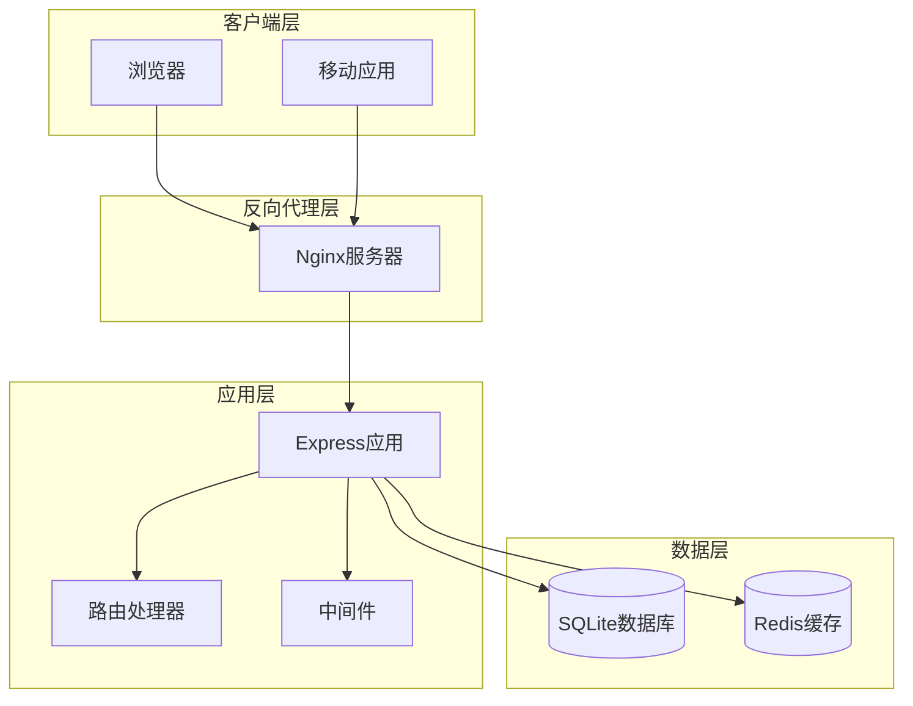

# 反向代理与HTTPS配置指南

<cite>
**本文档引用的文件**
- [src/index.ts](file://src/index.ts)
- [src/config/index.ts](file://src/config/index.ts)
- [src/routes/web.ts](file://src/routes/web.ts)
- [src/middleware/auth.ts](file://src/middleware/auth.ts)
- [package.json](file://package.json)
</cite>

## 目录
1. [简介](#简介)
2. [项目架构概述](#项目架构概述)
3. [Nginx反向代理配置](#nginx反向代理配置)
4. [HTTPS SSL证书配置](#https-ssl证书配置)
5. [负载均衡与缓存](#负载均衡与缓存)
6. [安全防护配置](#安全防护配置)
7. [常见问题解决方案](#常见问题解决方案)
8. [性能优化建议](#性能优化建议)
9. [监控与维护](#监控与维护)

## 简介

本指南专为Point-Tron TRON区块链数据统计后台管理系统设计，提供完整的Nginx反向代理配置方案。该系统采用Express框架构建，支持RESTful API和Web界面，需要通过反向代理实现负载均衡、SSL加密和安全防护。

## 项目架构概述

基于对现有代码的分析，Point-Tron系统具有以下特点：



**节点来源**
- [src/index.ts](file://src/index.ts#L1-L90)
- [src/config/index.ts](file://src/config/index.ts#L1-L52)

**节点来源**
- [src/index.ts](file://src/index.ts#L1-L90)
- [src/config/index.ts](file://src/config/index.ts#L1-L52)

## Nginx反向代理配置

### 基础Server块配置

以下是针对Point-Tron系统的完整Nginx配置示例：

```nginx
upstream point_tron_backend {
    server 127.0.0.1:3000 weight=1 max_fails=3 fail_timeout=30s;
    keepalive 32;
}

server {
    listen 80;
    server_name your-domain.com www.your-domain.com;
    
    # 强制HTTPS重定向
    return 301 https://$server_name$request_uri;
    
    # 配置根目录和日志
    root /var/www/html;
    access_log /var/log/nginx/point-tron.access.log;
    error_log /var/log/nginx/point-tron.error.log;
    
    # 处理静态文件
    location ~* \.(?:ico|css|js|gif|jpe?g|png|woff2?|eot|ttf|svgz?|map)$ {
        expires 1M;
        add_header Cache-Control "public, immutable";
        access_log off;
    }
    
    # 处理健康检查
    location /health {
        proxy_pass http://point_tron_backend;
        proxy_set_header Host $host;
        proxy_set_header X-Real-IP $remote_addr;
        proxy_set_header X-Forwarded-For $proxy_add_x_forwarded_for;
        proxy_set_header X-Forwarded-Proto $scheme;
        proxy_connect_timeout 5s;
        proxy_read_timeout 60s;
    }
    
    # 主要API路由
    location /api/ {
        proxy_pass http://point_tron_backend/;
        proxy_set_header Host $host;
        proxy_set_header X-Real-IP $remote_addr;
        proxy_set_header X-Forwarded-For $proxy_add_x_forwarded_for;
        proxy_set_header X-Forwarded-Proto $scheme;
        
        # 超时设置
        proxy_connect_timeout 5s;
        proxy_read_timeout 60s;
        proxy_send_timeout 60s;
        
        # 缓冲设置
        proxy_buffering on;
        proxy_buffer_size 8k;
        proxy_buffers 8 8k;
    }
    
    # WebSocket支持
    location /ws/ {
        proxy_pass http://point_tron_backend;
        proxy_http_version 1.1;
        proxy_set_header Upgrade $http_upgrade;
        proxy_set_header Connection "upgrade";
        proxy_set_header Host $host;
        proxy_set_header X-Real-IP $remote_addr;
        proxy_set_header X-Forwarded-For $proxy_add_x_forwarded_for;
        proxy_set_header X-Forwarded-Proto $scheme;
        
        # WebSocket超时设置
        proxy_read_timeout 86400;
        proxy_send_timeout 86400;
    }
    
    # 静态文件服务
    location /static/ {
        alias /var/www/point-tron/public/;
        expires 1M;
        add_header Cache-Control "public, immutable";
        access_log off;
    }
    
    # 默认重定向到Web界面
    location / {
        proxy_pass http://point_tron_backend;
        proxy_set_header Host $host;
        proxy_set_header X-Real-IP $remote_addr;
        proxy_set_header X-Forwarded-For $proxy_add_x_forwarded_for;
        proxy_set_header X-Forwarded-Proto $scheme;
        
        # 超时设置
        proxy_connect_timeout 5s;
        proxy_read_timeout 60s;
        proxy_send_timeout 60s;
    }
    
    # 错误页面配置
    error_page 500 502 503 504 /50x.html;
    location = /50x.html {
        root /usr/share/nginx/html;
    }
}
```

### HTTPS配置

```nginx
server {
    listen 443 ssl http2;
    server_name your-domain.com www.your-domain.com;
    
    # SSL证书配置
    ssl_certificate /etc/letsencrypt/live/your-domain.com/fullchain.pem;
    ssl_certificate_key /etc/letsencrypt/live/your-domain.com/privkey.pem;
    ssl_trusted_certificate /etc/letsencrypt/live/your-domain.com/chain.pem;
    
    # SSL参数优化
    ssl_protocols TLSv1.2 TLSv1.3;
    ssl_ciphers ECDHE-RSA-AES256-GCM-SHA512:DHE-RSA-AES256-GCM-SHA512:ECDHE-RSA-AES256-GCM-SHA384:DHE-RSA-AES256-GCM-SHA384;
    ssl_prefer_server_ciphers off;
    ssl_session_cache shared:SSL:10m;
    ssl_session_timeout 10m;
    
    # HSTS配置
    add_header Strict-Transport-Security "max-age=63072000; includeSubDomains; preload" always;
    
    # 配置根目录和日志
    root /var/www/html;
    access_log /var/log/nginx/point-tron.access.log;
    error_log /var/log/nginx/point-tron.error.log;
    
    # 处理静态文件
    location ~* \.(?:ico|css|js|gif|jpe?g|png|woff2?|eot|ttf|svgz?|map)$ {
        expires 1M;
        add_header Cache-Control "public, immutable";
        access_log off;
    }
    
    # 主要API路由
    location /api/ {
        proxy_pass http://point_tron_backend/;
        proxy_set_header Host $host;
        proxy_set_header X-Real-IP $remote_addr;
        proxy_set_header X-Forwarded-For $proxy_add_x_forwarded_for;
        proxy_set_header X-Forwarded-Proto https;
        
        # 超时设置
        proxy_connect_timeout 5s;
        proxy_read_timeout 60s;
        proxy_send_timeout 60s;
        
        # 缓冲设置
        proxy_buffering on;
        proxy_buffer_size 8k;
        proxy_buffers 8 8k;
    }
    
    # WebSocket支持
    location /ws/ {
        proxy_pass http://point_tron_backend;
        proxy_http_version 1.1;
        proxy_set_header Upgrade $http_upgrade;
        proxy_set_header Connection "upgrade";
        proxy_set_header Host $host;
        proxy_set_header X-Real-IP $remote_addr;
        proxy_set_header X-Forwarded-For $proxy_add_x_forwarded_for;
        proxy_set_header X-Forwarded-Proto https;
        
        # WebSocket超时设置
        proxy_read_timeout 86400;
        proxy_send_timeout 86400;
    }
    
    # 静态文件服务
    location /static/ {
        alias /var/www/point-tron/public/;
        expires 1M;
        add_header Cache-Control "public, immutable";
        access_log off;
    }
    
    # 默认重定向到Web界面
    location / {
        proxy_pass http://point_tron_backend;
        proxy_set_header Host $host;
        proxy_set_header X-Real-IP $remote_addr;
        proxy_set_header X-Forwarded-For $proxy_add_x_forwarded_for;
        proxy_set_header X-Forwarded-Proto https;
        
        # 超时设置
        proxy_connect_timeout 5s;
        proxy_read_timeout 60s;
        proxy_send_timeout 60s;
    }
    
    # 错误页面配置
    error_page 500 502 503 504 /50x.html;
    location = /50x.html {
        root /usr/share/nginx/html;
    }
}
```

**节点来源**
- [src/index.ts](file://src/index.ts#L1-L90)
- [src/config/index.ts](file://src/config/index.ts#L1-L52)

## HTTPS SSL证书配置

### Let's Encrypt自动证书配置

使用Certbot自动化配置Let's Encrypt免费SSL证书：

```bash
# 安装Certbot
sudo apt update
sudo apt install certbot python3-certbot-nginx

# 获取SSL证书（首次运行）
sudo certbot --nginx -d your-domain.com -d www.your-domain.com

# 自动续期测试
sudo certbot renew --dry-run

# 创建自动续期脚本
sudo nano /etc/cron.weekly/renew-ssl-certificates
```

续期脚本内容：
```bash
#!/bin/bash
/usr/bin/certbot renew --quiet --no-self-upgrade
/usr/sbin/nginx -s reload
```

### SSL证书监控

```bash
# 检查证书有效期
sudo certbot certificates

# 设置证书过期提醒
echo "0 0 * * 0 certbot renew --quiet && systemctl reload nginx" | sudo tee -a /etc/crontab
```

## 负载均衡与缓存

### 多实例负载均衡

```nginx
upstream point_tron_backend {
    # 第一个实例
    server 127.0.0.1:3000 weight=1 max_fails=3 fail_timeout=30s;
    
    # 第二个实例（如果需要）
    server 127.0.0.1:3001 weight=1 max_fails=3 fail_timeout=30s backup;
    
    # 最大连接数
    keepalive 32;
}

server {
    # ... 其他配置 ...
    
    # 负载均衡配置
    location /api/ {
        proxy_pass http://point_tron_backend/;
        proxy_set_header Host $host;
        proxy_set_header X-Real-IP $remote_addr;
        proxy_set_header X-Forwarded-For $proxy_add_x_forwarded_for;
        proxy_set_header X-Forwarded-Proto $scheme;
        
        # 负载均衡策略
        proxy_next_upstream error timeout invalid_header http_500 http_502 http_503 http_504;
        proxy_next_upstream_tries 3;
        proxy_next_upstream_timeout 10s;
    }
    
    # 静态文件缓存
    location ~* \.(?:js|css|png|jpg|jpeg|gif|ico|svg)$ {
        expires 1y;
        add_header Cache-Control "public, max-age=31536000, immutable";
        add_header Vary Accept-Encoding;
        
        # 启用gzip压缩
        gzip_static on;
        gzip_vary on;
        gzip_proxied any;
        gzip_comp_level 6;
        gzip_types text/plain text/css application/json application/javascript text/xml application/xml application/xml+rss text/javascript;
    }
}
```

### Redis缓存集成

```nginx
# Redis缓存配置（如果使用）
upstream redis_cache {
    server 127.0.0.1:6379 weight=1 max_fails=3 fail_timeout=30s;
}

# 缓存控制
location /api/cache/ {
    proxy_pass http://redis_cache;
    proxy_set_header Host $host;
    proxy_set_header X-Real-IP $remote_addr;
    proxy_set_header X-Forwarded-For $proxy_add_x_forwarded_for;
    proxy_set_header X-Forwarded-Proto $scheme;
    
    # 缓存响应时间
    proxy_cache_valid 200 1h;
    proxy_cache_valid 404 1m;
    proxy_cache_valid 500 5m;
    
    # 缓存键配置
    proxy_cache_key "$scheme$request_method$host$request_uri$is_args$args";
}
```

## 安全防护配置

### Web应用防火墙(WAF)配置

```nginx
# 限制请求大小
client_max_body_size 10m;
client_body_buffer_size 128k;

# 速率限制
limit_req_zone $binary_remote_addr zone=api:10m rate=10r/s;
limit_req_zone $binary_remote_addr zone=login:10m rate=5r/m;

# IP白名单
geo $allowed_ips {
    default 0;
    127.0.0.1 1;
    192.168.1.0/24 1;
    10.0.0.0/8 1;
}

# 安全头部
add_header X-Frame-Options DENY;
add_header X-Content-Type-Options nosniff;
add_header X-XSS-Protection "1; mode=block";
add_header Referrer-Policy "strict-origin-when-cross-origin";

# API访问限制
location /api/admin/ {
    if ($allowed_ips = 0) {
        return 403;
    }
    
    limit_req zone=api burst=20 nodelay;
    proxy_pass http://point_tron_backend;
    # ... 其他配置 ...
}

# 登录保护
location /api/auth/login {
    limit_req zone=login burst=5 nodelay;
    proxy_pass http://point_tron_backend;
    # ... 其他配置 ...
}
```

### CORS配置

```nginx
# CORS头部设置
add_header Access-Control-Allow-Origin "*" always;
add_header Access-Control-Allow-Methods "GET, POST, PUT, DELETE, OPTIONS" always;
add_header Access-Control-Allow-Headers "Origin, Content-Type, Accept, Authorization, X-Requested-With" always;
add_header Access-Control-Max-Age 86400;

# 处理预检请求
location /api/ {
    if ($request_method = 'OPTIONS') {
        add_header Access-Control-Allow-Origin "*";
        add_header Access-Control-Allow-Methods "GET, POST, PUT, DELETE, OPTIONS";
        add_header Access-Control-Allow-Headers "Origin, Content-Type, Accept, Authorization, X-Requested-With";
        add_header Access-Control-Max-Age 86400;
        return 204;
    }
}
```

**节点来源**
- [src/middleware/auth.ts](file://src/middleware/auth.ts)
- [src/index.ts](file://src/index.ts#L42-L90)

## 常见问题解决方案

### WebSocket连接失败

```nginx
# WebSocket配置优化
location /ws/ {
    proxy_pass http://point_tron_backend;
    proxy_http_version 1.1;
    proxy_set_header Upgrade $http_upgrade;
    proxy_set_header Connection "upgrade";
    proxy_set_header Host $host;
    proxy_set_header X-Real-IP $remote_addr;
    proxy_set_header X-Forwarded-For $proxy_add_x_forwarded_for;
    proxy_set_header X-Forwarded-Proto $scheme;
    
    # WebSocket专用超时设置
    proxy_read_timeout 86400;  # 24小时
    proxy_send_timeout 86400;
    proxy_connect_timeout 86400;
    
    # 保持连接活跃
    proxy_set_header Connection "";
    proxy_http_version 1.1;
    chunked_transfer_encoding off;
    proxy_buffering off;
    proxy_cache_bypass $http_upgrade;
}
```

### CORS跨域问题

```nginx
# 解决CORS问题的完整配置
location /api/ {
    if ($request_method = 'OPTIONS') {
        add_header Access-Control-Allow-Origin $http_origin;
        add_header Access-Control-Allow-Methods "GET, POST, PUT, DELETE, PATCH, OPTIONS";
        add_header Access-Control-Allow-Headers "Authorization, Content-Type, X-Requested-With";
        add_header Access-Control-Allow-Credentials "true";
        add_header Access-Control-Max-Age 86400;
        return 204;
    }
    
    if ($request_method ~* "(GET|POST|PUT|DELETE)") {
        add_header Access-Control-Allow-Origin $http_origin;
        add_header Access-Control-Allow-Credentials "true";
        add_header Access-Control-Expose-Headers "Authorization";
    }
    
    proxy_pass http://point_tron_backend;
    # ... 其他配置 ...
}
```

### 静态资源加载异常

```nginx
# 静态资源配置优化
location /static/ {
    alias /var/www/point-tron/public/;
    
    # 缓存控制
    expires 1M;
    add_header Cache-Control "public, max-age=2592000";
    add_header Last-Modified $date_gmt;
    add_header ETag "static-$mtime";
    
    # 条件请求处理
    if_modified_since exact;
    etag on;
    
    # Gzip压缩
    gzip on;
    gzip_vary on;
    gzip_min_length 1024;
    gzip_types text/plain text/css application/json application/javascript text/xml application/xml application/xml+rss text/javascript;
    
    # 日志配置
    access_log off;
    log_not_found off;
}
```

### 大文件上传问题

```nginx
# 大文件上传配置
client_max_body_size 50m;
client_body_timeout 300s;
client_header_timeout 300s;

location /api/upload/ {
    client_max_body_size 100m;
    client_body_buffer_size 1m;
    client_body_timeout 600s;
    
    proxy_pass http://point_tron_backend;
    proxy_set_header Host $host;
    proxy_set_header X-Real-IP $remote_addr;
    proxy_set_header X-Forwarded-For $proxy_add_x_forwarded_for;
    proxy_set_header X-Forwarded-Proto $scheme;
    
    # 超时设置
    proxy_connect_timeout 60s;
    proxy_read_timeout 600s;
    proxy_send_timeout 600s;
}
```

**节点来源**
- [src/routes/web.ts](file://src/routes/web.ts#L1-L49)
- [src/index.ts](file://src/index.ts#L42-L90)

## 性能优化建议

### 缓存策略配置

```nginx
# 长期缓存配置
location ~* \.(?:css|js|png|jpg|jpeg|gif|ico|svg|woff|woff2)$ {
    expires 1y;
    add_header Cache-Control "public, max-age=31536000, immutable";
    add_header Vary Accept-Encoding;
    
    # 启用gzip压缩
    gzip_static on;
    gzip_vary on;
    gzip_proxied any;
    gzip_comp_level 6;
    gzip_types text/plain text/css application/json application/javascript text/xml application/xml application/xml+rss text/javascript;
}

# 动态内容缓存
location /api/data/ {
    proxy_cache point_tron_cache;
    proxy_cache_valid 200 10m;
    proxy_cache_valid 404 1m;
    proxy_cache_valid 500 5m;
    proxy_cache_use_stale error timeout updating http_500 http_502 http_503 http_504;
    proxy_cache_lock on;
    
    proxy_pass http://point_tron_backend;
    # ... 其他配置 ...
}
```

### 连接池优化

```nginx
# 连接池配置
upstream point_tron_backend {
    server 127.0.0.1:3000 weight=1 max_fails=3 fail_timeout=30s;
    keepalive 64;
    keepalive_requests 100;
    keepalive_timeout 60s;
}

server {
    # ... 其他配置 ...
    
    location /api/ {
        proxy_pass http://point_tron_backend/;
        proxy_http_version 1.1;
        proxy_set_header Connection "";
        
        # 连接池优化
        proxy_set_header Host $host;
        proxy_set_header X-Real-IP $remote_addr;
        proxy_set_header X-Forwarded-For $proxy_add_x_forwarded_for;
        proxy_set_header X-Forwarded-Proto $scheme;
        
        # 超时设置
        proxy_connect_timeout 5s;
        proxy_read_timeout 60s;
        proxy_send_timeout 60s;
    }
}
```

## 监控与维护

### Nginx状态监控

```nginx
# 启用Nginx状态模块
location /nginx-status {
    stub_status on;
    access_log off;
    allow 127.0.0.1;
    deny all;
}

# Prometheus监控配置
location /metrics {
    auth_basic off;
    stub_status;
    access_log off;
    allow 127.0.0.1;
    allow 10.0.0.0/8;
    deny all;
}
```

### 日志分析配置

```nginx
# 访问日志格式
log_format combined '$remote_addr - $remote_user [$time_local] '
                    '"$request" $status $body_bytes_sent '
                    '"$http_referer" "$http_user_agent" '
                    '$request_time $upstream_response_time';

access_log /var/log/nginx/point-tron.access.log combined;

# 错误日志级别
error_log /var/log/nginx/point-tron.error.log warn;

# 分割日志
location /api/logs/ {
    access_log /var/log/nginx/point-tron.api.log combined;
    proxy_pass http://point_tron_backend;
    # ... 其他配置 ...
}
```

### 自动化运维脚本

```bash
#!/bin/bash
# nginx-monitor.sh - Nginx监控脚本

NGINX_CONFIG="/etc/nginx/nginx.conf"
LOG_DIR="/var/log/nginx"
BACKUP_DIR="/backup/nginx"

# 检查Nginx配置语法
check_config() {
    nginx -t -c $NGINX_CONFIG
    if [ $? -eq 0 ]; then
        echo "✓ Nginx配置语法正确"
    else
        echo "✗ Nginx配置语法错误，请检查"
        exit 1
    fi
}

# 重启Nginx服务
restart_service() {
    systemctl restart nginx
    sleep 2
    if systemctl is-active --quiet nginx; then
        echo "✓ Nginx服务重启成功"
    else
        echo "✗ Nginx服务重启失败"
        exit 1
    fi
}

# 备份配置文件
backup_config() {
    DATE=$(date +%Y%m%d_%H%M%S)
    mkdir -p $BACKUP_DIR
    cp $NGINX_CONFIG ${BACKUP_DIR}/nginx.conf.$DATE
    echo "✓ 配置文件已备份到 ${BACKUP_DIR}/nginx.conf.$DATE"
}

# 清理日志
cleanup_logs() {
    find $LOG_DIR -name "*.log" -size +100M -exec du -sh {} \;
    find $LOG_DIR -name "*.log" -mtime +7 -delete
    echo "✓ 日志清理完成"
}

# 主程序
case "$1" in
    check)
        check_config
        ;;
    restart)
        check_config
        restart_service
        ;;
    backup)
        backup_config
        ;;
    cleanup)
        cleanup_logs
        ;;
    *)
        echo "用法: $0 {check|restart|backup|cleanup}"
        exit 1
        ;;
esac
```

**节点来源**
- [src/index.ts](file://src/index.ts#L1-L90)
- [package.json](file://package.json#L1-L39)

## 结论

本指南提供了完整的Nginx反向代理与HTTPS配置方案，涵盖了从基础配置到高级优化的各个方面。通过合理的配置，可以显著提升Point-Tron系统的安全性、性能和可靠性。

关键要点：
- 使用Let's Encrypt获取免费SSL证书
- 实现负载均衡和高可用性
- 配置适当的缓存策略
- 设置全面的安全防护措施
- 提供完善的监控和维护机制

建议定期审查和更新配置，确保系统始终处于最佳状态。