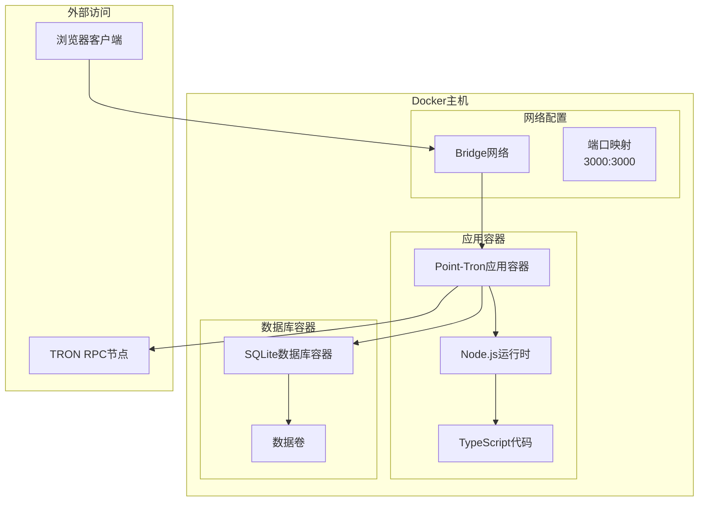
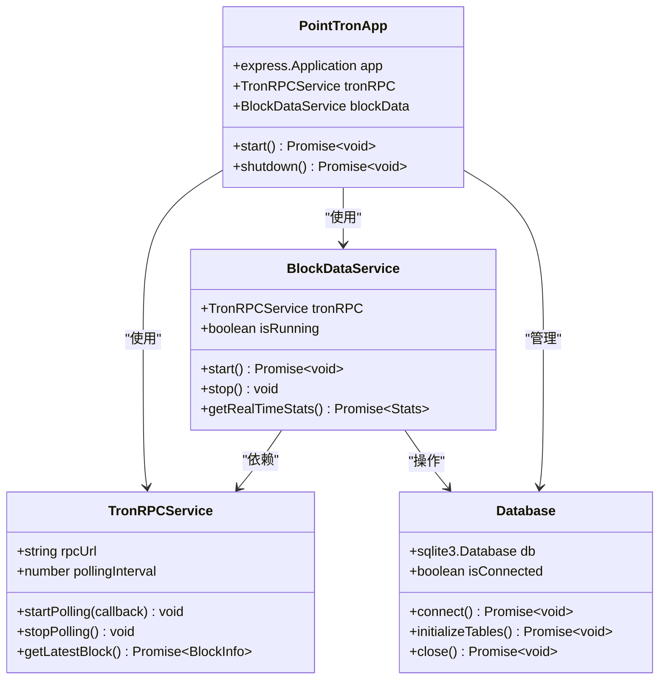
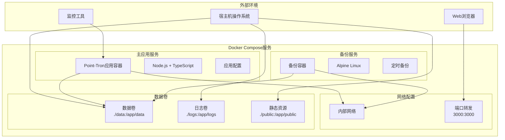
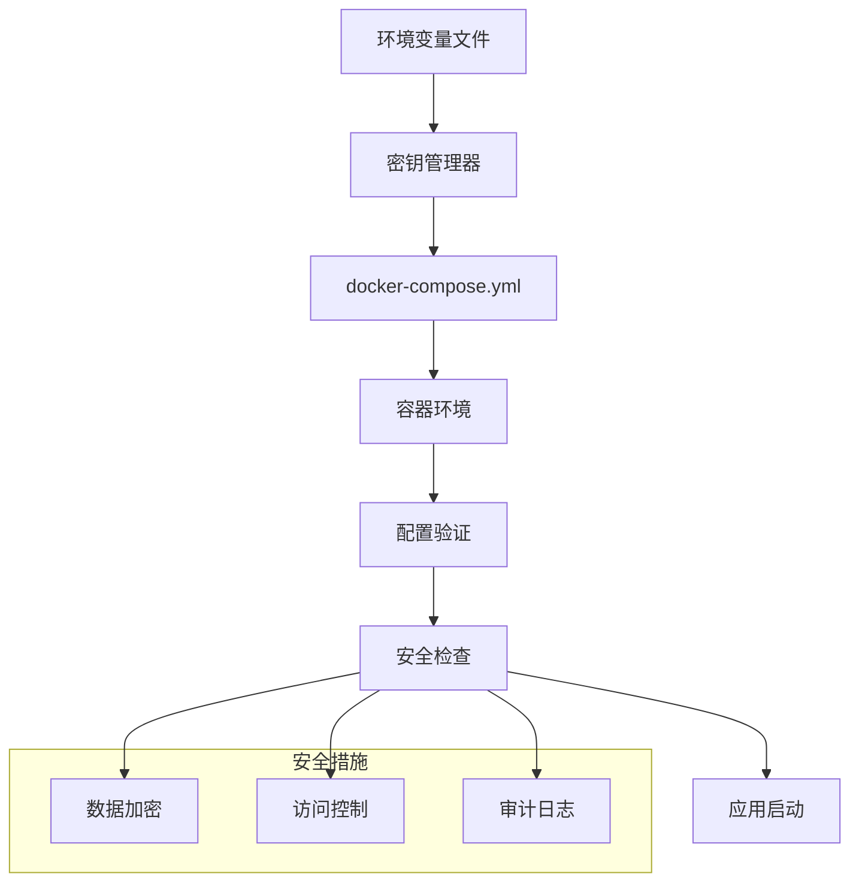
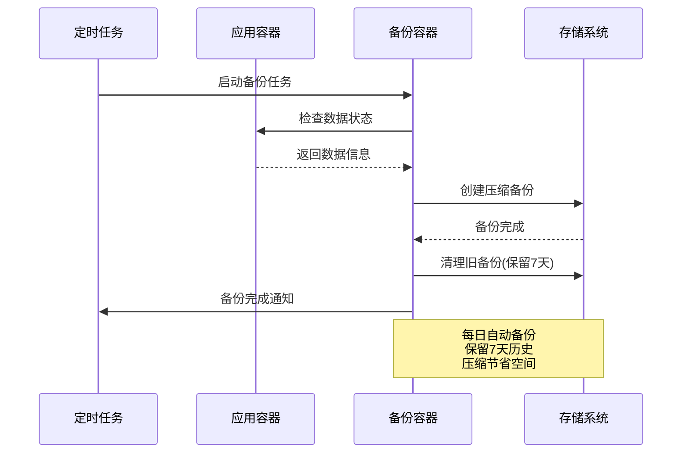
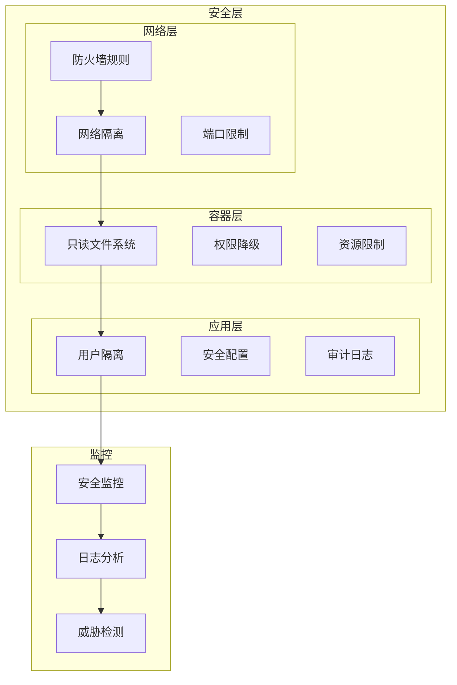
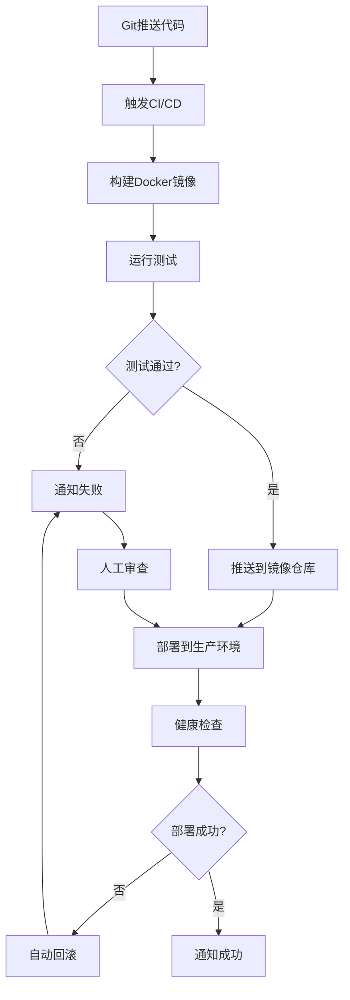
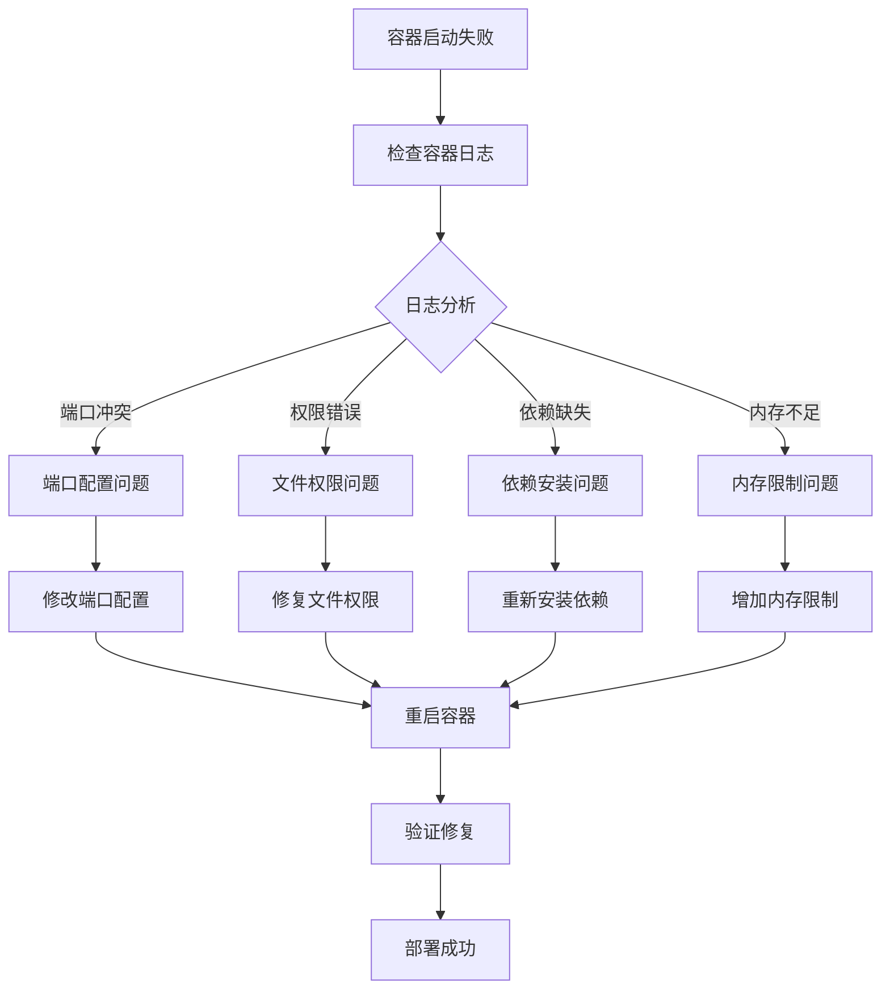

# Docker容器化部署指南

<cite>
**本文档引用的文件**
- [README.md](file://README.md)
- [package.json](file://package.json)
- [src/index.ts](file://src/index.ts)
- [src/config/index.ts](file://src/config/index.ts)
- [src/database/index.ts](file://src/database/index.ts)
- [src/services/TronRPCService.ts](file://src/services/TronRPCService.ts)
- [src/services/BlockDataService.ts](file://src/services/BlockDataService.ts)
- [src/routes/blocks.ts](file://src/routes/blocks.ts)
</cite>

## 目录
1. [项目概述](#项目概述)
2. [Docker部署架构](#docker部署架构)
3. [Dockerfile最佳实践](#dockerfile最佳实践)
4. [多阶段构建优化](#多阶段构建优化)
5. [docker-compose配置](#docker-compose配置)
6. [环境变量管理](#环境变量管理)
7. [数据持久化配置](#数据持久化配置)
8. [网络与安全配置](#网络与安全配置)
9. [容器监控与日志](#容器监控与日志)
10. [部署最佳实践](#部署最佳实践)
11. [故障排除指南](#故障排除指南)

## 项目概述

Point-Tron是一个基于TypeScript和Node.js开发的波场网络区块链数据统计后台管理系统。该系统具有以下特点：

- **实时数据采集**：每3秒自动获取TRON网络最新区块数据
- **智能数据解析**：自动提取区块哈希最后数字并判断单双数
- **统计分析**：提供今日、历史数据统计和趋势分析
- **后台管理**：现代化的Web管理界面
- **安全认证**：JWT令牌认证和用户权限管理
- **数据库存储**：使用SQLite进行数据存储

**章节来源**
- [README.md](file://README.md#L1-L50)
- [src/index.ts](file://src/index.ts#L1-L30)

## Docker部署架构

### 容器化架构设计



**图表来源**
- [src/index.ts](file://src/index.ts#L1-L50)
- [src/database/index.ts](file://src/database/index.ts#L1-L30)

### 容器组件关系



**图表来源**
- [src/index.ts](file://src/index.ts#L15-L35)
- [src/services/TronRPCService.ts](file://src/services/TronRPCService.ts#L15-L40)
- [src/services/BlockDataService.ts](file://src/services/BlockDataService.ts#L10-L25)
- [src/database/index.ts](file://src/database/index.ts#L10-L30)

## Dockerfile最佳实践

### 基础Dockerfile配置

```dockerfile
# 多阶段构建 - 开发阶段
FROM node:18-alpine AS development

WORKDIR /app

# 复制包管理文件
COPY package*.json ./

# 安装生产依赖
RUN npm ci --only=production

# 复制源代码
COPY src/ ./src/
COPY public/ ./public/
COPY data/ ./data/

# 编译TypeScript
RUN npm run build

# 生产阶段
FROM node:18-alpine AS production

WORKDIR /app

# 创建非root用户
RUN addgroup -g 1000 node && adduser -u 1000 -G node -s /bin/sh -D node

# 复制编译后的代码
COPY --from=development /app/dist ./dist
COPY --from=development /app/node_modules ./node_modules
COPY --from=development /app/package.json ./

# 创建数据目录
RUN mkdir -p /app/data && chown -R node:node /app

# 设置工作目录权限
WORKDIR /app

# 切换到非root用户
USER node

EXPOSE 3000

CMD ["npm", "start"]
```

### Dockerfile优化要点

1. **多阶段构建**：分离开发和生产环境
2. **最小化镜像大小**：使用Alpine Linux基础镜像
3. **非root用户运行**：提高安全性
4. **工作目录权限**：确保正确的文件权限
5. **环境隔离**：避免依赖主机环境

**章节来源**
- [package.json](file://package.json#L1-L20)
- [src/index.ts](file://src/index.ts#L1-L20)

## 多阶段构建优化

### 高级多阶段构建方案

```dockerfile
# 构建阶段
FROM node:18-alpine AS builder

WORKDIR /app

# 安装构建依赖
COPY package*.json ./
RUN npm ci

# 复制源代码
COPY src/ ./src/
COPY public/ ./public/

# 编译TypeScript
RUN npm run build

# 生产阶段
FROM node:18-alpine AS production

# 安全配置
RUN apk add --no-cache tini
ENTRYPOINT ["/sbin/tini", "--"]

WORKDIR /app

# 创建应用组和用户
RUN addgroup -g 1000 app && \
    adduser -u 1000 -G app -s /bin/sh -D app

# 复制构建产物
COPY --from=builder /app/dist ./dist
COPY --from=builder /app/node_modules ./node_modules
COPY --from=builder /app/package.json ./

# 创建必要的目录
RUN mkdir -p /app/data /app/public && \
    chown -R app:app /app

# 设置权限
USER app
WORKDIR /app

EXPOSE 3000

# 健康检查
HEALTHCHECK --interval=30s --timeout=10s --start-period=5s --retries=3 \
    CMD curl -f http://localhost:3000/health || exit 1

CMD ["npm", "start"]
```

### 构建优化技术

1. **缓存优化**：合理安排Docker指令顺序
2. **依赖分离**：区分开发和生产依赖
3. **安全加固**：使用tini作为init进程
4. **健康检查**：集成健康检查机制
5. **资源限制**：设置合理的内存和CPU限制

## docker-compose配置

### 完整的docker-compose.yml配置

```yaml
version: '3.8'

services:
  point-tron:
    build:
      context: .
      dockerfile: Dockerfile
      target: production
    container_name: point-tron-app
    restart: unless-stopped
    ports:
      - "3000:3000"
    volumes:
      - ./data:/app/data
      - ./logs:/app/logs
      - ./public:/app/public
    environment:
      - NODE_ENV=production
      - PORT=3000
      - DB_PATH=/app/data/point-tron.db
      - JWT_SECRET=${JWT_SECRET}
      - JWT_EXPIRES_IN=7d
      - TRON_RPC_URL=${TRON_RPC_URL}
      - TRON_TIMEOUT=5000
      - TRON_RETRY_TIMES=3
      - TRON_POLLING_INTERVAL=3000
      - DEFAULT_ADMIN_USERNAME=${DEFAULT_ADMIN_USERNAME}
      - DEFAULT_ADMIN_PASSWORD=${DEFAULT_ADMIN_PASSWORD}
      - SESSION_SECRET=${SESSION_SECRET}
    networks:
      - point-tron-network
    healthcheck:
      test: ["CMD", "curl", "-f", "http://localhost:3000/health"]
      interval: 30s
      timeout: 10s
      retries: 3
      start_period: 30s
    logging:
      driver: "json-file"
      options:
        max-size: "10m"
        max-file: "3"

  # 可选：数据库备份服务
  backup:
    image: alpine:latest
    depends_on:
      - point-tron
    volumes:
      - ./data:/data:ro
      - ./backups:/backups
    command: >
      sh -c "
        while true; do
          tar czf /backups/backup-$$(date +%Y%m%d-%H%M%S).tar.gz /data &&
          find /backups -name 'backup-*.tar.gz' -mtime +7 -delete &&
          sleep 86400;
        done
      "
    networks:
      - point-tron-network

networks:
  point-tron-network:
    driver: bridge
    ipam:
      config:
        - subnet: 172.20.0.0/16
```

### docker-compose服务架构



**图表来源**
- [docker-compose.yml](file://docker-compose.yml#L1-L50)

**章节来源**
- [src/config/index.ts](file://src/config/index.ts#L1-L50)

## 环境变量管理

### 环境变量配置文件

```bash
# .env.production
NODE_ENV=production
PORT=3000

# 数据库配置
DB_PATH=/app/data/point-tron.db

# JWT配置
JWT_SECRET=your-production-jwt-secret-here-keep-it-safe
JWT_EXPIRES_IN=7d

# TRON网络配置
TRON_RPC_URL=https://api.trongrid.io
TRON_TIMEOUT=5000
TRON_RETRY_TIMES=3
TRON_POLLING_INTERVAL=3000

# 默认管理员账户
DEFAULT_ADMIN_USERNAME=admin
DEFAULT_ADMIN_PASSWORD=secure-admin-password

# 会话配置
SESSION_SECRET=your-session-secret-here

# 日志配置
LOG_LEVEL=info
LOG_FORMAT=json

# 性能配置
MAX_REQUEST_SIZE=10mb
RATE_LIMIT_MAX=200
RATE_LIMIT_WINDOW=60000
```

### 环境变量安全配置



**图表来源**
- [src/config/index.ts](file://src/config/index.ts#L20-L50)

**章节来源**
- [src/config/index.ts](file://src/config/index.ts#L1-L52)

## 数据持久化配置

### 卷挂载配置

```yaml
volumes:
  # 数据库文件卷
  - type: volume
    source: point_tron_data
    target: /app/data
    volume:
      driver: local
      driver_opts:
        size: 10G
        encryption: true
  
  # 日志文件卷
  - type: bind
    source: ./logs
    target: /app/logs
    bind:
      propagation: cached
  
  # 静态资源卷
  - type: bind
    source: ./public
    target: /app/public
    bind:
      propagation: delegated
```

### 数据备份策略



**图表来源**
- [docker-compose.yml](file://docker-compose.yml#L30-L50)

**章节来源**
- [src/database/index.ts](file://src/database/index.ts#L10-L20)

## 网络与安全配置

### 容器网络安全

```yaml
networks:
  point-tron-network:
    driver: bridge
    driver_opts:
      com.docker.network.bridge.enable_icc: "true"
      com.docker.network.bridge.enable_ip_masquerade: "true"
    ipam:
      config:
        - subnet: 172.20.0.0/16
          gateway: 172.20.0.1
    internal: false

services:
  point-tron:
    networks:
      - point-tron-network
    security_opt:
      - no-new-privileges:true
    cap_drop:
      - ALL
    cap_add:
      - CHOWN
      - SETUID
      - SETGID
    read_only: true
    tmpfs:
      - /tmp:noexec,nosuid,size=100m
      - /var/tmp:noexec,nosuid,size=100m
```

### 安全加固配置



**章节来源**
- [src/index.ts](file://src/index.ts#L25-L45)

## 容器监控与日志

### 监控配置

```yaml
services:
  point-tron:
    # 健康检查
    healthcheck:
      test: ["CMD", "curl", "-f", "http://localhost:3000/health"]
      interval: 30s
      timeout: 10s
      retries: 3
      start_period: 30s
    
    # 监控指标
    logging:
      driver: "json-file"
      options:
        max-size: "10m"
        max-file: "3"
        labels: "service=point-tron"
    
    # 资源限制
    deploy:
      resources:
        limits:
          memory: 512M
          cpus: '0.5'
        reservations:
          memory: 256M
          cpus: '0.25'
```

### Prometheus监控配置

```yaml
# prometheus.yml
global:
  scrape_interval: 15s

scrape_configs:
  - job_name: 'point-tron'
    static_configs:
      - targets: ['point-tron:3000']
    metrics_path: '/metrics'
    scrape_interval: 10s
    
  - job_name: 'point-tron-health'
    static_configs:
      - targets: ['point-tron:3000']
    metrics_path: '/health'
    scrape_interval: 30s
```

## 部署最佳实践

### CI/CD流水线配置

```yaml
# .github/workflows/deploy.yml
name: Deploy Point-Tron

on:
  push:
    branches: [main]
  pull_request:
    branches: [main]

jobs:
  build-and-deploy:
    runs-on: ubuntu-latest
    
    steps:
    - uses: actions/checkout@v3
    
    - name: Set up Node.js
      uses: actions/setup-node@v3
      with:
        node-version: '18'
        cache: 'npm'
    
    - name: Install dependencies
      run: npm ci
    
    - name: Build application
      run: npm run build
    
    - name: Run tests
      run: npm test
    
    - name: Build Docker image
      run: |
        docker build -t point-tron:${{ github.sha }} .
        docker tag point-tron:${{ github.sha }} point-tron:latest
    
    - name: Push to registry
      run: |
        echo ${{ secrets.DOCKER_PASSWORD }} | docker login -u ${{ secrets.DOCKER_USERNAME }} --password-stdin
        docker push point-tron:${{ github.sha }}
        docker push point-tron:latest
    
    - name: Deploy to production
      run: |
        # 使用kubectl或docker-compose部署
        kubectl set image deployment/point-tron point-tron=point-tron:${{ github.sha }}
```

### 部署流程图



**章节来源**
- [package.json](file://package.json#L6-L12)

## 故障排除指南

### 常见问题诊断



### 故障排除命令

```bash
# 查看容器状态
docker ps -a

# 查看容器日志
docker logs point-tron-app --tail 100 -f

# 进入容器调试
docker exec -it point-tron-app /bin/sh

# 检查磁盘空间
df -h

# 检查内存使用
free -m

# 检查网络连接
docker network inspect point-tron-network

# 重建并强制缓存清除
docker-compose build --no-cache
```

### 性能优化建议

1. **资源监控**：定期检查容器资源使用情况
2. **日志轮转**：配置日志轮转避免磁盘空间耗尽
3. **健康检查**：完善健康检查机制
4. **自动重启**：配置适当的重启策略
5. **备份策略**：建立定期备份机制

**章节来源**
- [src/index.ts](file://src/index.ts#L120-L140)
- [src/database/index.ts](file://src/database/index.ts#L200-L240)

## 总结

通过本指南，您已经掌握了Point-Tron项目的完整Docker容器化部署方案。主要要点包括：

1. **多阶段构建**：优化镜像大小和安全性
2. **环境变量管理**：安全地管理敏感配置
3. **数据持久化**：确保数据安全和备份
4. **网络配置**：合理规划容器网络
5. **监控和日志**：建立完善的监控体系
6. **CI/CD集成**：自动化部署流程

这些最佳实践将帮助您构建稳定、安全、可扩展的容器化应用环境。