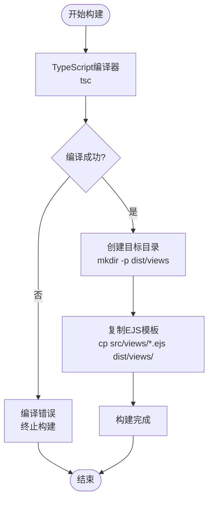
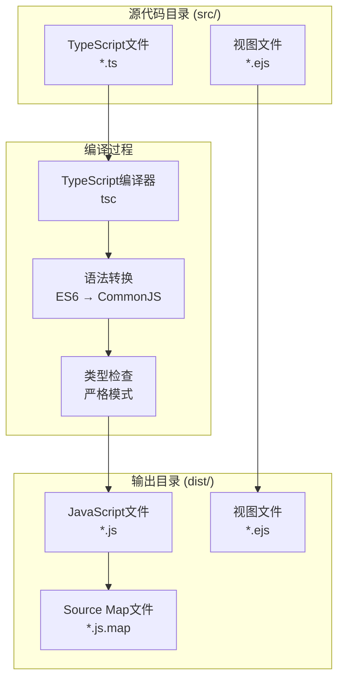
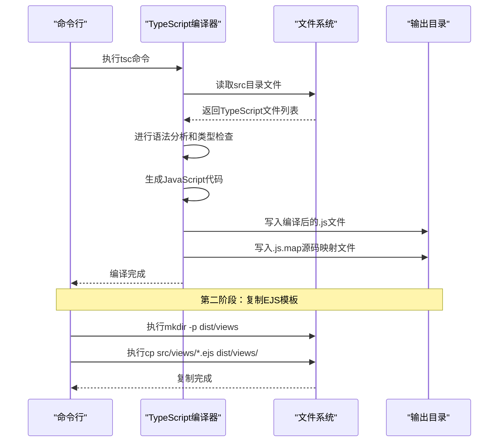
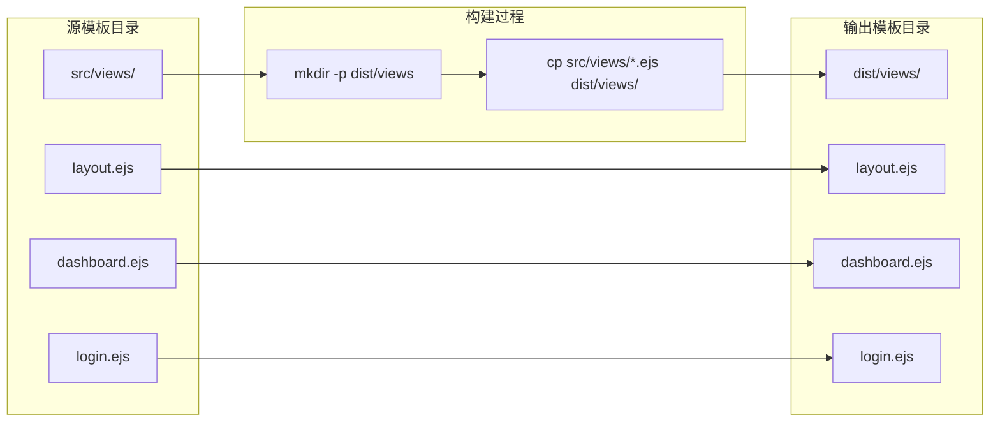

# 构建与编译流程

<cite>
**本文档引用的文件**
- [package.json](file://package.json)
- [tsconfig.json](file://tsconfig.json)
- [src/index.ts](file://src/index.ts)
- [src/models/UserModel.ts](file://src/models/UserModel.ts)
- [src/services/TronRPCService.ts](file://src/services/TronRPCService.ts)
- [src/views/layout.ejs](file://src/views/layout.ejs)
- [README.md](file://README.md)
</cite>

## 目录
1. [项目概述](#项目概述)
2. [构建脚本详解](#构建脚本详解)
3. [TypeScript编译配置](#typescript编译配置)
4. [编译流程分析](#编译流程分析)
5. [EJS模板处理](#ejs模板处理)
6. [常见编译错误及解决方案](#常见编译错误及解决方案)
7. [自定义构建流程](#自定义构建流程)
8. [最佳实践建议](#最佳实践建议)

## 项目概述

Point-Tron是一个基于TypeScript和Node.js开发的波场网络区块链数据统计后台管理系统。该项目采用现代的TypeScript开发模式，通过精心设计的构建流程将源代码编译为可在生产环境中运行的JavaScript代码。

项目的核心特点包括：
- 实时监控波场网络每3秒的出块情况
- 统计区块哈希最后一个阿拉伯数字的单双数规律
- 提供可视化的数据分析界面
- 完整的TypeScript类型检查和编译流程

## 构建脚本详解

### npm run build命令结构

根据项目的`package.json`配置，`npm run build`命令包含三个主要步骤：

```json
{
  "scripts": {
    "build": "tsc && mkdir -p dist/views && cp src/views/*.ejs dist/views/"
  }
}
```

这个命令由三个部分组成：

1. **tsc** - TypeScript编译器执行核心编译任务
2. **mkdir -p dist/views** - 创建目标目录结构
3. **cp src/views/*.ejs dist/views/** - 复制EJS模板文件

### 构建脚本执行顺序



**章节来源**
- [package.json](file://package.json#L6-L8)

## TypeScript编译配置

### tsconfig.json配置分析

项目的TypeScript编译配置位于根目录的`tsconfig.json`文件中：

```json
{
  "compilerOptions": {
    "target": "es6",
    "module": "commonjs",
    "moduleResolution": "node",
    "outDir": "./dist",
    "rootDir": "./src",
    "strict": true,
    "esModuleInterop": true,
    "skipLibCheck": true
  },
  "include": ["src/**/*"]
}
```

### 编译选项详解

#### 输出配置
- **target**: es6 - 编译为ES6语法，支持现代JavaScript特性
- **module**: commonjs - 使用CommonJS模块系统，兼容Node.js环境
- **outDir**: ./dist - 编译后的JavaScript文件输出到dist目录
- **rootDir**: ./src - 源代码根目录为src

#### 功能配置
- **strict**: true - 启用严格类型检查模式
- **esModuleInterop**: true - 支持ES模块与CommonJS模块互操作
- **skipLibCheck**: true - 跳过库文件的类型检查，提高编译速度

#### 文件包含规则
- **include**: ["src/**/*"] - 包含src目录下所有文件进行编译

### 编译过程可视化



**图表来源**
- [tsconfig.json](file://tsconfig.json#L1-L14)
- [src/index.ts](file://src/index.ts#L1-L10)

**章节来源**
- [tsconfig.json](file://tsconfig.json#L1-L14)

## 编译流程分析

### tsc编译器工作原理

TypeScript编译器（tsc）负责将TypeScript源代码转换为JavaScript代码。在Point-Tron项目中，编译过程遵循以下步骤：

#### 1. 语法分析阶段
- 解析TypeScript语法树
- 检查语法错误
- 构建抽象语法树（AST）

#### 2. 类型检查阶段
- 遵循严格模式进行类型验证
- 检查变量声明和使用
- 验证函数参数和返回值类型

#### 3. 代码生成阶段
- 将TypeScript语法转换为JavaScript
- 生成对应的JavaScript文件
- 创建source map文件用于调试

### 编译输出结构

编译完成后，项目会在`dist/`目录下生成以下结构：

```
dist/
├── index.js              # 主应用入口
├── index.js.map          # 源代码映射
├── config/               # 配置模块
│   ├── index.js
│   └── index.js.map
├── database/             # 数据库模块
│   ├── index.js
│   └── index.js.map
├── middleware/           # 中间件模块
│   └── auth.js
│   └── auth.js.map
├── models/               # 数据模型
│   ├── BlockModel.js
│   ├── UserModel.js
│   └── ...
├── routes/               # 路由模块
│   ├── auth.js
│   ├── blocks.js
│   └── ...
├── services/             # 业务服务
│   ├── AuthService.js
│   ├── BlockDataService.js
│   └── ...
└── views/                # 视图模板（后续复制）
```

### 编译流程时序图



**图表来源**
- [src/index.ts](file://src/index.ts#L1-L163)
- [src/models/UserModel.ts](file://src/models/UserModel.ts#L1-L100)

**章节来源**
- [src/index.ts](file://src/index.ts#L1-L163)
- [src/models/UserModel.ts](file://src/models/UserModel.ts#L1-L100)

## EJS模板处理

### 模板文件复制机制

项目中的EJS模板文件处理是一个重要的构建步骤，确保前端视图能够正确加载：

```bash
mkdir -p dist/views && cp src/views/*.ejs dist/views/
```

### 模板文件结构

项目包含以下EJS模板文件：

```
src/views/
├── layout.ejs           # 页面布局模板
├── dashboard.ejs        # 仪表板页面
└── login.ejs           # 登录页面
```

### 模板处理流程



**图表来源**
- [src/views/layout.ejs](file://src/views/layout.ejs#L1-L81)

### 模板文件内容分析

以`layout.ejs`为例，这是一个典型的HTML模板文件：

```html
<!DOCTYPE html>
<html lang="zh-CN">
<head>
    <meta charset="UTF-8">
    <meta name="viewport" content="width=device-width, initial-scale=1.0">
    <title><%= title %></title>
    <!-- 引入Bootstrap和Font Awesome -->
    <link href="https://cdn.jsdelivr.net/npm/bootstrap@5.3.0/dist/css/bootstrap.min.css" rel="stylesheet">
    <link href="https://cdnjs.cloudflare.com/ajax/libs/font-awesome/6.0.0/css/all.min.css" rel="stylesheet">
</head>
<body>
    <%- body %>
    <!-- 引入JavaScript库 -->
    <script src="https://cdn.jsdelivr.net/npm/bootstrap@5.3.0/dist/js/bootstrap.bundle.min.js"></script>
    <script src="https://cdn.jsdelivr.net/npm/echarts@5.4.0/dist/echarts.min.js"></script>
</body>
</html>
```

### 模板渲染机制

Express.js框架使用EJS作为模板引擎，支持动态内容渲染：

- `<%= variable %>` - 输出变量值（HTML转义）
- `<%- variable %>` - 输出原始HTML内容
- `<% code %>` - 执行JavaScript代码

**章节来源**
- [src/views/layout.ejs](file://src/views/layout.ejs#L1-L81)

## 常见编译错误及解决方案

### 类型检查失败

#### 错误现象
```
src/models/UserModel.ts:15:25 - error TS2339: Property 'run' does not exist on type 'Database'.
```

#### 解决方案
1. **检查类型定义**：确认数据库对象是否正确定义
2. **安装类型包**：`npm install @types/sqlite3 --save-dev`
3. **更新接口定义**：在`src/models/types.ts`中添加正确的接口

### 文件路径错误

#### 错误现象
```
Cannot find module './config' or its corresponding type declarations.
```

#### 解决方案
1. **检查文件路径**：确认相对路径是否正确
2. **添加类型声明**：在`src/models/types.ts`中添加模块声明
3. **配置别名**：在`tsconfig.json`中添加`paths`配置

### 模块解析失败

#### 错误现象
```
Module '"express"' has no exported member 'Application'.
```

#### 解决方案
1. **更新依赖版本**：`npm update express`
2. **检查类型定义**：确认`@types/express`版本匹配
3. **清理缓存**：`rm -rf node_modules package-lock.json && npm install`

### 编译性能优化

#### 问题：编译速度慢
**解决方案**：
- 启用增量编译：`"incremental": true`
- 跳过库检查：`"skipLibCheck": true`
- 使用`ts-node`进行开发时的快速编译

#### 问题：内存占用过高
**解决方案**：
- 分批编译大型项目
- 使用`--build`模式进行增量编译
- 限制并发编译任务数量

### 调试技巧

#### 启用详细输出
```bash
tsc --verbose
```

#### 生成源码映射
```bash
tsc --sourceMap
```

#### 检查类型定义
```bash
tsc --noEmitOnError
```

## 自定义构建流程

### 添加新的构建步骤

可以根据项目需求扩展构建流程。例如，添加代码压缩和资源优化：

```json
{
  "scripts": {
    "build": "tsc && mkdir -p dist/views && cp src/views/*.ejs dist/views/ && terser dist/**/*.js -o dist/ --compress --mangle"
  }
}
```

### 环境特定构建

为不同环境创建专门的构建脚本：

```json
{
  "scripts": {
    "build:dev": "tsc && cp src/views/*.ejs dist/views/",
    "build:prod": "tsc --minify && cp src/views/*.ejs dist/views/ && gzip dist/**/*.js",
    "build:test": "tsc --sourceMap && cp src/views/*.ejs dist/views/"
  }
}
```

### Docker化构建流程

创建Dockerfile优化构建过程：

```dockerfile
FROM node:18-alpine AS builder
WORKDIR /app
COPY package*.json ./
RUN npm ci --only=production
COPY . .
RUN npm run build

FROM node:18-alpine AS runtime
WORKDIR /app
COPY --from=builder /app/dist ./dist
COPY --from=builder /app/node_modules ./node_modules
EXPOSE 3000
CMD ["node", "dist/index.js"]
```

### CI/CD集成

在GitHub Actions中配置自动化构建：

```yaml
name: Build and Deploy
on:
  push:
    branches: [main]

jobs:
  build:
    runs-on: ubuntu-latest
    steps:
      - uses: actions/checkout@v3
      - name: Setup Node.js
        uses: actions/setup-node@v3
        with:
          node-version: '18'
      - name: Install dependencies
        run: npm ci
      - name: Run tests
        run: npm test
      - name: Build project
        run: npm run build
      - name: Upload artifacts
        uses: actions/upload-artifact@v3
        with:
          name: compiled-code
          path: dist/
```

## 最佳实践建议

### 构建流程优化

1. **并行构建**：利用多核CPU加速编译过程
2. **缓存机制**：启用增量编译减少重复工作
3. **依赖管理**：定期更新依赖包保持安全性
4. **代码分割**：按功能模块组织代码提高编译效率

### 开发环境配置

```json
{
  "scripts": {
    "dev": "nodemon --exec ts-node src/index.ts",
    "build:watch": "tsc --watch"
  }
}
```

### 生产环境部署

1. **代码混淆**：使用工具混淆JavaScript代码
2. **资源压缩**：压缩CSS、JavaScript和图片资源
3. **静态资源优化**：使用CDN加速静态资源加载
4. **安全加固**：移除开发工具和调试信息

### 监控和维护

1. **构建时间监控**：跟踪构建时间变化
2. **错误率统计**：监控编译错误发生频率
3. **依赖安全扫描**：定期扫描依赖包安全漏洞
4. **性能基准测试**：建立构建性能基线

### 团队协作规范

1. **统一编码风格**：使用ESLint和Prettier
2. **代码审查流程**：建立严格的代码审查机制
3. **文档同步更新**：确保构建文档与实际流程一致
4. **知识分享**：定期组织技术分享会

通过遵循这些最佳实践，可以确保TypeScript项目的构建流程高效、稳定且易于维护，为项目的长期发展奠定坚实基础。