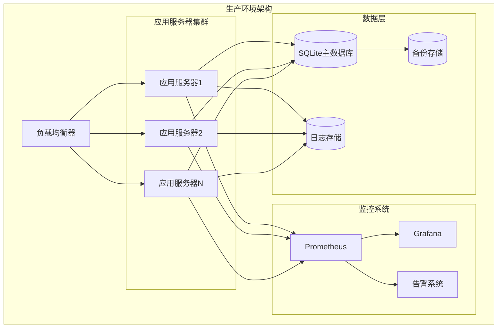
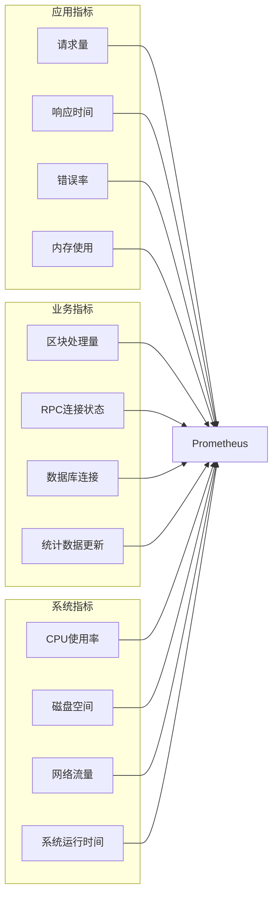
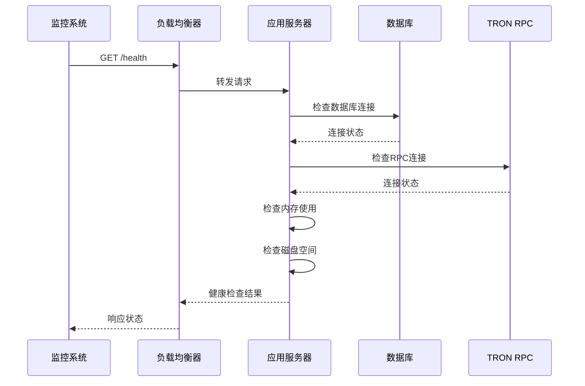
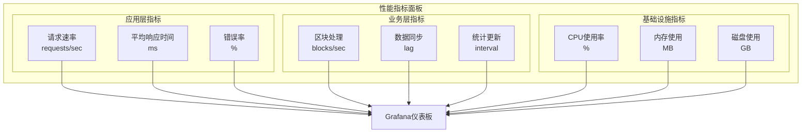
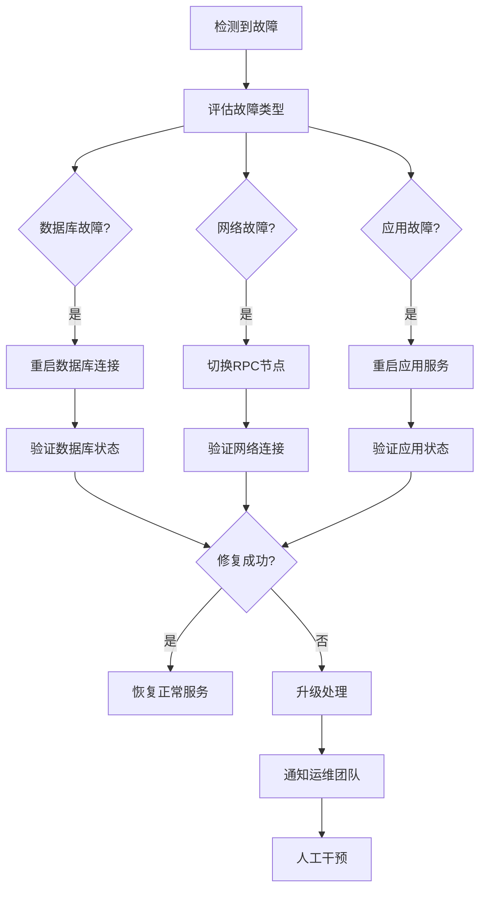
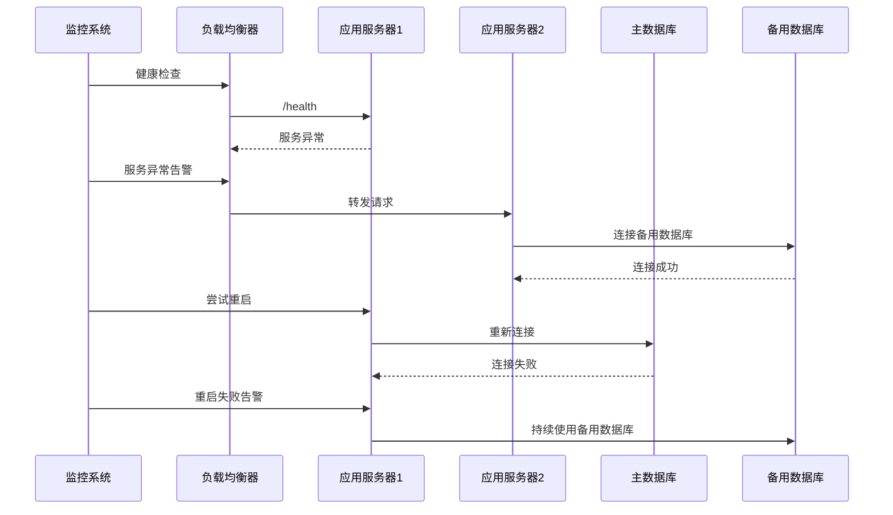

# 监控与备份策略

<cite>
**本文档引用的文件**
- [src/index.ts](file://src/index.ts)
- [src/config/index.ts](file://src/config/index.ts)
- [src/database/index.ts](file://src/database/index.ts)
- [src/middleware/auth.ts](file://src/middleware/auth.ts)
- [src/services/BlockDataService.ts](file://src/services/BlockDataService.ts)
- [src/services/TronRPCService.ts](file://src/services/TronRPCService.ts)
- [src/routes/system.ts](file://src/routes/system.ts)
- [src/models/BlockModel.ts](file://src/models/BlockModel.ts)
- [src/models/DailyStatsModel.ts](file://src/models/DailyStatsModel.ts)
- [package.json](file://package.json)
</cite>

## 目录
1. [概述](#概述)
2. [系统架构概览](#系统架构概览)
3. [日志记录最佳实践](#日志记录最佳实践)
4. [监控系统设计](#监控系统设计)
5. [健康检查端点](#健康检查端点)
6. [性能指标监控](#性能指标监控)
7. [数据备份策略](#数据备份策略)
8. [故障预警机制](#故障预警机制)
9. [自动恢复机制](#自动恢复机制)
10. [运维部署指南](#运维部署指南)

## 概述

Point-Tron是一个基于TypeScript和Node.js开发的波场网络区块链数据统计后台管理系统。该系统在生产环境中需要实施全面的监控和备份策略，以确保系统的高可用性和数据安全性。本文档详细说明了如何在生产环境下配置系统监控、日志记录、数据备份和故障恢复机制。

## 系统架构概览



**图表来源**
- [src/index.ts](file://src/index.ts#L1-L50)
- [src/config/index.ts](file://src/config/index.ts#L1-L30)

## 日志记录最佳实践

### 日志级别配置

系统采用以下日志级别分类：

```typescript
// 生产环境日志配置
const logLevels = {
  ERROR: 'ERROR',     // 严重错误，需要立即处理
  WARN: 'WARN',       // 警告信息，潜在问题
  INFO: 'INFO',       // 一般信息，系统状态
  DEBUG: 'DEBUG',     // 调试信息，开发阶段使用
  TRACE: 'TRACE'      // 详细跟踪信息
};
```

### 日志格式标准化

```typescript
// 统一日志格式
interface LogEntry {
  timestamp: string;
  level: string;
  service: string;
  message: string;
  metadata?: Record<string, any>;
  stack?: string;
}
```

### 日志轮转策略

```bash
# 使用logrotate配置
# /etc/logrotate.d/point-tron
/var/log/point-tron/*.log {
    daily
    rotate 30
    compress
    delaycompress
    missingok
    notifempty
    create 644 root root
    postrotate
        systemctl reload rsyslog
    endscript
}
```

### 集中日志收集

推荐使用ELK Stack（Elasticsearch, Logstash, Kibana）进行日志集中管理：

```yaml
# docker-compose.yml 示例
version: '3.8'
services:
  elasticsearch:
    image: docker.elastic.co/elasticsearch/elasticsearch:8.11.0
    environment:
      - discovery.type=single-node
      - xpack.security.enabled=false
    ports:
      - "9200:9200"
      
  logstash:
    image: docker.elastic.co/logstash/logstash:8.11.0
    volumes:
      - ./logstash.conf:/usr/share/logstash/pipeline/logstash.conf
    ports:
      - "5044:5044"
      
  kibana:
    image: docker.elastic.co/kibana/kibana:8.11.0
    ports:
      - "5601:5601"
    depends_on:
      - elasticsearch
```

**章节来源**
- [src/middleware/auth.ts](file://src/middleware/auth.ts#L75-L85)
- [src/index.ts](file://src/index.ts#L45-L55)

## 监控系统设计

### Prometheus集成

```yaml
# prometheus.yml 配置
global:
  scrape_interval: 15s

scrape_configs:
  - job_name: 'point-tron'
    static_configs:
      - targets: ['localhost:3000']
    metrics_path: '/metrics'
    scrape_interval: 10s
    
  - job_name: 'node-exporter'
    static_configs:
      - targets: ['node-exporter:9100']
```

### 关键监控指标



**图表来源**
- [src/services/BlockDataService.ts](file://src/services/BlockDataService.ts#L248-L272)
- [src/routes/system.ts](file://src/routes/system.ts#L10-L40)

### Grafana仪表板配置

```json
{
  "dashboard": {
    "title": "Point-Tron 监控面板",
    "panels": [
      {
        "title": "系统健康状态",
        "type": "stat",
        "targets": [
          {
            "expr": "point_tron_health_status",
            "legendFormat": "健康状态"
          }
        ]
      },
      {
        "title": "区块处理统计",
        "type": "graph",
        "targets": [
          {
            "expr": "rate(point_tron_blocks_processed_total[5m])",
            "legendFormat": "区块处理速率"
          }
        ]
      }
    ]
  }
}
```

**章节来源**
- [src/services/BlockDataService.ts](file://src/services/BlockDataService.ts#L248-L272)
- [src/routes/system.ts](file://src/routes/system.ts#L10-L40)

## 健康检查端点

### /health端点实现

系统已经实现了基本的健康检查端点：

```typescript
// 健康检查端点
this.app.get('/health', (req, res) => {
  res.json({
    success: true,
    data: {
      status: 'healthy',
      timestamp: new Date().toISOString(),
      uptime: process.uptime(),
      database: database.isConnectedToDb(),
      rpcPolling: this.tronRPCService.getPollingStatus().isActive
    }
  });
});
```

### 健康检查扩展

```typescript
// 扩展的健康检查服务
class HealthCheckService {
  async comprehensiveHealthCheck(): Promise<HealthCheckResult> {
    const checks = await Promise.all([
      this.checkDatabaseConnection(),
      this.checkRPCConection(),
      this.checkMemoryUsage(),
      this.checkDiskSpace(),
      this.checkNetworkConnectivity()
    ]);
    
    const overallStatus = checks.every(check => check.healthy);
    
    return {
      healthy: overallStatus,
      timestamp: new Date().toISOString(),
      checks: checks,
      summary: this.generateSummary(checks)
    };
  }
}
```

### 健康检查API设计



**图表来源**
- [src/index.ts](file://src/index.ts#L65-L75)
- [src/services/BlockDataService.ts](file://src/services/BlockDataService.ts#L248-L272)

**章节来源**
- [src/index.ts](file://src/index.ts#L65-L75)
- [src/services/BlockDataService.ts](file://src/services/BlockDataService.ts#L248-L272)

## 性能指标监控

### 关键性能指标(KPI)

```typescript
// 性能指标收集器
class MetricsCollector {
  private metrics = {
    requests: 0,
    errors: 0,
    responseTime: 0,
    databaseConnections: 0,
    rpcCalls: 0,
    memoryUsage: 0
  };
  
  recordRequest(duration: number, isError: boolean = false) {
    this.metrics.requests++;
    if (isError) this.metrics.errors++;
    this.metrics.responseTime = duration;
  }
  
  updateDatabaseMetrics(connections: number) {
    this.metrics.databaseConnections = connections;
  }
  
  updateMemoryUsage(usage: number) {
    this.metrics.memoryUsage = usage;
  }
}
```

### 性能基准测试

```bash
# 使用Apache Bench进行压力测试
ab -n 1000 -c 10 http://localhost:3000/

# 使用wrk进行更精确的压力测试
wrk -t12 -c400 -d30s --latency http://localhost:3000/

# 使用autocannon进行Node.js优化测试
npx autocannon -c 100 -d 30 http://localhost:3000/
```

### 性能监控仪表板



**图表来源**
- [src/routes/system.ts](file://src/routes/system.ts#L10-L40)
- [src/services/BlockDataService.ts](file://src/services/BlockDataService.ts#L100-L130)

**章节来源**
- [src/routes/system.ts](file://src/routes/system.ts#L10-L40)
- [src/services/BlockDataService.ts](file://src/services/BlockDataService.ts#L100-L130)

## 数据备份策略

### SQLite数据库备份方案

#### 冷备份策略

```bash
#!/bin/bash
# 冷备份脚本

DB_PATH="./data/point-tron.db"
BACKUP_DIR="/backup/point-tron"
DATE=$(date +%Y%m%d_%H%M%S)
BACKUP_FILE="$BACKUP_DIR/point-tron-$DATE.db"

# 创建备份目录
mkdir -p $BACKUP_DIR

# 停止应用
pm2 stop point-tron

# 执行备份
cp $DB_PATH $BACKUP_FILE

# 启动应用
pm2 start point-tron

# 压缩备份文件
gzip $BACKUP_FILE

# 清理旧备份（保留30天）
find $BACKUP_DIR -name "*.gz" -mtime +30 -delete

echo "备份完成: $BACKUP_FILE.gz"
```

#### 热备份策略

```typescript
// 热备份服务实现
class HotBackupService {
  async createHotBackup(): Promise<BackupResult> {
    const backupFile = `point-tron-hot-${Date.now()}.db`;
    const tempFile = `/tmp/${backupFile}`;
    
    try {
      // 使用SQLite的在线备份API
      await this.performOnlineBackup(tempFile);
      
      // 加密备份文件
      await this.encryptBackup(tempFile);
      
      // 上传到远程存储
      await this.uploadToRemoteStorage(tempFile + '.enc');
      
      return {
        success: true,
        filename: backupFile,
        size: await this.getFileSize(tempFile + '.enc')
      };
      
    } catch (error) {
      return {
        success: false,
        error: error.message
      };
    }
  }
  
  private async performOnlineBackup(destFile: string): Promise<void> {
    // 使用SQLite在线备份API
    const db = await sqlite3.open(this.config.database.path);
    const destDb = await sqlite3.open(destFile);
    
    let progress = await db.backup(destDb, 'main', 'main', -1, null, null);
    while (progress.remaining > 0) {
      progress = await db.backup(destDb, 'main', 'main', -1, null, null);
    }
    
    await db.close();
    await destDb.close();
  }
}
```

### 备份文件加密

```bash
# 使用AES-256加密备份文件
encrypt_backup() {
  local backup_file=$1
  local encrypted_file="${backup_file}.enc"
  
  openssl enc -aes-256-cbc -salt -in "$backup_file" \
    -out "$encrypted_file" -pass pass:"$ENCRYPTION_KEY"
  
  echo "备份文件已加密: $encrypted_file"
}
```

### 异地备份存储

```yaml
# AWS S3备份配置
aws s3 sync /backup/point-tron s3://point-tron-backup-prod/ \
  --storage-class STANDARD_IA \
  --acl private \
  --sse AES256
```

### 备份验证和恢复测试

```typescript
// 备份验证服务
class BackupValidator {
  async validateBackup(backupFile: string): Promise<ValidationResult> {
    try {
      // 验证文件完整性
      const integrityCheck = await this.checkFileIntegrity(backupFile);
      
      // 验证数据库结构
      const schemaCheck = await this.validateDatabaseSchema(backupFile);
      
      // 验证关键数据
      const dataCheck = await this.validateCriticalData(backupFile);
      
      return {
        isValid: integrityCheck.isValid && schemaCheck.isValid && dataCheck.isValid,
        issues: [...integrityCheck.issues, ...schemaCheck.issues, ...dataCheck.issues]
      };
      
    } catch (error) {
      return {
        isValid: false,
        issues: [`验证过程中发生错误: ${error.message}`]
      };
    }
  }
}
```

**章节来源**
- [src/database/index.ts](file://src/database/index.ts#L218-L248)
- [src/index.ts](file://src/index.ts#L140-L160)

## 故障预警机制

### 告警规则配置

```yaml
# alertmanager.yml 配置
route:
  group_by: ['alertname']
  group_wait: 10s
  group_interval: 10s
  repeat_interval: 1h
  receiver: 'web.hook'

receivers:
- name: 'web.hook'
  webhook_configs:
  - url: 'http://localhost:5001/alerts'
    send_resolved: true

# 告警规则
groups:
- name: point-tron-alerts
  rules:
  - alert: HighErrorRate
    expr: rate(http_requests_total{status=~"5.."}[5m]) > 0.1
    for: 2m
    labels:
      severity: critical
    annotations:
      summary: "高错误率检测"
      description: "应用程序错误率超过10%"
      
  - alert: DatabaseDown
    expr: point_tron_database_connected == 0
    for: 1m
    labels:
      severity: critical
    annotations:
      summary: "数据库连接中断"
      description: "数据库连接已断开超过1分钟"
```

### 多级告警通知

```typescript
// 告警通知服务
class AlertNotificationService {
  async notifyAlert(alert: Alert): Promise<void> {
    const notificationChannels = [
      { type: 'slack', config: SLACK_WEBHOOK },
      { type: 'email', config: EMAIL_CONFIG },
      { type: 'sms', config: SMS_CONFIG }
    ];
    
    for (const channel of notificationChannels) {
      try {
        await this.sendNotification(channel, alert);
      } catch (error) {
        console.error(`通知渠道 ${channel.type} 发送失败:`, error);
      }
    }
  }
  
  private async sendNotification(channel: NotificationChannel, alert: Alert): Promise<void> {
    switch (channel.type) {
      case 'slack':
        await this.sendSlackNotification(channel.config, alert);
        break;
      case 'email':
        await this.sendEmailNotification(channel.config, alert);
        break;
      case 'sms':
        await this.sendSMSNotification(channel.config, alert);
        break;
    }
  }
}
```

### 故障自愈机制



**图表来源**
- [src/services/BlockDataService.ts](file://src/services/BlockDataService.ts#L248-L272)
- [src/services/TronRPCService.ts](file://src/services/TronRPCService.ts#L40-L80)

**章节来源**
- [src/services/BlockDataService.ts](file://src/services/BlockDataService.ts#L248-L272)
- [src/services/TronRPCService.ts](file://src/services/TronRPCService.ts#L40-L80)

## 自动恢复机制

### 应用自动重启

```bash
# PM2配置文件
{
  "name": "point-tron",
  "script": "dist/index.js",
  "exec_mode": "cluster",
  "instances": "max",
  "autorestart": true,
  "max_memory_restart": "1G",
  "restart_delay": 1000,
  "watch": false,
  "env_production": {
    "NODE_ENV": "production",
    "PORT": "3000"
  }
}
```

### 数据库连接池管理

```typescript
// 数据库连接池管理器
class DatabasePoolManager {
  private pool: Pool;
  private unhealthyNodes: Set<string> = new Set();
  
  async getConnection(): Promise<Connection> {
    const availableNodes = this.getAvailableNodes();
    
    for (const node of availableNodes) {
      try {
        const connection = await this.createConnection(node);
        return connection;
      } catch (error) {
        this.unhealthyNodes.add(node);
        console.warn(`节点 ${node} 连接失败:`, error.message);
      }
    }
    
    throw new Error('所有数据库节点均不可用');
  }
  
  private getAvailableNodes(): string[] {
    const allNodes = this.config.nodes;
    return allNodes.filter(node => !this.unhealthyNodes.has(node));
  }
}
```

### 故障转移策略



**图表来源**
- [src/index.ts](file://src/index.ts#L140-L160)
- [src/database/index.ts](file://src/database/index.ts#L218-L248)

**章节来源**
- [src/index.ts](file://src/index.ts#L140-L160)
- [src/database/index.ts](file://src/database/index.ts#L218-L248)

## 运维部署指南

### Docker容器化部署

```dockerfile
# Dockerfile
FROM node:18-alpine

WORKDIR /app
COPY package*.json ./
RUN npm ci --only=production

COPY dist/ ./dist/
COPY src/views/ ./src/views/

EXPOSE 3000
CMD ["node", "dist/index.js"]
```

```yaml
# docker-compose.yml
version: '3.8'
services:
  point-tron:
    build: .
    ports:
      - "3000:3000"
    volumes:
      - ./data:/app/data
      - ./logs:/app/logs
    environment:
      - NODE_ENV=production
      - PORT=3000
      - DB_PATH=/app/data/point-tron.db
    restart: unless-stopped
    healthcheck:
      test: ["CMD", "curl", "-f", "http://localhost:3000/health"]
      interval: 30s
      timeout: 10s
      retries: 3
```

### Kubernetes部署配置

```yaml
# deployment.yaml
apiVersion: apps/v1
kind: Deployment
metadata:
  name: point-tron
spec:
  replicas: 3
  selector:
    matchLabels:
      app: point-tron
  template:
    metadata:
      labels:
        app: point-tron
    spec:
      containers:
      - name: point-tron
        image: point-tron:latest
        ports:
        - containerPort: 3000
        env:
        - name: NODE_ENV
          value: "production"
        - name: DB_PATH
          value: "/data/point-tron.db"
        volumeMounts:
        - name: data-volume
          mountPath: /data
        livenessProbe:
          httpGet:
            path: /health
            port: 3000
          initialDelaySeconds: 30
          periodSeconds: 10
        readinessProbe:
          httpGet:
            path: /health
            port: 3000
          initialDelaySeconds: 5
          periodSeconds: 5
      volumes:
      - name: data-volume
        persistentVolumeClaim:
          claimName: point-tron-pvc
```

### CI/CD流水线

```yaml
# .github/workflows/deploy.yml
name: Deploy Point-Tron

on:
  push:
    branches: [main]

jobs:
  test:
    runs-on: ubuntu-latest
    steps:
    - uses: actions/checkout@v2
    - name: Setup Node.js
      uses: actions/setup-node@v2
      with:
        node-version: '18'
    - name: Install dependencies
      run: npm ci
    - name: Run tests
      run: npm test
      
  deploy:
    needs: test
    runs-on: ubuntu-latest
    if: github.ref == 'refs/heads/main'
    steps:
    - uses: actions/checkout@v2
    - name: Build and deploy
      run: |
        docker build -t point-tron:${{ github.sha }} .
        docker tag point-tron:${{ github.sha }} registry.example.com/point-tron:latest
        docker push registry.example.com/point-tron:latest
        kubectl set image deployment/point-tron point-tron=registry.example.com/point-tron:latest
```

### 生产环境配置

```bash
# 生产环境启动脚本
#!/bin/bash

# 环境变量配置
export NODE_ENV=production
export PORT=3000
export DB_PATH=/opt/point-tron/data/point-tron.db
export JWT_SECRET=$(openssl rand -hex 32)
export TRON_RPC_URL=https://api.trongrid.io

# 启动应用
pm2 start dist/index.js --name point-tron --max-memory-restart 1G

# 设置开机自启
pm2 startup systemd
pm2 save
```

### 监控和告警配置

```bash
# 监控脚本
#!/bin/bash
# monitor.sh

# 检查应用状态
check_app() {
  curl -f http://localhost:3000/health >/dev/null 2>&1
  if [ $? -ne 0 ]; then
    echo "应用服务异常"
    # 发送告警
    send_alert "应用服务异常"
  fi
}

# 检查磁盘空间
check_disk_space() {
  usage=$(df /opt/point-tron | awk 'NR==2 {print $5}' | sed 's/%//')
  if [ $usage -gt 80 ]; then
    echo "磁盘空间不足: ${usage}%"
    send_alert "磁盘空间不足: ${usage}%"
  fi
}

# 检查内存使用
check_memory() {
  usage=$(free | awk 'NR==2{printf "%.2f", $3*100/$2}')
  if [ $(echo "$usage > 85" | bc) -eq 1 ]; then
    echo "内存使用过高: ${usage}%"
    send_alert "内存使用过高: ${usage}%"
  fi
}

# 发送告警
send_alert() {
  local message=$1
  curl -X POST $WEBHOOK_URL \
    -H 'Content-type: application/json' \
    --data '{"text":"'$message'"}'
}

# 主循环
while true; do
  check_app
  check_disk_space
  check_memory
  sleep 60
done
```

**章节来源**
- [package.json](file://package.json#L1-L39)
- [src/config/index.ts](file://src/config/index.ts#L1-L52)

## 总结

本文档详细介绍了Point-Tron系统在生产环境下的监控和备份策略。通过实施全面的监控体系、自动化备份流程和故障预警机制，可以确保系统的高可用性和数据安全性。

### 关键要点

1. **监控体系**: 使用Prometheus和Grafana实现全方位监控
2. **日志管理**: 标准化日志格式和集中化存储
3. **备份策略**: 冷备份和热备份相结合，支持异地存储
4. **故障预警**: 多级告警机制和自动恢复流程
5. **运维自动化**: Docker容器化和CI/CD流水线

通过遵循这些最佳实践，可以显著提高系统的稳定性和可靠性，减少运维工作量，并确保在出现故障时能够快速恢复服务。