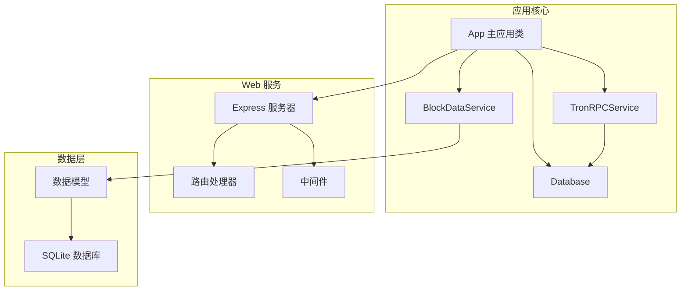
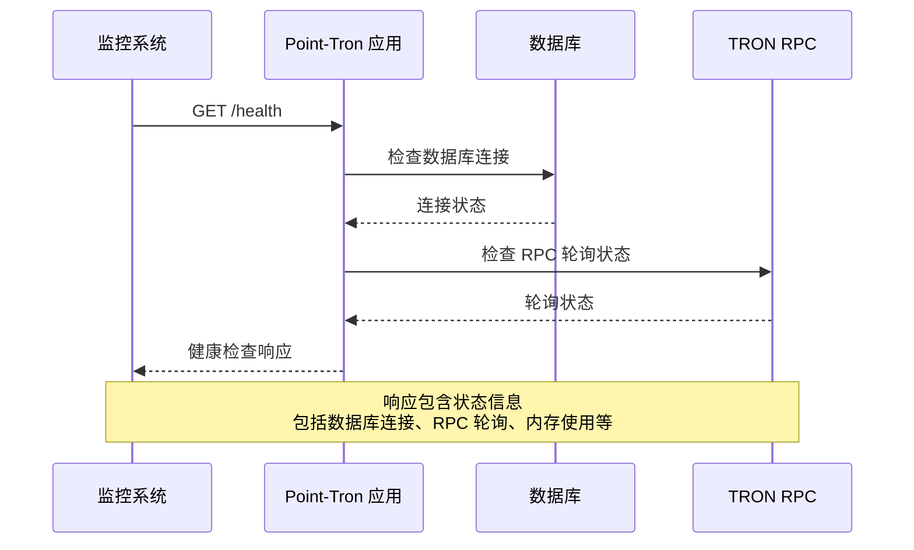

# 进程管理与守护

<cite>
**本文档引用的文件**
- [src/index.ts](file://src/index.ts)
- [src/config/index.ts](file://src/config/index.ts)
- [src/services/TronRPCService.ts](file://src/services/TronRPCService.ts)
- [src/services/BlockDataService.ts](file://src/services/BlockDataService.ts)
- [src/database/index.ts](file://src/database/index.ts)
- [src/routes/system.ts](file://src/routes/system.ts)
- [package.json](file://package.json)
- [README.md](file://README.md)
</cite>

## 目录
1. [简介](#简介)
2. [应用架构概述](#应用架构概述)
3. [PM2 进程管理配置](#pm2-进程管理配置)
4. [Systemd 服务配置](#systemd-服务配置)
5. [进程监控与健康检查](#进程监控与健康检查)
6. [日志管理与轮转](#日志管理与轮转)
7. [性能优化建议](#性能优化建议)
8. [故障排除指南](#故障排除指南)
9. [总结](#总结)

## 简介

Point-Tron 是一个基于 Node.js 和 Express 的 TRON 波场网络区块链数据统计后台管理系统。该应用需要持续运行以监控 TRON 网络区块数据，进行实时统计分析，并提供 Web 管理界面。为了确保应用在生产环境中稳定运行，必须采用适当的进程管理工具来守护应用进程。

本文档将详细介绍如何使用 PM2 和 systemd 等进程管理工具来守护 Point-Tron 应用，包括配置方法、最佳实践和运维技巧。

## 应用架构概述

Point-Tron 应用的核心组件包括：



**图表来源**
- [src/index.ts](file://src/index.ts#L1-L40)
- [src/services/TronRPCService.ts](file://src/services/TronRPCService.ts#L1-L50)
- [src/services/BlockDataService.ts](file://src/services/BlockDataService.ts#L1-L50)

**章节来源**
- [src/index.ts](file://src/index.ts#L1-L161)
- [src/services/TronRPCService.ts](file://src/services/TronRPCService.ts#L1-L258)
- [src/services/BlockDataService.ts](file://src/services/BlockDataService.ts#L1-L273)

## PM2 进程管理配置

### PM2 基本概念

PM2 是一个先进的 Node.js 进程管理器，提供了负载均衡、零停机重载、进程监控等功能。对于 Point-Tron 这样的长期运行的应用程序，PM2 提供了以下优势：

- 自动进程重启机制
- 内存和 CPU 使用监控
- 日志聚合和管理
- 集群模式支持
- 进程状态监控

### PM2 生态系统配置文件

创建 `ecosystem.config.js` 文件：

```javascript
module.exports = {
  apps: [{
    name: 'point-tron',
    script: './dist/index.js',
    cwd: '/opt/point-tron',
    exec_mode: 'fork',
    instances: 1,
    autorestart: true,
    watch: false,
    max_memory_restart: '512M',
    env: {
      NODE_ENV: 'production',
      PORT: '3000',
      DB_PATH: './data/point-tron.db',
      TRON_RPC_URL: 'https://api.trongrid.io',
      TRON_POLLING_INTERVAL: '3000'
    },
    env_production: {
      NODE_ENV: 'production',
      PORT: '3000',
      DB_PATH: '/var/lib/point-tron/data/point-tron.db',
      LOG_DIR: '/var/log/point-tron'
    },
    out_file: '/var/log/point-tron/out.log',
    error_file: '/var/log/point-tron/error.log',
    log_date_format: 'YYYY-MM-DD HH:mm:ss',
    merge_logs: true,
    log_file_max_size: '100MB',
    log_file_max_files: 10
  }]
};
```

### PM2 配置详解

#### 应用基本信息
- **name**: 应用名称，用于标识和管理
- **script**: 应用入口文件，指向编译后的 JavaScript 文件
- **cwd**: 工作目录，指定应用运行的工作环境

#### 运行模式配置
- **exec_mode**: 执行模式，这里使用 fork 模式
- **instances**: 进程实例数，根据 CPU 核心数调整
- **autorestart**: 启用自动重启功能

#### 内存和资源限制
- **max_memory_restart**: 内存使用上限，超过时自动重启
- **watch**: 是否启用文件监视，开发模式下使用

#### 环境变量配置
- **NODE_ENV**: 环境变量，影响应用行为
- **PORT**: 服务端口
- **DB_PATH**: 数据库文件路径
- **TRON_RPC_URL**: TRON 网络 RPC 地址

#### 日志配置
- **out_file**: 标准输出日志文件
- **error_file**: 错误输出日志文件
- **log_date_format**: 日志时间格式
- **merge_logs**: 合并标准输出和错误输出
- **log_file_max_size**: 单个日志文件大小限制
- **log_file_max_files**: 保留的日志文件数量

### PM2 命令行操作

#### 启动应用
```bash
# 使用生态系统文件启动
pm2 start ecosystem.config.js

# 或者直接启动
pm2 start dist/index.js --name point-tron
```

#### 进程管理
```bash
# 查看进程状态
pm2 list

# 查看应用详情
pm2 describe point-tron

# 查看应用日志
pm2 logs point-tron

# 重启应用
pm2 restart point-tron

# 停止应用
pm2 stop point-tron

# 删除应用
pm2 delete point-tron
```

#### 进程监控
```bash
# 显示详细的进程信息
pm2 monit

# 显示内存使用情况
pm2 show point-tron
```

**章节来源**
- [src/index.ts](file://src/index.ts#L88-L117)
- [src/config/index.ts](file://src/config/index.ts#L1-L51)

## Systemd 服务配置

### Systemd 服务单元文件

创建 `/etc/systemd/system/point-tron.service` 文件：

```ini
[Unit]
Description=Point-Tron TRON Blockchain Data Statistics
Documentation=https://github.com/your-repo/point-tron
After=network.target
Wants=network.target

[Service]
Type=simple
User=point-tron
Group=point-tron
WorkingDirectory=/opt/point-tron
ExecStart=/usr/bin/node dist/index.js
Restart=always
RestartSec=10
StandardOutput=journal
StandardError=journal
SyslogIdentifier=point-tron
KillMode=mixed
TimeoutStopSec=30
Environment=NODE_ENV=production
Environment=PORT=3000
Environment=DB_PATH=./data/point-tron.db
Environment=TRON_RPC_URL=https://api.trongrid.io
Environment=TRON_POLLING_INTERVAL=3000

[Install]
WantedBy=multi-user.target
```

### Systemd 配置详解

#### [Unit] 部分
- **Description**: 服务描述
- **Documentation**: 文档链接
- **After**: 服务启动顺序依赖
- **Wants**: 强制依赖的服务

#### [Service] 部分
- **Type**: 服务类型，simple 表示简单服务
- **User/Group**: 运行服务的用户和组
- **WorkingDirectory**: 工作目录
- **ExecStart**: 启动命令
- **Restart**: 重启策略，always 表示总是重启
- **RestartSec**: 重启等待时间
- **StandardOutput/Error**: 日志输出方式
- **SyslogIdentifier**: 日志标识符
- **KillMode**: 进程终止方式
- **TimeoutStopSec**: 停止超时时间
- **Environment**: 环境变量

#### [Install] 部分
- **WantedBy**: 服务目标，multi-user.target 表示多用户文本模式

### Systemd 服务管理

#### 服务安装和启用
```bash
# 重新加载 systemd 配置
sudo systemctl daemon-reload

# 启用服务自启动
sudo systemctl enable point-tron

# 启动服务
sudo systemctl start point-tron

# 查看服务状态
sudo systemctl status point-tron
```

#### 服务控制
```bash
# 停止服务
sudo systemctl stop point-tron

# 重启服务
sudo systemctl restart point-tron

# 查看服务日志
sudo journalctl -u point-tron -f
```

### Systemd vs PM2 对比

| 特性 | Systemd | PM2 |
|------|---------|-----|
| 启动方式 | 系统级启动 | 应用级启动 |
| 权限管理 | 系统权限 | 应用权限 |
| 日志集成 | journald | 自定义日志 |
| 进程监控 | 基础监控 | 详细监控 |
| 集群模式 | 不支持 | 支持 |
| 配置复杂度 | 中等 | 简单 |

**章节来源**
- [src/index.ts](file://src/index.ts#L145-L161)
- [src/config/index.ts](file://src/config/index.ts#L25-L51)

## 进程监控与健康检查

### 健康检查端点

Point-Tron 提供了内置的健康检查端点 `/health`，可以用来监控应用状态：



**图表来源**
- [src/routes/system.ts](file://src/routes/system.ts#L10-L46)
- [src/index.ts](file://src/index.ts#L65-L75)

### 健康检查响应结构

```json
{
  "success": true,
  "data": {
    "status": "healthy",
    "timestamp": "2024-01-01T12:00:00.000Z",
    "uptime": 3600.5,
    "database": {
      "isConnected": true,
      "totalBlocks": 10000,
      "todayBlocks": 150
    },
    "rpcPolling": {
      "isActive": true,
      "interval": 3000,
      "consecutiveErrors": 0
    }
  }
}
```

### 监控脚本示例

创建监控脚本 `monitor.sh`：

```bash
#!/bin/bash

# 健康检查 URL
HEALTH_URL="http://localhost:3000/health"
LOG_FILE="/var/log/point-tron-monitor.log"

# 发送健康检查请求
check_health() {
    local response=$(curl -s -w "%{http_code}" -o /tmp/health_check_response.txt $HEALTH_URL)
    echo "$response"
}

# 检查响应码
check_response() {
    local response=$1
    if [[ $response -eq 200 ]]; then
        echo "$(date '+%Y-%m-%d %H:%M:%S') - 健康检查通过" >> $LOG_FILE
        return 0
    else
        echo "$(date '+%Y-%m-%d %H:%M:%S') - 健康检查失败，HTTP状态码: $response" >> $LOG_FILE
        return 1
    fi
}

# 主监控逻辑
main() {
    local response=$(check_health)
    if check_response $response; then
        exit 0
    else
        # 发送告警通知
        send_alert "Point-Tron 应用健康检查失败"
        exit 1
    fi
}

# 发送告警通知
send_alert() {
    local message=$1
    # 可以集成邮件、短信、Slack 等通知方式
    echo "$message" | mail -s "Point-Tron 监控告警" admin@example.com
}

# 执行主监控逻辑
main
```

### 自动重启配置

#### PM2 自动重启
```bash
# 设置最大重启次数
pm2 set point-tron max-restarts 5

# 设置重启延迟
pm2 set point-tron restart-delay 5000

# 设置最大内存限制
pm2 set point-tron max-memory-limit 512M
```

#### Systemd 自动重启
```ini
[Service]
Restart=always
RestartSec=10
StartLimitBurst=5
StartLimitIntervalSec=300
```

**章节来源**
- [src/routes/system.ts](file://src/routes/system.ts#L1-L47)
- [src/index.ts](file://src/index.ts#L65-L75)

## 日志管理与轮转

### PM2 日志管理

#### 日志配置
```javascript
module.exports = {
  apps: [{
    // ... 其他配置
    out_file: '/var/log/point-tron/out.log',
    error_file: '/var/log/point-tron/error.log',
    log_date_format: 'YYYY-MM-DD HH:mm:ss',
    merge_logs: true,
    log_file_max_size: '100MB',
    log_file_max_files: 10
  }]
};
```

#### 日志查看
```bash
# 查看实时日志
pm2 logs point-tron

# 查看最近的日志
pm2 logs point-tron --lines 100

# 清空日志
pm2 flush point-tron
```

### Systemd 日志集成

#### journald 配置
```bash
# 查看应用日志
journalctl -u point-tron -f

# 查看最近的 100 行日志
journalctl -u point-tron -n 100

# 查看特定时间段的日志
journalctl -u point-tron --since "2024-01-01" --until "2024-01-02"
```

#### 日志轮转配置

创建 `/etc/logrotate.d/point-tron`：

```bash
/var/log/point-tron/*.log {
    daily
    missingok
    rotate 30
    compress
    delaycompress
    notifempty
    create 0644 point-tron point-tron
    postrotate
        systemctl reload point-tron
    endscript
}
```

### 应用内日志配置

#### 结构化日志记录
```typescript
// 在 src/index.ts 中添加日志配置
import winston from 'winston';

const logger = winston.createLogger({
  level: 'info',
  format: winston.format.combine(
    winston.format.timestamp(),
    winston.format.json()
  ),
  transports: [
    new winston.transports.File({ filename: 'error.log', level: 'error' }),
    new winston.transports.File({ filename: 'combined.log' })
  ]
});
```

#### 日志级别配置
```typescript
// 根据环境设置日志级别
const logLevel = process.env.NODE_ENV === 'production' ? 'info' : 'debug';
logger.level = logLevel;
```

**章节来源**
- [src/index.ts](file://src/index.ts#L88-L117)
- [package.json](file://package.json#L1-L39)

## 性能优化建议

### 内存优化

#### Node.js 内存配置
```bash
# 设置 Node.js 内存限制
export NODE_OPTIONS="--max-old-space-size=512"

# 启动应用时设置
node --max-old-space-size=512 dist/index.js
```

#### PM2 内存监控
```bash
# 查看内存使用情况
pm2 monit

# 设置内存警告阈值
pm2 set point-tron max-memory-limit 512M
```

### CPU 优化

#### 进程实例配置
```javascript
// 根据 CPU 核心数设置实例数
const os = require('os');
const cpuCount = os.cpus().length;

module.exports = {
  apps: [{
    // ... 其他配置
    instances: cpuCount,
    exec_mode: 'cluster'
  }]
};
```

#### 负载均衡
```bash
# 启用集群模式
pm2 start dist/index.js -i max --name point-tron
```

### 数据库优化

#### 连接池配置
```typescript
// 在 database/index.ts 中添加连接池
private pool: sqlite3.Database;

public async connect(): Promise<void> {
  return new Promise((resolve, reject) => {
    this.pool = new sqlite3.Database(config.database.path, {
      flags: sqlite3.OPEN_READWRITE | sqlite3.OPEN_CREATE,
      cacheSize: -2000, // 2MB 缓存
      synchronous: 'NORMAL',
      journalMode: 'WAL'
    }, (err) => {
      if (err) reject(err);
      else resolve();
    });
  });
}
```

### 网络优化

#### 请求超时配置
```typescript
// 在 TronRPCService 中优化超时设置
private async makeHttpRequest(endpoint: string, requestData: any): Promise<TronBlockResponse> {
  const controller = new AbortController();
  const timeoutId = setTimeout(() => controller.abort(), 10000); // 10秒超时
  
  try {
    const response = await fetch(url, {
      method: 'POST',
      headers: {
        'Content-Type': 'application/json',
        'User-Agent': 'Point-Tron/1.0'
      },
      body: JSON.stringify(requestData),
      signal: controller.signal,
      timeout: 10000
    });
    
    return response.json();
  } finally {
    clearTimeout(timeoutId);
  }
}
```

**章节来源**
- [src/services/TronRPCService.ts](file://src/services/TronRPCService.ts#L100-L150)
- [src/database/index.ts](file://src/database/index.ts#L25-L50)

## 故障排除指南

### 常见问题诊断

#### 应用无法启动

```bash
# 检查端口占用
netstat -tulpn | grep :3000

# 检查依赖安装
npm install --production

# 检查环境变量
echo $NODE_ENV
echo $PORT

# 查看启动日志
pm2 logs point-tron --lines 100
```

#### 数据库连接问题

```bash
# 检查数据库文件权限
ls -la ./data/

# 检查磁盘空间
df -h

# 检查数据库文件完整性
sqlite3 ./data/point-tron.db ".tables"
```

#### TRON RPC 连接问题

```bash
# 测试 RPC 连接
curl -X POST https://api.trongrid.io/wallet/getnowblock \
  -H "Content-Type: application/json" \
  -d '{}'

# 检查网络连通性
ping api.trongrid.io

# 检查防火墙设置
sudo ufw status
```

### 性能问题排查

#### 内存泄漏检测
```bash
# 使用 Node.js 内置工具
node --inspect dist/index.js

# 使用 heapdump 模块
npm install heapdump
```

#### CPU 使用率过高
```bash
# 查看 CPU 使用情况
top -p $(pgrep -f point-tron)

# 分析 CPU 使用热点
perf top -p $(pgrep -f point-tron)
```

### 日志分析

#### 错误日志分析
```bash
# 查找错误信息
grep -i "error\|exception\|failed" /var/log/point-tron/*.log

# 统计错误频率
awk '/ERROR/ {print $1}' /var/log/point-tron/error.log | sort | uniq -c
```

#### 性能日志分析
```bash
# 分析响应时间
grep "response_time" /var/log/point-tron/access.log | awk '{sum+=$NF; count++} END {print "Average:", sum/count}'
```

### 应急恢复流程

#### 快速重启
```bash
# PM2 重启
pm2 restart point-tron

# Systemd 重启
sudo systemctl restart point-tron
```

#### 数据恢复
```bash
# 停止应用
pm2 stop point-tron

# 备份当前数据
cp -r ./data ./data_backup_$(date +%Y%m%d_%H%M%S)

# 重置数据库
rm ./data/point-tron.db

# 重启应用
pm2 start point-tron
```

**章节来源**
- [src/index.ts](file://src/index.ts#L119-L140)
- [src/database/index.ts](file://src/database/index.ts#L200-L249)

## 总结

本文档详细介绍了如何使用 PM2 和 systemd 来守护 Point-Tron 应用，涵盖了以下关键内容：

### 主要配置要点

1. **PM2 配置**：提供了完整的生态系统配置文件，包括进程管理、日志配置、环境变量设置等
2. **Systemd 配置**：创建了系统级服务单元文件，实现了开机自启动和进程监控
3. **健康检查**：利用应用内置的健康检查端点进行状态监控
4. **日志管理**：配置了日志轮转和集中管理方案

### 最佳实践建议

1. **监控策略**：结合健康检查端点和进程监控工具实现全面监控
2. **日志管理**：采用结构化日志和日志轮转策略
3. **性能优化**：根据应用特点进行内存、CPU 和数据库优化
4. **故障处理**：建立完善的故障诊断和应急恢复流程

### 选择建议

- **PM2** 更适合开发和测试环境，以及需要集群模式的应用
- **Systemd** 更适合生产环境，特别是需要系统级集成的场景

通过合理的进程管理和运维实践，可以确保 Point-Tron 应用在生产环境中稳定、高效地运行，为 TRON 网络区块数据统计提供可靠的技术支撑。