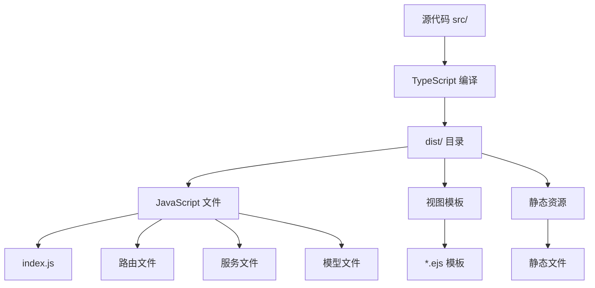

# 部署配置

<cite>
**本文档中引用的文件**
- [package.json](file://package.json)
- [src/index.ts](file://src/index.ts)
- [src/config/index.ts](file://src/config/index.ts)
- [src/middleware/auth.ts](file://src/middleware/auth.ts)
- [tsconfig.json](file://tsconfig.json)
</cite>

## 目录
1. [简介](#简介)
2. [开发环境部署](#开发环境部署)
3. [生产环境构建](#生产环境构建)
4. [进程管理工具配置](#进程管理工具配置)
5. [Docker容器化部署](#docker容器化部署)
6. [Nginx反向代理配置](#nginx反向代理配置)
7. [生产环境配置](#生产环境配置)
8. [日志管理](#日志管理)
9. [性能监控](#性能监控)
10. [备份策略](#备份策略)
11. [故障排除](#故障排除)

## 简介

Point-Tron是一个基于TypeScript开发的TRON波场网络区块链数据统计后台管理系统。本部署指南提供了从开发到生产环境的完整部署方案，包括代码编译、进程管理、容器化部署、反向代理配置等关键环节。

## 开发环境部署

### 环境要求

- Node.js 16.x 或更高版本
- npm 8.x 或更高版本
- Git

### 依赖安装

```bash
# 克隆项目
git clone https://github.com/your-repository/point-tron.git
cd point-tron

# 安装依赖
npm install
```

### 开发模式运行

```bash
# 启动开发服务器
npm run dev

# 应用将在 http://localhost:3000 运行
```

开发模式使用 `ts-node` 直接运行 TypeScript 文件，无需编译过程，适合开发调试。

**章节来源**
- [package.json](file://package.json#L6-L10)

## 生产环境构建

### TypeScript 编译

项目使用 TypeScript 编写，生产环境需要先进行编译：

```bash
# 编译 TypeScript 到 JavaScript
npm run build

# 编译后的文件位于 dist/ 目录
ls -la dist/
```

编译过程会：
1. 使用 TypeScript 编译器将 `.ts` 文件编译为 `.js` 文件
2. 创建 `dist/views/` 目录并复制 EJS 模板文件
3. 生成优化的 JavaScript 代码

### 构建输出结构



**图表来源**
- [package.json](file://package.json#L7-L8)
- [tsconfig.json](file://tsconfig.json#L1-L14)

### 启动生产应用

```bash
# 启动编译后的应用
npm start

# 或者直接使用 Node.js
node dist/index.js
```

**章节来源**
- [package.json](file://package.json#L7-L9)
- [src/index.ts](file://src/index.ts#L150-L155)

## 进程管理工具配置

### PM2 配置

PM2 是一个强大的进程管理工具，适合生产环境部署：

```bash
# 全局安装 PM2
npm install pm2 -g

# 启动应用
pm2 start dist/index.js --name "point-tron" --watch

# 查看应用状态
pm2 status

# 设置开机自启
pm2 startup
pm2 save
```

#### PM2 配置文件 (ecosystem.config.js)

```javascript
module.exports = {
  apps: [{
    name: 'point-tron',
    script: 'dist/index.js',
    instances: 1,
    exec_mode: 'cluster',
    env: {
      NODE_ENV: 'production',
      PORT: 3000,
      DB_PATH: '/var/lib/point-tron/data/point-tron.db'
    },
    env_production: {
      NODE_ENV: 'production',
      PORT: 3000,
      DB_PATH: '/var/lib/point-tron/data/point-tron.db'
    }
  }]
};
```

### systemd 服务配置

对于 Linux 系统，可以使用 systemd 来管理应用：

```ini
# /etc/systemd/system/point-tron.service
[Unit]
Description=Point-Tron TRON Blockchain Management System
After=network.target

[Service]
Type=simple
User=point-tron
Group=point-tron
WorkingDirectory=/opt/point-tron
ExecStart=/usr/bin/npm start
Restart=always
RestartSec=10
Environment=NODE_ENV=production
Environment=PORT=3000
Environment=DB_PATH=/var/lib/point-tron/data/point-tron.db

[Install]
WantedBy=multi-user.target
```

```bash
# 启用并启动服务
sudo systemctl enable point-tron
sudo systemctl start point-tron
sudo systemctl status point-tron
```

## Docker容器化部署

### Dockerfile 配置

```dockerfile
FROM node:18-alpine AS builder

WORKDIR /app
COPY package*.json ./
RUN npm ci --only=production && npm cache clean --force

COPY . .
RUN npm run build

FROM node:18-alpine AS runtime

WORKDIR /app
COPY --from=builder /app/dist ./dist
COPY --from=builder /app/node_modules ./node_modules
COPY --from=builder /app/package*.json ./

EXPOSE 3000
CMD ["npm", "start"]
```

### Docker Compose 配置

```yaml
version: '3.8'

services:
  point-tron:
    build: .
    ports:
      - "3000:3000"
    volumes:
      - ./data:/app/data
      - ./logs:/app/logs
    environment:
      - NODE_ENV=production
      - PORT=3000
      - DB_PATH=/app/data/point-tron.db
      - TRON_RPC_URL=https://api.trongrid.io
    restart: unless-stopped
    healthcheck:
      test: ["CMD", "curl", "-f", "http://localhost:3000/health"]
      interval: 30s
      timeout: 10s
      retries: 3
      start_period: 40s

  nginx:
    image: nginx:alpine
    ports:
      - "80:80"
      - "443:443"
    volumes:
      - ./nginx.conf:/etc/nginx/nginx.conf
      - ./ssl:/etc/nginx/ssl
    depends_on:
      - point-tron
    restart: unless-stopped
```

### Docker 部署命令

```bash
# 构建镜像
docker build -t point-tron .

# 运行容器
docker run -d \
  --name point-tron \
  -p 3000:3000 \
  -v /var/lib/point-tron/data:/app/data \
  -v /var/log/point-tron:/app/logs \
  -e NODE_ENV=production \
  -e PORT=3000 \
  point-tron

# 使用 Docker Compose
docker-compose up -d
```

## Nginx反向代理配置

### 基础反向代理配置

```nginx
upstream point_tron_backend {
    server 127.0.0.1:3000;
    keepalive 32;
}

server {
    listen 80;
    server_name your-domain.com;
    return 301 https://$server_name$request_uri;
}

server {
    listen 443 ssl http2;
    server_name your-domain.com;

    # SSL证书配置
    ssl_certificate /etc/nginx/ssl/your-domain.crt;
    ssl_certificate_key /etc/nginx/ssl/your-domain.key;
    ssl_protocols TLSv1.2 TLSv1.3;
    ssl_ciphers ECDHE-RSA-AES256-GCM-SHA512:DHE-RSA-AES256-GCM-SHA512;
    ssl_prefer_server_ciphers off;

    # 安全头
    add_header X-Frame-Options DENY;
    add_header X-Content-Type-Options nosniff;
    add_header X-XSS-Protection "1; mode=block";
    add_header Strict-Transport-Security "max-age=31536000; includeSubDomains";

    # 反向代理配置
    location / {
        proxy_pass http://point_tron_backend;
        proxy_http_version 1.1;
        proxy_set_header Upgrade $http_upgrade;
        proxy_set_header Connection 'upgrade';
        proxy_set_header Host $host;
        proxy_set_header X-Real-IP $remote_addr;
        proxy_set_header X-Forwarded-For $proxy_add_x_forwarded_for;
        proxy_set_header X-Forwarded-Proto $scheme;
        proxy_cache_bypass $http_upgrade;
        
        # 超时设置
        proxy_connect_timeout 60s;
        proxy_send_timeout 60s;
        proxy_read_timeout 60s;
    }

    # 静态文件缓存
    location /static/ {
        alias /app/public/;
        expires 1y;
        add_header Cache-Control "public, immutable";
    }

    # 健康检查
    location /health {
        proxy_pass http://point_tron_backend;
        access_log off;
    }

    # 错误页面
    error_page 500 502 503 504 /50x.html;
    location = /50x.html {
        root /usr/share/nginx/html;
    }
}
```

### HTTPS 证书获取

```bash
# 安装 Certbot
sudo apt-get install certbot python3-certbot-nginx

# 获取免费SSL证书
sudo certbot --nginx -d your-domain.com

# 自动续期测试
sudo certbot renew --dry-run
```

## 生产环境配置

### 环境变量配置

创建 `.env.production` 文件：

```bash
# 基础配置
NODE_ENV=production
PORT=3000

# 数据库配置
DB_PATH=/var/lib/point-tron/data/point-tron.db

# JWT配置
JWT_SECRET=your-production-jwt-secret-keep-it-safe
JWT_EXPIRES_IN=7d

# TRON RPC配置
TRON_RPC_URL=https://api.trongrid.io
TRON_TIMEOUT=5000
TRON_RETRY_TIMES=3
TRON_POLLING_INTERVAL=3000

# 管理员账户
DEFAULT_ADMIN_USERNAME=admin
DEFAULT_ADMIN_PASSWORD=your-strong-password

# 会话密钥
SESSION_SECRET=your-session-secret-for-production
```

### 安全配置

```typescript
// src/config/security.ts
export const securityConfig = {
  // 生产环境CORS配置
  cors: {
    origin: ['https://your-domain.com', 'https://www.your-domain.com'],
    credentials: true,
    methods: ['GET', 'POST', 'PUT', 'DELETE'],
    allowedHeaders: ['Content-Type', 'Authorization']
  },
  
  // 速率限制
  rateLimit: {
    maxRequests: 100,
    windowMs: 60000
  },
  
  // 安全头
  securityHeaders: {
    hstsMaxAge: 31536000,
    frameOptions: 'DENY',
    contentTypeOptions: 'nosniff',
    xssProtection: '1; mode=block'
  }
};
```

**章节来源**
- [src/config/index.ts](file://src/config/index.ts#L1-L52)
- [src/middleware/auth.ts](file://src/middleware/auth.ts#L95-L110)

## 日志管理

### 应用日志配置

```typescript
// src/utils/logger.ts
import winston from 'winston';
import path from 'path';

const logFormat = winston.format.combine(
  winston.format.timestamp(),
  winston.format.errors({ stack: true }),
  winston.format.json()
);

const logger = winston.createLogger({
  level: process.env.LOG_LEVEL || 'info',
  format: logFormat,
  transports: [
    // 文件日志
    new winston.transports.File({ 
      filename: path.join('/var/log/point-tron/error.log'), 
      level: 'error' 
    }),
    new winston.transports.File({ 
      filename: path.join('/var/log/point-tron/combined.log') 
    }),
    
    // 控制台日志（仅开发环境）
    ...(process.env.NODE_ENV !== 'production' ? [
      new winston.transports.Console({
        format: winston.format.simple()
      })
    ] : [])
  ]
});

export default logger;
```

### 日志轮转配置

```bash
# 安装 logrotate
sudo apt-get install logrotate

# 配置 logrotate
sudo tee /etc/logrotate.d/point-tron << EOF
/var/log/point-tron/*.log {
    daily
    missingok
    rotate 30
    compress
    delaycompress
    notifempty
    create 0644 point-tron point-tron
    postrotate
        systemctl reload nginx
    endscript
}
EOF
```

### 日志监控脚本

```bash
#!/bin/bash
# /opt/scripts/check-point-tron.sh

LOG_FILE="/var/log/point-tron/error.log"
MAX_ERRORS=10

ERROR_COUNT=$(grep -c "ERROR" "$LOG_FILE")

if [ $ERROR_COUNT -gt $MAX_ERRORS ]; then
    echo "警告：Point-Tron应用出现过多错误 ($ERROR_COUNT)"
    # 发送告警邮件
    mail -s "Point-Tron错误告警" admin@your-domain.com <<< "Point-Tron应用在过去24小时内出现超过$MAX_ERRORS个错误"
fi

# 检查应用健康状态
HEALTH_STATUS=$(curl -s http://localhost:3000/health | jq -r '.data.status')

if [ "$HEALTH_STATUS" != "healthy" ]; then
    echo "错误：Point-Tron应用不健康"
    systemctl restart point-tron
fi
```

## 性能监控

### 应用性能指标

```typescript
// src/services/MonitoringService.ts
import os from 'os';
import { performance } from 'perf_hooks';

export class MonitoringService {
  private metrics = {
    cpuUsage: 0,
    memoryUsage: 0,
    responseTime: 0,
    activeConnections: 0
  };

  public recordResponseTime(duration: number): void {
    this.metrics.responseTime = duration;
  }

  public updateMetrics(): void {
    this.metrics.cpuUsage = os.loadavg()[0];
    this.metrics.memoryUsage = process.memoryUsage().heapUsed / process.memoryUsage().heapTotal * 100;
  }

  public getMetrics(): typeof this.metrics {
    return { ...this.metrics };
  }
}
```

### 监控仪表板

```bash
# 安装 Prometheus 和 Grafana
sudo apt-get install prometheus grafana

# 配置 Prometheus
sudo tee /etc/prometheus/prometheus.yml << EOF
global:
  scrape_interval: 15s

scrape_configs:
  - job_name: 'point-tron'
    static_configs:
      - targets: ['localhost:3000']
    metrics_path: '/metrics'
    scrape_interval: 10s
EOF

# 启动服务
sudo systemctl start prometheus
sudo systemctl start grafana-server
```

## 备份策略

### 数据库备份

```bash
#!/bin/bash
# /opt/scripts/db-backup.sh

BACKUP_DIR="/var/backups/point-tron"
DB_PATH="/var/lib/point-tron/data/point-tron.db"
DATE=$(date +%Y%m%d_%H%M%S)

# 创建备份目录
mkdir -p $BACKUP_DIR

# 备份数据库
cp $DB_PATH "${BACKUP_DIR}/point-tron-${DATE}.db"

# 清理旧备份（保留30天）
find $BACKUP_DIR -name "*.db" -mtime +30 -delete

echo "数据库备份完成：point-tron-${DATE}.db"
```

### 自动化备份任务

```bash
# 添加到 crontab
crontab -e

# 每日凌晨2点执行备份
0 2 * * * /opt/scripts/db-backup.sh >> /var/log/backup.log 2>&1

# 每小时记录应用状态
0 * * * * curl -s http://localhost:3000/health >> /var/log/point-tron-status.log 2>&1
```

### 备份验证脚本

```bash
#!/bin/bash
# /opt/scripts/verify-backup.sh

BACKUP_DIR="/var/backups/point-tron"
LATEST_BACKUP=$(ls -t $BACKUP_DIR/point-tron-*.db | head -1)

if [ -f "$LATEST_BACKUP" ]; then
    # 验证SQLite数据库完整性
    sqlite3 "$LATEST_BACKUP" "PRAGMA integrity_check;" > /dev/null 2>&1
    
    if [ $? -eq 0 ]; then
        echo "备份验证成功：$LATEST_BACKUP"
    else
        echo "备份验证失败：$LATEST_BACKUP"
        # 发送告警
        mail -s "备份验证失败" admin@your-domain.com <<< "Point-Tron数据库备份验证失败"
    fi
else
    echo "没有找到备份文件"
fi
```

## 故障排除

### 常见问题诊断

```bash
#!/bin/bash
# /opt/scripts/diagnose.sh

echo "=== Point-Tron 故障诊断报告 ==="
echo "时间：$(date)"
echo

# 检查端口占用
echo "1. 检查端口占用："
netstat -tulpn | grep :3000

# 检查内存使用
echo "2. 内存使用情况："
free -h

# 检查磁盘空间
echo "3. 磁盘空间："
df -h

# 检查应用状态
echo "4. 应用状态："
systemctl status point-tron

# 检查最近的日志
echo "5. 最近的错误日志："
tail -20 /var/log/point-tron/error.log

# 检查健康状态
echo "6. 应用健康状态："
curl -s http://localhost:3000/health

echo "=== 诊断完成 ==="
```

### 性能优化建议

```typescript
// src/config/performance.ts
export const performanceConfig = {
  // 数据库连接池配置
  databasePool: {
    maxConnections: 10,
    idleTimeout: 30000,
    acquireTimeout: 60000
  },
  
  // 缓存配置
  cache: {
    enabled: true,
    ttl: 300, // 5分钟
    maxSize: 1000
  },
  
  // 并发控制
  concurrency: {
    maxConcurrentRequests: 100,
    queueSize: 50
  },
  
  // 内存管理
  memory: {
    heapLimit: 0.8, // 80%的可用内存
    gcInterval: 60000 // 1分钟清理一次
  }
};
```

### 监控告警配置

```yaml
# alertmanager.yml
route:
  group_by: ['alertname']
  group_wait: 10s
  group_interval: 10s
  repeat_interval: 1h
  receiver: 'web.hook'

receivers:
- name: 'web.hook'
  webhook_configs:
  - url: 'http://localhost:5001/webhook'
    send_resolved: true

inhibit_rules:
- source_match:
    severity: 'critical'
  target_match:
    severity: 'warning'
  equal: ['alertname', 'instance']
```

**章节来源**
- [src/index.ts](file://src/index.ts#L140-L162)
- [src/middleware/auth.ts](file://src/middleware/auth.ts#L75-L116)

## 结论

本部署指南提供了从开发到生产环境的完整部署方案，涵盖了代码编译、进程管理、容器化部署、反向代理配置、日志管理、性能监控和备份策略等关键环节。通过遵循这些最佳实践，可以确保 Point-Tron 应用在生产环境中的稳定性、安全性和可维护性。

建议定期更新系统和依赖包，保持安全补丁的及时应用，并根据实际运行情况调整监控和告警阈值，以获得最佳的运维效果。