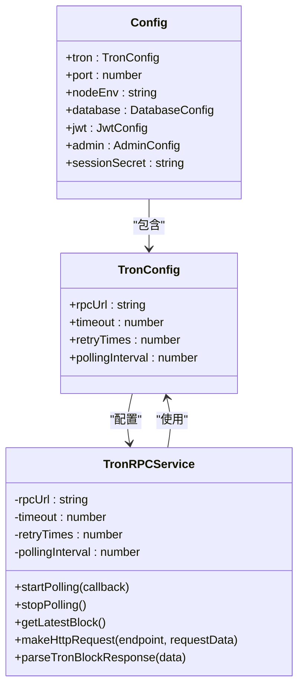
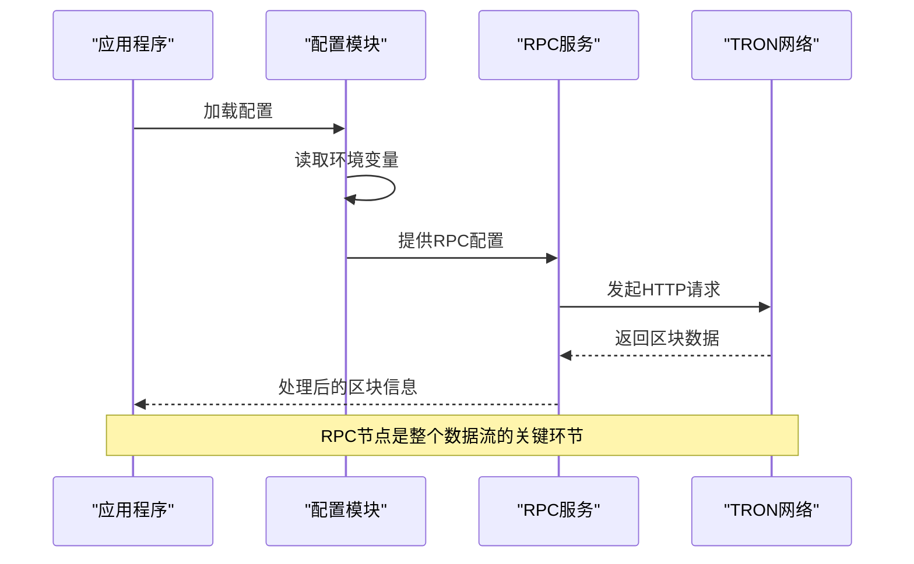
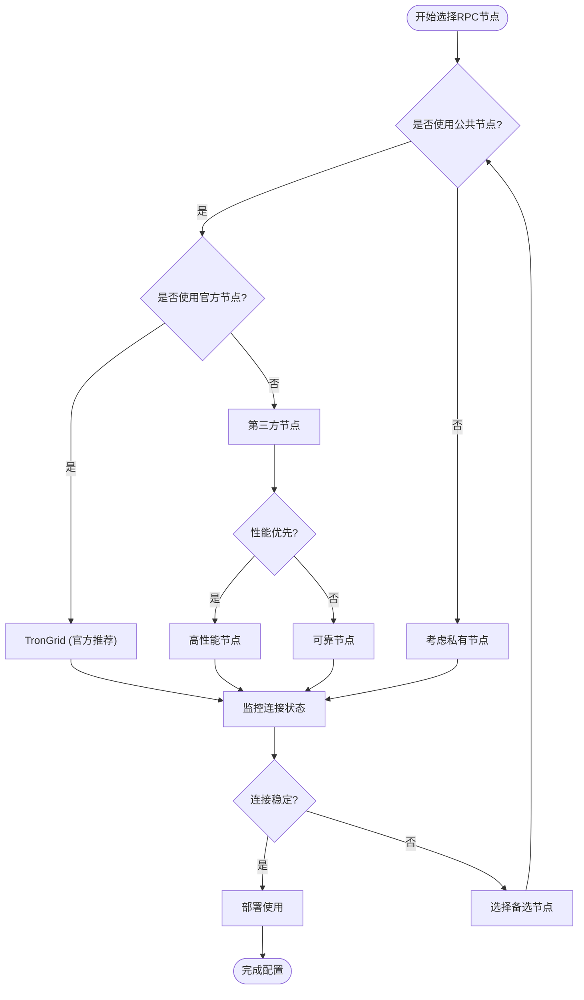
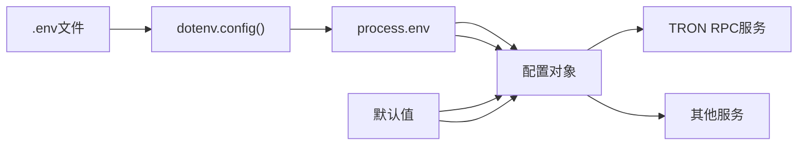
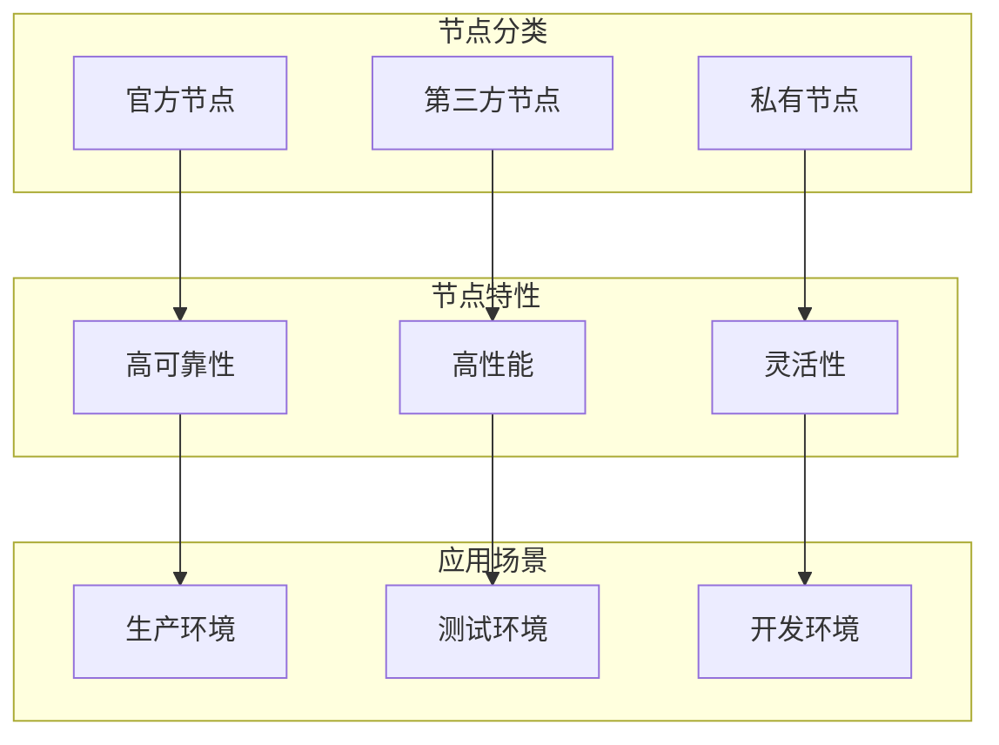
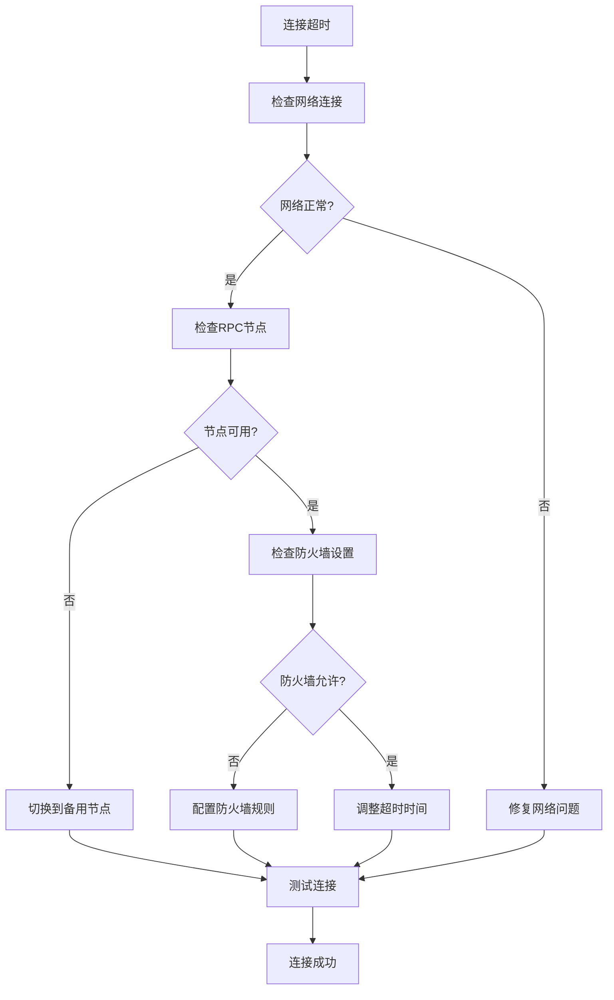
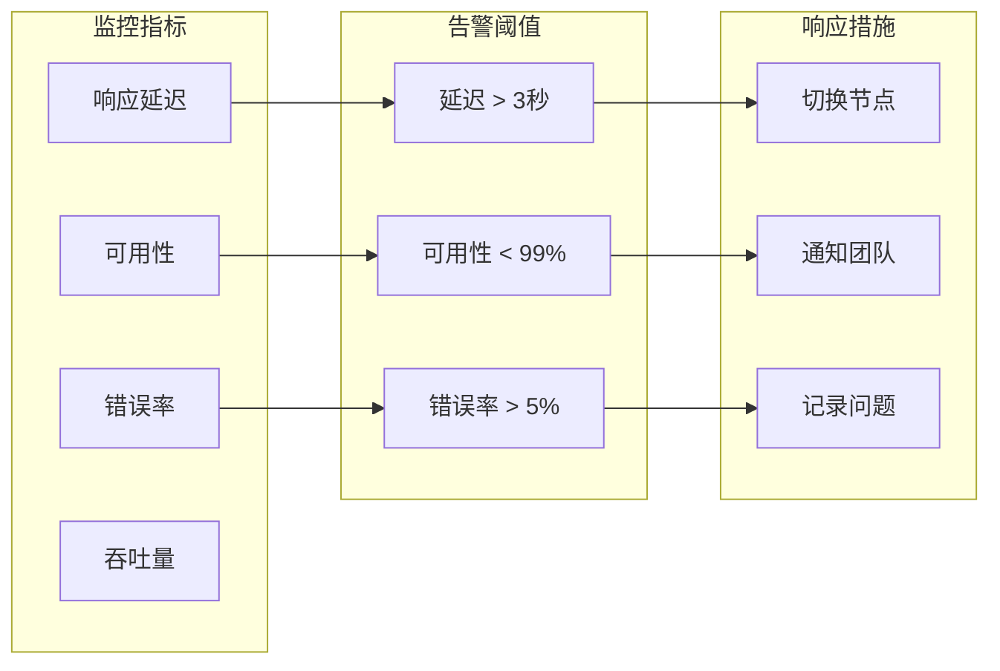
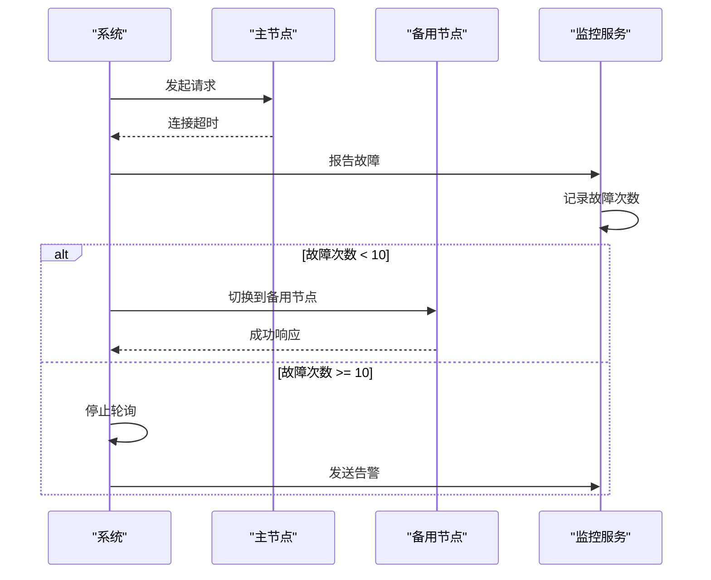

# TRON RPC节点配置文档

<cite>
**本文档引用的文件**
- [src/config/index.ts](file://src/config/index.ts)
- [src/services/TronRPCService.ts](file://src/services/TronRPCService.ts)
- [src/services/BlockDataService.ts](file://src/services/BlockDataService.ts)
- [src/routes/config.ts](file://src/routes/config.ts)
- [src/index.ts](file://src/index.ts)
- [README.md](file://README.md)
- [package.json](file://package.json)
</cite>

## 目录
1. [概述](#概述)
2. [RPC节点配置详解](#rpc节点配置详解)
3. [配置项作用分析](#配置项作用分析)
4. [RPC节点选择指南](#rpc节点选择指南)
5. [环境变量机制](#环境变量机制)
6. [备用RPC地址示例](#备用rpc地址示例)
7. [故障排除指南](#故障排除指南)
8. [最佳实践建议](#最佳实践建议)
9. [总结](#总结)

## 概述

TRON RPC节点是Point-Tron系统的核心组件，负责从波场区块链网络获取实时区块数据。作为区块链数据采集的源头，RPC节点的质量直接影响系统的稳定性和数据准确性。本文档将详细说明TRON_RPC_URL配置项的作用，解释其重要性，并提供完整的配置和故障排除指南。

## RPC节点配置详解

### 配置结构分析



**图表来源**
- [src/config/index.ts](file://src/config/index.ts#L10-L25)
- [src/services/TronRPCService.ts](file://src/services/TronRPCService.ts#L15-L25)

**章节来源**
- [src/config/index.ts](file://src/config/index.ts#L10-L25)
- [src/services/TronRPCService.ts](file://src/services/TronRPCService.ts#L15-L25)

### 核心配置参数

系统通过`tron`配置对象管理RPC节点相关设置：

1. **rpcUrl**: RPC节点URL地址
2. **timeout**: 请求超时时间（毫秒）
3. **retryTimes**: 重试次数
4. **pollingInterval**: 轮询间隔时间（毫秒）

## 配置项作用分析

### TRON_RPC_URL核心作用

TRON_RPC_URL是系统与波场区块链网络通信的桥梁，其主要作用包括：

#### 1. 数据源连接
- **区块数据获取**: 从TRON网络获取最新的区块信息
- **实时监控**: 每3秒轮询获取最新区块
- **历史数据访问**: 查询特定区块号的数据

#### 2. 系统依赖关系



**图表来源**
- [src/services/TronRPCService.ts](file://src/services/TronRPCService.ts#L96-L138)
- [src/services/BlockDataService.ts](file://src/services/BlockDataService.ts#L20-L50)

#### 3. 性能影响因素

RPC节点的选择直接影响以下性能指标：

- **响应速度**: 网络延迟和节点负载
- **数据准确性**: 节点同步状态和数据完整性
- **系统稳定性**: 连接成功率和错误处理能力

**章节来源**
- [src/services/TronRPCService.ts](file://src/services/TronRPCService.ts#L96-L138)
- [src/services/BlockDataService.ts](file://src/services/BlockDataService.ts#L20-L50)

## RPC节点选择指南

### 官方节点 vs 第三方节点

#### 官方节点特性

**优点**:
- 数据权威性高，来自波场官方维护
- 通常具有更高的稳定性和可靠性
- 支持完整的API功能
- 官方技术支持

**缺点**:
- 公共节点可能面临访问限制
- 在高并发情况下可能出现限流
- 地理位置可能造成网络延迟

#### 第三方节点特性

**优点**:
- 通常提供更好的性能和更低的延迟
- 可能提供额外的功能和服务
- 更灵活的访问策略
- 商业化支持

**缺点**:
- 数据质量可能存在差异
- 服务稳定性依赖于第三方
- 可能存在商业风险
- 需要评估安全性

### 节点选择决策树



**图表来源**
- [src/config/index.ts](file://src/config/index.ts#L22-L22)

## 环境变量机制

### 配置加载流程



**图表来源**
- [src/config/index.ts](file://src/config/index.ts#L1-L10)

### 环境变量覆盖机制

系统采用环境变量优先的配置加载策略：

1. **环境变量优先**: `process.env.TRON_RPC_URL` > 默认值
2. **类型转换**: 自动将字符串转换为适当的数据类型
3. **默认回退**: 当环境变量未设置时使用默认值

**章节来源**
- [src/config/index.ts](file://src/config/index.ts#L22-L22)

## 备用RPC地址示例

### 推荐的备用RPC地址

基于系统配置和实际使用经验，以下是推荐的备用RPC地址列表：

#### 主网可用节点

```typescript
// 官方推荐节点
const officialNodes = [
  'https://api.trongrid.io',                    // TronGrid主节点
  'https://api.shasta.trongrid.io',            // Shasta测试网
  'https://api.nileex.io'                      // Nile测试网
];

// 第三方节点
const thirdPartyNodes = [
  'https://tron-mainnet-rpc.allthatnode.com', // AllThatNode
  'https://rpc.ankr.com/tron',                // Ankr
  'https://api.trongrid.io',                   // TronGrid（重复，但强调重要性）
  'https://tronstack.io',                     // TronStack
  'https://rpc.trojex.net',                   // Trojex
  'https://rpc.tronlink.org'                  // TronLink RPC
];

// 测试网节点
const testNetNodes = [
  'https://api.shasta.trongrid.io',           // Shasta测试网
  'https://nile.trongrid.io'                  // Nile测试网
];
```

#### 节点选择策略



**图表来源**
- [src/config/index.ts](file://src/config/index.ts#L22-L22)

## 故障排除指南

### 常见连接问题

#### 1. 连接超时问题

**症状**: RPC请求超时，系统显示连接失败

**排查步骤**:


**图表来源**
- [src/services/TronRPCService.ts](file://src/services/TronRPCService.ts#L110-L150)

#### 2. 错误配置导致的问题

**常见错误类型**:

1. **URL格式错误**
   ```javascript
   // 错误示例
   TRON_RPC_URL=http://api.trongrid.io  // 缺少https协议
   
   // 正确示例
   TRON_RPC_URL=https://api.trongrid.io
   ```

2. **节点不可达**
   ```javascript
   // 检查节点连通性
   curl -X POST https://api.trongrid.io/wallet/getnowblock \
     -H "Content-Type: application/json" \
     -d "{}"
   ```

3. **认证失败**
   ```javascript
   // 检查节点是否需要认证
   // 某些私有节点可能需要API密钥
   ```

#### 3. 系统级故障排除

**章节来源**
- [src/services/TronRPCService.ts](file://src/services/TronRPCService.ts#L110-L150)
- [src/routes/config.ts](file://src/routes/config.ts#L15-L45)

### 排查工具和命令

#### 1. 网络连通性测试

```bash
# 测试基本连通性
ping api.trongrid.io

# 测试HTTP连接
curl -I https://api.trongrid.io

# 测试RPC接口
curl -X POST https://api.trongrid.io/wallet/getnowblock \
  -H "Content-Type: application/json" \
  -d "{}"
```

#### 2. 系统状态检查

```bash
# 检查端口占用
lsof -i :3000

# 查看系统日志
tail -f logs/app.log

# 检查内存使用
free -h

# 检查磁盘空间
df -h
```

#### 3. 配置验证

```javascript
// 在系统中验证配置
console.log('当前RPC配置:', {
  rpcUrl: process.env.TRON_RPC_URL,
  timeout: process.env.TRON_TIMEOUT,
  retryTimes: process.env.TRON_RETRY_TIMES,
  pollingInterval: process.env.TRON_POLLING_INTERVAL
});
```

**章节来源**
- [src/routes/config.ts](file://src/routes/config.ts#L15-L45)
- [src/services/TronRPCService.ts](file://src/services/TronRPCService.ts#L226-L257)

## 最佳实践建议

### 1. 节点选择最佳实践

#### 生产环境配置

```typescript
// 生产环境推荐配置
const productionConfig = {
  TRON_RPC_URL: 'https://api.trongrid.io',  // 官方推荐
  TRON_TIMEOUT: '5000',                     // 5秒超时
  TRON_RETRY_TIMES: '3',                    // 3次重试
  TRON_POLLING_INTERVAL: '3000'             // 3秒轮询
};
```

#### 开发环境配置

```typescript
// 开发环境推荐配置
const developmentConfig = {
  TRON_RPC_URL: 'https://api.shasta.trongrid.io',  // 测试网
  TRON_TIMEOUT: '10000',                          // 10秒超时
  TRON_RETRY_TIMES: '5',                          // 5次重试
  TRON_POLLING_INTERVAL: '5000'                   // 5秒轮询
};
```

### 2. 监控和告警

#### 关键指标监控



**图表来源**
- [src/services/TronRPCService.ts](file://src/services/TronRPCService.ts#L60-L80)

### 3. 容错机制

#### 重试策略

系统实现了指数退避重试策略：

```typescript
// 指数退避算法
const delay = Math.min(1000 * Math.pow(2, attempt - 1), 5000);
// 最大延迟不超过5秒
```

#### 节点切换机制



**图表来源**
- [src/services/TronRPCService.ts](file://src/services/TronRPCService.ts#L60-L80)

**章节来源**
- [src/services/TronRPCService.ts](file://src/services/TronRPCService.ts#L60-L80)
- [src/services/TronRPCService.ts](file://src/services/TronRPCService.ts#L110-L150)

## 总结

TRON_RPC_URL配置项是Point-Tron系统的核心配置之一，它不仅决定了系统与区块链网络的连接方式，还直接影响着整个系统的性能和稳定性。通过合理的节点选择、完善的配置管理和有效的故障排除机制，可以确保系统能够稳定高效地运行。

### 关键要点回顾

1. **配置优先级**: 环境变量优先于默认值
2. **节点选择**: 官方节点vs第三方节点各有优劣
3. **容错机制**: 指数退避重试和节点切换
4. **监控告警**: 关键指标的实时监控
5. **最佳实践**: 根据环境选择合适的配置参数

### 下一步行动建议

1. **评估现有配置**: 检查当前使用的RPC节点性能
2. **建立监控体系**: 实施关键指标监控
3. **制定应急预案**: 准备节点切换和故障恢复方案
4. **定期维护**: 定期检查和更新RPC节点配置

通过遵循本文档的指导原则和最佳实践，您可以确保Point-Tron系统始终能够稳定可靠地获取TRON网络数据，为用户提供准确及时的区块链数据分析服务。