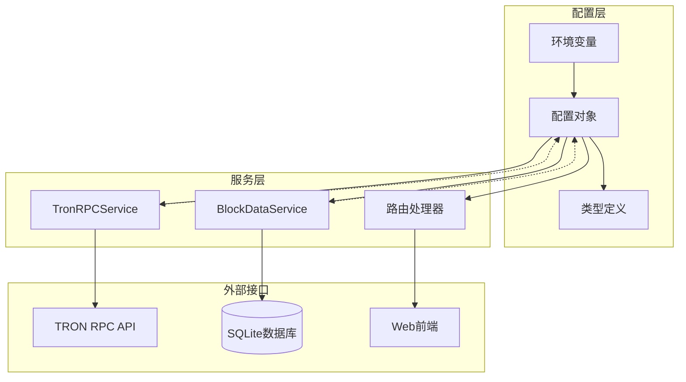
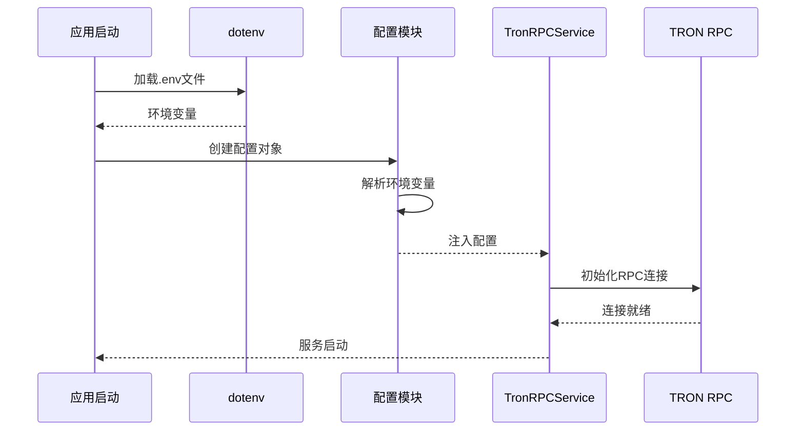
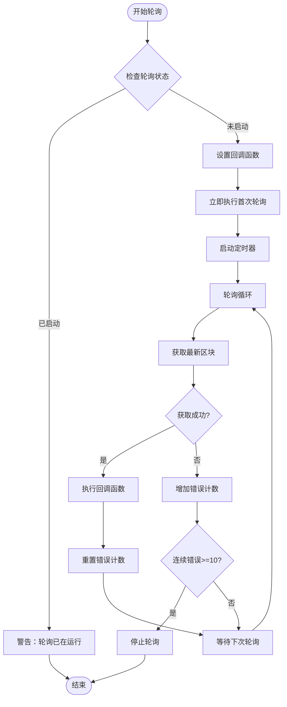
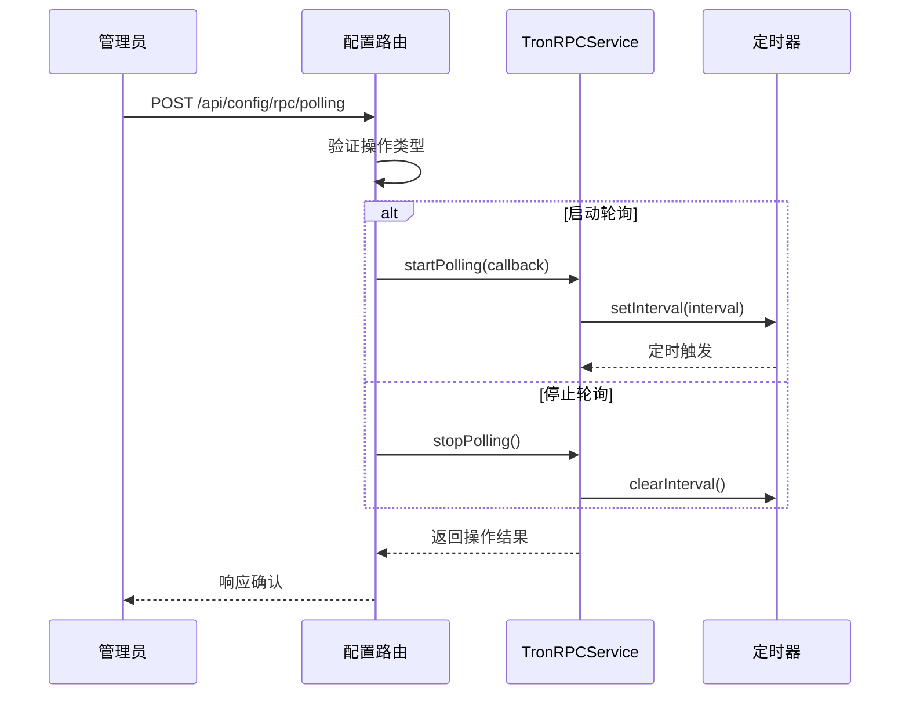
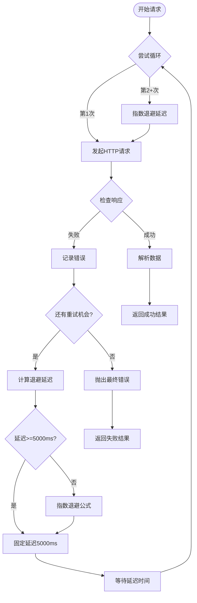
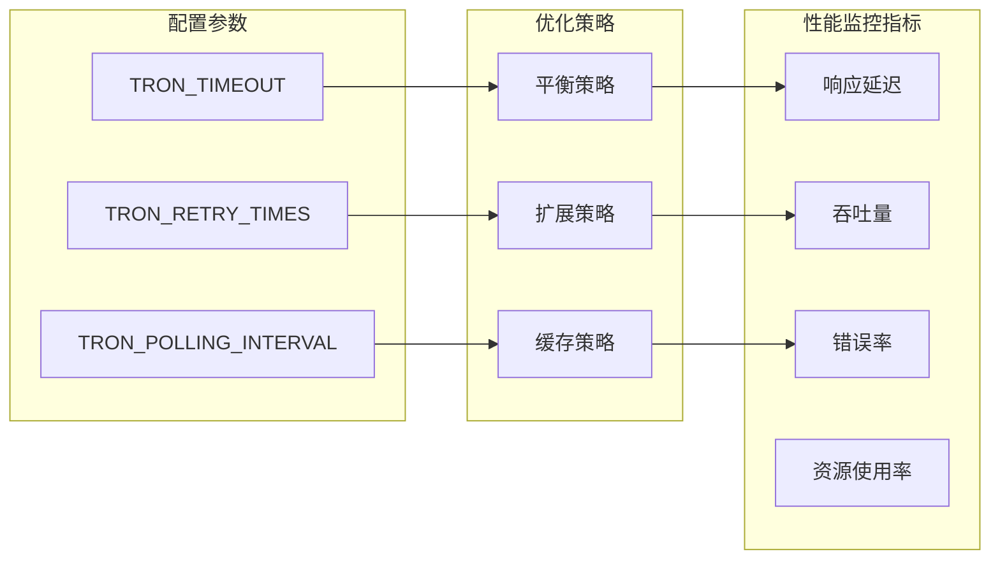
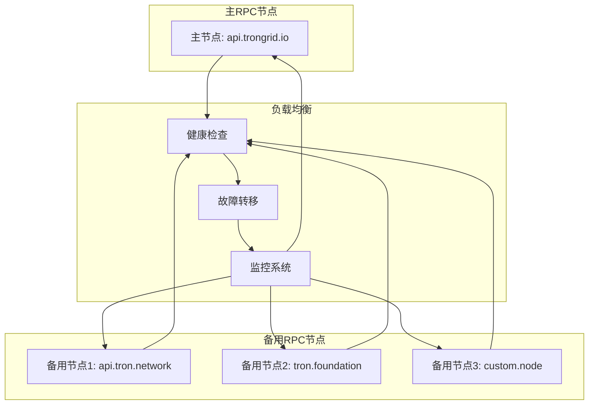
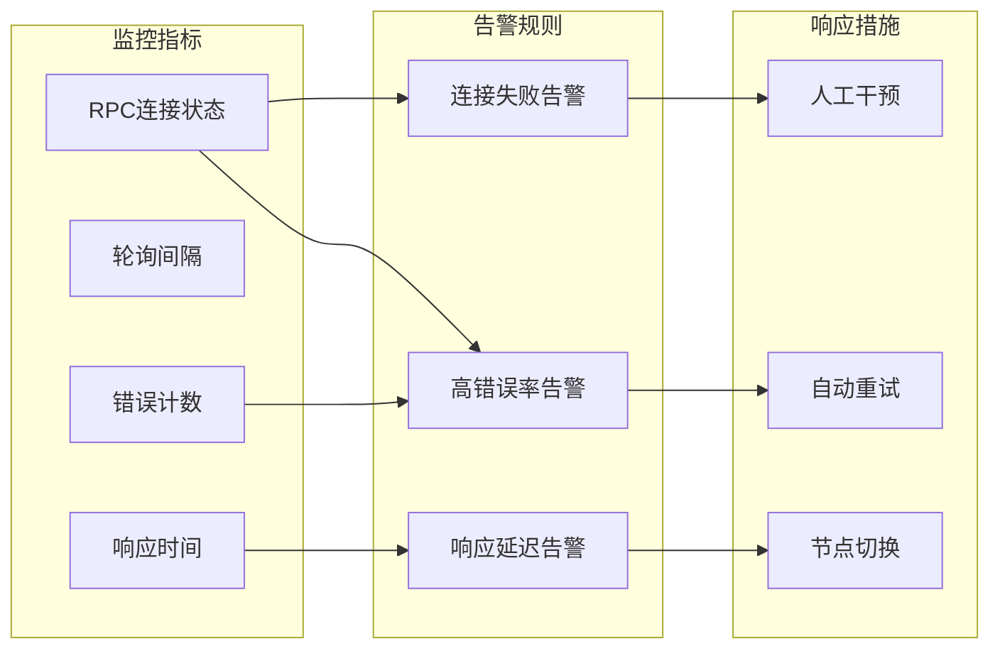

# 区块链网络配置

<cite>
**本文档引用的文件**
- [src/config/index.ts](file://src/config/index.ts)
- [src/services/TronRPCService.ts](file://src/services/TronRPCService.ts)
- [src/services/BlockDataService.ts](file://src/services/BlockDataService.ts)
- [src/routes/config.ts](file://src/routes/config.ts)
- [README.md](file://README.md)
- [package.json](file://package.json)
</cite>

## 目录
1. [项目概述](#项目概述)
2. [核心配置参数](#核心配置参数)
3. [配置架构分析](#配置架构分析)
4. [RPC配置详解](#rpc配置详解)
5. [轮询机制设计](#轮询机制设计)
6. [错误处理与重试策略](#错误处理与重试策略)
7. [性能优化配置](#性能优化配置)
8. [高可用配置方案](#高可用配置方案)
9. [故障排除指南](#故障排除指南)
10. [最佳实践建议](#最佳实践建议)

## 项目概述

Point-Tron是一个基于TypeScript和Node.js开发的波场网络区块链数据统计后台管理系统。该系统通过TRON RPC API实时监控波场网络每3秒的出块情况，统计区块哈希最后一个阿拉伯数字的单双数规律，并提供可视化的数据分析界面。

系统的核心功能包括：
- 实时数据采集：每3秒自动获取TRON网络最新区块数据
- 智能数据解析：自动提取区块哈希最后数字并判断单双数
- 统计分析：提供今日、历史数据统计和趋势分析
- 后台管理：现代化的Web管理界面
- 错误处理：完善的错误重试和异常处理机制

## 核心配置参数

### TRON_RPC_URL

**作用**：指定TRON网络的RPC节点地址，决定系统与哪个区块链节点进行通信。

**默认值**：`https://api.trongrid.io`

**配置示例**：
```typescript
// 主网节点
TRON_RPC_URL=https://api.trongrid.io

// 测试网节点
TRON_RPC_URL=https://api.shasta.trongrid.io

// 自建节点
TRON_RPC_URL=http://localhost:8090
```

**选择建议**：
- 生产环境推荐使用官方主网节点
- 测试环境可使用Shasta测试网节点
- 高并发场景建议部署自建节点
- 考虑地理位置对延迟的影响

### TRON_TIMEOUT

**作用**：设置网络请求的超时阈值，当请求超过此时间仍未响应时将触发超时错误。

**默认值**：`5000`毫秒（5秒）

**配置示例**：
```typescript
// 适中的超时时间
TRON_TIMEOUT=5000

// 较短的超时时间（适用于快速失败场景）
TRON_TIMEOUT=2000

// 较长的超时时间（适用于网络不稳定环境）
TRON_TIMEOUT=10000
```

**调优建议**：
- 网络稳定：3000-5000ms
- 网络波动：5000-8000ms
- 高可用需求：8000-15000ms
- 低延迟要求：2000-3000ms

### TRON_RETRY_TIMES

**作用**：定义失败请求的最大重试次数，系统会在请求失败时自动重新尝试。

**默认值**：`3`次

**配置示例**：
```typescript
// 基础重试次数
TRON_RETRY_TIMES=3

// 高可靠性场景
TRON_RETRY_TIMES=5

// 快速失败场景
TRON_RETRY_TIMES=1
```

**重试策略**：
系统采用指数退避算法，每次重试间隔逐渐增加：
- 第1次重试：立即重试
- 第2次重试：2^1 × 1000ms = 2000ms
- 第3次重试：2^2 × 1000ms = 4000ms
- 最大延迟：不超过5000ms

### TRON_POLLING_INTERVAL

**作用**：设置区块轮询的时间间隔，决定系统多久检查一次区块链网络的新区块。

**默认值**：`3000`毫秒（3秒）

**配置示例**：
```typescript
// 标准轮询间隔
TRON_POLLING_INTERVAL=3000

// 高频监控
TRON_POLLING_INTERVAL=1000

// 低频监控
TRON_POLLING_INTERVAL=10000
```

**性能影响**：
- 3秒间隔：平衡实时性和系统负载
- 1秒间隔：高实时性但增加RPC压力
- 10秒间隔：降低系统负载但牺牲实时性

## 配置架构分析



**图表来源**
- [src/config/index.ts](file://src/config/index.ts#L1-L52)
- [src/services/TronRPCService.ts](file://src/services/TronRPCService.ts#L1-L50)

**章节来源**
- [src/config/index.ts](file://src/config/index.ts#L1-L52)
- [src/services/TronRPCService.ts](file://src/services/TronRPCService.ts#L1-L100)

## RPC配置详解

### 配置初始化流程



**图表来源**
- [src/config/index.ts](file://src/config/index.ts#L35-L45)
- [src/services/TronRPCService.ts](file://src/services/TronRPCService.ts#L25-L35)

### 配置对象结构

```typescript
interface TronRPCConfig {
  rpcUrl: string;
  timeout: number;
  retryTimes: number;
  pollingInterval: number;
}
```

### 动态配置更新

系统支持运行时动态更新RPC配置：

```typescript
// 更新配置的方法
public updateConfig(newConfig: Partial<TronRPCConfig>): void {
  if (newConfig.rpcUrl) this.rpcUrl = newConfig.rpcUrl;
  if (newConfig.timeout) this.timeout = newConfig.timeout;
  if (newConfig.retryTimes) this.retryTimes = newConfig.retryTimes;
  if (newConfig.pollingInterval) {
    this.pollingInterval = newConfig.pollingInterval;
    
    // 如果正在轮询，重启以应用新间隔
    if (this.isPolling && this.onBlockCallback) {
      const callback = this.onBlockCallback;
      this.stopPolling();
      this.startPolling(callback);
    }
  }
}
```

**章节来源**
- [src/services/TronRPCService.ts](file://src/services/TronRPCService.ts#L240-L258)

## 轮询机制设计

### 轮询架构



**图表来源**
- [src/services/TronRPCService.ts](file://src/services/TronRPCService.ts#L40-L80)

### 轮询状态管理

系统提供了完整的轮询状态监控：

```typescript
public getPollingStatus(): {
  isActive: boolean;
  interval: number;
  consecutiveErrors: number;
  lastBlockTime: number;
} {
  return {
    isActive: this.isPolling,
    interval: this.pollingInterval,
    consecutiveErrors: this.consecutiveErrors,
    lastBlockTime: this.lastBlockTime
  };
}
```

### 轮询控制接口



**图表来源**
- [src/routes/config.ts](file://src/routes/config.ts#L40-L70)
- [src/services/TronRPCService.ts](file://src/services/TronRPCService.ts#L35-L50)

**章节来源**
- [src/services/TronRPCService.ts](file://src/services/TronRPCService.ts#L35-L80)
- [src/routes/config.ts](file://src/routes/config.ts#L40-L70)

## 错误处理与重试策略

### 请求重试机制



**图表来源**
- [src/services/TronRPCService.ts](file://src/services/TronRPCService.ts#L90-L150)

### 错误分类与处理

系统实现了多层次的错误处理机制：

1. **网络错误**：连接超时、DNS解析失败等
2. **HTTP错误**：4xx客户端错误、5xx服务器错误
3. **API错误**：TRON RPC返回的错误信息
4. **解析错误**：JSON解析失败、数据格式错误

```typescript
// 错误处理示例
private async makeHttpRequest(endpoint: string, requestData: any): Promise<TronBlockResponse> {
  let lastError: Error = new Error('未知错误');
  
  for (let attempt = 1; attempt <= this.retryTimes; attempt++) {
    try {
      // 发起请求...
      const response = await fetch(url, {
        method: 'POST',
        headers: {'Content-Type': 'application/json'},
        body: JSON.stringify(requestData),
        signal: controller.signal
      });
      
      if (!response.ok) {
        throw new Error(`HTTP ${response.status}: ${response.statusText}`);
      }
      
      const data = await response.json();
      if (data.Error) {
        throw new Error(`TRON API错误: ${data.Error}`);
      }
      
      return data;
      
    } catch (error: any) {
      lastError = error as Error;
      console.warn(`请求尝试${attempt}失败:`, error?.message);
      
      if (attempt < this.retryTimes) {
        const delay = Math.min(1000 * Math.pow(2, attempt - 1), 5000);
        await new Promise(resolve => setTimeout(resolve, delay));
      }
    }
  }
  
  throw new Error(`RPC请求失败，已重试${this.retryTimes}次: ${lastError.message}`);
}
```

**章节来源**
- [src/services/TronRPCService.ts](file://src/services/TronRPCService.ts#L90-L150)

## 性能优化配置

### 系统性能指标



### 性能调优建议

#### 1. 轮询间隔优化

| 场景类型 | 推荐间隔 | 说明 |
|---------|---------|------|
| 实时监控 | 1-3秒 | 需要高实时性的应用场景 |
| 一般监控 | 3-5秒 | 平衡实时性和性能的默认选择 |
| 批量处理 | 10-30秒 | 大量数据处理场景 |

#### 2. 超时时间优化

| 网络环境 | 推荐超时 | 说明 |
|---------|---------|------|
| 内网环境 | 2-3秒 | 网络延迟极低 |
| 局域网 | 3-5秒 | 适中的网络延迟 |
| 公网环境 | 5-10秒 | 不同地区的网络差异 |

#### 3. 重试策略优化

```typescript
// 指数退避算法实现
const calculateRetryDelay = (attempt: number): number => {
  // 最大延迟不超过5秒
  return Math.min(1000 * Math.pow(2, attempt - 1), 5000);
};
```

### 资源使用监控

系统提供了完整的健康检查功能：

```typescript
public async healthCheck(): Promise<{
  database: boolean;
  rpcConnection: boolean;
  dataIntegrity: boolean;
  lastBlockAge: number;
}> {
  const result = {
    database: false,
    rpcConnection: false,
    dataIntegrity: false,
    lastBlockAge: 0
  };

  try {
    // 检查数据库连接
    const latestBlock = await BlockModel.getLatest();
    result.database = !!latestBlock;
    
    if (latestBlock) {
      result.lastBlockAge = Date.now() - latestBlock.timestamp;
    }

    // 检查RPC连接
    const rpcTest = await this.tronRPCService.testConnection();
    result.rpcConnection = rpcTest.success;

    // 检查数据完整性
    const todayStats = await BlockModel.getTodayStats();
    result.dataIntegrity = todayStats.total >= 0 && 
                         (todayStats.odd + todayStats.even) === todayStats.total;

  } catch (error) {
    console.error('健康检查失败:', error);
  }

  return result;
}
```

**章节来源**
- [src/services/BlockDataService.ts](file://src/services/BlockDataService.ts#L240-L273)

## 高可用配置方案

### 备用RPC节点策略



### 故障转移实现

```typescript
// 多节点配置示例
const rpcNodes = [
  'https://api.trongrid.io',
  'https://api.tron.network',
  'https://tron.foundation',
  'http://custom.node:8090'
];

// 故障转移逻辑
class MultiRPCCluster {
  private currentRpcIndex: number = 0;
  private failedAttempts: number[] = [];
  
  public async makeRequest(endpoint: string, data: any): Promise<any> {
    for (let i = 0; i < rpcNodes.length; i++) {
      const rpcUrl = rpcNodes[this.currentRpcIndex];
      
      try {
        return await this.sendRequest(rpcUrl, endpoint, data);
      } catch (error) {
        console.warn(`RPC节点 ${rpcUrl} 失败:`, error.message);
        this.failedAttempts[this.currentRpcIndex]++;
        
        // 切换到下一个节点
        this.currentRpcIndex = (this.currentRpcIndex + 1) % rpcNodes.length;
      }
    }
    
    throw new Error('所有RPC节点均不可用');
  }
}
```

### 配置热更新

系统支持运行时动态更新RPC配置：

```typescript
// 配置更新接口
router.post('/rpc', authenticateToken, async (req, res) => {
  try {
    const { rpcUrl, timeout, retryTimes, pollingInterval } = req.body;
    
    // 简单验证
    if (rpcUrl && !rpcUrl.startsWith('http')) {
      return res.status(400).json({
        success: false,
        error: 'RPC URL 必须以 http 或 https 开头'
      });
    }
    
    // 更新配置
    res.json({
      success: true,
      data: {
        message: 'RPC配置更新成功',
        needRestart: true
      }
    });
  } catch (error) {
    console.error('更新RPC配置失败:', error);
    res.status(500).json({ success: false, error: '服务器内部错误' });
  }
});
```

**章节来源**
- [src/routes/config.ts](file://src/routes/config.ts#L20-L50)

## 故障排除指南

### 常见配置问题

#### 1. RPC节点连接失败

**症状**：系统无法连接到TRON网络节点

**排查步骤**：
```bash
# 1. 检查网络连通性
ping api.trongrid.io

# 2. 测试RPC端点
curl -X POST https://api.trongrid.io/wallet/getnowblock \
  -H "Content-Type: application/json" \
  -d "{}"

# 3. 检查防火墙设置
telnet api.trongrid.io 443
```

**解决方案**：
- 更换RPC节点地址
- 检查网络代理设置
- 调整超时时间配置

#### 2. 轮询间隔过小导致性能问题

**症状**：系统CPU使用率过高，RPC请求被限流

**诊断方法**：
```typescript
// 检查轮询状态
const status = tronRPCService.getPollingStatus();
console.log('当前轮询间隔:', status.interval);
console.log('连续错误次数:', status.consecutiveErrors);
```

**解决方案**：
- 增加轮询间隔时间
- 降低并发请求数量
- 实施请求限流机制

#### 3. 重试次数过多导致延迟

**症状**：系统响应缓慢，用户体验差

**优化策略**：
```typescript
// 动态调整重试策略
const optimizeRetryStrategy = (errorCount: number): number => {
  if (errorCount <= 3) {
    return 3; // 正常重试次数
  } else if (errorCount <= 10) {
    return 2; // 减少重试次数
  } else {
    return 1; // 快速失败
  }
};
```

### 监控和告警



### 日志分析

系统提供了详细的日志输出：

```typescript
// 关键日志示例
console.log(`开始TRON RPC轮询，间隔: ${this.pollingInterval}ms`);
console.log(`尝试第${attempt}次请求: ${url}`);
console.error(`RPC轮询错误 (连续第${this.consecutiveErrors}次):`, error?.message);
console.log(`区块 ${blockInfo.block_number} 处理完成`);
```

**章节来源**
- [src/services/TronRPCService.ts](file://src/services/TronRPCService.ts#L40-L80)
- [README.md](file://README.md#L250-L280)

## 最佳实践建议

### 配置管理最佳实践

#### 1. 环境隔离

```typescript
// 开发环境配置
const developmentConfig = {
  rpcUrl: 'https://api.shasta.trongrid.io',
  timeout: 5000,
  retryTimes: 3,
  pollingInterval: 3000
};

// 生产环境配置
const productionConfig = {
  rpcUrl: 'https://api.trongrid.io',
  timeout: 8000,
  retryTimes: 5,
  pollingInterval: 5000
};
```

#### 2. 配置验证

```typescript
// 配置验证函数
const validateConfig = (config: TronRPCConfig): boolean => {
  if (!config.rpcUrl.startsWith('http')) {
    throw new Error('RPC URL必须以http或https开头');
  }
  
  if (config.timeout < 1000 || config.timeout > 30000) {
    throw new Error('超时时间应在1-30秒之间');
  }
  
  if (config.retryTimes < 1 || config.retryTimes > 10) {
    throw new Error('重试次数应在1-10次之间');
  }
  
  if (config.pollingInterval < 1000 || config.pollingInterval > 60000) {
    throw new Error('轮询间隔应在1-60秒之间');
  }
  
  return true;
};
```

#### 3. 安全配置

```typescript
// 安全配置示例
const secureConfig = {
  // 使用HTTPS RPC节点
  rpcUrl: process.env.TRON_RPC_URL || 'https://api.trongrid.io',
  
  // 合理的超时时间
  timeout: parseInt(process.env.TRON_TIMEOUT || '5000', 10),
  
  // 适度的重试次数
  retryTimes: parseInt(process.env.TRON_RETRY_TIMES || '3', 10),
  
  // 平衡的轮询间隔
  pollingInterval: parseInt(process.env.TRON_POLLING_INTERVAL || '3000', 10)
};
```

### 运维最佳实践

#### 1. 监控告警配置

```yaml
# Prometheus监控配置
- alert: TRON_RPC_Unavailable
  expr: tron_rpc_health_check == 0
  for: 1m
  labels:
    severity: critical
  annotations:
    summary: "TRON RPC节点不可用"
    description: "TRON RPC节点 {{ $labels.instance }} 已连续1分钟不可用"

- alert: TRON_Polling_Latency_High
  expr: tron_polling_latency > 10000
  for: 5m
  labels:
    severity: warning
  annotations:
    summary: "TRON轮询延迟过高"
    description: "TRON轮询延迟 {{ $value }}ms，超过10秒"
```

#### 2. 备份和恢复

```bash
#!/bin/bash
# 自动备份脚本

# 备份数据库
cp ./data/point-tron.db ./backup/$(date +%Y%m%d_%H%M%S)_point-tron.db

# 备份配置文件
cp .env ./backup/$(date +%Y%m%d_%H%M%S)_env

# 清理旧备份（保留最近7天）
find ./backup -name "*.db" -mtime +7 -delete
find ./backup -name "*.env" -mtime +7 -delete
```

#### 3. 性能基准测试

```typescript
// 性能测试脚本
class PerformanceBenchmark {
  public async runBenchmark(): Promise<void> {
    const startTime = Date.now();
    
    // 测试RPC连接
    const connectionTest = await this.testRPCConnection();
    
    // 测试轮询性能
    const pollTest = await this.testPollingPerformance();
    
    // 测试数据处理能力
    const processData = await this.testDataProcessing();
    
    const endTime = Date.now();
    
    console.log('性能基准测试结果:');
    console.log(`总耗时: ${endTime - startTime}ms`);
    console.log(`RPC连接测试: ${connectionTest.success ? '成功' : '失败'}`);
    console.log(`轮询性能: ${pollTest.avgLatency}ms`);
    console.log(`数据处理速度: ${processData.blocksPerSecond} blocks/sec`);
  }
}
```

### 团队协作建议

#### 1. 配置版本控制

```yaml
# .gitignore 示例
# 忽略敏感配置文件
.env.local
.env.development
.env.production

# 保留配置模板
.env.example
```

#### 2. 文档维护

```markdown
# TRON RPC配置文档

## 配置项说明

### TRON_RPC_URL
- **类型**: 字符串
- **默认值**: https://api.trongrid.io
- **用途**: 指定TRON网络RPC节点地址

### TRON_TIMEOUT
- **类型**: 数字（毫秒）
- **默认值**: 5000
- **用途**: 设置RPC请求超时时间
```

#### 3. 变更管理

```typescript
// 配置变更追踪
class ConfigChangeTracker {
  private changes: ConfigChange[] = [];
  
  public recordChange(oldConfig: TronRPCConfig, newConfig: TronRPCConfig): void {
    const change = {
      timestamp: new Date(),
      oldValues: oldConfig,
      newValues: newConfig,
      diff: this.calculateDiff(oldConfig, newConfig)
    };
    
    this.changes.push(change);
    this.logChange(change);
  }
  
  private logChange(change: ConfigChange): void {
    console.log(`配置变更记录: ${change.timestamp}`);
    console.log('变更详情:', change.diff);
  }
}
```

通过遵循这些最佳实践，可以确保TRON RPC配置的稳定性、可维护性和安全性，为系统的长期运行奠定坚实基础。