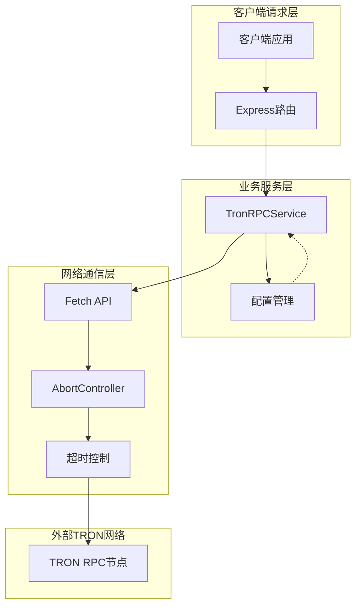
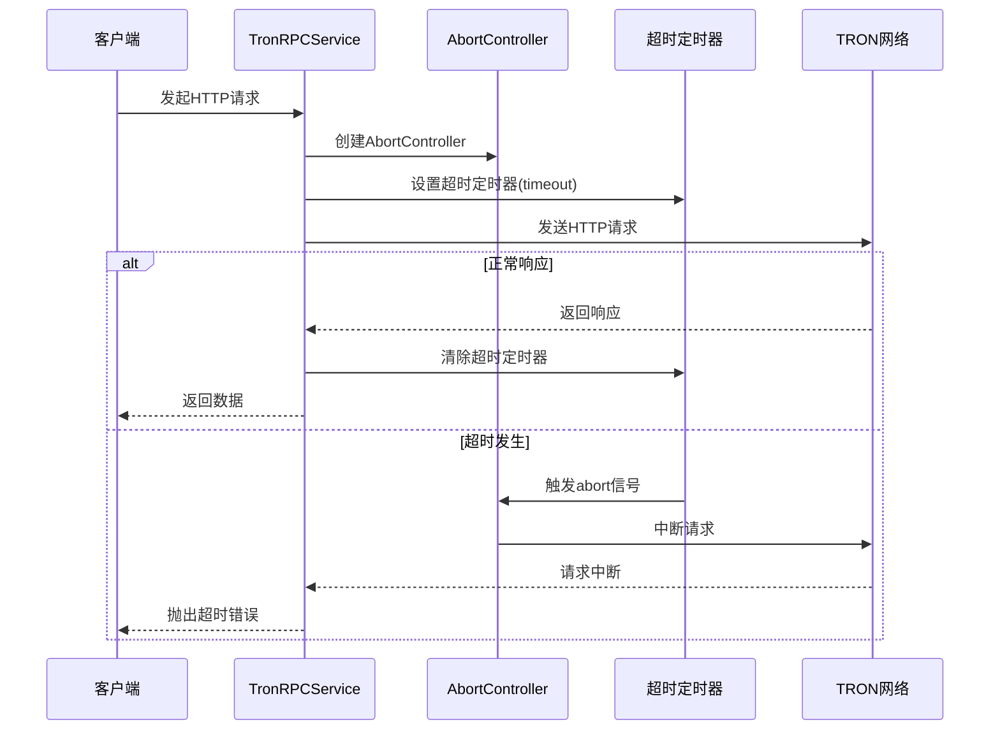
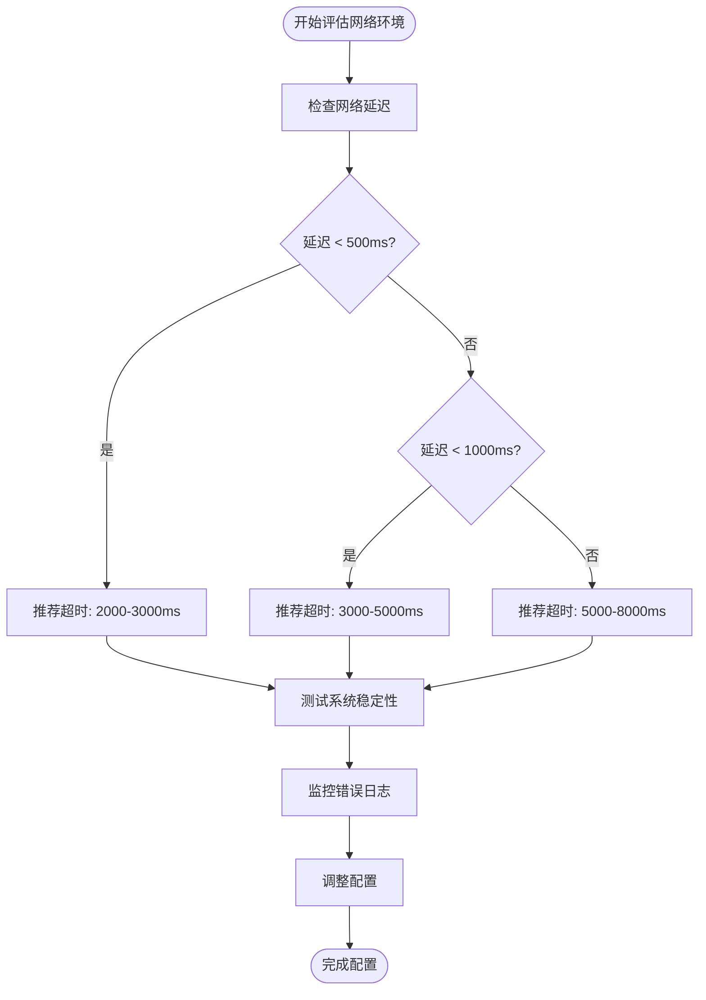
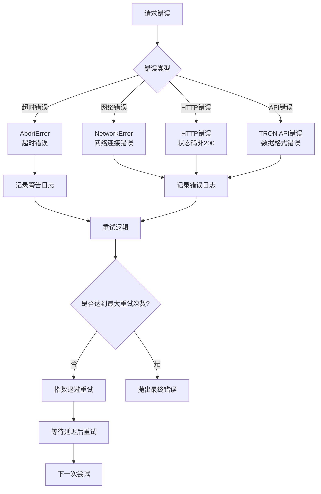
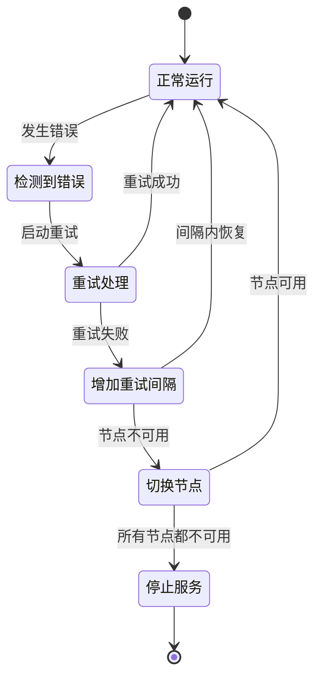

# 请求超时设置

<cite>
**本文档引用的文件**
- [src/config/index.ts](file://src/config/index.ts)
- [src/services/TronRPCService.ts](file://src/services/TronRPCService.ts)
- [src/models/types.ts](file://src/models/types.ts)
- [src/routes/config.ts](file://src/routes/config.ts)
- [README.md](file://README.md)
</cite>

## 目录
1. [项目概述](#项目概述)
2. [TRON_TIMEOUT参数详解](#tron_timeout参数详解)
3. [超时机制架构](#超时机制架构)
4. [默认配置分析](#默认配置分析)
5. [超时值权衡分析](#超时值权衡分析)
6. [网络环境适配指南](#网络环境适配指南)
7. [异常处理与日志记录](#异常处理与日志记录)
8. [配置管理最佳实践](#配置管理最佳实践)
9. [故障排除指南](#故障排除指南)
10. [总结](#总结)

## 项目概述

Point-Tron是一个基于TypeScript和Node.js开发的波场网络区块链数据统计后台管理系统。该系统的核心功能是实时监控波场网络每3秒的出块情况，统计区块哈希最后一个阿拉伯数字的单双数规律，并提供可视化的数据分析界面。

系统采用TRON RPC API进行数据采集，通过HTTP请求与波场网络节点通信。为了确保系统的稳定性和可靠性，实现了完善的超时控制机制。

**章节来源**
- [README.md](file://README.md#L1-L50)

## TRON_TIMEOUT参数详解

### 参数定义与作用

TRON_TIMEOUT参数是系统中用于控制HTTP请求超时时间的关键配置项。该参数定义了系统在等待TRON网络响应时的最大等待时间，单位为毫秒。

```typescript
// 配置接口定义
interface TronRPCConfig {
  rpcUrl: string;
  timeout: number;      // 超时时间（毫秒）
  retryTimes: number;   // 重试次数
  pollingInterval: number; // 轮询间隔
}
```

### 超时控制机制

系统通过AbortController API实现精确的超时控制：

```typescript
// 超时控制核心实现
private async makeHttpRequest(endpoint: string, requestData: any): Promise<TronBlockResponse> {
  let lastError: Error = new Error('未知错误');
  const url = this.rpcUrl + endpoint;

  for (let attempt = 1; attempt <= this.retryTimes; attempt++) {
    try {
      console.log(`尝试第${attempt}次请求: ${url}`);

      const controller = new AbortController();
      const timeoutId = setTimeout(() => controller.abort(), this.timeout);

      const response = await fetch(url, {
        method: 'POST',
        headers: {
          'Content-Type': 'application/json',
          'User-Agent': 'Point-Tron/1.0'
        },
        body: JSON.stringify(requestData),
        signal: controller.signal
      });

      clearTimeout(timeoutId); // 清除超时定时器
      // ... 处理响应
    } catch (error: any) {
      // 错误处理逻辑
    }
  }
}
```

**章节来源**
- [src/services/TronRPCService.ts](file://src/services/TronRPCService.ts#L96-L183)

## 超时机制架构

### 系统架构概览



**图表来源**
- [src/services/TronRPCService.ts](file://src/services/TronRPCService.ts#L20-L35)
- [src/config/index.ts](file://src/config/index.ts#L15-L25)

### 超时控制流程



**图表来源**
- [src/services/TronRPCService.ts](file://src/services/TronRPCService.ts#L103-L113)

**章节来源**
- [src/services/TronRPCService.ts](file://src/services/TronRPCService.ts#L96-L183)

## 默认配置分析

### 默认值设定

系统在配置文件中为TRON_TIMEOUT设置了默认值5000毫秒（5秒）：

```typescript
const config: Config = {
  tron: {
    rpcUrl: process.env.TRON_RPC_URL || 'https://api.trongrid.io',
    timeout: parseInt(process.env.TRON_TIMEOUT || '5000', 10), // 默认5秒
    retryTimes: parseInt(process.env.TRON_RETRY_TIMES || '3', 10),
    pollingInterval: parseInt(process.env.TRON_POLLING_INTERVAL || '3000', 10),
  },
};
```

### 配置优先级

系统采用环境变量优先的配置加载机制：

1. **环境变量优先级**：`process.env.TRON_TIMEOUT`
2. **默认值降级**：如果环境变量未设置，则使用5000毫秒
3. **动态配置更新**：支持运行时动态更新配置

### 配置验证机制

```typescript
// 配置更新时的验证逻辑
public updateConfig(newConfig: Partial<TronRPCConfig>): void {
  if (newConfig.rpcUrl) this.rpcUrl = newConfig.rpcUrl;
  if (newConfig.timeout) this.timeout = newConfig.timeout;
  if (newConfig.retryTimes) this.retryTimes = newConfig.retryTimes;
  if (newConfig.pollingInterval) {
    this.pollingInterval = newConfig.pollingInterval;
    
    // 如果正在轮询，重启以应用新间隔
    if (this.isPolling && this.onBlockCallback) {
      const callback = this.onBlockCallback;
      this.stopPolling();
      this.startPolling(callback);
    }
  }
}
```

**章节来源**
- [src/config/index.ts](file://src/config/index.ts#L30-L35)
- [src/services/TronRPCService.ts](file://src/services/TronRPCService.ts#L208-L224)

## 超时值权衡分析

### 过短超时的影响

当TRON_TIMEOUT设置过短（如小于2000毫秒）时，系统将面临以下挑战：

1. **频繁重试触发**：网络延迟稍高就可能导致请求超时
2. **数据丢失风险**：关键区块数据可能无法及时获取
3. **系统不稳定**：频繁的超时错误会影响整体性能

```typescript
// 指数退避重试策略
const delay = Math.min(1000 * Math.pow(2, attempt - 1), 5000);
console.log(`等待${delay}ms后重试...`);
await new Promise(resolve => setTimeout(resolve, delay));
```

### 过长超时的影响

当TRON_TIMEOUT设置过长（如超过10000毫秒）时，系统将面临以下问题：

1. **数据实时性下降**：新区块数据不能及时反映到系统中
2. **资源占用增加**：长时间挂起的请求占用系统资源
3. **用户体验变差**：系统响应速度变慢

### 最佳实践建议



**图表来源**
- [src/services/TronRPCService.ts](file://src/services/TronRPCService.ts#L150-L160)

**章节来源**
- [src/services/TronRPCService.ts](file://src/services/TronRPCService.ts#L150-L160)

## 网络环境适配指南

### 弱网环境优化

在弱网环境下，建议适当延长超时时间以提高系统稳定性：

```bash
# 弱网环境配置示例
TRON_TIMEOUT=8000          # 增加到8秒
TRON_RETRY_TIMES=5         # 增加重试次数
TRON_POLLING_INTERVAL=5000 # 增加轮询间隔
```

### 不同网络类型的配置建议

| 网络类型 | 推荐超时值 | 重试次数 | 轮询间隔 |
|---------|-----------|---------|---------|
| 有线网络 | 3000-5000ms | 3-4次 | 3000ms |
| 4G/5G移动网络 | 5000-8000ms | 4-5次 | 4000ms |
| WiFi网络 | 2000-4000ms | 3次 | 3000ms |
| 代理网络 | 8000-12000ms | 5次 | 5000ms |

### 动态配置调整

系统提供了运行时动态调整配置的能力：

```typescript
// 获取当前配置状态
router.get('/rpc', authenticateToken, async (req, res) => {
  res.json({
    success: true,
    data: {
      rpcUrl: config.tron.rpcUrl,
      timeout: config.tron.timeout,        // 当前超时值
      retryTimes: config.tron.retryTimes,  // 当前重试次数
      pollingInterval: config.tron.pollingInterval, // 当前轮询间隔
      isPollingActive: true
    }
  });
});
```

**章节来源**
- [src/routes/config.ts](file://src/routes/config.ts#L8-L25)

## 异常处理与日志记录

### 超时错误识别

系统通过详细的日志记录帮助识别超时错误：

```typescript
// 超时错误日志示例
try {
  const controller = new AbortController();
  const timeoutId = setTimeout(() => controller.abort(), this.timeout);
  
  const response = await fetch(url, {
    method: 'POST',
    headers: {
      'Content-Type': 'application/json',
      'User-Agent': 'Point-Tron/1.0'
    },
    body: JSON.stringify(requestData),
    signal: controller.signal
  });
  
  clearTimeout(timeoutId);
} catch (error: any) {
  lastError = error as Error;
  console.warn(`请求尝试${attempt}失败:`, error?.message);
  
  if (error.name === 'AbortError') {
    console.error('超时错误: 请求在指定时间内未完成');
  }
}
```

### 错误分类与处理



**图表来源**
- [src/services/TronRPCService.ts](file://src/services/TronRPCService.ts#L140-L183)

### 连续错误监控

系统实现了连续错误计数机制，用于监控网络稳定性：

```typescript
// 连续错误监控
private async executePolling(): Promise<void> {
  try {
    const latestBlock = await this.getLatestBlock();
    
    if (this.onBlockCallback) {
      this.onBlockCallback(latestBlock);
    }
    
    // 重置错误计数
    this.consecutiveErrors = 0;
    this.lastBlockTime = Date.now();

  } catch (error: any) {
    this.consecutiveErrors++;
    console.error(`RPC轮询错误 (连续第${this.consecutiveErrors}次):`, error?.message);

    // 如果连续错误过多，可以考虑停止轮询或增加重试间隔
    if (this.consecutiveErrors >= 10) {
      console.error('连续错误次数过多，请检查TRON网络连接');
      // 可以选择停止轮询或者发送告警
    }
  }
}
```

**章节来源**
- [src/services/TronRPCService.ts](file://src/services/TronRPCService.ts#L70-L94)
- [src/services/TronRPCService.ts](file://src/services/TronRPCService.ts#L140-L183)

## 配置管理最佳实践

### 环境变量配置

推荐使用环境变量进行配置管理，便于不同环境间的切换：

```bash
# 生产环境配置
TRON_TIMEOUT=5000
TRON_RETRY_TIMES=3
TRON_POLLING_INTERVAL=3000

# 开发环境配置
TRON_TIMEOUT=3000
TRON_RETRY_TIMES=2
TRON_POLLING_INTERVAL=2000

# 测试环境配置
TRON_TIMEOUT=2000
TRON_RETRY_TIMES=1
TRON_POLLING_INTERVAL=1000
```

### 配置验证规则

```typescript
// 配置验证函数
function validateTronConfig(config: TronRPCConfig): string[] {
  const errors: string[] = [];
  
  if (config.timeout < 1000) errors.push('超时时间不能小于1000毫秒');
  if (config.timeout > 30000) errors.push('超时时间不能大于30000毫秒');
  if (config.retryTimes < 1) errors.push('重试次数不能小于1');
  if (config.retryTimes > 10) errors.push('重试次数不能大于10');
  if (config.pollingInterval < 1000) errors.push('轮询间隔不能小于1000毫秒');
  if (config.pollingInterval > 60000) errors.push('轮询间隔不能大于60000毫秒');
  
  return errors;
}
```

### 配置热更新机制

系统支持运行时动态更新配置，无需重启服务：

```typescript
// 配置热更新示例
router.post('/rpc', authenticateToken, async (req, res) => {
  try {
    const { rpcUrl, timeout, retryTimes, pollingInterval } = req.body;
    
    // 简单验证
    if (rpcUrl && !rpcUrl.startsWith('http')) {
      return res.status(400).json({
        success: false,
        error: 'RPC URL 必须以 http 或 https 开头'
      });
    }
    
    // 更新配置
    // ... 更新逻辑
    
    res.json({
      success: true,
      data: {
        message: 'RPC配置更新成功',
        needRestart: true
      }
    });
  } catch (error) {
    console.error('更新RPC配置失败:', error);
    res.status(500).json({ success: false, error: '服务器内部错误' });
  }
});
```

**章节来源**
- [src/routes/config.ts](file://src/routes/config.ts#L25-L50)

## 故障排除指南

### 常见超时问题诊断

#### 问题1：频繁出现超时错误

**症状表现**：
- 日志中大量出现"请求尝试X次失败: TimeoutError"
- 系统性能下降，响应变慢
- 区块数据获取不及时

**诊断步骤**：
1. 检查网络连接状态
2. 分析TRON节点响应时间
3. 验证当前超时配置是否合理

**解决方案**：
```bash
# 增加超时时间
TRON_TIMEOUT=8000

# 增加重试次数
TRON_RETRY_TIMES=5

# 检查网络延迟
ping api.trongrid.io
```

#### 问题2：数据实时性差

**症状表现**：
- 新区块数据延迟显示
- 统计数据显示滞后
- 系统响应缓慢

**诊断步骤**：
1. 检查轮询间隔配置
2. 分析系统负载情况
3. 验证超时设置是否过长

**解决方案**：
```bash
# 减少轮询间隔
TRON_POLLING_INTERVAL=2000

# 优化超时设置
TRON_TIMEOUT=3000
```

#### 问题3：网络不稳定导致的连接问题

**症状表现**：
- 偶尔出现网络连接错误
- 系统频繁重启
- 数据丢失严重

**诊断步骤**：
1. 监控网络质量
2. 分析错误日志模式
3. 检查防火墙设置

**解决方案**：
```bash
# 增加重试次数
TRON_RETRY_TIMES=5

# 使用备用节点
TRON_RPC_URL=https://api.shasta.trongrid.io

# 增加超时容忍度
TRON_TIMEOUT=10000
```

### 性能监控指标

建议监控以下关键指标：

| 指标名称 | 监控方法 | 正常范围 | 告警阈值 |
|---------|---------|---------|---------|
| 平均响应时间 | 系统测试接口 | < 2000ms | > 5000ms |
| 超时率 | 错误日志统计 | < 5% | > 20% |
| 连续错误数 | 连续错误计数器 | < 10次 | > 10次 |
| 网络延迟 | ping测试 | < 1000ms | > 2000ms |

### 故障恢复策略



**章节来源**
- [src/services/TronRPCService.ts](file://src/services/TronRPCService.ts#L70-L94)

## 总结

TRON_TIMEOUT参数在Point-Tron系统中扮演着至关重要的角色，它不仅控制着HTTP请求的响应时间，还直接影响系统的稳定性和数据实时性。通过合理的配置和监控，可以有效平衡系统性能和网络适应能力。

### 关键要点回顾

1. **默认值合理性**：5000毫秒的默认配置适用于大多数标准网络环境
2. **权衡考虑**：需要在重试频率和数据实时性之间找到平衡点
3. **环境适配**：不同网络环境需要不同的超时配置策略
4. **监控重要性**：持续监控超时错误有助于及时发现问题
5. **动态调整**：系统支持运行时动态调整配置

### 最佳实践建议

- 根据实际网络环境调整超时值
- 建立完善的监控和告警机制
- 定期测试和验证配置的有效性
- 保持配置文档的及时更新
- 在生产环境中使用适当的重试策略

通过遵循这些原则和实践，可以确保Point-Tron系统在各种网络环境下都能稳定高效地运行，为用户提供可靠的区块链数据统计服务。