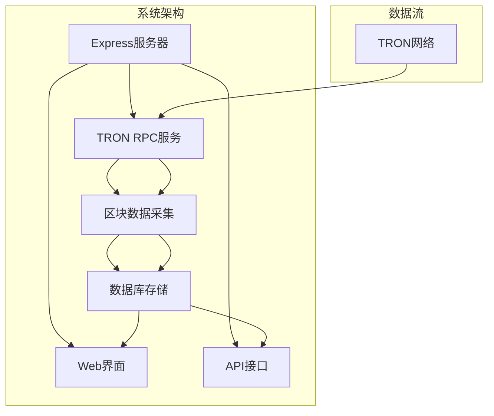
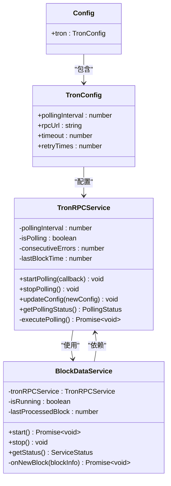
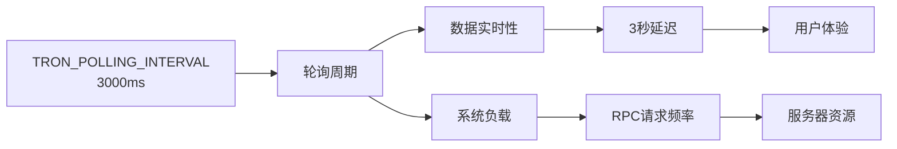
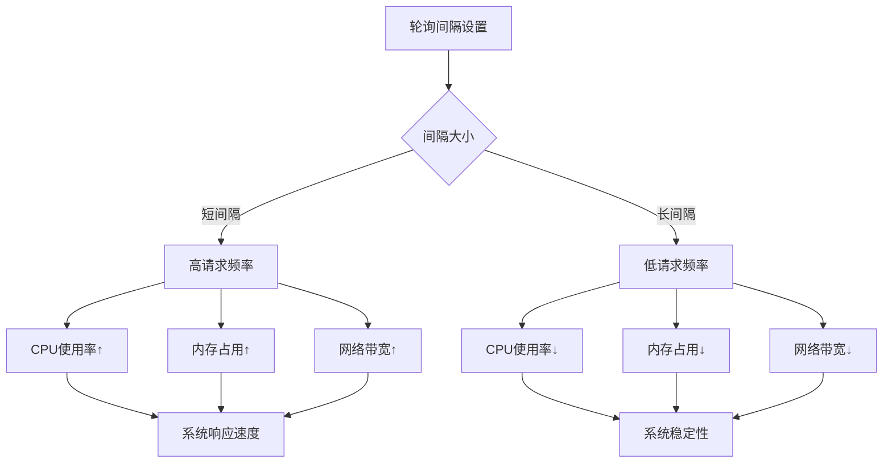
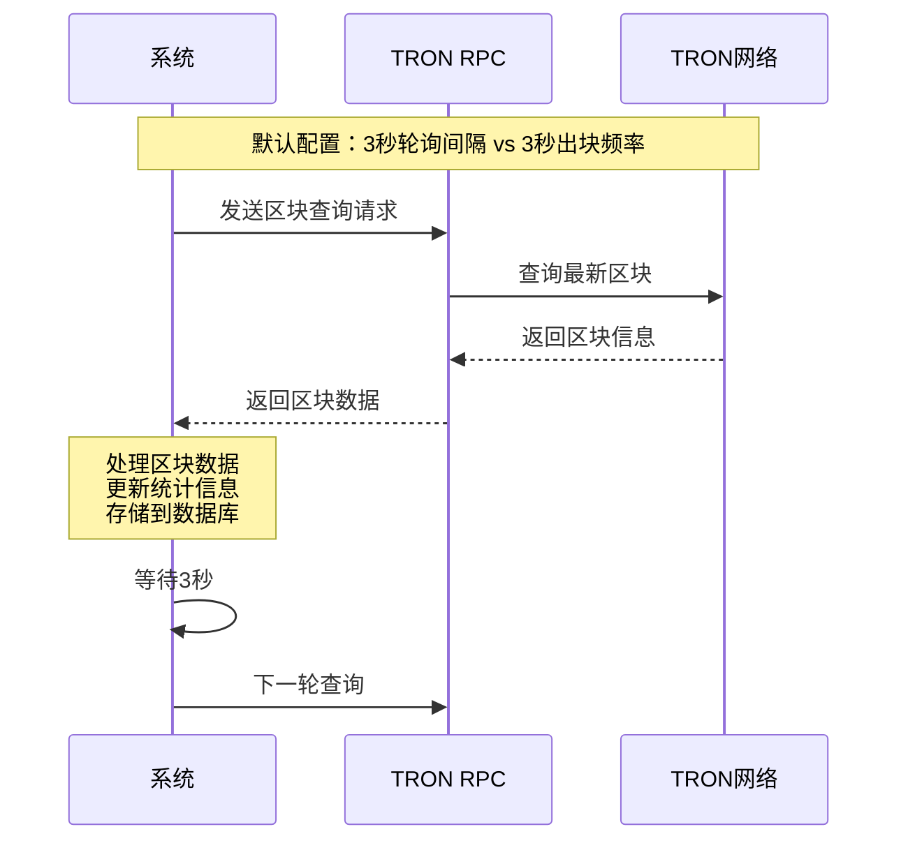
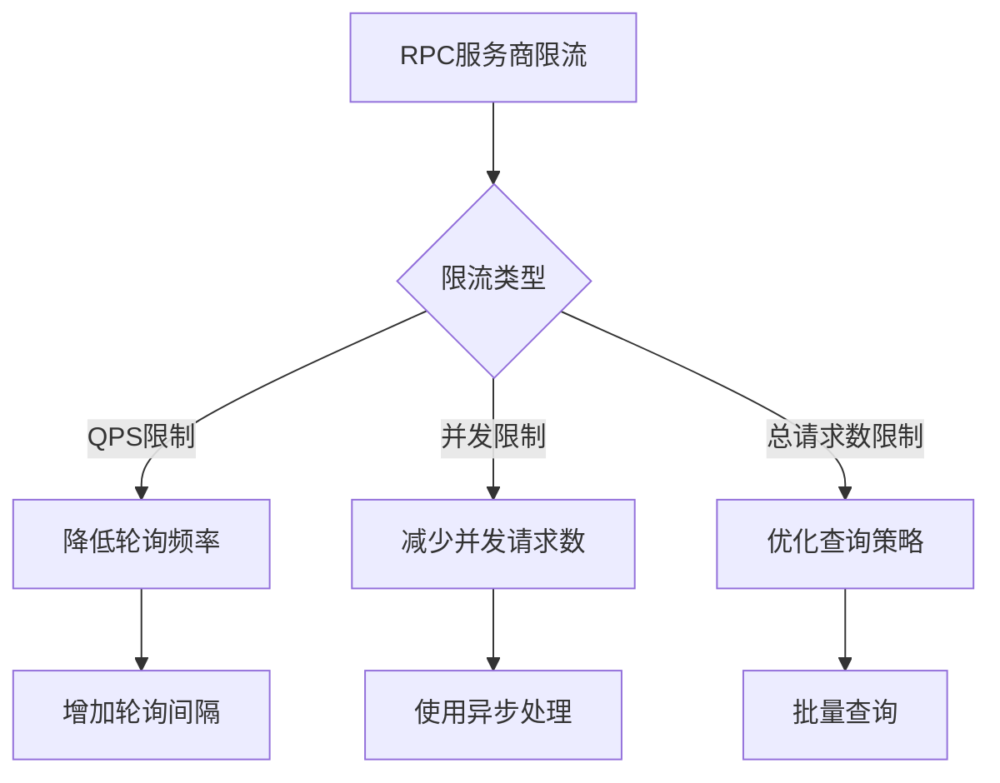
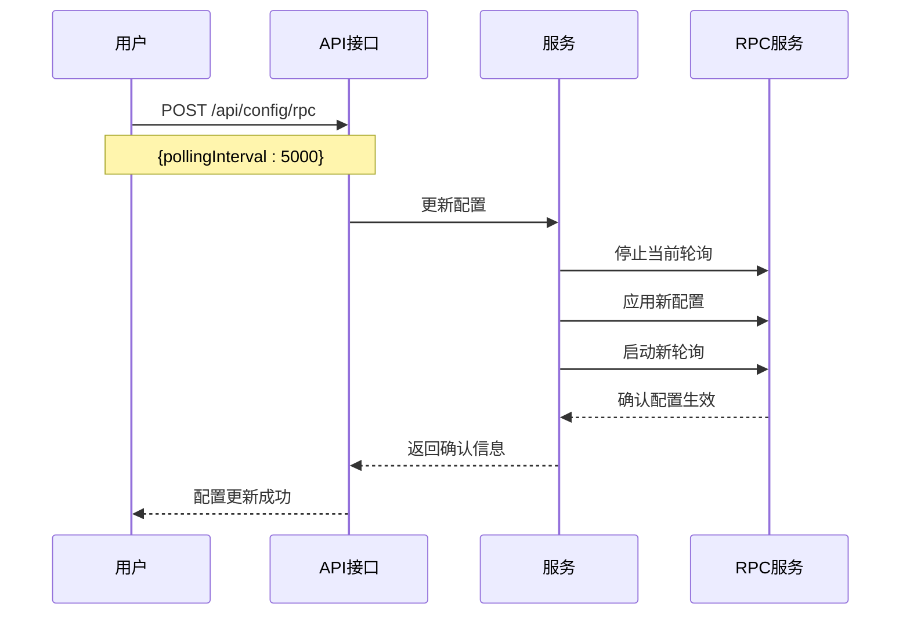
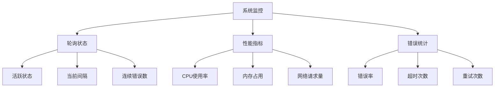

# 轮询间隔设置

<cite>
**本文档引用的文件**
- [src/config/index.ts](file://src/config/index.ts)
- [src/services/TronRPCService.ts](file://src/services/TronRPCService.ts)
- [src/services/BlockDataService.ts](file://src/services/BlockDataService.ts)
- [src/models/types.ts](file://src/models/types.ts)
- [src/index.ts](file://src/index.ts)
- [src/routes/config.ts](file://src/routes/config.ts)
- [README.md](file://README.md)
</cite>

## 目录
1. [项目概述](#项目概述)
2. [轮询间隔核心概念](#轮询间隔核心概念)
3. [默认配置分析](#默认配置分析)
4. [轮询间隔对系统性能的影响](#轮询间隔对系统性能的影响)
5. [TRON网络出块频率匹配逻辑](#tron网络出块频率匹配逻辑)
6. [配置优化策略](#配置优化策略)
7. [动态调整轮询频率的扩展思路](#动态调整轮询频率的扩展思路)
8. [故障排除指南](#故障排除指南)
9. [总结](#总结)

## 项目概述

Point-Tron是一个基于TypeScript和Node.js开发的波场网络区块链数据统计后台管理系统。该系统的核心功能是实时监控波场网络每3秒的出块情况，统计区块哈希最后一个阿拉伯数字的单双数规律，并提供可视化的数据分析界面。



**图表来源**
- [src/index.ts](file://src/index.ts#L1-L50)
- [src/services/TronRPCService.ts](file://src/services/TronRPCService.ts#L1-L50)

**章节来源**
- [README.md](file://README.md#L1-L50)
- [src/index.ts](file://src/index.ts#L1-L100)

## 轮询间隔核心概念

轮询间隔（TRON_POLLING_INTERVAL）是指系统定期向TRON网络RPC节点发送请求以获取最新区块信息的时间间隔。在Point-Tron系统中，这个参数控制着数据采集的频率和系统的实时性表现。

### 核心组件关系



**图表来源**
- [src/services/TronRPCService.ts](file://src/services/TronRPCService.ts#L15-L35)
- [src/services/BlockDataService.ts](file://src/services/BlockDataService.ts#L10-L25)
- [src/config/index.ts](file://src/config/index.ts#L15-L25)

**章节来源**
- [src/services/TronRPCService.ts](file://src/services/TronRPCService.ts#L1-L100)
- [src/services/BlockDataService.ts](file://src/services/BlockDataService.ts#L1-L50)

## 默认配置分析

### 环境变量配置

系统通过环境变量`TRON_POLLING_INTERVAL`来配置轮询间隔，默认值为3000毫秒（3秒）。这个配置在多个地方被使用：

```typescript
// 配置文件中的默认值
pollingInterval: parseInt(process.env.TRON_POLLING_INTERVAL || '3000', 10),
```

### 配置参数详解



**图表来源**
- [src/config/index.ts](file://src/config/index.ts#L22-L22)

**章节来源**
- [src/config/index.ts](file://src/config/index.ts#L1-L52)

## 轮询间隔对系统性能的影响

### 性能影响分析

轮询间隔的设置直接影响系统的两个关键方面：数据实时性和系统负载。

#### 1. 数据实时性

- **3秒间隔**：系统每3秒获取一次最新区块信息，能够及时反映TRON网络的最新状态
- **更短间隔**（如1000ms）：提高数据实时性，但会显著增加RPC请求频率
- **更长间隔**（如5000ms）：降低系统负载，但可能导致数据延迟

#### 2. 系统负载分析



**图表来源**
- [src/services/TronRPCService.ts](file://src/services/TronRPCService.ts#L49-L94)

### 错误处理机制

系统实现了完善的错误处理机制来应对轮询过程中的各种异常情况：

```typescript
// 连续错误检测
if (this.consecutiveErrors >= 10) {
  console.error('连续错误次数过多，请检查TRON网络连接');
  // 可以选择停止轮询或者发送告警
}
```

**章节来源**
- [src/services/TronRPCService.ts](file://src/services/TronRPCService.ts#L49-L94)

## TRON网络出块频率匹配逻辑

### TRON网络特性

波场网络的区块出块频率通常为每3秒一个区块。这种设计与系统默认的3000毫秒轮询间隔形成了良好的匹配关系。

### 匹配优势



**图表来源**
- [src/services/TronRPCService.ts](file://src/services/TronRPCService.ts#L49-L94)
- [README.md](file://README.md#L20-L30)

### 匹配效果评估

- **理想匹配**：轮询间隔与出块频率完全一致，确保每次查询都能获取到最新的区块信息
- **偏差处理**：如果轮询间隔与出块频率不完全匹配，系统会通过区块号比较来避免重复处理

**章节来源**
- [README.md](file://README.md#L20-L30)
- [src/services/BlockDataService.ts](file://src/services/BlockDataService.ts#L50-L100)

## 配置优化策略

### RPC服务商限流策略适配

不同的RPC服务商有不同的限流策略，需要根据实际情况调整轮询间隔：

#### 1. 高频访问限制



#### 2. 服务器资源状况评估

- **高性能服务器**：可以适当缩短轮询间隔以提高实时性
- **资源受限服务器**：应该延长轮询间隔以降低系统负载
- **混合部署**：可以根据不同环境动态调整配置

### 动态配置示例

```typescript
// 生产环境配置
const productionConfig = {
  pollingInterval: 3000, // 3秒
  timeout: 5000,
  retryTimes: 3
};

// 开发环境配置
const developmentConfig = {
  pollingInterval: 10000, // 10秒
  timeout: 10000,
  retryTimes: 5
};
```

**章节来源**
- [src/config/index.ts](file://src/config/index.ts#L15-L25)
- [src/routes/config.ts](file://src/routes/config.ts#L1-L50)

## 动态调整轮询频率的扩展思路

### 实现方案设计

系统提供了完整的配置更新机制，支持动态调整轮询间隔而无需重启服务：



**图表来源**
- [src/services/TronRPCService.ts](file://src/services/TronRPCService.ts#L226-L257)
- [src/routes/config.ts](file://src/routes/config.ts#L1-L50)

### 动态调整实现

系统通过`updateConfig`方法实现了配置的动态更新：

```typescript
public updateConfig(newConfig: Partial<TronRPCConfig>): void {
  if (newConfig.pollingInterval) {
    this.pollingInterval = newConfig.pollingInterval;
    
    // 如果正在轮询，重启以应用新间隔
    if (this.isPolling && this.onBlockCallback) {
      const callback = this.onBlockCallback;
      this.stopPolling();
      this.startPolling(callback);
    }
  }
}
```

### 扩展功能建议

#### 1. 智能自适应调整

```typescript
// 智能调整算法
class AdaptivePolling {
  private baseInterval: number = 3000;
  private maxInterval: number = 10000;
  private minInterval: number = 1000;
  
  adjustInterval(responseTime: number, errorRate: number): number {
    let newInterval = this.baseInterval;
    
    // 根据响应时间调整
    if (responseTime > 2000) {
      newInterval += 1000;
    }
    
    // 根据错误率调整
    if (errorRate > 0.1) {
      newInterval += 2000;
    }
    
    return Math.min(Math.max(newInterval, this.minInterval), this.maxInterval);
  }
}
```

#### 2. 基于负载的动态调整

```typescript
// 负载感知调整
class LoadAwarePolling {
  adjustBasedOnLoad(cpuUsage: number, memoryUsage: number): number {
    if (cpuUsage > 0.8 || memoryUsage > 0.9) {
      // 负载过高，延长轮询间隔
      return this.currentInterval * 2;
    } else if (cpuUsage < 0.3 && memoryUsage < 0.5) {
      // 负载较低，可以缩短间隔
      return Math.max(this.currentInterval - 500, this.minInterval);
    }
    return this.currentInterval;
  }
}
```

**章节来源**
- [src/services/TronRPCService.ts](file://src/services/TronRPCService.ts#L226-L257)
- [src/routes/config.ts](file://src/routes/config.ts#L1-L79)

## 故障排除指南

### 常见问题诊断

#### 1. 轮询间隔设置不当

**症状**：系统响应缓慢或频繁超时
**原因**：轮询间隔设置过短导致RPC请求过于频繁
**解决方案**：
- 增加轮询间隔至5000ms或更高
- 检查RPC服务商的限流策略
- 监控系统资源使用情况

#### 2. 数据延迟问题

**症状**：显示的数据与实际网络状态有延迟
**原因**：轮询间隔设置过长或网络延迟
**解决方案**：
- 减少轮询间隔至3000ms
- 更换更快的RPC节点
- 检查网络连接质量

#### 3. 系统资源过载

**症状**：CPU使用率持续高位或内存泄漏
**原因**：轮询间隔设置过短导致系统负载过高
**解决方案**：
- 延长轮询间隔
- 实施请求限流
- 优化数据处理逻辑

### 监控指标



**图表来源**
- [src/services/TronRPCService.ts](file://src/services/TronRPCService.ts#L226-L257)

### 调试工具

系统提供了完整的轮询状态查询接口：

```typescript
// 获取轮询状态
public getPollingStatus(): {
  isActive: boolean;
  interval: number;
  consecutiveErrors: number;
  lastBlockTime: number;
} {
  return {
    isActive: this.isPolling,
    interval: this.pollingInterval,
    consecutiveErrors: this.consecutiveErrors,
    lastBlockTime: this.lastBlockTime
  };
}
```

**章节来源**
- [src/services/TronRPCService.ts](file://src/services/TronRPCService.ts#L226-L257)

## 总结

TRON_POLLING_INTERVAL参数是Point-Tron系统的核心配置之一，它在数据实时性和系统性能之间扮演着重要角色。通过合理的配置和动态调整，可以在保证系统稳定运行的同时，最大化数据的实时性和准确性。

### 关键要点

1. **默认配置**：3000毫秒的轮询间隔与TRON网络的出块频率完美匹配
2. **性能权衡**：缩短间隔提升实时性但增加请求压力，延长间隔降低负载但影响数据新鲜度
3. **动态调整**：系统支持运行时动态调整轮询间隔，无需重启服务
4. **智能优化**：建议根据RPC服务商限流策略和服务器资源状况进行个性化配置
5. **扩展潜力**：具备实现智能自适应调整和负载感知调整的能力

### 最佳实践建议

- **生产环境**：建议保持默认的3000毫秒配置，除非有特殊需求
- **开发环境**：可以适当延长轮询间隔以减少资源消耗
- **监控告警**：建立完善的监控体系，及时发现和处理异常情况
- **定期优化**：根据实际运行情况定期评估和调整配置参数

通过深入理解轮询间隔的工作原理和影响因素，运维人员可以更好地优化系统性能，为用户提供稳定可靠的服务。