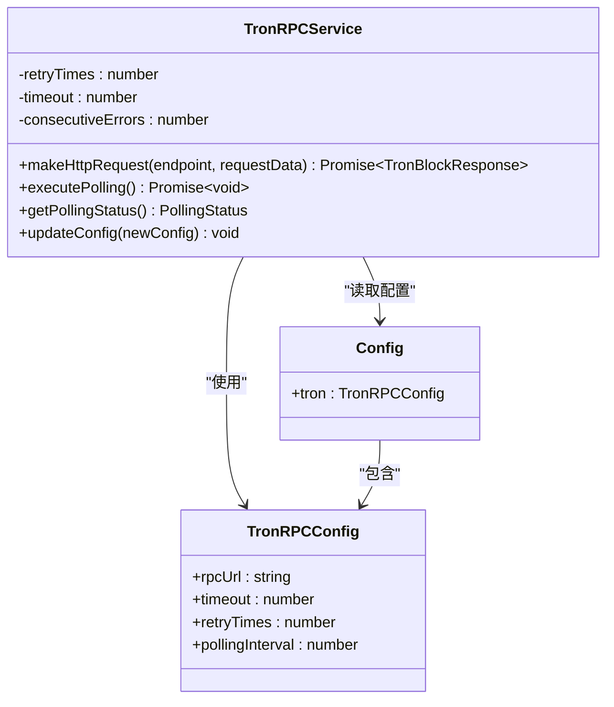
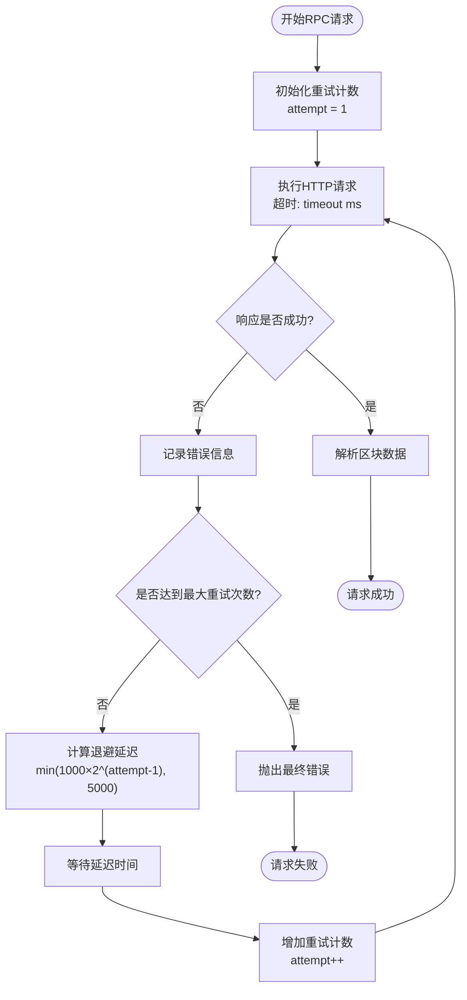
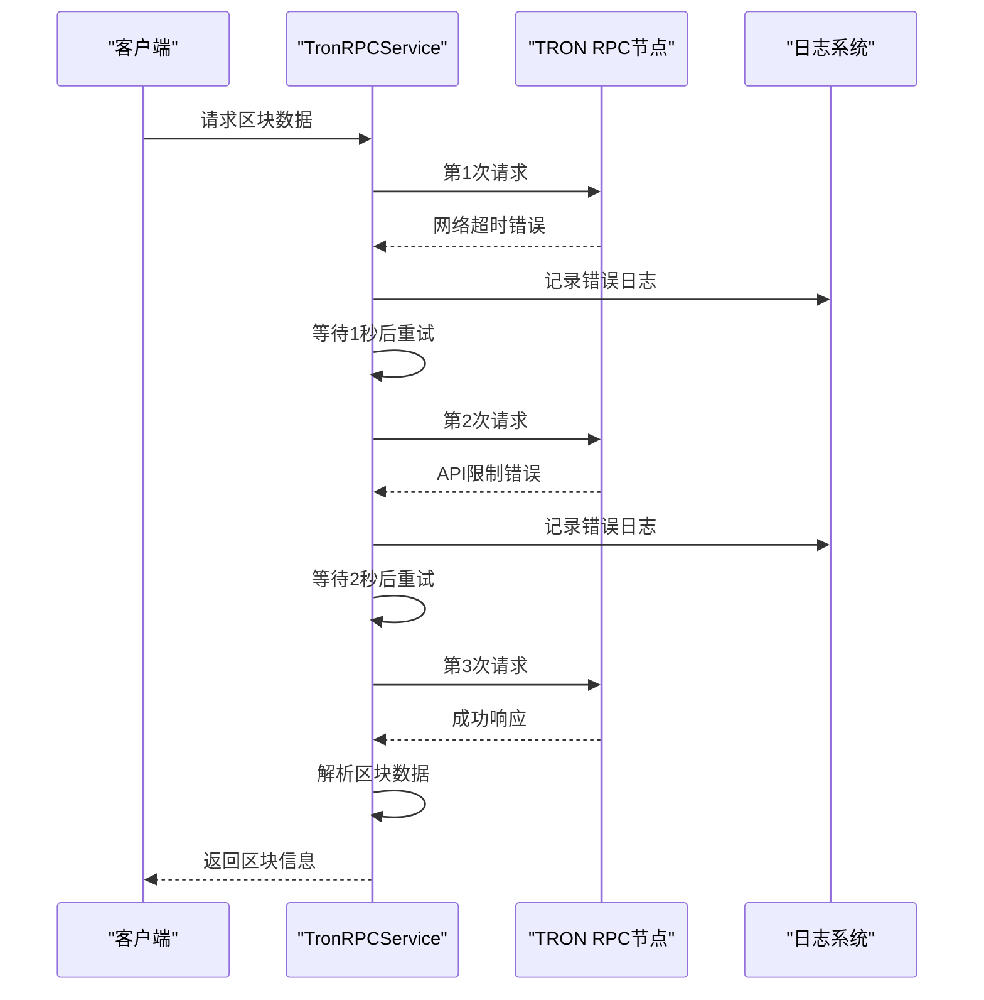
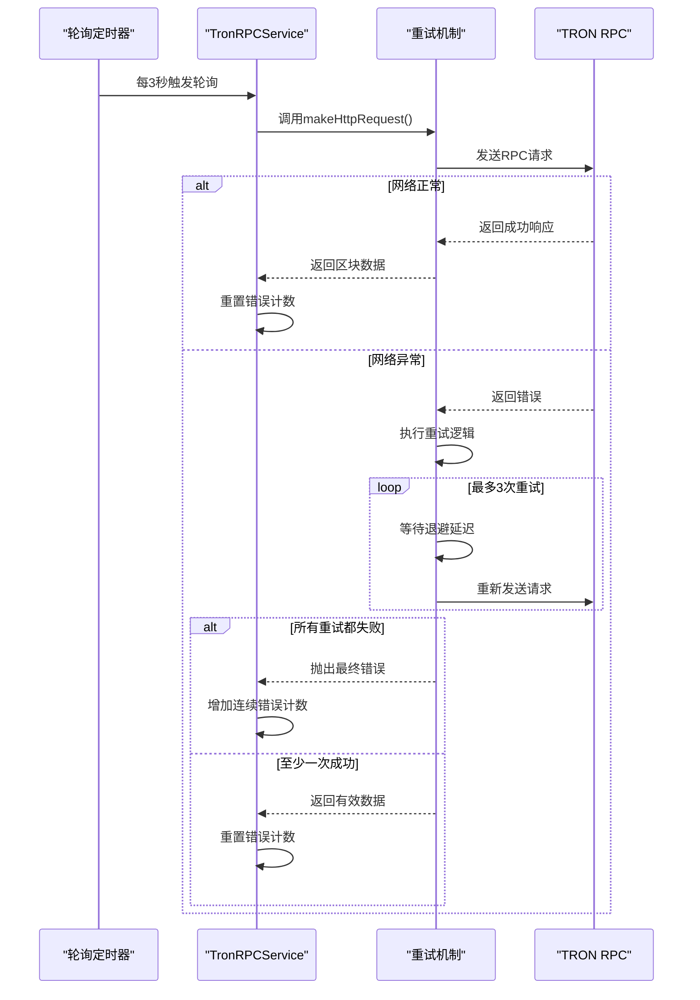
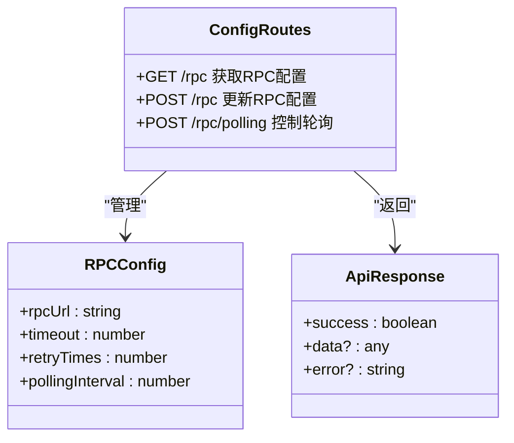
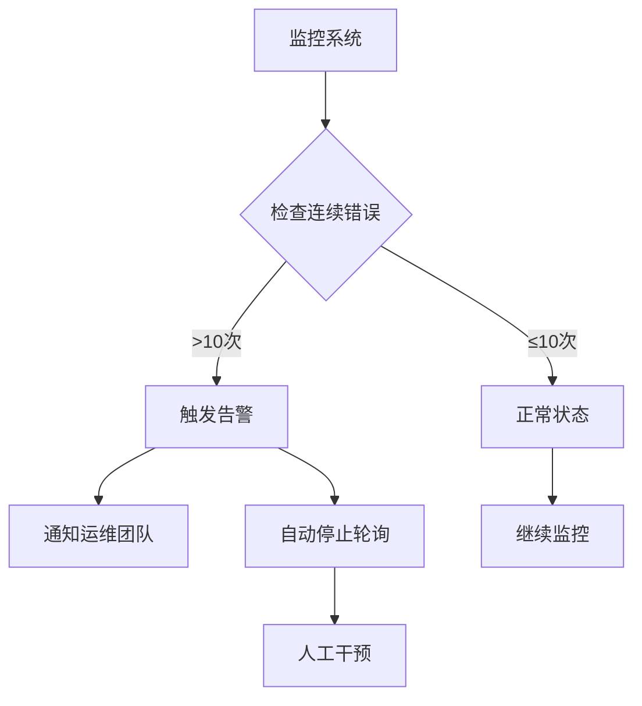
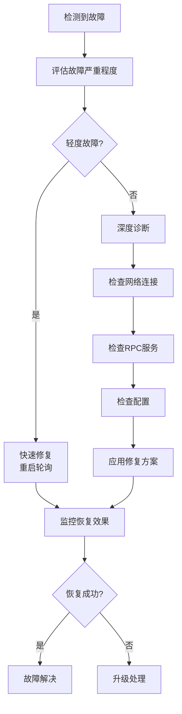

# TRON_RETRY_TIMES参数配置文档

<cite>
**本文档引用的文件**
- [src/config/index.ts](file://src/config/index.ts)
- [src/services/TronRPCService.ts](file://src/services/TronRPCService.ts)
- [src/models/types.ts](file://src/models/types.ts)
- [src/routes/config.ts](file://src/routes/config.ts)
</cite>

## 目录
1. [简介](#简介)
2. [参数概述](#参数概述)
3. [核心实现机制](#核心实现机制)
4. [重试策略详解](#重试策略详解)
5. [轮询与重试的协同关系](#轮询与重试的协同关系)
6. [配置管理](#配置管理)
7. [性能考量](#性能考量)
8. [监控与运维](#监控与运维)
9. [最佳实践](#最佳实践)
10. [故障排除指南](#故障排除指南)

## 简介

TRON_RETRY_TIMES参数是Point-Tron系统中用于保障TRON区块链数据采集可靠性的关键配置项。该参数定义了RPC请求在网络波动或临时故障时的最大重试次数，通过指数退避算法确保系统在面对网络不稳定时仍能维持正常的数据采集功能。

## 参数概述

### 基本配置

TRON_RETRY_TIMES参数在系统配置中的位置和默认值如下：

```typescript
tron: {
  rpcUrl: process.env.TRON_RPC_URL || 'https://api.trongrid.io',
  timeout: parseInt(process.env.TRON_TIMEOUT || '5000', 10),
  retryTimes: parseInt(process.env.TRON_RETRY_TIMES || '3', 10),
  pollingInterval: parseInt(process.env.TRON_POLLING_INTERVAL || '3000', 10),
}
```

### 参数特性

- **默认值**: 3次重试机会
- **取值范围**: 1-10次（推荐范围）
- **类型**: 整数
- **作用域**: 全局配置，影响所有RPC请求

**章节来源**
- [src/config/index.ts](file://src/config/index.ts#L25-L28)

## 核心实现机制

### 重试机制架构



**图表来源**
- [src/services/TronRPCService.ts](file://src/services/TronRPCService.ts#L15-L25)
- [src/config/index.ts](file://src/config/index.ts#L12-L28)

### 重试流程控制



**图表来源**
- [src/services/TronRPCService.ts](file://src/services/TronRPCService.ts#L110-L150)

**章节来源**
- [src/services/TronRPCService.ts](file://src/services/TronRPCService.ts#L110-L150)

## 重试策略详解

### 指数退避算法

系统采用指数退避策略来优化重试间隔，避免对RPC服务造成过大压力：

```typescript
// 计算退避延迟
const delay = Math.min(1000 * Math.pow(2, attempt - 1), 5000);
console.log(`等待${delay}ms后重试...`);
await new Promise(resolve => setTimeout(resolve, delay));
```

### 退避策略特点

1. **动态调整**: 第1次重试延迟1秒，第2次2秒，第3次4秒...
2. **上限保护**: 最大延迟不超过5秒，防止过长等待
3. **指数增长**: 减少频繁重试对RPC服务的压力
4. **快速恢复**: 在网络短暂波动时能快速恢复正常

### 错误处理机制



**图表来源**
- [src/services/TronRPCService.ts](file://src/services/TronRPCService.ts#L110-L150)

**章节来源**
- [src/services/TronRPCService.ts](file://src/services/TronRPCService.ts#L110-L150)

## 轮询与重试的协同关系

### 轮询机制概述

系统采用3秒间隔的轮询机制定期检查最新的区块链区块：

```typescript
// 启动轮询
public startPolling(callback: (blockInfo: BlockInfo) => void): void {
  // 立即执行一次
  this.executePolling();
  
  // 设置定时器
  this.pollingTimer = setInterval(() => {
    this.executePolling();
  }, this.pollingInterval);
}
```

### 协同工作流程



**图表来源**
- [src/services/TronRPCService.ts](file://src/services/TronRPCService.ts#L40-L95)

### 错误累积监控

系统实现了连续错误计数机制，当连续错误超过10次时会发出警告：

```typescript
private async executePolling(): Promise<void> {
  try {
    const latestBlock = await this.getLatestBlock();
    
    // 重置错误计数
    this.consecutiveErrors = 0;
    this.lastBlockTime = Date.now();
    
  } catch (error: any) {
    this.consecutiveErrors++;
    console.error(`RPC轮询错误 (连续第${this.consecutiveErrors}次):`, error?.message);
    
    // 连续错误阈值检查
    if (this.consecutiveErrors >= 10) {
      console.error('连续错误次数过多，请检查TRON网络连接');
    }
  }
}
```

**章节来源**
- [src/services/TronRPCService.ts](file://src/services/TronRPCService.ts#L40-L95)

## 配置管理

### 动态配置更新

系统支持运行时动态更新TRON_RETRY_TIMES参数：

```typescript
public updateConfig(newConfig: Partial<TronRPCConfig>): void {
  if (newConfig.retryTimes) this.retryTimes = newConfig.retryTimes;
  
  // 如果正在轮询，重启以应用新配置
  if (this.isPolling && this.onBlockCallback) {
    const callback = this.onBlockCallback;
    this.stopPolling();
    this.startPolling(callback);
  }
}
```

### 配置接口



**图表来源**
- [src/routes/config.ts](file://src/routes/config.ts#L10-L80)

**章节来源**
- [src/services/TronRPCService.ts](file://src/services/TronRPCService.ts#L240-L257)
- [src/routes/config.ts](file://src/routes/config.ts#L10-L80)

## 性能考量

### 重试对系统性能的影响

1. **正面影响**:
   - 提高数据采集成功率
   - 减少因网络波动导致的服务中断
   - 增强系统的容错能力

2. **负面影响**:
   - 增加RPC服务端的负载
   - 可能触发RPC服务商的限流机制
   - 延长请求处理时间

### 限流风险预警

过度重试可能触发以下风险：

- **RPC服务商限流**: 多次重试可能导致IP被暂时封禁
- **资源浪费**: 在网络持续不稳定时消耗过多系统资源
- **用户体验下降**: 请求响应时间变长

### 性能优化建议

```typescript
// 推荐的配置组合
const optimalConfig = {
  retryTimes: 3,           // 平衡成功率和风险
  pollingInterval: 3000,   // 3秒间隔适合实时性要求
  timeout: 5000           // 5秒超时避免长时间等待
};
```

## 监控与运维

### 轮询状态监控

系统提供了完整的轮询状态监控接口：

```typescript
public getPollingStatus(): {
  isActive: boolean;
  interval: number;
  consecutiveErrors: number;
  lastBlockTime: number;
} {
  return {
    isActive: this.isPolling,
    interval: this.pollingInterval,
    consecutiveErrors: this.consecutiveErrors,
    lastBlockTime: this.lastBlockTime
  };
}
```

### 监控指标

关键监控指标包括：

1. **重试成功率**: 成功完成的RPC请求比例
2. **连续错误计数**: 当前连续失败次数
3. **平均响应时间**: 包含重试在内的总耗时
4. **RPC服务可用性**: 连接测试结果

### 告警机制



**章节来源**
- [src/services/TronRPCService.ts](file://src/services/TronRPCService.ts#L226-L240)

## 最佳实践

### 生产环境配置建议

1. **基础配置**:
   ```bash
   # 推荐的基础配置
   TRON_RETRY_TIMES=3
   TRON_POLLING_INTERVAL=3000
   TRON_TIMEOUT=5000
   ```

2. **高可用配置**:
   ```bash
   # 高可用场景下的配置
   TRON_RETRY_TIMES=5
   TRON_POLLING_INTERVAL=5000
   TRON_TIMEOUT=10000
   ```

3. **低延迟配置**:
   ```bash
   # 对延迟敏感的场景
   TRON_RETRY_TIMES=2
   TRON_POLLING_INTERVAL=2000
   TRON_TIMEOUT=3000
   ```

### 配置验证

```typescript
// 配置验证函数
function validateRetryConfig(retryTimes: number, pollingInterval: number): boolean {
  if (retryTimes < 1 || retryTimes > 10) {
    console.error('TRON_RETRY_TIMES必须在1-10之间');
    return false;
  }
  
  if (pollingInterval < 1000) {
    console.error('TRON_POLLING_INTERVAL不能小于1秒');
    return false;
  }
  
  return true;
}
```

### 环境适配

不同环境下的配置建议：

- **开发环境**: 较小的重试次数和较短的轮询间隔
- **测试环境**: 中等配置，平衡性能和稳定性
- **生产环境**: 较大的重试次数和较长的轮询间隔

## 故障排除指南

### 常见问题诊断

1. **频繁重试失败**:
   - 检查网络连接稳定性
   - 验证RPC服务端点可用性
   - 调整重试次数和超时设置

2. **连续错误累积**:
   - 查看错误日志定位根本原因
   - 检查RPC服务商的限流状态
   - 考虑切换到备用RPC节点

3. **性能问题**:
   - 监控系统资源使用情况
   - 分析重试模式和退避策略
   - 优化轮询间隔和超时设置

### 故障恢复流程



### 日志分析

关键日志模式识别：

```typescript
// 重试相关日志示例
console.log(`尝试第${attempt}次请求: ${url}`);
console.warn(`请求尝试${attempt}失败:`, error?.message);
console.log(`等待${delay}ms后重试...`);
```

通过分析这些日志模式，可以快速定位重试失败的原因和频率分布。

**章节来源**
- [src/services/TronRPCService.ts](file://src/services/TronRPCService.ts#L110-L150)

## 结论

TRON_RETRY_TIMES参数是Point-Tron系统保障数据采集可靠性的核心配置。通过合理的重试策略、指数退避算法和轮询机制的协同工作，系统能够在面对网络波动时保持稳定运行。然而，在实际部署中需要根据具体的网络环境、RPC服务商策略和业务需求来合理配置该参数，避免过度重试带来的限流风险。同时，完善的监控和告警机制能够帮助运维人员及时发现和处理潜在问题，确保系统的长期稳定运行。