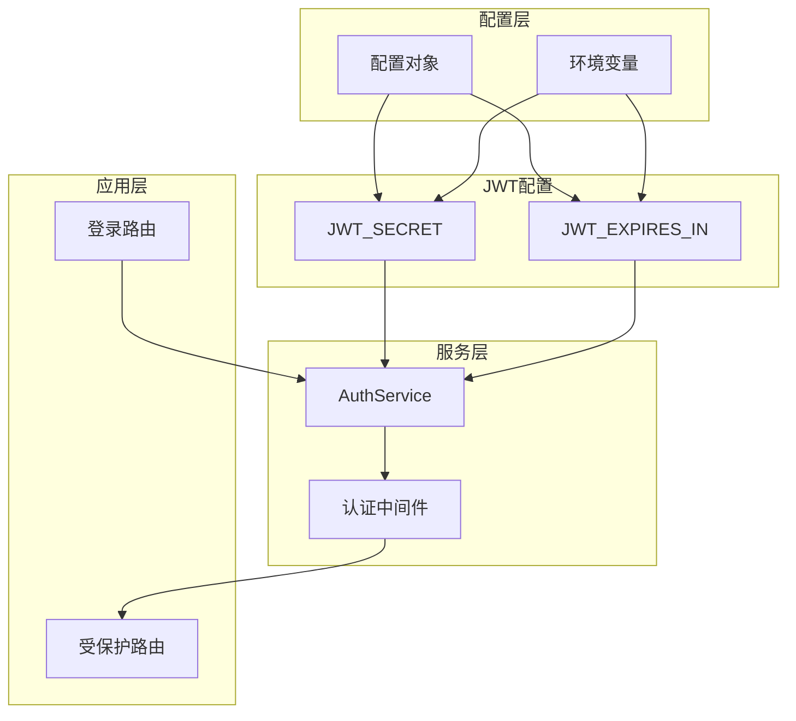
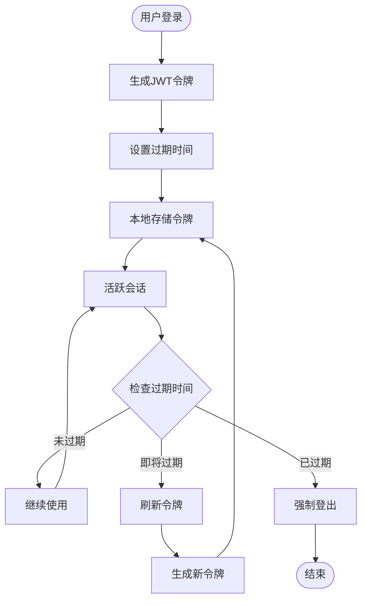
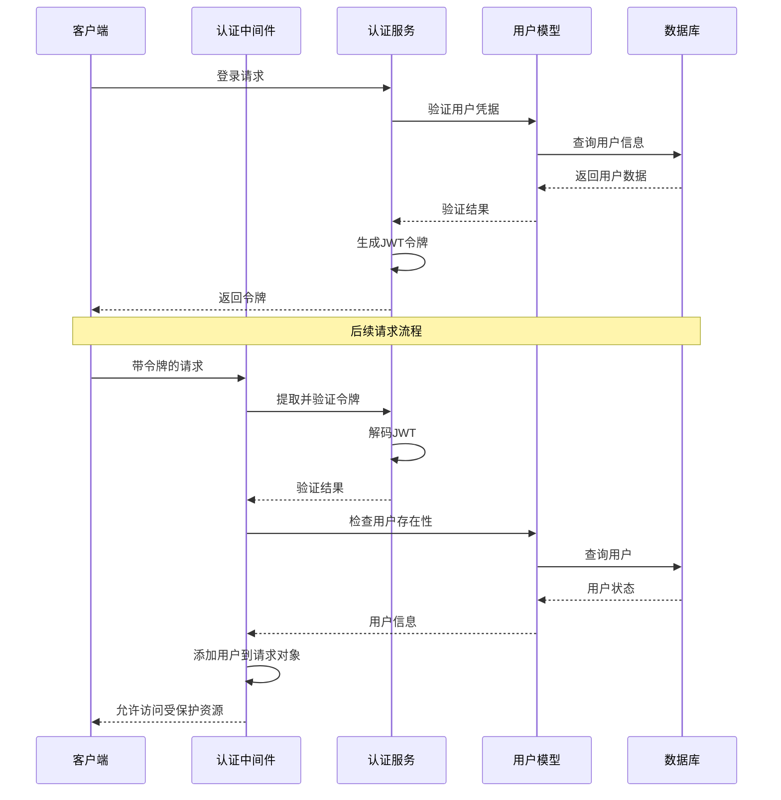
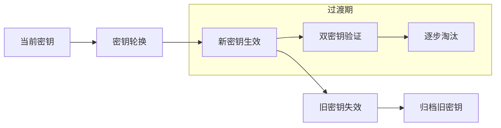

# 安全配置文档

<cite>
**本文档引用的文件**
- [src/config/index.ts](file://src/config/index.ts)
- [src/services/AuthService.ts](file://src/services/AuthService.ts)
- [src/middleware/auth.ts](file://src/middleware/auth.ts)
- [src/models/UserModel.ts](file://src/models/UserModel.ts)
- [src/models/types.ts](file://src/models/types.ts)
- [package.json](file://package.json)
</cite>

## 目录
1. [简介](#简介)
2. [JWT配置架构](#jwt配置架构)
3. [密钥安全管理](#密钥安全管理)
4. [令牌有效期配置](#令牌有效期配置)
5. [认证流程分析](#认证流程分析)
6. [安全最佳实践](#安全最佳实践)
7. [故障排除指南](#故障排除指南)
8. [总结](#总结)

## 简介

本文档详细介绍了Point-Tron项目中的JWT（JSON Web Token）认证系统配置，重点涵盖密钥管理和令牌有效期设置。该系统采用现代化的JWT认证机制，确保用户会话的安全性和可靠性。

## JWT配置架构

### 配置结构概览

JWT配置在项目的配置系统中占据重要位置，通过统一的配置对象进行管理：



**图表来源**
- [src/config/index.ts](file://src/config/index.ts#L1-L51)
- [src/services/AuthService.ts](file://src/services/AuthService.ts#L1-L104)

### 配置接口定义

JWT配置通过TypeScript接口严格定义，确保类型安全：

```typescript
interface Config {
  jwt: {
    secret: string;
    expiresIn: string;
  };
}
```

**章节来源**
- [src/config/index.ts](file://src/config/index.ts#L8-L16)

## 密钥安全管理

### 密钥配置机制

JWT密钥通过环境变量进行配置，提供了灵活且安全的密钥管理方案：

```typescript
jwt: {
  secret: process.env.JWT_SECRET || 'your-super-secret-jwt-key-change-in-production',
  expiresIn: process.env.JWT_EXPIRES_IN || '7d',
}
```

### 密钥安全性要求

#### 生产环境密钥要求

1. **强随机性**：密钥必须使用加密安全的随机数生成器创建
2. **足够长度**：建议使用至少256位（32字节）的密钥
3. **唯一性**：每个部署环境应使用独立的密钥
4. **保密性**：密钥不应包含在版本控制系统中

#### 密钥生成示例

以下是推荐的密钥生成方法：

```javascript
// 使用crypto模块生成安全密钥
const crypto = require('crypto');

// 生成32字节的随机密钥
const secretKey = crypto.randomBytes(32).toString('hex');
console.log('生成的JWT密钥:', secretKey);

// 或者使用base64编码
const base64Secret = crypto.randomBytes(32).toString('base64');
console.log('Base64编码的JWT密钥:', base64Secret);
```

### 密钥存储策略

#### 环境变量存储

推荐将密钥存储在环境变量中，避免硬编码：

```bash
# 开发环境（可使用默认值）
JWT_SECRET=your-development-secret-key
JWT_EXPIRES_IN=7d

# 生产环境（必须替换为安全密钥）
JWT_SECRET=production-jwt-secret-should-be-very-long-and-random
JWT_EXPIRES_IN=24h
```

#### 安全存储选项

1. **云密钥管理服务**：AWS KMS、Azure Key Vault、Google Cloud KMS
2. **容器化环境**：Docker secrets、Kubernetes secrets
3. **专用配置管理**：Vault、Consul

**章节来源**
- [src/config/index.ts](file://src/config/index.ts#L28-L31)

## 令牌有效期配置

### 时间格式支持

JWT令牌的有效期支持多种时间格式，提供了灵活的配置选项：

```typescript
// 支持的时间格式示例
const timeFormats = [
  '7d',     // 7天
  '24h',    // 24小时
  '120m',   // 120分钟
  '3600s',  // 3600秒
  '1w'      // 1周
];
```

### 有效期配置详解

#### 默认配置行为

系统提供了合理的默认配置：

- **默认有效期**：7天（'7d'）
- **最小单位**：秒（s）、分钟（m）、小时（h）、天（d）、周（w）
- **最大长度**：支持任意正整数

#### 有效期对用户体验的影响



**图表来源**
- [src/services/AuthService.ts](file://src/services/AuthService.ts#L40-L58)

### 动态有效期管理

系统实现了智能的令牌过期检测机制：

```typescript
// 检查令牌是否即将过期（剩余时间少于1小时）
static isTokenExpiringSoon(token: string): boolean {
  try {
    const decoded = jwt.decode(token) as JWTPayload;
    if (!decoded || !decoded.exp) {
      return true;
    }

    const now = Math.floor(Date.now() / 1000);
    const timeLeft = decoded.exp - now;
    
    // 如果剩余时间少于1小时，认为即将过期
    return timeLeft < 3600;
  } catch (error) {
    return true;
  }
}
```

**章节来源**
- [src/services/AuthService.ts](file://src/services/AuthService.ts#L40-L58)

## 认证流程分析

### 完整认证流程



**图表来源**
- [src/middleware/auth.ts](file://src/middleware/auth.ts#L18-L58)
- [src/services/AuthService.ts](file://src/services/AuthService.ts#L12-L25)

### 中间件认证机制

认证中间件负责拦截所有受保护的请求：

```typescript
export const authenticateToken = async (
  req: Request,
  res: Response<ApiResponse>,
  next: NextFunction
): Promise<void> => {
  try {
    const authHeader = req.headers.authorization;
    const token = AuthService.extractTokenFromHeader(authHeader);

    if (!token) {
      res.status(401).json({
        success: false,
        error: '访问令牌缺失'
      });
      return;
    }

    const decoded = AuthService.verifyToken(token);
    if (!decoded) {
      res.status(401).json({
        success: false,
        error: '无效的访问令牌'
      });
      return;
    }

    // 验证用户是否仍然存在
    const user = await UserModel.findById(decoded.userId);
    if (!user) {
      res.status(401).json({
        success: false,
        error: '用户不存在'
      });
      return;
    }

    // 将用户信息添加到请求对象
    req.user = {
      id: user.id!,
      username: user.username
    };

    next();
  } catch (error) {
    console.error('认证中间件错误:', error);
    res.status(500).json({
      success: false,
      error: '服务器内部错误'
    });
  }
};
```

**章节来源**
- [src/middleware/auth.ts](file://src/middleware/auth.ts#L18-L58)

## 安全最佳实践

### 密钥管理最佳实践

#### 1. 密钥生成

```javascript
// 推荐的密钥生成脚本
const crypto = require('crypto');

function generateSecureJWTSecret() {
  // 生成32字节的随机密钥
  const secret = crypto.randomBytes(32).toString('hex');
  
  // 添加额外的安全措施
  const salt = crypto.randomBytes(16).toString('hex');
  const finalSecret = `${secret}-${salt}`;
  
  return finalSecret;
}

console.log('生成的安全JWT密钥:', generateSecureJWTSecret());
```

#### 2. 密钥轮换策略



#### 3. 环境隔离

不同环境使用不同的密钥：

```bash
# 开发环境
JWT_SECRET=dev-jwt-secret-1234567890abcdef

# 测试环境
JWT_SECRET=test-jwt-secret-0987654321fedcba

# 生产环境
JWT_SECRET=prod-jwt-secret-with-high-entropy-1234567890abcdef
```

### 令牌安全策略

#### 1. 令牌传输安全

```typescript
// 安全的令牌传输方式
const secureTokenTransfer = {
  // 使用HTTPS传输
  protocol: 'https',
  
  // 设置安全头
  headers: {
    'Authorization': 'Bearer <token>',
    'Content-Type': 'application/json',
    'X-Requested-With': 'XMLHttpRequest'
  },
  
  // 防止令牌泄露
  storage: {
    localStorage: false,  // 不使用localStorage
    sessionStorage: true,  // 可以使用sessionStorage
    cookies: {
      httpOnly: true,     // 防止JavaScript访问
      secure: true,       // 仅HTTPS传输
      sameSite: 'strict'  // 防止CSRF攻击
    }
  }
};
```

#### 2. 令牌刷新机制

```typescript
// 智能令牌刷新
static refreshToken(oldToken: string): string | null {
  try {
    const decoded = jwt.verify(oldToken, config.jwt.secret) as JWTPayload;
    
    // 检查剩余时间是否足够
    const remainingTime = this.getTokenRemainingTime(oldToken);
    if (remainingTime > 3600) { // 剩余超过1小时，不刷新
      return oldToken;
    }
    
    // 生成新令牌
    const newPayload: JWTPayload = {
      userId: decoded.userId,
      username: decoded.username
    };

    return jwt.sign(newPayload, config.jwt.secret, {
      expiresIn: config.jwt.expiresIn
    } as jwt.SignOptions);
  } catch (error: any) {
    console.error('刷新令牌失败:', error?.message);
    return null;
  }
}
```

### 系统级安全措施

#### 1. 错误处理安全

```typescript
// 安全的错误处理
export const errorHandler = (
  error: Error,
  req: Request,
  res: Response<ApiResponse>,
  next: NextFunction
): void => {
  console.error('未处理的错误:', error);

  // 隐藏敏感错误信息
  if (error.message.includes('SQLITE')) {
    res.status(500).json({
      success: false,
      error: '数据库操作失败'
    });
    return;
  }

  // JWT错误处理
  if (error.name === 'JsonWebTokenError') {
    res.status(401).json({
      success: false,
      error: '无效的访问令牌'
    });
    return;
  }

  // 默认错误
  res.status(500).json({
    success: false,
    error: '服务器内部错误'
  });
};
```

#### 2. 速率限制

```typescript
// 简单但有效的速率限制
const rateLimitMap = new Map<string, { count: number; resetTime: number }>();

export const rateLimit = (maxRequests: number = 100, windowMs: number = 60000) => {
  return (req: Request, res: Response, next: NextFunction): void => {
    const clientIp = req.ip || req.connection.remoteAddress || 'unknown';
    const now = Date.now();
    
    const clientData = rateLimitMap.get(clientIp);
    
    if (!clientData || now > clientData.resetTime) {
      // 重置或初始化
      rateLimitMap.set(clientIp, {
        count: 1,
        resetTime: now + windowMs
      });
      next();
      return;
    }
    
    if (clientData.count >= maxRequests) {
      res.status(429).json({
        success: false,
        error: '请求过于频繁，请稍后再试'
      });
      return;
    }
    
    clientData.count++;
    next();
  };
};
```

**章节来源**
- [src/middleware/auth.ts](file://src/middleware/auth.ts#L60-L170)

## 故障排除指南

### 常见问题及解决方案

#### 1. JWT密钥配置错误

**问题症状**：
- "invalid signature" 错误
- "jwt malformed" 错误
- "secret or public key must be provided" 错误

**解决方案**：
```bash
# 检查环境变量是否正确设置
echo $JWT_SECRET

# 验证密钥格式
node -e "console.log(Buffer.byteLength(process.env.JWT_SECRET, 'utf8'))"

# 重新生成密钥
export JWT_SECRET=$(openssl rand -hex 32)
```

#### 2. 令牌过期问题

**问题症状**：
- 401 Unauthorized 错误
- "jwt expired" 错误
- 用户频繁需要重新登录

**解决方案**：
```typescript
// 调试令牌剩余时间
const token = 'your-jwt-token-here';
const remainingTime = AuthService.getTokenRemainingTime(token);
console.log(`令牌剩余时间: ${remainingTime} 秒`);

// 检查是否即将过期
const isExpiringSoon = AuthService.isTokenExpiringSoon(token);
console.log(`令牌即将过期: ${isExpiringSoon}`);
```

#### 3. 环境变量加载问题

**问题症状**：
- 使用默认密钥而不是环境变量
- 配置对象中显示默认值

**解决方案**：
```typescript
// 检查配置加载情况
import config from './config';

console.log('JWT配置:', {
  secret: config.jwt.secret.startsWith('your-super-secret-jwt-key-change-in-production') 
    ? '使用默认密钥！请设置JWT_SECRET环境变量'
    : '使用环境变量密钥',
  expiresIn: config.jwt.expiresIn
});
```

### 性能监控

#### 1. 令牌验证性能

```typescript
// 性能监控工具
const performanceMonitor = {
  verifyToken: async (token: string): Promise<number> => {
    const start = Date.now();
    const result = AuthService.verifyToken(token);
    const duration = Date.now() - start;
    
    console.log(`令牌验证耗时: ${duration}ms`);
    return duration;
  }
};
```

#### 2. 内存使用监控

```typescript
// 监控内存使用
setInterval(() => {
  const memUsage = process.memoryUsage();
  console.log('内存使用情况:', {
    rss: `${Math.round(memUsage.rss / 1024 / 1024)}MB`,
    heapUsed: `${Math.round(memUsage.heapUsed / 1024 / 1024)}MB`,
    heapTotal: `${Math.round(memUsage.heapTotal / 1024 / 1024)}MB`
  });
}, 30000); // 每30秒检查一次
```

**章节来源**
- [src/services/AuthService.ts](file://src/services/AuthService.ts#L80-L103)

## 总结

本文档全面介绍了Point-Tron项目中的JWT认证系统配置，涵盖了以下关键方面：

### 主要配置要点

1. **密钥管理**：通过环境变量实现灵活且安全的密钥配置
2. **有效期设置**：支持多种时间格式，提供合理的默认配置
3. **认证流程**：完整的认证中间件和令牌验证机制
4. **安全措施**：多层次的安全防护和错误处理

### 安全建议

1. **生产环境**：务必更换默认密钥，使用强随机生成的密钥
2. **密钥存储**：采用环境变量或专用密钥管理系统
3. **定期轮换**：建立密钥轮换策略，定期更新密钥
4. **监控告警**：实施令牌验证和系统性能监控

### 技术优势

- **类型安全**：完整的TypeScript类型定义
- **错误处理**：完善的错误处理和安全防护
- **扩展性**：模块化的设计便于功能扩展
- **性能优化**：智能的令牌刷新和验证机制

通过遵循本文档中的配置指南和安全最佳实践，可以确保JWT认证系统的安全性和可靠性，为用户提供稳定可靠的认证服务。