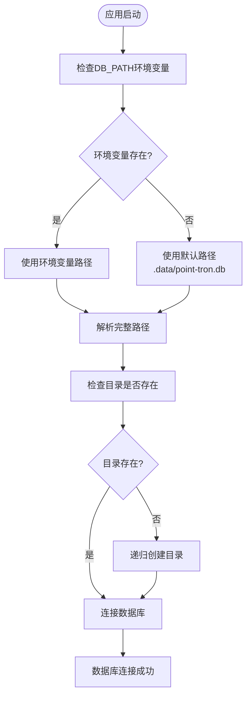
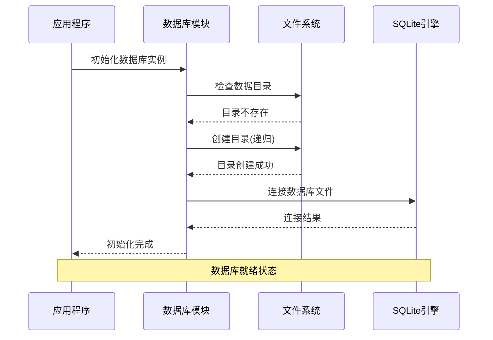
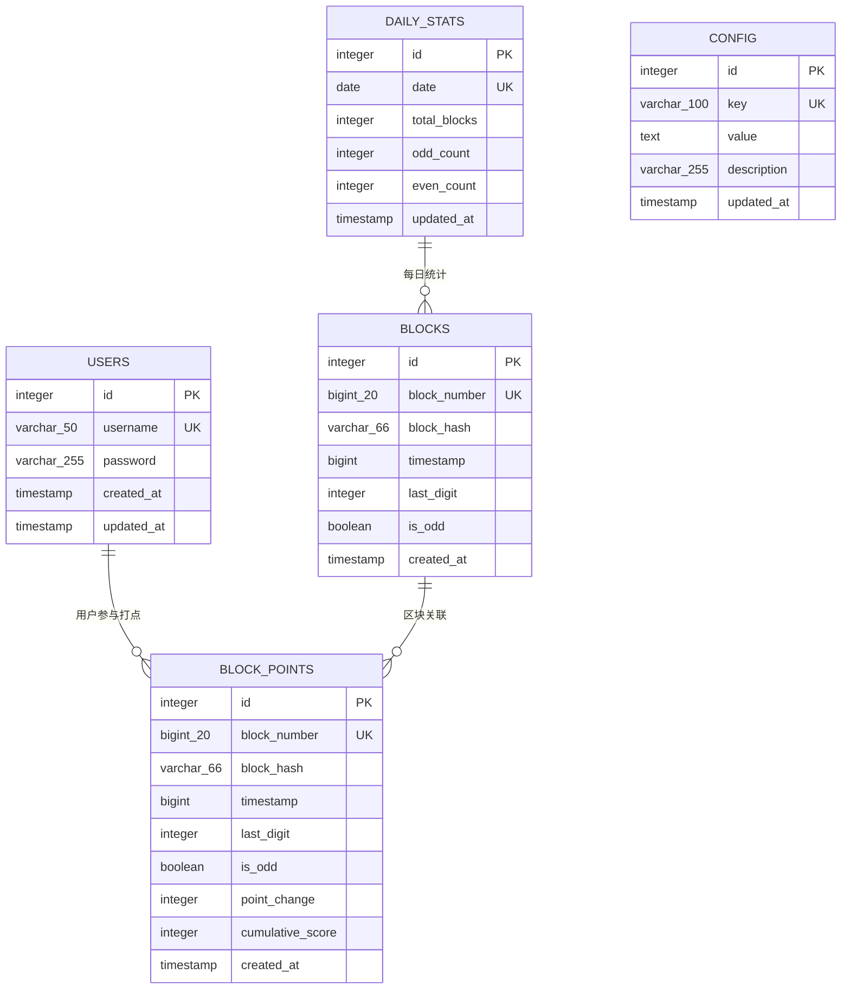
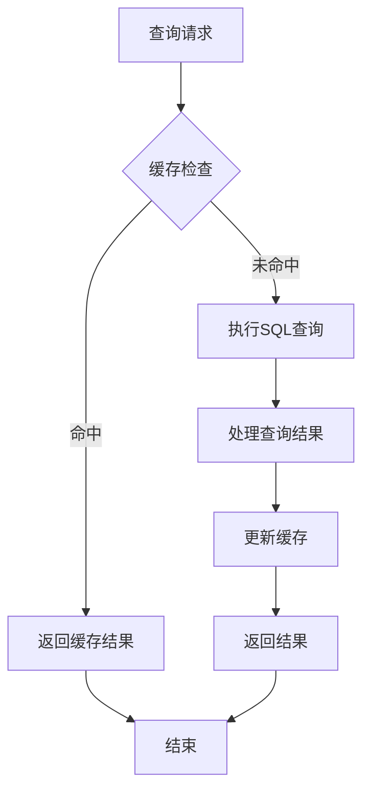

# 数据库配置

<cite>
**本文档引用的文件**
- [src/config/index.ts](file://src/config/index.ts)
- [src/database/index.ts](file://src/database/index.ts)
- [src/models/UserModel.ts](file://src/models/UserModel.ts)
- [src/models/types.ts](file://src/models/types.ts)
- [src/services/TronRPCService.ts](file://src/services/TronRPCService.ts)
</cite>

## 目录
1. [简介](#简介)
2. [数据库路径配置](#数据库路径配置)
3. [SQLite数据库初始化](#sqlite数据库初始化)
4. [数据模型与表结构](#数据模型与表结构)
5. [数据库连接管理](#数据库连接管理)
6. [环境变量配置](#环境变量配置)
7. [目录权限要求](#目录权限要求)
8. [常见错误与解决方案](#常见错误与解决方案)
9. [性能优化建议](#性能优化建议)
10. [故障排除指南](#故障排除指南)

## 简介

Point-Tron系统采用SQLite作为主要数据库引擎，通过配置化的路径管理实现数据持久化。数据库配置的核心是`DB_PATH`环境变量，它决定了SQLite数据库文件的存储位置和访问权限。本文档详细介绍了数据库配置的各项功能、最佳实践以及故障排除方法。

## 数据库路径配置

### 默认配置机制

系统提供了灵活的数据库路径配置机制，支持通过环境变量进行自定义设置：

```typescript
// 默认数据库路径配置
database: {
  path: process.env.DB_PATH || './data/point-tron.db',
}
```

### 路径解析流程



**图表来源**
- [src/config/index.ts](file://src/config/index.ts#L20-L22)
- [src/database/index.ts](file://src/database/index.ts#L12-L18)

### 路径类型支持

系统支持多种路径格式：
- **相对路径**：如`./data/point-tron.db`，相对于应用根目录
- **绝对路径**：如`/var/lib/point-tron/data.db`，指定完整路径
- **跨平台兼容**：自动处理不同操作系统的路径分隔符

**章节来源**
- [src/config/index.ts](file://src/config/index.ts#L20-L22)
- [src/database/index.ts](file://src/database/index.ts#L12-L18)

## SQLite数据库初始化

### 自动目录创建

数据库模块在初始化时会自动检查并创建必要的目录结构：

```typescript
// 确保数据目录存在
const dbDir = path.dirname(config.database.path);
if (!fs.existsSync(dbDir)) {
  fs.mkdirSync(dbDir, { recursive: true });
}
```

### 数据库连接生命周期



**图表来源**
- [src/database/index.ts](file://src/database/index.ts#L12-L18)
- [src/database/index.ts](file://src/database/index.ts#L25-L35)

### 表结构初始化

系统启动时会自动初始化以下核心表结构：

1. **用户表 (users)**：存储认证用户信息
2. **区块表 (blocks)**：记录TRON区块链区块数据
3. **每日统计表 (daily_stats)**：维护每日统计数据
4. **系统配置表 (config)**：存储系统配置参数
5. **打点计分表 (block_points)**：记录区块打点计分数据

**章节来源**
- [src/database/index.ts](file://src/database/index.ts#L50-L120)

## 数据模型与表结构

### 核心数据模型

系统定义了清晰的数据模型接口，确保类型安全和数据一致性：

```typescript
// 区块信息接口
export interface BlockInfo {
  id?: number;
  block_number: number;
  block_hash: string;
  timestamp: number;
  last_digit: number;
  is_odd: boolean;
  created_at?: string;
}

// 用户信息接口
export interface User {
  id?: number;
  username: string;
  password: string;
  created_at?: string;
  updated_at?: string;
}
```

### 数据库表设计



**图表来源**
- [src/models/types.ts](file://src/models/types.ts#L1-L25)
- [src/database/index.ts](file://src/database/index.ts#L50-L100)

### 索引优化策略

系统为关键查询字段建立了复合索引，提升查询性能：

- `idx_blocks_number`：区块号索引
- `idx_blocks_timestamp`：时间戳索引  
- `idx_daily_stats_date`：日期索引
- `idx_block_points_number`：打点区块号索引
- `idx_block_points_timestamp`：打点时间戳索引

**章节来源**
- [src/database/index.ts](file://src/database/index.ts#L100-L110)

## 数据库连接管理

### 连接池与事务管理

数据库模块提供了完整的连接管理和事务支持：

```typescript
// 执行事务
public async transaction(operations: (() => Promise<any>)[]): Promise<void> {
  await this.run('BEGIN TRANSACTION');
  try {
    for (const operation of operations) {
      await operation();
    }
    await this.run('COMMIT');
  } catch (error) {
    await this.run('ROLLBACK');
    throw error;
  }
}
```

### 查询优化机制



**图表来源**
- [src/database/index.ts](file://src/database/index.ts#L40-L80)

### 连接状态监控

系统提供了详细的连接状态监控功能：

- 连接建立时间跟踪
- 查询执行时间统计
- 错误率监控
- 连续错误计数

**章节来源**
- [src/database/index.ts](file://src/database/index.ts#L40-L80)

## 环境变量配置

### DB_PATH环境变量详解

`DB_PATH`环境变量是控制数据库文件位置的核心配置项：

```bash
# Linux/macOS 示例
export DB_PATH=/var/lib/point-tron/data.db

# Windows 示例  
set DB_PATH=C:\ProgramData\Point-Tron\data.db

# 相对路径示例
export DB_PATH=./storage/database.db
```

### 配置优先级

环境变量配置遵循以下优先级顺序：

1. **环境变量**：最高优先级，覆盖默认值
2. **配置文件**：如果支持配置文件，次之
3. **默认值**：最低优先级，`./data/point-tron.db`

### 跨平台路径兼容性

系统自动处理不同操作系统的路径差异：

```typescript
// 路径处理示例
const dbDir = path.dirname(config.database.path);
const fullPath = path.resolve(dbDir); // 自动转换为系统路径格式
```

**章节来源**
- [src/config/index.ts](file://src/config/index.ts#L20-L22)

## 目录权限要求

### 权限级别说明

数据库文件需要适当的目录权限才能正常工作：

| 权限类型 | 必需权限 | 说明 |
|---------|---------|------|
| 读取权限 | r | 读取数据库文件元数据 |
| 写入权限 | w | 创建和修改数据库文件 |
| 执行权限 | x | 访问目录内容 |

### 推荐权限设置

```bash
# Linux/macOS 权限设置
chmod 755 ./data/                    # 目录权限
chmod 644 ./data/point-tron.db       # 文件权限

# Windows 权限设置
icacls ./data /grant Users:F         # 完全控制权限
```

### 权限验证机制

系统会在启动时自动验证目录权限：

```typescript
// 权限检查伪代码
try {
  fs.accessSync(dbDir, fs.constants.W_OK);
  console.log('目录具有写入权限');
} catch (error) {
  console.error('目录权限不足:', error.message);
}
```

## 常见错误与解决方案

### 目录权限错误

**错误现象**：
```
Error: EACCES: permission denied, open './data/point-tron.db'
```

**解决方案**：
1. 检查目录权限：`ls -la ./data/`
2. 修改权限：`chmod 755 ./data/`
3. 确保进程有足够权限

### 路径不存在错误

**错误现象**：
```
Error: ENOENT: no such file or directory, open '/var/lib/point-tron/data.db'
```

**解决方案**：
1. 手动创建目录：`mkdir -p /var/lib/point-tron/`
2. 或者让系统自动创建（推荐）

### 文件锁定错误

**错误现象**：
```
Error: SQLITE_BUSY: database is locked
```

**解决方案**：
1. 检查是否有其他进程占用数据库
2. 等待当前事务完成
3. 重启应用程序

### 内存不足错误

**错误现象**：
```
Error: SQLITE_FULL: database or disk is full
```

**解决方案**：
1. 清理磁盘空间
2. 限制数据库大小
3. 实施数据归档策略

## 性能优化建议

### 数据库性能调优

1. **索引优化**：
   - 为频繁查询的字段添加索引
   - 避免过度索引影响写入性能
   - 定期分析查询计划

2. **连接池管理**：
   - 控制并发连接数
   - 实施连接超时机制
   - 使用连接复用

3. **查询优化**：
   - 使用参数化查询防止SQL注入
   - 避免SELECT *查询
   - 实施查询结果缓存

### 存储优化策略


### 监控指标

建议监控以下关键指标：
- 数据库连接数
- 查询响应时间
- 磁盘使用率
- 错误率统计
- 缓存命中率

## 故障排除指南

### 启动问题诊断

1. **检查环境变量**：
   ```bash
   echo $DB_PATH
   ```

2. **验证目录权限**：
   ```bash
   ls -la $(dirname $DB_PATH)
   ```

3. **测试文件访问**：
   ```bash
   touch $DB_PATH.test
   rm $DB_PATH.test
   ```

### 运行时问题排查

1. **查看日志输出**：
   - 数据库连接日志
   - 查询执行日志
   - 错误堆栈信息

2. **性能分析**：
   - 使用EXPLAIN查询计划
   - 监控慢查询
   - 分析索引使用情况

3. **数据完整性检查**：
   - 验证表结构完整性
   - 检查外键约束
   - 确认数据一致性

### 备份与恢复

```bash
# 数据库备份
sqlite3 ./data/point-tron.db ".backup backup.db"

# 数据库恢复
sqlite3 new_database.db ".restore backup.db"
```

### 最佳实践总结

1. **生产环境配置**：
   - 使用绝对路径
   - 设置适当的权限
   - 实施监控告警
   - 定期备份数据

2. **开发环境配置**：
   - 使用相对路径便于部署
   - 开启详细日志
   - 实施数据隔离

3. **测试环境配置**：
   - 使用内存数据库
   - 快速初始化
   - 自动清理数据

通过遵循这些配置指南和最佳实践，您可以确保Point-Tron系统的数据库配置稳定可靠，为用户提供持续的数据服务。