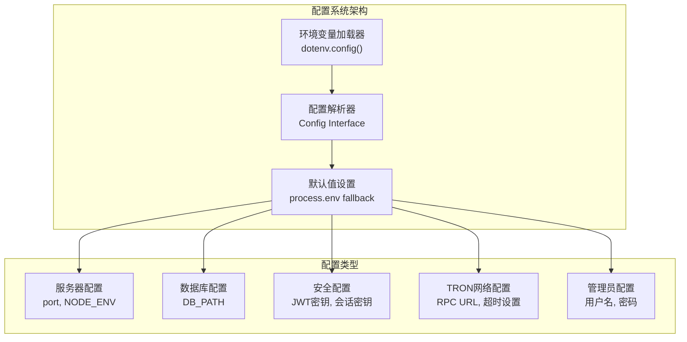
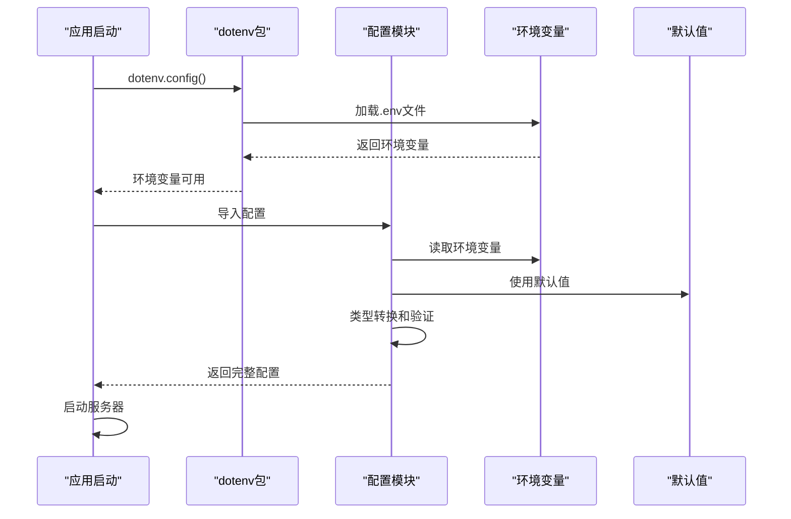
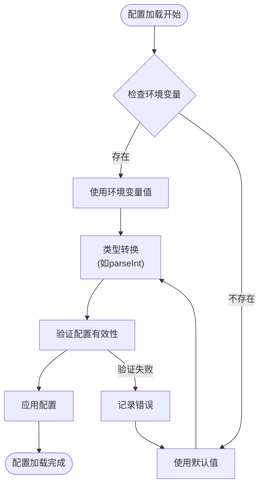

# 服务器配置文档

<cite>
**本文档引用的文件**
- [package.json](file://package.json)
- [src/index.ts](file://src/index.ts)
- [src/config/index.ts](file://src/config/index.ts)
- [src/database/index.ts](file://src/database/index.ts)
- [src/routes/config.ts](file://src/routes/config.ts)
- [src/middleware/auth.ts](file://src/middleware/auth.ts)
- [README.md](file://README.md)
</cite>

## 目录
1. [项目概述](#项目概述)
2. [核心配置项](#核心配置项)
3. [环境变量配置](#环境变量配置)
4. [配置加载机制](#配置加载机制)
5. [开发与生产环境配置](#开发与生产环境配置)
6. [配置优先级机制](#配置优先级机制)
7. [常见问题与解决方案](#常见问题与解决方案)
8. [最佳实践建议](#最佳实践建议)
9. [故障排除指南](#故障排除指南)

## 项目概述

Point-Tron是一个基于TypeScript和Node.js开发的波场网络区块链数据统计后台管理系统。该系统通过配置化的方式管理服务器的各项参数，包括端口设置、运行环境、数据库路径、TRON网络配置等关键参数。



**图表来源**
- [src/config/index.ts](file://src/config/index.ts#L1-L52)

## 核心配置项

### 服务器基础配置

系统的核心配置通过TypeScript接口定义，提供了强类型的配置管理：

```typescript
interface Config {
  port: number;
  nodeEnv: string;
  database: {
    path: string;
  };
  jwt: {
    secret: string;
    expiresIn: string;
  };
  tron: {
    rpcUrl: string;
    timeout: number;
    retryTimes: number;
    pollingInterval: number;
  };
  admin: {
    username: string;
    password: string;
  };
  sessionSecret: string;
}
```

### 主要配置字段详解

| 配置字段 | 类型 | 默认值 | 描述 |
|---------|------|--------|------|
| `port` | number | 3000 | 服务器监听端口号 |
| `nodeEnv` | string | development | 运行环境（development/production/test） |
| `database.path` | string | ./data/point-tron.db | SQLite数据库文件路径 |
| `jwt.secret` | string | your-super-secret-jwt-key-change-in-production | JWT签名密钥 |
| `jwt.expiresIn` | string | 7d | JWT令牌有效期 |
| `tron.rpcUrl` | string | https://api.trongrid.io | TRON RPC节点地址 |
| `tron.timeout` | number | 5000 | RPC请求超时时间（毫秒） |
| `tron.retryTimes` | number | 3 | RPC请求重试次数 |
| `tron.pollingInterval` | number | 3000 | 区块轮询间隔（毫秒） |
| `admin.username` | string | admin | 默认管理员用户名 |
| `admin.password` | string | admin123 | 默认管理员密码 |
| `sessionSecret` | string | your-session-secret-change-in-production | 会话加密密钥 |

**章节来源**
- [src/config/index.ts](file://src/config/index.ts#L6-L22)

## 环境变量配置

### 环境变量加载机制

系统使用dotenv包来加载环境变量，配置文件位于项目根目录：

```typescript
import dotenv from 'dotenv';

// 加载环境变量
dotenv.config();
```

### 环境变量文件格式

创建`.env`文件并根据需要修改配置：

```bash
# 服务器配置
PORT=3000
NODE_ENV=development

# 数据库配置
DB_PATH=./data/point-tron.db

# JWT 配置
JWT_SECRET=your-super-secret-jwt-key-change-in-production
JWT_EXPIRES_IN=7d

# TRON 网络配置
TRON_RPC_URL=https://api.trongrid.io
TRON_TIMEOUT=5000
TRON_RETRY_TIMES=3
TRON_POLLING_INTERVAL=3000

# 默认管理员账户
DEFAULT_ADMIN_USERNAME=admin
DEFAULT_ADMIN_PASSWORD=admin123

# 会话配置
SESSION_SECRET=your-session-secret-change-in-production
```

### 环境变量类型转换

系统对不同类型环境变量进行适当的类型转换：

```typescript
// 数字类型转换
port: parseInt(process.env.PORT || '3000', 10),
timeout: parseInt(process.env.TRON_TIMEOUT || '5000', 10),
retryTimes: parseInt(process.env.TRON_RETRY_TIMES || '3', 10),
pollingInterval: parseInt(process.env.TRON_POLLING_INTERVAL || '3000', 10),

// 字符串类型保持原样
nodeEnv: process.env.NODE_ENV || 'development',
```

**章节来源**
- [src/config/index.ts](file://src/config/index.ts#L1-L52)

## 配置加载机制

### 配置初始化流程



**图表来源**
- [src/config/index.ts](file://src/config/index.ts#L1-L52)
- [src/index.ts](file://src/index.ts#L1-L163)

### 配置解析逻辑

配置模块采用优雅降级策略，优先使用环境变量，回退到默认值：

```typescript
const config: Config = {
  port: parseInt(process.env.PORT || '3000', 10),
  nodeEnv: process.env.NODE_ENV || 'development',
  database: {
    path: process.env.DB_PATH || './data/point-tron.db',
  },
  jwt: {
    secret: process.env.JWT_SECRET || 'your-super-secret-jwt-key-change-in-production',
    expiresIn: process.env.JWT_EXPIRES_IN || '7d',
  },
  tron: {
    rpcUrl: process.env.TRON_RPC_URL || 'https://api.trongrid.io',
    timeout: parseInt(process.env.TRON_TIMEOUT || '5000', 10),
    retryTimes: parseInt(process.env.TRON_RETRY_TIMES || '3', 10),
    pollingInterval: parseInt(process.env.TRON_POLLING_INTERVAL || '3000', 10),
  },
  admin: {
    username: process.env.DEFAULT_ADMIN_USERNAME || 'admin',
    password: process.env.DEFAULT_ADMIN_PASSWORD || 'admin123',
  },
  sessionSecret: process.env.SESSION_SECRET || 'your-session-secret-change-in-production',
};
```

**章节来源**
- [src/config/index.ts](file://src/config/index.ts#L23-L52)

## 开发与生产环境配置

### 开发环境配置

开发环境推荐配置：

```bash
# 开发环境配置
PORT=3000
NODE_ENV=development

# 开发专用配置
DEBUG=true
LOG_LEVEL=debug

# 数据库配置（开发环境）
DB_PATH=./data/point-tron-dev.db

# JWT配置（开发环境）
JWT_SECRET=development-jwt-secret
JWT_EXPIRES_IN=1h

# TRON网络配置（开发环境）
TRON_RPC_URL=https://api.shasta.trongrid.io
TRON_TIMEOUT=10000
TRON_POLLING_INTERVAL=5000
```

### 生产环境配置

生产环境推荐配置：

```bash
# 生产环境配置
PORT=8080
NODE_ENV=production

# 数据库配置
DB_PATH=/var/lib/point-tron/data.db

# JWT配置（生产环境必须更改）
JWT_SECRET=your-production-jwt-secret-should-be-very-long-and-random
JWT_EXPIRES_IN=24h

# TRON网络配置（生产环境）
TRON_RPC_URL=https://api.trongrid.io
TRON_TIMEOUT=30000
TRON_RETRY_TIMES=5
TRON_POLLING_INTERVAL=3000

# 管理员配置（生产环境必须更改）
DEFAULT_ADMIN_USERNAME=your-admin-username
DEFAULT_ADMIN_PASSWORD=your-complex-admin-password

# 会话配置（生产环境必须更改）
SESSION_SECRET=your-production-session-secret
```

### 环境差异对比

| 配置项 | 开发环境 | 生产环境 | 说明 |
|--------|----------|----------|------|
| `PORT` | 3000 | 8080 | 开发使用低权限端口，生产使用标准端口 |
| `NODE_ENV` | development | production | 环境标识，影响日志级别和错误处理 |
| `JWT_SECRET` | development-jwt-secret | 长随机字符串 | 生产环境必须足够复杂 |
| `JWT_EXPIRES_IN` | 1h | 24h | 开发环境短有效期便于调试 |
| `TRON_TIMEOUT` | 10000ms | 30000ms | 生产环境更长的超时时间 |
| `TRON_POLLING_INTERVAL` | 5000ms | 3000ms | 开发环境减少轮询频率 |
| `DEFAULT_ADMIN_PASSWORD` | admin123 | 复杂密码 | 生产环境必须安全 |

**章节来源**
- [README.md](file://README.md#L50-L80)

## 配置优先级机制

### 配置优先级顺序

系统采用环境变量优先于默认值的配置加载策略：



**图表来源**
- [src/config/index.ts](file://src/config/index.ts#L23-L52)

### 优先级示例

```typescript
// 优先级示例：PORT配置
const port = parseInt(process.env.PORT || '3000', 10);
// 1. 检查环境变量 PORT 是否存在
// 2. 如果存在，使用环境变量值并转换为数字
// 3. 如果不存在，使用默认值 '3000' 并转换为数字

// 优先级示例：NODE_ENV配置
const nodeEnv = process.env.NODE_ENV || 'development';
// 1. 检查环境变量 NODE_ENV 是否存在
// 2. 如果存在，使用环境变量值
// 3. 如果不存在，使用默认值 'development'

// 优先级示例：TRON RPC URL配置
const rpcUrl = process.env.TRON_RPC_URL || 'https://api.trongrid.io';
// 1. 检查环境变量 TRON_RPC_URL 是否存在
// 2. 如果存在，使用环境变量值
// 3. 如果不存在，使用默认值 'https://api.trongrid.io'
```

### 配置覆盖机制

系统允许在不同环境下动态覆盖配置：

```typescript
// 运行时配置修改示例
router.post('/rpc', authenticateToken, async (req, res) => {
  try {
    const { rpcUrl, timeout, retryTimes, pollingInterval } = req.body;
    
    // 简单验证
    if (rpcUrl && !rpcUrl.startsWith('http')) {
      return res.status(400).json({
        success: false,
        error: 'RPC URL 必须以 http 或 https 开头'
      });
    }
    
    // 更新配置（这里只是示例，实际实现需要持久化存储）
    res.json({
      success: true,
      data: {
        message: 'RPC配置更新成功',
        needRestart: true
      }
    });
  } catch (error) {
    console.error('更新RPC配置失败:', error);
    res.status(500).json({
      success: false,
      error: '服务器内部错误'
    });
  }
});
```

**章节来源**
- [src/config/index.ts](file://src/config/index.ts#L23-L52)
- [src/routes/config.ts](file://src/routes/config.ts#L15-L79)

## 常见问题与解决方案

### 端口占用问题

**问题描述**：当指定的端口被其他进程占用时，服务器无法启动。

**解决方案**：

1. **检查端口占用情况**：
```bash
# Linux/macOS
lsof -ti:3000

# Windows
netstat -ano | findstr :3000
```

2. **修改端口配置**：
```bash
# 方法1：修改环境变量
echo "PORT=3001" >> .env

# 方法2：直接运行时指定
PORT=3001 npm run dev
```

3. **强制终止占用进程**（谨慎使用）：
```bash
# Linux/macOS
kill $(lsof -ti:3000)

# Windows
taskkill /PID <pid> /F
```

### 数据库连接问题

**问题描述**：数据库文件路径错误或权限不足导致连接失败。

**解决方案**：

1. **检查数据库目录权限**：
```bash
# 确保数据目录存在
mkdir -p ./data

# 设置正确的权限
chmod 755 ./data
chmod 644 ./data/point-tron.db
```

2. **验证数据库路径配置**：
```bash
# 检查.env文件中的DB_PATH配置
cat .env | grep DB_PATH
```

3. **手动测试数据库连接**：
```javascript
// 在项目根目录执行
node -e "
const sqlite3 = require('sqlite3').verbose();
const db = new sqlite3.Database('./data/point-tron.db', (err) => {
  if (err) console.error('数据库连接失败:', err);
  else console.log('数据库连接成功');
});
"
```

### TRON网络连接问题

**问题描述**：RPC节点不可达或请求超时。

**解决方案**：

1. **更换RPC节点**：
```bash
# 修改.env文件
TRON_RPC_URL=https://api.shasta.trongrid.io
```

2. **调整超时和重试设置**：
```bash
# 增加超时时间
TRON_TIMEOUT=10000

# 增加重试次数
TRON_RETRY_TIMES=5
```

3. **检查网络连接**：
```bash
# 测试RPC节点连通性
curl -I https://api.trongrid.io

# 测试特定RPC端点
curl -X POST https://api.trongrid.io/wallet/getnowblock \
  -H "Content-Type: application/json" \
  -d '{}'
```

### JWT配置问题

**问题描述**：JWT令牌验证失败或密钥不匹配。

**解决方案**：

1. **生成新的JWT密钥**：
```bash
# 生成随机密钥（Linux/macOS）
openssl rand -hex 32

# 生成随机密钥（Windows PowerShell）
[Convert]::ToBase64String((New-Object Byte[] 32 | % { [Random]::new().Next(0, 255) }))
```

2. **更新JWT配置**：
```bash
# 更新.env文件
JWT_SECRET=your-new-generated-jwt-secret
```

**章节来源**
- [README.md](file://README.md#L250-L280)
- [src/database/index.ts](file://src/database/index.ts#L10-L20)

## 最佳实践建议

### 生产环境部署最佳实践

1. **环境变量安全管理**
```bash
# 使用环境变量文件
echo "PORT=8080" >> .env.production
echo "NODE_ENV=production" >> .env.production
echo "JWT_SECRET=$(openssl rand -hex 32)" >> .env.production
echo "SESSION_SECRET=$(openssl rand -hex 32)" >> .env.production
```

2. **数据库配置优化**
```bash
# 使用绝对路径
DB_PATH=/var/lib/point-tron/data.db

# 设置适当的权限
sudo chown www-data:www-data /var/lib/point-tron
sudo chmod 750 /var/lib/point-tron
```

3. **TRON网络配置优化**
```bash
# 生产环境配置
TRON_RPC_URL=https://api.trongrid.io
TRON_TIMEOUT=30000
TRON_RETRY_TIMES=5
TRON_POLLING_INTERVAL=3000
```

### 性能优化配置

1. **内存和CPU优化**
```bash
# Node.js性能参数
NODE_OPTIONS="--max-old-space-size=2048 --optimize-for-size"
```

2. **并发连接配置**
```bash
# Express应用配置
NODE_ENV=production PORT=8080
```

3. **静态资源优化**
```bash
# 配置静态文件缓存
CACHE_CONTROL_MAX_AGE=86400
```

### 安全配置建议

1. **HTTPS配置**
```bash
# HTTPS端口配置
PORT=443
NODE_ENV=production
```

2. **CORS配置**
```bash
# 生产环境CORS配置
ALLOWED_ORIGINS=https://yourdomain.com,https://www.yourdomain.com
```

3. **速率限制配置**
```bash
# 生产环境速率限制
RATE_LIMIT_MAX_REQUESTS=100
RATE_LIMIT_WINDOW_MS=60000
```

**章节来源**
- [README.md](file://README.md#L50-L80)
- [src/middleware/auth.ts](file://src/middleware/auth.ts#L120-L170)

## 故障排除指南

### 启动失败诊断

**问题症状**：应用启动时出现错误

**诊断步骤**：

1. **检查环境变量加载**
```bash
# 验证环境变量是否正确加载
node -e "console.log(process.env.PORT)"
node -e "console.log(process.env.NODE_ENV)"
```

2. **检查配置解析**
```bash
# 验证配置模块是否正常工作
node -e "
const config = require('./dist/config/index.js');
console.log('Port:', config.port);
console.log('Node Env:', config.nodeEnv);
console.log('Database Path:', config.database.path);
"
```

3. **检查依赖安装**
```bash
# 验证依赖完整性
npm audit
npm outdated
```

### 运行时问题诊断

**问题症状**：应用运行正常但功能异常

**诊断工具**：

1. **健康检查端点**
```bash
# 访问健康检查API
curl http://localhost:3000/health
```

2. **日志分析**
```bash
# 查看应用日志
tail -f logs/app.log

# 查看错误日志
tail -f logs/error.log
```

3. **配置验证**
```bash
# 验证TRON配置
curl -X GET http://localhost:3000/api/config/rpc \
  -H "Authorization: Bearer your-jwt-token"
```

### 性能问题诊断

**问题症状**：应用响应缓慢或内存泄漏

**诊断方法**：

1. **监控系统资源**
```bash
# 监控CPU和内存使用
top -p $(pgrep -f "node")

# 监控网络连接
netstat -an | grep :3000
```

2. **性能分析**
```bash
# 启用性能分析
NODE_ENV=production node --inspect dist/index.js

# 使用Chrome DevTools分析性能
```

3. **数据库性能优化**
```bash
# 检查数据库连接状态
node -e "
const { database } = require('./dist/database');
console.log('Database connected:', database.isConnectedToDb());
"
```

### 配置验证脚本

创建配置验证脚本：

```javascript
#!/usr/bin/env node

const config = require('../dist/config');
const fs = require('fs');
const path = require('path');

console.log('=== 配置验证报告 ===\n');

// 验证端口配置
console.log(`端口配置: ${config.port}`);
try {
  const net = require('net');
  const server = net.createServer();
  server.listen(config.port, () => {
    server.close(() => {
      console.log('✓ 端口可用');
    });
  });
} catch (error) {
  console.log('✗ 端口被占用或不可用');
}

// 验证数据库配置
console.log(`数据库路径: ${config.database.path}`);
try {
  const dbDir = path.dirname(config.database.path);
  if (!fs.existsSync(dbDir)) {
    fs.mkdirSync(dbDir, { recursive: true });
    console.log('✓ 数据库目录已创建');
  }
  console.log('✓ 数据库路径有效');
} catch (error) {
  console.log('✗ 数据库路径无效:', error.message);
}

// 验证JWT配置
console.log(`JWT密钥长度: ${config.jwt.secret.length}`);
if (config.jwt.secret.length < 32) {
  console.log('⚠️ JWT密钥长度不足，建议至少32字符');
} else {
  console.log('✓ JWT密钥配置良好');
}

console.log('\n=== 配置验证完成 ===');
```

**章节来源**
- [src/index.ts](file://src/index.ts#L80-L100)
- [src/database/index.ts](file://src/database/index.ts#L240-L249)