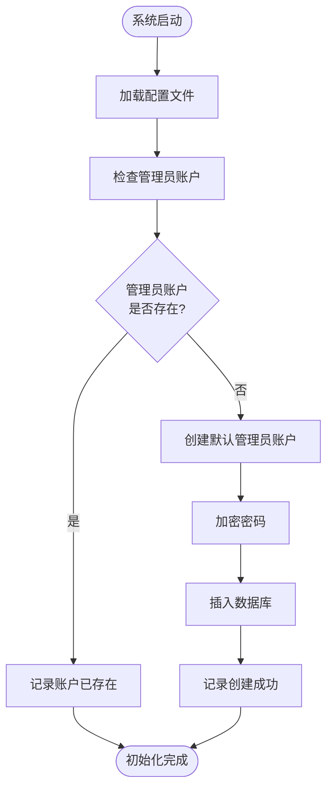
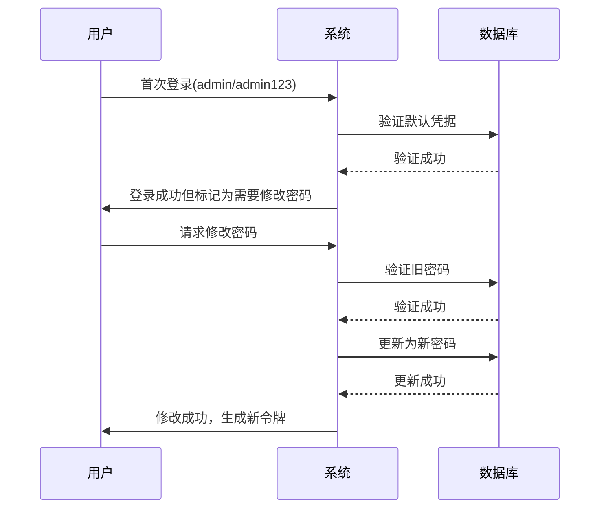

# 管理员账户配置

<cite>
**本文档引用的文件**
- [src/config/index.ts](file://src/config/index.ts)
- [src/index.ts](file://src/index.ts)
- [src/models/UserModel.ts](file://src/models/UserModel.ts)
- [src/services/AuthService.ts](file://src/services/AuthService.ts)
- [src/routes/auth.ts](file://src/routes/auth.ts)
- [src/middleware/auth.ts](file://src/middleware/auth.ts)
</cite>

## 目录
1. [简介](#简介)
2. [环境变量配置](#环境变量配置)
3. [管理员账户初始化流程](#管理员账户初始化流程)
4. [账户安全加固建议](#账户安全加固建议)
5. [故障排除指南](#故障排除指南)
6. [总结](#总结)

## 简介

Point-Tron系统提供了灵活的管理员账户配置机制，通过环境变量控制默认管理员账户的用户名和密码。系统在启动时会自动检测并创建默认管理员账户，确保系统能够正常运行。本文档详细介绍了如何配置和管理管理员账户，以及在生产环境中如何加强账户安全性。

## 环境变量配置

### 默认管理员账户配置

系统通过以下环境变量来配置默认管理员账户：

```typescript
// 在 src/config/index.ts 中定义
admin: {
  username: process.env.DEFAULT_ADMIN_USERNAME || 'admin',
  password: process.env.DEFAULT_ADMIN_PASSWORD || 'admin123',
}
```

### 可用的环境变量

| 环境变量名称 | 默认值 | 描述 |
|-------------|--------|------|
| `DEFAULT_ADMIN_USERNAME` | `admin` | 默认管理员用户名 |
| `DEFAULT_ADMIN_PASSWORD` | `admin123` | 默认管理员密码 |

### 配置示例

#### 开发环境配置 (.env 文件)
```bash
# 管理员账户配置
DEFAULT_ADMIN_USERNAME=admin
DEFAULT_ADMIN_PASSWORD=secureAdminPassword123!
```

#### 生产环境配置 (Docker Compose)
```yaml
environment:
  - DEFAULT_ADMIN_USERNAME=production-admin
  - DEFAULT_ADMIN_PASSWORD=${ADMIN_PASSWORD}
```

#### Kubernetes 配置
```yaml
env:
  - name: DEFAULT_ADMIN_USERNAME
    value: "k8s-admin"
  - name: DEFAULT_ADMIN_PASSWORD
    valueFrom:
      secretKeyRef:
        name: admin-secret
        key: password
```

**章节来源**
- [src/config/index.ts](file://src/config/index.ts#L35-L40)

## 管理员账户初始化流程

### 系统启动时的初始化过程

系统在启动时会执行以下步骤来初始化管理员账户：



**图表来源**
- [src/index.ts](file://src/index.ts#L119-L130)

### 初始化代码分析

```typescript
private async createDefaultAdmin(): Promise<void> {
  try {
    const existingAdmin = await UserModel.findByUsername(config.admin.username);
    if (!existingAdmin) {
      await UserModel.create({
        username: config.admin.username,
        password: config.admin.password
      });
      console.log(`✅ 默认管理员账户已创建: ${config.admin.username}`);
    } else {
      console.log(`ℹ️  管理员账户已存在: ${config.admin.username}`);
    }
  } catch (error) {
    console.error('创建默认管理员失败:', error);
  }
}
```

### 账户创建逻辑

1. **检查现有账户**: 使用 `UserModel.findByUsername()` 方法检查管理员账户是否已存在
2. **条件创建**: 如果账户不存在，则调用 `UserModel.create()` 创建新账户
3. **密码加密**: 使用 bcrypt 对密码进行哈希处理，确保安全性
4. **日志记录**: 记录创建状态，便于监控和调试

**章节来源**
- [src/index.ts](file://src/index.ts#L119-L130)
- [src/models/UserModel.ts](file://src/models/UserModel.ts#L6-L15)

## 账户安全加固建议

### 强密码策略

#### 推荐的密码要求

1. **长度要求**: 至少12个字符
2. **复杂度要求**: 包含大写字母、小写字母、数字和特殊字符
3. **避免常见模式**: 不要使用连续数字、重复字符或常见单词
4. **定期更换**: 建议每90天更换一次密码

#### 示例强密码
```
Secure@Passw0rd!2024
Tr0nAdm1n$ecur3#
P@ssw0rd!Tr0n2024
```

### 首次登录后修改密码机制

#### 实现方案



**图表来源**
- [src/routes/auth.ts](file://src/routes/auth.ts#L10-L35)
- [src/models/UserModel.ts](file://src/models/UserModel.ts#L52-L65)

### 安全配置建议

#### 1. 环境变量安全

```bash
# 使用环境变量文件
echo "DEFAULT_ADMIN_PASSWORD=$(openssl rand -base64 32)" >> .env

# 设置适当的文件权限
chmod 600 .env
chown app-user:app-group .env
```

#### 2. 网络安全配置

```typescript
// 在生产环境中启用HTTPS
export const securityHeaders = (req: Request, res: Response, next: NextFunction): void => {
  res.setHeader('Strict-Transport-Security', 'max-age=31536000; includeSubDomains');
  res.setHeader('X-Content-Type-Options', 'nosniff');
  res.setHeader('X-Frame-Options', 'DENY');
  res.setHeader('X-XSS-Protection', '1; mode=block');
  next();
};
```

#### 3. 访问控制

```typescript
// JWT令牌验证中间件
export const authenticateToken = async (
  req: Request,
  res: Response<ApiResponse>,
  next: NextFunction
): Promise<void> => {
  const authHeader = req.headers.authorization;
  const token = AuthService.extractTokenFromHeader(authHeader);
  
  if (!token) {
    res.status(401).json({ success: false, error: '访问令牌缺失' });
    return;
  }
  
  const decoded = AuthService.verifyToken(token);
  if (!decoded) {
    res.status(401).json({ success: false, error: '无效的访问令牌' });
    return;
  }
  
  // 验证用户是否仍然存在
  const user = await UserModel.findById(decoded.userId);
  if (!user) {
    res.status(401).json({ success: false, error: '用户不存在' });
    return;
  }
  
  req.user = { id: user.id!, username: user.username };
  next();
};
```

**章节来源**
- [src/middleware/auth.ts](file://src/middleware/auth.ts#L18-L55)
- [src/services/AuthService.ts](file://src/services/AuthService.ts#L10-L35)

## 故障排除指南

### 常见问题及解决方案

#### 1. 管理员账户无法创建

**症状**: 启动时出现"创建默认管理员失败"错误

**可能原因**:
- 数据库连接问题
- 权限不足
- 环境变量格式错误

**解决方案**:
```bash
# 检查数据库连接
node -e "require('./dist/database').connect().then(() => console.log('数据库连接成功'))"

# 验证环境变量
echo $DEFAULT_ADMIN_USERNAME
echo $DEFAULT_ADMIN_PASSWORD

# 检查文件权限
ls -la .env
```

#### 2. 默认凭据未生效

**症状**: 即使设置了环境变量，系统仍使用默认值

**解决方案**:
```typescript
// 在 src/config/index.ts 中添加调试输出
console.log('Admin config:', {
  username: process.env.DEFAULT_ADMIN_USERNAME,
  password: process.env.DEFAULT_ADMIN_PASSWORD ? '***' : 'not set'
});
```

#### 3. 密码验证失败

**症状**: 使用正确密码但仍无法登录

**解决方案**:
```sql
-- 检查数据库中的密码哈希
SELECT username, password FROM users WHERE username = 'admin';

-- 手动验证密码
node -e "
const bcrypt = require('bcryptjs');
const password = 'your-password';
const hash = '$2a$10$...'; // 从数据库获取
bcrypt.compare(password, hash).then(console.log);
"
```

### 监控和日志

#### 启动日志分析

```bash
# 查看启动日志
tail -f logs/app.log | grep -i "admin\|default\|create"

# 搜索相关错误
grep -i "admin.*error\|failed.*admin" logs/app.log
```

#### 运行时监控

```typescript
// 添加监控指标
const metrics = {
  adminAccountCreated: 0,
  adminLoginAttempts: 0,
  adminPasswordChanges: 0
};

// 在关键位置记录指标
console.log(`✅ 管理员账户创建成功: ${config.admin.username}`);
metrics.adminAccountCreated++;
```

**章节来源**
- [src/index.ts](file://src/index.ts#L125-L130)

## 总结

Point-Tron系统的管理员账户配置机制提供了灵活且安全的账户管理方式。通过环境变量配置，默认管理员账户可以在系统启动时自动创建，确保系统能够正常运行。

### 关键要点

1. **环境变量优先级**: 系统优先使用环境变量配置，如果没有设置则使用默认值
2. **自动初始化**: 系统会在启动时自动检查并创建管理员账户
3. **密码安全**: 使用bcrypt进行密码哈希，确保密码存储安全
4. **安全加固**: 建议在生产环境中立即修改默认凭据，并实施强密码策略

### 最佳实践

- **立即修改默认凭据**: 生产部署后应立即修改默认管理员账户的用户名和密码
- **定期轮换密码**: 建立密码轮换机制，定期更新管理员账户密码
- **监控异常登录**: 实施登录监控，及时发现可疑活动
- **备份恢复计划**: 确保管理员账户信息的安全备份和恢复能力

通过遵循本文档的指导原则和最佳实践，可以确保Point-Tron系统的管理员账户安全可靠地运行。