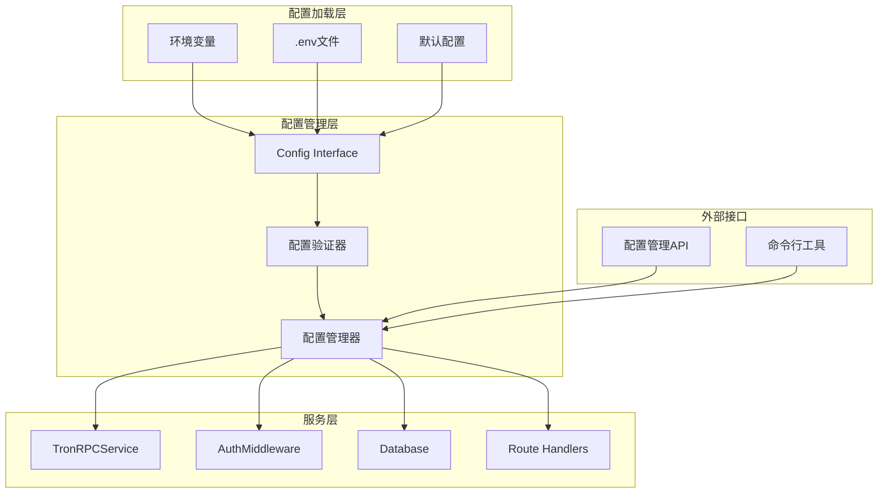
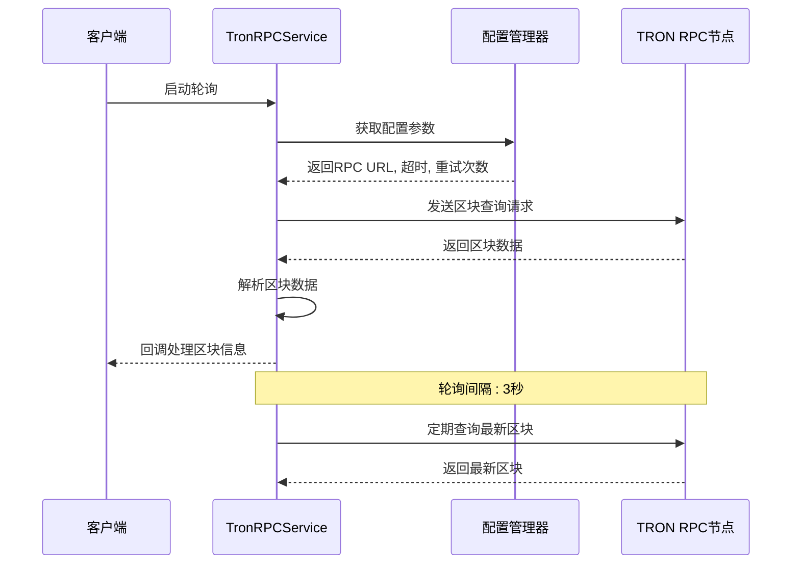
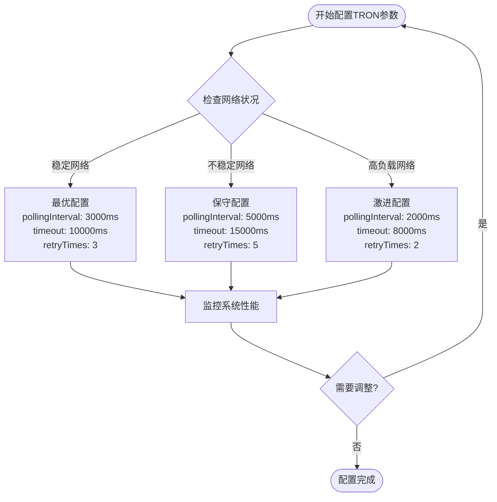
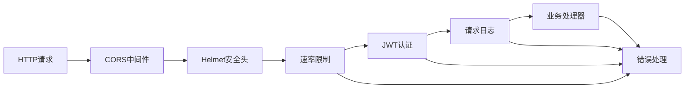
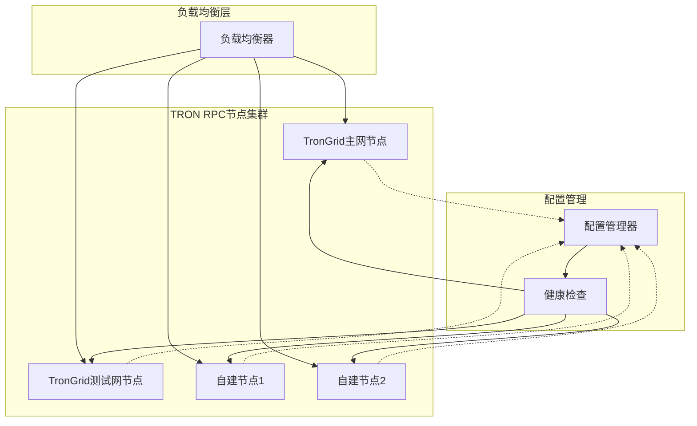
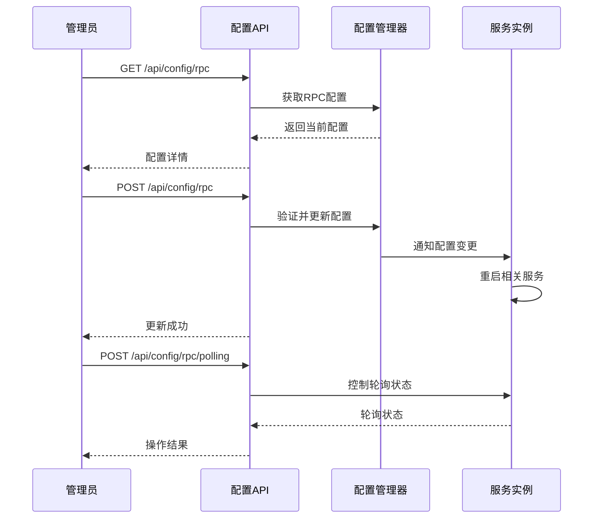
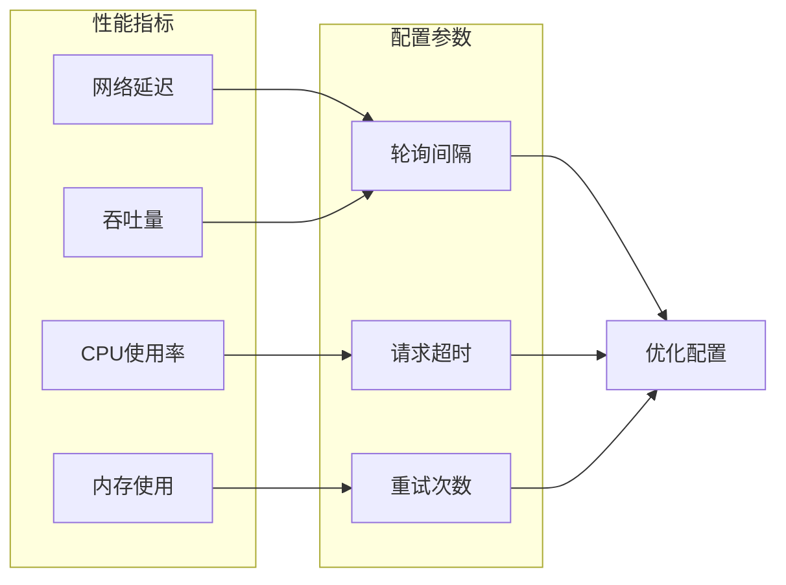

# 配置管理

<cite>
**本文档引用的文件**
- [src/config/index.ts](file://src/config/index.ts)
- [src/services/TronRPCService.ts](file://src/services/TronRPCService.ts)
- [src/middleware/auth.ts](file://src/middleware/auth.ts)
- [src/models/types.ts](file://src/models/types.ts)
- [src/routes/config.ts](file://src/routes/config.ts)
- [src/index.ts](file://src/index.ts)
- [src/database/index.ts](file://src/database/index.ts)
- [package.json](file://package.json)
</cite>

## 目录
1. [简介](#简介)
2. [配置架构概览](#配置架构概览)
3. [核心配置项详解](#核心配置项详解)
4. [环境变量配置](#环境变量配置)
5. [TRON网络配置](#tron网络配置)
6. [安全配置](#安全配置)
7. [生产环境最佳实践](#生产环境最佳实践)
8. [配置管理API](#配置管理api)
9. [故障排除指南](#故障排除指南)
10. [总结](#总结)

## 简介

Point-Tron是一个基于TypeScript构建的TRON波场网络区块链数据统计后台管理系统。该系统采用模块化的配置管理架构，支持通过环境变量进行灵活配置，并提供了完整的配置管理API，允许在运行时动态调整系统参数。

配置管理系统的核心特点：
- 支持环境变量优先的配置加载机制
- 提供完整的TRON网络配置选项
- 内置安全配置和JWT密钥管理
- 支持运行时配置更新
- 生产环境友好的配置验证和错误处理

## 配置架构概览



**图表来源**
- [src/config/index.ts](file://src/config/index.ts#L1-L52)
- [src/services/TronRPCService.ts](file://src/services/TronRPCService.ts#L1-L50)

**章节来源**
- [src/config/index.ts](file://src/config/index.ts#L1-L52)
- [src/index.ts](file://src/index.ts#L1-L50)

## 核心配置项详解

### 基础服务器配置

系统的基础配置包括服务器端口、环境模式和基本服务设置：

```typescript
interface Config {
  port: number;                    // 服务器监听端口
  nodeEnv: string;                 // Node.js环境模式
  database: {                      // 数据库配置
    path: string;                  // SQLite数据库文件路径
  };
  jwt: {                           // JWT认证配置
    secret: string;                // JWT签名密钥
    expiresIn: string;             // Token有效期
  };
  tron: {                          // TRON网络配置
    rpcUrl: string;                // RPC节点URL
    timeout: number;               // 请求超时时间（毫秒）
    retryTimes: number;            // 最大重试次数
    pollingInterval: number;       // 区块轮询间隔（毫秒）
  };
  admin: {                         // 默认管理员账户
    username: string;
    password: string;
  };
  sessionSecret: string;           // Express会话密钥
}
```

### 配置优先级机制

配置系统采用环境变量优先的加载机制：

1. **环境变量** (`process.env`) - 最高优先级
2. **.env文件** - 中等优先级
3. **默认值** - 最低优先级

```typescript
const config: Config = {
  port: parseInt(process.env.PORT || '3000', 10),
  nodeEnv: process.env.NODE_ENV || 'development',
  database: {
    path: process.env.DB_PATH || './data/point-tron.db',
  },
  jwt: {
    secret: process.env.JWT_SECRET || 'your-super-secret-jwt-key-change-in-production',
    expiresIn: process.env.JWT_EXPIRES_IN || '7d',
  },
  // ... 其他配置
};
```

**章节来源**
- [src/config/index.ts](file://src/config/index.ts#L1-L52)

## 环境变量配置

### 环境变量加载机制

系统使用dotenv库自动加载`.env`文件中的环境变量：

```typescript
import dotenv from 'dotenv';

// 加载环境变量
dotenv.config();
```

### 支持的环境变量列表

| 环境变量名 | 默认值 | 描述 |
|-----------|--------|------|
| `PORT` | `3000` | 服务器监听端口 |
| `NODE_ENV` | `development` | 应用程序环境模式 |
| `DB_PATH` | `./data/point-tron.db` | SQLite数据库文件路径 |
| `JWT_SECRET` | `your-super-secret-jwt-key-change-in-production` | JWT签名密钥 |
| `JWT_EXPIRES_IN` | `7d` | JWT Token有效期 |
| `TRON_RPC_URL` | `https://api.trongrid.io` | TRON RPC节点URL |
| `TRON_TIMEOUT` | `5000` | RPC请求超时时间（毫秒） |
| `TRON_RETRY_TIMES` | `3` | RPC请求最大重试次数 |
| `TRON_POLLING_INTERVAL` | `3000` | 区块轮询间隔（毫秒） |
| `DEFAULT_ADMIN_USERNAME` | `admin` | 默认管理员用户名 |
| `DEFAULT_ADMIN_PASSWORD` | `admin123` | 默认管理员密码 |
| `SESSION_SECRET` | `your-session-secret-change-in-production` | Express会话密钥 |

### 环境变量配置示例

```bash
# .env 文件示例
PORT=3000
NODE_ENV=production
DB_PATH=./data/point-tron-prod.db
JWT_SECRET=your-production-jwt-secret-here
JWT_EXPIRES_IN=24h
TRON_RPC_URL=https://api.trongrid.io
TRON_TIMEOUT=10000
TRON_RETRY_TIMES=5
TRON_POLLING_INTERVAL=2000
DEFAULT_ADMIN_USERNAME=admin
DEFAULT_ADMIN_PASSWORD=secure-admin-password
SESSION_SECRET=your-production-session-secret
```

**章节来源**
- [src/config/index.ts](file://src/config/index.ts#L25-L52)

## TRON网络配置

### TRON RPC服务配置

TRON网络配置是系统的核心组件，负责与TRON区块链网络交互：



**图表来源**
- [src/services/TronRPCService.ts](file://src/services/TronRPCService.ts#L30-L80)
- [src/config/index.ts](file://src/config/index.ts#L35-L40)

### TRON配置参数详解

#### RPC URL配置

```typescript
// TRON RPC节点URL配置
rpcUrl: process.env.TRON_RPC_URL || 'https://api.trongrid.io'
```

**推荐的RPC节点配置：**
- **主网节点**: `https://api.trongrid.io`
- **测试网节点**: `https://api.shasta.trongrid.io`
- **自建节点**: `http://localhost:8090`

#### 请求超时配置

```typescript
// RPC请求超时时间配置（毫秒）
timeout: parseInt(process.env.TRON_TIMEOUT || '5000', 10)
```

**超时时间建议：**
- **开发环境**: `3000ms` - 较短超时便于调试
- **生产环境**: `10000ms` - 更长超时应对网络延迟
- **高可用环境**: `15000ms` - 最大容忍度

#### 重试机制配置

```typescript
// RPC请求重试次数配置
retryTimes: parseInt(process.env.TRON_RETRY_TIMES || '3', 10)
```

**重试策略：**
- 使用指数退避算法
- 最大重试间隔：`5000ms`
- 默认重试间隔：`1000ms`, `2000ms`, `4000ms`

#### 轮询间隔配置

```typescript
// 区块轮询间隔配置（毫秒）
pollingInterval: parseInt(process.env.TRON_POLLING_INTERVAL || '3000', 10)
```

**轮询间隔优化：**
- **高频监控**: `1000ms` - 实时监控
- **标准监控**: `3000ms` - 平衡性能和实时性
- **低频监控**: `10000ms` - 减少网络负载

### TRON配置性能影响分析



**图表来源**
- [src/services/TronRPCService.ts](file://src/services/TronRPCService.ts#L100-L150)

**章节来源**
- [src/config/index.ts](file://src/config/index.ts#L35-L40)
- [src/services/TronRPCService.ts](file://src/services/TronRPCService.ts#L1-L258)

## 安全配置

### JWT配置

JSON Web Token (JWT) 是系统的主要身份认证机制：

```typescript
jwt: {
  secret: process.env.JWT_SECRET || 'your-super-secret-jwt-key-change-in-production',
  expiresIn: process.env.JWT_EXPIRES_IN || '7d',
}
```

#### JWT配置参数

| 参数 | 默认值 | 生产环境建议 | 描述 |
|------|--------|-------------|------|
| `secret` | `your-super-secret-jwt-key-change-in-production` | 长度≥32字符的随机字符串 | JWT签名密钥 |
| `expiresIn` | `7d` | `24h` 或 `1h` | Token有效期 |

#### JWT安全最佳实践

```typescript
// 安全的JWT配置示例
const secureJWTConfig = {
  secret: crypto.randomBytes(32).toString('hex'), // 生成32字节随机密钥
  expiresIn: '24h' // 24小时有效期
};
```

### 会话配置

```typescript
sessionSecret: process.env.SESSION_SECRET || 'your-session-secret-change-in-production',
```

**会话安全配置：**
- 使用强随机字符串作为会话密钥
- 定期更换会话密钥
- 在生产环境中启用HTTPS

### 认证中间件配置

系统提供了完整的认证中间件链：



**图表来源**
- [src/index.ts](file://src/index.ts#L40-L60)
- [src/middleware/auth.ts](file://src/middleware/auth.ts#L1-L50)

**章节来源**
- [src/config/index.ts](file://src/config/index.ts#L30-L35)
- [src/middleware/auth.ts](file://src/middleware/auth.ts#L1-L171)

## 生产环境最佳实践

### 生产环境配置模板

```bash
# 生产环境配置 (.env.production)
PORT=8080
NODE_ENV=production
DB_PATH=/var/lib/point-tron/data.db
JWT_SECRET=your-production-jwt-secret-here
JWT_EXPIRES_IN=24h
TRON_RPC_URL=https://api.trongrid.io
TRON_TIMEOUT=10000
TRON_RETRY_TIMES=5
TRON_POLLING_INTERVAL=3000
DEFAULT_ADMIN_USERNAME=prod-admin
DEFAULT_ADMIN_PASSWORD=strong-admin-password
SESSION_SECRET=your-production-session-secret
```

### JWT密钥安全设置

#### 密钥生成脚本

```javascript
// 生成安全的JWT密钥
const crypto = require('crypto');

function generateSecureKey(length = 32) {
  return crypto.randomBytes(length).toString('hex');
}

console.log('生成的JWT密钥:', generateSecureKey());
console.log('生成的会话密钥:', generateSecureKey(64));
```

#### 密钥管理策略

1. **密钥存储**：使用环境变量或密钥管理服务
2. **定期轮换**：每季度更换一次密钥
3. **备份恢复**：安全备份旧密钥用于过渡期
4. **权限控制**：限制密钥访问权限

### RPC节点高可用方案



**图表来源**
- [src/services/TronRPCService.ts](file://src/services/TronRPCService.ts#L200-L258)

#### 高可用配置示例

```typescript
// 多节点配置示例
const HAConfig = {
  rpcUrls: [
    'https://api.trongrid.io',
    'https://api.shasta.trongrid.io',
    'http://custom-node1:8090',
    'http://custom-node2:8090'
  ],
  healthCheckInterval: 30000, // 30秒健康检查
  failoverTimeout: 5000,      // 5秒故障转移
  maxConcurrentRequests: 3    // 最大并发请求数
};
```

### 数据库配置优化

```typescript
// 生产环境数据库配置
const productionDBConfig = {
  path: '/var/lib/point-tron/data.db',
  journalMode: 'WAL',         // 使用WAL模式提高并发性能
  synchronous: 'NORMAL',      // 平衡性能和安全性
  cacheSize: 10000,          // 缓存大小
  tempStore: 'MEMORY'        // 临时存储使用内存
};
```

**章节来源**
- [src/config/index.ts](file://src/config/index.ts#L25-L52)
- [src/database/index.ts](file://src/database/index.ts#L1-L100)

## 配置管理API

### 配置管理端点

系统提供了完整的REST API用于配置管理：



**图表来源**
- [src/routes/config.ts](file://src/routes/config.ts#L1-L80)

### RPC配置管理

#### 获取RPC配置

```http
GET /api/config/rpc
Authorization: Bearer <jwt-token>

Response:
{
  "success": true,
  "data": {
    "rpcUrl": "https://api.trongrid.io",
    "timeout": 5000,
    "retryTimes": 3,
    "pollingInterval": 3000,
    "isPollingActive": true
  }
}
```

#### 更新RPC配置

```http
POST /api/config/rpc
Authorization: Bearer <jwt-token>
Content-Type: application/json

{
  "rpcUrl": "https://api.trongrid.io",
  "timeout": 10000,
  "retryTimes": 5,
  "pollingInterval": 2000
}

Response:
{
  "success": true,
  "data": {
    "message": "RPC配置更新成功",
    "needRestart": true
  }
}
```

#### 控制RPC轮询

```http
POST /api/config/rpc/polling
Authorization: Bearer <jwt-token>
Content-Type: application/json

{
  "action": "start" // 或 "stop"
}

Response:
{
  "success": true,
  "data": {
    "status": "started",
    "pollingInterval": 3000,
    "message": "RPC轮询启动成功"
  }
}
```

### 配置验证机制

系统实现了严格的配置验证：

```typescript
// 配置验证示例
const validateConfig = (config: any) => {
  if (config.timeout < 1000 || config.timeout > 60000) {
    throw new Error('超时时间必须在1秒到60秒之间');
  }
  
  if (config.retryTimes < 1 || config.retryTimes > 10) {
    throw new Error('重试次数必须在1到10之间');
  }
  
  if (config.pollingInterval < 1000 || config.pollingInterval > 30000) {
    throw new Error('轮询间隔必须在1秒到30秒之间');
  }
  
  return true;
};
```

**章节来源**
- [src/routes/config.ts](file://src/routes/config.ts#L1-L80)
- [src/services/TronRPCService.ts](file://src/services/TronRPCService.ts#L240-L258)

## 故障排除指南

### 常见配置问题

#### 1. 环境变量加载失败

**症状**：配置值使用默认值而非环境变量

**解决方案**：
```bash
# 检查.env文件是否存在
ls -la .env

# 验证文件权限
chmod 600 .env

# 检查语法错误
cat .env | grep -v '^#' | grep -v '^$'
```

#### 2. TRON RPC连接失败

**症状**：无法连接到TRON网络

**诊断步骤**：
```typescript
// 测试RPC连接
const testConnection = async () => {
  const service = new TronRPCService();
  const result = await service.testConnection();
  
  if (result.success) {
    console.log(`连接成功，延迟: ${result.latency}ms`);
  } else {
    console.error(`连接失败: ${result.error}`);
  }
};
```

#### 3. JWT密钥问题

**症状**：用户登录失败或Token验证错误

**解决方案**：
```bash
# 生成新的JWT密钥
node -e "console.log(require('crypto').randomBytes(32).toString('hex'))"

# 更新环境变量
export JWT_SECRET=new-generated-key
```

### 性能调优指南

#### 轮询间隔优化



**图表来源**
- [src/services/TronRPCService.ts](file://src/services/TronRPCService.ts#L100-L150)

#### 监控和告警

```typescript
// 性能监控配置
const monitoringConfig = {
  // 轮询状态监控
  pollingHealthCheck: {
    threshold: 10, // 连续错误阈值
    alertInterval: 300000, // 5分钟告警间隔
    autoRecovery: true // 自动恢复
  },
  
  // RPC响应时间监控
  responseTimeMonitor: {
    warningThreshold: 5000, // 5秒警告
    criticalThreshold: 10000, // 10秒严重
    samplingRate: 0.1 // 10%采样率
  }
};
```

### 日志配置

```typescript
// 生产环境日志配置
const productionLoggingConfig = {
  level: 'info',
  format: 'combined',
  colorize: false,
  handleExceptions: true,
  json: true,
  logstash: false,
  prettyPrint: false
};
```

**章节来源**
- [src/services/TronRPCService.ts](file://src/services/TronRPCService.ts#L220-L258)
- [src/middleware/auth.ts](file://src/middleware/auth.ts#L50-L100)

## 总结

Point-Tron的配置管理系统提供了全面而灵活的配置管理能力，支持：

### 核心功能特性

1. **多层次配置加载**：支持环境变量、.env文件和默认值的优先级配置
2. **TRON网络优化**：提供完整的RPC配置选项和性能调优参数
3. **安全配置管理**：内置JWT密钥管理和会话安全配置
4. **动态配置更新**：支持运行时配置修改和热重载
5. **生产环境友好**：提供完整的安全最佳实践和高可用方案

### 配置管理优势

- **灵活性**：支持多种配置方式和环境适配
- **安全性**：内置安全配置和错误处理机制
- **可观测性**：完整的配置验证和监控能力
- **可维护性**：清晰的配置结构和文档支持

### 最佳实践总结

1. **生产环境配置**：使用强随机密钥，合理设置超时和重试参数
2. **TRON网络优化**：根据网络状况调整轮询间隔和超时时间
3. **安全防护**：启用HTTPS，配置适当的CORS策略
4. **监控告警**：建立完善的性能监控和故障告警机制

通过合理的配置管理，Point-Tron系统能够在各种环境下稳定运行，并提供优秀的用户体验和系统性能。