# Point-Tron项目概述

<cite>
**本文档引用的文件**
- [README.md](file://README.md)
- [src/index.ts](file://src/index.ts)
- [src/services/TronRPCService.ts](file://src/services/TronRPCService.ts)
- [src/services/BlockDataService.ts](file://src/services/BlockDataService.ts)
- [src/models/types.ts](file://src/models/types.ts)
- [src/models/BlockModel.ts](file://src/models/BlockModel.ts)
- [src/models/DailyStatsModel.ts](file://src/models/DailyStatsModel.ts)
- [src/config/index.ts](file://src/config/index.ts)
- [src/database/index.ts](file://src/database/index.ts)
- [src/routes/blocks.ts](file://src/routes/blocks.ts)
- [src/routes/web.ts](file://src/routes/web.ts)
- [package.json](file://package.json)
- [test.js](file://test.js)
</cite>

## 目录
1. [项目简介](#项目简介)
2. [核心功能](#核心功能)
3. [技术架构](#技术架构)
4. [系统架构概览](#系统架构概览)
5. [核心组件分析](#核心组件分析)
6. [数据流分析](#数据流分析)
7. [数据库设计](#数据库设计)
8. [部署与配置](#部署与配置)
9. [性能特点](#性能特点)
10. [故障排除指南](#故障排除指南)
11. [总结](#总结)

## 项目简介

Point-Tron是一个基于TypeScript和Node.js开发的波场网络区块链数据统计后台管理系统。该系统专门针对TRON网络的特性设计，能够实时监控每3秒的出块情况，智能统计区块哈希最后一个阿拉伯数字的单双数规律，并提供直观的数据可视化界面。

### 核心价值

- **实时监控能力**：每3秒自动获取TRON网络最新区块数据，确保数据的时效性和准确性
- **智能统计分析**：自动提取区块哈希最后一位数字并判断单双数，提供深入的数据洞察
- **可视化展示**：现代化的Web管理界面，支持实时统计卡片、饼图、趋势图表等多种展示形式
- **安全可靠**：采用JWT令牌认证机制，确保系统访问的安全性
- **易于扩展**：模块化设计，便于功能扩展和维护

## 核心功能

### 实时数据采集

系统具备强大的实时数据采集能力，每3秒自动从TRON网络获取最新区块信息：

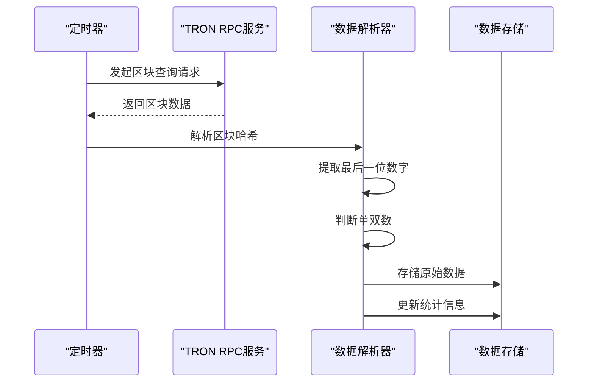

**图表来源**
- [src/services/TronRPCService.ts](file://src/services/TronRPCService.ts#L40-L80)
- [src/services/BlockDataService.ts](file://src/services/BlockDataService.ts#L40-L80)

### 智能数据解析

系统能够自动解析区块哈希，提取最后一个阿拉伯数字并判断其单双数：

- **哈希解析算法**：从TRON区块哈希字符串中提取最后一位数字
- **单双数判断**：基于数学运算判断数字的奇偶性
- **数据验证**：确保解析过程的准确性和完整性

### 统计分析功能

提供多层次的统计分析功能：

- **实时统计**：显示今日总区块数、单数区块数、双数区块数及比例
- **历史数据**：支持按日期查询历史统计数据
- **趋势分析**：提供24小时内的数据趋势图表
- **打点计分**：基于单双数规律的智能计分系统

**章节来源**
- [src/services/BlockDataService.ts](file://src/services/BlockDataService.ts#L1-L100)
- [src/models/BlockModel.ts](file://src/models/BlockModel.ts#L1-L100)

## 技术架构

### 技术栈组成

Point-Tron采用现代化的技术栈构建：

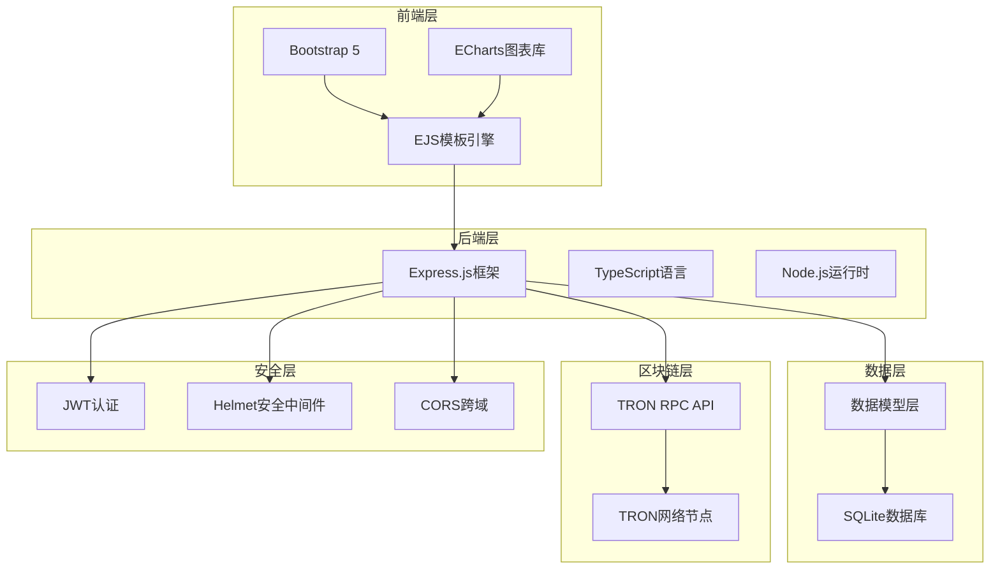

**图表来源**
- [package.json](file://package.json#L15-L25)
- [src/index.ts](file://src/index.ts#L1-L50)

### 架构设计原则

- **模块化设计**：清晰的分层架构，便于维护和扩展
- **类型安全**：充分利用TypeScript的类型系统
- **异步处理**：全面采用Promise和async/await模式
- **错误处理**：完善的错误捕获和重试机制
- **性能优化**：合理的缓存策略和数据库索引

**章节来源**
- [src/index.ts](file://src/index.ts#L1-L163)
- [package.json](file://package.json#L1-L39)

## 系统架构概览

### 整体架构图

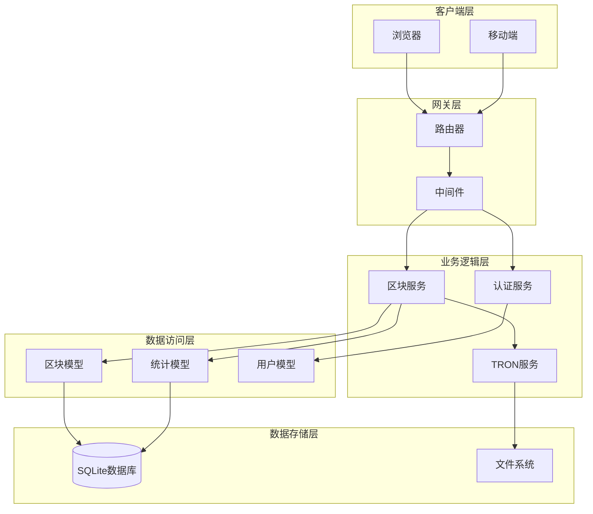

**图表来源**
- [src/index.ts](file://src/index.ts#L1-L163)
- [src/routes/blocks.ts](file://src/routes/blocks.ts#L1-L50)

### 数据流向

系统的数据流遵循清晰的层次结构：

1. **外部请求**：客户端发起HTTP请求
2. **路由处理**：Express路由接收并分发请求
3. **中间件处理**：认证、日志、安全等中间件处理
4. **业务逻辑**：调用相应的服务层处理业务
5. **数据持久化**：将处理后的数据存储到数据库
6. **响应返回**：将结果返回给客户端

**章节来源**
- [src/index.ts](file://src/index.ts#L40-L80)
- [src/routes/blocks.ts](file://src/routes/blocks.ts#L1-L141)

## 核心组件分析

### TRON RPC服务组件

TRON RPC服务是整个系统的核心组件，负责与TRON网络进行交互：

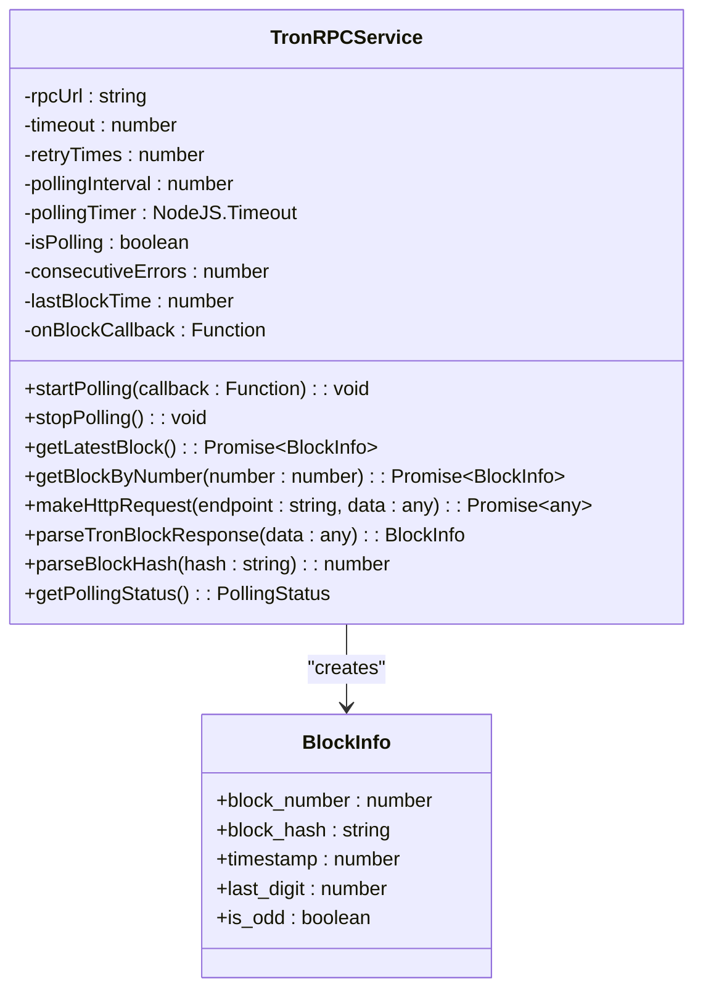

**图表来源**
- [src/services/TronRPCService.ts](file://src/services/TronRPCService.ts#L15-L50)
- [src/models/types.ts](file://src/models/types.ts#L1-L20)

#### 关键特性

- **轮询机制**：每3秒自动轮询最新的区块数据
- **重试策略**：支持指数退避的重试机制
- **错误处理**：完善的错误捕获和恢复机制
- **数据解析**：自动解析区块哈希并提取关键信息

### 区块数据服务组件

区块数据服务负责处理和存储从TRON网络获取的区块数据：

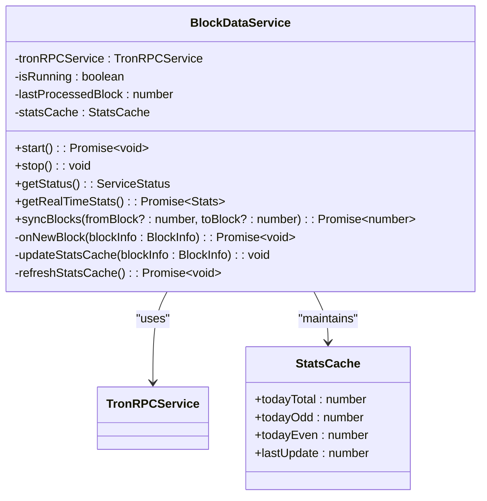

**图表来源**
- [src/services/BlockDataService.ts](file://src/services/BlockDataService.ts#L10-L50)

#### 核心功能

- **数据处理**：接收新区块数据并进行预处理
- **统计更新**：实时更新今日统计数据
- **缓存管理**：维护高效的内存缓存
- **数据同步**：支持手动数据同步功能

### 数据模型层

数据模型层提供了完整的数据抽象和操作接口：

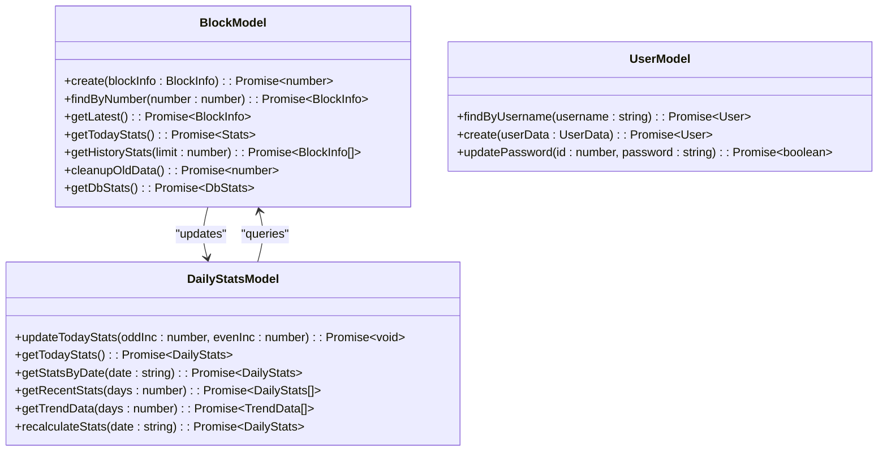

**图表来源**
- [src/models/BlockModel.ts](file://src/models/BlockModel.ts#L1-L50)
- [src/models/DailyStatsModel.ts](file://src/models/DailyStatsModel.ts#L1-L50)

**章节来源**
- [src/services/TronRPCService.ts](file://src/services/TronRPCService.ts#L1-L199)
- [src/services/BlockDataService.ts](file://src/services/BlockDataService.ts#L1-L199)

## 数据流分析

### 数据采集流程

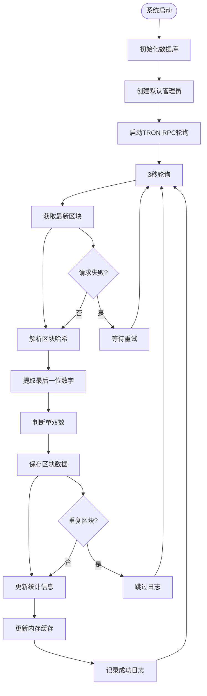

**图表来源**
- [src/services/BlockDataService.ts](file://src/services/BlockDataService.ts#L40-L80)
- [src/services/TronRPCService.ts](file://src/services/TronRPCService.ts#L80-L120)

### 数据处理管道

系统采用管道式的数据处理架构：

1. **原始数据获取**：从TRON RPC API获取原始区块数据
2. **数据清洗**：解析哈希、提取关键字段、验证数据完整性
3. **业务处理**：判断单双数、计算统计指标
4. **持久化存储**：将处理后的数据存储到SQLite数据库
5. **缓存更新**：更新内存缓存以提高查询性能
6. **通知机制**：触发相关事件和回调函数

### API接口设计

系统提供RESTful API接口供前端调用：

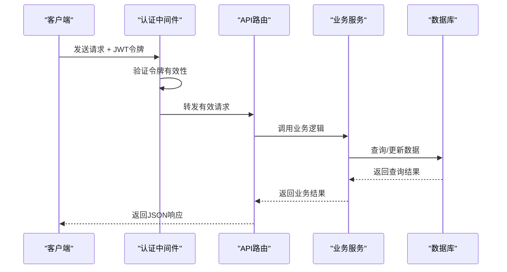

**图表来源**
- [src/routes/blocks.ts](file://src/routes/blocks.ts#L1-L50)
- [src/middleware/auth.ts](file://src/middleware/auth.ts)

**章节来源**
- [src/services/BlockDataService.ts](file://src/services/BlockDataService.ts#L40-L120)
- [src/routes/blocks.ts](file://src/routes/blocks.ts#L1-L141)

## 数据库设计

### 表结构设计

Point-Tron采用SQLite作为数据存储，设计了多个专门的表来存储不同类型的数据：

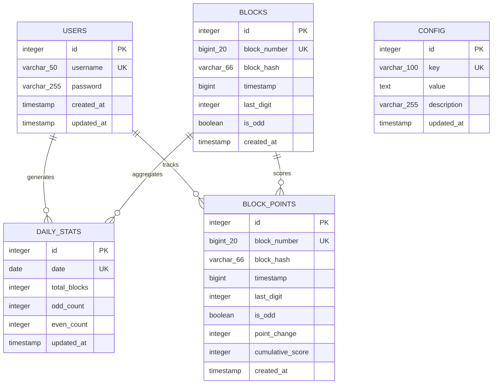

**图表来源**
- [src/database/index.ts](file://src/database/index.ts#L60-L120)

### 数据关系说明

- **用户表**：存储系统用户信息，支持基本的用户认证功能
- **区块表**：存储从TRON网络获取的所有区块原始数据
- **每日统计表**：按天聚合的统计数据，提供高效的历史查询
- **配置表**：存储系统配置信息，支持动态配置管理
- **打点计分表**：基于单双数规律的智能计分系统

### 索引优化

系统为关键查询字段建立了适当的索引：

- **区块号索引**：加速按区块号查询
- **时间戳索引**：优化时间范围查询
- **日期索引**：提升按日期统计的效率
- **唯一约束**：确保数据的完整性和一致性

**章节来源**
- [src/database/index.ts](file://src/database/index.ts#L60-L150)
- [src/models/BlockModel.ts](file://src/models/BlockModel.ts#L1-L100)

## 部署与配置

### 环境配置

系统支持通过环境变量进行灵活配置：

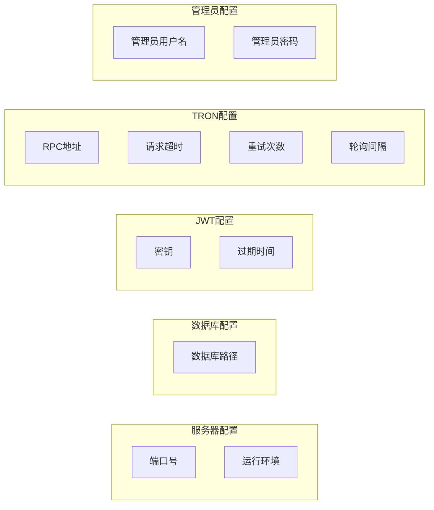

**图表来源**
- [src/config/index.ts](file://src/config/index.ts#L1-L52)

### 部署步骤

1. **环境准备**：确保Node.js版本>=16.0.0
2. **依赖安装**：运行`npm install`安装所有依赖
3. **配置设置**：复制`.env.example`为`.env`并配置参数
4. **编译构建**：运行`npm run build`编译TypeScript
5. **启动服务**：运行`npm start`启动应用
6. **访问系统**：通过浏览器访问`http://localhost:3000`

### 生产环境优化

- **进程管理**：建议使用PM2等进程管理工具
- **负载均衡**：支持多实例部署
- **监控告警**：集成系统健康检查
- **备份策略**：定期备份SQLite数据库文件

**章节来源**
- [src/config/index.ts](file://src/config/index.ts#L1-L52)
- [README.md](file://README.md#L40-L80)

## 性能特点

### 实时性能

- **轮询间隔**：3秒的轮询间隔确保数据的实时性
- **并发处理**：支持高并发的API请求处理
- **内存缓存**：关键统计数据缓存在内存中
- **数据库优化**：合理的索引和查询优化

### 扩展性设计

- **模块化架构**：各组件职责明确，便于独立扩展
- **插件机制**：支持第三方服务的集成
- **配置驱动**：通过配置即可调整系统行为
- **API标准化**：统一的API接口设计

### 可靠性保障

- **错误重试**：自动重试机制应对网络波动
- **数据校验**：多重数据验证确保数据质量
- **事务处理**：数据库事务保证数据一致性
- **健康检查**：完善的系统状态监控

## 故障排除指南

### 常见问题

#### 数据库连接失败

**症状**：应用启动时报数据库连接错误
**解决方案**：
1. 检查`data/`目录是否存在
2. 确保应用有对该目录的写入权限
3. 验证数据库文件的完整性

#### TRON网络连接超时

**症状**：RPC请求频繁超时或失败
**解决方案**：
1. 检查网络连接状态
2. 尝试更换不同的RPC节点地址
3. 调整超时时间和重试次数配置

#### 端口占用问题

**症状**：应用无法绑定到指定端口
**解决方案**：
1. 修改`.env`中的`PORT`配置
2. 使用命令`lsof -ti:3000`查找占用进程
3. 杀死占用进程或选择其他端口

### 调试技巧

系统提供了丰富的调试信息：

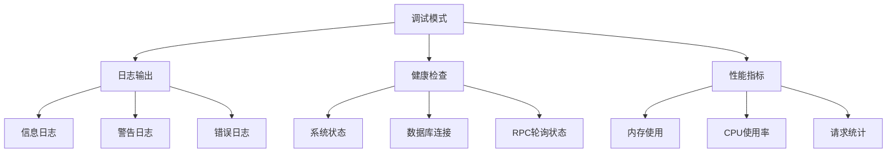

**图表来源**
- [src/index.ts](file://src/index.ts#L80-L120)

### 测试验证

系统自带完整的测试套件：

- **健康检查测试**：验证系统基本功能
- **认证测试**：验证用户登录和权限控制
- **数据查询测试**：验证API接口功能
- **系统状态测试**：验证各项配置和状态

**章节来源**
- [test.js](file://test.js#L1-L137)
- [README.md](file://README.md#L200-L250)

## 总结

Point-Tron作为一个专业的区块链数据统计系统，具有以下显著特点：

### 技术优势

- **实时性强**：3秒轮询机制确保数据的及时性
- **架构清晰**：模块化设计便于维护和扩展
- **类型安全**：TypeScript提供强大的类型安全保障
- **性能优异**：合理的缓存和索引设计提升查询效率

### 功能特色

- **智能统计**：基于区块链特性的创新统计方法
- **可视化丰富**：多种图表和界面展示数据
- **安全可靠**：完善的认证和安全机制
- **易于部署**：简单的配置和部署流程

### 应用价值

- **研究分析**：为区块链研究提供数据支持
- **监控预警**：实时监控网络状态和异常
- **决策支持**：基于数据的业务决策参考
- **教育学习**：区块链技术的实际应用案例

Point-Tron不仅是一个功能完善的数据统计系统，更是区块链技术应用的优秀实践，为开发者和研究人员提供了宝贵的参考价值。通过其开源的特性，社区可以共同参与改进和完善这个系统，推动区块链数据分析领域的发展。